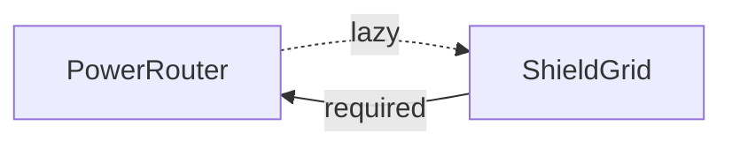

# Lazy Dependencies and Cycles

In a perfect world, every dependency graph is a Directed Acyclic Graph (DAG), meaning there are no loops. However, in complex systems, you occasionally encounter **Circular Dependencies**, where Service A depends on Service B, and Service B depends back on Service A.

Because NexusDI validates the entire graph at startup to guarantee stability, it will detect these loops and reject with `NEXUS_BLUEPRINT_INVALID`, whose `errors` list holds `NEXUS_CIRCULAR_DEPENDENCY`. `lazy()` is the only way to express a cycle: every other cycle fails before any constructor or `onInit` runs.

## Detecting a Cycle

NexusDI compiles the whole graph before it builds anything, so a cycle of required dependencies never reaches a constructor. In this example, `PlasmaRouter` needs the shield grid to divert power, and `DeflectorGrid` needs the power router to draw it:

```mermaid caption="POWER_ROUTER depends on SHIELD_GRID, and SHIELD_GRID depends on POWER_ROUTER: a ring with no lazy edge."
flowchart LR
  PowerRouter:::accent -->|required| ShieldGrid
  ShieldGrid -->|required| PowerRouter
```

```ts file=examples/meridian/src/pages/lazy.md region=cycle

```

The inner [NEXUS_CIRCULAR_DEPENDENCY](/errors/NEXUS_CIRCULAR_DEPENDENCY/) carries the ring as its `path`, which starts and ends at the same provider: `PowerRouter -> ShieldGrid -> PowerRouter`.

**Try it:** Save the region as `cycle.ts` and run `npx tsx cycle.ts`. It prints `[ 'NEXUS_CIRCULAR_DEPENDENCY' ]` and then the ring. The next section shows the fix.

## Cycles of Any Length

A cycle does not have to be two providers pointing at each other. NexusDI finds cycles with a strongly connected component search over the whole graph, so it reports a self-dependency, a ring of three providers and a ring that crosses module boundaries the same way. Here `NavComputer` needs the helm, `HelmControl` needs the thrusters, and `ThrusterBank` needs the nav computer:

```mermaid caption="NAV_COMPUTER depends on HELM_CONTROL, HELM_CONTROL on THRUSTER_BANK, and THRUSTER_BANK on NAV_COMPUTER: a ring of three with no lazy edge."
flowchart LR
  NavComputer:::accent -->|required| HelmControl
  HelmControl -->|required| ThrusterBank
  ThrusterBank -->|required| NavComputer
```

```ts file=examples/meridian/src/pages/lazy.md region=indirect-cycle

```

The `path` lists the whole ring from its first provider back to it.

**Try it:** Save the region as `ring.ts` and run `npx tsx ring.ts`. It prints `NavComputer -> HelmControl -> ThrusterBank -> NavComputer`.

### Overlapping Rings

Two rings can share providers. NexusDI reports one `NEXUS_CIRCULAR_DEPENDENCY` for each group of providers that reach each other, with one ring from that group as its `path`, so one error covers both rings. A lazy edge on the part both rings share breaks both. A lazy edge on only one ring leaves the other, and the next run reports that one.

## Breaking Cycles with `lazy()`

When a cycle is unavoidable, you can break the loop using the `lazy()` wrapper.

A `lazy()` dependency tells NexusDI: "Don't resolve this token during the initial build; instead, give me a function (a thunk) that I can call later to get the instance." NexusDI leaves lazy edges out of its cycle check.



```ts file=examples/meridian/src/pages/lazy.md region=lazy-fix

```

By making just one edge in the cycle lazy, you break the loop. The container can now finish starting up, and your code can resolve the dependency at runtime by calling the thunk.

**Try it:** Save the region as `lazy.ts` and run it. It prints `0.4`. Mark the other edge lazy too: change `DeflectorGrid`'s deps to `[lazy(POWER_ROUTER)] as const` and its parameter to `readonly router: () => IPowerRouter`. Run it again: it still prints `0.4`, since one lazy edge is enough and two are allowed. Change `DeflectorGrid` back to the plain edge when you are done.

The same fix works on a ring of three. `ThrusterBank` takes `lazy(NAV_COMPUTER)`, and any edge of the ring would do:

```ts file=examples/meridian/src/pages/lazy.md region=indirect-fix

```

**Try it:** Save the region as `ring-fixed.ts` and run it. It prints `course to Kepler-442b`. Move the `lazy()` to another edge: make `Astrogator` take `[lazy(HELM_CONTROL)] as const` with a `() => IHelmControl` parameter and call `this.helm().steer()`, and change `IonThrusters` back to `[NAV_COMPUTER] as const` with an `INavComputer` parameter. It still prints `course to Kepler-442b`.

## Why `lazy()` is Opt-In

You might wonder why NexusDI doesn't just make every dependency lazy by default. There are several critical reasons:

1. **CI Stability:** Required dependencies are checked in CI. Lazy dependencies can hide wiring errors that only appear at runtime.
2. **Lifecycle Integrity:** `onInit` and disposal run in a specific order. A lazy dependency is created _after_ its consumer, meaning it might be disposed of _before_ the consumer is finished.
3. **Synchronous Guarantees:** `get()` must be synchronous. Since async factories must be resolved at startup, a lazy edge to an async provider would be impossible to resolve synchronously on first use.
4. **Architectural Health:** Cycles often signal that two services are too tightly coupled. Forcing an explicit `lazy()` call makes this architectural smell visible during code review.

With lazy by default, the same graph would start, and the ring would show only at run time, when a call goes round it. A cycle fails `Nexus.check` in CI today. `onInit` runs in dependency order, and disposal runs in reverse creation order (see [Lifecycle and Disposal](/lifecycle/)). A dependency built on its first call is built _after_ its consumer, so NexusDI disposes it first, and the consumer keeps running at shutdown after its dependency has closed. A lazy edge to an async provider that is built on first use fails with [NEXUS_LAZY_ASYNC](/errors/NEXUS_LAZY_ASYNC/). A cycle usually means two services share a responsibility. Moving that responsibility into a third provider removes the cycle, and an explicit `lazy()` keeps each real exception visible in code review.

Other frameworks make the same choice. Spring Boot 2.6 [prohibits circular references by default](https://github.com/spring-projects/spring-boot/wiki/Spring-Boot-2.6-Release-Notes), and NestJS [needs `forwardRef()`](https://docs.nestjs.com/fundamentals/circular-dependency) on both sides of a circular dependency.

## The "Not Ready" State

Because a `lazy()` thunk defers resolution, you cannot call it too early. A thunk resolves only once its target is ready: built, with its `onInit` finished.

If you call a lazy thunk inside a constructor or an `onInit()` method, the target service might not have been built yet. In this case, NexusDI throws `NEXUS_NOT_READY`. See [NEXUS_NOT_READY](/errors/NEXUS_NOT_READY/). The error names the `owner` that called the thunk and the `target` it asked for. `Nexus.create` reports the failure as [NEXUS_PROVIDER_FAILED](/errors/NEXUS_PROVIDER_FAILED/) with `NEXUS_NOT_READY` as its `cause`.

```ts file=examples/meridian/src/pages/lazy.md region=not-ready

```

NexusDI calls `onInit` level by level, dependencies first, and a lazy edge does not order the levels, so `PlasmaRouter`'s `onInit` can run before `DeflectorGrid` is ready and throw the same code.

**The Rule:** Always call lazy thunks within regular methods that are executed _after_ `Nexus.create` has fully resolved.

**Try it:** Save the region as `not-ready.ts` and run it. It prints `NEXUS_PROVIDER_FAILED` and then `NEXUS_NOT_READY`. Now move the call out of the constructor. Keep the thunk in a field with `constructor(private readonly shields: () => IShieldGrid) {}`, and replace `reserve` in `IPowerRouter` and `PlasmaRouter` with a `divert(): number` method that returns `this.shields().draw()`. Replace the `Nexus.create(...).catch(...)` block and the prints with `await using ship = await Nexus.create(...)` and `console.log(ship.get(POWER_ROUTER).divert());`. It prints `0.4`. Put the call back in the constructor and the two codes return.
