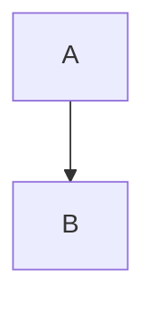

# NexusDI Docs Site, Phase 1 Implementation Plan

> For agentic workers: REQUIRED SUB-SKILL: use superpowers:subagent-driven-development (recommended) or superpowers:executing-plans to implement this plan task by task. Steps use checkbox (`- [ ]`) syntax for tracking.

Goal: put `/next/` live on nexus.js.org during the 0.4 RC window, with the pages spec §18.1 lists, and make the `rc` and `final` deploys unable to break without a red check.

Refreshed on 2026-10-01 against `@nexusdi/core@0.4.0-rc.0` (tag on `release/0.4` at `8824502`). The plan at `7262c60` was written before rc.0 and before any of it ran; the section "Where the 69 tasks of `7262c60` went" maps each old task to its new task, to "done at the rc.0 tag", or to a later phase.

Architecture: `apps/docs` is a Next 16 and Nextra 4 static export served by GitHub Pages behind Cloudflare. `docs.yml` runs on `main` only. In `rc` mode it serves the 0.3 Docusaurus snapshot at the root and builds `/next/` from the highest `release/X.Y` branch ahead of `main` (today `release/0.4`). Every region a page cites is a whole program in `examples/meridian/src/{pages,errors}/*.md`, run as a doctest and type-checked. Error messages link to `https://nexus.js.org/errors/<CODE>`, so the site holds one page per code, and in `rc` mode the root answers each code URL with a stub to `/next/errors/<CODE>/`. One script, `apps/docs/tools/deploy/build-site.mjs`, builds both sites for `docs.yml` and for the CI `docs` job, which checks an `rc` and a `final` artifact on every docs change. The benchmark pages render every figure from `benchmarks/results/` through `docs:benchmark-data`.

Tech stack: Nx 23.1.1, TypeScript 6.0.3, Vitest 4.1.9, Next 16.3.4, Nextra 4.6.1, React 19.3.0, Pagefind 1.5, Tailwind 4.3, valibot 1.5.0, Playwright, GitHub Actions, Docusaurus 3.8.1 (snapshot only).

Spec: `specs/2026-09-23-docs-site-design.md` on `spec/docs-site`, refreshed on 2026-10-01 (sections 2, 3.3, 4, 5, 6, 15, 18 to 21). It depends on the code at the rc.0 tag, on core spec revision 2 (`plan/core-0.4-engine` at `5a7f76e`), on the extension principle spec (`spec/package-owned-errors` at `34421a8`) and on the release-branch workflow spec (`spec/release-workflow` at `aaae949`). Section numbers below refer to the docs spec unless they say otherwise. Where a spec and the code at the rc.0 tag disagree, the code wins; spec §21 lists each case.

## Global Constraints

Every task's requirements include this section.

Branches and commits:

- Group M commits to `fix/docs-pipeline`, from `origin/main` (Task 1). `docs.yml` runs from `main`, and the CI `docs` job checks pull requests into `main`, so the build pipeline lands there first. Its pull request into `main` is merged by the owner, and the owner's `sync` event of `RELEASING.md` carries it to `release/0.4` (Task 13).
- Groups A to Z commit to `feat/docs-phase-1`, from `origin/release/0.4` after that sync (Task 14). The pages teach the 0.4 API and `examples/meridian` runs against `libs/` on that branch; features for a line target `release/X.Y` (release spec §4.1). Its pull request goes into `release/0.4` (Task 81).
- The switch to `rc` is one pull request on `main` (Task 82), after a green `rehearse: rc` run of `docs.yml`.
- Owner-only steps, which a task prepares and then waits for: merging into `main` and into `release/0.4` (the sync, phase 1 itself and the benchmark results pull request #73), dispatching the release workflow (the `sync` event) and `docs-snapshot.yml`, GitHub settings (rulesets, required checks, labels, the pinned Discussion). No task publishes to npm. An agent may dispatch `docs.yml` with `rehearse`, which deploys nothing.
- Commit scopes: `docs` (apps/docs and the pages), `docs-e2e` (apps/docs-e2e), `meridian-ui` (internal/meridian-ui), `meridian` (examples/meridian), `doc-examples` (tools/doc-examples), `repo` (tools/repo-checks, root config, `.github` files other than workflows), `ci` (workflows), `specs`. None of these projects is released, so scope choice changes no version.
- A commit made by an agent ends with the attribution line the session's system reminder gives.

Generators and workspace wiring:

- `apps/docs` exists at the rc.0 tag; no task scaffolds it. Scaffold each new project with its generator and revert root collateral per CONTRIBUTING.md "Running `nx g`": restore `nx.json` from git and re-add by hand only the plugin entry the generator added; remove any `verdaccio`, `local-registry` or `.verdaccio/`. `tools/repo-checks/src/generator-collateral.test.ts` fails on leftovers.
- `apps/docs-e2e`: `npx nx g @nx/js:library` then `npx nx g @nx/playwright:configuration`. `internal/meridian-ui`: `npx nx g @nx/react:library internal/meridian-ui --bundler=vite`. `examples/meridian`: `npx nx g @nx/js:library examples/meridian --bundler=none --unitTestRunner=vitest`.
- Package names match folder names (`project-folder-name` guard): `@nexusdi/docs`, `@nexusdi/docs-e2e`, `@nexusdi/meridian-ui`, `@nexusdi/meridian`. Every one is `private: true`. `nx.json`'s `release.projects` stays `["libs/*"]`. The workspaces `apps/*` and `internal/*` and the five docs scopes exist at the rc.0 tag.
- Lint, format and typecheck are wired before a project's second file exists. `npx prettier --write` runs before every commit.

Pinned versions (exact unless a caret is shown):

- `next` 16.3.4, `nextra` 4.6.1, `nextra-theme-docs` 4.6.1, `react` and `react-dom` 19.3.0, `next-themes` 0.4.6, `pagefind` ^1.5.2, `tailwindcss` and `@tailwindcss/postcss` ^4.3.3, `mermaid` ^11.17.2, `yaml` ^2.9.0.
- `valibot` 1.5.0 exactly in `examples/meridian`.
- `typescript` 6.0.3 (root pin), `@nx/next` 23.1.1.
- The libraries repo pin, `LIBS_SHA`, is `0332f43530e781566932ee9dcc0dfa9a45f52cf4`. Every copy fetches `https://raw.githubusercontent.com/Evanion/libraries/0332f43530e781566932ee9dcc0dfa9a45f52cf4/<path>`, and the commit that adds a copy names the SHA.
- The runtime pins of the plan at `7262c60` (CodeMirror, `@typescript/vfs`, `@evanion/widget`, `@evanion/react-widget`, esbuild for the runtime) move to phase 2 with the runtime and the console.

Design values (spec §8):

- Contrast floors: 4.5:1 for every text role, 3:1 for `control-border`. Dark text is measured on `#2d314d` (the `#0b1030` surface at 86% over white); light text on `#e6eaf7`; light `control-border` on `#fdfdfe`.
- Motion: 140 ms interaction, 200 ms console, `cubic-bezier(0.2, 0.8, 0.3, 1)`; 0 ms under `prefers-reduced-motion: reduce`.
- Phase 1 paints the static ground gradient of §8.5; the animated background of §9 is phase 2.

Site values:

- `basePath` comes from `DOCS_BASE_PATH` (`/next` for the `/next/` build, empty for the root build) through `readBasePath()`. `DOCS_CHANNEL` is `next` or `release`; `next` leaves `content/blog/` out, its routes and its `.md` siblings alike.
- `output: 'export'`, `images: { unoptimized: true }`, `trailingSlash: true`, Nextra `search: { codeblocks: false }`.
- `content/` holds two folders: `blog/` (amendment A2) and `errors/` (amendment A3, the Errors concept page at `errors/index.mdx` and one `errors/<CODE>.mdx` per first-party error code, hidden from the sidebar).
- Page kinds: `overview`, `tutorial`, `concept`, `question`, `platform`, `contract`, `reference`, `code`, `blog`, `post`.
- Examples: `examples/meridian/src/pages/<slug>.md` and `examples/meridian/src/errors/<CODE>.md`. Each region is a `ts @import.meta.vitest` block between `<!-- #region name -->` markers, a whole program with its own imports. A claimed value is bound on a one-line `const` with `// -> value` and printed on the next line. Every import line and every claim line stays at or under 80 characters, so prettier wraps neither (a wrapped import or claim breaks the doctest rewrite). No block declares `NexusRequest`; `examples/meridian/src/request.d.ts` declares it once.
- The reference loader's `classPrefix` is `nexus`.
- Every generated path is gitignored. Hand-written fixtures live under `__fixtures__/` and are committed.
- `apps/docs/deploy.json` modes: `snapshot-only`, `rc`, `final`, `retired`. `main` reads `snapshot-only` until Task 82. The snapshot source is `6d5e4f3`, the release `docs-snapshot-0.3`.
- Workflow action pins: `actions/checkout@3d3c42e5aac5ba805825da76410c181273ba90b1` (v7.0.1), `actions/setup-node@820762786026740c76f36085b0efc47a31fe5020` (v7.0.0), `actions/configure-pages@45bfe0192ca1faeb007ade9deae92b16b8254a0d` (v6.0.0), `actions/upload-pages-artifact@fc324d3547104276b827a68afc52ff2a11cc49c9` (v5.0.0), `actions/deploy-pages@368f82528645a54fb793d4d04e342629a3f51346` (v5.0.1). Docs jobs read Node from `.nvmrc`.

Writing rules for prose in this plan, in every page and in every error message a task writes: no em dashes or en dashes, no bold lead-ins, no antithesis ("not X but Y", "X rather than Y", "instead of"), no gerund subjects, no metaphor verbs (bites, lands, buys, costs, earns, pays, survives, ships), no filler openers, no table under four rows, never the word "native", never a named metadata library. Every example after `/getting-started/` is interface-first: `Token<IFoo>` and `useClass`, never a class bound as another class's dependency. Every page has the reader run, break and fix what it teaches (spec decision 33). Code and commands are exempt from the prose rules.

## Review Focus

These six inputs sit outside what the spec names and outside every other task's tests. Each line names the owning task, which carries the test or the check.

1. The sync of `main` into `release/0.4` meets both branches' appends to `tools/doc-examples/src/index.ts`. The sync job stops on the conflict; the owner keeps both export lists (Task 13).
2. The 0.3 snapshot already holds a file at a root path the `rc` assembly writes a code stub to. The stub never overwrites it, and the artifact check fails when the file there does not point at `/next/errors/<CODE>/` (Task 8).
3. `deploy.json` reads `final` on a tree with no `content/blog/`. `docs-deploy` fails the pull request, and `build-site.mjs` fails the root build with the fix (Tasks 9 and 7).
4. `md-siblings` keys a folder page as `errors/X.md` or as `errors/X/index.md`. The artifact rule and the e2e test accept both (Tasks 4 and 8).
5. `benchmarks/results/` on `release/0.4` holds no timings and no `build.json` until results pull request #73 merges. Task 74 stops until it has, and `docs:benchmark-data` fails the build when the results' core `major.minor` differs from `libs/core/package.json`, so `/comparison/` never shows 0.3 figures as 0.4.
6. A pull request that touches no docs input. The CI `docs` job ends green after the diff, in seconds, so it can be a required check without slowing other work (Task 10).

---

## File structure

What phase 1 creates or changes. Paths are workspace-relative.

- `apps/docs/` (`@nexusdi/docs`, exists): `app/layout.tsx`, `app/global.css`, `app/meridian-theme.ts`, `app/navigation.ts`, `app/release-state.ts`, `app/(site)/[[...mdxPath]]/page.tsx` and `page-metadata.ts`; `components/ReleaseNotice.tsx`, `components/blog/`, `components/listing/`, `components/diagram/`, `components/benchmarks/`; `content/` (the pages, `blog/`, `errors/`); `commitments.json`; `mdx-components.js`; `next.config.ts`; `tools/md-siblings.mjs`, `tools/pagefind.mjs`, `tools/blog-feed.mjs`, `tools/check-budgets.mjs`, `tools/benchmark-data.mjs`, `tools/loader-chain.mjs`, `tools/mdx-listing-loader.mjs`, `tools/mdx-diagram-loader.mjs`; `tools/deploy/build-site.mjs`, `tools/deploy/docs-changed.mjs`, and changes to `assemble.mjs`, `check-artifact.mjs` and `smoke.mjs`.
- `apps/docs-e2e/` (`@nexusdi/docs-e2e`, new): the Playwright suite and `src/support/pages-server.mjs`, a static server with GitHub Pages behaviour, run against an assembled `rc` artifact.
- `internal/meridian-ui/` (`@nexusdi/meridian-ui`, new): `src/tokens/*.ts`, `src/tokens.generated.css`, `src/styles.css`, `src/components/*.tsx`, `tools/generate-tokens.ts`, `src/visual-check.html`.
- `examples/meridian/` (`@nexusdi/meridian`, new): `src/pages/*.md`, `src/errors/*.md`, `src/request.d.ts`, `src/examples.typecheck.test.ts`.
- `tools/doc-examples/` (exists): gains `regions.mjs`, `preamble.mjs`, `mdx-region-loader.mjs`, `declarations.mjs`, `behaviours.mjs`, `mdx-reference-loader.mjs`, `md-siblings.mjs` with their `.d.mts` files.
- `tools/repo-checks/src/`: the phase 1 guards (`doc-navigation`, `doc-floor`, `doc-fence`, `doc-exports`, `doc-links`, the prose guards, `doc-domain`, `doc-interface-first`, `doc-regions`, `doc-md-siblings`, `diagram-captions`, `doc-commitments`, `doc-error-codes`, `doc-benchmark-figures`), `docs-ci-job`, `workflow-release-latest`, and the `docs-deploy` blog rule. Fixtures live in `__fixtures__/docs/<guard>/{clean,sabotaged}/`.
- `.claude/agents/docs-reviewer.md`, `.claude/skills/docs-page/SKILL.md`: the ported reviewer and skill.
- `.github/workflows/docs.yml` (build script, `rehearse` input), `.github/workflows/ci.yml` (the `docs` job), `.github/ISSUE_TEMPLATE/04-rc-feedback.yml` and `.github/labels.json` (on `main`), the RC post in `apps/docs/snapshot/blog/`.

## Task index

Group M, the pipeline on `main`. Commits go to `fix/docs-pipeline` from `origin/main`. `docs.yml` builds from `main`, so `postbuild`, the budget checker, the blog index, the shared build script and the CI `docs` job land there before any page, and reach `release/0.4` through the owner's sync.

1. The pipeline branch and its baseline
2. Regions, preamble and the region loader
3. Declarations, behaviours and the reference loader with `classPrefix`
4. `.md` siblings
5. Pagefind, `postbuild` and the budget checker
6. The blog index and its feeds on `main`
7. One build script for `docs.yml` and CI, and the `rehearse` input
8. Root stubs for the error codes and the phase 1 artifact rules
9. `docs-deploy` refuses `final` without the blog
10. The CI `docs` job builds and checks `rc` and `final` on every docs change
11. Every `gh release create` sets `--latest`
12. The RC feedback form and the RC announcement draft on `main`
13. Land the pipeline on `main` and sync it to `release/0.4`

Group A, the branch on `release/0.4` and the e2e project. Commits go to `feat/docs-phase-1` from `origin/release/0.4`, from here to Task 81.

14. The implementation branch on `release/0.4`
15. Scaffold `apps/docs-e2e` and the GitHub Pages server

Group B, the shell.

16. Root layout, fonts and navigation
17. Content route: release notice, robots and canonical URLs
18. Listing, diagram, region and reference loaders in the MDX chain

Group C, `meridian-ui`.

19. Scaffold `internal/meridian-ui`
20. Colour tokens and the contrast test
21. Remaining tokens and the generated stylesheet
22. Stateless components and the React allowlist
23. The Nextra remap in `global.css`

Group D, `examples/meridian`.

24. `examples/meridian` with its doctests and the type-check test

Group E, the guards and the ported reviewer. Each guard lands with an allowance for the phase 1 pages not yet written; each page task removes its own entries.

25. G1 `doc-navigation` and G2 `doc-floor`
26. G3 `doc-fence`
27. G5 `doc-exports`
28. G7 `doc-links`
29. G8 and the prose guards
30. G9 `doc-domain`
31. `doc-interface-first`
32. Regions, siblings and captions guards
33. `doc-commitments`
34. `doc-error-codes`
35. Port the reviewer agent and the `docs-page` skill

Group P, the pages. One task per page, in the order of spec §4.3. Each task writes the examples file, the page that cites it, and the `_meta.ts` entry, then removes the page from the allowances.

36. Page `/`, NexusDI
37. Page `/getting-started/`, Getting started
38. Page `/tokens/`, Tokens and interfaces
39. Page `/providers/`, Providers
40. Page `/lifetimes/`, Lifetimes
41. Page `/modules/`, Modules
42. Page `/configurable-modules/`, Configurable modules
43. Page `/scopes/`, Scopes and REQUEST
44. Page `/lifecycle/`, Lifecycle and disposal
45. Page `/lazy/`, Lazy edges and cycles
46. Page `/multi-providers/`, Multi-providers
47. Page `/errors/`, Errors
48. Page `/introspection/`, Introspection and trace
49. Page `/plugins/`, How do I register a plugin?
50. Page `/testing/`, How do I replace a provider in a test?
51. Page `/node-request-scopes/`, Scope an HTTP request in Node
52. Page `/load/`, How do I add a module after startup?
53. Page `/decorators/`, How do I write providers with decorators?
54. Page `/legacy-decorators/`, How do I use NexusDI in a project that keeps experimentalDecorators?
55. Page `/interceptors/`, How do I run code around a service's methods?
56. Page `/graph-cli/`, How do I draw my app's dependency graph?
57. Page `/error-text/`, How do I get the full text of every error?
58. Page `/write-a-plugin/`, How do I write a NexusDI plugin?
59. Page `/release-candidate/`, How do I try the 0.4 release candidate?
60. Page `/upgrade/`, How do I upgrade from 0.3 to 0.4?
61. Page `/support-policy/`, 0.3 support policy

Group Q, the code pages. One page per first-party error code (amendment A3), four codes per task for core and three for the others, then the `/api-errors/` index. The eleven code page tasks need only Task 47, Group D and Group E, so they may interleave with the later Group P tasks; each one edits `content/errors/_meta.ts` and the allowances, so they run one at a time.

62. Code pages `/errors/NEXUS_BLUEPRINT_INVALID/`, `/errors/NEXUS_MISSING_PROVIDER/`, `/errors/NEXUS_AMBIGUOUS_PROVIDER/`, `/errors/NEXUS_DUPLICATE_PROVIDER/`
63. Code pages `/errors/NEXUS_INVALID_EXPORT/`, `/errors/NEXUS_INVALID_PROVIDER/`, `/errors/NEXUS_INVALID_TOKEN/`, `/errors/NEXUS_INVALID_MODULE/`
64. Code pages `/errors/NEXUS_MISSING_DEPS/`, `/errors/NEXUS_CIRCULAR_DEPENDENCY/`, `/errors/NEXUS_LIFETIME_VIOLATION/`, `/errors/NEXUS_MODULE_IMPORT_CYCLE/`
65. Code pages `/errors/NEXUS_MODULE_OPTIONS_MISSING/`, `/errors/NEXUS_LOAD_GLOBAL_MODULE/`, `/errors/NEXUS_INVALID_MODULE_OPTIONS/`, `/errors/NEXUS_PROVIDER_FAILED/`
66. Code pages `/errors/NEXUS_NOT_READY/`, `/errors/NEXUS_ASYNC_TRANSIENT/`, `/errors/NEXUS_LAZY_ASYNC/`, `/errors/NEXUS_NOT_VISIBLE/`
67. Code pages `/errors/NEXUS_SCOPE_REQUIRED/`, `/errors/NEXUS_REQUEST_MISSING/`, `/errors/NEXUS_LOADED_AFTER_SCOPE/`, `/errors/NEXUS_DISPOSED/`
68. Code pages `/errors/NEXUS_PLUGIN_INVALID/`, `/errors/NEXUS_PLUGIN_VERSION/`, `/errors/NEXUS_PLUGIN_CONFLICT/`, `/errors/NEXUS_PLUGIN_FAILED/`
69. Code pages of `@nexusdi/decorators` and `@nexusdi/devtools`
70. Code pages of `@nexusdi/federation` and `@nexusdi/testing`
71. Code pages of `@nexusdi/interceptors` at compile
72. Code pages of `@nexusdi/interceptors` at run time
73. Page `/api-errors/`, Error codes

Group R, the benchmark pages. Every figure comes from `benchmarks/results/` through `docs:benchmark-data` and the benchmark components (spec §4.6). `/comparison/` and `/benchmark-method/` land in phase 1; the four `/vs-*/` pages and the charts follow in phase 2.

74. `docs:benchmark-data` and the figure paths
75. The benchmark components
76. `doc-benchmark-figures`
77. Page `/benchmark-method/`, How NexusDI's benchmarks are measured
78. Page `/comparison/`, NexusDI compared with InversifyJS, tsyringe, awilix and needle-di

Group Z, search, the `rc` end-to-end tests, the exit and the switch.

79. Search under `/next/`, anchors included (experiment E3)
80. End-to-end tests against an `rc` artifact
81. Check the phase 1 exit on `release/0.4`
82. Rehearse `rc`, then switch the deploy to `rc` on `main`

82 tasks.

---

## Group M: The pipeline on `main`

Commits go to `fix/docs-pipeline` from `origin/main`. `docs.yml` builds from `main`, so `postbuild`, the budget checker, the blog index, the shared build script and the CI `docs` job land there before any page, and reach `release/0.4` through the owner's sync.

### Task 1: The pipeline branch and its baseline

Files: none change in this task.

Interfaces:

- Consumes: `origin/main` with `4300fa5` ("stop copying a blog into the /next/ worktree build") and `3d956dd` (PR #71, `deploy.json` back in `snapshot-only`).
- Produces: branch `fix/docs-pipeline` from `origin/main`, the branch every Group M task commits to.

Group M lands on `main` first because `docs.yml` runs from `main` (spec §15.3) and the CI `docs` job checks every pull request into `main` as well as into `release/0.4`. `release/0.4` receives Group M through the `sync` event of `RELEASING.md` (Task 13), before Group A starts.

- [ ] Step 1: Confirm the two commits and create the branch

```bash
git fetch origin
git merge-base --is-ancestor 4300fa5 origin/main && echo "4300fa5 on main"
git merge-base --is-ancestor 3d956dd origin/main && echo "3d956dd on main"
git show origin/main:apps/docs/deploy.json | grep '"mode"'
git switch -c fix/docs-pipeline origin/main
npm ci
```

Expected: `4300fa5 on main`, `3d956dd on main`, and `  "mode": "snapshot-only",`. When `mode` reads anything else, stop and tell the owner: the switch to `rc` is Task 82's, after a green rehearsal.

- [ ] Step 2: Record the baseline

Run: `npx nx run-many -t test lint typecheck -p @nexusdi/docs @nexusdi/repo-checks`
Expected: every target exits 0. A failure here predates this plan; report it to the owner before going on.

Run: `ls apps/docs/tools/check-budgets.mjs; node -e "console.log(require('./apps/docs/package.json').scripts)"`
Expected: `ls` reports `No such file or directory` and the second command prints `undefined`. Those two gaps are what failed every `rc` deploy before PR #71 (spec §15.1); Tasks 4 and 5 close them.

### Task 2: Regions, preamble and the region loader

Files:

- Create: `tools/doc-examples/src/regions.mjs`, `regions.d.mts`, `preamble.mjs`, `preamble.d.mts`, `mdx-region-loader.mjs` (copied)
- Create: `tools/doc-examples/src/mdx-region-loader.d.mts`
- Modify: `tools/doc-examples/package.json` (subpath exports)
- Modify: `tools/doc-examples/src/index.ts` (re-exports)
- Test: `tools/repo-checks/src/regions.test.ts` (ported)
- Test: `tools/repo-checks/src/doc-examples-region-loader.test.ts`

Interfaces:

- Consumes: the `@nexusdi/doc-examples` package on `main` (`.` and `./claims` exports).
- Produces: subpaths `@nexusdi/doc-examples/preamble`, `/regions`, `/mdx-region-loader`; `RegionError`, `parseRegions(source, file): Map<string, Region>`, `readRegion(source, file, name): Region`, `PREAMBLE_FILE`, `readPreamble(dir)`, `preamblePath(dir)`, `withPreamble(preamble, code)`, `expandRegions(source, root, file): string`, and the default region loader taking `{ root }`. The root entry re-exports the region and preamble names.

This task commits to `fix/docs-pipeline` (Group M): `postbuild` writes the `.md` siblings through these modules on every branch that builds the site.

- [ ] Step 1: Port the libraries' region tests and write the loader test

```bash
curl -fsSL -o tools/repo-checks/src/regions.test.ts \
  https://raw.githubusercontent.com/Evanion/libraries/0332f43530e781566932ee9dcc0dfa9a45f52cf4/tools/repo-checks/src/regions.test.ts
perl -pi -e 's/\@evanion\/doc-examples/\@nexusdi\/doc-examples/g' tools/repo-checks/src/regions.test.ts
grep -n "@nexusdi/doc-examples" tools/repo-checks/src/regions.test.ts
```

Expected: one line, `import { RegionError, parseRegions, readRegion } from '@nexusdi/doc-examples';`.

`tools/repo-checks/src/doc-examples-region-loader.test.ts`:

````ts
import { mkdirSync, mkdtempSync, rmSync, writeFileSync } from 'node:fs';
import { tmpdir } from 'node:os';
import { join } from 'node:path';

import { expandRegions } from '@nexusdi/doc-examples/mdx-region-loader';
import { RegionError } from '@nexusdi/doc-examples/regions';
import { afterAll, beforeAll, describe, expect, it } from 'vitest';

const fence = '```';
let root: string;

beforeAll(() => {
  root = mkdtempSync(join(tmpdir(), 'nexusdi-regions-'));
  mkdirSync(join(root, 'libs/core'), { recursive: true });
  writeFileSync(
    join(root, 'libs/core/README.md'),
    [
      '# NexusDI',
      '',
      '<!-- #region first-ship -->',
      `${fence}ts`,
      'const frequency = 1420;',
      fence,
      '<!-- #endregion first-ship -->',
      '',
    ].join('\n'),
  );
  writeFileSync(
    join(root, 'libs/core/doc-examples.preamble.ts'),
    "import { Nexus } from '@nexusdi/core';\n",
  );
});

afterAll(() => rmSync(root, { recursive: true, force: true }));

describe('expandRegions', () => {
  it('fills an empty fence from the named README region', () => {
    expect(
      expandRegions(
        `${fence}ts file=libs/core/README.md region=first-ship\n${fence}\n`,
        root,
        'tokens.mdx',
      ),
    ).toBe(`${fence}ts\nconst frequency = 1420;\n${fence}\n`);
  });

  it('puts the README preamble behind a cut in a twoslash fence', () => {
    const out = expandRegions(
      `${fence}ts twoslash file=libs/core/README.md region=first-ship\n${fence}\n`,
      root,
      'tokens.mdx',
    );

    expect(out).toBe(
      `${fence}ts twoslash\nimport { Nexus } from '@nexusdi/core';\n// ---cut---\nconst frequency = 1420;\n${fence}\n`,
    );
  });

  it('drops the placeholder lines an author left inside the fence', () => {
    expect(
      expandRegions(
        `${fence}ts file=libs/core/README.md region=first-ship\nstale\n${fence}\n`,
        root,
        'tokens.mdx',
      ),
    ).not.toContain('stale');
  });

  it('fails the build on a region the README does not have', () => {
    expect(() =>
      expandRegions(
        `${fence}ts file=libs/core/README.md region=missing\n${fence}\n`,
        root,
        'tokens.mdx',
      ),
    ).toThrow(RegionError);
  });

  it('fails the build on a file that does not exist, naming the page', () => {
    expect(() =>
      expandRegions(
        `${fence}ts file=libs/core/NOPE.md region=first-ship\n${fence}\n`,
        root,
        'tokens.mdx',
      ),
    ).toThrow(
      "tokens.mdx: cannot read 'libs/core/NOPE.md', referenced by region 'first-ship'",
    );
  });
});
````

- [ ] Step 2: Run both and confirm they fail

Run: `npx nx test @nexusdi/repo-checks -- regions doc-examples-region-loader`
Expected: FAIL with "Package subpath './mdx-region-loader' is not defined by "exports"" and "does not provide an export named 'RegionError'".

- [ ] Step 3: Copy the modules and add the exports

```bash
BASE=https://raw.githubusercontent.com/Evanion/libraries/0332f43530e781566932ee9dcc0dfa9a45f52cf4/tools/doc-examples/src
for f in regions.mjs regions.d.mts preamble.mjs preamble.d.mts mdx-region-loader.mjs; do
  curl -fsSL -o "tools/doc-examples/src/$f" "$BASE/$f"
done
perl -pi -e 's/\@evanion\/source/\@nexusdi\/source/g; s/\@evanion\/[a-z-]+(\/testing)?/\@nexusdi\/core$1/g' tools/doc-examples/src/regions.mjs tools/doc-examples/src/regions.d.mts tools/doc-examples/src/preamble.mjs tools/doc-examples/src/preamble.d.mts tools/doc-examples/src/mdx-region-loader.mjs
grep -rn "@evanion" tools/doc-examples/src
```

Expected: the grep prints nothing.

`tools/doc-examples/src/mdx-region-loader.d.mts`:

```ts
/**
 * Types for `mdx-region-loader.mjs`. That module is plain JavaScript because
 * `apps/docs/next.config.ts` loads it, and Nx loads that config under Node's
 * built-in type stripping while building the project graph.
 */

export declare function expandRegions(
  source: string,
  root: string,
  file: string,
): string;

export default function mdxRegionLoader(
  this: {
    getOptions(): { root: string };
    addDependency(path: string): void;
    resourcePath: string;
  },
  source: string,
): string;
```

Add the three subpaths to the `exports` of `tools/doc-examples/package.json`, keeping the two the port PR wrote:

```json
  "exports": {
    ".": "./src/index.ts",
    "./claims": "./src/expect-comments.ts",
    "./preamble": "./src/preamble.mjs",
    "./regions": "./src/regions.mjs",
    "./mdx-region-loader": "./src/mdx-region-loader.mjs"
  }
```

Append to `tools/doc-examples/src/index.ts`:

```ts
export {
  PREAMBLE_FILE,
  preamblePath,
  readPreamble,
  withPreamble,
} from './preamble.mjs';
export { RegionError, parseRegions, readRegion } from './regions.mjs';
export type { Region } from './regions.mjs';
export { expandRegions } from './mdx-region-loader.mjs';
```

- [ ] Step 4: Run both and confirm they pass

Run: `npx nx test @nexusdi/repo-checks -- regions doc-examples-region-loader`
Expected: PASS (the ported suite's `parseRegions`, `parseRegions in a source file` and `readRegion` blocks, and 5 loader tests).

- [ ] Step 5: Typecheck, lint and commit

Run: `npx nx typecheck @nexusdi/repo-checks && npx nx lint @nexusdi/repo-checks && npx prettier --write tools/doc-examples tools/repo-checks`
Expected: both targets exit 0.

```bash
git add tools/doc-examples tools/repo-checks/src/regions.test.ts tools/repo-checks/src/doc-examples-region-loader.test.ts
git commit -m "feat(doc-examples): copy the region reader and the region loader" -m "Copied from Evanion/libraries tools/doc-examples at 0332f43530e781566932ee9dcc0dfa9a45f52cf4."
```

### Task 3: Declarations, behaviours and the reference loader with `classPrefix`

Files:

- Create: `tools/doc-examples/src/declarations.mjs`, `declarations.d.mts`, `behaviours.mjs`, `behaviours.d.mts`, `mdx-reference-loader.mjs`, `mdx-reference-loader.d.mts` (copied, then edited)
- Modify: `tools/doc-examples/package.json` (subpath exports)
- Modify: `tools/doc-examples/src/index.ts` (re-exports)
- Test: `tools/repo-checks/src/doc-examples-reference.test.ts`

Interfaces:

- Consumes: `readRegion`, `readPreamble`, `withPreamble`, `preamblePath` (Task 2).
- Produces: subpaths `@nexusdi/doc-examples/declarations`, `/behaviours`, `/mdx-reference-loader`; `readReference(root, specifier, name): Reference`, `DeclarationError`, `behavioursOf(packageRoot): Behaviours`; `expandReferences(source, root, file, options: { classPrefix: string; read?: typeof readReference; onResolve?: (reference: Reference, stated: StatedFile) => void }): string`, which throws `TypeError` when `classPrefix` is missing or fails `/^[a-z][a-z0-9-]*$/`; the default loader reading `{ root, classPrefix }`; emitted class names `${classPrefix}-api-entry`, `${classPrefix}-api-entry__name`, `${classPrefix}-api-entry__signature`, `${classPrefix}-api-entry__more`, `${classPrefix}-api-entry__states…`, `${classPrefix}-kind-<kind>`.

An expanded entry also emits `<Chip>`, `<Figure>` and `<BehaviourCatalogue>` tags. No phase 1 page carries a reference directive, so the MDX map gains those components with the API pages in phase 2. The loader is copied now because `md-siblings.mjs` (Task 4) expands references through it; on a page with no directive it returns the source unchanged. This task commits to `fix/docs-pipeline`.

- [ ] Step 1: Write the failing test

`tools/repo-checks/src/doc-examples-reference.test.ts`:

````ts
import {
  mkdirSync,
  mkdtempSync,
  readFileSync,
  rmSync,
  writeFileSync,
} from 'node:fs';
import { tmpdir } from 'node:os';
import { join } from 'node:path';

import type { Reference } from '@nexusdi/doc-examples/declarations';
import { expandReferences } from '@nexusdi/doc-examples/mdx-reference-loader';
import { workspaceRoot } from '@nx/devkit';
import { afterAll, beforeAll, describe, expect, it } from 'vitest';

let root: string;

const page = [
  '## `create`',
  '',
  '<!-- reference @nexusdi/core#create -->',
  '',
  'Prose the author writes.',
  '',
].join('\n');

function reference(): Reference {
  return {
    name: 'create',
    specifier: '@nexusdi/core',
    kind: 'function',
    signature: {
      text: 'declare function create(): void;',
      merges: false,
      values: [],
      types: [],
      fromRoot: [],
      prelude: [],
    },
    rootSpecifier: '@nexusdi/core',
    summary: 'Builds a container.',
    rest: '',
    tags: [],
    declaration: join(root, 'libs/core/dist/index.d.ts'),
    readme: 'libs/core/README.md',
  };
}

beforeAll(() => {
  root = mkdtempSync(join(tmpdir(), 'nexusdi-reference-'));
  mkdirSync(join(root, 'apps/docs/components/api/behaviour'), {
    recursive: true,
  });
  writeFileSync(
    join(root, 'apps/docs/components/api/behaviour/core.json'),
    JSON.stringify({ package: '@nexusdi/core', files: [], states: {} }),
  );
});

afterAll(() => rmSync(root, { recursive: true, force: true }));

describe('expandReferences', () => {
  it('prefixes every class it emits with the classPrefix option', () => {
    const out = expandReferences(page, root, 'api.mdx', {
      classPrefix: 'nexus',
      read: reference,
    });

    expect(out).toContain(
      '<div className="nexus-api-entry nexus-kind-function">',
    );
    expect(out).toContain('<div className="nexus-api-entry__name">');
    expect(out).toContain('<div className="nexus-api-entry__signature">');
    expect(out).toContain('nexus-api-entry__states--silent');
    expect(out).not.toMatch(/docs-api-entry|baize-kind-/);
  });

  it('writes the summary, the kind chip and the signature fence, and keeps the prose', () => {
    const out = expandReferences(page, root, 'api.mdx', {
      classPrefix: 'nexus',
      read: reference,
    });

    expect(out).toContain('Builds a container.');
    expect(out).toContain('<Chip>function</Chip>');
    expect(out).toContain(
      '```ts twoslash\ndeclare function create(): void;\n```',
    );
    expect(out).toContain('Prose the author writes.');
  });

  it('fails at load time without a classPrefix', () => {
    expect(() => expandReferences(page, root, 'api.mdx', {} as never)).toThrow(
      TypeError,
    );
    expect(() =>
      expandReferences(page, root, 'api.mdx', undefined as never),
    ).toThrow(/needs a classPrefix option such as 'nexus'/);
  });

  it('refuses a classPrefix that is no lower-case class name', () => {
    expect(() =>
      expandReferences(page, root, 'api.mdx', {
        classPrefix: 'Nexus',
        read: reference,
      }),
    ).toThrow(TypeError);
    expect(() =>
      expandReferences(page, root, 'api.mdx', {
        classPrefix: 'nexus api',
        read: reference,
      }),
    ).toThrow(TypeError);
  });
});

describe('the reference loader source', () => {
  it('names no class of the libraries site', () => {
    const source = readFileSync(
      join(workspaceRoot, 'tools/doc-examples/src/mdx-reference-loader.mjs'),
      'utf8',
    );
    expect(source).not.toMatch(/docs-api-entry|baize-kind-/);
  });
});
````

- [ ] Step 2: Run it and confirm it fails

Run: `npx nx test @nexusdi/repo-checks -- doc-examples-reference`
Expected: FAIL with "Package subpath './mdx-reference-loader' is not defined by "exports"".

- [ ] Step 3: Copy the modules and rename the packages they mention

```bash
BASE=https://raw.githubusercontent.com/Evanion/libraries/0332f43530e781566932ee9dcc0dfa9a45f52cf4/tools/doc-examples/src
for f in declarations.mjs declarations.d.mts behaviours.mjs behaviours.d.mts mdx-reference-loader.mjs mdx-reference-loader.d.mts; do
  curl -fsSL -o "tools/doc-examples/src/$f" "$BASE/$f"
done
perl -pi -e 's/\@evanion\/source/\@nexusdi\/source/g; s/\@evanion\/[a-z-]+(\/testing)?/\@nexusdi\/core$1/g' \
  tools/doc-examples/src/declarations.mjs tools/doc-examples/src/declarations.d.mts \
  tools/doc-examples/src/behaviours.mjs tools/doc-examples/src/behaviours.d.mts \
  tools/doc-examples/src/mdx-reference-loader.mjs tools/doc-examples/src/mdx-reference-loader.d.mts
grep -rn "@evanion" tools/doc-examples/src
```

Expected: the grep prints nothing.

- [ ] Step 4: Thread `classPrefix` through the reference loader

Save this script outside the repository as `$TMPDIR/class-prefix.mjs` and run it from the workspace root with `node "$TMPDIR/class-prefix.mjs"`. It changes each named line exactly once and throws when a line is missing or repeated, so a drifted copy fails loudly. Do not commit the script.

```js
import { readFileSync, writeFileSync } from 'node:fs';

const path = 'tools/doc-examples/src/mdx-reference-loader.mjs';
let src = readFileSync(path, 'utf8');

function once(from, to) {
  const count = src.split(from).length - 1;
  if (count !== 1) {
    throw new Error(
      `expected one ${JSON.stringify(from)} in ${path}, found ${count}`,
    );
  }
  src = src.replace(from, to);
}

// The helpers that write markup take the prefix as a parameter.
once(
  'function signatureFence(reference) {',
  'function signatureFence(reference, prefix) {',
);
once(
  'function statedBlock(reference, behaviours, library) {',
  'function statedBlock(reference, behaviours, library, prefix) {',
);
once('function head(reference) {', 'function head(reference, prefix) {');
once(
  'function foot(root, reference, behaviours, example, file) {',
  'function foot(root, reference, behaviours, example, file, prefix) {',
);
once('...signatureFence(reference)]', '...signatureFence(reference, prefix)]');
once(
  'statedBlock(reference, behaviours, libraryOf(reference))',
  'statedBlock(reference, behaviours, libraryOf(reference), prefix)',
);
once(
  '...foot(root, open.reference, open.behaviours, open.example, file),',
  '...foot(root, open.reference, open.behaviours, open.example, file, prefix),',
);
once('...head(reference),', '...head(reference, prefix),');

// The options object replaces the positional `read` and `onResolve`.
once(
  `export function expandReferences(
  source,
  root,
  file,
  read = readReference,
  onResolve,
) {`,
  `/**
 * The class prefix every emitted element carries (docs spec §14.1, change 3).
 * It has no default, so a caller that forgets it fails at load time.
 */
function assertClassPrefix(prefix) {
  if (typeof prefix !== 'string' || !/^[a-z][a-z0-9-]*$/.test(prefix)) {
    throw new TypeError(
      \`expandReferences needs a classPrefix option such as 'nexus' (lower-case letters, digits and hyphens); received \${JSON.stringify(prefix)}.\`,
    );
  }
}

export function expandReferences(source, root, file, options) {
  const { classPrefix: prefix, read = readReference, onResolve } = options ?? {};
  assertClassPrefix(prefix);
`,
);
once(
  '  const { root } = this.getOptions();',
  '  const { root, classPrefix } = this.getOptions();',
);
once(
  `  return expandReferences(
    source,
    root,
    this.resourcePath,
    readReference,
    (reference, behaviours) => {`,
  `  return expandReferences(source, root, this.resourcePath, {
    classPrefix,
    read: readReference,
    onResolve: (reference, behaviours) => {`,
);
once('    },\n  );\n}\n', '    },\n  });\n}\n');

// Every class literal: a quoted string becomes a template reading `prefix`.
src = src.replace(
  /'([^'\n]*docs-api-entry[^'\n]*)'/g,
  (_, body) =>
    `\`${body.replaceAll('docs-api-entry', '${prefix}-api-entry')}\``,
);
src = src.replace(/`[^`\n]*`/g, (span) =>
  span
    .replaceAll('docs-api-entry', '${prefix}-api-entry')
    .replaceAll('baize-kind-', '${prefix}-kind-'),
);

if (/docs-api-entry|baize-kind-/.test(src)) {
  throw new Error('a libraries class name is left in the reference loader');
}

writeFileSync(path, src);
console.log(`rewrote ${path}`);
```

Expected: `rewrote tools/doc-examples/src/mdx-reference-loader.mjs`.

Replace the `expandReferences` declaration at the end of `tools/doc-examples/src/mdx-reference-loader.d.mts` with:

```ts
export interface ExpandReferencesOptions {
  /** The prefix of every emitted class, such as `nexus`. Required. */
  classPrefix: string;
  /** The declaration reader, replaced in tests. */
  read?: (root: string, specifier: string, name: string) => Reference;
  /** Called once per resolved entry, so the loader can declare its inputs. */
  onResolve?: (reference: Reference, behaviours: StatedFile) => void;
}

export declare function expandReferences(
  source: string,
  root: string,
  file: string,
  options: ExpandReferencesOptions,
): string;

export default function mdxReferenceLoader(
  this: {
    getOptions(): { root: string; classPrefix: string };
    addDependency(path: string): void;
    resourcePath: string;
  },
  source: string,
): string;
```

Add the three subpaths to `tools/doc-examples/package.json`:

```json
    "./declarations": "./src/declarations.mjs",
    "./behaviours": "./src/behaviours.mjs",
    "./mdx-reference-loader": "./src/mdx-reference-loader.mjs"
```

Append to `tools/doc-examples/src/index.ts`:

```ts
export {
  DeclarationError,
  commentText,
  internalMark,
  readReference,
  resolveAlias,
} from './declarations.mjs';
export type { ExportKind, Reference } from './declarations.mjs';
export { expandReferences } from './mdx-reference-loader.mjs';
export type { ExpandReferencesOptions } from './mdx-reference-loader.mjs';
```

- [ ] Step 5: Run it and confirm it passes

Run: `npx nx test @nexusdi/repo-checks -- doc-examples-reference`
Expected: PASS (5 tests)

- [ ] Step 6: Typecheck, lint and commit

Run: `npx nx typecheck @nexusdi/repo-checks && npx nx lint @nexusdi/repo-checks && npx prettier --write tools/doc-examples tools/repo-checks`
Expected: both targets exit 0.

```bash
git add tools/doc-examples tools/repo-checks/src/doc-examples-reference.test.ts
git commit -m "feat(doc-examples): copy the reference loader and require a class prefix" -m "Copied from Evanion/libraries tools/doc-examples at 0332f43530e781566932ee9dcc0dfa9a45f52cf4. expandReferences now takes an options object whose classPrefix has no default."
```

### Task 4: `.md` siblings

Files:

- Create: `tools/doc-examples/src/md-siblings.mjs`, `md-siblings.d.mts` (copied, then edited)
- Modify: `tools/doc-examples/package.json`, `tools/doc-examples/src/index.ts`
- Create: `apps/docs/tools/md-siblings.mjs`
- Modify: `apps/docs/package.json` (`dependencies`, the `postbuild` script)
- Test: `tools/repo-checks/src/doc-examples-md-siblings.test.ts`

Interfaces:

- Consumes: `expandRegions` (Task 2); `expandReferences` with `{ classPrefix }` (Task 3).
- Produces: `mdSiblings(contentDir, root, { classPrefix }): Map<string, string>` (key `tokens.md`, value the page with every region and reference expanded); `apps/docs/tools/md-siblings.mjs`, which writes each sibling into `apps/docs/out`; `postbuild` = `node tools/md-siblings.mjs`, which Tasks 5 and 6 extend.

This task carries the sibling half of Task 24 of the plan at `7262c60`. Its loader-chain half moves to Task 18 on `release/0.4`, and its behaviour data waits for the API pages of phase 2.

- [ ] Step 1: Write the failing sibling test

`tools/repo-checks/src/doc-examples-md-siblings.test.ts`:

````ts
import { mkdirSync, mkdtempSync, rmSync, writeFileSync } from 'node:fs';
import { tmpdir } from 'node:os';
import { join } from 'node:path';

import { mdSiblings } from '@nexusdi/doc-examples/md-siblings';
import { afterAll, beforeAll, describe, expect, it } from 'vitest';

const fence = '```';
let root: string;
let content: string;

beforeAll(() => {
  root = mkdtempSync(join(tmpdir(), 'nexusdi-siblings-'));
  content = join(root, 'apps/docs/content');
  mkdirSync(join(root, 'libs/core'), { recursive: true });
  mkdirSync(join(content, 'errors'), { recursive: true });
  writeFileSync(
    join(root, 'libs/core/README.md'),
    [
      '<!-- #region first-ship -->',
      `${fence}ts`,
      'const frequency = 1420;',
      fence,
      '<!-- #endregion first-ship -->',
      '',
    ].join('\n'),
  );
  writeFileSync(
    join(content, 'tokens.mdx'),
    [
      '# Tokens',
      '',
      `${fence}ts file=libs/core/README.md region=first-ship`,
      fence,
      '',
    ].join('\n'),
  );
  writeFileSync(join(content, 'index.mdx'), '# NexusDI\n');
  writeFileSync(
    join(content, 'errors/NEXUS_MISSING_PROVIDER.mdx'),
    '# NEXUS_MISSING_PROVIDER\n',
  );
});

afterAll(() => rmSync(root, { recursive: true, force: true }));

describe('mdSiblings', () => {
  it('writes one sibling per page, keyed by its path under the export', () => {
    const siblings = mdSiblings(content, root, { classPrefix: 'nexus' });
    expect([...siblings.keys()].sort()).toEqual([
      'errors/NEXUS_MISSING_PROVIDER.md',
      'index.md',
      'tokens.md',
    ]);
  });

  it('carries the region code the page renders', () => {
    const siblings = mdSiblings(content, root, { classPrefix: 'nexus' });
    expect(siblings.get('tokens.md')).toBe(
      `# Tokens\n\n${fence}ts\nconst frequency = 1420;\n${fence}\n`,
    );
  });

  it('passes the class prefix to the reference expansion', () => {
    expect(() => mdSiblings(content, root, {} as never)).toThrow(TypeError);
  });
});
````

- [ ] Step 2: Run it and confirm it fails

Run: `npx nx test @nexusdi/repo-checks -- doc-examples-md-siblings`
Expected: FAIL with "Package subpath './md-siblings' is not defined by "exports"".

- [ ] Step 3: Copy the sibling module and pass the options through

```bash
BASE=https://raw.githubusercontent.com/Evanion/libraries/0332f43530e781566932ee9dcc0dfa9a45f52cf4/tools/doc-examples/src
curl -fsSL -o tools/doc-examples/src/md-siblings.mjs "$BASE/md-siblings.mjs"
curl -fsSL -o tools/doc-examples/src/md-siblings.d.mts "$BASE/md-siblings.d.mts"
perl -pi -e 's/^export function mdSiblings\(contentDir, root\) \{/export function mdSiblings(contentDir, root, options) {/; s/expandReferences\(readFileSync\(page, .utf8.\), root, page\)/expandReferences(readFileSync(page, "utf8"), root, page, options)/' tools/doc-examples/src/md-siblings.mjs
perl -pi -e 's/\@evanion\/[a-z-]+/\@nexusdi\/core/g' tools/doc-examples/src/md-siblings.mjs
grep -n "mdSiblings(contentDir, root, options)\|page, options)" tools/doc-examples/src/md-siblings.mjs
grep -n "@evanion" tools/doc-examples/src/md-siblings.mjs
```

Expected: the first grep prints two lines and the second prints nothing.

Replace the paragraph in the `mdSiblings` doc comment that begins "The landing page is `apps/docs/app/page.tsx`" with:

```js
 * The landing page is `content/index.mdx`, so its sibling is `/index.md`.
 * A page in a folder keeps its folder: `content/errors/<CODE>.mdx` becomes
 * `errors/<CODE>.md` (docs spec §3.3).
```

Replace the declaration in `tools/doc-examples/src/md-siblings.d.mts` with:

```ts
export declare function mdSiblings(
  contentDir: string,
  root: string,
  options: { classPrefix: string },
): Map<string, string>;
```

Add `"./md-siblings": "./src/md-siblings.mjs"` to the `exports` of `tools/doc-examples/package.json`, and append to `tools/doc-examples/src/index.ts`, after its last line:

```ts
export { mdSiblings } from './md-siblings.mjs';
```

- [ ] Step 4: Run it and confirm it passes

Run: `npx nx test @nexusdi/repo-checks -- doc-examples-md-siblings`
Expected: PASS (3 tests). When the first test lists a folder page under another key (for example `errors/NEXUS_MISSING_PROVIDER/index.md`), the libraries copy keys folders differently: keep its key, change the expected list to it, and note the key in the commit body, because Task 8's sibling rule accepts both `<path>.md` and `<path>/index.md`.

- [ ] Step 5: Write the app's sibling writer

`apps/docs/tools/md-siblings.mjs`:

```js
import { mkdirSync, writeFileSync } from 'node:fs';
import { dirname, join } from 'node:path';

import { mdSiblings } from '@nexusdi/doc-examples/md-siblings';

/**
 * Writes the `.md` sibling of every page into the static export: `tokens.mdx`
 * becomes `out/tokens.md`, served at `/next/tokens.md` on the /next/ build.
 *
 * A file writer, because the optional catch-all owns every path and a route
 * handler beside it would conflict. It runs from `postbuild`, ahead of
 * Pagefind, which the docs workflow calls as its own step.
 */

const app = join(import.meta.dirname, '..');
const out = join(app, 'out');

const siblings = mdSiblings(join(app, 'content'), join(app, '../..'), {
  classPrefix: 'nexus',
});

for (const [route, markdown] of siblings) {
  const path = join(out, route);
  mkdirSync(dirname(path), { recursive: true });
  writeFileSync(path, markdown);
}

console.log(`wrote ${siblings.size} .md siblings to apps/docs/out`);
```

In `apps/docs/package.json`, add the workspace packages the build reads, so Nx orders `libs/core` and `tools/doc-examples` before the docs:

```json
  "dependencies": {
    "@nexusdi/core": "*",
    "@nexusdi/doc-examples": "*",
```

and add the script block after `"private": true,`:

```json
  "scripts": {
    "postbuild": "node tools/md-siblings.mjs"
  },
```

- [ ] Step 6: Write the siblings of a real build

Run: `npm install && DOCS_BASE_PATH=/next DOCS_CHANNEL=next npx nx build @nexusdi/docs && npm --prefix apps/docs run postbuild && ls apps/docs/out/index.md apps/docs/out/tokens.md`
Expected: `wrote 2 .md siblings to apps/docs/out`, and both files are listed.

- [ ] Step 7: Lint, typecheck and commit

Run: `npx nx run-many -t lint typecheck -p @nexusdi/docs @nexusdi/repo-checks && npx prettier --write apps/docs tools/doc-examples tools/repo-checks`
Expected: every target exits 0.

```bash
git add tools/doc-examples tools/repo-checks/src/doc-examples-md-siblings.test.ts apps/docs/tools/md-siblings.mjs apps/docs/package.json package-lock.json
git commit -m "feat(docs): write a .md sibling for every page in postbuild" -m "md-siblings copied from Evanion/libraries at 0332f43530e781566932ee9dcc0dfa9a45f52cf4."
```

### Task 5: Pagefind, `postbuild` and the budget checker

Files:

- Create: `apps/docs/tools/pagefind.mjs`
- Create: `apps/docs/tools/check-budgets.mjs`
- Modify: `apps/docs/package.json` (`postbuild` script, `pagefind` dev dependency, `check-budgets` Nx target)
- Test: `apps/docs/tools/pagefind.test.mjs`
- Test: `apps/docs/tools/check-budgets.test.mjs`

Interfaces:

- Consumes: the static export in `apps/docs/out`; `postbuild` from Task 4.
- Produces: `assertBuilt(out: string): void`, `pagefindArgs(out: string): string[]` from `tools/pagefind.mjs`; `BUDGETS`, `ISLAND_MARK = 'nexus-console-island'`, `BACKGROUND_MARK = 'meridian-background'`, `scriptsOf(html: string, basePath: string): string[]`, `checkBudgets(out: string, options?: { basePath?: string }): { findings: string[]; rows: BudgetRow[] }` from `tools/check-budgets.mjs`; the Nx target `@nexusdi/docs:check-budgets`; the CLI `node apps/docs/tools/check-budgets.mjs` that `docs.yml` and `build-site.mjs` (Task 7) call. The phase 2 console island and background module embed the two marker strings; until then every phase 1 page falls under the content row.

This is one of the two files whose absence failed every `rc` deploy before PR #71 (spec §15.1). `docs.yml` already calls both names: `npm --prefix apps/docs run postbuild` and `node apps/docs/tools/check-budgets.mjs`.

- [ ] Step 1: Write the failing Pagefind step test

`apps/docs/tools/pagefind.test.mjs`:

```js
// @vitest-environment node
import { mkdirSync, mkdtempSync, rmSync, writeFileSync } from 'node:fs';
import { tmpdir } from 'node:os';
import { join } from 'node:path';

import { afterEach, describe, expect, it } from 'vitest';

import { assertBuilt, pagefindArgs } from './pagefind.mjs';

const dirs = [];
afterEach(() =>
  dirs
    .splice(0)
    .forEach((dir) => rmSync(dir, { recursive: true, force: true })),
);

describe('the Pagefind step', () => {
  it('refuses to index a missing export', () => {
    const dir = mkdtempSync(join(tmpdir(), 'pagefind-'));
    dirs.push(dir);
    expect(() => assertBuilt(join(dir, 'out'))).toThrow(
      /has no index\.html\. Run `npx nx build @nexusdi\/docs` first/,
    );
  });

  it('accepts an export with a landing page', () => {
    const dir = mkdtempSync(join(tmpdir(), 'pagefind-'));
    dirs.push(dir);
    mkdirSync(join(dir, 'out'));
    writeFileSync(join(dir, 'out', 'index.html'), '<html></html>');
    expect(() => assertBuilt(join(dir, 'out'))).not.toThrow();
  });

  it('indexes out/ with no base URL, since Next adds the base path to each result', () => {
    expect(pagefindArgs('/x/out')).toEqual([
      'pagefind',
      '--site',
      '/x/out',
      '--output-path',
      '/x/out/_pagefind',
    ]);
  });
});
```

- [ ] Step 2: Run it and confirm it fails

Run: `npx nx test @nexusdi/docs -- tools/pagefind.test.mjs`
Expected: FAIL with "Failed to resolve import "./pagefind.mjs""

- [ ] Step 3: Write `apps/docs/tools/pagefind.mjs`

```js
import { execFileSync } from 'node:child_process';
import { existsSync } from 'node:fs';
import { join } from 'node:path';
import { pathToFileURL } from 'node:url';

/**
 * Indexes the static export with Pagefind. It runs from `postbuild`, which the
 * docs workflow calls as its own step because Nx invokes `next build` directly
 * and npm's lifecycle never fires.
 *
 * No `--base-url`: Nextra's search loads `addBasePath('/_pagefind/pagefind.js')`
 * and navigates results through `next/link`, which adds the base path, so a
 * root-relative result URL resolves under `/next/` (spec §15.4).
 */

export function assertBuilt(out) {
  if (!existsSync(join(out, 'index.html'))) {
    throw new Error(
      `${out} has no index.html. Run \`npx nx build @nexusdi/docs\` first.`,
    );
  }
}

export function pagefindArgs(out) {
  return ['pagefind', '--site', out, '--output-path', join(out, '_pagefind')];
}

if (import.meta.url === pathToFileURL(process.argv[1] ?? '').href) {
  const out = join(import.meta.dirname, '..', 'out');
  assertBuilt(out);
  execFileSync('npx', pagefindArgs(out), { stdio: 'inherit' });
}
```

In `apps/docs/package.json`, extend the script Task 4 wrote, so Pagefind indexes the export after the siblings exist, and add Pagefind as a dev dependency:

```json
  "scripts": {
    "postbuild": "node tools/md-siblings.mjs && node tools/pagefind.mjs"
  },
```

```json
  "devDependencies": {
    "pagefind": "^1.5.2",
```

Run: `npm install`

- [ ] Step 4: Run it and confirm it passes

Run: `npx nx test @nexusdi/docs -- tools/pagefind.test.mjs`
Expected: PASS (3 tests)

- [ ] Step 5: Write the failing budget test

`apps/docs/tools/check-budgets.test.mjs`:

```js
// @vitest-environment node
import { randomBytes } from 'node:crypto';
import { mkdirSync, mkdtempSync, rmSync, writeFileSync } from 'node:fs';
import { tmpdir } from 'node:os';
import { dirname, join } from 'node:path';

import { afterEach, describe, expect, it } from 'vitest';

import {
  BACKGROUND_MARK,
  BUDGETS,
  ISLAND_MARK,
  checkBudgets,
  scriptsOf,
} from './check-budgets.mjs';

const dirs = [];
afterEach(() =>
  dirs
    .splice(0)
    .forEach((dir) => rmSync(dir, { recursive: true, force: true })),
);

/** Random base64 gzips to about three quarters of its length, so sizes are predictable. */
function noise(gzippedBytes) {
  return `/*${randomBytes(Math.ceil(gzippedBytes)).toString('base64')}*/`;
}

function page(scripts) {
  return `<html><head>${scripts
    .map(
      (src) =>
        `<script src="/next/_next/static/chunks/${src}" async=""></script>`,
    )
    .join('')}</head><body></body></html>`;
}

/** An export with a shared chunk, a landing page, a concept page and the Playground. */
function site({
  contentBytes,
  islandBytes = 1000,
  backgroundBytes = 1000,
  toolBytes = 1000,
}) {
  const out = mkdtempSync(join(tmpdir(), 'budgets-'));
  dirs.push(out);
  const write = (path, text) => {
    mkdirSync(dirname(join(out, path)), { recursive: true });
    writeFileSync(join(out, path), text);
  };
  const chunk = (name, text) => write(`_next/static/chunks/${name}`, text);

  chunk('shared.js', noise(50_000));
  chunk('tokens.js', noise(contentBytes));
  chunk('island.js', `const mark="${ISLAND_MARK}";${noise(islandBytes)}`);
  chunk(
    'background.js',
    `canvas.dataset.module="${BACKGROUND_MARK}";${noise(backgroundBytes)}`,
  );
  chunk('playground.js', noise(toolBytes));

  write('index.html', page(['shared.js', 'background.js']));
  write(
    'tokens/index.html',
    page(['shared.js', 'tokens.js', 'island.js', 'background.js']),
  );
  write(
    'playground/index.html',
    page(['shared.js', 'playground.js', 'background.js']),
  );
  write('404.html', page(['shared.js']));
  return out;
}

describe('scriptsOf', () => {
  it('reads each script src and strips the base path', () => {
    expect(scriptsOf(page(['a.js', 'b.js']), '/next')).toEqual([
      '/_next/static/chunks/a.js',
      '/_next/static/chunks/b.js',
    ]);
  });
});

describe('checkBudgets', () => {
  it('passes an export inside every row', () => {
    const { findings } = checkBudgets(site({ contentBytes: 4000 }), {
      basePath: '/next',
    });
    expect(findings).toEqual([]);
  });

  it('fails a content page over its budget and names the page', () => {
    const { findings } = checkBudgets(site({ contentBytes: 14_000 }), {
      basePath: '/next',
    });
    expect(findings).toHaveLength(1);
    expect(findings[0]).toMatch(
      /^tokens\/index\.html: content-page JavaScript is \d+\.\d kB gzipped, over the 10 kB budget/,
    );
  });

  it('counts the console island and the background against their own rows', () => {
    const { findings } = checkBudgets(
      site({ contentBytes: 1000, islandBytes: 40_000, backgroundBytes: 9_000 }),
      { basePath: '/next' },
    );
    expect(findings.join('\n')).toMatch(
      /console island is .* over the 35 kB budget/,
    );
    expect(findings.join('\n')).toMatch(
      /background module is .* over the 8 kB budget/,
    );
  });

  it('holds the Playground to the tool row', () => {
    const inside = checkBudgets(
      site({ contentBytes: 1000, toolBytes: 150_000 }),
      {
        basePath: '/next',
      },
    );
    const over = checkBudgets(
      site({ contentBytes: 1000, toolBytes: 220_000 }),
      {
        basePath: '/next',
      },
    );
    expect(inside.findings).toEqual([]);
    expect(over.findings[0]).toMatch(
      /^playground\/index\.html: tool-route JavaScript .* over the 200 kB budget/,
    );
  });

  it('states the rows of spec §16.2 in bytes', () => {
    expect(BUDGETS).toEqual({
      content: 10_000,
      island: 35_000,
      background: 8_000,
      tool: 200_000,
    });
  });
});
```

- [ ] Step 6: Run it and confirm it fails

Run: `npx nx test @nexusdi/docs -- tools/check-budgets.test.mjs`
Expected: FAIL with "Failed to resolve import "./check-budgets.mjs""

- [ ] Step 7: Write `apps/docs/tools/check-budgets.mjs`

```js
import { readFileSync, readdirSync } from 'node:fs';
import { join, relative, sep } from 'node:path';
import { pathToFileURL } from 'node:url';
import { gzipSync } from 'node:zlib';

/**
 * Holds each exported page to the JavaScript budgets of spec §16.2.
 *
 * The shared chunks are the scripts every page references; Nextra and React
 * live there and no row counts them. The rest of a page's scripts count
 * against its row. The console island and the background module carry a
 * marker string in their code, so each counts against its own row wherever it
 * loads.
 */

export const BUDGETS = {
  content: 10_000,
  island: 35_000,
  background: 8_000,
  tool: 200_000,
};
export const ISLAND_MARK = 'nexus-console-island';
export const BACKGROUND_MARK = 'meridian-background';

const TOOL_ROUTES = ['playground/', 'academy/'];

export function scriptsOf(html, basePath) {
  return [...html.matchAll(/<script\b[^>]*\bsrc="([^"]+)"/g)]
    .map((match) => match[1])
    .filter((src) => src.startsWith(`${basePath}/_next/`))
    .map((src) => src.slice(basePath.length));
}

function pages(out) {
  return readdirSync(out, { recursive: true, withFileTypes: true })
    .filter((entry) => entry.isFile() && entry.name === 'index.html')
    .map((entry) =>
      relative(out, join(entry.parentPath, entry.name)).split(sep).join('/'),
    )
    .filter((path) => !path.startsWith('_next/'))
    .sort();
}

const kB = (bytes) => `${(bytes / 1000).toFixed(1)} kB`;

export function checkBudgets(out, { basePath = '' } = {}) {
  const sizes = new Map();
  const kinds = new Map();
  const read = (script) => {
    if (!sizes.has(script)) {
      const text = readFileSync(join(out, script));
      sizes.set(script, gzipSync(text).length);
      const source = text.toString('utf8');
      kinds.set(
        script,
        source.includes(ISLAND_MARK)
          ? 'island'
          : source.includes(BACKGROUND_MARK)
            ? 'background'
            : 'page',
      );
    }
    return { size: sizes.get(script), kind: kinds.get(script) };
  };

  const scripts = new Map(
    pages(out).map((path) => [
      path,
      scriptsOf(readFileSync(join(out, path), 'utf8'), basePath),
    ]),
  );
  const shared = new Set(
    [...scripts.values()].reduce((common, list) =>
      common.filter((src) => list.includes(src)),
    ),
  );

  const findings = [];
  const rows = [];

  for (const [path, list] of scripts) {
    const tool = TOOL_ROUTES.some((route) => path.startsWith(route));
    const totals = { page: 0, island: 0, background: 0 };
    for (const script of list.filter((src) => !shared.has(src))) {
      const { size, kind } = read(script);
      totals[kind] += size;
    }

    const own = tool ? totals.page + totals.island : totals.page;
    const row = tool ? 'tool' : 'content';
    rows.push({
      path,
      row,
      bytes: own,
      island: totals.island,
      background: totals.background,
    });

    if (own > BUDGETS[row]) {
      findings.push(
        `${path}: ${tool ? 'tool-route' : 'content-page'} JavaScript is ${kB(own)} gzipped, over the ${BUDGETS[row] / 1000} kB budget. Load the code on interaction or move it into the console island.`,
      );
    }
    if (!tool && totals.island > BUDGETS.island) {
      findings.push(
        `${path}: the console island is ${kB(totals.island)} gzipped, over the 35 kB budget. Move work out of the island or load it after Run.`,
      );
    }
    if (totals.background > BUDGETS.background) {
      findings.push(
        `${path}: the background module is ${kB(totals.background)} gzipped, over the 8 kB budget. Shrink internal/meridian-ui/src/background.`,
      );
    }
  }

  return { findings, rows };
}

if (import.meta.url === pathToFileURL(process.argv[1] ?? '').href) {
  const out = join(import.meta.dirname, '..', 'out');
  const { findings, rows } = checkBudgets(out, {
    basePath: process.env.DOCS_BASE_PATH ?? '',
  });
  for (const row of rows) {
    console.log(
      `${row.path}: ${row.row} ${kB(row.bytes)}, island ${kB(row.island)}, background ${kB(row.background)}`,
    );
  }
  if (findings.length > 0) {
    console.error(findings.join('\n'));
    process.exit(1);
  }
}
```

Add the target to the `nx.targets` block of `apps/docs/package.json`:

```json
      "check-budgets": {
        "command": "node tools/check-budgets.mjs",
        "options": { "cwd": "{projectRoot}" },
        "dependsOn": ["build"]
      }
```

- [ ] Step 8: Run it and confirm it passes

Run: `npx nx test @nexusdi/docs -- tools/check-budgets.test.mjs`
Expected: PASS (6 tests)

- [ ] Step 9: Run both steps on a real export

Run: `DOCS_BASE_PATH=/next DOCS_CHANNEL=next npx nx build @nexusdi/docs && npm --prefix apps/docs run postbuild && DOCS_BASE_PATH=/next node apps/docs/tools/check-budgets.mjs`
Expected: the sibling writer prints its count, Pagefind reports indexed pages, `apps/docs/out/_pagefind/pagefind.js` exists, and the budget run prints one line per page and exits 0. These are the three commands `docs.yml`'s `/next/` step runs from the repository root.

- [ ] Step 10: Lint, typecheck and commit

Run: `npx nx lint @nexusdi/docs && npx nx typecheck @nexusdi/docs && npx prettier --write apps/docs`
Expected: both targets exit 0.

```bash
git add apps/docs/tools apps/docs/package.json package-lock.json
git commit -m "feat(docs): add the pagefind step and the page-weight budget checker"
```

### Task 6: The blog index and its feeds on `main`

Files:

- Create: `apps/docs/content/blog/_meta.ts`, `apps/docs/content/blog/index.mdx`
- Modify: `apps/docs/content/_meta.ts` (the hidden `blog` entry)
- Create: `apps/docs/components/blog/posts.ts`, `apps/docs/components/blog/PostList.tsx`
- Test: `apps/docs/components/blog/posts.test.ts`
- Create: `apps/docs/tools/blog-feed.mjs`
- Test: `apps/docs/tools/blog-feed.test.mjs`
- Modify: `apps/docs/mdx-components.js` (`PostList`), `apps/docs/tools/md-siblings.mjs` (no blog siblings on the `next` channel), `apps/docs/package.json` (`postbuild`, `yaml`)

Interfaces:

- Consumes: `readChannel()` from `apps/docs/app/channel.ts` and `keepRoute()` from `app/(site)/[[...mdxPath]]/static-params.ts` (both exist at the rc.0 tag); `postbuild` from Tasks 4 and 5.
- Produces: `postsOf(items: readonly unknown[]): PostEntry[]` and `interface PostEntry { route: string; title: string; date: string; description: string }` in `components/blog/posts.ts`; the `<PostList />` MDX component; `readPosts(blogDir)`, `entryId(post)`, `atomFeed(posts)`, `rssFeed(posts)` in `tools/blog-feed.mjs`; `postbuild` = `node tools/md-siblings.mjs && node tools/blog-feed.mjs && node tools/pagefind.mjs`.

This is the fix for the second deploy failure the refresh found. `docs.yml`'s `final` root build copies `apps/docs/content/blog` from `main` into the release tag's tree, and `main` has no such folder, so the first `final` deploy at 0.4.0 would stop at the copy. Making the copy conditional would deploy a root with no `/blog/`, `/blog/rss.xml` or `/blog/atom.xml` at the swap, which `check-artifact.mjs` rejects and spec §6.2 and §15.6 forbid (the old feed URLs keep resolving). So `content/blog/` becomes part of what `main` always carries (spec decision 35): the index and the feeds now, the posts in phase 3. Task 9 makes `docs-deploy` refuse `final` without it, and Task 7 makes the copy fail with a message that names the fix.

- [ ] Step 1: Write the failing tests

`apps/docs/components/blog/posts.test.ts`:

```ts
import { describe, expect, it } from 'vitest';

import { postsOf } from './posts';

describe('postsOf', () => {
  it('keeps the post pages, newest first, and drops the index and folders', () => {
    expect(
      postsOf([
        { name: 'index', route: '/blog', frontMatter: { kind: 'blog' } },
        {
          name: 'first-release',
          route: '/blog/first-release',
          frontMatter: {
            kind: 'post',
            title: 'Tabula Rasa',
            date: new Date('2025-06-22T00:00:00Z'),
            description: 'The first release.',
          },
        },
        {
          name: '0-4-release-candidate',
          route: '/blog/0-4-release-candidate',
          frontMatter: {
            kind: 'post',
            title: 'NexusDI 0.4 release candidate',
            date: '2026-10-01',
          },
        },
        { name: 'drafts', route: '/blog/drafts', children: [] },
      ]),
    ).toEqual([
      {
        route: '/blog/0-4-release-candidate',
        title: 'NexusDI 0.4 release candidate',
        date: '2026-10-01',
        description: '',
      },
      {
        route: '/blog/first-release',
        title: 'Tabula Rasa',
        date: '2025-06-22',
        description: 'The first release.',
      },
    ]);
  });

  it('returns no post for a blog with only its index', () => {
    expect(
      postsOf([
        { name: 'index', route: '/blog', frontMatter: { kind: 'blog' } },
      ]),
    ).toEqual([]);
  });
});
```

`apps/docs/tools/blog-feed.test.mjs`:

```js
// @vitest-environment node
import { mkdtempSync, rmSync, writeFileSync } from 'node:fs';
import { tmpdir } from 'node:os';
import { join } from 'node:path';

import { afterAll, beforeAll, describe, expect, it } from 'vitest';

import { atomFeed, entryId, readPosts, rssFeed } from './blog-feed.mjs';

let blog;

beforeAll(() => {
  blog = mkdtempSync(join(tmpdir(), 'blog-feed-'));
  writeFileSync(
    join(blog, 'index.mdx'),
    '---\ntitle: Blog\nkind: blog\n---\n\n# Blog\n',
  );
  writeFileSync(
    join(blog, 'first-release.mdx'),
    [
      '---',
      'title: Tabula Rasa',
      'kind: post',
      'date: 2025-06-22',
      'description: The first release & its plan.',
      'legacyId: https://nexus.js.org/blog/first-release',
      '---',
      '',
      '# Tabula Rasa',
      '',
    ].join('\n'),
  );
  writeFileSync(
    join(blog, '0-5-release.mdx'),
    [
      '---',
      'title: NexusDI 0.5',
      'kind: post',
      'date: 2027-03-01',
      'description: The 0.5 line.',
      '---',
      '',
    ].join('\n'),
  );
  writeFileSync(join(blog, 'notes.mdx'), '---\ntitle: Notes\n---\n');
});

afterAll(() => rmSync(blog, { recursive: true, force: true }));

describe('readPosts', () => {
  it('reads the kind: post pages newest first', () => {
    expect(readPosts(blog).map((post) => post.slug)).toEqual([
      '0-5-release',
      'first-release',
    ]);
  });
});

describe('entryId', () => {
  it('keeps the old feed id of a migrated post', () => {
    expect(entryId(readPosts(blog)[1])).toBe(
      'https://nexus.js.org/blog/first-release',
    );
  });

  it('gives a new post a tag URI', () => {
    expect(entryId(readPosts(blog)[0])).toBe(
      'tag:nexus.js.org,2027:blog/0-5-release',
    );
  });
});

describe('the feeds', () => {
  it('writes an Atom entry per post with its id, escaped', () => {
    const atom = atomFeed(readPosts(blog));
    expect(atom).toContain('<updated>2027-03-01T00:00:00Z</updated>');
    expect(atom).toContain('<id>https://nexus.js.org/blog/first-release</id>');
    expect(atom).toContain(
      '<summary>The first release &amp; its plan.</summary>',
    );
    expect(atom.match(/<entry>/g)).toHaveLength(2);
  });

  it('writes an RSS item per post with the id as its guid', () => {
    const rss = rssFeed(readPosts(blog));
    expect(rss).toContain(
      '<guid isPermaLink="false">tag:nexus.js.org,2027:blog/0-5-release</guid>',
    );
    expect(rss.match(/<item>/g)).toHaveLength(2);
  });

  it('writes valid empty feeds before any post has migrated', () => {
    expect(atomFeed([])).toContain('<updated>1970-01-01T00:00:00Z</updated>');
    expect(atomFeed([])).not.toContain('<entry>');
    expect(rssFeed([])).toContain('<channel>');
    expect(rssFeed([])).not.toContain('<item>');
  });
});
```

- [ ] Step 2: Run them and confirm they fail

Run: `npx nx test @nexusdi/docs -- components/blog tools/blog-feed`
Expected: FAIL with "Failed to resolve import "./posts"" and "Failed to resolve import "./blog-feed.mjs"".

- [ ] Step 3: Write the post list

`apps/docs/components/blog/posts.ts`:

```ts
/** One post as the blog index lists it. */
export interface PostEntry {
  route: string;
  title: string;
  date: string;
  description: string;
}

/** The fields of a page-map item this module reads. */
interface PageItem {
  route?: unknown;
  children?: unknown;
  frontMatter?: Record<string, unknown>;
}

const isoDate = (value: unknown): string =>
  value instanceof Date
    ? value.toISOString().slice(0, 10)
    : String(value ?? '');

/**
 * The posts of a `/blog` page map, newest first: the pages whose frontmatter
 * says `kind: post` (spec §6.2). The index (`kind: blog`) and folders are
 * left out.
 */
export function postsOf(items: readonly unknown[]): PostEntry[] {
  return items
    .map((item) => item as PageItem)
    .filter(
      (item) =>
        typeof item.route === 'string' &&
        item.children === undefined &&
        item.frontMatter?.['kind'] === 'post',
    )
    .map((item) => ({
      route: item.route as string,
      title: String(item.frontMatter?.['title'] ?? item.route),
      date: isoDate(item.frontMatter?.['date']),
      description: String(item.frontMatter?.['description'] ?? ''),
    }))
    .sort(
      (a, b) => b.date.localeCompare(a.date) || a.route.localeCompare(b.route),
    );
}
```

`apps/docs/components/blog/PostList.tsx`:

```tsx
import Link from 'next/link';
import { getPageMap } from 'nextra/page-map';

import { postsOf } from './posts';

/**
 * The blog index (spec §6.2): every post, newest first. A server component,
 * so the list is in the exported HTML and Pagefind indexes it. The posts
 * migrate at 0.4.0 final (phase 3); until then the list is empty, and only
 * the `release` channel builds this page.
 */
export async function PostList() {
  const posts = postsOf(await getPageMap('/blog'));
  if (posts.length === 0) {
    return <p>The NexusDI blog posts move here at 0.4.0 final.</p>;
  }
  return (
    <ul>
      {posts.map((post) => (
        <li key={post.route}>
          <Link href={post.route}>{post.title}</Link>{' '}
          <time dateTime={post.date}>{post.date}</time>
          {post.description === '' ? null : <p>{post.description}</p>}
        </li>
      ))}
    </ul>
  );
}
```

In `apps/docs/mdx-components.js`, import the component and add it after `...components`:

```js
import { useMDXComponents as getThemeComponents } from 'nextra-theme-docs';

import { PostList } from './components/blog/PostList';

const themeComponents = getThemeComponents();

/**
 * The component map every MDX page compiles against. Nextra resolves this
 * file by convention at the app root. The site's own components come after
 * `components`, so a caller cannot shadow them.
 */
export function useMDXComponents(components) {
  return {
    ...themeComponents,
    ...components,
    PostList,
  };
}
```

- [ ] Step 4: Write the feeds

`apps/docs/tools/blog-feed.mjs`:

```js
import {
  existsSync,
  mkdirSync,
  readdirSync,
  readFileSync,
  writeFileSync,
} from 'node:fs';
import { join } from 'node:path';
import { pathToFileURL } from 'node:url';

import { parse } from 'yaml';

/**
 * Writes the blog's Atom and RSS feeds at the two paths the Docusaurus blog
 * published, `/blog/atom.xml` and `/blog/rss.xml`, so a subscriber's reader
 * keeps working after the swap (spec §6.2). It runs in `postbuild` after the
 * siblings, and only when the build holds the blog: the `next` channel
 * leaves `content/blog/` out.
 */

const SITE = 'https://nexus.js.org';
const EPOCH = '1970-01-01';

const ENTITIES = {
  '&': '&amp;',
  '<': '&lt;',
  '>': '&gt;',
  '"': '&quot;',
  "'": '&apos;',
};
const escape = (text) => String(text).replace(/[&<>"']/g, (ch) => ENTITIES[ch]);

const isoDate = (value) =>
  value instanceof Date ? value.toISOString().slice(0, 10) : String(value);

/** Every post in `blogDir`, newest first: the `.mdx` files with `kind: post`. */
export function readPosts(blogDir) {
  return readdirSync(blogDir)
    .filter((name) => name.endsWith('.mdx') && name !== 'index.mdx')
    .map((name) => {
      const source = readFileSync(join(blogDir, name), 'utf8');
      const match = /^---\n([\s\S]*?)\n---\n/.exec(source);
      const matter = match ? (parse(match[1]) ?? {}) : {};
      return { ...matter, slug: name.slice(0, -'.mdx'.length) };
    })
    .filter((post) => post.kind === 'post')
    .map((post) => ({ ...post, date: isoDate(post.date) }))
    .sort(
      (a, b) => b.date.localeCompare(a.date) || a.slug.localeCompare(b.slug),
    );
}

/** A migrated post keeps the id its old feed gave it, so a reader shows no duplicate. */
export function entryId(post) {
  return (
    post.legacyId ??
    `tag:nexus.js.org,${post.date.slice(0, 4)}:blog/${post.slug}`
  );
}

export function atomFeed(posts) {
  return [
    '<?xml version="1.0" encoding="utf-8"?>',
    '<feed xmlns="http://www.w3.org/2005/Atom">',
    `<id>${SITE}/blog/</id>`,
    '<title>NexusDI Blog</title>',
    `<updated>${posts[0]?.date ?? EPOCH}T00:00:00Z</updated>`,
    `<link href="${SITE}/blog/"/>`,
    `<link rel="self" href="${SITE}/blog/atom.xml"/>`,
    ...posts.flatMap((post) => [
      '<entry>',
      `<id>${escape(entryId(post))}</id>`,
      `<title>${escape(post.title)}</title>`,
      `<link href="${SITE}/blog/${post.slug}/"/>`,
      `<updated>${post.date}T00:00:00Z</updated>`,
      `<summary>${escape(post.description ?? '')}</summary>`,
      '</entry>',
    ]),
    '</feed>',
    '',
  ].join('\n');
}

export function rssFeed(posts) {
  return [
    '<?xml version="1.0" encoding="utf-8"?>',
    '<rss version="2.0">',
    '<channel>',
    '<title>NexusDI Blog</title>',
    `<link>${SITE}/blog/</link>`,
    '<description>Posts about NexusDI releases.</description>',
    ...posts.flatMap((post) => [
      '<item>',
      `<title>${escape(post.title)}</title>`,
      `<link>${SITE}/blog/${post.slug}/</link>`,
      `<guid isPermaLink="false">${escape(entryId(post))}</guid>`,
      `<pubDate>${new Date(`${post.date}T00:00:00Z`).toUTCString()}</pubDate>`,
      `<description>${escape(post.description ?? '')}</description>`,
      '</item>',
    ]),
    '</channel>',
    '</rss>',
    '',
  ].join('\n');
}

if (import.meta.url === pathToFileURL(process.argv[1] ?? '').href) {
  const app = join(import.meta.dirname, '..');
  const out = join(app, 'out');
  if (!existsSync(join(out, 'blog', 'index.html'))) {
    console.log('this build holds no blog, so no feed was written');
  } else {
    const posts = readPosts(join(app, 'content', 'blog'));
    mkdirSync(join(out, 'blog'), { recursive: true });
    writeFileSync(join(out, 'blog', 'atom.xml'), atomFeed(posts));
    writeFileSync(join(out, 'blog', 'rss.xml'), rssFeed(posts));
    console.log(`wrote the blog feeds with ${posts.length} posts`);
  }
}
```

In `apps/docs/package.json`, add `"yaml": "^2.9.0"` to `devDependencies` (the range `tools/repo-checks` pins) and put the feed writer between the siblings and Pagefind:

```json
    "postbuild": "node tools/md-siblings.mjs && node tools/blog-feed.mjs && node tools/pagefind.mjs"
```

Run: `npm install && npx nx test @nexusdi/docs -- components/blog tools/blog-feed`
Expected: PASS (2 tests in `posts.test.ts`, 6 in `blog-feed.test.mjs`).

- [ ] Step 5: Write the blog folder

`apps/docs/content/blog/_meta.ts`:

```ts
import type { MetaRecord } from 'nextra';

/**
 * The blog (spec §6.2), outside the sidebar. The posts migrate here at
 * 0.4.0 final (phase 3), each with an entry of its own.
 */
const meta: MetaRecord = {
  index: {
    title: 'Blog',
    theme: { sidebar: false, toc: false, pagination: false },
  },
};

export default meta;
```

`apps/docs/content/blog/index.mdx`:

```mdx
---
title: Blog
kind: blog
description: Posts about NexusDI releases, newest first.
---

# Blog

<PostList />
```

In `apps/docs/content/_meta.ts`, add after the last entry:

```ts
  // The navbar's Blog entry, hidden until the posts migrate at 0.4.0 final
  // (spec §4.1). The folder exists on every branch so the final root build
  // finds it (spec decision 35).
  blog: { title: 'Blog', type: 'page', display: 'hidden' },
```

In `apps/docs/tools/md-siblings.mjs`, skip the blog on the `next` channel, which leaves the blog out (spec §6.1); a `next/blog/` file fails the `rc` artifact check:

```js
import { mkdirSync, writeFileSync } from 'node:fs';
import { dirname, join } from 'node:path';

import { mdSiblings } from '@nexusdi/doc-examples/md-siblings';

import { readChannel } from '../app/channel.ts';
```

and replace the loop with:

```js
const channel = readChannel();
let written = 0;
for (const [route, markdown] of siblings) {
  if (channel === 'next' && route.startsWith('blog/')) continue;
  const path = join(out, route);
  mkdirSync(dirname(path), { recursive: true });
  writeFileSync(path, markdown);
  written += 1;
}

console.log(`wrote ${written} .md siblings to apps/docs/out`);
```

- [ ] Step 6: Build both channels

Run: `DOCS_BASE_PATH= DOCS_CHANNEL=release npx nx build @nexusdi/docs && npm --prefix apps/docs run postbuild && ls apps/docs/out/blog/index.html apps/docs/out/blog/atom.xml apps/docs/out/blog/rss.xml`
Expected: `wrote the blog feeds with 0 posts`, and the three files are listed.

Run: `DOCS_BASE_PATH=/next DOCS_CHANNEL=next npx nx build @nexusdi/docs && npm --prefix apps/docs run postbuild && ls apps/docs/out/blog`
Expected: `this build holds no blog, so no feed was written`, and `ls` reports `No such file or directory`.

- [ ] Step 7: Lint, typecheck and commit

Run: `npx nx run-many -t lint typecheck test -p @nexusdi/docs && npx prettier --write apps/docs`
Expected: every target exits 0. When fallow reports `components/blog/PostList.tsx` unused, it reads `mdx-components.js` as an entry already (the scaffold's `.fallowrc.jsonc` lists it); add `apps/docs/components/blog/PostList.tsx` there only if the report persists.

```bash
git add apps/docs package-lock.json .fallowrc.jsonc
git commit -m "feat(docs): carry the blog index and its feeds on every branch" -m "The final root build copies apps/docs/content/blog from main, and main had none, so the first final deploy would have stopped at the copy (docs spec decision 35)."
```

### Task 7: One build script for `docs.yml` and CI, and the `rehearse` input

Files:

- Create: `apps/docs/tools/deploy/build-site.mjs`, `apps/docs/tools/deploy/build-site.d.mts`
- Test: `apps/docs/tools/deploy/build-site.test.mjs`
- Modify: `.github/workflows/docs.yml` (the two build steps, the `rehearse` input, the mode step, the deploy and smoke conditions)
- Modify: `tools/repo-checks/src/docs-workflow.test.ts`

Interfaces:

- Consumes: `postbuild` (Tasks 4, 5, 6); `apps/docs/tools/check-budgets.mjs` (Task 5); `next-source.mjs` and `deploy-config.mjs` (exist at the rc.0 tag).
- Produces: `buildPlan(kind: 'next' | 'root', { tree, main }): { env: Record<string, string>; copies: { from: string; to: string }[]; commands: string[][] }` and the CLI `node apps/docs/tools/deploy/build-site.mjs <next|root> --tree <dir> [--main <dir>] --out <dir>`; `docs.yml`'s `workflow_dispatch` input `rehearse` (`none`, `rc`, `final`) and the build job outputs `mode` and `rehearse`.

Spec §15.3 and decision 36. Both builds of `docs.yml` now run one script, which Task 10's CI job runs too, so a fix to the build reaches the deploy and its check together. The root build stops with a message that names the fix when `main` has no blog (decision 35), where the old `cp -R` failed with `No such file or directory`.

- [ ] Step 1: Write the failing test

`apps/docs/tools/deploy/build-site.test.mjs`:

```js
// @vitest-environment node
import { mkdirSync, mkdtempSync, rmSync, writeFileSync } from 'node:fs';
import { tmpdir } from 'node:os';
import { join } from 'node:path';

import { afterEach, describe, expect, it } from 'vitest';

import { buildPlan } from './build-site.mjs';

const dirs = [];
afterEach(() =>
  dirs
    .splice(0)
    .forEach((dir) => rmSync(dir, { recursive: true, force: true })),
);

function checkout({ blog = true, results = false } = {}) {
  const dir = mkdtempSync(join(tmpdir(), 'build-site-'));
  dirs.push(dir);
  if (blog) {
    mkdirSync(join(dir, 'apps/docs/content/blog'), { recursive: true });
    writeFileSync(join(dir, 'apps/docs/content/blog/index.mdx'), '# Blog\n');
  }
  if (results) {
    mkdirSync(join(dir, 'benchmarks/results'), { recursive: true });
    writeFileSync(join(dir, 'benchmarks/results/size.json'), '{}');
  }
  return dir;
}

const COMMANDS = [
  ['npx', 'nx', 'build', '@nexusdi/docs'],
  ['npm', '--prefix', 'apps/docs', 'run', 'postbuild'],
  ['node', 'apps/docs/tools/check-budgets.mjs'],
];

describe('buildPlan for /next/', () => {
  it('builds the tree under /next on the next channel and copies nothing', () => {
    expect(buildPlan('next', { tree: '/w/next-src' })).toEqual({
      env: { DOCS_BASE_PATH: '/next', DOCS_CHANNEL: 'next' },
      copies: [],
      commands: COMMANDS,
    });
  });
});

describe('buildPlan for the root', () => {
  it('copies the blog from main and builds with no base path on the release channel', () => {
    const main = checkout();
    const tree = checkout({ blog: false });
    expect(buildPlan('root', { tree, main })).toEqual({
      env: { DOCS_BASE_PATH: '', DOCS_CHANNEL: 'release' },
      copies: [
        {
          from: join(main, 'apps/docs/content/blog'),
          to: join(tree, 'apps/docs/content/blog'),
        },
      ],
      commands: COMMANDS,
    });
  });

  it('copies the benchmark results too when main has them', () => {
    const main = checkout({ results: true });
    const tree = checkout();
    expect(buildPlan('root', { tree, main }).copies).toContainEqual({
      from: join(main, 'benchmarks/results'),
      to: join(tree, 'benchmarks/results'),
    });
  });

  it('copies nothing when the tree is main', () => {
    const main = checkout();
    expect(buildPlan('root', { tree: main, main }).copies).toEqual([]);
  });

  it('stops with the fix when main has no blog', () => {
    const main = checkout({ blog: false });
    expect(() => buildPlan('root', { tree: checkout(), main })).toThrow(
      'final mode builds the root with the blog from main, and main has no apps/docs/content/blog. Land the blog before setting final (docs spec section 6).',
    );
  });
});

describe('buildPlan arguments', () => {
  it('refuses an unknown kind', () => {
    expect(() => buildPlan('preview', { tree: '.' })).toThrow(
      'build-site.mjs builds "next" or "root"; received "preview".',
    );
  });

  it('needs main for the root', () => {
    expect(() => buildPlan('root', { tree: '.' })).toThrow(
      'the root build needs --main, the checkout whose blog it copies.',
    );
  });
});
```

- [ ] Step 2: Run it and confirm it fails

Run: `npx nx test @nexusdi/docs -- tools/deploy/build-site`
Expected: FAIL with "Failed to resolve import "./build-site.mjs"".

- [ ] Step 3: Write the script

`apps/docs/tools/deploy/build-site.mjs`:

```js
import { execFileSync } from 'node:child_process';
import { cpSync, existsSync, mkdirSync, renameSync, rmSync } from 'node:fs';
import { dirname, join, resolve } from 'node:path';
import { pathToFileURL } from 'node:url';
import { parseArgs } from 'node:util';

/**
 * Builds one of the two sites the docs deploy serves, in a checked-out tree
 * (docs spec §15.3). `next` is the /next/ site. `root` is the root site of
 * `final` and `retired` mode, with main's blog and benchmark results copied
 * into the release tag's tree. docs.yml and ci.yml's `docs` job both run
 * this, so the deploy and its check build the same way.
 */

const BLOG = 'apps/docs/content/blog';
const RESULTS = 'benchmarks/results';

export const COMMANDS = [
  ['npx', 'nx', 'build', '@nexusdi/docs'],
  ['npm', '--prefix', 'apps/docs', 'run', 'postbuild'],
  ['node', 'apps/docs/tools/check-budgets.mjs'],
];

export function buildPlan(kind, { tree, main }) {
  if (kind === 'next') {
    return {
      env: { DOCS_BASE_PATH: '/next', DOCS_CHANNEL: 'next' },
      copies: [],
      commands: COMMANDS,
    };
  }
  if (kind !== 'root') {
    throw new Error(
      `build-site.mjs builds "next" or "root"; received "${kind}".`,
    );
  }
  if (main === undefined) {
    throw new Error(
      'the root build needs --main, the checkout whose blog it copies.',
    );
  }
  if (!existsSync(join(main, BLOG, 'index.mdx'))) {
    throw new Error(
      'final mode builds the root with the blog from main, and main has no apps/docs/content/blog. Land the blog before setting final (docs spec section 6).',
    );
  }
  const copies =
    resolve(tree) === resolve(main)
      ? []
      : [
          { from: join(main, BLOG), to: join(tree, BLOG) },
          ...(existsSync(join(main, RESULTS))
            ? [{ from: join(main, RESULTS), to: join(tree, RESULTS) }]
            : []),
        ];
  return {
    env: { DOCS_BASE_PATH: '', DOCS_CHANNEL: 'release' },
    copies,
    commands: COMMANDS,
  };
}

function run(kind, { tree, main, out }) {
  const plan = buildPlan(kind, { tree, main });
  for (const { from, to } of plan.copies) {
    rmSync(to, { recursive: true, force: true });
    mkdirSync(dirname(to), { recursive: true });
    cpSync(from, to, { recursive: true });
    console.log(`copied ${from} to ${to}`);
  }
  for (const [command, ...args] of plan.commands) {
    console.log(`$ ${[command, ...args].join(' ')}`);
    execFileSync(command, args, {
      cwd: tree,
      stdio: 'inherit',
      env: { ...process.env, ...plan.env },
    });
  }
  rmSync(out, { recursive: true, force: true });
  mkdirSync(dirname(out), { recursive: true });
  renameSync(join(tree, 'apps/docs/out'), out);
  console.log(`the ${kind} site is in ${out}`);
}

if (import.meta.url === pathToFileURL(process.argv[1] ?? '').href) {
  const { positionals, values } = parseArgs({
    allowPositionals: true,
    options: {
      tree: { type: 'string' },
      main: { type: 'string' },
      out: { type: 'string' },
    },
  });
  const [kind] = positionals;
  if (values.tree === undefined || values.out === undefined) {
    throw new Error(
      'usage: build-site.mjs <next|root> --tree <dir> [--main <dir>] --out <dir>',
    );
  }
  run(kind, {
    tree: resolve(values.tree),
    main: values.main === undefined ? undefined : resolve(values.main),
    out: resolve(values.out),
  });
}
```

`apps/docs/tools/deploy/build-site.d.mts`:

```ts
export interface BuildPlan {
  env: Record<string, string>;
  copies: { from: string; to: string }[];
  commands: string[][];
}
export const COMMANDS: string[][];
export function buildPlan(
  kind: 'next' | 'root',
  dirs: { tree: string; main?: string },
): BuildPlan;
```

- [ ] Step 4: Run it and confirm it passes

Run: `npx nx test @nexusdi/docs -- tools/deploy/build-site`
Expected: PASS (7 tests)

- [ ] Step 5: Write the failing workflow assertions

In `tools/repo-checks/src/docs-workflow.test.ts`, widen the parsed type's `on` and the jobs' fields:

```ts
const workflow = parse(source) as {
  on: {
    push: { branches: string[]; tags?: string[] };
    workflow_dispatch: {
      inputs?: Record<
        string,
        { type?: string; default?: string; options?: string[] }
      >;
    };
  };
  permissions: Record<string, string>;
  concurrency: { group: string; 'cancel-in-progress': boolean };
  jobs: Record<
    string,
    {
      if?: string;
      needs?: string | string[];
      environment?: unknown;
      permissions?: Record<string, string>;
      outputs?: Record<string, string>;
      steps: {
        id?: string;
        name?: string;
        if?: string;
        uses?: string;
        run?: string;
        env?: Record<string, string>;
        with?: Record<string, unknown>;
      }[];
    }
  >;
};
```

Replace the test `builds /next/ from a release branch in its own worktree with its own install` with:

```ts
it('builds /next/ from a release branch in its own worktree with its own install', () => {
  const build = workflow.jobs.build.steps.find(
    (step) => step.name === 'Build the /next/ site',
  );
  expect(build?.env).toMatchObject({
    NEXT_IS_MAIN: '${{ steps.next.outputs.is_main }}',
    NEXT_SHA: '${{ steps.next.outputs.sha }}',
  });
  expect(build?.run).toContain(
    'git worktree add --detach build/next-src "$NEXT_SHA"',
  );
  expect(build?.run).toContain('(cd build/next-src && npm ci)');
  expect(build?.run).toContain(
    'node apps/docs/tools/deploy/build-site.mjs next --tree build/next-src --out build/next-out',
  );
  expect(build?.run).toContain(
    'node apps/docs/tools/deploy/build-site.mjs next --tree . --out build/next-out',
  );
});

it('builds the root from the release tag with the blog from main', () => {
  const build = workflow.jobs.build.steps.find(
    (step) => step.name === 'Build the root site from the release',
  );
  expect(build?.run).toContain(
    'node apps/docs/tools/deploy/build-site.mjs root --tree build/root-src --main . --out build/root-out',
  );
  // The copy lives in build-site.mjs, which fails with the fix when main
  // has no blog (docs spec decision 35).
  expect(source).not.toContain('cp -R apps/docs/content/blog');
});

it('rehearses a mode by hand without deploying it', () => {
  expect(workflow.on.workflow_dispatch.inputs?.rehearse).toEqual({
    description:
      'Build and check this mode without deploying it. none deploys the mode deploy.json names.',
    type: 'choice',
    default: 'none',
    options: ['none', 'rc', 'final'],
  });
  const mode = workflow.jobs.build.steps.find((step) => step.id === 'mode');
  expect(mode?.env).toEqual({
    CONFIG_MODE: '${{ steps.config.outputs.mode }}',
    REHEARSE: '${{ inputs.rehearse }}',
  });
  expect(workflow.jobs.build.outputs).toEqual({
    mode: '${{ steps.mode.outputs.mode }}',
    rehearse: '${{ steps.mode.outputs.rehearse }}',
  });
  expect(workflow.jobs.deploy.if).toBe(
    "needs.build.outputs.rehearse == 'false'",
  );
  expect(workflow.jobs.smoke.if).toBe(
    "needs.build.outputs.rehearse == 'false'",
  );
});

it('reads the mode from the mode step only', () => {
  // Every step after the mode step decides on the rehearsed or deployed
  // mode, never on deploy.json's alone.
  const steps = workflow.jobs.build.steps;
  const at = steps.findIndex((step) => step.id === 'mode');
  for (const step of steps.slice(at + 1)) {
    expect(JSON.stringify(step)).not.toContain('steps.config.outputs.mode');
  }
});
```

Two existing tests read commands that now live in `build-site.mjs`. In `runs the budget check, the assembly and the artifact check in that order`, replace `'check-budgets.mjs'` with `'build-site.mjs'`. In `validates archives.json before building anything`, replace `source.indexOf('nx build @nexusdi/docs')` with `source.indexOf('build-site.mjs')`.

Run: `npx nx test @nexusdi/repo-checks -- docs-workflow`
Expected: FAIL in the four new or replaced tests and in the two edited ones.

- [ ] Step 6: Edit `docs.yml`

Add the input under `workflow_dispatch:`:

```yaml
workflow_dispatch:
  inputs:
    rehearse:
      description: Build and check this mode without deploying it. none deploys the mode deploy.json names.
      type: choice
      default: none
      options: [none, rc, final]
```

Replace the build job's `outputs:` block with:

```yaml
outputs:
  mode: ${{ steps.mode.outputs.mode }}
  rehearse: ${{ steps.mode.outputs.rehearse }}
```

Insert this step right after the `Read deploy.json` step:

```yaml
# A rehearsal builds, assembles and checks a mode with no deploy, so a
# mode switch merges only after its build passes (docs spec §15.3).
- name: Pick the mode
  id: mode
  env:
    CONFIG_MODE: ${{ steps.config.outputs.mode }}
    REHEARSE: ${{ inputs.rehearse }}
  run: |
    set -euo pipefail
    if [ -n "${REHEARSE:-}" ] && [ "$REHEARSE" != none ]; then
      mode="$REHEARSE"; rehearse=true
    else
      mode="$CONFIG_MODE"; rehearse=false
    fi
    echo "mode=$mode" >> "$GITHUB_OUTPUT"
    echo "rehearse=$rehearse" >> "$GITHUB_OUTPUT"
    echo "builds mode $mode (rehearsal: $rehearse)"
```

In every later step of the build job, replace `steps.config.outputs.mode` with `steps.mode.outputs.mode` (the `if:` of `Pick the /next/ source`, `Build the /next/ site` and `Build the root site from the release`, the `MODE` and `DEPLOY_MODE` env values, and the `check-artifact.mjs` argument). The `Require a snapshot revision` step keeps `steps.config.outputs.revision`.

Replace the `/next/` build step with:

```yaml
# Main builds in this checkout. A release branch builds in its own
# worktree with its own install, because its lockfile and build can
# differ from main's. The next channel has no blog (docs spec §6), so
# nothing is copied in from main.
- name: Build the /next/ site
  if: steps.mode.outputs.mode != 'snapshot-only'
  env:
    NEXT_IS_MAIN: ${{ steps.next.outputs.is_main }}
    NEXT_SHA: ${{ steps.next.outputs.sha }}
  run: |
    set -euo pipefail
    if [ "$NEXT_IS_MAIN" = true ]; then
      node apps/docs/tools/deploy/build-site.mjs next --tree . --out build/next-out
    else
      git worktree add --detach build/next-src "$NEXT_SHA"
      (cd build/next-src && npm ci)
      node apps/docs/tools/deploy/build-site.mjs next --tree build/next-src --out build/next-out
    fi
```

Replace the root build step's last five lines (from `git worktree add` to `mv`) with:

```yaml
git worktree add --detach build/root-src "$ref"
(cd build/root-src && npm ci)
node apps/docs/tools/deploy/build-site.mjs root --tree build/root-src --main . --out build/root-out
```

Add a condition to the `deploy` job and the `smoke` job, under `runs-on`:

```yaml
if: needs.build.outputs.rehearse == 'false'
```

The `smoke` job's command reads `needs.build.outputs.mode`, which is now the mode step's output; it runs only for a real deploy, so the mode is `deploy.json`'s.

- [ ] Step 7: Run the workflow tests, the trigger guard and actionlint

Run: `npx nx test @nexusdi/repo-checks -- docs-workflow docs-trigger && actionlint .github/workflows/docs.yml`
Expected: PASS, and actionlint prints nothing. Without a local actionlint, the CI `workflows` job runs it on the pull request.

- [ ] Step 8: Commit

```bash
npx prettier --write apps/docs/tools/deploy .github/workflows/docs.yml tools/repo-checks/src/docs-workflow.test.ts
git add apps/docs/tools/deploy .github/workflows/docs.yml tools/repo-checks/src/docs-workflow.test.ts
git commit -m "fix(ci): build both docs sites through one script and rehearse a mode without deploying" -m "The final root build now stops with the fix when main has no blog, where cp failed (docs spec decision 35)."
```

### Task 8: Root stubs for the error codes and the phase 1 artifact rules

Files:

- Modify: `apps/docs/tools/deploy/assemble.mjs`, `apps/docs/tools/deploy/assemble.d.mts`
- Modify: `apps/docs/tools/deploy/check-artifact.mjs`
- Modify: `apps/docs/tools/deploy/smoke.mjs`
- Test: `apps/docs/tools/deploy/assemble.test.mjs`, `apps/docs/tools/deploy/check-artifact.test.mjs`, `apps/docs/tools/deploy/smoke.test.mjs`

Interfaces:

- Consumes: `assemble`, `stubHtml`, `siteFiles` (exist at the rc.0 tag).
- Produces: `codePages(nextOut: string): string[]` in `assemble.mjs`; in `rc` mode the assembly writes `errors/<CODE>/index.html` at the root for each `next/errors/<CODE>/index.html`, pointing at `/next/errors/<CODE>/`; `checkArtifact` drops the `next/runtime/` rules, requires `next/index.md` and a `.md` sibling for every content page under `next/`, and requires each code page's root stub in `rc` mode; `smokeTargets` adds `/errors/NEXUS_MISSING_PROVIDER/` from `rc` on.

Spec §15.5. Every error rc.0 raises ends with `https://nexus.js.org/errors/<CODE>`, and during the RC the root is the 0.3 snapshot, which has no such path, so the stub sends the reader to the code page under `/next/` (decision 32). The two `next/runtime/` rules leave the `rc` list because nothing in phase 1 writes those files; a check for files no build writes would fail every `rc` deploy, as `postbuild` did before PR #71. Phase 2 puts them back with the runtime. The old `next/getting-started.md` sentinel becomes a rule over every page, because the CI `docs` job also checks `main`, whose tree has no Getting started page.

- [ ] Step 1: Write the failing assembly test

In `apps/docs/tools/deploy/assemble.test.mjs`, add two files to the `nextOut` tree in `inputs()`:

```js
      'errors/NEXUS_MISSING_PROVIDER/index.html': page('missing provider'),
      'errors/index.html': page('errors'),
```

and add to the `assemble in rc mode` block:

```js
it('writes a root stub for every code page, pointing under /next/', () => {
  const input = inputs();
  assemble({ ...input, mode: 'rc' });
  expect(read(input.site, 'errors/NEXUS_MISSING_PROVIDER/index.html')).toBe(
    stubHtml('/next/errors/NEXUS_MISSING_PROVIDER/'),
  );
  expect(existsSync(join(input.site, 'errors/index.html'))).toBe(false);
});
```

and to the `assemble in final mode` block:

```js
it('writes no code stub, because the root build holds the code pages', () => {
  const input = inputs();
  assemble({ ...input, mode: 'final' });
  expect(existsSync(join(input.site, 'errors/NEXUS_MISSING_PROVIDER'))).toBe(
    false,
  );
});
```

and a block for the reader:

```js
describe('codePages', () => {
  it('lists the code folders of a /next/ build and nothing else', () => {
    expect(codePages(inputs().nextOut)).toEqual(['NEXUS_MISSING_PROVIDER']);
  });

  it('reads a build with no errors folder as no code page', () => {
    expect(codePages(tree('bare', { 'index.html': page('bare') }))).toEqual([]);
  });
});
```

Change the import line to `import { assemble, codePages, rootNotFoundScript, stubHtml } from './assemble.mjs';`.

Run: `npx nx test @nexusdi/docs -- tools/deploy/assemble`
Expected: FAIL with "does not provide an export named 'codePages'".

- [ ] Step 2: Write the stubs

In `apps/docs/tools/deploy/assemble.mjs`, add after `stubHtml`:

```js
const CODE = /^[A-Z][A-Z0-9_]*$/;

/**
 * The code pages of a /next/ build: one folder per error code under
 * `errors/` (docs spec §3.3, amendment A3).
 */
export function codePages(nextOut) {
  const dir = join(nextOut, 'errors');
  if (!existsSync(dir)) return [];
  return readdirSync(dir, { withFileTypes: true })
    .filter(
      (entry) =>
        entry.isDirectory() &&
        CODE.test(entry.name) &&
        existsSync(join(dir, entry.name, 'index.html')),
    )
    .map((entry) => entry.name)
    .sort();
}

/**
 * Every NexusDI error message links to https://nexus.js.org/errors/<CODE>.
 * During the RC the root is the 0.3 snapshot, so each link gets a stub that
 * sends it to the code page under /next/ (docs spec §15.5).
 */
function codeStubs(site, nextOut) {
  for (const code of codePages(nextOut)) {
    write(
      site,
      `errors/${code}/index.html`,
      stubHtml(`/next/errors/${code}/`),
      { overwrite: false },
    );
  }
}
```

and in `assemble`, call it in `rc` mode after the `/next/` copy:

```js
copyInto(nextOut, join(site, 'next'));
injectNotFoundScript(site);
codeStubs(site, nextOut);
```

Add to `apps/docs/tools/deploy/assemble.d.mts`:

```ts
export function codePages(nextOut: string): string[];
```

Run: `npx nx test @nexusdi/docs -- tools/deploy/assemble`
Expected: PASS

- [ ] Step 3: Write the failing artifact tests

In `apps/docs/tools/deploy/check-artifact.test.mjs`, replace `nextFiles` with:

```js
const nextFiles = {
  'next/index.html': page('next'),
  'next/index.md': '# NexusDI',
  'next/404.html': page('next not found'),
  'next/_pagefind/pagefind.js': 'export {}',
  'next/tokens/index.html': page('tokens'),
  'next/tokens.md': '# Tokens',
  'next/errors/NEXUS_MISSING_PROVIDER/index.html': page('missing provider'),
  'next/errors/NEXUS_MISSING_PROVIDER.md': '# NEXUS_MISSING_PROVIDER',
};
```

and `rc` with:

```js
const rc = () => ({
  ...snapshotOnly(),
  '404.html': page('0.3 not found', rootNotFoundScript()),
  ...nextFiles,
  'errors/NEXUS_MISSING_PROVIDER/index.html': stubHtml(
    '/next/errors/NEXUS_MISSING_PROVIDER/',
  ),
});
```

In the required-file cases for `rc`, replace `'next/getting-started.md'` with `'next/index.md'`. In `counts the root, next/ and v0.3/ apart`, the `next/` count grows from 6 to 8: change `next: 6` to `next: 8`. Delete the tests `fails rc without a declarations JSON` and `fails rc without a core runtime copy`, and add to the `checkArtifact rules beyond presence` block:

```js
it('fails a /next/ page with no .md sibling', () => {
  const site = artifact(rc());
  rmSync(join(site, 'next/tokens.md'));
  expect(checkArtifact(site, 'rc')).toContain(
    'next/tokens/index.html has no .md sibling (next/tokens.md). postbuild writes one for every content page.',
  );
});

it('accepts a sibling written inside the page folder', () => {
  const site = artifact(rc());
  rmSync(join(site, 'next/tokens.md'));
  writeFileSync(join(site, 'next/tokens/index.md'), '# Tokens');
  expect(checkArtifact(site, 'rc')).toEqual([]);
});

it('fails an rc code page with no root stub', () => {
  const site = artifact(rc());
  rmSync(join(site, 'errors'), { recursive: true });
  expect(checkArtifact(site, 'rc')).toContain(
    'errors/NEXUS_MISSING_PROVIDER/index.html is missing. Every error message links to /errors/<CODE>, and the rc root answers it with a stub to /next/errors/<CODE>/.',
  );
});

it('fails an rc root stub that points somewhere else', () => {
  const site = artifact({
    ...rc(),
    'errors/NEXUS_MISSING_PROVIDER/index.html': stubHtml('/upgrade/'),
  });
  expect(checkArtifact(site, 'rc')).toContain(
    'errors/NEXUS_MISSING_PROVIDER/index.html does not point at /next/errors/NEXUS_MISSING_PROVIDER/.',
  );
});
```

Run: `npx nx test @nexusdi/docs -- tools/deploy/check-artifact`
Expected: FAIL in the clean `rc` artifact test (the old rules still ask for `next/runtime/` files), in the four new tests and in the `rc` required-file case for `next/index.md`.

- [ ] Step 4: Write the rules

In `apps/docs/tools/deploy/check-artifact.mjs`, replace `NEXT_REQUIRED` with:

```js
const NEXT_REQUIRED = [
  'next/index.html',
  'next/404.html',
  'next/_pagefind/pagefind.js',
  'next/index.md',
];

/** Routes under next/ that are not content pages, so carry no .md sibling. */
const NOT_CONTENT = /^next\/(?:_|404\b|playground\/|academy\/)/;

/** Every content page under next/ has the .md sibling postbuild writes. */
function checkSiblings(findings, site, all) {
  for (const file of all) {
    if (!file.startsWith('next/') || !file.endsWith('/index.html')) continue;
    if (NOT_CONTENT.test(file)) continue;
    const page = file.slice(0, -'/index.html'.length);
    if (
      existsSync(join(site, `${page}.md`)) ||
      existsSync(join(site, `${page}/index.md`))
    )
      continue;
    findings.push(
      `${file} has no .md sibling (${page}.md). postbuild writes one for every content page.`,
    );
  }
}

const CODE_PAGE = /^next\/errors\/([A-Z][A-Z0-9_]*)\/index\.html$/;

/** In rc mode every code page under next/ has its root stub (docs spec §15.5). */
function checkCodeStubs(findings, site, all) {
  for (const file of all) {
    const code = CODE_PAGE.exec(file)?.[1];
    if (code === undefined) continue;
    const stub = `errors/${code}/index.html`;
    if (!existsSync(join(site, stub))) {
      findings.push(
        `${stub} is missing. Every error message links to /errors/<CODE>, and the rc root answers it with a stub to /next/errors/<CODE>/.`,
      );
    } else if (
      !readFileSync(join(site, stub), 'utf8').includes(
        `url=/next/errors/${code}/`,
      )
    ) {
      findings.push(`${stub} does not point at /next/errors/${code}/.`);
    }
  }
}
```

In `checkArtifact`, replace the `rc`/`final`/`retired` block with:

```js
if (mode === 'rc' || mode === 'final' || mode === 'retired') {
  requireFiles(findings, site, mode, NEXT_REQUIRED);
  checkSiblings(findings, site, all);
  if (all.some((file) => file.startsWith('next/blog/'))) {
    findings.push(
      'next/blog/ exists. The /next/ build leaves content/blog/ out.',
    );
  }
}
```

and add `checkCodeStubs(findings, site, all);` as the last line of the `if (mode === 'rc')` block. `requireMatch` has no caller left; delete it.

Run: `npx nx test @nexusdi/docs -- tools/deploy/check-artifact`
Expected: PASS

- [ ] Step 5: Smoke-test a code link

In `apps/docs/tools/deploy/smoke.test.mjs`, add `'https://nexus.js.org/errors/NEXUS_MISSING_PROVIDER/'` after `'https://nexus.js.org/next/getting-started.md'` in the expected lists of the `rc` and `final` tests, and in the retired test if it lists the targets.

Run: `npx nx test @nexusdi/docs -- tools/deploy/smoke`
Expected: FAIL in the `rc` and `final` tests.

In `apps/docs/tools/deploy/smoke.mjs`, change the `rc` branch of `smokeTargets`:

```js
if (mode !== 'snapshot-only')
  targets.push(
    '/next/',
    '/next/getting-started.md',
    // The link every rc error message ends with (docs spec §15.5).
    '/errors/NEXUS_MISSING_PROVIDER/',
  );
```

Run: `npx nx test @nexusdi/docs -- tools/deploy`
Expected: PASS

- [ ] Step 6: Commit

```bash
npx prettier --write apps/docs/tools/deploy
git add apps/docs/tools/deploy
git commit -m "fix(docs): answer error links from the rc root and check the phase 1 artifact" -m "The next/runtime rules leave the rc list until the runtime exists, so the artifact check holds only files a build writes."
```

### Task 9: `docs-deploy` refuses `final` without the blog

Files:

- Modify: `tools/repo-checks/src/docs/docs-deploy.ts`
- Modify: `tools/repo-checks/src/docs-deploy.test.ts`

Interfaces:

- Consumes: `checkDeploy(config, context)` and `DeployContext` (exist at the rc.0 tag); `apps/docs/content/blog/index.mdx` (Task 6).
- Produces: `DeployContext.hasBlog: boolean`; a `checkDeploy` finding for `final` or `retired` with no blog.

The `final` pull request goes to `release/X.Y` before the stable release (spec §15.1, `RELEASING.md` "stable"), and that branch's tree becomes `main` in the stable's push. So the check runs on the tree that the root build will copy the blog from, and a `final` with no blog fails in review, before the stable release starts.

- [ ] Step 1: Write the failing test

In `tools/repo-checks/src/docs-deploy.test.ts`, add `hasBlog: true,` to the object the `context` helper returns, and add to the `docs-deploy fixtures` block:

```ts
it('fails final mode when the tree has no blog to copy', () => {
  expect(
    checkDeploy(
      read(join(dir, 'sabotaged/retention-due/deploy.json')),
      context({ today: new Date('2027-02-01'), hasBlog: false }),
    ),
  ).toEqual([
    'apps/docs/deploy.json: mode "final" builds the root with apps/docs/content/blog from main, and this tree has no apps/docs/content/blog/index.mdx. Keep the blog index (docs spec decision 35).',
  ]);
});

it('passes rc mode with no blog, because rc builds no root', () => {
  expect(
    checkDeploy(
      read(join(dir, 'clean/deploy.json')),
      context({ hasBlog: false }),
    ),
  ).toEqual([]);
});
```

In the live block `docs-deploy on apps/docs`, add to the context object:

```ts
        hasBlog: existsSync(join(DOCS, 'content/blog/index.mdx')),
```

and add `existsSync` to the `node:fs` import.

Run: `npx nx test @nexusdi/repo-checks -- docs-deploy`
Expected: FAIL in `fails final mode when the tree has no blog to copy`. The clean fixture's mode is `rc`; when it is anything else, use a copy of it with `"mode": "rc"` for the second test.

- [ ] Step 2: Write the rule

In `tools/repo-checks/src/docs/docs-deploy.ts`, add the field to `DeployContext`:

```ts
/** Whether the tree holds apps/docs/content/blog/index.mdx (spec decision 35). */
hasBlog: boolean;
```

and in `checkDeploy`, before the retention check:

```ts
if ((valid.mode === 'final' || valid.mode === 'retired') && !context.hasBlog) {
  findings.push(
    `${FILE}: mode "${valid.mode}" builds the root with apps/docs/content/blog from main, and this tree has no apps/docs/content/blog/index.mdx. Keep the blog index (docs spec decision 35).`,
  );
}
```

Run: `npx nx test @nexusdi/repo-checks -- docs-deploy`
Expected: PASS

- [ ] Step 3: Commit

```bash
npx prettier --write tools/repo-checks/src
git add tools/repo-checks/src/docs/docs-deploy.ts tools/repo-checks/src/docs-deploy.test.ts
git commit -m "test(repo): refuse the final docs mode without the blog index"
```

### Task 10: The CI `docs` job builds and checks `rc` and `final` on every docs change

Files:

- Create: `apps/docs/tools/deploy/docs-changed.mjs`, `apps/docs/tools/deploy/docs-changed.d.mts`
- Test: `apps/docs/tools/deploy/docs-changed.test.mjs`
- Modify: `.github/workflows/ci.yml` (the `docs` job)
- Modify: `.github/workflows/docs.yml` and `.github/workflows/docs-next.yml` (`benchmarks/**` in `on.push.paths`)
- Create: `tools/repo-checks/src/docs-ci-job.test.ts`

Interfaces:

- Consumes: `build-site.mjs` (Task 7); `deploy-config.mjs`, `snapshot-assets.mjs verify`, `assemble.mjs` and `check-artifact.mjs` CLIs (exist at the rc.0 tag, extended in Task 8).
- Produces: `DOCS_YML_PATHS`, `EXTRA_PATHS`, `PATHS` and `touches(paths: readonly string[], files: readonly string[]): boolean` in `docs-changed.mjs`, and its CLI `node apps/docs/tools/deploy/docs-changed.mjs <base>`, which writes `touched=true|false` to `GITHUB_OUTPUT`; the `docs` job of `ci.yml`.

Spec §15.3 and decision 36. Both deploy failures the refresh found merged without a red check: `rc` mode needed a `postbuild` script that did not exist (PR #71 reverted it after the fact), and `final` mode copies a blog `main` does not have, which no build exercised. This job builds the pull request's tree as `/next/` and as the root, assembles an `rc` and a `final` artifact from the recorded snapshot assets, and runs the artifact check on both. It runs on every pull request and push and ends green right after the diff when no docs input changed, so it always reports and the owner can make it a required check (spec §20, item 3).

- [ ] Step 1: Write the failing test of the change filter

`apps/docs/tools/deploy/docs-changed.test.mjs`:

```js
// @vitest-environment node
import { describe, expect, it } from 'vitest';

import { EXTRA_PATHS, PATHS, touches } from './docs-changed.mjs';

describe('the docs inputs', () => {
  it('name every workflow that builds or checks the site', () => {
    expect(EXTRA_PATHS).toEqual([
      '.github/workflows/ci.yml',
      '.github/workflows/docs-next.yml',
      '.github/workflows/docs-snapshot.yml',
    ]);
  });
});

describe('touches', () => {
  it('matches a file under a /** path and an exact file', () => {
    expect(touches(PATHS, ['libs/core/src/index.ts'])).toBe(true);
    expect(touches(PATHS, ['package-lock.json'])).toBe(true);
    expect(touches(PATHS, ['.github/workflows/docs-next.yml'])).toBe(true);
    expect(touches(PATHS, ['benchmarks/results/size.json'])).toBe(true);
  });

  it('ignores a change outside every docs input', () => {
    expect(touches(PATHS, ['README.md', 'tools/release/stage.mjs'])).toBe(
      false,
    );
    expect(touches(PATHS, ['apps/docs-e2e/src/home.spec.ts'])).toBe(false);
  });
});
```

Run: `npx nx test @nexusdi/docs -- tools/deploy/docs-changed`
Expected: FAIL with "Failed to resolve import "./docs-changed.mjs"".

- [ ] Step 2: Write the filter

The docs build reads `benchmarks/results/`, `benchmarks/libraries.json` and `benchmarks/src/schema.ts` (Task 74), so a results pull request redeploys `/next/`, and Nx infers `@nexusdi/docs` to `@nexusdi/benchmarks` from the schema import, which the live `docs-trigger` test then requires `docs.yml` to cover. In `.github/workflows/docs.yml` and `.github/workflows/docs-next.yml`, add `- 'benchmarks/**'` to `on.push.paths` after `'tools/doc-examples/**'`. `checkTrigger` accepts the extra path, and `checkNextTrigger` holds the two lists equal. Run `npx nx test @nexusdi/repo-checks -- docs-trigger` (expected: PASS).

The filter runs before `npm ci`, so the job ends in seconds when nothing changed, and it imports only Node built-ins. It holds a copy of `docs.yml`'s push paths, and `docs-ci-job.test.ts` (Step 3) fails when the copy and `docs.yml` differ.

`apps/docs/tools/deploy/docs-changed.mjs`:

```js
import { execFileSync } from 'node:child_process';
import { appendFileSync } from 'node:fs';
import { pathToFileURL } from 'node:url';

/**
 * Whether a change touches what the docs site builds from. The CI `docs` job
 * reads it before installing anything (docs spec §15.3).
 */

/** docs.yml's on.push.paths; docs-ci-job.test.ts holds the two equal. */
export const DOCS_YML_PATHS = [
  'apps/docs/**',
  'libs/**',
  'internal/**',
  'examples/meridian/**',
  'tools/doc-examples/**',
  'benchmarks/**',
  'package.json',
  'package-lock.json',
  '.github/workflows/docs.yml',
];

/** The other workflows that build or check the site. */
export const EXTRA_PATHS = [
  '.github/workflows/ci.yml',
  '.github/workflows/docs-next.yml',
  '.github/workflows/docs-snapshot.yml',
];

export const PATHS = [...DOCS_YML_PATHS, ...EXTRA_PATHS];

export function touches(paths, files) {
  return files.some((file) =>
    paths.some((path) =>
      path.endsWith('/**') ? file.startsWith(path.slice(0, -2)) : file === path,
    ),
  );
}

const ZERO = /^0+$/;

if (import.meta.url === pathToFileURL(process.argv[1] ?? '').href) {
  const base = process.argv[2] ?? '';
  // A new branch has no base to diff against, so the job checks everything.
  const touched =
    base === '' || ZERO.test(base)
      ? true
      : touches(
          PATHS,
          execFileSync('git', ['diff', '--name-only', base, 'HEAD'], {
            encoding: 'utf8',
          })
            .split('\n')
            .filter(Boolean),
        );
  console.log(
    touched
      ? 'this change touches a docs input; the docs job builds and checks the site'
      : 'this change touches no docs input; the docs job ends here',
  );
  if (process.env.GITHUB_OUTPUT)
    appendFileSync(process.env.GITHUB_OUTPUT, `touched=${touched}\n`);
}
```

`apps/docs/tools/deploy/docs-changed.d.mts`:

```ts
export const DOCS_YML_PATHS: string[];
export const EXTRA_PATHS: string[];
export const PATHS: string[];
export function touches(
  paths: readonly string[],
  files: readonly string[],
): boolean;
```

Run: `npx nx test @nexusdi/docs -- tools/deploy/docs-changed`
Expected: PASS (3 tests)

- [ ] Step 3: Write the failing job test

`tools/repo-checks/src/docs-ci-job.test.ts`:

```ts
import { readFileSync } from 'node:fs';
import { join } from 'node:path';
import { pathToFileURL } from 'node:url';

import { workspaceRoot } from '@nx/devkit';
import { describe, expect, it } from 'vitest';
import { parse } from 'yaml';

/**
 * `docs-ci-job` (docs spec §14.3): ci.yml's `docs` job builds the tree the way
 * docs.yml does and checks an rc and a final artifact, so a change that would
 * break either deploy fails before it merges.
 */
const source = readFileSync(
  join(workspaceRoot, '.github/workflows/ci.yml'),
  'utf8',
);
const job = (
  parse(source) as {
    jobs: Record<
      string,
      {
        permissions?: Record<string, string>;
        steps: {
          id?: string;
          name?: string;
          if?: string;
          uses?: string;
          run?: string;
          with?: Record<string, unknown>;
        }[];
      }
    >;
  }
).jobs['docs'];

const docsYml = parse(
  readFileSync(join(workspaceRoot, '.github/workflows/docs.yml'), 'utf8'),
) as { on: { push: { paths: string[] } } };

// The filter is plain JavaScript in the docs app; a computed dynamic import
// reads it without making repo-checks depend on @nexusdi/docs.
const { DOCS_YML_PATHS } = (await import(
  pathToFileURL(join(workspaceRoot, 'apps/docs/tools/deploy/docs-changed.mjs'))
    .href
)) as { DOCS_YML_PATHS: string[] };

describe('the docs change filter', () => {
  it("holds a copy of docs.yml's push paths", () => {
    expect(DOCS_YML_PATHS).toEqual(docsYml.on.push.paths);
  });
});

describe('ci.yml docs job', () => {
  it('exists and reads the repository only', () => {
    expect(job).toBeDefined();
    expect(job?.permissions).toEqual({ contents: 'read' });
  });

  it('checks out every commit, so the change filter can diff', () => {
    const checkout = job?.steps.find((step) =>
      step.uses?.startsWith('actions/checkout@'),
    );
    expect(checkout?.with?.['fetch-depth']).toBe(0);
  });

  it('runs every later step only when the change touches a docs input', () => {
    const steps = job?.steps ?? [];
    const filter = steps.findIndex((step) => step.id === 'changed');
    expect(steps[filter]?.run).toBe(
      'node apps/docs/tools/deploy/docs-changed.mjs "$BASE"',
    );
    for (const step of steps.slice(filter + 1)) {
      expect(step.if).toBe("steps.changed.outputs.touched == 'true'");
    }
  });

  it('builds /next/ and the root with the deploy script, then checks rc and final', () => {
    const runs = (job?.steps ?? []).map((step) => step.run ?? '').join('\n');
    const order = [
      'build-site.mjs next --tree . --out build/next-out',
      'build-site.mjs root --tree . --main . --out build/root-out',
      'snapshot-assets.mjs verify',
      'DEPLOY_MODE=rc',
      'check-artifact.mjs site-rc rc',
      'DEPLOY_MODE=final',
      'check-artifact.mjs site-final final',
    ].map((needle) => runs.indexOf(needle));
    expect(order.every((at) => at > -1)).toBe(true);
    expect([...order].sort((a, b) => a - b)).toEqual(order);
  });
});
```

Run: `npx nx test @nexusdi/repo-checks -- docs-ci-job`
Expected: FAIL with `expected undefined to be defined`.

- [ ] Step 4: Write the job

Append to the `jobs:` of `.github/workflows/ci.yml`:

```yaml
# Builds this tree as the /next/ site and as the root site, the way docs.yml
# builds them, and checks an rc and a final artifact (docs spec §15.3). The
# rc switch that PR #71 reverted, and a final root build with no blog on
# main, both fail here before they merge. A change that touches no docs
# input ends the job after the diff, so the job always reports and the
# rulesets can require it.
docs:
  runs-on: ubuntu-latest
  permissions:
    contents: read
  env:
    GH_TOKEN: ${{ github.token }}
  steps:
    - uses: actions/checkout@3d3c42e5aac5ba805825da76410c181273ba90b1 # v7.0.1
      with:
        fetch-depth: 0

    - name: List the docs inputs this change touches
      id: changed
      env:
        BASE: ${{ github.event.pull_request.base.sha || github.event.before }}
      run: node apps/docs/tools/deploy/docs-changed.mjs "$BASE"

    - uses: actions/setup-node@820762786026740c76f36085b0efc47a31fe5020 # v7.0.0
      if: steps.changed.outputs.touched == 'true'
      with:
        node-version-file: .nvmrc
        cache: 'npm'

    - if: steps.changed.outputs.touched == 'true'
      run: npm ci

    - name: Build the /next/ site
      if: steps.changed.outputs.touched == 'true'
      run: node apps/docs/tools/deploy/build-site.mjs next --tree . --out build/next-out

    # The tree stands in for both the release tag and main, so a tree with
    # no blog fails as the first final deploy would.
    - name: Build the root site
      if: steps.changed.outputs.touched == 'true'
      run: node apps/docs/tools/deploy/build-site.mjs root --tree . --main . --out build/root-out

    - name: Read deploy.json
      id: config
      if: steps.changed.outputs.touched == 'true'
      run: node apps/docs/tools/deploy/deploy-config.mjs apps/docs/deploy.json

    - name: Download and verify the snapshot
      if: steps.changed.outputs.touched == 'true'
      env:
        ROOT_ASSET: ${{ steps.config.outputs.root_asset }}
        ROOT_SHA256: ${{ steps.config.outputs.root_sha256 }}
        ARCHIVE_ASSET: ${{ steps.config.outputs.archive_asset }}
        ARCHIVE_SHA256: ${{ steps.config.outputs.archive_sha256 }}
      run: |
        set -euo pipefail
        mkdir -p build/assets build/snapshot-root build/snapshot-archive
        gh release download docs-snapshot-0.3 --pattern "$ROOT_ASSET" --pattern "$ARCHIVE_ASSET" --dir build/assets
        node apps/docs/tools/deploy/snapshot-assets.mjs verify "build/assets/$ROOT_ASSET" "$ROOT_SHA256"
        node apps/docs/tools/deploy/snapshot-assets.mjs verify "build/assets/$ARCHIVE_ASSET" "$ARCHIVE_SHA256"
        tar -xzf "build/assets/$ROOT_ASSET" -C build/snapshot-root
        tar -xzf "build/assets/$ARCHIVE_ASSET" -C build/snapshot-archive

    - name: Assemble and check the rc and final artifacts
      if: steps.changed.outputs.touched == 'true'
      run: |
        set -euo pipefail
        export NEXT_OUT=build/next-out ROOT_OUT=build/root-out
        export SNAPSHOT_ROOT=build/snapshot-root SNAPSHOT_ARCHIVE=build/snapshot-archive
        DEPLOY_MODE=rc SITE_DIR=site-rc node apps/docs/tools/deploy/assemble.mjs
        node apps/docs/tools/deploy/check-artifact.mjs site-rc rc
        DEPLOY_MODE=final SITE_DIR=site-final node apps/docs/tools/deploy/assemble.mjs
        node apps/docs/tools/deploy/check-artifact.mjs site-final final
```

`ci.yml` already runs on every pull request and on pushes to `main`, `release/**`, `[0-9]*.x` and `sync/**`, so the job reaches every branch the release workflow names.

- [ ] Step 5: Run the job test, the release gate test and actionlint

Run: `npx nx test @nexusdi/repo-checks -- docs-ci-job release-verify-gate && actionlint .github/workflows/ci.yml`
Expected: PASS, and actionlint prints nothing. `release-verify-gate.test.ts` still finds exactly one `nx run-many` step in `ci.yml`; the docs job runs `nx build` through `build-site.mjs`.

- [ ] Step 6: Run the job's commands on this branch

```bash
rm -rf build site-rc site-final
node apps/docs/tools/deploy/build-site.mjs next --tree . --out build/next-out
node apps/docs/tools/deploy/build-site.mjs root --tree . --main . --out build/root-out
ls build/next-out/index.md build/root-out/blog/atom.xml
```

Expected: both builds end with `the next site is in …` and `the root site is in …`, and both files are listed. The snapshot steps need `gh` with access to the `docs-snapshot-0.3` release; run them as the job does when `gh auth status` succeeds, and expect `the rc artifact looks deployable` and `the final artifact looks deployable`. Remove `build`, `site-rc` and `site-final` afterwards; none of them is committed.

- [ ] Step 7: Commit

```bash
npx prettier --write apps/docs/tools/deploy .github/workflows/ci.yml .github/workflows/docs.yml .github/workflows/docs-next.yml tools/repo-checks/src/docs-ci-job.test.ts
git add apps/docs/tools/deploy .github/workflows/ci.yml .github/workflows/docs.yml .github/workflows/docs-next.yml tools/repo-checks/src/docs-ci-job.test.ts
git commit -m "ci(ci): build and check the rc and final docs artifacts on every docs change"
```

Owner step, after Task 13 merges: add the `docs` check to the required status checks of the `main` and `release/*` rulesets (spec §20). An agent does not change rulesets.

### Task 11: Every `gh release create` sets `--latest`

Files:

- Verify: `.github/workflows/docs-snapshot.yml` (the `gh release create docs-snapshot-0.3` call)
- Create: `tools/repo-checks/src/workflow-release-latest.ts`
- Create: `tools/repo-checks/src/__fixtures__/workflow-release-latest/clean.yml`, `tools/repo-checks/src/__fixtures__/workflow-release-latest/sabotaged.yml`
- Test: `tools/repo-checks/src/workflow-release-latest.test.ts`

Interfaces:

- Consumes: nothing beyond `yaml` and `@nx/devkit`, which `tools/repo-checks` already depends on.
- Produces: `checkReleaseLatest(file: string, source: string): string[]`.

GitHub marked the `docs-snapshot-0.3` release as the repository's latest release in place of `@nexusdi/core@0.3.2`, and the owner fixed it by hand. A release created with no `--latest` flag takes "latest" whenever it is the newest one. The snapshot call carries `--latest=false` at the rc.0 tag, on `main` and on `release/0.4`; the check keeps that true for every workflow, `release.yml`'s `--latest=$LATEST` argument array included (spec §14.3, `workflow-release-latest`).

- [ ] Step 1: Confirm the snapshot call

Run: `grep -n -A2 'gh release create docs-snapshot' .github/workflows/docs-snapshot.yml`
Expected: the call and its continuation line, the last ending in `--latest=false`. When the flag is missing, add ` --latest=false` at the end of the call's last line before going on.

- [ ] Step 2: Write the failing test and its fixtures

`tools/repo-checks/src/__fixtures__/workflow-release-latest/clean.yml`:

```yaml
on: workflow_dispatch
jobs:
  publish:
    runs-on: ubuntu-latest
    steps:
      - name: A continued call with the flag
        run: |
          gh release create docs-snapshot-0.3 --target "$SHA" \
            --title "Docs snapshot 0.3" --latest=false
      - name: An argument array that carries the flag
        run: |
          args=("$TAG" --verify-tag --title "$TAG" "--latest=$LATEST")
          if [ "$DRY_RUN" = "true" ]; then
            echo "Dry run: would run gh release create ${args[*]}"
          else
            gh release create "${args[@]}"
          fi
```

`tools/repo-checks/src/__fixtures__/workflow-release-latest/sabotaged.yml`:

```yaml
on: workflow_dispatch
jobs:
  publish:
    runs-on: ubuntu-latest
    steps:
      - name: Upload the snapshot
        run: |
          gh release create docs-snapshot-0.3 --target "$SHA" \
            --title "Docs snapshot 0.3"
      - name: Create from an array
        run: |
          args=("$TAG" --verify-tag)
          gh release create "${args[@]}"
```

`tools/repo-checks/src/workflow-release-latest.test.ts`:

```ts
import { readdirSync, readFileSync } from 'node:fs';
import { join } from 'node:path';

import { workspaceRoot } from '@nx/devkit';
import { describe, expect, it } from 'vitest';

import { checkReleaseLatest } from './workflow-release-latest';

const FIXTURES = join(
  import.meta.dirname,
  '__fixtures__',
  'workflow-release-latest',
);
const read = (name: string): string =>
  readFileSync(join(FIXTURES, name), 'utf8');

describe('workflow-release-latest fixtures', () => {
  it('passes a call with the flag and an argument array that carries it', () => {
    expect(checkReleaseLatest('clean.yml', read('clean.yml'))).toEqual([]);
  });

  it('fails a call without the flag and an array without it', () => {
    expect(checkReleaseLatest('sabotaged.yml', read('sabotaged.yml'))).toEqual([
      'sabotaged.yml: jobs.publish step "Create from an array" runs gh release create without --latest. GitHub marks such a release the latest; pass --latest=false, or --latest=$LATEST from the release plan.',
      'sabotaged.yml: jobs.publish step "Upload the snapshot" runs gh release create without --latest. GitHub marks such a release the latest; pass --latest=false, or --latest=$LATEST from the release plan.',
    ]);
  });
});

describe('workflow-release-latest on .github/workflows', () => {
  it('finds --latest on every gh release create', () => {
    const dir = join(workspaceRoot, '.github/workflows');
    const findings = readdirSync(dir)
      .filter((name) => /\.ya?ml$/.test(name))
      .flatMap((name) =>
        checkReleaseLatest(
          `.github/workflows/${name}`,
          readFileSync(join(dir, name), 'utf8'),
        ),
      );
    expect(findings).toEqual([]);
  });
});
```

Run: `npx nx test @nexusdi/repo-checks -- workflow-release-latest`
Expected: FAIL with "Failed to resolve import "./workflow-release-latest"".

- [ ] Step 3: Write the check

`tools/repo-checks/src/workflow-release-latest.ts`:

```ts
import { parse } from 'yaml';

/**
 * `workflow-release-latest` (docs spec §14.3): every `gh release create` in a
 * workflow sets `--latest`. GitHub marks a release created without the flag
 * as the repository's latest when it is the newest one, which is how the
 * docs-snapshot-0.3 release once took the place of @nexusdi/core@0.3.2.
 *
 * A run script is read as bash would join it: a line ending in a backslash
 * continues on the next. Quoted text is dropped before the command is found,
 * so an `echo "would run gh release create"` is no call. The flag may sit on
 * the call itself or in the argument array the call expands.
 */

interface Step {
  name?: string;
  run?: unknown;
}

const CALL = /\bgh\s+release\s+create\b/;
const FLAG = /--latest(?:[=\s"']|$)/;
const ARRAY = /\$\{(\w+)\[@\]\}/;

const unquoted = (line: string): string =>
  line.replace(/"(?:[^"\\]|\\.)*"|'[^']*'/g, '""');

export function checkReleaseLatest(file: string, source: string): string[] {
  const workflow = parse(source) as {
    jobs?: Record<string, { steps?: Step[] }>;
  };
  const findings: string[] = [];

  for (const [job, { steps = [] }] of Object.entries(workflow.jobs ?? {})) {
    for (const step of steps) {
      if (typeof step.run !== 'string') continue;
      const script = step.run.replace(/\\\n\s*/g, ' ');
      for (const line of script.split('\n')) {
        if (!CALL.test(unquoted(line))) continue;
        if (FLAG.test(line)) continue;
        const array = ARRAY.exec(line)?.[1];
        const assigned =
          array !== undefined &&
          new RegExp(`\\b${array}\\+?=\\(([^)]*)\\)`).exec(script)?.[1];
        if (typeof assigned === 'string' && FLAG.test(assigned)) continue;
        findings.push(
          `${file}: jobs.${job} step "${step.name ?? '(unnamed)'}" runs gh release create without --latest. GitHub marks such a release the latest; pass --latest=false, or --latest=$LATEST from the release plan.`,
        );
      }
    }
  }

  return findings.sort();
}
```

Run: `npx nx test @nexusdi/repo-checks -- workflow-release-latest`
Expected: PASS (3 tests). The live test reads `docs-snapshot.yml` (`--latest=false`) and `release.yml` (`"--latest=$LATEST"` in `args`).

- [ ] Step 4: Lint, typecheck and commit

Run: `npx nx run-many -t lint typecheck -p @nexusdi/repo-checks && npx prettier --write tools/repo-checks/src`
Expected: both targets exit 0.

```bash
git add tools/repo-checks/src/workflow-release-latest.ts tools/repo-checks/src/workflow-release-latest.test.ts tools/repo-checks/src/__fixtures__/workflow-release-latest
git commit -m "test(repo): require --latest on every gh release create in the workflows"
```

### Task 12: The RC feedback form and the RC announcement draft on `main`

Files:

- Create: `.github/ISSUE_TEMPLATE/04-rc-feedback.yml`
- Modify: `.github/labels.json` (`rc-feedback`, `rc-blocker`)
- Modify: `apps/docs/snapshot/blog/2026-10-01-0-4-release-candidate.md` (the codemod section goes, the feedback paragraph links the form)
- Modify: `apps/docs/tools/snapshot-overlay.test.mjs`

Interfaces:

- Consumes: the issue forms of `.github/ISSUE_TEMPLATE/` at the rc.0 tag.
- Produces: the "0.4 RC feedback" issue form that the RC post and `/release-candidate/` link (Task 59), applying `rc-feedback`; the two labels recorded in `labels.json`; an RC post that names only packages rc.0 publishes, still `draft: true` until Task 82.

Core spec §14's rc.0 checklist item 3 asks for an issue template that applies `rc-feedback`, and a maintainer adds `rc-blocker` to an issue that must be fixed before final. Neither label nor the template exists at the rc.0 tag. GitHub offers only the issue forms on the default branch, so the form lands on `main` with the pipeline; on `release/0.4` it would stay hidden until 0.4.0 final fast-forwards `main`. GitHub applies only labels that exist in the repository, so creating the two labels on GitHub and the pinned "0.4 RC feedback" Discussion are owner steps (spec §20); this task commits the files.

The RC post tells readers to run `npx @nexusdi/codemod@next 0.4`, and rc.0 publishes no `@nexusdi/codemod`. The docs team cuts the section (spec §6.1); the codemod gets its own post and its pages when the package publishes (spec §18.4).

- [ ] Step 1: Write the form

`.github/ISSUE_TEMPLATE/04-rc-feedback.yml`:

```yaml
name: 0.4 RC feedback
description: Report a problem you met while trying a NexusDI 0.4 release candidate from the npm next dist-tag.
title: '[RC feedback]: '
labels: [rc-feedback, needs-triage]
projects: ['NexusDI/3']
body:
  - type: markdown
    attributes:
      value: The 0.4 release candidates are on npm under the next dist-tag. https://nexus.js.org/next/release-candidate/ says how to install one and what a report needs.
  - type: textarea
    attributes:
      label: Versions
      description: The output of `npm ls @nexusdi/core` and of every other @nexusdi package you installed, and `node --version`.
      render: text
    validations:
      required: true
  - type: textarea
    attributes:
      label: What happened
      description: What you ran, what you expected, and what you saw.
    validations:
      required: true
  - type: textarea
    attributes:
      label: Error code and message
      description: The code (`NEXUS_...`) and the whole message, if an error was thrown.
      render: text
  - type: textarea
    attributes:
      label: Minimal reproduction
      description: The smallest program that shows the problem, or a link to a repository.
      render: ts
  - type: dropdown
    attributes:
      label: Does this block your upgrade from 0.3?
      options:
        - 'Yes'
        - 'No'
        - I am not upgrading from 0.3
    validations:
      required: true
```

- [ ] Step 2: Record the labels

Append to the array in `.github/labels.json`:

```json
  {
    "name": "rc-feedback",
    "color": "0E8A16",
    "description": "Feedback on a release candidate"
  },
  {
    "name": "rc-blocker",
    "color": "B60205",
    "description": "Must be fixed before the stable release"
  }
```

- [ ] Step 3: Check both files parse

Run: `node -e "const y=require('yaml');y.parse(require('fs').readFileSync('.github/ISSUE_TEMPLATE/04-rc-feedback.yml','utf8'));JSON.parse(require('fs').readFileSync('.github/labels.json','utf8'));console.log('ok')" && npx prettier --check .github`
Expected: `ok`, and prettier reports no file.

- [ ] Step 4: Cut the codemod from the RC post

In `apps/docs/snapshot/blog/2026-10-01-0-4-release-candidate.md`, change the `description` line to:

```md
description: NexusDI 0.4 is in release candidate on the next dist-tag, with an upgrade guide.
```

Delete the `## The codemod` heading, the paragraph under it and the blank line after it. Replace the paragraph under `## Feedback` with:

```md
Post questions and general feedback in the "0.4 RC feedback" discussion under [GitHub Discussions](https://github.com/NexusDI/core/discussions). Report a bug with the [RC feedback form](https://github.com/NexusDI/core/issues/new?template=04-rc-feedback.yml). A maintainer labels each issue that must be fixed before final with `rc-blocker`.
```

Keep `draft: true`; Task 82 publishes the post once `/next/` serves.

In `apps/docs/tools/snapshot-overlay.test.mjs`, add after the draft test:

```js
it('names no package that rc.0 does not publish', () => {
  expect(text('blog/2026-10-01-0-4-release-candidate.md')).not.toMatch(
    /@nexusdi\/codemod/,
  );
});
```

Run: `npx nx test @nexusdi/docs -- tools/snapshot-overlay`
Expected: PASS. Before the edit to the post, the new test fails with the `npx @nexusdi/codemod@next 0.4` line.

- [ ] Step 5: Commit

```bash
npx prettier --write apps/docs/snapshot/blog apps/docs/tools/snapshot-overlay.test.mjs
git add .github/ISSUE_TEMPLATE/04-rc-feedback.yml .github/labels.json
git commit -m "chore(repo): add the 0.4 rc feedback issue form and its labels"
git add apps/docs/snapshot/blog apps/docs/tools/snapshot-overlay.test.mjs
git commit -m "docs(docs): cut the unpublished codemod from the rc announcement draft"
```

Owner steps, which Task 13's pull request lists: create the labels `rc-feedback` and `rc-blocker`, and create and pin the "0.4 RC feedback" Discussion. No agent creates labels or Discussions.

### Task 13: Land the pipeline on `main` and sync it to `release/0.4`

Files: none change in this task.

Interfaces:

- Consumes: branch `fix/docs-pipeline` with Tasks 1 to 12.
- Produces: the pipeline on `main` and on `release/0.4`; the CI `docs` job reporting on both.

Three steps here are the owner's (spec §20, item 4): merging into `main`, dispatching the `sync` event of `RELEASING.md`, and merging the sync pull request into `release/0.4`. The executor prepares each and stops until the owner has done it.

- [ ] Step 1: Run the full verification on the branch

Run: `npx nx run-many -t lint test build typecheck && npm run verify:packaging && npx prettier --check .`
Expected: every target passes. `deploy.json` still reads `snapshot-only`; this branch changes no mode.

- [ ] Step 2: Push and open the pull request

```bash
git push -u origin fix/docs-pipeline
gh pr create --base main --head fix/docs-pipeline \
  --title "fix(docs): build pipeline for the rc and final docs deploys" \
  --body-file - <<'EOF'
Docs spec §15 and §18.1 item 1 (refreshed 2026-10-01).

- `postbuild` (siblings, blog feeds, Pagefind) and `tools/check-budgets.mjs`, whose absence failed every rc deploy before #71.
- The blog index on `main`, so the final root build finds the blog it copies.
- `build-site.mjs`, shared by `docs.yml` and the new CI `docs` job, which builds this tree and checks an rc and a final artifact on every docs change.
- `rehearse` dispatch input on `docs.yml`.
- Root stubs for `/errors/<CODE>/` in rc mode; artifact rules for phase 1.
- `docs-deploy` refuses final without the blog; `workflow-release-latest` requires `--latest` on every `gh release create`.
- `benchmarks/**` joins the docs path filter.
- The 0.4 RC feedback issue form, and the RC announcement draft without the codemod section.

deploy.json stays in snapshot-only.

Owner steps after this merges: create the labels `rc-feedback` and `rc-blocker`; create and pin the "0.4 RC feedback" Discussion; add the `docs` check to the required checks of the `main` and `release/*` rulesets.

🤖 Generated with [Claude Code](https://claude.com/claude-code)
EOF
```

Expected: the pull request URL. Its checks include `docs`, which builds and checks both artifacts because the branch touches `apps/docs/**` and `ci.yml`.

- [ ] Step 3: Wait for the owner to merge

Run: `gh pr checks --watch` until every check passes, then ask the owner to merge. Do not merge it yourself.
Expected: after the merge, `git fetch origin && git log --oneline -1 origin/main` shows the pipeline's last commit.

- [ ] Step 4: Ask the owner for the sync to `release/0.4`

`RELEASING.md` "Sync": the owner dispatches Release on `release/0.4` with `event: sync`, dry run first, then a real run, and merges the sync pull request with a merge commit once its checks pass. A conflict in `tools/doc-examples/src/index.ts` (both branches append exports) resolves by keeping both lists.

Run, after the owner reports the sync merged: `git fetch origin && git merge-base --is-ancestor origin/main origin/release/0.4 && echo synced`
Expected: `synced`.

- [ ] Step 5: Confirm the `docs` job on `release/0.4`

Run: `gh run list --workflow ci.yml --branch release/0.4 --limit 1 --json conclusion,headSha`
Expected: one run at the sync merge commit with `"conclusion":"success"`. Its `docs` job built `release/0.4`'s tree, the rc.0 scaffold plus the pipeline, as both sites.

## Group A: The branch on `release/0.4` and the e2e project

Commits go to `feat/docs-phase-1` from `origin/release/0.4`, from here to Task 81.

### Task 14: The implementation branch on `release/0.4`

Files: none change in this task.

Interfaces:

- Consumes: `release/0.4` after the sync of Task 13.
- Produces: branch `feat/docs-phase-1` from `origin/release/0.4`, the branch every task from here to Task 81 commits to, except Task 82.

The pages teach the 0.4 API, and `examples/meridian` runs against `libs/` at the branch's head, so this work lands on `release/0.4` (release spec §4.1: features for the line target `release/X.Y`). `docs.yml` builds `/next/` from that branch's head.

- [ ] Step 1: Confirm the pipeline reached the release branch

```bash
git fetch origin
git merge-base --is-ancestor origin/main origin/release/0.4 && echo synced
git show origin/release/0.4:apps/docs/package.json | grep '"postbuild"'
git show origin/release/0.4:apps/docs/tools/check-budgets.mjs > /dev/null && echo "budgets present"
git ls-tree origin/release/0.4 apps/docs/content/blog/index.mdx
```

Expected: `synced`, the `postbuild` line, `budgets present`, and one line naming `apps/docs/content/blog/index.mdx`. Anything else means Task 13's sync has not merged: stop and ask the owner.

- [ ] Step 2: Create the branch and record the baseline

```bash
git switch -c feat/docs-phase-1 origin/release/0.4
npm ci
npx nx run-many -t lint test build typecheck
npx nx test @nexusdi/repo-checks -- docs-scopes commitlint-scope-enum
```

Expected: every target passes. `docs-scopes` passes because the scopes `docs`, `docs-e2e`, `meridian-ui`, `meridian` and `doc-examples` and the workspaces `apps/*` and `internal/*` exist at the rc.0 tag; Task 1 of the plan at `7262c60` is done.

### Task 15: Scaffold `apps/docs-e2e` and the GitHub Pages server

Files:

- Create (generator): `apps/docs-e2e/` (project files, then trimmed)
- Create: `apps/docs-e2e/playwright.config.ts` (replaces the generated one)
- Create: `apps/docs-e2e/src/support/pages-server.mjs`
- Create: `apps/docs-e2e/src/support/prepare-site.mjs`
- Create: `apps/docs-e2e/src/support/serve.mjs`
- Create: `apps/docs-e2e/src/pages-server.spec.ts`
- Create: `apps/docs-e2e/src/home.spec.ts`
- Create: `apps/docs-e2e/.gitignore`
- Modify: `nx.json` (restore), `tsconfig.json` (references)

Interfaces:

- Consumes: `apps/docs/tools/deploy/build-site.mjs` (Task 7), which builds the `/next/` site the way the deploy does.
- Produces:
  - `apps/docs-e2e/src/support/pages-server.mjs`: `export function createPagesServer(root: string): import('node:http').Server`
  - `apps/docs-e2e/src/support/prepare-site.mjs`: `export async function prepareSite(): Promise<void>` writing `apps/docs-e2e/.site/` (`next/` holds the `/next/` export, root holds `404.html`)
  - Nx project `@nexusdi/docs-e2e` with an `e2e` target on port 4310, projects `chromium`, `firefox`, `webkit`

- [ ] Step 1: Run the generators

```bash
npx nx g @nx/js:library apps/docs-e2e --name=@nexusdi/docs-e2e --bundler=none --unitTestRunner=none --linter=eslint --no-interactive
rm -rf apps/docs-e2e/src/lib apps/docs-e2e/src/index.ts apps/docs-e2e/README.md
npx nx g @nx/playwright:configuration --project=@nexusdi/docs-e2e --directory=src --webServerCommand="node apps/docs-e2e/src/support/serve.mjs" --webServerAddress=http://localhost:4310 --no-interactive
git status --short
```

Expected: `apps/docs-e2e/playwright.config.ts`, `apps/docs-e2e/src/example.spec.ts`, and edits to root files.

- [ ] Step 2: Revert the collateral

```bash
git diff nx.json
git checkout -- nx.json tsconfig.base.json
rm -rf .verdaccio apps/docs-e2e/src/example.spec.ts
npx nx test @nexusdi/repo-checks -- generator-collateral
```

`nx.json` already carries the `@nx/playwright/plugin` entry, so the diff adds nothing to re-apply. Expected: PASS.

Set `apps/docs-e2e/package.json`:

```json
{
  "name": "@nexusdi/docs-e2e",
  "version": "0.0.0",
  "private": true,
  "type": "module",
  "nx": {
    "implicitDependencies": ["@nexusdi/docs"]
  },
  "devDependencies": {
    "@nx/devkit": "23.1.1",
    "eslint-plugin-playwright": "^1.6.2"
  }
}
```

`apps/docs-e2e/.gitignore`:

```
.site
test-output
```

Add the project to root `tsconfig.json` `references`:

```json
    {
      "path": "./apps/docs-e2e"
    },
```

```bash
npx playwright install --with-deps chromium firefox webkit
```

- [ ] Step 3: Write the failing specs

`apps/docs-e2e/src/pages-server.spec.ts`:

```ts
import { expect, test } from '@playwright/test';

/**
 * The static server stands in for GitHub Pages: trailing-slash redirects, an
 * index.html per directory, the root 404.html for any missing path, and no
 * rewrites. A test that passes here and fails on Pages means this server lies.
 */
test.describe('the GitHub Pages stand-in', () => {
  test('redirects a directory path to its trailing slash', async ({
    request,
  }) => {
    const response = await request.get('/next/tokens', { maxRedirects: 0 });
    expect(response.status()).toBe(301);
    expect(response.headers()['location']).toBe('/next/tokens/');
  });

  test('serves index.html for a directory', async ({ request }) => {
    const response = await request.get('/next/tokens/');
    expect(response.status()).toBe(200);
    expect(response.headers()['content-type']).toContain('text/html');
    expect(await response.text()).toContain('Tokens');
  });

  test('serves a file with its content type', async ({ request }) => {
    const response = await request.get('/next/404.html');
    expect(response.status()).toBe(200);
    expect(response.headers()['content-type']).toContain('text/html');
  });

  test('answers a missing path with the root 404.html', async ({ request }) => {
    const response = await request.get('/next/no-such-page/');
    expect(response.status()).toBe(404);
    expect(await response.text()).toContain('/next/404.html');
  });
});
```

`apps/docs-e2e/src/home.spec.ts`:

```ts
import { expect, test } from '@playwright/test';

test('the /next/ overview renders its heading', async ({ page }) => {
  await page.goto('/next/');
  await expect(
    page.getByRole('heading', { level: 1, name: 'NexusDI' }),
  ).toBeVisible();
});

test('the tokens page renders under /next/', async ({ page }) => {
  await page.goto('/next/tokens/');
  await expect(
    page.getByRole('heading', { level: 1, name: 'Tokens' }),
  ).toBeVisible();
});
```

- [ ] Step 4: Write the Playwright config

`apps/docs-e2e/playwright.config.ts`:

```ts
import { workspaceRoot } from '@nx/devkit';
import { nxE2EPreset } from '@nx/playwright/preset';
import { defineConfig, devices } from '@playwright/test';

const baseURL = process.env['BASE_URL'] ?? 'http://localhost:4310';

/**
 * Runs against the static export served under /next/ by a server that
 * behaves like GitHub Pages (spec §17.3), in the three engines.
 */
export default defineConfig({
  ...nxE2EPreset(import.meta.filename, { testDir: './src' }),
  use: {
    baseURL,
    trace: 'on-first-retry',
  },
  webServer: {
    command: 'node apps/docs-e2e/src/support/serve.mjs',
    url: 'http://localhost:4310/next/',
    reuseExistingServer: !process.env['CI'],
    cwd: workspaceRoot,
    // The first run builds the site.
    timeout: 600_000,
  },
  projects: [
    { name: 'chromium', use: { ...devices['Desktop Chrome'] } },
    { name: 'firefox', use: { ...devices['Desktop Firefox'] } },
    { name: 'webkit', use: { ...devices['Desktop Safari'] } },
  ],
});
```

- [ ] Step 5: Run it and confirm it fails

Run: `npx nx e2e @nexusdi/docs-e2e -- --project=chromium`
Expected: FAIL with `Error: Cannot find module '.../apps/docs-e2e/src/support/serve.mjs'` from the web server command.

- [ ] Step 6: Write the server and the site step

`apps/docs-e2e/src/support/pages-server.mjs`:

```js
import { createReadStream, existsSync, readFileSync, statSync } from 'node:fs';
import { createServer } from 'node:http';
import { extname, join, normalize } from 'node:path';

const TYPES = {
  '.html': 'text/html; charset=utf-8',
  '.js': 'text/javascript; charset=utf-8',
  '.mjs': 'text/javascript; charset=utf-8',
  '.css': 'text/css; charset=utf-8',
  '.json': 'application/json; charset=utf-8',
  '.md': 'text/markdown; charset=utf-8',
  '.svg': 'image/svg+xml',
  '.png': 'image/png',
  '.ico': 'image/x-icon',
  '.woff2': 'font/woff2',
  '.txt': 'text/plain; charset=utf-8',
  '.xml': 'application/xml; charset=utf-8',
  '.wasm': 'application/wasm',
  '.pf_meta': 'application/octet-stream',
  '.pf_index': 'application/octet-stream',
  '.pf_fragment': 'application/octet-stream',
};

/**
 * A static server with the GitHub Pages behaviour the site depends on:
 * `/x` for a directory answers 301 to `/x/`, `/x/` serves `/x/index.html`, a
 * file serves with its content type, and any missing path answers 404 with
 * the root `404.html`. No rewrites. Pages also sends
 * `Access-Control-Allow-Origin: *`, which the sandboxed frame's module fetch
 * needs (spec §11.4), so this server sends it too.
 */
export function createPagesServer(root) {
  const notFound = join(root, '404.html');

  return createServer((request, response) => {
    const url = new URL(request.url ?? '/', 'http://localhost');
    const path = normalize(decodeURIComponent(url.pathname));
    const target = join(root, path);

    response.setHeader('Access-Control-Allow-Origin', '*');

    if (!target.startsWith(root)) {
      response.writeHead(403).end();
      return;
    }

    if (existsSync(target) && statSync(target).isDirectory()) {
      if (!url.pathname.endsWith('/')) {
        response.writeHead(301, { Location: `${url.pathname}/` }).end();
        return;
      }
      const index = join(target, 'index.html');
      if (existsSync(index)) {
        response.writeHead(200, { 'Content-Type': TYPES['.html'] });
        createReadStream(index).pipe(response);
        return;
      }
    } else if (existsSync(target)) {
      const type = TYPES[extname(target)] ?? 'application/octet-stream';
      response.writeHead(200, { 'Content-Type': type });
      createReadStream(target).pipe(response);
      return;
    }

    response.writeHead(404, { 'Content-Type': TYPES['.html'] });
    response.end(existsSync(notFound) ? readFileSync(notFound) : 'Not Found');
  });
}
```

`apps/docs-e2e/src/support/prepare-site.mjs`:

```js
import { execFileSync } from 'node:child_process';
import { existsSync, mkdirSync, rmSync, writeFileSync } from 'node:fs';
import { join } from 'node:path';

const root = join(import.meta.dirname, '..', '..', '..', '..');
export const SITE = join(root, 'apps', 'docs-e2e', '.site');

/**
 * Builds the /next/ site with the script the deploy runs (docs spec §15.3)
 * and lays it out as GitHub Pages serves it during the RC: the export under
 * `next/`, and a root `404.html` whose script sends a missing `/next/…` path
 * to the new site's own 404 page (spec §15.5). Task 80 lays the
 * same build out with `assemble()` in rc mode.
 */
export async function prepareSite() {
  rmSync(SITE, { recursive: true, force: true });
  mkdirSync(SITE, { recursive: true });

  execFileSync(
    'node',
    [
      'apps/docs/tools/deploy/build-site.mjs',
      'next',
      '--tree',
      '.',
      '--out',
      join(SITE, 'next'),
    ],
    { cwd: root, stdio: 'inherit' },
  );

  writeFileSync(
    join(SITE, '404.html'),
    [
      '<!doctype html>',
      '<html lang="en"><head><meta charset="utf-8"><title>Not found</title>',
      '<script>if (location.pathname.startsWith("/next/")) location.replace("/next/404.html");</script>',
      '</head><body><p>Not found.</p></body></html>',
      '',
    ].join('\n'),
  );

  if (!existsSync(join(SITE, 'next', 'index.html'))) {
    throw new Error('The /next/ export has no index.html.');
  }
}
```

`apps/docs-e2e/src/support/serve.mjs`:

```js
import { createPagesServer } from './pages-server.mjs';
import { prepareSite, SITE } from './prepare-site.mjs';

const PORT = 4310;

await prepareSite();
createPagesServer(SITE).listen(PORT, () => {
  console.log(`serving ${SITE} on http://localhost:${PORT}`);
});
```

- [ ] Step 7: Run it and confirm it passes

Run: `npx nx e2e @nexusdi/docs-e2e`
Expected: PASS (18 tests: 6 per engine)

- [ ] Step 8: Run lint and commit

```bash
npx nx lint @nexusdi/docs-e2e
npx prettier --write apps/docs-e2e tsconfig.json
git add apps/docs-e2e tsconfig.json package-lock.json
git commit -m "test(docs-e2e): scaffold the e2e project with a github pages stand-in"
```

## Group B: The shell

### Task 16: Root layout, fonts and navigation

Files:

- Modify: `apps/docs/app/layout.tsx`
- Modify: `apps/docs/app/(site)/layout.tsx`
- Modify: `apps/docs/content/_meta.ts`
- Modify: `apps/docs/package.json` (`next-themes`)
- Create: `apps/docs/app/global.css`
- Create: `apps/docs/app/navigation.ts`
- Test: `apps/docs/app/navigation.test.ts`
- Test: `apps/docs/content/meta.test.ts`

Interfaces:

- Consumes: the `apps/docs` scaffold at the rc.0 tag; the hidden `blog` entry of Task 6.
- Produces: `pageKinds`, `PageKind`, `teachingKinds`, `floorPages`, `conceptPages`, `bands`, `toolRoutes` from `apps/docs/app/navigation.ts` (exact values below; repo-checks imports this module, so it imports neither React nor Next); `apps/docs/app/global.css`, which Task 23 rewrites.

The `app/(tool)` route group, its header and its skip link move to phase 2 with the Playground, the first tool route; phase 1 has no tool route, so `toolRoutes` is empty and G7 accepts no link to one.

- [ ] Step 1: Write the failing navigation test

`apps/docs/app/navigation.test.ts`:

```ts
// @vitest-environment node
import { readFileSync } from 'node:fs';
import { join } from 'node:path';

import { describe, expect, it } from 'vitest';

import {
  bands,
  conceptPages,
  floorPages,
  pageKinds,
  teachingKinds,
  toolRoutes,
} from './navigation';

describe('navigation', () => {
  it('names the eleven concept pages in teaching order', () => {
    expect(conceptPages).toEqual([
      'tokens',
      'providers',
      'lifetimes',
      'modules',
      'configurable-modules',
      'scopes',
      'lifecycle',
      'lazy',
      'multi-providers',
      'errors',
      'introspection',
    ]);
  });

  it('gives every floor page a kind from the closed list', () => {
    for (const kind of Object.values(floorPages)) {
      expect(pageKinds).toContain(kind);
    }
    // `api` joins the floor with the API reference in phase 2, through the
    // doc-floor allowance (spec §14.3).
    expect(floorPages).toEqual({
      index: 'overview',
      'getting-started': 'tutorial',
      'api-errors': 'reference',
      api: 'reference',
    });
  });

  it('carries the code and blog kinds of amendments A2 and A3', () => {
    expect(pageKinds).toEqual([
      'overview',
      'tutorial',
      'concept',
      'question',
      'platform',
      'contract',
      'reference',
      'code',
      'blog',
      'post',
    ]);
  });

  it('lists the teaching kinds from the closed list', () => {
    expect(teachingKinds).toEqual(['tutorial', 'concept']);
    for (const kind of teachingKinds) expect(pageKinds).toContain(kind);
  });

  it('orders the sidebar bands as the spec does', () => {
    expect(bands).toEqual(['Start', 'Concepts', 'Guides', 'Migration', 'API']);
  });

  it('lists no tool route until the Playground exists', () => {
    expect(toolRoutes).toEqual([]);
  });

  it('imports neither React nor Next, so repo-checks can load it', () => {
    const source = readFileSync(
      join(import.meta.dirname, 'navigation.ts'),
      'utf8',
    );
    expect(source).not.toMatch(/from ['"](react|next)(\/|['"])/);
  });
});
```

- [ ] Step 2: Run it and confirm it fails

Run: `npx nx test @nexusdi/docs -- app/navigation.test.ts`
Expected: FAIL with "Failed to resolve import "./navigation""

- [ ] Step 3: Write `apps/docs/app/navigation.ts`

```ts
/**
 * The site's structure as data: the page kinds of spec §4.2, the pages the
 * floor guard requires, the named concept list and the sidebar bands.
 *
 * `tools/repo-checks` imports this module to hold `content/` against it, so it
 * imports nothing from React or Next.
 */

export const pageKinds = [
  'overview',
  'tutorial',
  'concept',
  'question',
  'platform',
  'contract',
  'reference',
  'code',
  'blog',
  'post',
] as const;

export type PageKind = (typeof pageKinds)[number];

/** The kinds that sit on the teaching path and carry a `requires` box. */
export const teachingKinds: readonly PageKind[] = ['tutorial', 'concept'];

/** G2: these pages exist with these kinds. */
export const floorPages = {
  index: 'overview',
  'getting-started': 'tutorial',
  'api-errors': 'reference',
  api: 'reference',
} as const satisfies Record<string, PageKind>;

/** G2: the Concepts band, in teaching order (spec §4.3, pages 3 to 13). */
export const conceptPages = [
  'tokens',
  'providers',
  'lifetimes',
  'modules',
  'configurable-modules',
  'scopes',
  'lifecycle',
  'lazy',
  'multi-providers',
  'errors',
  'introspection',
] as const;

/** The sidebar separators in `content/_meta.ts`, in order. */
export const bands = [
  'Start',
  'Concepts',
  'Guides',
  'Migration',
  'API',
] as const;

/**
 * Routes under `app/(tool)`. G7 accepts a link to any of them. Phase 2 adds
 * `/playground/`, phase 4 the Academy routes.
 */
export const toolRoutes: readonly string[] = [];
```

- [ ] Step 4: Run it and confirm it passes

Run: `npx nx test @nexusdi/docs -- app/navigation.test.ts`
Expected: PASS (7 tests)

- [ ] Step 5: Write the failing `_meta.ts` test

`apps/docs/content/meta.test.ts`:

```ts
// @vitest-environment node
import { describe, expect, it } from 'vitest';

import { bands } from '../app/navigation';
import meta from './_meta';

const entries = Object.values(meta as Record<string, unknown>).filter(
  (entry): entry is { type?: string; title?: string } =>
    typeof entry === 'object' && entry !== null,
);

describe('content/_meta.ts', () => {
  it('opens with the Start band and orders the bands as the spec does', () => {
    const separators = entries
      .filter((entry) => entry.type === 'separator')
      .map((entry) => entry.title);
    expect(Object.keys(meta)[0]).toBe('-- start');
    expect(bands.filter((band) => separators.includes(band))).toEqual(
      separators,
    );
  });

  it('links the Docs navbar entry to Getting started', () => {
    expect(meta.docs).toEqual({
      title: 'Docs',
      type: 'page',
      href: '/getting-started/',
    });
  });

  it('keeps the Blog navbar entry hidden until the posts migrate', () => {
    expect(meta.blog).toEqual({
      title: 'Blog',
      type: 'page',
      display: 'hidden',
    });
  });

  it('renders the landing page full width with no sidebar', () => {
    expect(meta.index).toEqual({
      title: 'NexusDI',
      theme: { layout: 'full', sidebar: false, toc: false },
    });
  });
});
```

The test holds the structure that stays true as the page tasks add their entries; it names no page key beyond `index`.

- [ ] Step 6: Run it and confirm it fails

Run: `npx nx test @nexusdi/docs -- content/meta.test.ts`
Expected: FAIL in `links the Docs navbar entry to Getting started` (the scaffold's `_meta.ts` has no `docs` entry).

- [ ] Step 7: Add the Docs navbar entry

The Academy and Playground navbar entries arrive with their routes (phases 4 and 2). In `apps/docs/content/_meta.ts`, change the doc comment and add the `docs` entry before `blog`, so the file reads:

```ts
import type { MetaRecord } from 'nextra';

/**
 * The teaching order (standard decision 19) and the navbar.
 *
 * URLs are flat: a separator names each band, and the only folders are
 * `blog/` and `errors/` (spec §4.1). Each page task adds its own entry under
 * its band. `docs` and `blog` are navbar entries.
 */
const meta: MetaRecord = {
  '-- start': { type: 'separator', title: 'Start' },
  index: {
    title: 'NexusDI',
    theme: { layout: 'full', sidebar: false, toc: false },
  },
  '-- concepts': { type: 'separator', title: 'Concepts' },
  tokens: { title: 'Tokens' },
  docs: { title: 'Docs', type: 'page', href: '/getting-started/' },
  // The navbar's Blog entry, hidden until the posts migrate at 0.4.0 final
  // (spec §4.1). The folder exists on every branch so the final root build
  // finds it (spec decision 35).
  blog: { title: 'Blog', type: 'page', display: 'hidden' },
};

export default meta;
```

The `tokens` entry drops the full-width theme the console grid needed; phase 1 concept pages use Nextra's default layout (spec §5.4).

- [ ] Step 8: Run it and confirm it passes

Run: `npx nx test @nexusdi/docs -- content/meta.test.ts`
Expected: PASS (4 tests)

- [ ] Step 9: Rewrite the root layout

`apps/docs/app/layout.tsx`:

```tsx
import type { ReactNode } from 'react';

import { ThemeProvider } from 'next-themes';
import { IBM_Plex_Mono, IBM_Plex_Sans, Space_Grotesk } from 'next/font/google';
import { Head } from 'nextra/components';
import 'nextra-theme-docs/style.css';
import './global.css';

/**
 * The three families spec §8.3 names, self-hosted: `next/font` downloads the
 * files during the build and serves them from this site, so a page makes no
 * request to Google. Each exposes a custom property that `global.css` reads.
 */
const display = Space_Grotesk({
  subsets: ['latin'],
  display: 'swap',
  variable: '--font-display',
});

const body = IBM_Plex_Sans({
  subsets: ['latin'],
  weight: ['400', '500', '600'],
  display: 'swap',
  variable: '--font-body',
});

const mono = IBM_Plex_Mono({
  subsets: ['latin'],
  weight: ['400', '500'],
  display: 'swap',
  variable: '--font-mono',
});

export const metadata = {
  title: { default: 'NexusDI', template: '%s | NexusDI' },
  description:
    'NexusDI is a dependency injection container for TypeScript that checks the whole module graph when the container starts.',
  metadataBase: new URL('https://nexus.js.org'),
};

/**
 * The document every route renders inside. The docs chrome lives one level
 * down in `(site)/layout.tsx`; the tool routes of phase 2 render beside it.
 *
 * `ThemeProvider` sits here so a tool route outside Nextra's `Layout` still
 * gets the `dark` class on `html` from the blocking script `next-themes`
 * writes. The options are the defaults `nextra-theme-docs` parses, so a docs
 * page behaves as it would under Nextra's own provider. The theme stylesheet
 * loads ahead of `global.css`, whose later declarations win.
 */
export default function RootLayout({ children }: { children: ReactNode }) {
  return (
    <html
      className={`${display.variable} ${body.variable} ${mono.variable}`}
      lang="en"
      dir="ltr"
      suppressHydrationWarning
    >
      <Head />
      <body>
        <ThemeProvider
          attribute="class"
          defaultTheme="system"
          disableTransitionOnChange
          storageKey="theme"
        >
          {children}
        </ThemeProvider>
      </body>
    </html>
  );
}
```

`apps/docs/app/(site)/layout.tsx`:

```tsx
import type { ReactNode } from 'react';

import { Footer, Layout, Navbar, ThemeSwitch } from 'nextra-theme-docs';
import { getPageMap } from 'nextra/page-map';

/**
 * The theme switch sits in the navbar, because the landing page has no
 * sidebar and a reader there still needs it. `global.css` hides the sidebar's
 * copy so a docs page shows one switch.
 */
const navbar = (
  <Navbar logo={<b>NexusDI</b>} projectLink="https://github.com/NexusDI/core">
    <ThemeSwitch lite />
  </Navbar>
);

const footer = <Footer>MIT {new Date().getFullYear()} © NexusDI.</Footer>;

/**
 * The docs chrome: navbar, sidebar, search and footer, over every content
 * page. `getPageMap()` reads the page map Nextra compiles from `content/`;
 * under `output: 'export'` it runs once, at build time.
 */
export default async function SiteLayout({
  children,
}: {
  children: ReactNode;
}) {
  return (
    <Layout
      navbar={navbar}
      pageMap={await getPageMap()}
      docsRepositoryBase="https://github.com/NexusDI/core/tree/main/apps/docs"
      footer={footer}
    >
      {children}
    </Layout>
  );
}
```

Create `apps/docs/app/global.css` (Task 23 rewrites it around the Meridian tokens):

```css
/* The navbar carries the theme switch on every page, so the sidebar's copy is
   hidden and a docs page shows one. */
.nextra-sidebar-footer > [title='Change theme'] {
  display: none;
}
```

Add `next-themes` to the docs app at the version Nextra 4.6.1 uses:

```bash
npm install --workspace @nexusdi/docs --save-exact next-themes@0.4.6
```

- [ ] Step 10: Build the site

Run: `DOCS_BASE_PATH=/next DOCS_CHANNEL=next npx nx build @nexusdi/docs && ls apps/docs/out/index.html apps/docs/out/tokens/index.html`
Expected: the build exits 0 and both files are listed.

Run: `npx nx e2e @nexusdi/docs-e2e -- home.spec.ts`
Expected: PASS (the Task 15 smoke spec still finds the landing page under `/next/`).

- [ ] Step 11: Lint, typecheck and commit

Run: `npx nx lint @nexusdi/docs && npx nx typecheck @nexusdi/docs && npx prettier --write apps/docs`
Expected: both targets exit 0.

```bash
git add apps/docs/app apps/docs/content apps/docs/package.json package-lock.json
git commit -m "feat(docs): add the root document, the fonts and the navigation module"
```

### Task 17: Content route: release notice, robots and canonical URLs

Files:

- Modify: `apps/docs/app/(site)/[[...mdxPath]]/page.tsx`
- Create: `apps/docs/app/(site)/[[...mdxPath]]/page-metadata.ts`
- Create: `apps/docs/app/release-state.ts`
- Create: `apps/docs/components/ReleaseNotice.tsx`
- Test: `apps/docs/app/(site)/[[...mdxPath]]/page-metadata.test.ts`
- Test: `apps/docs/app/release-state.test.ts`
- Test: `apps/docs-e2e/src/robots.spec.ts`

Interfaces:

- Consumes: `Channel`, `readChannel()`, `readBasePath()` from `app/channel.ts`; `keepRoute(mdxPath, channel)` from `static-params.ts` (both at the rc.0 tag).
- Produces: `ReleaseState`, `readReleaseState(cwd: string): ReleaseState`, `releaseNotice(state: ReleaseState, channel: Channel): string | null`, `inCandidacy(state: ReleaseState): boolean`, `compareVersions(a: string, b: string): number` in `app/release-state.ts`; `ReleaseNotice({ text, candidate })`; `pageMetadata(metadata, mdxPath, channel, basePath): Metadata`; class name `nexus-release`.

The console grid of Task 11 of the plan at `7262c60` moves to phase 2 with the console (spec §5.4); a phase 1 concept page renders inside Nextra's wrapper with no grid. The notice wording follows the refreshed spec §5.1: `/next/` builds from the head of `release/X.Y`, which can hold changes the newest RC lacks, so the notice names the line and the newest RC on npm, and links `/release-candidate/`.

- [ ] Step 1: Write the failing release-state test

`apps/docs/app/release-state.test.ts`:

```ts
// @vitest-environment node
import { execFileSync } from 'node:child_process';
import { mkdtempSync, rmSync } from 'node:fs';
import { tmpdir } from 'node:os';
import { join } from 'node:path';

import { afterEach, describe, expect, it } from 'vitest';

import {
  compareVersions,
  inCandidacy,
  readReleaseState,
  releaseNotice,
} from './release-state';

const repos: string[] = [];

/** A throwaway repository with one empty commit and the given tags. */
function repoWith(tags: string[]): string {
  const dir = mkdtempSync(join(tmpdir(), 'nexusdi-release-state-'));
  repos.push(dir);
  const git = (...args: string[]) =>
    execFileSync('git', args, { cwd: dir, stdio: 'ignore' });
  git('init', '-q');
  git('config', 'user.email', 'test@example.com');
  git('config', 'user.name', 'Test');
  git('commit', '-q', '--allow-empty', '-m', 'first');
  for (const tag of tags) git('tag', tag);
  return dir;
}

afterEach(() => {
  for (const dir of repos.splice(0))
    rmSync(dir, { recursive: true, force: true });
});

describe('compareVersions', () => {
  it('orders releases, prereleases and numeric identifiers', () => {
    expect(compareVersions('0.4.0-rc.0', '0.3.1')).toBeGreaterThan(0);
    expect(compareVersions('0.4.0', '0.4.0-rc.9')).toBeGreaterThan(0);
    expect(compareVersions('0.4.0-rc.10', '0.4.0-rc.2')).toBeGreaterThan(0);
    expect(compareVersions('0.3.1', '0.3.1')).toBe(0);
    expect(compareVersions('0.10.0', '0.9.9')).toBeGreaterThan(0);
  });
});

describe('readReleaseState', () => {
  it('reads the newest stable tag when no RC exists', () => {
    const dir = repoWith(['@nexusdi/core@0.3.0', '@nexusdi/core@0.3.1']);
    expect(readReleaseState(dir)).toEqual({ stable: '0.3.1', rc: null });
  });

  it('reads the newest RC beside the newest stable tag', () => {
    const dir = repoWith([
      '@nexusdi/core@0.3.1',
      '@nexusdi/core@0.4.0-rc.0',
      '@nexusdi/core@0.4.0-rc.2',
      '@nexusdi/other@9.0.0',
    ]);
    expect(readReleaseState(dir)).toEqual({
      stable: '0.3.1',
      rc: '0.4.0-rc.2',
    });
  });

  it('reports nothing for a repository without tags', () => {
    expect(readReleaseState(repoWith([]))).toEqual({ stable: null, rc: null });
  });

  it('reports nothing outside a repository', () => {
    const dir = mkdtempSync(join(tmpdir(), 'nexusdi-no-repo-'));
    repos.push(dir);
    expect(readReleaseState(dir)).toEqual({ stable: null, rc: null });
  });
});

describe('releaseNotice', () => {
  it('names the line, the newest RC and the current release during the RC', () => {
    expect(releaseNotice({ stable: '0.3.2', rc: '0.4.0-rc.2' }, 'next')).toBe(
      'This page documents the 0.4 release candidates of `@nexusdi/core`. The newest on npm is 0.4.0-rc.2. The documentation for 0.3.2, the current release, is at nexus.js.org.',
    );
  });

  it('says the page documents the line ahead of the release when no RC is newer', () => {
    const expected =
      'This page documents `@nexusdi/core` ahead of 0.4.0, the current release. The documentation for 0.4.0 is at nexus.js.org.';
    expect(releaseNotice({ stable: '0.4.0', rc: '0.4.0-rc.3' }, 'next')).toBe(
      expected,
    );
    expect(releaseNotice({ stable: '0.4.0', rc: null }, 'next')).toBe(expected);
  });

  it('carries no notice on the release channel', () => {
    expect(releaseNotice({ stable: '0.4.0', rc: null }, 'release')).toBeNull();
  });

  it('names the package alone when nothing has been released', () => {
    expect(releaseNotice({ stable: null, rc: null }, 'next')).toBe(
      'This page documents `@nexusdi/core`, which has no release yet.',
    );
  });
});

describe('inCandidacy', () => {
  it('holds while an RC is newer than the newest release', () => {
    expect(inCandidacy({ stable: '0.3.2', rc: '0.4.0-rc.0' })).toBe(true);
    expect(inCandidacy({ stable: '0.4.0', rc: '0.4.0-rc.3' })).toBe(false);
    expect(inCandidacy({ stable: '0.4.0', rc: null })).toBe(false);
  });
});
```

- [ ] Step 2: Run it and confirm it fails

Run: `npx nx test @nexusdi/docs -- app/release-state.test.ts`
Expected: FAIL with "Failed to resolve import "./release-state""

- [ ] Step 3: Write `apps/docs/app/release-state.ts`

```ts
import { execFileSync } from 'node:child_process';

import type { Channel } from './channel';

/** The versions the release notice names, read from the release tags. */
export interface ReleaseState {
  /** The newest `@nexusdi/core@x.y.z` tag without a prerelease suffix. */
  stable: string | null;
  /** The newest `@nexusdi/core@x.y.z-rc.n` tag. */
  rc: string | null;
}

const PREFIX = '@nexusdi/core@';
const VERSION = /^(\d+)\.(\d+)\.(\d+)(?:-([0-9A-Za-z.-]+))?$/;

function parse(version: string) {
  const match = VERSION.exec(version);
  if (!match) throw new Error(`not a semver version: ${version}`);
  const [, major, minor, patch, pre] = match;
  return {
    core: [Number(major), Number(minor), Number(patch)],
    pre: pre ? pre.split('.') : [],
  };
}

function compareIdentifiers(a: string, b: string): number {
  const numeric = /^\d+$/;
  if (numeric.test(a) && numeric.test(b)) return Number(a) - Number(b);
  if (numeric.test(a)) return -1;
  if (numeric.test(b)) return 1;
  return a < b ? -1 : a > b ? 1 : 0;
}

/** Semver precedence (semver.org §11). Positive when `a` is newer. */
export function compareVersions(a: string, b: string): number {
  const left = parse(a);
  const right = parse(b);

  for (let at = 0; at < 3; at += 1) {
    const delta = (left.core[at] ?? 0) - (right.core[at] ?? 0);
    if (delta !== 0) return delta;
  }

  if (left.pre.length === 0 || right.pre.length === 0) {
    return right.pre.length - left.pre.length;
  }

  for (let at = 0; at < Math.max(left.pre.length, right.pre.length); at += 1) {
    const l = left.pre[at];
    const r = right.pre[at];
    if (l === undefined) return -1;
    if (r === undefined) return 1;
    const delta = compareIdentifiers(l, r);
    if (delta !== 0) return delta;
  }

  return 0;
}

function tags(cwd: string): string[] {
  try {
    return execFileSync('git', ['tag', '--list', `${PREFIX}*`], {
      cwd,
      encoding: 'utf8',
      stdio: ['ignore', 'pipe', 'ignore'],
    })
      .split('\n')
      .map((line) => line.trim())
      .filter((line) => line.startsWith(PREFIX))
      .map((line) => line.slice(PREFIX.length))
      .filter((version) => VERSION.test(version));
  } catch {
    return [];
  }
}

function newest(versions: string[]): string | null {
  return versions.sort(compareVersions).at(-1) ?? null;
}

/**
 * Reads the release tags. The docs workflow checks out with `fetch-depth: 0`
 * so the tags exist; a checkout without them reports no release.
 */
export function readReleaseState(cwd: string): ReleaseState {
  const all = tags(cwd);
  return {
    stable: newest(all.filter((version) => !version.includes('-'))),
    rc: newest(all.filter((version) => /-rc\.\d+$/.test(version))),
  };
}

/** Whether an RC is newer than the newest release: the RC window. */
export function inCandidacy({ stable, rc }: ReleaseState): boolean {
  return rc !== null && (stable === null || compareVersions(rc, stable) > 0);
}

/**
 * The sentence above the H1 of every `/next/` page (spec §5.1). `/next/`
 * builds from the head of release/X.Y, which can be ahead of the newest RC,
 * so the notice names the line and the newest RC on npm. The root build
 * (`release`) carries none.
 */
export function releaseNotice(
  state: ReleaseState,
  channel: Channel,
): string | null {
  if (channel === 'release') return null;

  const { stable, rc } = state;

  if (rc !== null && inCandidacy(state)) {
    const line = rc.split('.').slice(0, 2).join('.');
    const current =
      stable === null
        ? ''
        : ` The documentation for ${stable}, the current release, is at nexus.js.org.`;
    return `This page documents the ${line} release candidates of \`@nexusdi/core\`. The newest on npm is ${rc}.${current}`;
  }

  if (stable !== null) {
    return `This page documents \`@nexusdi/core\` ahead of ${stable}, the current release. The documentation for ${stable} is at nexus.js.org.`;
  }

  return 'This page documents `@nexusdi/core`, which has no release yet.';
}
```

- [ ] Step 4: Run it and confirm it passes

Run: `npx nx test @nexusdi/docs -- app/release-state.test.ts`
Expected: PASS (10 tests)

- [ ] Step 5: Write the failing metadata test

`apps/docs/app/(site)/[[...mdxPath]]/page-metadata.test.ts`:

```ts
// @vitest-environment node
import { describe, expect, it } from 'vitest';

import { pageMetadata } from './page-metadata';

describe('pageMetadata', () => {
  it('keeps /next/ pages out of the index and lets crawlers follow links', () => {
    const metadata = pageMetadata(
      { title: 'Tokens' },
      ['tokens'],
      'next',
      '/next',
    );

    expect(metadata.title).toBe('Tokens');
    expect(metadata.robots).toEqual({ index: false, follow: true });
    expect(metadata.alternates).toEqual({
      canonical: 'https://nexus.js.org/next/tokens/',
    });
  });

  it('gives the landing page the bare base path as its canonical URL', () => {
    expect(pageMetadata({}, undefined, 'next', '/next').alternates).toEqual({
      canonical: 'https://nexus.js.org/next/',
    });
    expect(pageMetadata({}, [], 'release', '').alternates).toEqual({
      canonical: 'https://nexus.js.org/',
    });
  });

  it('indexes the root site', () => {
    expect(pageMetadata({}, ['tokens'], 'release', '').robots).toBeUndefined();
  });

  it('drops the console flag, which is a layout switch and no metadata field', () => {
    expect(
      pageMetadata({ console: true }, ['tokens'], 'next', '/next'),
    ).not.toHaveProperty('console');
  });
});
```

- [ ] Step 6: Run it and confirm it fails

Run: `npx nx test @nexusdi/docs -- "page-metadata.test.ts"`
Expected: FAIL with "Failed to resolve import "./page-metadata""

- [ ] Step 7: Write `page-metadata.ts`

`apps/docs/app/(site)/[[...mdxPath]]/page-metadata.ts`:

```ts
import type { Metadata } from 'next';

import type { Channel } from '../../channel';

const ORIGIN = 'https://nexus.js.org';

/**
 * A page's `<head>` metadata: the page's own frontmatter, an absolute
 * canonical URL that includes the base path, and on the `/next/` build a
 * `noindex, follow` robots rule (spec §15.8).
 */
export function pageMetadata(
  metadata: Record<string, unknown>,
  mdxPath: readonly string[] | undefined,
  channel: Channel,
  basePath: string,
): Metadata {
  const { console: _console, ...rest } = metadata;
  const path = (mdxPath ?? []).filter(Boolean).join('/');
  const canonical = `${ORIGIN}${basePath}/${path ? `${path}/` : ''}`;

  return {
    ...(rest as Metadata),
    alternates: { canonical },
    ...(channel === 'next' ? { robots: { index: false, follow: true } } : {}),
  };
}
```

- [ ] Step 8: Run it and confirm it passes

Run: `npx nx test @nexusdi/docs -- "page-metadata.test.ts"`
Expected: PASS (4 tests)

- [ ] Step 9: Write the notice

`apps/docs/components/ReleaseNotice.tsx`:

```tsx
import Link from 'next/link';

/**
 * The release notice above a page's H1 (spec §5.1). The text comes from
 * `releaseNotice()` at build time, so no version is written by hand. Code
 * spans in the sentence render as `<code>`. During the RC window it links the
 * page that says how to try the release candidate.
 */
export default function ReleaseNotice({
  text,
  candidate,
}: {
  text: string;
  candidate: boolean;
}) {
  const parts = text.split(/(`[^`]+`)/);
  return (
    <p className="nexus-release" role="note">
      {parts.map((part, at) =>
        part.startsWith('`') ? <code key={at}>{part.slice(1, -1)}</code> : part,
      )}
      {candidate ? (
        <>
          {' '}
          <Link href="/release-candidate/">Try the release candidate.</Link>
        </>
      ) : null}
    </p>
  );
}
```

- [ ] Step 10: Rewrite the content route

`apps/docs/app/(site)/[[...mdxPath]]/page.tsx`:

```tsx
import { generateStaticParamsFor, importPage } from 'nextra/pages';

import ReleaseNotice from '../../../components/ReleaseNotice';
import { useMDXComponents as getMDXComponents } from '../../../mdx-components';
import { readBasePath, readChannel } from '../../channel';
import {
  inCandidacy,
  readReleaseState,
  releaseNotice,
  type ReleaseState,
} from '../../release-state';
import { pageMetadata } from './page-metadata';
import { keepRoute } from './static-params';

/** `output: 'export'` renders only listed routes; nothing is rendered on demand. */
export const dynamicParams = false;

const listPages = generateStaticParamsFor('mdxPath');

/**
 * One route per MDX file under `content/`, the landing page included (an
 * optional catch-all, so `/` is `content/index.mdx`). The `/next/` build leaves
 * the blog out (spec §6.1).
 */
export async function generateStaticParams() {
  const channel = readChannel();
  return (await listPages()).filter((entry) =>
    keepRoute(entry.mdxPath, channel),
  );
}

interface PageProps {
  params: Promise<{ mdxPath?: string[] }>;
}

export async function generateMetadata(props: PageProps) {
  const params = await props.params;
  const { metadata } = await importPage(params.mdxPath);
  return pageMetadata(metadata, params.mdxPath, readChannel(), readBasePath());
}

let state: ReleaseState | undefined;

const Wrapper = getMDXComponents().wrapper;

export default async function Page(props: PageProps) {
  const params = await props.params;
  const {
    default: MDXContent,
    toc,
    metadata,
    sourceCode,
  } = await importPage(params.mdxPath);

  state ??= readReleaseState(process.cwd());
  const notice = releaseNotice(state, readChannel());

  return (
    <Wrapper toc={toc} metadata={metadata} sourceCode={sourceCode}>
      {notice ? (
        <ReleaseNotice text={notice} candidate={inCandidacy(state)} />
      ) : null}
      <MDXContent {...props} params={params} />
    </Wrapper>
  );
}
```

Remove `console: true` from the frontmatter of `apps/docs/content/tokens.mdx`; the console arrives in phase 2, and `pageMetadata` drops the flag in the meantime.

- [ ] Step 11: Write the failing robots and notice e2e test

`apps/docs-e2e/src/robots.spec.ts`:

```ts
import { expect, test } from '@playwright/test';

test('a /next/ page asks search engines to skip it and follow its links', async ({
  page,
}) => {
  await page.goto('/next/tokens/');

  await expect(page.locator('meta[name="robots"]')).toHaveAttribute(
    'content',
    'noindex, follow',
  );
  await expect(page.locator('link[rel="canonical"]')).toHaveAttribute(
    'href',
    'https://nexus.js.org/next/tokens/',
  );
});

test('a /next/ page carries the release notice above its heading', async ({
  page,
}) => {
  await page.goto('/next/tokens/');

  const notice = page.locator('.nexus-release');
  await expect(notice).toContainText('This page documents');

  const noticeBox = await notice.boundingBox();
  const headingBox = await page.locator('article h1').boundingBox();
  expect(noticeBox!.y).toBeLessThan(headingBox!.y);
});

test('the content of a /next/ page sits in the search index region', async ({
  page,
}) => {
  await page.goto('/next/tokens/');
  await expect(page.locator('[data-pagefind-body] h1')).toHaveCount(1);
});
```

- [ ] Step 12: Run the e2e test and confirm it passes against the new build

Run: `npx nx e2e @nexusdi/docs-e2e -- robots.spec.ts`
Expected: PASS (3 tests in each of chromium, firefox and webkit). Before Step 10 the first test fails with "expected ... noindex, follow, received null"; run it once at Step 11 to see that failure if the build predates Step 10.

- [ ] Step 13: Lint, typecheck and commit

Run: `npx nx lint @nexusdi/docs && npx nx typecheck @nexusdi/docs && npx prettier --write apps/docs apps/docs-e2e`
Expected: both targets exit 0.

```bash
git add apps/docs/app apps/docs/components apps/docs/content/tokens.mdx apps/docs-e2e/src/robots.spec.ts
git commit -m "feat(docs): render the release notice and the robots rules on content pages"
```

### Task 18: Listing, diagram, region and reference loaders in the MDX chain

Files:

- Create: `apps/docs/tools/mdx-listing-loader.mjs` (copied)
- Create: `apps/docs/components/listing/Listing.tsx`, `listing.css`, `listing.test.ts` (copied)
- Create: `apps/docs/tools/mdx-diagram-loader.mjs` (copied)
- Create: `apps/docs/components/diagram/Diagram.tsx`, `palette.ts`, `diagram.test.ts` (copied, then adapted)
- Create: `apps/docs/tools/loader-chain.mjs`
- Modify: `apps/docs/next.config.ts`
- Modify: `apps/docs/mdx-components.js`
- Modify: `apps/docs/package.json` (add `mermaid`)
- Test: `apps/docs/tools/loader-chain.test.mjs`

Interfaces:

- Consumes: `@nexusdi/doc-examples/mdx-region-loader` (Task 2) and `@nexusdi/doc-examples/mdx-reference-loader` (Task 3), on `release/0.4` since the sync of Task 13; `readBasePath()` from `app/channel.ts`.
- Produces: `mdxLoaderChain(workspaceRoot: string)` from `tools/loader-chain.mjs`; `markListings(source)`, `expandDiagrams(source)`; MDX components `Listing` and `Diagram`; every `file=… region=…` fence on a page filled at build time.

This task joins the listing and diagram half of Task 12 of the plan at `7262c60` with the loader-chain half of its Task 24. The twoslash prelude, its compiler options and `runtime-globals.d.ts` move to phase 2 with the runtime they mirror (spec §14.2); no phase 1 page carries a `twoslash` fence. The reference loader expands nothing until the API pages of phase 2 add their directives, and it sits in the chain now so those pages need no config change.

- [ ] Step 1: Copy the listing and diagram modules from the libraries repo at LIBS_SHA

```bash
BASE=https://raw.githubusercontent.com/Evanion/libraries/0332f43530e781566932ee9dcc0dfa9a45f52cf4/apps/docs
mkdir -p apps/docs/components/listing apps/docs/components/diagram
curl -fsSL -o apps/docs/tools/mdx-listing-loader.mjs "$BASE/tools/mdx-listing-loader.mjs"
curl -fsSL -o apps/docs/tools/mdx-diagram-loader.mjs "$BASE/tools/mdx-diagram-loader.mjs"
curl -fsSL -o apps/docs/components/listing/Listing.tsx "$BASE/components/listing/Listing.tsx"
curl -fsSL -o apps/docs/components/listing/listing.css "$BASE/components/listing/listing.css"
curl -fsSL -o apps/docs/components/listing/listing.test.ts "$BASE/components/listing/listing.test.ts"
curl -fsSL -o apps/docs/components/diagram/Diagram.tsx "$BASE/components/diagram/Diagram.tsx"
curl -fsSL -o apps/docs/components/diagram/palette.ts "$BASE/components/diagram/palette.ts"
curl -fsSL -o apps/docs/components/diagram/diagram.test.ts "$BASE/components/diagram/diagram.test.ts"
npm install --workspace @nexusdi/docs mermaid@^11.17.2
```

- [ ] Step 2: Move the copies onto the Meridian names

The copies read `@evanion/baize-ui` tokens and `--baize-*` properties. Group C has not built `@nexusdi/meridian-ui` yet, so `palette.ts` takes literal type values and the styles read the `--meridian-*` properties Task 21 emits.

```bash
cd apps/docs
# palette.ts: drop the token import and write the two values it read.
perl -0pi -e "s/^import \{ text, type \} from '\@evanion\/baize-ui\/tokens';\n\n//m" components/diagram/palette.ts
perl -pi -e "s/fontFamily: type\.text,/fontFamily: \"'IBM Plex Sans', sans-serif\",/; s/fontSize: px\(text\.sm\),/fontSize: px('0.875rem'),/" components/diagram/palette.ts
# Every property the copies read, mapped onto a Meridian role.
perl -pi -e '
  s/var\(--baize-hue, var\(--baize-lichen\)\)/var(--meridian-signal-cyan)/g;
  s/--baize-ink\b/--meridian-space-0/g;
  s/--baize-felt\b/--meridian-hull/g;
  s/--baize-rule\b/--meridian-rule/g;
  s/--baize-chalk\b/--meridian-text/g;
  s/--baize-lichen\b/--meridian-text-secondary/g;
  s/--baize-hue\b/--meridian-signal-cyan/g;
  s/--baize-radius-button\b/--meridian-radius-control/g;
  s/--baize-radius-card\b/--meridian-radius-panel/g;
  s/--baize-space-(\d)\b/--meridian-space-$1/g;
  s/--baize-font-text\b/--meridian-font-body/g;
  s/--baize-text-sm\b/--meridian-text-small/g;
  s/\bdocs-listing/nexus-listing/g;
  s/\bdocs-diagram/nexus-diagram/g;
' components/diagram/palette.ts components/diagram/diagram.test.ts components/diagram/Diagram.tsx components/listing/Listing.tsx components/listing/listing.css
# Doc comments that name another repository's packages.
perl -pi -e 's/\@evanion\/baize-ui\/styles\.css/\@nexusdi\/meridian-ui\/styles.css/g; s/\@evanion\/[a-z-]+(\/[A-Za-z.\/-]+)?/\@nexusdi\/core/g; s/--baize-\*/--meridian-*/g' components/listing/listing.css tools/mdx-listing-loader.mjs tools/mdx-diagram-loader.mjs components/diagram/palette.ts
cd -
grep -rn "baize\|@evanion" apps/docs/components/diagram apps/docs/components/listing apps/docs/tools/mdx-*-loader.mjs
```

Expected: the grep prints nothing. If it prints a doc comment line, rewrite that line by hand to name the Meridian property or `@nexusdi/core`.

Replace the `property` constant and its comment in `palette.ts` with:

```ts
/**
 * What each sentinel becomes: a `--meridian-*` property that `global.css`
 * binds per theme, so the theme switch recolours a diagram by rebinding the
 * property and nothing re-renders.
 */
const property: Record<keyof typeof sentinel, string> = {
  page: 'var(--meridian-space-0)',
  surface: 'var(--meridian-hull)',
  rule: 'var(--meridian-rule)',
  text: 'var(--meridian-text)',
  muted: 'var(--meridian-text-secondary)',
  hue: 'var(--meridian-signal-cyan)',
};
```

No page holds a `mermaid` fence yet (the `/lazy/` page adds the first), so the copied test's "finds the site diagrams" check has nothing to find. In `diagram.test.ts`, replace the `charts()` function's return with the site's charts plus one Meridian fixture, and delete the `it('finds the site diagrams', …)` block:

```ts
/** Every Mermaid fence on the site, plus a fixture so the palette check always runs. */
function charts(): { page: string; chart: string }[] {
  const site = mdxFiles(CONTENT).flatMap((page) =>
    [...readFileSync(page, 'utf8').matchAll(FENCE)].map((match) => ({
      page,
      chart: match[2] as string,
    })),
  );
  return [
    ...site,
    {
      page: 'fixture',
      chart:
        'flowchart TD\n  Tactical --> Engineering\n  ShipComputer --> ReactorCore:::accent\n',
    },
  ];
}
```

The property list in the test's last `it` block now reads `'--meridian-space-0', '--meridian-hull', '--meridian-rule', '--meridian-text', '--meridian-text-secondary', '--meridian-signal-cyan'` after the perl pass; confirm with `grep -n "meridian" apps/docs/components/diagram/diagram.test.ts`.

- [ ] Step 3: Run the copied tests and confirm they pass

Confirm `apps/docs/vitest.config.mts`'s jsdom project includes `['{app,components}/**/*.test.{ts,tsx}', 'tools/**/*.test.mjs']`; set it to that value if the scaffold has a narrower list (the rc.0 tag has exactly that value).

Run: `npx nx test @nexusdi/docs -- components/listing components/diagram`
Expected: PASS (listing 5 tests, diagram 6 tests)

- [ ] Step 4: Write the failing loader-chain test

`apps/docs/tools/loader-chain.test.mjs`:

````js
// @vitest-environment node
import { mkdirSync, mkdtempSync, rmSync, writeFileSync } from 'node:fs';
import { tmpdir } from 'node:os';
import { isAbsolute, join } from 'node:path';
import { pathToFileURL } from 'node:url';

import { describe, expect, it } from 'vitest';

import { mdxLoaderChain } from './loader-chain.mjs';

const fence = '```';
const ROOT = '/workspace';

/** Runs the chain the way Turbopack does: from the last entry to the first. */
async function run(source, root = ROOT) {
  let out = source;
  for (const entry of [...mdxLoaderChain(root)].reverse()) {
    const specifier = isAbsolute(entry.loader)
      ? pathToFileURL(entry.loader).href
      : entry.loader;
    const { default: loader } = await import(specifier);
    out = loader.call(
      {
        getOptions: () => entry.options ?? {},
        addDependency() {},
        resourcePath: 'fixture.mdx',
      },
      out,
    );
  }
  return out;
}

describe('the MDX loader chain', () => {
  it('lists the reference and region loaders first, so they execute last', () => {
    const names = mdxLoaderChain(ROOT).map((entry) =>
      entry.loader.split('/').at(-1),
    );
    expect(names).toEqual([
      'mdx-reference-loader',
      'mdx-region-loader',
      'mdx-diagram-loader.mjs',
      'mdx-listing-loader.mjs',
    ]);
    expect(mdxLoaderChain(ROOT)[0].options).toEqual({
      root: ROOT,
      classPrefix: 'nexus',
    });
    expect(mdxLoaderChain(ROOT)[1].options).toEqual({ root: ROOT });
  });

  it('fills a region fence, wraps a tagged fence and rewrites a diagram', async () => {
    const root = mkdtempSync(join(tmpdir(), 'loader-chain-'));
    mkdirSync(join(root, 'examples/meridian/src/pages'), { recursive: true });
    writeFileSync(
      join(root, 'examples/meridian/src/pages/tokens.md'),
      [
        '<!-- #region first-ship -->',
        `${fence}ts @import.meta.vitest`,
        'const frequency = 1420;',
        fence,
        '<!-- #endregion first-ship -->',
        '',
      ].join('\n'),
    );
    const page = [
      '# Tokens',
      '',
      `${fence}ts file=examples/meridian/src/pages/tokens.md region=first-ship`,
      fence,
      '',
      `${fence}mermaid caption="Tactical imports Engineering."`,
      'flowchart TD',
      '  Tactical --> Engineering',
      fence,
      '',
      `${fence}ts no-run`,
      'ship.get(NAV_CHARTS);',
      fence,
      '',
    ].join('\n');

    const out = await run(page, root);
    rmSync(root, { recursive: true, force: true });

    expect(out).toContain(`${fence}ts\nconst frequency = 1420;\n${fence}`);
    expect(out).toContain('<Diagram chart=');
    expect(out).toContain('<Listing mark="no-run">');
  });
});
````

- [ ] Step 5: Run it and confirm it fails

Run: `npx nx test @nexusdi/docs -- tools/loader-chain.test.mjs`
Expected: FAIL with "Failed to resolve import "./loader-chain.mjs"".

- [ ] Step 6: Write the chain and wire it into the config

`apps/docs/tools/loader-chain.mjs`:

```js
import { join } from 'node:path';

const tool = (name) => join(import.meta.dirname, name);

/**
 * The `*.mdx` loaders, in the order `turbopack.rules` lists them. Turbopack
 * runs the list from last to first:
 *
 * 1. the listing loader wraps a fence carrying an exemption tag in `<Listing>`;
 * 2. the diagram loader rewrites a mermaid fence into `<Diagram>`;
 * 3. the region loader fills every `file=… region=…` fence;
 * 4. the reference loader expands every `<!-- reference … -->` directive.
 *
 * Phase 2 puts the twoslash prelude first, so it runs last over every fence
 * the others wrote (spec §14.2).
 */
export function mdxLoaderChain(workspaceRoot) {
  return [
    {
      loader: '@nexusdi/doc-examples/mdx-reference-loader',
      options: { root: workspaceRoot, classPrefix: 'nexus' },
    },
    {
      loader: '@nexusdi/doc-examples/mdx-region-loader',
      options: { root: workspaceRoot },
    },
    { loader: tool('mdx-diagram-loader.mjs') },
    { loader: tool('mdx-listing-loader.mjs') },
  ];
}
```

`apps/docs/next.config.ts` (the whole file; it keeps the scaffold's `readBasePath()`):

```ts
import { join } from 'node:path';

import nextra from 'nextra';

import { readBasePath } from './app/channel.ts';
import { mdxLoaderChain } from './tools/loader-chain.mjs';

// A plain Next config. @nx/next's `withNx` and `composePlugins` are removed,
// as in the libraries repo: Nx 24 drops them and Next transpiles workspace
// packages without them.
const withNextra = nextra({
  defaultShowCopyCode: true,
  search: {
    codeblocks: false,
  },
});

const workspaceRoot = join(import.meta.dirname, '../..');

export default withNextra({
  // Next 16 builds with Turbopack and never calls `webpack()`, so the MDX
  // loaders are registered here. `tools/loader-chain.mjs` holds their order.
  turbopack: {
    rules: {
      '*.mdx': {
        loaders: mdxLoaderChain(workspaceRoot).map(({ loader, options }) =>
          options ? { loader, options } : loader,
        ),
      },
    },
  },
  // GitHub Pages serves static files only.
  output: 'export',
  // Next's image optimiser needs a server.
  images: { unoptimized: true },
  // `tokens/index.html`, which GitHub Pages resolves for `/tokens/`.
  trailingSlash: true,
  // `/next` for the `/next/` build and empty for the root build (spec §15.4).
  basePath: readBasePath(),
});
```

Register the two components in `apps/docs/mdx-components.js`: add the imports, and the two entries after `PostList`.

```js
import Diagram from './components/diagram/Diagram';
import Listing from './components/listing/Listing';
```

```js
    // Not tags an author writes: `tools/mdx-diagram-loader.mjs` rewrites a
    // mermaid fence into `<Diagram>`, and `tools/mdx-listing-loader.mjs` wraps
    // a fence carrying an exemption tag in `<Listing>`.
    Diagram,
    Listing,
```

- [ ] Step 7: Run the tests and the build

Run: `npx nx test @nexusdi/docs -- tools/loader-chain.test.mjs`
Expected: PASS (2 tests)

Run: `DOCS_BASE_PATH=/next DOCS_CHANNEL=next npx nx build @nexusdi/docs && npm --prefix apps/docs run postbuild`
Expected: exit 0, and the sibling writer prints its count.

- [ ] Step 8: Lint, typecheck and commit

Run: `npx nx lint @nexusdi/docs && npx nx typecheck @nexusdi/docs && npx prettier --write apps/docs`
Expected: both targets exit 0.

```bash
git add apps/docs package.json package-lock.json
git commit -m "feat(docs): register the listing, diagram, region and reference loaders" -m "Listing, diagram and palette copied from Evanion/libraries at 0332f43530e781566932ee9dcc0dfa9a45f52cf4 and moved onto the Meridian properties."
```

## Group C: `meridian-ui`

### Task 19: Scaffold `internal/meridian-ui`

Files:

- Create (generator): `internal/meridian-ui/` (`package.json`, `vite.config.ts`, `tsconfig.json`, `tsconfig.lib.json`, `tsconfig.spec.json`, `eslint.config.mjs`, `README.md`, `src/index.ts`)
- Create: `internal/meridian-ui/src/components/class-names.ts`
- Create: `internal/meridian-ui/src/components/class-names.test.ts`
- Create: `internal/meridian-ui/src/package-shape.test.ts`
- Modify: `tsconfig.json` (root references), `.fallowrc.jsonc`, root `package.json` (`workspaces` already carries `internal/*` at the rc.0 tag; the generator may add devDependencies)

Interfaces:

- Consumes: the root workspace at the rc.0 tag (`internal/*` in `workspaces`, scope `meridian-ui` in `commitlint.config.js`).
- Produces: the Nx project `@nexusdi/meridian-ui` with `build`, `test`, `lint`, `typecheck` targets; `cx(...parts: (string | false | null | undefined)[]): string` in `src/components/class-names.ts`; the package entry `.`.

- [ ] Step 1: Read the generator's options

Run: `npx nx g @nx/react:library --help`
Expected: the list shows `--directory`, `--name`, `--importPath`, `--bundler`, `--unitTestRunner`, `--linter`, `--style`, `--component`. If a flag below is missing, stop and report the difference.

- [ ] Step 2: Run the generator

```bash
npx nx g @nx/react:library internal/meridian-ui \
  --name=@nexusdi/meridian-ui \
  --importPath=@nexusdi/meridian-ui \
  --bundler=vite \
  --unitTestRunner=vitest \
  --linter=eslint \
  --style=none \
  --component=false
```

Expected: files created under `internal/meridian-ui/`, plus edits outside it.

- [ ] Step 3: Revert the root collateral

```bash
git status --short
git diff -- nx.json package.json tsconfig.json tsconfig.base.json
git checkout -- nx.json tsconfig.base.json
rm -rf .verdaccio
```

Keep the generator's additions to root `package.json` `devDependencies` (for example `vite-plugin-dts`), because the build needs them. Remove any `local-registry` target or `verdaccio` dependency it added. The workspace already registers `@nx/vite/plugin` and `@nx/vitest`, so `nx.json` needs no plugin entry. In root `tsconfig.json`, keep exactly one new reference:

```json
{
  "path": "./internal/meridian-ui"
}
```

Run: `npx nx test @nexusdi/repo-checks -- generator-collateral project-folder-name`
Expected: PASS.

- [ ] Step 4: Write the failing tests

`internal/meridian-ui/src/package-shape.test.ts`:

```ts
import { readFileSync } from 'node:fs';
import { join } from 'node:path';
import { describe, expect, it } from 'vitest';

const manifest = JSON.parse(
  readFileSync(join(import.meta.dirname, '..', 'package.json'), 'utf8'),
) as {
  name: string;
  private?: boolean;
  type?: string;
  sideEffects?: unknown;
  dependencies?: Record<string, string>;
  peerDependencies?: Record<string, string>;
  exports: Record<string, unknown>;
};

describe('the @nexusdi/meridian-ui manifest', () => {
  it('names the package after its folder and keeps it private', () => {
    expect(manifest.name).toBe('@nexusdi/meridian-ui');
    expect(manifest.private).toBe(true);
    expect(manifest.type).toBe('module');
  });

  it('declares no side effects and no runtime dependency', () => {
    expect(manifest.sideEffects).toBe(false);
    expect(manifest.dependencies ?? {}).toEqual({});
    expect(Object.keys(manifest.peerDependencies ?? {})).toEqual(['react']);
  });

  it('resolves the root entry through @nexusdi/source first', () => {
    const root = manifest.exports['.'] as Record<string, string>;
    expect(Object.keys(root)).toEqual([
      '@nexusdi/source',
      'types',
      'import',
      'default',
    ]);
    expect(root['@nexusdi/source']).toBe('./src/index.ts');
    expect(root['import']).toBe('./dist/index.js');
  });
});
```

`internal/meridian-ui/src/components/class-names.test.ts`:

```ts
import { describe, expect, it } from 'vitest';

import { cx } from './class-names.js';

describe('cx', () => {
  it('joins the class names that are strings', () => {
    expect(cx('meridian-panel', false, null, undefined, 'x')).toBe(
      'meridian-panel x',
    );
  });

  it('returns an empty string when nothing is set', () => {
    expect(cx(false, undefined)).toBe('');
  });
});
```

- [ ] Step 5: Run them and confirm they fail

Run: `npx nx test @nexusdi/meridian-ui`
Expected: FAIL. `class-names.test.ts` fails with "Cannot find module './class-names.js'" and `package-shape.test.ts` fails on `sideEffects` or `exports`.

- [ ] Step 6: Write the manifest, the helper and the build config

Delete the generator's demo component and its test: `rm -rf internal/meridian-ui/src/lib`.

`internal/meridian-ui/package.json`:

```json
{
  "name": "@nexusdi/meridian-ui",
  "version": "0.0.0",
  "description": "The Meridian design system for the NexusDI docs: tokens as TypeScript, stateless React components, one stylesheet and the background module.",
  "license": "MIT",
  "private": true,
  "type": "module",
  "sideEffects": false,
  "types": "./dist/index.d.ts",
  "exports": {
    "./package.json": "./package.json",
    ".": {
      "@nexusdi/source": "./src/index.ts",
      "types": "./dist/index.d.ts",
      "import": "./dist/index.js",
      "default": "./dist/index.js"
    }
  },
  "files": ["dist", "!dist/**/*.tsbuildinfo", "!src/visual-check.html"],
  "peerDependencies": {
    "react": "^19.0.0"
  },
  "nx": {
    "targets": {
      "test": {
        "dependsOn": ["^build", "build"]
      }
    }
  }
}
```

`test` depends on this project's own `build` because the phase 2 background module's test measures the built background chunk; the dependency costs one build in phase 1 and saves an edit later.

`internal/meridian-ui/src/components/class-names.ts`:

```ts
/** Joins the class names that are strings, in order, with one space. */
export function cx(
  ...parts: readonly (string | false | null | undefined)[]
): string {
  return parts
    .filter((part): part is string => typeof part === 'string')
    .join(' ');
}
```

`internal/meridian-ui/src/index.ts`:

```ts
export { cx } from './components/class-names.js';
```

`internal/meridian-ui/vite.config.ts` (replace the generator's file; it mirrors `internal/baize-ui/vite.config.ts` in the libraries repo):

```ts
/// <reference types='vitest' />
import { readFileSync } from 'node:fs';
import { dirname, join, resolve } from 'node:path';

import react from '@vitejs/plugin-react';
import type { Plugin } from 'vite';
import { defineConfig } from 'vite';
import dts from 'vite-plugin-dts';

const here = import.meta.dirname;

/**
 * Emits `dist/styles.css`: `src/styles.css` with its one `@import` replaced by
 * the generated token file. Nothing under `src/` imports a stylesheet, so
 * Vite's CSS pipeline never sees it.
 */
function stylesheet(): Plugin {
  const entry = join(here, 'src', 'styles.css');

  return {
    name: 'meridian-stylesheet',
    generateBundle() {
      let source: string;
      try {
        source = readFileSync(entry, 'utf8');
      } catch {
        return;
      }
      const inlined = source.replace(
        /^@import\s+'([^']+)';$/m,
        (_match, specifier: string) =>
          readFileSync(resolve(dirname(entry), specifier), 'utf8').trimEnd(),
      );
      this.emitFile({ type: 'asset', fileName: 'styles.css', source: inlined });
    },
  };
}

export default defineConfig(() => ({
  root: here,
  cacheDir: '../../node_modules/.vite/internal/meridian-ui',
  plugins: [
    react(),
    dts({ entryRoot: 'src', tsconfigPath: join(here, 'tsconfig.lib.json') }),
    stylesheet(),
  ],
  build: {
    outDir: './dist',
    emptyOutDir: true,
    reportCompressedSize: true,
    lib: {
      entry: {
        index: 'src/index.ts',
      },
      name: '@nexusdi/meridian-ui',
      formats: ['es' as const],
    },
    rolldownOptions: {
      external: ['react', 'react-dom', 'react/jsx-runtime'],
      output: { entryFileNames: '[name].js' },
    },
  },
  test: {
    watch: false,
    reporters: ['default'],
    coverage: {
      reportsDirectory: './test-output/vitest/coverage',
      provider: 'v8' as const,
    },
    projects: [
      {
        extends: true,
        test: {
          typecheck: {
            enabled: true,
            tsconfig: './tsconfig.spec.json',
            include: ['src/**/*.test-d.{ts,tsx}'],
          },
          name: '@nexusdi/meridian-ui',
          globals: true,
          environment: 'jsdom',
          include: ['src/**/*.{test,spec}.{ts,tsx}'],
          exclude: ['**/*.server.{test,spec}.{ts,tsx}'],
        },
      },
      {
        extends: true,
        resolve: { conditions: ['react-server'] },
        ssr: { resolve: { conditions: ['react-server'] } },
        test: {
          name: '@nexusdi/meridian-ui:react-server',
          globals: true,
          environment: 'node',
          include: ['src/**/*.server.{test,spec}.{ts,tsx}'],
          server: { deps: { inline: [/^react(\/|$)/] } },
        },
      },
    ],
  },
}));
```

`internal/meridian-ui/tsconfig.lib.json`: set `"outDir": "out-tsc/lib"`, `"rootDir": "src"`, `"jsx": "react-jsx"`, `"module": "esnext"`, `"moduleResolution": "bundler"`, `"types": ["node", "vite/client"]`, `"tsBuildInfoFile": "out-tsc/lib/tsconfig.lib.tsbuildinfo"`, `"ignoreDeprecations": "6.0"`, with `include: ["src/**/*.ts", "src/**/*.tsx"]` and the test, test-d and server-test globs excluded (copy the `exclude` list from `internal/baize-ui/tsconfig.lib.json` at `LIBS_SHA`). `dist` belongs to the Vite build; `tsc` only type-checks, so its emit goes to `out-tsc`.

`internal/meridian-ui/tsconfig.spec.json`: copy `internal/baize-ui/tsconfig.spec.json` from `LIBS_SHA` unchanged:

```bash
curl -fsSL -o internal/meridian-ui/tsconfig.spec.json \
  https://raw.githubusercontent.com/Evanion/libraries/0332f43530e781566932ee9dcc0dfa9a45f52cf4/internal/baize-ui/tsconfig.spec.json
```

In `.fallowrc.jsonc`, add the package to `publicPackages`, with the reason:

```jsonc
  // @nexusdi/meridian-ui is consumed by apps/docs through its built dist, and
  // visual-check.html renders every component. An export the docs app does not
  // import yet is still part of the design system.
  "publicPackages": ["@nexusdi/core", "@nexusdi/meridian-ui"],
```

- [ ] Step 7: Run the tests, lint and typecheck

Run: `npx nx test @nexusdi/meridian-ui && npx nx lint @nexusdi/meridian-ui && npx nx typecheck @nexusdi/meridian-ui`
Expected: PASS (5 tests), lint clean, typecheck clean.

- [ ] Step 8: Run the collateral guards again

Run: `npx nx test @nexusdi/repo-checks -- generator-collateral project-folder-name commitlint-scope-enum`
Expected: PASS.

- [ ] Step 9: Commit

```bash
npx prettier --write internal/meridian-ui tsconfig.json .fallowrc.jsonc package.json
git add internal/meridian-ui tsconfig.json .fallowrc.jsonc package.json package-lock.json
git commit -m "feat(meridian-ui): scaffold the meridian design system package"
```

### Task 20: Colour tokens and the contrast test

Files:

- Create: `internal/meridian-ui/src/tokens/contrast.ts` (copied from `internal/baize-ui/src/tokens/contrast.ts` at `LIBS_SHA`, plus `composite`)
- Create: `internal/meridian-ui/src/tokens/colour.ts`
- Create: `internal/meridian-ui/src/tokens/index.ts`
- Test: `internal/meridian-ui/src/tokens/contrast.test.ts`
- Modify: `internal/meridian-ui/package.json` (`./tokens` entry), `internal/meridian-ui/vite.config.ts` (tokens entry), `internal/meridian-ui/src/package-shape.test.ts`

Interfaces:

- Consumes: `cx` and the project from Task 19.
- Produces: `colour`, `surface`, `CONTRAST_FLOOR`, `TEXT_ROLES`, `type ColourRole` from `@nexusdi/meridian-ui/tokens`; `luminance(hex: string): number`, `contrast(a: string, b: string): number`, `composite(foreground: string, alpha: number, background: string): string` in `src/tokens/contrast.ts` (not exported from `./tokens`).

- [ ] Step 1: Copy the contrast arithmetic

```bash
curl -fsSL -o internal/meridian-ui/src/tokens/contrast.ts \
  https://raw.githubusercontent.com/Evanion/libraries/0332f43530e781566932ee9dcc0dfa9a45f52cf4/internal/baize-ui/src/tokens/contrast.ts
grep -c "export function" internal/meridian-ui/src/tokens/contrast.ts
```

Expected: `2` (`luminance` and `contrast`).

- [ ] Step 2: Write the failing test

`internal/meridian-ui/src/tokens/contrast.test.ts`:

```ts
import { describe, expect, it } from 'vitest';

import { colour, CONTRAST_FLOOR, surface, TEXT_ROLES } from './colour.js';
import { composite, contrast } from './contrast.js';

/** The composites spec §8.2 measures against. */
const WHITE = '#ffffff';
const DARK_WORST = composite(
  surface.dark.hull.hex,
  surface.dark.hull.alpha,
  WHITE,
);
const LIGHT_GROUND = colour.light.space2;
const LIGHT_CONTROL_GROUND = composite(
  surface.light.hull.hex,
  surface.light.hull.alpha,
  LIGHT_GROUND,
);

/** The spec §8.2 figures, to two decimals, recomputed by the review. */
const FIGURES: Record<string, { dark: number; light: number }> = {
  controlBorder: { dark: 3.1, light: 3.38 },
  text: { dark: 10.85, light: 15.45 },
  textSecondary: { dark: 6.22, light: 7.8 },
  textTertiary: { dark: 4.57, light: 5.53 },
  signalCyan: { dark: 8.86, light: 5.08 },
  signalMagenta: { dark: 4.64, light: 5.69 },
  signalAmber: { dark: 8.19, light: 4.93 },
  statusPass: { dark: 9.86, light: 5.13 },
  statusFail: { dark: 5.05, light: 5.44 },
};

describe('composite', () => {
  it('blends the dark surface over white into the worst dark ground', () => {
    expect(DARK_WORST).toBe('#2d314d');
  });

  it('blends the light surface over the darkest light ground', () => {
    expect(LIGHT_CONTROL_GROUND).toBe('#fdfdfe');
  });

  it('returns the foreground at alpha 1 and the background at alpha 0', () => {
    expect(composite('#5eeaff', 1, '#000000')).toBe('#5eeaff');
    expect(composite('#5eeaff', 0, '#000000')).toBe('#000000');
  });
});

describe('every text role', () => {
  for (const role of TEXT_ROLES) {
    it(`holds ${CONTRAST_FLOOR.text}:1 for ${role} in dark mode over any nebula pixel`, () => {
      const ratio = contrast(colour.dark[role], DARK_WORST);
      expect(ratio).toBeGreaterThanOrEqual(CONTRAST_FLOOR.text);
      expect(ratio).toBeCloseTo(FIGURES[role]!.dark, 2);
    });

    it(`holds ${CONTRAST_FLOOR.text}:1 for ${role} in light mode on the darkest light ground`, () => {
      const ratio = contrast(colour.light[role], LIGHT_GROUND);
      expect(ratio).toBeGreaterThanOrEqual(CONTRAST_FLOOR.text);
      expect(ratio).toBeCloseTo(FIGURES[role]!.light, 2);
    });
  }
});

describe('control-border', () => {
  it(`holds ${CONTRAST_FLOOR.control}:1 in dark mode over any nebula pixel`, () => {
    const ratio = contrast(colour.dark.controlBorder, DARK_WORST);
    expect(ratio).toBeGreaterThanOrEqual(CONTRAST_FLOOR.control);
    expect(ratio).toBeCloseTo(FIGURES.controlBorder!.dark, 2);
  });

  it(`holds ${CONTRAST_FLOOR.control}:1 in light mode on the light surface composite`, () => {
    const ratio = contrast(colour.light.controlBorder, LIGHT_CONTROL_GROUND);
    expect(ratio).toBeGreaterThanOrEqual(CONTRAST_FLOOR.control);
    expect(ratio).toBeCloseTo(FIGURES.controlBorder!.light, 2);
  });
});
```

- [ ] Step 3: Run it and confirm it fails

Run: `npx nx test @nexusdi/meridian-ui -- src/tokens/contrast.test.ts`
Expected: FAIL with "Cannot find module './colour.js'".

- [ ] Step 4: Write the tokens and `composite`

Append to `internal/meridian-ui/src/tokens/contrast.ts`:

```ts
/**
 * A colour at `alpha` over an opaque background, per channel in sRGB, rounded
 * to the nearest integer. Spec §8.2 measures the dark surface this way: the
 * surface at 86% over white, the brightest pixel the nebula can put behind it.
 */
export function composite(
  foreground: string,
  alpha: number,
  background: string,
): string {
  const channels = (hex: string): [number, number, number] => {
    const match = /^#([0-9a-f]{6})$/i.exec(hex);
    if (!match?.[1]) throw new Error(`not a six-digit hex colour: ${hex}`);
    const value = Number.parseInt(match[1], 16);
    return [(value >> 16) & 0xff, (value >> 8) & 0xff, value & 0xff];
  };
  const front = channels(foreground);
  const back = channels(background);

  return `#${front
    .map((channel, at) =>
      Math.round(channel * alpha + (back[at] as number) * (1 - alpha))
        .toString(16)
        .padStart(2, '0'),
    )
    .join('')}`;
}
```

`internal/meridian-ui/src/tokens/colour.ts`:

```ts
/**
 * The Meridian colour roles, per theme, from spec §8.2.
 *
 * No text renders on the background canvas. Every text role sits on a reading
 * surface, so each floor below is measured against the worst composite that
 * surface can produce: in dark mode the `hull` at 86% over a white pixel
 * (`#2d314d`), in light mode the darkest light ground (`#e6eaf7`). The floor
 * and the measured ratio are written beside each value; `contrast.test.ts`
 * recomputes both.
 */

export const CONTRAST_FLOOR = { text: 4.5, control: 3 } as const;

export const colour = {
  dark: {
    space0: '#070a1c', // ground
    space2: '#1a2150', // ground
    rule: '#2a3470', // decorative only
    controlBorder: '#6b78c8', // floor 3:1, measured 3.10:1
    text: '#e8edff', // floor 4.5:1, measured 10.85:1
    textSecondary: '#aab4e0', // floor 4.5:1, measured 6.22:1
    textTertiary: '#8e99cc', // floor 4.5:1, measured 4.57:1
    signalCyan: '#5eeaff', // floor 4.5:1, measured 8.86:1
    signalMagenta: '#ff5ec8', // floor 4.5:1, measured 4.64:1
    signalAmber: '#ffc75e', // floor 4.5:1, measured 8.19:1
    statusPass: '#5effa8', // floor 4.5:1, measured 9.86:1
    statusFail: '#ff7b7b', // floor 4.5:1, measured 5.05:1
    nebulaViolet: '#8b6cff', // background only
  },
  light: {
    space0: '#f4f6fc', // ground
    space2: '#e6eaf7', // ground, the darkest light ground
    rule: '#cfd5ee', // decorative only
    controlBorder: '#7f89b0', // floor 3:1 on #fdfdfe, measured 3.38:1
    text: '#0b1030', // floor 4.5:1, measured 15.45:1
    textSecondary: '#3a4470', // floor 4.5:1, measured 7.80:1
    textTertiary: '#4f5a8a', // floor 4.5:1, measured 5.53:1
    signalCyan: '#006b85', // floor 4.5:1, measured 5.08:1
    signalMagenta: '#b0006e', // floor 4.5:1, measured 5.69:1
    signalAmber: '#8a5a00', // floor 4.5:1, measured 4.93:1
    statusPass: '#0a7040', // floor 4.5:1, measured 5.13:1
    statusFail: '#b3261e', // floor 4.5:1, measured 5.44:1
    nebulaViolet: '#8b6cff', // unused in light mode: the background draws nothing there
  },
} as const;

export type ColourRole = keyof (typeof colour)['dark'];

/** The roles that carry text, each held to `CONTRAST_FLOOR.text`. */
export const TEXT_ROLES = [
  'text',
  'textSecondary',
  'textTertiary',
  'signalCyan',
  'signalMagenta',
  'signalAmber',
  'statusPass',
  'statusFail',
] as const satisfies readonly ColourRole[];

/** The reading surfaces, as a colour and an opacity. */
export const surface = {
  dark: {
    hull: { hex: '#0b1030', alpha: 0.86 },
    hullRaised: { hex: '#161d48', alpha: 0.92 },
  },
  light: {
    hull: { hex: '#ffffff', alpha: 0.92 },
    hullRaised: { hex: '#ffffff', alpha: 1 },
  },
} as const;
```

`internal/meridian-ui/src/tokens/index.ts`:

```ts
/**
 * The token values, as TypeScript. The `@nexusdi/meridian-ui/tokens` entry.
 * Nothing in this graph imports React.
 */
export { colour, CONTRAST_FLOOR, surface, TEXT_ROLES } from './colour.js';
export type { ColourRole } from './colour.js';
```

- [ ] Step 5: Run it and confirm it passes

Run: `npx nx test @nexusdi/meridian-ui -- src/tokens/contrast.test.ts`
Expected: PASS (21 tests).

- [ ] Step 6: Publish the `./tokens` entry

Add to `exports` in `internal/meridian-ui/package.json`:

```json
    "./tokens": {
      "@nexusdi/source": "./src/tokens/index.ts",
      "types": "./dist/tokens/index.d.ts",
      "import": "./dist/tokens/index.js",
      "default": "./dist/tokens/index.js"
    }
```

In `internal/meridian-ui/vite.config.ts`, change the entry map to:

```ts
      entry: {
        index: 'src/index.ts',
        'tokens/index': 'src/tokens/index.ts',
      },
```

Add to `src/package-shape.test.ts`:

```ts
it('publishes the tokens entry without React', () => {
  const tokens = manifest.exports['./tokens'] as Record<string, string>;
  expect(tokens['@nexusdi/source']).toBe('./src/tokens/index.ts');
  expect(tokens['import']).toBe('./dist/tokens/index.js');
});
```

Run: `npx nx build @nexusdi/meridian-ui && npx nx test @nexusdi/meridian-ui && grep -c "react" internal/meridian-ui/dist/tokens/index.js`
Expected: build succeeds, tests PASS, grep prints `0`.

- [ ] Step 7: Commit

```bash
npx prettier --write internal/meridian-ui
git add internal/meridian-ui
git commit -m "feat(meridian-ui): add the colour roles and hold every text role to its contrast floor"
```

### Task 21: Remaining tokens and the generated stylesheet

Files:

- Create: `internal/meridian-ui/src/tokens/type.ts`, `geometry.ts`, `motion.ts`, `lifetime.ts`, `kind.ts`, `custom-properties.ts`
- Create: `internal/meridian-ui/tools/generate-tokens.ts`
- Create: `internal/meridian-ui/src/tokens.generated.css` (written by the generator, committed)
- Test: `internal/meridian-ui/src/tokens-generated.test.ts`, `internal/meridian-ui/src/tokens/kind.test.ts`
- Modify: `internal/meridian-ui/src/tokens/index.ts`, `internal/meridian-ui/package.json` (`generate-tokens` target)

Interfaces:

- Consumes: `colour`, `surface`, `CONTRAST_FLOOR`, `contrast`, `composite` from Task 20.
- Produces: `renderTokensCss(): string` and `customProperties` in `src/tokens/custom-properties.ts`; `lifetimeRole = { singleton: 'signalCyan', scoped: 'signalMagenta', transient: 'signalAmber', none: 'textSecondary' }`; `exportKinds` and `kindRole`; `type`, `space`, `radius`, `measure`, `elevation`, `motion` token objects. CSS custom properties, all `--meridian-*`:
  - colour roles per theme, kebab-cased (`--meridian-space-0`, `--meridian-control-border`, `--meridian-text-secondary`, `--meridian-signal-cyan`, …), bound on `:root, html` (light) and `html.dark` (dark)
  - raw palette on `:root`: `--meridian-palette-dark-<role>` and `--meridian-palette-light-<role>`
  - surfaces: `--meridian-hull`, `--meridian-hull-raised` per theme
  - `--meridian-font-display`, `--meridian-font-body`, `--meridian-font-mono`; `--meridian-text-<step>` and `--meridian-leading-<step>`
  - `--meridian-space-1` to `--meridian-space-8`, `--meridian-measure`, `--meridian-radius-panel|control|chip|marker`, `--meridian-elevation-glass|raised`, `--meridian-focus`
  - `--meridian-motion-interaction`, `--meridian-motion-console`, `--meridian-motion-curve` (0 ms under reduced motion)
  - `--meridian-lifetime-singleton|scoped|transient|none`, `--meridian-kind-<kind>`, and classes `.meridian-kind-<kind>` binding `--meridian-kind`

- [ ] Step 1: Write the failing tests

`internal/meridian-ui/src/tokens/kind.test.ts`:

```ts
import { describe, expect, it } from 'vitest';

import { colour, CONTRAST_FLOOR, surface } from './colour.js';
import { composite, contrast } from './contrast.js';
import { exportKinds, kindRole } from './kind.js';
import { lifetimeRole } from './lifetime.js';

const DARK_WORST = composite(
  surface.dark.hull.hex,
  surface.dark.hull.alpha,
  '#ffffff',
);

describe('the export-kind hues', () => {
  it('names the six kinds the reference loader emits', () => {
    expect(exportKinds).toEqual([
      'error',
      'class',
      'function',
      'constant',
      'interface',
      'type-alias',
    ]);
  });

  for (const kind of exportKinds) {
    it(`keeps ${kind} legible on both grounds`, () => {
      const role = kindRole[kind];
      expect(contrast(colour.dark[role], DARK_WORST)).toBeGreaterThanOrEqual(
        CONTRAST_FLOOR.text,
      );
      expect(
        contrast(colour.light[role], colour.light.space2),
      ).toBeGreaterThanOrEqual(CONTRAST_FLOOR.text);
    });
  }
});

describe('the lifetime roles', () => {
  it('reuses the signal colours spec §8.2 names', () => {
    expect(lifetimeRole).toEqual({
      singleton: 'signalCyan',
      scoped: 'signalMagenta',
      transient: 'signalAmber',
      none: 'textSecondary',
    });
  });
});
```

`internal/meridian-ui/src/tokens-generated.test.ts`:

```ts
import { readFileSync } from 'node:fs';
import { join } from 'node:path';
import { describe, expect, it } from 'vitest';

import { renderTokensCss } from './tokens/custom-properties.js';

const GENERATED = join(import.meta.dirname, 'tokens.generated.css');

describe('src/tokens.generated.css', () => {
  it('is what the generator produces, byte for byte', () => {
    expect(
      readFileSync(GENERATED, 'utf8'),
      'src/tokens.generated.css differs from tools/generate-tokens.ts output. ' +
        'Run `npx nx run @nexusdi/meridian-ui:generate-tokens`. The token ' +
        'modules are the source; edit them and regenerate.',
    ).toBe(renderTokensCss());
  });
});

describe('renderTokensCss', () => {
  const css = renderTokensCss();

  it('binds the dark roles on html.dark and the light roles on the root', () => {
    expect(css).toContain(':root,\nhtml {');
    expect(css).toContain('html.dark {');
    expect(css).toMatch(/html\.dark \{[^}]*--meridian-text: #e8edff;/);
    expect(css).toMatch(/:root,\nhtml \{[^}]*--meridian-text: #0b1030;/);
  });

  it('writes the surfaces with their opacity', () => {
    expect(css).toMatch(
      /html\.dark \{[^}]*--meridian-hull: rgb\(11 16 48 \/ 0\.86\);/,
    );
    expect(css).toMatch(
      /:root,\nhtml \{[^}]*--meridian-hull: rgb\(255 255 255 \/ 0\.92\);/,
    );
  });

  it('sets every duration to 0ms under reduced motion', () => {
    expect(css).toMatch(
      /@media \(prefers-reduced-motion: reduce\) \{\s*:root \{[^}]*--meridian-motion-interaction: 0ms;[^}]*--meridian-motion-console: 0ms;/,
    );
  });

  it('binds --meridian-kind per export-kind class', () => {
    expect(css).toContain(
      '.meridian-kind-type-alias {\n  --meridian-kind: var(--meridian-kind-type-alias);\n}',
    );
  });

  it('emits only --meridian- properties', () => {
    const names = [...css.matchAll(/^\s*(--[\w-]+):/gm)].map(
      (match) => match[1],
    );
    expect(names.length).toBeGreaterThan(60);
    expect(names.filter((name) => !name!.startsWith('--meridian-'))).toEqual(
      [],
    );
  });
});
```

- [ ] Step 2: Run them and confirm they fail

Run: `npx nx test @nexusdi/meridian-ui -- src/tokens/kind.test.ts src/tokens-generated.test.ts`
Expected: FAIL with "Cannot find module './kind.js'" and "Cannot find module './tokens/custom-properties.js'".

- [ ] Step 3: Write the token modules

`internal/meridian-ui/src/tokens/type.ts`:

```ts
/**
 * The type scale from spec §8.3: a major third (1.25) on a 16px root.
 * The families are names; `apps/docs` self-hosts the fonts through `next/font`
 * and fills `--font-display`, `--font-body` and `--font-mono`.
 */
export const family = {
  display:
    "var(--font-display), 'Space Grotesk', ui-sans-serif, system-ui, sans-serif",
  body: "var(--font-body), 'IBM Plex Sans', ui-sans-serif, system-ui, sans-serif",
  mono: "var(--font-mono), 'IBM Plex Mono', ui-monospace, monospace",
} as const;

export const type = {
  display: { size: '3.052rem', leading: '1.05', family: 'display' },
  h1: { size: '2.441rem', leading: '1.1', family: 'display' },
  h2: { size: '1.953rem', leading: '1.2', family: 'display' },
  h3: { size: '1.563rem', leading: '1.25', family: 'display' },
  lead: { size: '1.25rem', leading: '1.5', family: 'body' },
  body: { size: '1rem', leading: '1.65', family: 'body' },
  small: { size: '0.875rem', leading: '1.5', family: 'body' },
  micro: { size: '0.8rem', leading: '1.4', family: 'mono' },
  code: { size: '0.875rem', leading: '1.6', family: 'mono' },
} as const;

export const tracking = { display: '-0.02em', micro: '0.08em' } as const;
```

`internal/meridian-ui/src/tokens/geometry.ts`:

```ts
/** Spacing, radii, measure, elevation and focus from spec §8.4. */
export const space = {
  1: '0.25rem',
  2: '0.5rem',
  3: '0.75rem',
  4: '1rem',
  5: '1.5rem',
  6: '2rem',
  7: '3rem',
  8: '4rem',
} as const;

export const measure = '64ch';

/** A marker is square-cornered, so it never reads as a control. */
export const radius = {
  panel: '14px',
  control: '8px',
  chip: '4px',
  marker: '0',
} as const;

export const elevation = {
  glass:
    'inset 0 0 0 1px rgb(94 234 255 / 0.12), 0 12px 32px -16px rgb(0 0 0 / 0.8)',
  raised:
    'inset 0 0 0 1px rgb(94 234 255 / 0.12), 0 12px 32px -16px rgb(0 0 0 / 0.8), 0 4px 12px -6px rgb(0 0 0 / 0.6)',
} as const;

/** The focus ring colour per theme: 2px wide, 2px offset. */
export const focus = { dark: '#5eeaff', light: '#006b85' } as const;
```

`internal/meridian-ui/src/tokens/motion.ts`:

```ts
/** Two motion tiers from spec §8.4. Reduced motion sets both to 0ms. */
export const motion = {
  interaction: '140ms',
  console: '200ms',
  curve: 'cubic-bezier(0.2, 0.8, 0.3, 1)',
} as const;
```

`internal/meridian-ui/src/tokens/lifetime.ts`:

```ts
/**
 * The lifetime roles reuse the signal colours (spec §8.2). The graph view
 * always prints the lifetime as a text label too, so the colour repeats a fact.
 */
export const lifetimeRole = {
  singleton: 'signalCyan',
  scoped: 'signalMagenta',
  transient: 'signalAmber',
  none: 'textSecondary',
} as const;

export type LifetimeName = keyof typeof lifetimeRole;
```

`internal/meridian-ui/src/tokens/kind.ts`:

```ts
import type { ColourRole } from './colour.js';

/**
 * The export kinds the reference loader tags an entry with, as the class
 * `meridian-kind-<kind>` spells them (the loader's `kindSlug` turns
 * `typeAlias` into `type-alias`). Each kind takes a text role, so every hue is
 * already held to the text floor.
 */
export const exportKinds = [
  'error',
  'class',
  'function',
  'constant',
  'interface',
  'type-alias',
] as const;

export type ExportKind = (typeof exportKinds)[number];

export const kindRole = {
  error: 'statusFail',
  class: 'signalCyan',
  function: 'statusPass',
  constant: 'signalAmber',
  interface: 'signalMagenta',
  'type-alias': 'textSecondary',
} as const satisfies Record<ExportKind, ColourRole>;
```

`internal/meridian-ui/src/tokens/custom-properties.ts`:

```ts
import { colour, surface } from './colour.js';
import { elevation, focus, measure, radius, space } from './geometry.js';
import { exportKinds, kindRole } from './kind.js';
import { lifetimeRole } from './lifetime.js';
import { motion } from './motion.js';
import { family, tracking, type } from './type.js';

/**
 * The token modules rendered as the custom-property block `styles.css`
 * imports. This function is the only producer of `src/tokens.generated.css`.
 */

function kebab(name: string): string {
  return name
    .replace(/([a-z])([A-Z0-9])/g, '$1-$2')
    .replace(/([0-9])([a-z])/g, '$1-$2')
    .toLowerCase();
}

function rgba(hex: string, alpha: number): string {
  const value = Number.parseInt(hex.slice(1), 16);
  const channels = [(value >> 16) & 0xff, (value >> 8) & 0xff, value & 0xff];
  return `rgb(${channels.join(' ')} / ${alpha})`;
}

type Declaration = readonly [string, string];

function block(selector: string, declarations: readonly Declaration[]): string {
  const body = declarations
    .map(([name, value]) => `  ${name}: ${value};`)
    .join('\n');
  return `${selector} {\n${body}\n}`;
}

function theme(name: 'dark' | 'light'): Declaration[] {
  return [
    ...Object.entries(colour[name]).map(
      ([role, hex]) => [`--meridian-${kebab(role)}`, hex] as const,
    ),
    ['--meridian-hull', rgba(surface[name].hull.hex, surface[name].hull.alpha)],
    [
      '--meridian-hull-raised',
      rgba(surface[name].hullRaised.hex, surface[name].hullRaised.alpha),
    ],
    ['--meridian-focus', focus[name]],
  ];
}

const shared: Declaration[] = [
  ...Object.entries(colour.dark).map(
    ([role, hex]) => [`--meridian-palette-dark-${kebab(role)}`, hex] as const,
  ),
  ...Object.entries(colour.light).map(
    ([role, hex]) => [`--meridian-palette-light-${kebab(role)}`, hex] as const,
  ),
  ['--meridian-font-display', family.display],
  ['--meridian-font-body', family.body],
  ['--meridian-font-mono', family.mono],
  ...Object.entries(type).flatMap(
    ([step, value]) =>
      [
        [`--meridian-text-${step}`, value.size],
        [`--meridian-leading-${step}`, value.leading],
      ] as const,
  ),
  ['--meridian-tracking-display', tracking.display],
  ['--meridian-tracking-micro', tracking.micro],
  ...Object.entries(space).map(
    ([step, value]) => [`--meridian-space-${step}`, value] as const,
  ),
  ['--meridian-measure', measure],
  ...Object.entries(radius).map(
    ([role, value]) => [`--meridian-radius-${role}`, value] as const,
  ),
  ['--meridian-elevation-glass', elevation.glass],
  ['--meridian-elevation-raised', elevation.raised],
  ['--meridian-motion-interaction', motion.interaction],
  ['--meridian-motion-console', motion.console],
  ['--meridian-motion-curve', motion.curve],
  ...Object.entries(lifetimeRole).map(
    ([lifetime, role]) =>
      [
        `--meridian-lifetime-${lifetime}`,
        `var(--meridian-${kebab(role)})`,
      ] as const,
  ),
  ...exportKinds.map(
    (kind) =>
      [
        `--meridian-kind-${kind}`,
        `var(--meridian-${kebab(kindRole[kind])})`,
      ] as const,
  ),
];

/** Every custom property, in declaration order, for tests and tooling. */
export const customProperties: readonly Declaration[] = [
  ...shared,
  ...theme('light'),
  ...theme('dark'),
];

/** The contents of `src/tokens.generated.css`, trailing newline included. */
export function renderTokensCss(): string {
  const parts = [
    '/* Generated by tools/generate-tokens.ts from src/tokens/. Do not edit. */',
    block(':root', shared),
    block(':root,\nhtml', theme('light')),
    block('html.dark', theme('dark')),
    [
      '@media (prefers-reduced-motion: reduce) {',
      '  :root {',
      '    --meridian-motion-interaction: 0ms;',
      '    --meridian-motion-console: 0ms;',
      '  }',
      '}',
    ].join('\n'),
    ...exportKinds.map((kind) =>
      block(`.meridian-kind-${kind}`, [
        ['--meridian-kind', `var(--meridian-kind-${kind})`],
      ]),
    ),
  ];

  return `${parts.join('\n\n')}\n`;
}
```

`internal/meridian-ui/tools/generate-tokens.ts`:

```ts
/**
 * Writes `src/tokens.generated.css` from the token modules. The file is
 * committed; `src/tokens-generated.test.ts` renders the same function and
 * compares byte for byte.
 */
import { writeFileSync } from 'node:fs';
import { join } from 'node:path';

import { renderTokensCss } from '../src/tokens/custom-properties.js';

const target = join(import.meta.dirname, '..', 'src', 'tokens.generated.css');

writeFileSync(target, renderTokensCss(), 'utf8');
console.log(`wrote ${target}`);
```

Add the target to `internal/meridian-ui/package.json` under `nx.targets`:

```json
      "generate-tokens": {
        "command": "npx jiti internal/meridian-ui/tools/generate-tokens.ts"
      }
```

Extend `internal/meridian-ui/src/tokens/index.ts`:

```ts
export { family, tracking, type } from './type.js';
export { elevation, focus, measure, radius, space } from './geometry.js';
export { motion } from './motion.js';
export { lifetimeRole } from './lifetime.js';
export type { LifetimeName } from './lifetime.js';
export { exportKinds, kindRole } from './kind.js';
export type { ExportKind } from './kind.js';
```

- [ ] Step 4: Generate the stylesheet

Run: `npx nx run @nexusdi/meridian-ui:generate-tokens && npx prettier --check internal/meridian-ui/src/tokens.generated.css`
Expected: "wrote …/src/tokens.generated.css". If prettier reports a difference, add `internal/meridian-ui/src/tokens.generated.css` to `.prettierignore` (the generator owns the bytes) and run the check on the rest.

- [ ] Step 5: Run the tests and confirm they pass

Run: `npx nx test @nexusdi/meridian-ui -- src/tokens`
Expected: PASS (kind, lifetime, generated-file and render tests).

- [ ] Step 6: Commit

```bash
npx prettier --write internal/meridian-ui/src/tokens internal/meridian-ui/tools
git add internal/meridian-ui .prettierignore
git commit -m "feat(meridian-ui): generate the meridian custom properties from the token modules"
```

### Task 22: Stateless components and the React allowlist

Files:

- Create: `internal/meridian-ui/src/components/panel.tsx`, `notice.tsx`, `console-frame.tsx`, `marker.tsx`
- Create: `internal/meridian-ui/src/styles.css`
- Create: `internal/meridian-ui/src/visual-check.html`
- Test: `internal/meridian-ui/src/components/components.test.tsx`, `internal/meridian-ui/src/props.test-d.tsx`, `internal/meridian-ui/src/rsc.server.test.tsx`, `internal/meridian-ui/src/react-imports.test.ts`, `internal/meridian-ui/src/styles.test.ts`
- Modify: `internal/meridian-ui/src/index.ts`, `internal/meridian-ui/package.json` (`./styles.css` entry), `scripts/verify-packaging.mjs`

Interfaces:

- Consumes: `cx` (Task 19), the generated stylesheet (Task 21).
- Produces: from `@nexusdi/meridian-ui`: `Panel({ as?: 'div' | 'section' | 'aside'; raised?: boolean; className?: string; children?: ReactNode })`, `Notice({ kind: 'note' | 'exception' | 'warning' | 'ship'; children?: ReactNode })`, `ConsoleFrame({ title: string; tabs?: ReactNode; actions?: ReactNode; children?: ReactNode })`, `Marker({ shape: 'corner' | 'tick' | 'lifetime'; lifetime?: 'singleton' | 'scoped' | 'transient' | 'none' })`, `NOTICE_LABELS`. `@nexusdi/meridian-ui/styles.css` with classes `meridian-panel`, `meridian-panel--raised`, `meridian-notice`, `meridian-notice--<kind>`, `meridian-notice__label`, `meridian-notice__body`, `meridian-console`, `meridian-console__head`, `meridian-console__title`, `meridian-console__tabs`, `meridian-console__actions`, `meridian-console__body`, `meridian-marker`, `meridian-marker--corner|tick|lifetime`, `meridian-lifetime-<lifetime>`.

- [ ] Step 1: Write the failing component tests

`internal/meridian-ui/src/components/components.test.tsx`:

```tsx
import { render, screen } from '@testing-library/react';
import { describe, expect, it } from 'vitest';

import {
  ConsoleFrame,
  Marker,
  Notice,
  NOTICE_LABELS,
  Panel,
} from '../index.js';

describe('Panel', () => {
  it('renders a glass surface as a div by default', () => {
    const { container } = render(<Panel>Hull</Panel>);
    const panel = container.firstElementChild as HTMLElement;
    expect(panel.tagName).toBe('DIV');
    expect(panel.className).toBe('meridian-panel');
  });

  it('renders the raised surface and keeps the caller class', () => {
    const { container } = render(
      <Panel as="aside" raised className="x">
        Hull
      </Panel>,
    );
    const panel = container.firstElementChild as HTMLElement;
    expect(panel.tagName).toBe('ASIDE');
    expect(panel.className).toBe('meridian-panel meridian-panel--raised x');
  });
});

describe('Notice', () => {
  it('labels each kind with the public guidance label', () => {
    expect(NOTICE_LABELS).toEqual({
      note: 'Note',
      exception: 'Exception',
      warning: 'Warning',
      ship: 'Ship note',
    });
  });

  it('renders the label as text and the body beneath it', () => {
    render(<Notice kind="ship">The shuttle keeps its own flight log.</Notice>);
    const note = screen.getByRole('note');
    expect(note.className).toBe('meridian-notice meridian-notice--ship');
    expect(note.textContent).toBe(
      'Ship noteThe shuttle keeps its own flight log.',
    );
  });
});

describe('ConsoleFrame', () => {
  it('names its region by the title and renders the slots in order', () => {
    render(
      <ConsoleFrame
        title="Scopes and REQUEST"
        tabs={<span>tabs</span>}
        actions={<span>run</span>}
      >
        <p>body</p>
      </ConsoleFrame>,
    );
    const region = screen.getByRole('region', { name: 'Scopes and REQUEST' });
    expect(region.textContent).toBe('Scopes and REQUESTtabsrunbody');
  });
});

describe('Marker', () => {
  it('renders a hidden lifetime glyph with the lifetime class', () => {
    const { container } = render(<Marker shape="lifetime" lifetime="scoped" />);
    const marker = container.firstElementChild as HTMLElement;
    expect(marker.getAttribute('aria-hidden')).toBe('true');
    expect(marker.className).toBe(
      'meridian-marker meridian-marker--lifetime meridian-lifetime-scoped',
    );
  });
});
```

`internal/meridian-ui/src/props.test-d.tsx`:

```tsx
import type { ComponentProps } from 'react';
import { describe, expectTypeOf, it } from 'vitest';

import type { ConsoleFrame, Marker, Notice } from './index.js';

describe('component props', () => {
  it('takes the console title as a formatted string', () => {
    expectTypeOf<
      ComponentProps<typeof ConsoleFrame>['title']
    >().toEqualTypeOf<string>();
  });

  it('limits the notice kinds to the four labels', () => {
    expectTypeOf<ComponentProps<typeof Notice>['kind']>().toEqualTypeOf<
      'note' | 'exception' | 'warning' | 'ship'
    >();
  });

  it('limits the marker lifetimes to the graph lifetimes', () => {
    expectTypeOf<ComponentProps<typeof Marker>['lifetime']>().toEqualTypeOf<
      'singleton' | 'scoped' | 'transient' | 'none' | undefined
    >();
  });
});
```

`internal/meridian-ui/src/rsc.server.test.tsx`:

```tsx
import * as React from 'react';
import { describe, expect, it } from 'vitest';

import { ConsoleFrame, Marker, Notice, Panel } from './index.js';

type Element = React.ReactElement<Record<string, unknown>>;

function flatten(node: React.ReactNode): Element[] {
  if (Array.isArray(node)) return node.flatMap(flatten);
  if (!React.isValidElement(node)) return [];
  const element = node as Element;
  return [element, ...flatten(element.props['children'] as React.ReactNode)];
}

describe('the react-server export condition', () => {
  it('is active, so a stateful import would fail here', () => {
    const react = React as unknown as Record<string, unknown>;
    expect(react['useState']).toBeUndefined();
    expect(react['createContext']).toBeUndefined();
  });
});

describe('@nexusdi/meridian-ui under react-server', () => {
  it('renders every component by calling it', () => {
    const tree = Panel({
      children: [
        Notice({
          kind: 'note',
          children: 'A scoped provider is built once per scope.',
        }),
        ConsoleFrame({ title: 'Graph', children: Marker({ shape: 'corner' }) }),
      ],
    });
    const classes = flatten(tree)
      .map((element) => element.props['className'])
      .filter((value): value is string => typeof value === 'string');

    expect(classes).toContain('meridian-panel');
    expect(classes).toContain('meridian-notice meridian-notice--note');
    expect(classes).toContain('meridian-console');
  });
});
```

`internal/meridian-ui/src/styles.test.ts`:

```ts
import { readFileSync } from 'node:fs';
import { join } from 'node:path';
import { describe, expect, it } from 'vitest';

const source = readFileSync(join(import.meta.dirname, 'styles.css'), 'utf8');

describe('src/styles.css', () => {
  it('imports the generated tokens first', () => {
    expect(source).toMatch(
      /^(\/\*[\s\S]*?\*\/\s*)?@import '\.\/tokens\.generated\.css';/,
    );
  });

  it('carries no literal colour and reads only --meridian- properties', () => {
    const body = source.replace(/\/\*[\s\S]*?\*\//g, '');
    expect(body.match(/#[0-9a-f]{3,8}\b|rgb\(/gi) ?? []).toEqual([]);
    const reads = [...body.matchAll(/var\((--[\w-]+)/g)].map(
      (match) => match[1],
    );
    expect(reads.filter((name) => !name!.startsWith('--meridian-'))).toEqual(
      [],
    );
  });
});
```

- [ ] Step 2: Copy and adapt the allowlist test

```bash
curl -fsSL -o internal/meridian-ui/src/react-imports.test.ts \
  https://raw.githubusercontent.com/Evanion/libraries/0332f43530e781566932ee9dcc0dfa9a45f52cf4/internal/baize-ui/src/react-imports.test.ts
perl -pi -e 's/baizeAllowed/meridianAllowed/g; s#\@evanion/baize-ui#\@nexusdi/meridian-ui#g; s/in every one of the four apps/wherever it is imported/' internal/meridian-ui/src/react-imports.test.ts
grep -c "meridianAllowed" internal/meridian-ui/src/react-imports.test.ts
grep -c "baize" internal/meridian-ui/src/react-imports.test.ts
```

Expected: the first grep prints a count of at least `2`, the second prints `0`.

- [ ] Step 3: Run the tests and confirm they fail

Run: `npx nx test @nexusdi/meridian-ui`
Expected: FAIL. `components.test.tsx` fails with "does not provide an export named 'Panel'", `styles.test.ts` fails with "ENOENT: no such file or directory, open '…/styles.css'", and `react-imports.test.ts` fails with "scripts/verify-packaging.mjs no longer declares a `meridianAllowed` object".

- [ ] Step 4: Write the components

`internal/meridian-ui/src/components/panel.tsx`:

```tsx
import type { ReactNode } from 'react';

import { cx } from './class-names.js';

export interface PanelProps {
  as?: 'div' | 'section' | 'aside';
  raised?: boolean;
  className?: string;
  children?: ReactNode;
}

/** The glass surface every text role sits on (spec §8.2). */
export function Panel({
  as: Tag = 'div',
  raised = false,
  className,
  children,
}: PanelProps) {
  return (
    <Tag
      className={cx(
        'meridian-panel',
        raised && 'meridian-panel--raised',
        className,
      )}
    >
      {children}
    </Tag>
  );
}
```

`internal/meridian-ui/src/components/notice.tsx`:

```tsx
import type { ReactNode } from 'react';

export type NoticeKind = 'note' | 'exception' | 'warning' | 'ship';

/** The four notice labels, public guidance decisions 7 and 8 with `Ship note`. */
export const NOTICE_LABELS = {
  note: 'Note',
  exception: 'Exception',
  warning: 'Warning',
  ship: 'Ship note',
} as const satisfies Record<NoticeKind, string>;

export interface NoticeProps {
  kind: NoticeKind;
  children?: ReactNode;
}

export function Notice({ kind, children }: NoticeProps) {
  return (
    <aside role="note" className={`meridian-notice meridian-notice--${kind}`}>
      <p className="meridian-notice__label">{NOTICE_LABELS[kind]}</p>
      <div className="meridian-notice__body">{children}</div>
    </aside>
  );
}
```

`internal/meridian-ui/src/components/console-frame.tsx`:

```tsx
import type { ReactNode } from 'react';

export interface ConsoleFrameProps {
  title: string;
  tabs?: ReactNode;
  actions?: ReactNode;
  children?: ReactNode;
}

/**
 * The console's chrome: a title row, a tab strip slot, an actions slot and a
 * body. The docs app owns the state (section tracking, tabs, runs).
 */
export function ConsoleFrame({
  title,
  tabs,
  actions,
  children,
}: ConsoleFrameProps) {
  return (
    <section className="meridian-console" aria-label={title}>
      <header className="meridian-console__head">
        <p className="meridian-console__title">{title}</p>
        {tabs ? <div className="meridian-console__tabs">{tabs}</div> : null}
        {actions ? (
          <div className="meridian-console__actions">{actions}</div>
        ) : null}
      </header>
      <div className="meridian-console__body">{children}</div>
    </section>
  );
}
```

`internal/meridian-ui/src/components/marker.tsx`:

```tsx
import { cx } from './class-names.js';

export interface MarkerProps {
  shape: 'corner' | 'tick' | 'lifetime';
  lifetime?: 'singleton' | 'scoped' | 'transient' | 'none';
}

/** A thin geometric mark. Decoration only, so it is hidden from assistive tech. */
export function Marker({ shape, lifetime }: MarkerProps) {
  return (
    <span
      aria-hidden="true"
      className={cx(
        'meridian-marker',
        `meridian-marker--${shape}`,
        shape === 'lifetime' && `meridian-lifetime-${lifetime ?? 'none'}`,
      )}
    />
  );
}
```

Replace `internal/meridian-ui/src/index.ts`:

```ts
/**
 * The stateless Meridian components. Each imports only what an element needs
 * from React; `react-imports.test.ts` and `scripts/verify-packaging.mjs` hold
 * the allowlist.
 */
export { ConsoleFrame } from './components/console-frame.js';
export type { ConsoleFrameProps } from './components/console-frame.js';
export { Marker } from './components/marker.js';
export type { MarkerProps } from './components/marker.js';
export { Notice, NOTICE_LABELS } from './components/notice.js';
export type { NoticeKind, NoticeProps } from './components/notice.js';
export { Panel } from './components/panel.js';
export type { PanelProps } from './components/panel.js';
```

`internal/meridian-ui/src/styles.css`:

```css
/*
 * The Meridian component classes: the `@nexusdi/meridian-ui/styles.css` entry.
 * The app imports it once. Every rule reads `--meridian-*` properties and
 * carries no literal colour; `styles.test.ts` holds that.
 */
@import './tokens.generated.css';

.meridian-panel {
  background: var(--meridian-hull);
  backdrop-filter: blur(12px);
  border-radius: var(--meridian-radius-panel);
  box-shadow: var(--meridian-elevation-glass);
  color: var(--meridian-text);
  padding: var(--meridian-space-5);
}

.meridian-panel--raised {
  background: var(--meridian-hull-raised);
  box-shadow: var(--meridian-elevation-raised);
}

.meridian-notice {
  margin-block: var(--meridian-space-5);
  padding: var(--meridian-space-4) var(--meridian-space-5);
  border-inline-start: 2px solid var(--meridian-control-border);
  border-radius: var(--meridian-radius-chip);
  background: var(--meridian-hull-raised);
  color: var(--meridian-text);
  font-size: var(--meridian-text-small);
  line-height: var(--meridian-leading-small);
}

.meridian-notice__label {
  margin: 0 0 var(--meridian-space-2);
  font-family: var(--meridian-font-mono);
  font-size: var(--meridian-text-micro);
  letter-spacing: var(--meridian-tracking-micro);
  text-transform: uppercase;
  color: var(--meridian-text-secondary);
}

.meridian-notice--warning {
  border-inline-start-color: var(--meridian-signal-amber);
}

.meridian-notice--exception {
  border-inline-start-color: var(--meridian-signal-magenta);
}

.meridian-notice--ship {
  border-inline-start-color: var(--meridian-signal-cyan);
}

.meridian-console {
  display: grid;
  grid-template-rows: auto 1fr;
  background: var(--meridian-hull-raised);
  border-radius: var(--meridian-radius-panel);
  box-shadow: var(--meridian-elevation-raised);
  color: var(--meridian-text);
  overflow: hidden;
}

.meridian-console__head {
  display: flex;
  flex-wrap: wrap;
  align-items: center;
  gap: var(--meridian-space-3);
  padding: var(--meridian-space-3) var(--meridian-space-4);
  border-block-end: 1px solid var(--meridian-rule);
}

.meridian-console__title {
  margin: 0;
  font-family: var(--meridian-font-mono);
  font-size: var(--meridian-text-micro);
  letter-spacing: var(--meridian-tracking-micro);
  text-transform: uppercase;
  color: var(--meridian-text-secondary);
}

.meridian-console__tabs {
  display: flex;
  gap: var(--meridian-space-2);
}

.meridian-console__actions {
  display: flex;
  gap: var(--meridian-space-2);
  margin-inline-start: auto;
}

.meridian-console__body {
  padding: var(--meridian-space-4);
  font-family: var(--meridian-font-mono);
  font-size: var(--meridian-text-code);
  line-height: var(--meridian-leading-code);
  font-variant-numeric: tabular-nums;
}

.meridian-marker {
  display: inline-block;
  border-radius: var(--meridian-radius-marker);
}

.meridian-marker--corner {
  inline-size: var(--meridian-space-3);
  block-size: var(--meridian-space-3);
  border-block-start: 1px solid var(--meridian-signal-cyan);
  border-inline-start: 1px solid var(--meridian-signal-cyan);
}

.meridian-marker--tick {
  inline-size: var(--meridian-space-5);
  block-size: 1px;
  background: var(--meridian-rule);
}

.meridian-marker--lifetime {
  inline-size: var(--meridian-space-2);
  block-size: var(--meridian-space-2);
  transform: rotate(45deg);
  border: 1px solid currentColor;
}

.meridian-lifetime-singleton {
  color: var(--meridian-lifetime-singleton);
}

.meridian-lifetime-scoped {
  color: var(--meridian-lifetime-scoped);
}

.meridian-lifetime-transient {
  color: var(--meridian-lifetime-transient);
}

.meridian-lifetime-none {
  color: var(--meridian-lifetime-none);
}
```

Add the stylesheet entry to `exports` in `internal/meridian-ui/package.json`:

```json
    "./styles.css": "./dist/styles.css"
```

- [ ] Step 5: Add the packed-output allowlist to `scripts/verify-packaging.mjs`

Insert this block inside the `try`, immediately before `console.log('\nPackaging verified.');`, at the same two-space indentation (the test reads the literal with `/const meridianAllowed = (\{[\s\S]*?\n {2}\});/`):

```js
// @nexusdi/meridian-ui is private and never installed by a consumer, so it
// gets no install check. Its packed entry is still read, because the React
// allowlist is the package's one promise and a bundler can reintroduce an
// import the source does not show. src/react-imports.test.ts holds the
// same literal and compares the two.
const meridianAllowed = {
  react: ['createElement', 'Fragment'],
  'react/jsx-runtime': ['jsx', 'jsxs', 'jsxDEV', 'Fragment'],
};
const meridianDir = mkdtempSync(join(tmpdir(), 'nexusdi-meridian-'));
try {
  run(
    'npm',
    ['pack', '--pack-destination', meridianDir],
    join(ROOT, 'internal/meridian-ui'),
  );
  const meridianTarball = readdirSync(meridianDir).find((f) =>
    f.endsWith('.tgz'),
  );
  if (!meridianTarball)
    throw new Error('npm pack wrote no @nexusdi/meridian-ui tarball');
  run('tar', ['-xzf', meridianTarball], meridianDir);
  const meridianEntry = readFileSync(
    join(meridianDir, 'package', 'dist', 'index.js'),
    'utf8',
  );
  const meridianOffenders = [];
  for (const match of meridianEntry.matchAll(
    /import\s*(?:\{([^}]*)\}|(\*\s+as\s+\w+|\w+))\s*from\s*["']([^"']+)["']/g,
  )) {
    const module = match[3];
    if (!/^react(?:$|\/|-dom)/.test(module)) continue;
    const allowed = meridianAllowed[module];
    if (!allowed) {
      meridianOffenders.push(`${module} (whole module)`);
      continue;
    }
    const specifiers = (match[1] ?? '')
      .split(',')
      .map((specifier) =>
        specifier
          .trim()
          .split(/\s+as\s+/)[0]
          .trim(),
      )
      .filter(Boolean);
    for (const specifier of specifiers) {
      if (!allowed.includes(specifier)) {
        meridianOffenders.push(`${specifier} from ${module}`);
      }
    }
  }
  if (meridianOffenders.length) {
    throw new Error(
      '@nexusdi/meridian-ui dist/index.js imports React APIs outside its ' +
        'allowlist: ' +
        meridianOffenders.join(', ') +
        '. The package is stateless: no hook, no context, no renderer.',
    );
  }
  if (/(?:from|import)\s*["'][^"']+\.css["']/.test(meridianEntry)) {
    throw new Error(
      '@nexusdi/meridian-ui dist/index.js imports a stylesheet. The docs app ' +
        'imports @nexusdi/meridian-ui/styles.css once in global.css.',
    );
  }
} finally {
  rmSync(meridianDir, { recursive: true, force: true });
}
console.log('  ✓ meridian-ui imports only createElement-level React APIs');
```

The script already runs `nx run-many -t build`, which builds `internal/meridian-ui`, before this point.

- [ ] Step 6: Write the visual check page

`internal/meridian-ui/src/visual-check.html` renders every token swatch and every component class in both themes. The Playwright visual suite (spec §17.4) loads it after `npx nx build @nexusdi/meridian-ui`.

```html
<!doctype html>
<html lang="en" class="dark">
  <head>
    <meta charset="utf-8" />
    <title>Meridian visual check</title>
    <link rel="stylesheet" href="../dist/styles.css" />
    <style>
      body {
        margin: 0;
        padding: 2rem;
        font-family: var(--meridian-font-body);
        background: linear-gradient(
          var(--meridian-space-0),
          var(--meridian-space-2)
        );
        color: var(--meridian-text);
      }
      .grid {
        display: grid;
        grid-template-columns: repeat(auto-fill, minmax(12rem, 1fr));
        gap: 1rem;
      }
      .swatch {
        padding: 1rem;
        border-radius: var(--meridian-radius-control);
        background: var(--meridian-hull);
      }
      .swatch span {
        display: block;
        block-size: 2rem;
        margin-block-end: 0.5rem;
        border-radius: var(--meridian-radius-chip);
      }
    </style>
  </head>
  <body>
    <h1>Meridian tokens</h1>
    <div class="grid" id="swatches"></div>
    <h2>Components</h2>
    <div class="meridian-panel">Panel</div>
    <div class="meridian-panel meridian-panel--raised">Raised panel</div>
    <aside role="note" class="meridian-notice meridian-notice--note">
      <p class="meridian-notice__label">Note</p>
      <div class="meridian-notice__body">
        A scoped provider is built once per scope.
      </div>
    </aside>
    <aside role="note" class="meridian-notice meridian-notice--exception">
      <p class="meridian-notice__label">Exception</p>
      <div class="meridian-notice__body">Exception body.</div>
    </aside>
    <aside role="note" class="meridian-notice meridian-notice--warning">
      <p class="meridian-notice__label">Warning</p>
      <div class="meridian-notice__body">Warning body.</div>
    </aside>
    <aside role="note" class="meridian-notice meridian-notice--ship">
      <p class="meridian-notice__label">Ship note</p>
      <div class="meridian-notice__body">
        The shuttle keeps its own flight log.
      </div>
    </aside>
    <section class="meridian-console" aria-label="Console">
      <header class="meridian-console__head">
        <p class="meridian-console__title">Scopes and REQUEST</p>
        <div class="meridian-console__tabs">
          <span>graph</span><span>trace</span>
        </div>
        <div class="meridian-console__actions"><span>Run</span></div>
      </header>
      <div class="meridian-console__body">console body</div>
    </section>
    <p>
      <span
        aria-hidden="true"
        class="meridian-marker meridian-marker--corner"
      ></span>
      <span
        aria-hidden="true"
        class="meridian-marker meridian-marker--tick"
      ></span>
      <span
        aria-hidden="true"
        class="meridian-marker meridian-marker--lifetime meridian-lifetime-singleton"
      ></span>
      <span
        aria-hidden="true"
        class="meridian-marker meridian-marker--lifetime meridian-lifetime-scoped"
      ></span>
      <span
        aria-hidden="true"
        class="meridian-marker meridian-marker--lifetime meridian-lifetime-transient"
      ></span>
      <span
        aria-hidden="true"
        class="meridian-marker meridian-marker--lifetime meridian-lifetime-none"
      ></span>
    </p>
    <p>
      <button type="button" id="theme">Switch theme</button>
    </p>
    <script type="module">
      const roles = [
        'space-0',
        'space-2',
        'rule',
        'control-border',
        'text',
        'text-secondary',
        'text-tertiary',
        'signal-cyan',
        'signal-magenta',
        'signal-amber',
        'status-pass',
        'status-fail',
        'nebula-violet',
      ];
      const host = document.getElementById('swatches');
      for (const role of roles) {
        const cell = document.createElement('div');
        cell.className = 'swatch';
        cell.innerHTML = `<span style="background: var(--meridian-${role})"></span><code>--meridian-${role}</code>`;
        host.append(cell);
      }
      document.getElementById('theme').addEventListener('click', () => {
        document.documentElement.classList.toggle('dark');
      });
    </script>
  </body>
</html>
```

- [ ] Step 7: Run the tests and confirm they pass

Run: `npx nx test @nexusdi/meridian-ui && npx nx typecheck @nexusdi/meridian-ui && npx nx lint @nexusdi/meridian-ui`
Expected: PASS in both vitest projects (`@nexusdi/meridian-ui` and `@nexusdi/meridian-ui:react-server`), including the typecheck of `props.test-d.tsx`.

- [ ] Step 8: Run the packaging check

Run: `npm run verify:packaging`
Expected: the output includes "✓ meridian-ui imports only createElement-level React APIs" and ends with "Packaging verified."

- [ ] Step 9: Commit

```bash
npx prettier --write internal/meridian-ui scripts/verify-packaging.mjs
git add internal/meridian-ui scripts/verify-packaging.mjs
git commit -m "feat(meridian-ui): add the stateless components and hold the react import allowlist"
```

### Task 23: The Nextra remap in `global.css`

Files:

- Create: `apps/docs/app/meridian-theme.ts`
- Test: `apps/docs/app/meridian-theme.test.ts`, `apps/docs-e2e/src/surfaces.spec.ts`
- Modify: `apps/docs/app/global.css` (rewrite), `apps/docs/app/layout.tsx` (`<Head>` props), `apps/docs/mdx-components.js` (`Notice`), `apps/docs/package.json` (dependency), `apps/docs/tsconfig.json` (reference)
- Create or replace: `apps/docs/postcss.config.js`

Interfaces:

- Consumes: `colour` from `@nexusdi/meridian-ui/tokens` (Task 20), `@nexusdi/meridian-ui/styles.css` and `Notice` (Task 22), the root layout with `--font-display`, `--font-body`, `--font-mono` and `app/global.css` (Task 16).

The ground gradient on `html` is the whole phase 1 background: the animated nebula of spec §9 arrives in phase 2, and `body` stays transparent now so its canvas needs no CSS change then. The console grid rules move to phase 2 with the console.

- Produces: `meridianColor` and `meridianBackground` in `app/meridian-theme.ts`; `hsl(hex: string): { hue: number; saturation: number; lightness: number }`; the MDX tag `<Notice kind="…">`; `body` with a transparent background in both themes.

- [ ] Step 1: Wire the dependency

In `apps/docs/package.json` `dependencies`, add `"@nexusdi/meridian-ui": "*"`. In `apps/docs/tsconfig.json` `references`, add `{ "path": "../../internal/meridian-ui" }`. The app keeps `customConditions: []`, so it resolves the package's built `dist`, and `^build` orders that build first.

Run: `npm install`
Expected: the workspace link `node_modules/@nexusdi/meridian-ui` exists.

- [ ] Step 2: Write the failing unit test

`apps/docs/app/meridian-theme.test.ts`:

```ts
import { describe, expect, it } from 'vitest';

import { hsl, meridianBackground, meridianColor } from './meridian-theme';

describe('hsl', () => {
  it('converts the dark signal cyan', () => {
    expect(hsl('#5eeaff')).toEqual({
      hue: 188,
      saturation: 100,
      lightness: 68,
    });
  });

  it('converts the light signal cyan ink', () => {
    expect(hsl('#006b85')).toEqual({
      hue: 192,
      saturation: 100,
      lightness: 26,
    });
  });
});

describe('the Nextra theme props', () => {
  it('derives the primary from signal cyan in each theme', () => {
    expect(meridianColor).toEqual({
      hue: { dark: 188, light: 192 },
      saturation: { dark: 100, light: 100 },
      lightness: { dark: 68, light: 26 },
    });
  });

  it('takes the ground from space-0 in each theme', () => {
    expect(meridianBackground).toEqual({ dark: '#070a1c', light: '#f4f6fc' });
  });
});
```

- [ ] Step 3: Run it and confirm it fails

Run: `npx nx test @nexusdi/docs -- app/meridian-theme.test.ts`
Expected: FAIL with "Cannot find module './meridian-theme'".

- [ ] Step 4: Write `meridian-theme.ts`

`apps/docs/app/meridian-theme.ts`:

```ts
import { colour } from '@nexusdi/meridian-ui/tokens';

/**
 * The Meridian tokens in the shapes Nextra's `<Head>` takes. `<Head>` writes
 * `--nextra-bg` and the primary hue into an inline `<style>`, which wins over
 * any stylesheet, so both come from here as props. `global.css` maps the
 * Tailwind scale.
 */

/** A `#rrggbb` colour as hue in degrees and saturation and lightness in percent. */
export function hsl(hex: string): {
  hue: number;
  saturation: number;
  lightness: number;
} {
  const value = Number.parseInt(hex.slice(1), 16);
  const red = ((value >> 16) & 0xff) / 255;
  const green = ((value >> 8) & 0xff) / 255;
  const blue = (value & 0xff) / 255;
  const max = Math.max(red, green, blue);
  const min = Math.min(red, green, blue);
  const span = max - min;
  const lightness = (max + min) / 2;

  if (span === 0)
    return { hue: 0, saturation: 0, lightness: Math.round(lightness * 100) };

  const saturation = span / (1 - Math.abs(2 * lightness - 1));
  const hue =
    max === red
      ? ((green - blue) / span + (green < blue ? 6 : 0)) * 60
      : max === green
        ? ((blue - red) / span + 2) * 60
        : ((red - green) / span + 4) * 60;

  return {
    hue: Math.round(hue),
    saturation: Math.round(saturation * 100),
    lightness: Math.round(lightness * 100),
  };
}

const dark = hsl(colour.dark.signalCyan);
const light = hsl(colour.light.signalCyan);

/** The primary: signal cyan in dark mode, its ink value in light mode (spec §8.6). */
export const meridianColor = {
  hue: { dark: dark.hue, light: light.hue },
  saturation: { dark: dark.saturation, light: light.saturation },
  lightness: { dark: dark.lightness, light: light.lightness },
};

/** The page ground. `global.css` paints the gradient on `html` over it. */
export const meridianBackground = {
  dark: colour.dark.space0,
  light: colour.light.space0,
};
```

If Step 5 reports a hue other than the ones in the test, the test's figures are the arithmetic's: correct the expected numbers to the printed values and note it in the commit message.

- [ ] Step 5: Run it and confirm it passes

Run: `npx nx test @nexusdi/docs -- app/meridian-theme.test.ts`
Expected: PASS (4 tests).

- [ ] Step 6: Write the failing e2e test

`apps/docs-e2e/src/surfaces.spec.ts`:

```ts
import { expect, test } from '@playwright/test';

const PAGES = ['/next/', '/next/tokens/'];

for (const theme of ['dark', 'light'] as const) {
  test(`body has a transparent background in ${theme} mode`, async ({
    page,
  }) => {
    await page.emulateMedia({ colorScheme: theme });
    await page.goto('/next/');
    const background = await page.evaluate(
      () => getComputedStyle(document.body).backgroundColor,
    );
    expect(background).toBe('rgba(0, 0, 0, 0)');
  });
}

for (const path of PAGES) {
  test(`every text node on ${path} sits on a surface of at least 0.86 alpha in dark mode`, async ({
    page,
  }) => {
    await page.emulateMedia({ colorScheme: 'dark' });
    await page.goto(path);
    await expect(page.locator('html')).toHaveClass(/dark/);

    const bare = await page.evaluate(() => {
      const alphaOf = (value: string): number => {
        if (value === 'transparent') return 0;
        const match = /rgba?\(([^)]+)\)/.exec(value);
        if (!match) return 1;
        const parts = match[1]!.split(/[\s,/]+/).filter(Boolean);
        return parts.length === 4 ? Number(parts[3]) : 1;
      };
      const offenders: string[] = [];
      const walker = document.createTreeWalker(
        document.body,
        NodeFilter.SHOW_TEXT,
      );
      for (let node = walker.nextNode(); node; node = walker.nextNode()) {
        if (!node.textContent?.trim()) continue;
        const element = node.parentElement;
        if (!element) continue;
        const box = element.getBoundingClientRect();
        const style = getComputedStyle(element);
        if (
          box.width === 0 ||
          box.height === 0 ||
          style.visibility === 'hidden'
        )
          continue;
        if (element.closest('[aria-hidden="true"], script, style, noscript'))
          continue;
        let surface: Element | null = element;
        let alpha = 0;
        while (surface && surface !== document.documentElement) {
          alpha = alphaOf(getComputedStyle(surface).backgroundColor);
          if (alpha > 0) break;
          surface = surface.parentElement;
        }
        if (alpha < 0.86) {
          const name = element.tagName.toLowerCase();
          const cls =
            element.className && typeof element.className === 'string'
              ? `.${element.className.trim().split(/\s+/).join('.')}`
              : '';
          offenders.push(
            `${name}${cls}: "${node.textContent.trim().slice(0, 40)}" (alpha ${alpha})`,
          );
        }
      }
      return offenders;
    });

    expect(bare, 'Each of these renders over the background canvas').toEqual(
      [],
    );
  });
}
```

Run: `npx nx e2e @nexusdi/docs-e2e -- surfaces.spec.ts --project=chromium`
Expected: FAIL. The body background is Nextra's opaque ground, and the offender list names the navbar, sidebar and article text.

- [ ] Step 7: List the Tailwind steps Nextra uses

Run: `grep -o 'var(--color-\(gray\|neutral\|slate\)-[0-9]*' node_modules/nextra-theme-docs/dist/style.css | sort -u`
Expected: a list of steps. Nextra 4.6.1 prefixes its Tailwind variables with `--x-`, so the properties to set are `--x-color-<family>-<step>`. The block below sets every step from 50 to 950 in all three families, which covers any list the command prints.

- [ ] Step 8: Rewrite `global.css`

`apps/docs/app/global.css`:

```css
@import 'tailwindcss';
@import '@nexusdi/meridian-ui/styles.css';

/*
 * next-themes writes the theme onto <html> as a class. Tailwind's dark:
 * variant follows that class and ignores the system setting.
 */
@custom-variant dark (&:where(.dark, .dark *));

/*
 * The Meridian tokens on a Nextra site (spec §8.6). Three surfaces:
 * 1. --nextra-bg and the primary hue arrive through <Head> props from
 *    app/meridian-theme.ts.
 * 2. Tailwind's gray, neutral and slate steps map onto the Meridian palette
 *    below, one lightness ladder for both themes: 50 is the lightest value,
 *    950 the darkest.
 * 3. Headings take the display family, scoped to the article.
 */
:root {
  --x-font-sans: var(--meridian-font-body);
  --x-font-mono: var(--meridian-font-mono);
}

:root {
  --x-color-gray-50: var(--meridian-palette-light-space-0);
  --x-color-gray-100: var(--meridian-palette-light-space-2);
  --x-color-gray-200: var(--meridian-palette-light-rule);
  --x-color-gray-300: var(--meridian-palette-dark-text-secondary);
  --x-color-gray-400: var(--meridian-palette-dark-text-tertiary);
  --x-color-gray-500: var(--meridian-palette-light-control-border);
  --x-color-gray-600: var(--meridian-palette-light-text-tertiary);
  --x-color-gray-700: var(--meridian-palette-light-text-secondary);
  --x-color-gray-800: var(--meridian-palette-dark-rule);
  --x-color-gray-900: var(--meridian-palette-light-text);
  --x-color-gray-950: var(--meridian-palette-dark-space-0);

  --x-color-neutral-50: var(--meridian-palette-light-space-0);
  --x-color-neutral-100: var(--meridian-palette-light-space-2);
  --x-color-neutral-200: var(--meridian-palette-light-rule);
  --x-color-neutral-300: var(--meridian-palette-dark-text-secondary);
  --x-color-neutral-400: var(--meridian-palette-dark-text-tertiary);
  --x-color-neutral-500: var(--meridian-palette-light-control-border);
  --x-color-neutral-600: var(--meridian-palette-light-text-tertiary);
  --x-color-neutral-700: var(--meridian-palette-light-text-secondary);
  --x-color-neutral-800: var(--meridian-palette-dark-rule);
  --x-color-neutral-900: var(--meridian-palette-light-text);
  --x-color-neutral-950: var(--meridian-palette-dark-space-0);

  --x-color-slate-50: var(--meridian-palette-light-space-0);
  --x-color-slate-100: var(--meridian-palette-light-space-2);
  --x-color-slate-200: var(--meridian-palette-light-rule);
  --x-color-slate-300: var(--meridian-palette-dark-text-secondary);
  --x-color-slate-400: var(--meridian-palette-dark-text-tertiary);
  --x-color-slate-500: var(--meridian-palette-light-control-border);
  --x-color-slate-600: var(--meridian-palette-light-text-tertiary);
  --x-color-slate-700: var(--meridian-palette-light-text-secondary);
  --x-color-slate-800: var(--meridian-palette-dark-rule);
  --x-color-slate-900: var(--meridian-palette-light-text);
  --x-color-slate-950: var(--meridian-palette-dark-space-0);
}

/*
 * The ground paints on html. body stays transparent in both themes, so the
 * fixed background canvas at z-index -1 shows between html and the surfaces.
 * The selector outranks the theme's body rule, which sets --nextra-bg.
 */
html {
  background: linear-gradient(
      180deg,
      var(--meridian-palette-light-space-0),
      var(--meridian-palette-light-space-2)
    )
    fixed;
  color: var(--meridian-text);
}

html.dark {
  background: linear-gradient(
      180deg,
      var(--meridian-palette-dark-space-0),
      var(--meridian-palette-dark-space-2)
    )
    fixed;
}

html body {
  background: transparent;
  font-family: var(--meridian-font-body);
}

/*
 * The reading surfaces. No text renders on the canvas: the chrome and the
 * article each sit on the hull (spec §8.2). surfaces.spec.ts fails on any
 * text node whose nearest painted ancestor is under 0.86 alpha.
 */
.nextra-navbar-blur,
.nextra-sidebar,
.nextra-toc,
.nextra-footer,
footer,
article {
  background-color: var(--meridian-hull);
  backdrop-filter: blur(12px);
}

article {
  border-radius: var(--meridian-radius-panel);
  box-shadow: var(--meridian-elevation-glass);
}

article :where(h1, h2, h3, h4):not([class*='meridian-']) {
  font-family: var(--meridian-font-display);
}

article h1:not([class*='meridian-']) {
  letter-spacing: var(--meridian-tracking-display);
}

/* Focus: a 2px ring at 2px offset, cyan in dark mode, its ink in light mode. */
:focus-visible {
  outline: 2px solid var(--meridian-focus);
  outline-offset: 2px;
}

a,
button,
summary {
  transition:
    color var(--meridian-motion-interaction) var(--meridian-motion-curve),
    background-color var(--meridian-motion-interaction)
      var(--meridian-motion-curve);
}

::view-transition-group(*),
::view-transition-old(*),
::view-transition-new(*) {
  animation-duration: var(--meridian-motion-console);
  animation-timing-function: var(--meridian-motion-curve);
}

@media (prefers-reduced-motion: reduce) {
  ::view-transition-group(*),
  ::view-transition-old(*),
  ::view-transition-new(*) {
    animation: none;
  }
}
```

The file keeps the rule Task 16 wrote (the sidebar's theme switch), and any rules Tasks 17 and 18 put in `global.css` for their own components (the release notice, the listing, the diagram). Append those rules below this block unchanged.

- [ ] Step 9: Pass the theme props and register `Notice`

In `apps/docs/app/layout.tsx`, import the theme props and replace the `<Head … />` element Task 16 wrote:

```tsx
import { meridianBackground, meridianColor } from './meridian-theme';
```

```tsx
<Head backgroundColor={meridianBackground} color={meridianColor} />
```

Keep `import 'nextra-theme-docs/style.css';` above `import './global.css';` so the remap declares last.

In `apps/docs/mdx-components.js`, add the import and the map entry:

```js
import { Notice } from '@nexusdi/meridian-ui';
```

```js
    // The four notice labels (spec §5.1). doc-notices holds the budget.
    Notice,
```

`apps/docs/postcss.config.js` (CommonJS, named `.js`, because the app's `package.json` sets no `"type": "module"`):

```js
module.exports = {
  plugins: {
    '@tailwindcss/postcss': {},
  },
};
```

- [ ] Step 10: Run the e2e test and fix the named offenders

Run: `npx nx e2e @nexusdi/docs-e2e -- surfaces.spec.ts`
Expected: PASS in chromium, firefox and webkit. When the list names an element outside the surface selectors (a Nextra class this version adds, such as a search dialog or a breadcrumb bar), add its class to the surface selector list in `global.css` and rerun. Each added selector goes in the same rule.

- [ ] Step 11: Commit

```bash
npx prettier --write apps/docs/app apps/docs/mdx-components.js apps/docs/postcss.config.js apps/docs-e2e/src/surfaces.spec.ts
git add apps/docs apps/docs-e2e/src/surfaces.spec.ts package-lock.json
git commit -m "feat(docs): remap nextra onto the meridian tokens and keep text on reading surfaces"
```

## Group D: `examples/meridian`

### Task 24: `examples/meridian` with its doctests and the type-check test

Files:

- Create (generator): `examples/meridian/` (`@nexusdi/meridian`)
- Modify: `examples/meridian/package.json`, `examples/meridian/vite.config.ts`, `examples/meridian/tsconfig.spec.json`
- Create: `examples/meridian/src/request.d.ts`
- Create: `examples/meridian/src/examples.typecheck.test.ts`
- Modify: `tsconfig.json` (reference, if the generator left it out), `.fallowrc.jsonc` (the `vite.decorators.ts` comment)

Interfaces:

- Consumes: `docExamples()` from `@nexusdi/doc-examples`; `standardDecorators()` from `libs/decorators/vite.decorators.ts`, imported the way `libs/interceptors/vite.config.ts` imports it.
- Produces: the Nx project `@nexusdi/meridian`, whose `test` target runs every ` ```ts @import.meta.vitest ` block of every `src/**/*.md` as a test (the `// -> value` claims become assertions) and type-checks every block as a module of its own; `src/request.d.ts`, the one `NexusRequest` shape every example shares.

Spec §7.1 and decision 33. Each page task adds `src/pages/<slug>.md`, and each code page task `src/errors/<CODE>.md`. A block is a whole program with its own imports, so a reader can paste it into a file and run it with `npx tsx`; the doctest runs it, and the type-check test compiles it, with the compiler options a reader's project uses. A block may not declare `NexusRequest` itself, because a doctest block runs as a function body, so `src/request.d.ts` declares it once.

- [ ] Step 1: Scaffold the project

Check the flags first:

Run: `npx nx g @nx/js:library --help`
Expected: the help lists `--directory` (or a positional directory), `--name`, `--bundler`, `--unitTestRunner` and `--linter`.

```bash
npx nx g @nx/js:library examples/meridian --name=@nexusdi/meridian --bundler=none --unitTestRunner=vitest --linter=eslint --no-interactive
git status --short
git checkout -- nx.json
rm -rf .verdaccio examples/meridian/src/lib examples/meridian/src/index.ts
```

Keep the `examples/meridian` entry the generator added to root `tsconfig.json` `references`, and add it by hand if it is missing:

```json
{ "path": "./examples/meridian" }
```

Run: `npx nx test @nexusdi/repo-checks -- generator-collateral project-folder-name docs-scopes`
Expected: PASS. The scope `meridian` is in `commitlint.config.js` and CONTRIBUTING.md at the rc.0 tag.

- [ ] Step 2: Set the package and the test wiring

`examples/meridian/package.json` (keep any field the generator wrote that is not shown):

```json
{
  "name": "@nexusdi/meridian",
  "version": "0.0.0",
  "private": true,
  "type": "module",
  "dependencies": {
    "@nexusdi/core": "*",
    "@nexusdi/decorators": "*",
    "@nexusdi/devtools": "*",
    "@nexusdi/errors": "*",
    "@nexusdi/federation": "*",
    "@nexusdi/interceptors": "*",
    "@nexusdi/node": "*",
    "@nexusdi/testing": "*",
    "valibot": "1.5.0"
  },
  "devDependencies": {
    "@nexusdi/doc-examples": "*"
  }
}
```

`examples/meridian/vite.config.ts`:

```ts
import { defineConfig } from 'vite';

import { docExamples } from '@nexusdi/doc-examples';

// Build tooling the decorators package owns; the interceptors package imports
// it the same way.
import { standardDecorators } from '../../libs/decorators/vite.decorators.ts';

// docExamples() returns its own `plugins` array, which a plain object spread
// would replace. Pulled apart so both plugin sets run.
const { plugins: docExamplePlugins, ...docExampleConfig } = docExamples();

/**
 * The Starship Meridian examples the docs site renders (spec §7.1). Every
 * region a page cites sits in an `.md` file under `src/`, and every
 * `ts @import.meta.vitest` block there runs as a test, so a region the site
 * shows is a region this project ran.
 */
export default defineConfig(() => ({
  root: import.meta.dirname,
  cacheDir: '../../node_modules/.vite/examples/meridian',
  tsconfig: './tsconfig.spec.json',
  ...docExampleConfig,
  plugins: [standardDecorators(), ...docExamplePlugins],
  test: {
    name: '@nexusdi/meridian',
    watch: false,
    globals: true,
    environment: 'node',
    include: ['src/**/*.test.ts'],
    includeSource: ['src/**/*.md'],
    reporters: ['default'],
  },
}));
```

In `.fallowrc.jsonc`, extend the comment above the `libs/decorators/vite.decorators.ts` entry so it names `examples/meridian/vite.config.ts` beside the decorators and interceptors configs.

`examples/meridian/src/request.d.ts`:

```ts
import '@nexusdi/core';

/**
 * The request every Meridian example scopes: a shuttle's mission (spec §7.1).
 * A reader declares the same shape once in their own project; a doctest block
 * cannot, because it runs as a function body.
 */
declare module '@nexusdi/core' {
  interface NexusRequest {
    mission: { id: string; target: string };
  }
}
```

Run: `npm install`

- [ ] Step 3: Write the type-check test

`examples/meridian/src/examples.typecheck.test.ts`:

```ts
import { readdirSync, readFileSync } from 'node:fs';
import { join, relative } from 'node:path';

import ts from 'typescript';
import { describe, expect, it } from 'vitest';

const SRC = import.meta.dirname;

/** A doctest fence, as vite-plugin-doctest and the region loader read it. */
const BLOCK =
  /^(`{3,})(?:ts|typescript)\b[^\n]*@import\.meta\.vitest[^\n]*\n([\s\S]*?)\n\1[ \t]*$/gm;

/**
 * The options of a reader's project (spec §5.3): strict, ES2022, bundler
 * resolution and the disposable lib; Node's types for `console`. The source
 * condition resolves each package to the workspace source the doctests run.
 */
const OPTIONS: ts.CompilerOptions = {
  target: ts.ScriptTarget.ES2022,
  module: ts.ModuleKind.ESNext,
  moduleResolution: ts.ModuleResolutionKind.Bundler,
  customConditions: ['@nexusdi/source'],
  allowImportingTsExtensions: true,
  strict: true,
  lib: ['lib.es2023.d.ts', 'lib.esnext.disposable.d.ts'],
  types: ['node'],
  skipLibCheck: true,
  noEmit: true,
};

function examplesFiles(dir: string): string[] {
  return readdirSync(dir, { withFileTypes: true }).flatMap((entry) => {
    const path = join(dir, entry.name);
    if (entry.isDirectory()) return examplesFiles(path);
    return entry.name.endsWith('.md') ? [path] : [];
  });
}

/** Every block of every examples file, each as a module of its own. */
function blocks(): Map<string, string> {
  const out = new Map<string, string>();
  for (const file of examplesFiles(SRC)) {
    const text = readFileSync(file, 'utf8');
    let at = 0;
    for (const match of text.matchAll(BLOCK)) {
      const line = text.slice(0, match.index).split('\n').length + 1;
      const code = match[2] as string;
      const module = /^\s*(import|export)\b/m.test(code)
        ? code
        : `${code}\nexport {};`;
      out.set(`${file}.block${at}.L${line}.ts`, module);
      at += 1;
    }
  }
  return out;
}

describe('the examples files', () => {
  it('type-check, each block as a module of its own', () => {
    const files = blocks();
    const host = ts.createCompilerHost(OPTIONS);
    const read = host.getSourceFile.bind(host);
    host.getSourceFile = (name, language) => {
      const code = files.get(name);
      return code === undefined
        ? read(name, language)
        : ts.createSourceFile(name, code, language, true);
    };
    const exists = host.fileExists.bind(host);
    host.fileExists = (name) => files.has(name) || exists(name);

    const program = ts.createProgram(
      [...files.keys(), join(SRC, 'request.d.ts')],
      OPTIONS,
      host,
    );
    const diagnostics = ts
      .getPreEmitDiagnostics(program)
      .filter((d) => d.file !== undefined && files.has(d.file.fileName))
      .map((d) => {
        const { line } = d.file!.getLineAndCharacterOfPosition(d.start ?? 0);
        const text = ts.flattenDiagnosticMessageText(d.messageText, '\n');
        return `${relative(SRC, d.file!.fileName)}:${line + 1} TS${d.code} ${text}`;
      });

    expect(diagnostics).toEqual([]);
  });
});
```

`examples/meridian/tsconfig.spec.json` must hold the test and the declaration; set its `include` to:

```json
  "include": ["vite.config.ts", "src/**/*.ts", "src/**/*.d.ts"]
```

- [ ] Step 4: Run it

Run: `npx nx test @nexusdi/meridian && npx nx lint @nexusdi/meridian && npx nx typecheck @nexusdi/meridian`
Expected: PASS (1 test; no examples file exists yet, so the type check compiles only `request.d.ts`), lint and typecheck exit 0. When the run reports "No test files found" for `includeSource`, vitest still runs the include list; a failure here names the option to fix.

- [ ] Step 5: Prove the doctest wiring with a throwaway file

````bash
mkdir -p examples/meridian/src/pages
cat > examples/meridian/src/pages/probe.md <<'EOF'
# Probe

<!-- #region probe -->

```ts @import.meta.vitest
import { Nexus } from '@nexusdi/core';

class FusionReactor {
  readonly output = 1.21;
}

await using ship = await Nexus.create([FusionReactor]);
const output = ship.get(FusionReactor).output; // -> 1.21
console.log(output);
```

<!-- #endregion probe -->
EOF
npx nx test @nexusdi/meridian
sed -i.bak 's/-> 1.21/-> 1.5/' examples/meridian/src/pages/probe.md && npx nx test @nexusdi/meridian; rm -f examples/meridian/src/pages/probe.md examples/meridian/src/pages/probe.md.bak
````

Expected: the first run passes (2 tests); the second fails with `expected 1.21 to deeply equal 1.5`. The file is deleted afterwards and never committed.

- [ ] Step 6: Commit

```bash
npx prettier --write examples/meridian tsconfig.json .fallowrc.jsonc
git add examples/meridian tsconfig.json .fallowrc.jsonc package-lock.json
git commit -m "feat(meridian): scaffold the starship meridian examples with doctests and a type check"
```

## Group E: The guards and the ported reviewer

Each guard lands with an allowance for the phase 1 pages not yet written; each page task removes its own entries.

### Task 25: G1 `doc-navigation` and G2 `doc-floor`

Files:

- Create: `tools/repo-checks/src/docs/doc-navigation.ts`
- Create: `tools/repo-checks/src/docs/doc-floor.ts`
- Create: `tools/repo-checks/src/doc-floor-allowance.json`
- Create: fixture trees under `tools/repo-checks/src/__fixtures__/docs/doc-navigation/` and `tools/repo-checks/src/__fixtures__/docs/doc-floor/`
- Test: `tools/repo-checks/src/doc-navigation.test.ts`
- Test: `tools/repo-checks/src/doc-floor.test.ts`

Interfaces:

- Consumes: `readSite`, `readMeta`, `DocsPage`, `MetaEntry`, `readAllowance`, `waits`, `FIXTURES`, `CONTENT`, `DOCS` from `tools/repo-checks/src/docs/` (at the rc.0 tag); `pageKinds`, `teachingKinds`, `floorPages`, `conceptPages` from `apps/docs/app/navigation.ts` (Task 16), read by dynamic import so repo-checks takes no static dependency on the app.
- Produces: `checkNavigation(input: { pages: DocsPage[]; meta: MetaEntry[]; contentDir: string; kinds: readonly string[]; teaching: readonly string[] }): string[]`; `checkFloor(input: { pages: DocsPage[]; floor: Record<string, string>; concepts: readonly string[]; allowance: Record<string, string> }): string[]`; `loadNavigation(): Promise<NavigationModule>` in `docs/doc-navigation.ts`, where `NavigationModule` is `{ pageKinds: readonly string[]; teachingKinds: readonly string[]; floorPages: Record<string, string>; conceptPages: readonly string[]; toolRoutes: readonly string[] }`.

- [ ] Step 1: Write the fixture trees

```bash
N=tools/repo-checks/src/__fixtures__/docs/doc-navigation
mkdir -p "$N/clean/content" "$N/sabotaged/content"
cat > "$N/clean/content/_meta.ts" <<'EOF'
export default {
  index: 'NexusDI',
  '-- Concepts': { type: 'separator', title: 'Concepts' },
  tokens: 'Tokens',
  providers: 'Providers',
  testing: 'Testing',
  playground: { type: 'page', title: 'Playground', href: '/playground/' },
};
EOF
printf -- '---\ntitle: NexusDI\nkind: overview\n---\n\n# NexusDI\n\nText.\n' > "$N/clean/content/index.mdx"
printf -- '---\ntitle: Tokens\nkind: concept\n---\n\n# Tokens\n\nText.\n' > "$N/clean/content/tokens.mdx"
printf -- '---\ntitle: Providers\nkind: concept\nrequires: [tokens]\n---\n\n# Providers\n\nText.\n' > "$N/clean/content/providers.mdx"
printf -- '---\ntitle: How do I test?\nkind: question\n---\n\n# How do I test?\n\nText.\n' > "$N/clean/content/testing.mdx"

cat > "$N/sabotaged/content/_meta.ts" <<'EOF'
export default {
  index: 'NexusDI',
  tokens: 'Tokens',
  lifetimes: 'Lifetimes',
  providers: 'Providers',
  modules: 'Modules',
  ghost: 'Ghost',
  testing: 'Testing',
  errors: 'Errors',
};
EOF
printf -- '---\ntitle: NexusDI\nkind: overview\n---\n\n# NexusDI\n\n# A second title\n' > "$N/sabotaged/content/index.mdx"
printf -- '---\ntitle: Tokens\nkind: concept\n---\n\n# Tokens\n' > "$N/sabotaged/content/tokens.mdx"
printf -- '---\ntitle: Providers\nkind: lesson\n---\n\n# Providers\n' > "$N/sabotaged/content/providers.mdx"
printf -- '---\ntitle: Lifetimes\nkind: concept\n---\n\n# Lifetimes\n' > "$N/sabotaged/content/lifetimes.mdx"
printf -- '---\ntitle: Modules\nkind: concept\nrequires: [tokens]\n---\n\n# Modules\n' > "$N/sabotaged/content/modules.mdx"
printf -- '---\ntitle: How do I test?\nkind: question\n---\n\n# How do I test?\n' > "$N/sabotaged/content/testing.mdx"
printf -- '---\ntitle: Errors\nkind: concept\nrequires: [testing]\n---\n\n# Errors\n' > "$N/sabotaged/content/errors.mdx"
printf -- '---\ntitle: Orphan\nkind: question\n---\n\n# Orphan\n' > "$N/sabotaged/content/orphan.mdx"

D=tools/repo-checks/src/__fixtures__/docs/doc-floor
mkdir -p "$D/clean/content" "$D/sabotaged/content"
printf -- '---\ntitle: NexusDI\nkind: overview\n---\n\n# NexusDI\n' > "$D/clean/content/index.mdx"
printf -- '---\ntitle: Tokens\nkind: concept\n---\n\n# Tokens\n' > "$D/clean/content/tokens.mdx"
printf -- '---\ntitle: Providers\nkind: concept\n---\n\n# Providers\n' > "$D/clean/content/providers.mdx"
mkdir -p "$D/clean/content/errors"
printf -- '---\ntitle: Errors\nkind: concept\n---\n\n# Errors\n' > "$D/clean/content/errors/index.mdx"
printf -- '---\ntitle: NexusDI\nkind: tutorial\n---\n\n# NexusDI\n' > "$D/sabotaged/content/index.mdx"
printf -- '---\ntitle: Tokens\nkind: concept\n---\n\n# Tokens\n' > "$D/sabotaged/content/tokens.mdx"
```

In the sabotaged navigation tree: `ghost` has no page, `orphan.mdx` has no key, `index.mdx` has two `# ` headings, `providers.mdx` has the kind `lesson`, `lifetimes.mdx` follows the teaching page Tokens and carries no `requires`, `modules.mdx` requires a page three places back, and `errors.mdx` requires a question page.

- [ ] Step 2: Write the failing tests

`tools/repo-checks/src/doc-navigation.test.ts`:

```ts
import { join } from 'node:path';
import { describe, expect, it } from 'vitest';

import { loadNavigation, checkNavigation } from './docs/doc-navigation';
import { CONTENT, FIXTURES } from './docs/paths';
import { readMeta, readSite } from './docs/site';

const KINDS = [
  'overview',
  'tutorial',
  'concept',
  'question',
  'platform',
  'contract',
  'reference',
  'code',
  'blog',
  'post',
];
const TEACHING = ['tutorial', 'concept'];

async function run(contentDir: string, kinds = KINDS, teaching = TEACHING) {
  return checkNavigation({
    pages: readSite(contentDir),
    meta: await readMeta(contentDir),
    contentDir,
    kinds,
    teaching,
  });
}

describe('doc-navigation fixtures', () => {
  const tree = (name: string) =>
    join(FIXTURES, 'doc-navigation', name, 'content');

  it('passes a clean tree', async () => {
    expect(await run(tree('clean'))).toEqual([]);
  });

  it.each([
    ['ghost', 'names no page'],
    ['orphan.mdx', 'is not a key in _meta.ts'],
    ['index.mdx', 'has 2 "# " headings'],
    ['providers.mdx', "kind 'lesson' is not one of"],
    [
      'lifetimes.mdx',
      'follows the teaching page tokens and carries no requires',
    ],
    [
      'modules.mdx',
      "requires 'tokens', which is not one of the two pages before it",
    ],
    [
      'errors.mdx',
      "requires 'testing', whose kind 'question' is not a teaching kind",
    ],
  ])('fails the sabotaged tree on %s', async (file, phrase) => {
    const findings = await run(tree('sabotaged'));
    expect(
      findings.some(
        (finding) => finding.includes(file) && finding.includes(phrase),
      ),
    ).toBe(true);
  });

  it('reports nothing else on the sabotaged tree', async () => {
    expect(await run(tree('sabotaged'))).toHaveLength(7);
  });
});

describe('doc-navigation on apps/docs', () => {
  it('holds', async () => {
    const navigation = await loadNavigation();
    expect(
      await run(CONTENT, navigation.pageKinds, navigation.teachingKinds),
    ).toEqual([]);
  });
});
```

`tools/repo-checks/src/doc-floor.test.ts`:

```ts
import { join } from 'node:path';
import { describe, expect, it } from 'vitest';

import { readAllowance } from './docs/allowance';
import { checkFloor } from './docs/doc-floor';
import { loadNavigation } from './docs/doc-navigation';
import { CONTENT, FIXTURES } from './docs/paths';
import { readSite } from './docs/site';

const ALLOWANCE = join(import.meta.dirname, 'doc-floor-allowance.json');

describe('doc-floor fixtures', () => {
  const floor = { index: 'overview' };
  const concepts = ['tokens', 'providers'];
  const tree = (name: string) =>
    readSite(join(FIXTURES, 'doc-floor', name, 'content'));

  it('passes a clean tree with no allowance', () => {
    expect(
      checkFloor({ pages: tree('clean'), floor, concepts, allowance: {} }),
    ).toEqual([]);
  });

  it('reads a concept page written as a folder index (spec §3.3)', () => {
    expect(
      checkFloor({
        pages: tree('clean'),
        floor: {},
        concepts: ['errors'],
        allowance: {},
      }),
    ).toEqual([]);
  });

  it('fails a floor page with the wrong kind', () => {
    expect(
      checkFloor({
        pages: tree('sabotaged'),
        floor,
        concepts,
        allowance: { providers: 'Phase 2' },
      }),
    ).toEqual([
      "apps/docs/content/index.mdx: the floor page 'index' has kind 'tutorial'. Set kind: overview.",
    ]);
  });

  it('fails a missing concept page that no allowance records', () => {
    expect(
      checkFloor({
        pages: tree('sabotaged'),
        floor: {},
        concepts,
        allowance: {},
      }),
    ).toEqual([
      "apps/docs/content/providers.mdx: the concept page 'providers' does not exist. Write it with kind: concept, or record the wait in doc-floor-allowance.json.",
    ]);
  });

  it('fails an allowance entry whose page now exists, and an empty reason', () => {
    expect(
      checkFloor({
        pages: tree('sabotaged'),
        floor: {},
        concepts,
        allowance: { tokens: 'Phase 2', providers: '' },
      }),
    ).toEqual([
      "doc-floor-allowance.json: 'providers' records no reason. Say what the page waits for.",
      "doc-floor-allowance.json: 'tokens' exists now. Remove the entry.",
    ]);
  });
});

describe('doc-floor on apps/docs', () => {
  it('holds', async () => {
    const navigation = await loadNavigation();
    expect(
      checkFloor({
        pages: readSite(CONTENT),
        floor: navigation.floorPages,
        concepts: navigation.conceptPages,
        allowance: readAllowance<Record<string, string>>(ALLOWANCE),
      }),
    ).toEqual([]);
  });
});
```

- [ ] Step 3: Run them and confirm they fail

Run: `npx nx test @nexusdi/repo-checks -- doc-navigation doc-floor`
Expected: FAIL with "Failed to resolve import "./docs/doc-navigation""

- [ ] Step 4: Write `docs/doc-navigation.ts`

```ts
import { existsSync } from 'node:fs';
import { join } from 'node:path';
import { pathToFileURL } from 'node:url';

import { DOCS } from './paths';
import type { DocsPage, MetaEntry } from './site';

export interface NavigationModule {
  pageKinds: readonly string[];
  teachingKinds: readonly string[];
  floorPages: Record<string, string>;
  conceptPages: readonly string[];
  toolRoutes: readonly string[];
}

/** `apps/docs/app/navigation.ts`, imported by path so no project depends on the app. */
export async function loadNavigation(): Promise<NavigationModule> {
  return (await import(
    pathToFileURL(join(DOCS, 'app', 'navigation.ts')).href
  )) as NavigationModule;
}

/** A page's `_meta.ts` key: a folder's index answers to the folder. */
function keyOf(slug: string): string {
  return slug.endsWith('/index') ? slug.slice(0, -'/index'.length) : slug;
}

/** The page keys of one `_meta.ts` file, in order. */
function siblingsOf(key: string, meta: readonly MetaEntry[]): string[] {
  const parent = key.includes('/')
    ? key.slice(0, key.lastIndexOf('/') + 1)
    : '';
  return meta
    .filter((entry) => entry.page)
    .map((entry) => entry.key)
    .filter(
      (each) =>
        each.startsWith(parent) && !each.slice(parent.length).includes('/'),
    );
}

/**
 * G1: the sidebar and the content tree name the same pages, each page has one
 * title and a known kind, and `requires` names the pages right before it.
 */
export function checkNavigation(input: {
  pages: DocsPage[];
  meta: MetaEntry[];
  contentDir: string;
  kinds: readonly string[];
  teaching: readonly string[];
}): string[] {
  const { pages, meta, contentDir, kinds, teaching } = input;
  const findings: string[] = [];
  const keys = new Set(
    meta.filter((entry) => entry.page).map((entry) => entry.key),
  );
  const bySlug = new Map(pages.map((page) => [keyOf(page.slug), page]));

  for (const key of keys) {
    const present = ['.mdx', '.md', ''].some((extension) =>
      existsSync(join(contentDir, `${key}${extension}`)),
    );
    if (!present) {
      findings.push(
        `_meta.ts: the key '${key}' names no page. Write ${key}.mdx or remove the key.`,
      );
    }
  }

  for (const page of pages) {
    const key = keyOf(page.slug);
    const titles = page.headings.filter(
      (heading) => heading.depth === 1,
    ).length;

    if (!keys.has(key) && !keys.has(page.slug)) {
      findings.push(
        `${page.file}: the page is not a key in _meta.ts. Add '${key}' in its teaching position.`,
      );
    }
    if (titles !== 1) {
      findings.push(
        `${page.file}: has ${titles} "# " headings. A page has exactly one.`,
      );
    }
    if (page.kind === undefined || !kinds.includes(page.kind)) {
      findings.push(
        `${page.file}: kind '${String(page.kind)}' is not one of ${kinds.join(', ')}. Set a kind from spec section 4.2.`,
      );
    }

    const order = siblingsOf(key, meta);
    const at = order.indexOf(key);
    const before = order.slice(Math.max(0, at - 2), Math.max(0, at));
    const requires = Array.isArray(page.frontmatter.requires)
      ? (page.frontmatter.requires as unknown[]).map(String)
      : [];

    if (
      page.kind !== undefined &&
      teaching.includes(page.kind) &&
      requires.length === 0
    ) {
      const previous = bySlug.get(order[at - 1] ?? '');
      if (previous?.kind !== undefined && teaching.includes(previous.kind)) {
        findings.push(
          `${page.file}: follows the teaching page ${keyOf(previous.slug)} and carries no requires. Name it in requires.`,
        );
      }
    }

    if (requires.length > 2) {
      findings.push(
        `${page.file}: requires names ${requires.length} pages. Name one or two.`,
      );
    }

    for (const required of requires) {
      if (!before.includes(required)) {
        findings.push(
          `${page.file}: requires '${required}', which is not one of the two pages before it in _meta.ts (${before.join(', ') || 'none'}).`,
        );
        continue;
      }
      const target = bySlug.get(required);
      if (target?.kind === undefined || !teaching.includes(target.kind)) {
        findings.push(
          `${page.file}: requires '${required}', whose kind '${String(target?.kind)}' is not a teaching kind. A prerequisite is a tutorial or a concept.`,
        );
      }
    }
  }

  return findings.sort();
}
```

- [ ] Step 5: Write `docs/doc-floor.ts`

```ts
import { relative } from 'node:path';

import { workspaceRoot } from '@nx/devkit';

import { waits } from './allowance';
import { CONTENT } from './paths';
import type { DocsPage } from './site';

/**
 * G2: the floor pages and the named concept pages exist with the right kind.
 *
 * A page not yet written sits in `doc-floor-allowance.json` with the reason it
 * waits, and the entry fails once the page exists.
 */
export function checkFloor(input: {
  pages: DocsPage[];
  floor: Record<string, string>;
  concepts: readonly string[];
  allowance: Record<string, string>;
}): string[] {
  const { pages, floor, concepts, allowance } = input;
  // A folder's index answers to the folder: errors/index.mdx is `errors`.
  const bySlug = new Map(
    pages.map((page) => [page.slug.replace(/\/index$/, ''), page]),
  );
  const required: [string, string, string][] = [
    ...Object.entries(floor).map(
      ([slug, kind]) => [slug, kind, 'floor'] as [string, string, string],
    ),
    ...concepts.map(
      (slug) => [slug, 'concept', 'concept'] as [string, string, string],
    ),
  ];
  const findings: string[] = [];
  const file = (slug: string) =>
    relative(workspaceRoot, `${CONTENT}/${slug}.mdx`);

  for (const [slug, kind, role] of required) {
    const page = bySlug.get(slug);

    if (page === undefined) {
      if (slug in allowance) continue;
      findings.push(
        `${file(slug)}: the ${role} page '${slug}' does not exist. Write it with kind: ${kind}, or record the wait in doc-floor-allowance.json.`,
      );
      continue;
    }

    if (page.kind !== kind) {
      findings.push(
        `${file(slug)}: the ${role} page '${slug}' has kind '${String(page.kind)}'. Set kind: ${kind}.`,
      );
    }
  }

  const { stale, unexplained } = waits(new Set(bySlug.keys()), allowance);
  for (const slug of unexplained) {
    findings.push(
      `doc-floor-allowance.json: '${slug}' records no reason. Say what the page waits for.`,
    );
  }
  for (const slug of stale) {
    findings.push(
      `doc-floor-allowance.json: '${slug}' exists now. Remove the entry.`,
    );
  }

  return findings.sort();
}
```

The finding path names `apps/docs/content`, so the fixture test above expects that prefix for every tree.

- [ ] Step 6: Write the allowance

`tools/repo-checks/src/doc-floor-allowance.json`:

```json
{
  "getting-started": "Phase 1 writes it in its page task.",
  "api-errors": "Phase 1 writes it after the code pages.",
  "api": "Phase 2 writes the API reference from core's docblocks.",
  "providers": "Phase 1 writes the Concepts band in teaching order.",
  "lifetimes": "Phase 1 writes the Concepts band in teaching order.",
  "modules": "Phase 1 writes the Concepts band in teaching order.",
  "configurable-modules": "Phase 1 writes the Concepts band in teaching order.",
  "scopes": "Phase 1 writes the Concepts band in teaching order.",
  "lifecycle": "Phase 1 writes the Concepts band in teaching order.",
  "lazy": "Phase 1 writes the Concepts band in teaching order.",
  "multi-providers": "Phase 1 writes the Concepts band in teaching order.",
  "errors": "Phase 1 writes the Concepts band in teaching order.",
  "introspection": "Phase 1 writes the Concepts band in teaching order."
}
```

Each page task removes its own entry, because an entry whose page exists fails. `api` stays until phase 2.

- [ ] Step 7: Run the tests

Run: `npx nx test @nexusdi/repo-checks -- doc-navigation doc-floor`
Expected: PASS (16 tests). The live runs read the rc.0 scaffold (`index`, `tokens`) and the blog index (`kind: blog`).

- [ ] Step 8: Commit

```bash
npx prettier --write tools/repo-checks
git add tools/repo-checks/src/docs/doc-navigation.ts tools/repo-checks/src/docs/doc-floor.ts tools/repo-checks/src/doc-floor-allowance.json tools/repo-checks/src/doc-navigation.test.ts tools/repo-checks/src/doc-floor.test.ts tools/repo-checks/src/__fixtures__/docs/doc-navigation tools/repo-checks/src/__fixtures__/docs/doc-floor
git commit -m "test(repo): hold the docs navigation and the page floor with an allowance"
```

### Task 26: G3 `doc-fence`

Files:

- Create: `tools/repo-checks/src/docs/doc-fence.ts`
- Create: `tools/repo-checks/src/doc-fence-allowance.json`
- Create: fixture trees under `tools/repo-checks/src/__fixtures__/docs/doc-fence/`
- Test: `tools/repo-checks/src/doc-fence.test.ts`

Interfaces:

- Consumes: `readSite`, `DocsPage`, `DocsFence`, `EXEMPTION_TAGS`, `SHELL_LANGS`, `ratchet`, `readAllowance`, `CONTENT`, `FIXTURES` (at the rc.0 tag).
- Produces: `fenceClass(fence: DocsFence): 'region' | 'twoslash' | 'shell' | 'diagram' | 'tagged' | 'unexplained'`; `tallyFences(pages: DocsPage[]): Map<string, { unexplained: number; regions: number; abusable: number }>`; `checkFence(pages: DocsPage[], allowance: Record<string, number>): string[]`.

- [ ] Step 1: Write the fixture trees

````bash
T=tools/repo-checks/src/__fixtures__/docs/doc-fence
mkdir -p "$T/clean/content" "$T/sabotaged/content"
cat > "$T/clean/content/tokens.mdx" <<'EOF'
---
title: Tokens
kind: concept
---

# Tokens

```ts file=libs/core/README.md region=class-token
```

```ts twoslash
const x = 1;
```

```ts no-run
server.listen(3000);
```

```sh
npm install @nexusdi/core
```


EOF
cat > "$T/sabotaged/content/tokens.mdx" <<'EOF'
---
title: Tokens
kind: concept
---

# Tokens

```ts file=libs/core/README.md region=class-token
```

```ts no-run
server.listen(3000);
```

```ts anti-example
container.set(A, B);
```

```ts
const untagged = 1;
```
EOF
cat > "$T/sabotaged/content/post.mdx" <<'EOF'
---
title: An old post
kind: post
version: 0.2.0
---

# An old post

```ts
const container = new Nexus();
```
EOF
````

- [ ] Step 2: Write the failing test

`tools/repo-checks/src/doc-fence.test.ts`:

```ts
import { join } from 'node:path';
import { describe, expect, it } from 'vitest';

import { readAllowance } from './docs/allowance';
import { checkFence, tallyFences } from './docs/doc-fence';
import { CONTENT, FIXTURES } from './docs/paths';
import { readSite } from './docs/site';

const ALLOWANCE = join(import.meta.dirname, 'doc-fence-allowance.json');
const tree = (name: string) =>
  readSite(join(FIXTURES, 'doc-fence', name, 'content'));

describe('doc-fence fixtures', () => {
  it('passes a clean tree', () => {
    expect(checkFence(tree('clean'), {})).toEqual([]);
  });

  it('counts one unexplained fence and skips the post', () => {
    expect(Object.fromEntries(tallyFences(tree('sabotaged')))).toEqual({
      tokens: { unexplained: 1, regions: 1, abusable: 2 },
    });
  });

  it('fails an unexplained fence, and more exemptions than executed regions', () => {
    expect(checkFence(tree('sabotaged'), {})).toEqual([
      'tokens: 1 unexplained fence, allowance 0. Cite a doctested region with file= region=, use a twoslash fence, or tag the block with signature, no-run, anti-example, fails-type-check or elided. The allowance in doc-fence-allowance.json only goes down.',
      'tokens: 2 fences tagged anti-example or no-run against 1 executed region. Documentation standard section 5 caps the two tags at the executed count. Cite a region.',
    ]);
  });

  it('fails an allowance above the count, and an allowance for a page that is gone', () => {
    expect(checkFence(tree('clean'), { tokens: 2, gone: 1 })).toEqual([
      'doc-fence-allowance.json: gone has no page. Remove the entry.',
      'doc-fence-allowance.json: tokens: 0, allowance 2. Lower the entry to the count, and remove it at zero.',
    ]);
  });
});

describe('doc-fence on apps/docs', () => {
  it('holds', () => {
    expect(
      checkFence(
        readSite(CONTENT),
        readAllowance<Record<string, number>>(ALLOWANCE),
      ),
    ).toEqual([]);
  });
});
```

- [ ] Step 3: Run it and confirm it fails

Run: `npx nx test @nexusdi/repo-checks -- doc-fence`
Expected: FAIL with "Failed to resolve import "./docs/doc-fence""

- [ ] Step 4: Write `docs/doc-fence.ts`

```ts
import { ratchet } from './allowance';
import {
  EXEMPTION_TAGS,
  SHELL_LANGS,
  type DocsFence,
  type DocsPage,
} from './site';

/** The two tags a writer reaches for when wiring a doctest is the other option. */
const ABUSABLE = ['anti-example', 'no-run'];

/** What the documentation standard section 5 says a fence is. */
export function fenceClass(
  fence: DocsFence,
): 'region' | 'twoslash' | 'shell' | 'diagram' | 'tagged' | 'unexplained' {
  const words = fence.meta.split(/\s+/);
  if (
    /(?:^|\s)file=\S+/.test(fence.meta) &&
    /(?:^|\s)region=[\w-]+/.test(fence.meta)
  ) {
    return 'region';
  }
  if (words.includes('twoslash')) return 'twoslash';
  if ((SHELL_LANGS as readonly string[]).includes(fence.lang)) return 'shell';
  if (fence.lang === 'mermaid') return 'diagram';
  if (
    words.some((word) => (EXEMPTION_TAGS as readonly string[]).includes(word))
  )
    return 'tagged';
  return 'unexplained';
}

/** Per page: fences nothing ran, executed regions, and the two abusable tags. */
export function tallyFences(
  pages: DocsPage[],
): Map<string, { unexplained: number; regions: number; abusable: number }> {
  const tally = new Map<
    string,
    { unexplained: number; regions: number; abusable: number }
  >();

  for (const page of pages) {
    if (page.kind === 'post') continue;
    const held = { unexplained: 0, regions: 0, abusable: 0 };

    for (const fence of page.fences) {
      const kind = fenceClass(fence);
      if (kind === 'region') held.regions += 1;
      if (kind === 'unexplained') held.unexplained += 1;
      if (fence.tags.some((tag) => ABUSABLE.includes(tag))) held.abusable += 1;
    }

    tally.set(page.slug, held);
  }

  return tally;
}

/**
 * G3: every fence is executed, compiled, a shell block, a diagram, or tagged,
 * and no page explains itself mostly by exemption. `post` pages are skipped,
 * because amendment A2 tags a dated post's code `elided`.
 */
export function checkFence(
  pages: DocsPage[],
  allowance: Record<string, number>,
): string[] {
  const tally = tallyFences(pages);
  const counts = Object.fromEntries(
    [...tally].map(([slug, held]) => [slug, held.unexplained]),
  );
  const { over, slack, stale } = ratchet(counts, allowance);
  const findings: string[] = [];

  for (const line of over) {
    const [slug, rest] = line.split(': ');
    const count = Number(rest?.split(',')[0]);
    findings.push(
      `${slug}: ${count} unexplained fence${count === 1 ? '' : 's'}, ${rest?.split(', ')[1]}. Cite a doctested region with file= region=, use a twoslash fence, or tag the block with signature, no-run, anti-example, fails-type-check or elided. The allowance in doc-fence-allowance.json only goes down.`,
    );
  }

  for (const [slug, held] of tally) {
    if (held.abusable > held.regions) {
      findings.push(
        `${slug}: ${held.abusable} fences tagged anti-example or no-run against ${held.regions} executed region${held.regions === 1 ? '' : 's'}. Documentation standard section 5 caps the two tags at the executed count. Cite a region.`,
      );
    }
  }

  for (const line of slack) {
    findings.push(
      `doc-fence-allowance.json: ${line}. Lower the entry to the count, and remove it at zero.`,
    );
  }
  for (const slug of stale) {
    findings.push(
      `doc-fence-allowance.json: ${slug} has no page. Remove the entry.`,
    );
  }

  return findings.sort();
}
```

- [ ] Step 5: Write the ratchet file

`tools/repo-checks/src/doc-fence-allowance.json`:

```json
{}
```

Phase 1 content holds no untagged fence, so the ratchet starts at zero. A page may never add one.

- [ ] Step 6: Run the test

Run: `npx nx test @nexusdi/repo-checks -- doc-fence`
Expected: PASS (5 tests)

- [ ] Step 7: Commit

```bash
npx prettier --write tools/repo-checks
git add tools/repo-checks/src/docs/doc-fence.ts tools/repo-checks/src/doc-fence-allowance.json tools/repo-checks/src/doc-fence.test.ts tools/repo-checks/src/__fixtures__/docs/doc-fence
git commit -m "test(repo): hold every docs fence to a region, a compile or a tag"
```

### Task 27: G5 `doc-exports`

Files:

- Create: `tools/repo-checks/src/docs/loaders.ts`
- Create: `tools/repo-checks/src/docs/package-exports.ts`
- Create: `tools/repo-checks/src/docs/doc-exports.ts`
- Create: `tools/repo-checks/src/__fixtures__/docs/package-exports/package.fixture.json`
- Create: `tools/repo-checks/src/__fixtures__/docs/package-exports/src/index.ts`
- Create: fixture trees under `tools/repo-checks/src/__fixtures__/docs/doc-exports/`
- Modify: `tools/repo-checks/package.json`
- Test: `tools/repo-checks/src/docs/package-exports.test.ts`
- Test: `tools/repo-checks/src/doc-exports.test.ts`

Interfaces:

- Consumes: `readSite`, `stripFences`, `isPreFinalPost`, `DocsPage`, `CONTENT`, `FIXTURES` (at the rc.0 tag); `expandRegions(source, root, file)` from `@nexusdi/doc-examples/mdx-region-loader`, `expandReferences(source, root, file, { classPrefix })` from `@nexusdi/doc-examples/mdx-reference-loader`, `mdSiblings(contentDir, root, { classPrefix })` from `@nexusdi/doc-examples/md-siblings`, `readRegion` from `@nexusdi/doc-examples/regions`, `describedBy` from `@nexusdi/doc-examples/behaviours`, `readReference` from `@nexusdi/doc-examples/declarations` (Tasks 2, 3 and 4).

The live run reads every package under `libs/`, so an import from `@nexusdi/interceptors`, `@nexusdi/interceptors/text`, `@nexusdi/devtools` or any other rc.0 entry resolves against that package's own `exports` map (the plan at `7262c60` read `libs/core` alone).

- Produces: `docs/loaders.ts` with `loadRegionExpander()`, `loadReferenceExpander()`, `loadMdSiblings()`, `loadRegions()`, `loadBehaviours()`, `loadDeclarations()` and `readExpandedSite(contentDir: string): Promise<DocsPage[]>`; `docs/package-exports.ts` with `ExportInfo`, `readPackageExports(packageJson)`, `exportsOfFile(file)`, `readConstStrings(file, name)`, `readLiteralUnion(file, name)`; `checkExports(input: { pages: DocsPage[]; exportsOf: Map<string, Set<string>> }): string[]`.

- [ ] Step 1: Declare the TypeScript dependency

`package-exports.ts` reads declarations with the compiler, so `@nexusdi/repo-checks` names it. In `tools/repo-checks/package.json`, add to `devDependencies`:

```json
    "typescript": "6.0.3",
```

Run: `npm install`
Expected: the lockfile changes only in the `tools/repo-checks` entry.

- [ ] Step 2: Write the export-reader fixture

```bash
P=tools/repo-checks/src/__fixtures__/docs/package-exports
mkdir -p "$P/src"
cat > "$P/package.fixture.json" <<'EOF'
{
  "name": "@fixture/pkg",
  "exports": {
    "./package.json": "./package.json",
    ".": { "@nexusdi/source": "./src/index.ts", "default": "./dist/index.js" }
  }
}
EOF
cat > "$P/src/index.ts" <<'EOF'
export class BaseError extends Error {}
export class ChildError extends BaseError {}
export class Engine {}
export function run(): void {}
export type Shape = { a: 1 };
export const CODES = ['first', 'second'] as const;
export type Code = 'x' | 'y';
export const LIMIT = 3;
EOF
```

- [ ] Step 3: Write the failing tests for the reader

`tools/repo-checks/src/docs/package-exports.test.ts`:

```ts
import { join } from 'node:path';

import { workspaceRoot } from '@nx/devkit';
import { describe, expect, it } from 'vitest';

import { FIXTURES } from './paths';
import {
  readConstStrings,
  readLiteralUnion,
  readPackageExports,
} from './package-exports';

const PACKAGE = join(FIXTURES, 'package-exports', 'package.fixture.json');
const INDEX = join(FIXTURES, 'package-exports', 'src', 'index.ts');

describe('readPackageExports', () => {
  it('reads every entry of the exports map through the @nexusdi/source condition', () => {
    const exports = readPackageExports(PACKAGE);
    expect([...exports.keys()]).toEqual(['@fixture/pkg']);
    expect(exports.get('@fixture/pkg')).toEqual([
      { name: 'BaseError', callable: true, typeOnly: false, error: true },
      { name: 'ChildError', callable: true, typeOnly: false, error: true },
      { name: 'Code', callable: false, typeOnly: true, error: false },
      { name: 'CODES', callable: false, typeOnly: false, error: false },
      { name: 'Engine', callable: true, typeOnly: false, error: false },
      { name: 'LIMIT', callable: false, typeOnly: false, error: false },
      { name: 'run', callable: true, typeOnly: false, error: false },
      { name: 'Shape', callable: false, typeOnly: true, error: false },
    ]);
  });

  it('reads @nexusdi/core', () => {
    const core = readPackageExports(
      join(workspaceRoot, 'libs/core/package.json'),
    ).get('@nexusdi/core');
    expect(core?.find((entry) => entry.name === 'Nexus')).toMatchObject({
      callable: true,
      error: false,
    });
  });
});

describe('readConstStrings and readLiteralUnion', () => {
  it('reads an `as const` string array', () => {
    expect(readConstStrings(INDEX, 'CODES')).toEqual(['first', 'second']);
  });

  it('reads a union of string literals', () => {
    expect(readLiteralUnion(INDEX, 'Code')).toEqual(['x', 'y']);
  });

  it('returns null for a name the module does not export', () => {
    expect(readConstStrings(INDEX, 'MISSING')).toBeNull();
    expect(readLiteralUnion(INDEX, 'Missing')).toBeNull();
  });
});
```

- [ ] Step 4: Run them and confirm they fail

Run: `npx nx test @nexusdi/repo-checks -- package-exports`
Expected: FAIL with "Failed to resolve import "./package-exports""

- [ ] Step 5: Write `docs/package-exports.ts`

```ts
import { readFileSync } from 'node:fs';
import { dirname, join } from 'node:path';

import ts from 'typescript';

export interface ExportInfo {
  name: string;
  /** A value with a call or construct signature: a function or a class. */
  callable: boolean;
  /** A type, an interface, or a type-only re-export. */
  typeOnly: boolean;
  /** A class whose chain reaches `Error`. */
  error: boolean;
}

const OPTIONS: ts.CompilerOptions = {
  target: ts.ScriptTarget.ES2022,
  module: ts.ModuleKind.ESNext,
  moduleResolution: ts.ModuleResolutionKind.Bundler,
  customConditions: ['@nexusdi/source'],
  allowImportingTsExtensions: true,
  strict: true,
  skipLibCheck: true,
  noEmit: true,
};

function moduleOf(file: string): {
  checker: ts.TypeChecker;
  symbol: ts.Symbol;
} {
  const program = ts.createProgram([file], OPTIONS);
  const checker = program.getTypeChecker();
  const source = program.getSourceFile(file);
  const symbol = source && checker.getSymbolAtLocation(source);
  if (!symbol) throw new Error(`${file}: TypeScript found no module there.`);
  return { checker, symbol };
}

function resolve(symbol: ts.Symbol, checker: ts.TypeChecker): ts.Symbol {
  return symbol.flags & ts.SymbolFlags.Alias
    ? checker.getAliasedSymbol(symbol)
    : symbol;
}

function isErrorType(type: ts.Type, checker: ts.TypeChecker): boolean {
  if (type.getSymbol()?.getName() === 'Error') return true;
  if (!type.isClassOrInterface()) return false;
  return checker.getBaseTypes(type).some((base) => isErrorType(base, checker));
}

/** Every export of one module, sorted by name. */
export function exportsOfFile(file: string): ExportInfo[] {
  const { checker, symbol } = moduleOf(file);

  return checker
    .getExportsOfModule(symbol)
    .map((each) => {
      const resolved = resolve(each, checker);
      const typeOnly = (resolved.flags & ts.SymbolFlags.Value) === 0;
      const type = typeOnly ? null : checker.getTypeOfSymbol(resolved);
      const callable =
        type !== null &&
        (type.getCallSignatures().length > 0 ||
          type.getConstructSignatures().length > 0);
      const error =
        (resolved.flags & ts.SymbolFlags.Class) !== 0 &&
        isErrorType(checker.getDeclaredTypeOfSymbol(resolved), checker);

      return { name: each.getName(), callable, typeOnly, error };
    })
    .sort((a, b) => a.name.localeCompare(b.name));
}

/**
 * Every entry of a package's exports map, keyed by the specifier a reader
 * writes, read from the file the `@nexusdi/source` condition names.
 */
export function readPackageExports(
  packageJson: string,
): Map<string, ExportInfo[]> {
  const manifest = JSON.parse(readFileSync(packageJson, 'utf8')) as {
    name: string;
    exports: Record<string, unknown>;
  };
  const exports = new Map<string, ExportInfo[]>();

  for (const [subpath, target] of Object.entries(manifest.exports)) {
    if (typeof target !== 'object' || target === null) continue;
    const source = (target as Record<string, string>)['@nexusdi/source'];
    if (source === undefined) continue;

    const specifier =
      subpath === '.' ? manifest.name : `${manifest.name}/${subpath.slice(2)}`;
    exports.set(specifier, exportsOfFile(join(dirname(packageJson), source)));
  }

  return exports;
}

function exported(
  file: string,
  name: string,
): { checker: ts.TypeChecker; symbol: ts.Symbol } | null {
  const { checker, symbol } = moduleOf(file);
  const found = checker
    .getExportsOfModule(symbol)
    .find((each) => each.getName() === name);
  return found ? { checker, symbol: resolve(found, checker) } : null;
}

/** The strings of an exported `[…] as const` array, or null when it is absent. */
export function readConstStrings(file: string, name: string): string[] | null {
  const found = exported(file, name);
  const declaration = found?.symbol.valueDeclaration;
  if (!declaration || !ts.isVariableDeclaration(declaration)) return null;

  let initializer = declaration.initializer;
  while (
    initializer &&
    (ts.isAsExpression(initializer) ||
      ts.isSatisfiesExpression(initializer) ||
      ts.isParenthesizedExpression(initializer))
  ) {
    initializer = initializer.expression;
  }
  if (!initializer || !ts.isArrayLiteralExpression(initializer)) return null;

  return initializer.elements
    .filter(ts.isStringLiteral)
    .map((element) => element.text);
}

/**
 * The string values an exported union type, string enum or `as const` object
 * holds, or null when the name is absent. `NexusErrorCode` may be any of the
 * three, so the reader accepts each.
 */
export function readLiteralUnion(file: string, name: string): string[] | null {
  const found = exported(file, name);
  if (!found) return null;
  const { checker, symbol } = found;

  const type =
    symbol.flags & ts.SymbolFlags.Value && !(symbol.flags & ts.SymbolFlags.Enum)
      ? checker.getTypeOfSymbol(symbol)
      : checker.getDeclaredTypeOfSymbol(symbol);
  const members = type.isUnion()
    ? type.types
    : type.isStringLiteral()
      ? [type]
      : checker
          .getPropertiesOfType(type)
          .map((property) => checker.getTypeOfSymbol(property));

  return members
    .filter((member): member is ts.StringLiteralType =>
      member.isStringLiteral(),
    )
    .map((member) => member.value)
    .sort();
}
```

- [ ] Step 6: Run the reader tests

Run: `npx nx test @nexusdi/repo-checks -- package-exports`
Expected: PASS (5 tests)

- [ ] Step 7: Write `docs/loaders.ts`

The `.mjs` loaders ship with or without a `.d.mts` beside them, and Turbopack loads them as plain ESM. A computed specifier keeps the TypeScript program from resolving them, and each getter states the shape it reads.

```ts
import { workspaceRoot } from '@nx/devkit';

import { readSite, type DocsPage } from './site';

type Expand = (source: string, root: string, file: string) => string;
type ExpandReferences = (
  source: string,
  root: string,
  file: string,
  options: { classPrefix: string },
) => string;

async function load<T>(specifier: string): Promise<T> {
  return (await import(/* @vite-ignore */ specifier)) as T;
}

export async function loadRegionExpander(): Promise<Expand> {
  return (
    await load<{ expandRegions: Expand }>(
      '@nexusdi/doc-examples/mdx-region-loader',
    )
  ).expandRegions;
}

export async function loadReferenceExpander(): Promise<ExpandReferences> {
  return (
    await load<{ expandReferences: ExpandReferences }>(
      '@nexusdi/doc-examples/mdx-reference-loader',
    )
  ).expandReferences;
}

type MdSiblings = (
  contentDir: string,
  root: string,
  options: { classPrefix: string },
) => Map<string, string>;

export async function loadMdSiblings(): Promise<MdSiblings> {
  return (
    await load<{ mdSiblings: MdSiblings }>('@nexusdi/doc-examples/md-siblings')
  ).mdSiblings;
}

export async function loadRegions(): Promise<{
  readRegion: (
    source: string,
    file: string,
    name: string,
  ) => { lang: string; code: string };
}> {
  return load('@nexusdi/doc-examples/regions');
}

export async function loadBehaviours(): Promise<{
  describedBy: (packageRoot: string) => Set<string>;
}> {
  return load('@nexusdi/doc-examples/behaviours');
}

export async function loadDeclarations(): Promise<{
  readReference: (
    root: string,
    specifier: string,
    name: string,
  ) => { name: string; kind: string };
}> {
  return load('@nexusdi/doc-examples/declarations');
}

/** The content tree with every `file=… region=…` fence filled, as the build fills it. */
export async function readExpandedSite(
  contentDir: string,
): Promise<DocsPage[]> {
  const expandRegions = await loadRegionExpander();
  return readSite(contentDir, {
    transform: (source, file) => expandRegions(source, workspaceRoot, file),
  });
}
```

- [ ] Step 8: Write the G5 fixture trees

````bash
X=tools/repo-checks/src/__fixtures__/docs/doc-exports
mkdir -p "$X/clean/content" "$X/sabotaged/content"
cat > "$X/clean/content/testing.mdx" <<'EOF'
---
title: How do I replace a provider in a test?
kind: question
---

# How do I replace a provider in a test?

```ts twoslash
import { Nexus, type Token } from '@nexusdi/core';
import { createTestingContainer } from '@nexusdi/testing';
```

## `Token`

```ts signature
class Token<T> {}
```


EOF
cat > "$X/sabotaged/content/testing.mdx" <<'EOF'
---
title: How do I replace a provider in a test?
kind: question
---

# How do I replace a provider in a test?

```ts twoslash
import { Missing } from '@nexusdi/core';
import { run } from '@nexusdi/core/internal';
import Nexus from '@nexusdi/core';
```

## Setup

```ts signature
function setup(): void;
```


EOF
cat > "$X/sabotaged/content/old-post.mdx" <<'EOF'
---
title: The jump to lightspeed
kind: post
version: 0.2.0
---

# The jump to lightspeed

```ts
import { Service } from '@nexusdi/core';
```
EOF
````

- [ ] Step 9: Write the failing G5 test

`tools/repo-checks/src/doc-exports.test.ts`:

```ts
import { existsSync, readdirSync } from 'node:fs';
import { join } from 'node:path';

import { workspaceRoot } from '@nx/devkit';
import { describe, expect, it } from 'vitest';

import { checkExports } from './docs/doc-exports';
import { readExpandedSite } from './docs/loaders';
import { readPackageExports } from './docs/package-exports';
import { CONTENT, FIXTURES } from './docs/paths';
import { readSite } from './docs/site';

const STUB = new Map([
  ['@nexusdi/core', new Set(['Nexus', 'Token'])],
  ['@nexusdi/testing', new Set(['createTestingContainer'])],
]);
const tree = (name: string) =>
  readSite(join(FIXTURES, 'doc-exports', name, 'content'));

describe('doc-exports fixtures', () => {
  it('passes a clean tree', () => {
    expect(checkExports({ pages: tree('clean'), exportsOf: STUB })).toEqual([]);
  });

  it.each([
    "'Missing' is not exported by '@nexusdi/core'",
    "'@nexusdi/core/internal' is not an entry of the exports map",
    "'default' is not exported by '@nexusdi/core'",
    'the signature fence sits under "## Setup", which names no export',
    "the mermaid fence names '@nexusdi/core#Gone', and 'Gone' is not exported",
  ])('fails the sabotaged tree: %s', (phrase) => {
    const findings = checkExports({
      pages: tree('sabotaged'),
      exportsOf: STUB,
    });
    expect(
      findings.some(
        (finding) =>
          finding.includes('testing.mdx') && finding.includes(phrase),
      ),
    ).toBe(true);
  });

  it('skips a post that describes a version below 0.4.0, and reports nothing else', () => {
    const findings = checkExports({
      pages: tree('sabotaged'),
      exportsOf: STUB,
    });
    expect(
      findings.filter((finding) => finding.includes('old-post.mdx')),
    ).toEqual([]);
    expect(findings).toHaveLength(5);
  });
});

describe('doc-exports on apps/docs', () => {
  it('holds', async () => {
    const libs = join(workspaceRoot, 'libs');
    const exportsOf = new Map(
      readdirSync(libs)
        .filter((name) => existsSync(join(libs, name, 'package.json')))
        .flatMap((name) => [
          ...readPackageExports(join(libs, name, 'package.json')),
        ])
        .map(([specifier, entries]) => [
          specifier,
          new Set(entries.map((entry) => entry.name)),
        ]),
    );
    expect(
      checkExports({ pages: await readExpandedSite(CONTENT), exportsOf }),
    ).toEqual([]);
  });
});
```

- [ ] Step 10: Run it and confirm it fails

Run: `npx nx test @nexusdi/repo-checks -- doc-exports`
Expected: FAIL with "Failed to resolve import "./docs/doc-exports""

- [ ] Step 11: Write `docs/doc-exports.ts`

```ts
import { isPreFinalPost, type DocsPage } from './site';

const IMPORT =
  /import\s+(?:type\s+)?(?:([A-Za-z_$][\w$]*)\s*,?\s*)?(?:\{([^}]*)\})?(?:\*\s+as\s+[\w$]+)?\s*from\s*['"](@nexusdi\/[^'"]+)['"]/g;
const MERMAID_REFERENCE =
  /(@nexusdi\/[a-z][\w-]*(?:\/[a-z][\w-]*)*)(?:#([\w$]+))?/g;
const CODE_LANGS = ['ts', 'tsx', 'js', 'jsx', 'typescript'];

function boundNames(
  defaultName: string | undefined,
  named: string | undefined,
): string[] {
  const names = defaultName ? ['default'] : [];
  for (const part of (named ?? '').split(',')) {
    const name = part
      .trim()
      .replace(/^type\s+/, '')
      .split(/\s+as\s+/)[0]
      ?.trim();
    if (name) names.push(name);
  }
  return names;
}

/**
 * G5: a fence imports only what `@nexusdi/core` exports, a `signature` fence
 * sits under a heading naming an export, and a diagram names only exports.
 * A post that describes a version below 0.4.0 keeps its 0.3 imports
 * (amendment A2).
 */
export function checkExports(input: {
  pages: DocsPage[];
  exportsOf: Map<string, Set<string>>;
}): string[] {
  const { pages, exportsOf } = input;
  const every = new Set([...exportsOf.values()].flatMap((names) => [...names]));
  const entries = [...exportsOf.keys()].join(', ');
  const findings: string[] = [];

  for (const page of pages) {
    if (isPreFinalPost(page)) continue;

    for (const fence of page.fences) {
      const at = `${page.file}:${fence.line}`;

      if (CODE_LANGS.includes(fence.lang)) {
        for (const [
          ,
          defaultName,
          named,
          specifier = '',
        ] of fence.body.matchAll(IMPORT)) {
          const names = exportsOf.get(specifier);
          if (names === undefined) {
            findings.push(
              `${at}: '${specifier}' is not an entry of the exports map. Import from ${entries}.`,
            );
            continue;
          }
          for (const name of boundNames(defaultName, named)) {
            if (!names.has(name)) {
              findings.push(
                `${at}: '${name}' is not exported by '${specifier}'. Import a name the package exports.`,
              );
            }
          }
        }
      }

      if (fence.tags.includes('signature')) {
        const heading =
          fence.section?.replace(/`/g, '').replace(/\(\)$/, '').trim() ?? '';
        if (!every.has(heading)) {
          findings.push(
            `${at}: the signature fence sits under "## ${fence.section ?? '(no heading)'}", which names no export. A signature belongs under the heading of the export it shows.`,
          );
        }
      }

      if (fence.lang === 'mermaid') {
        const text = `${fence.meta}\n${fence.body}`;
        for (const [whole, specifier = '', name] of text.matchAll(
          MERMAID_REFERENCE,
        )) {
          const names = exportsOf.get(specifier);
          if (names === undefined) {
            findings.push(
              `${at}: the mermaid fence names '${whole}', which is not an entry of the exports map.`,
            );
          } else if (name !== undefined && !names.has(name)) {
            findings.push(
              `${at}: the mermaid fence names '${whole}', and '${name}' is not exported by '${specifier}'.`,
            );
          }
        }
      }
    }
  }

  return findings.sort();
}
```

- [ ] Step 12: Run the tests

Run: `npx nx test @nexusdi/repo-checks -- doc-exports package-exports`
Expected: PASS (13 tests)

- [ ] Step 13: Commit

```bash
npx prettier --write tools/repo-checks
git add package-lock.json tools/repo-checks/package.json tools/repo-checks/src/docs/loaders.ts tools/repo-checks/src/docs/package-exports.ts tools/repo-checks/src/docs/package-exports.test.ts tools/repo-checks/src/docs/doc-exports.ts tools/repo-checks/src/doc-exports.test.ts tools/repo-checks/src/__fixtures__/docs/package-exports tools/repo-checks/src/__fixtures__/docs/doc-exports
git commit -m "test(repo): hold every docs import to the exports of @nexusdi/core"
```

### Task 28: G7 `doc-links`

Files:

- Create: `tools/repo-checks/src/docs/doc-links.ts`
- Create: `tools/repo-checks/src/doc-links-allowance.json`
- Create: fixture trees under `tools/repo-checks/src/__fixtures__/docs/doc-links/`
- Test: `tools/repo-checks/src/doc-links.test.ts`

Interfaces:

- Consumes: `readSite`, `stripFences`, `DocsPage`, `readAllowance`, `waits`, `CONTENT`, `DOCS`, `FIXTURES` (at the rc.0 tag); `loadNavigation()` and its `toolRoutes` (Task 25).
- Produces: `linksOf(page: DocsPage): string[]`; `missionIds(academyDir: string): string[]`; `checkLinks(input: { pages: DocsPage[]; toolRoutes: readonly string[]; missions: readonly string[]; pending: Record<string, string> }): string[]`; `doc-links-allowance.json`, the routes the page tasks have not written yet.

The pages link to one another in both directions (a concept page links a code page, the code page links back), so no order of page tasks writes every target first. The allowance names each phase 1 route still to come, with its reason; a link to a pending route passes, and a pending route whose page exists fails, so each page task removes its own route and the file is empty when phase 1 ends (Task 81).

- [ ] Step 1: Write the fixture trees

````bash
K=tools/repo-checks/src/__fixtures__/docs/doc-links
mkdir -p "$K/clean/content" "$K/sabotaged/content"
cat > "$K/clean/content/index.mdx" <<'EOF'
---
title: NexusDI
kind: overview
---

# NexusDI

Read [Tokens](/tokens/), the [first section](/tokens/#a-class-is-its-own-token), the [Playground](/playground/) and the [first mission](/academy/01-first-light/). The [TypeScript handbook](https://www.typescriptlang.org/docs/) covers decorators.

<a href="/tokens.md">The Tokens page as Markdown</a>
EOF
printf -- '---\ntitle: Tokens\nkind: concept\n---\n\n# Tokens\n\nBack to the [overview](/).\n' > "$K/clean/content/tokens.mdx"
cat > "$K/sabotaged/content/index.mdx" <<'EOF'
---
title: NexusDI
kind: overview
---

# NexusDI

Read [Tokens](/next/tokens/), [nothing](/nowhere/), [a mission](/academy/99-ghost/) and [the README](https://github.com/NexusDI/core/blob/main/libs/core/README.md).

<a href="/missing/">Missing</a>

```ts no-run
const url = '/also-missing/';
```
EOF
````

The fence in the sabotaged page holds a path, and the guard ignores it: a fence is code, and a link lives in prose.

- [ ] Step 2: Write the failing test

`tools/repo-checks/src/doc-links.test.ts`:

```ts
import { join } from 'node:path';
import { describe, expect, it } from 'vitest';

import { readAllowance } from './docs/allowance';
import { checkLinks, missionIds } from './docs/doc-links';
import { loadNavigation } from './docs/doc-navigation';
import { CONTENT, DOCS, FIXTURES } from './docs/paths';
import { readSite } from './docs/site';

const TOOLS = ['/playground/', '/academy/', '/academy/progress/'];
const ALLOWANCE = join(import.meta.dirname, 'doc-links-allowance.json');
const tree = (name: string) =>
  readSite(join(FIXTURES, 'doc-links', name, 'content'));
const at =
  'tools/repo-checks/src/__fixtures__/docs/doc-links/sabotaged/content/index.mdx';

describe('doc-links fixtures', () => {
  it('passes a clean tree', () => {
    expect(
      checkLinks({
        pages: tree('clean'),
        toolRoutes: TOOLS,
        missions: ['01-first-light'],
        pending: {},
      }),
    ).toEqual([]);
  });

  it('passes a link to a pending route, and fails a pending route that exists or has no reason', () => {
    expect(
      checkLinks({
        pages: tree('sabotaged'),
        toolRoutes: TOOLS,
        missions: ['01-first-light'],
        pending: {
          '/nowhere/': 'Phase 1 writes it.',
          '/missing/': '',
          '/': 'Phase 1 writes it.',
        },
      }).filter((finding) => finding.startsWith('doc-links-allowance.json')),
    ).toEqual([
      "doc-links-allowance.json: '/' exists now. Remove the entry.",
      "doc-links-allowance.json: '/missing/' records no reason. Say what the route waits for.",
    ]);
  });

  it('fails a hard-coded base path, an unknown page, an unknown mission, a README link and an unknown JSX href', () => {
    expect(
      checkLinks({
        pages: tree('sabotaged'),
        toolRoutes: TOOLS,
        missions: ['01-first-light'],
        pending: {},
      }),
    ).toEqual([
      `${at}: '/academy/99-ghost/' names no mission. The missions are 01-first-light.`,
      `${at}: '/missing/' names no content page or tool route.`,
      `${at}: '/next/tokens/' hard-codes the /next base path. Write '/tokens/'; Next adds the base path, and the link keeps working after the swap at 0.4.0 final.`,
      `${at}: '/nowhere/' names no content page or tool route.`,
      `${at}: 'https://github.com/NexusDI/core/blob/main/libs/core/README.md' links to a NexusDI README on GitHub. Link to the page on this site that documents the same thing.`,
    ]);
  });

  it('finds no mission when the academy folder does not exist', () => {
    expect(missionIds(join(FIXTURES, 'no-such-academy'))).toEqual([]);
  });
});

describe('doc-links on apps/docs', () => {
  it('holds', async () => {
    const { toolRoutes } = await loadNavigation();
    expect(
      checkLinks({
        pages: readSite(CONTENT),
        toolRoutes,
        missions: missionIds(join(DOCS, 'academy')),
        pending: readAllowance<Record<string, string>>(ALLOWANCE),
      }),
    ).toEqual([]);
  });
});
```

- [ ] Step 3: Run it and confirm it fails

Run: `npx nx test @nexusdi/repo-checks -- doc-links`
Expected: FAIL with "Failed to resolve import "./docs/doc-links""

- [ ] Step 4: Write `docs/doc-links.ts`

```ts
import { existsSync, readdirSync } from 'node:fs';
import { join } from 'node:path';

import { waits } from './allowance';
import { stripFences, type DocsPage } from './site';

const MARKDOWN = /\]\(([^)\s]+)(?:\s+"[^"]*")?\)/g;
const HREF = /\bhref=(?:"([^"]+)"|'([^']+)'|\{\s*['"]([^'"]+)['"]\s*\})/g;
const README =
  /^https?:\/\/github\.com\/NexusDI\/core(?:\/(?:blob|tree)\/[^/]+(?:\/[^#?]*)?README[^#?]*|\/?#readme)/i;

/** Every link target in the page's prose and JSX, fences excluded. */
export function linksOf(page: DocsPage): string[] {
  const body = stripFences(page.body);
  return [
    ...[...body.matchAll(MARKDOWN)].map((match) => match[1] as string),
    ...[...body.matchAll(HREF)].map(
      (match) => (match[1] ?? match[2] ?? match[3]) as string,
    ),
  ];
}

/** The mission ids under `apps/docs/academy/`, one per folder holding a `mission.ts`. */
export function missionIds(academyDir: string): string[] {
  if (!existsSync(academyDir)) return [];
  return readdirSync(academyDir, { withFileTypes: true })
    .filter(
      (entry) =>
        entry.isDirectory() &&
        existsSync(join(academyDir, entry.name, 'mission.ts')),
    )
    .map((entry) => entry.name)
    .sort();
}

function routeOf(slug: string): string {
  if (slug === 'index') return '/';
  if (slug.endsWith('/index')) return `/${slug.slice(0, -'/index'.length)}/`;
  return `/${slug}/`;
}

/**
 * G7: every root-relative link names a page or an app route, none hard-codes
 * `/next/`, and none sends a reader to a README the site already documents.
 */
export function checkLinks(input: {
  pages: DocsPage[];
  toolRoutes: readonly string[];
  missions: readonly string[];
  pending: Record<string, string>;
}): string[] {
  const { pages, toolRoutes, missions, pending } = input;
  const routes = new Set([
    ...pages.map((page) => routeOf(page.slug)),
    ...toolRoutes,
  ]);
  const siblings = new Set(pages.map((page) => `/${page.slug}.md`));
  const findings: string[] = [];

  for (const page of pages) {
    for (const link of new Set(linksOf(page))) {
      if (README.test(link)) {
        findings.push(
          `${page.file}: '${link}' links to a NexusDI README on GitHub. Link to the page on this site that documents the same thing.`,
        );
        continue;
      }
      if (!link.startsWith('/') || link.startsWith('//')) continue;

      if (link === '/next' || link.startsWith('/next/')) {
        findings.push(
          `${page.file}: '${link}' hard-codes the /next base path. Write '${link.slice('/next'.length) || '/'}'; Next adds the base path, and the link keeps working after the swap at 0.4.0 final.`,
        );
        continue;
      }

      const path = link.split('#')[0]?.split('?')[0] ?? '';
      if (siblings.has(path)) continue;

      const route = path.endsWith('/') ? path : `${path}/`;
      const mission = /^\/academy\/([^/]+)\/$/.exec(route)?.[1];

      if (mission !== undefined && mission !== 'progress') {
        if (!missions.includes(mission)) {
          findings.push(
            `${page.file}: '${link}' names no mission. The missions are ${missions.join(', ') || 'none yet'}.`,
          );
        }
        continue;
      }

      if (!routes.has(route) && !(route in pending)) {
        findings.push(
          `${page.file}: '${link}' names no content page or tool route.`,
        );
      }
    }
  }

  const { stale, unexplained } = waits(routes, pending);
  for (const route of unexplained) {
    findings.push(
      `doc-links-allowance.json: '${route}' records no reason. Say what the route waits for.`,
    );
  }
  for (const route of stale) {
    findings.push(
      `doc-links-allowance.json: '${route}' exists now. Remove the entry.`,
    );
  }

  return findings.sort();
}
```

- [ ] Step 5: Write the allowance

`tools/repo-checks/src/doc-links-allowance.json` lists every phase 1 route no page answers yet, each with its reason:

```json
{
  "/getting-started/": "Phase 1 writes it in its page task.",
  "/providers/": "Phase 1 writes it in its page task.",
  "/lifetimes/": "Phase 1 writes it in its page task.",
  "/modules/": "Phase 1 writes it in its page task.",
  "/configurable-modules/": "Phase 1 writes it in its page task.",
  "/scopes/": "Phase 1 writes it in its page task.",
  "/lifecycle/": "Phase 1 writes it in its page task.",
  "/lazy/": "Phase 1 writes it in its page task.",
  "/multi-providers/": "Phase 1 writes it in its page task.",
  "/errors/": "Phase 1 writes it in its page task.",
  "/introspection/": "Phase 1 writes it in its page task.",
  "/plugins/": "Phase 1 writes it in its page task.",
  "/testing/": "Phase 1 writes it in its page task.",
  "/node-request-scopes/": "Phase 1 writes it in its page task.",
  "/load/": "Phase 1 writes it in its page task.",
  "/decorators/": "Phase 1 writes it in its page task.",
  "/legacy-decorators/": "Phase 1 writes it in its page task.",
  "/interceptors/": "Phase 1 writes it in its page task.",
  "/graph-cli/": "Phase 1 writes it in its page task.",
  "/error-text/": "Phase 1 writes it in its page task.",
  "/write-a-plugin/": "Phase 1 writes it in its page task.",
  "/release-candidate/": "Phase 1 writes it in its page task.",
  "/upgrade/": "Phase 1 writes it in its page task.",
  "/support-policy/": "Phase 1 writes it in its page task.",
  "/api-errors/": "Phase 1 writes it after the code pages.",
  "/benchmark-method/": "Phase 1 writes it in its page task.",
  "/comparison/": "Phase 1 writes it in its page task.",
  "/errors/NEXUS_AMBIGUOUS_PROVIDER/": "Phase 1 writes it in its code page task.",
  "/errors/NEXUS_ASYNC_TRANSIENT/": "Phase 1 writes it in its code page task.",
  "/errors/NEXUS_BLUEPRINT_INVALID/": "Phase 1 writes it in its code page task.",
  "/errors/NEXUS_CIRCULAR_DEPENDENCY/": "Phase 1 writes it in its code page task.",
  "/errors/NEXUS_CONTRACT_VERSION/": "Phase 1 writes it in its code page task.",
  "/errors/NEXUS_DEVTOOLS_GRAPH_INVALID/": "Phase 1 writes it in its code page task.",
  "/errors/NEXUS_DEVTOOLS_UNREGISTERED/": "Phase 1 writes it in its code page task.",
  "/errors/NEXUS_DISPOSED/": "Phase 1 writes it in its code page task.",
  "/errors/NEXUS_DUPLICATE_PROVIDER/": "Phase 1 writes it in its code page task.",
  "/errors/NEXUS_INTERCEPTORS_SHARED/": "Phase 1 writes it in its code page task.",
  "/errors/NEXUS_INTERCEPTORS_UNCHECKED/": "Phase 1 writes it in its code page task.",
  "/errors/NEXUS_INTERCEPTOR_INVALID/": "Phase 1 writes it in its code page task.",
  "/errors/NEXUS_INTERCEPTOR_LIFETIME/": "Phase 1 writes it in its code page task.",
  "/errors/NEXUS_INTERCEPTOR_MISSING/": "Phase 1 writes it in its code page task.",
  "/errors/NEXUS_INTERCEPTOR_NOT_READY/": "Phase 1 writes it in its code page task.",
  "/errors/NEXUS_INVALID_EXPORT/": "Phase 1 writes it in its code page task.",
  "/errors/NEXUS_INVALID_MODULE/": "Phase 1 writes it in its code page task.",
  "/errors/NEXUS_INVALID_MODULE_OPTIONS/": "Phase 1 writes it in its code page task.",
  "/errors/NEXUS_INVALID_PROVIDER/": "Phase 1 writes it in its code page task.",
  "/errors/NEXUS_INVALID_TOKEN/": "Phase 1 writes it in its code page task.",
  "/errors/NEXUS_LAZY_ASYNC/": "Phase 1 writes it in its code page task.",
  "/errors/NEXUS_LEGACY_DECORATORS/": "Phase 1 writes it in its code page task.",
  "/errors/NEXUS_LIFETIME_VIOLATION/": "Phase 1 writes it in its code page task.",
  "/errors/NEXUS_LOADED_AFTER_SCOPE/": "Phase 1 writes it in its code page task.",
  "/errors/NEXUS_LOAD_GLOBAL_MODULE/": "Phase 1 writes it in its code page task.",
  "/errors/NEXUS_MISSING_DEPS/": "Phase 1 writes it in its code page task.",
  "/errors/NEXUS_MISSING_PROVIDER/": "Phase 1 writes it in its code page task.",
  "/errors/NEXUS_MODULE_IMPORT_CYCLE/": "Phase 1 writes it in its code page task.",
  "/errors/NEXUS_MODULE_OPTIONS_MISSING/": "Phase 1 writes it in its code page task.",
  "/errors/NEXUS_NOT_READY/": "Phase 1 writes it in its code page task.",
  "/errors/NEXUS_NOT_VISIBLE/": "Phase 1 writes it in its code page task.",
  "/errors/NEXUS_OVERRIDE_EXPORTS/": "Phase 1 writes it in its code page task.",
  "/errors/NEXUS_OVERRIDE_UNUSED/": "Phase 1 writes it in its code page task.",
  "/errors/NEXUS_PLUGIN_CONFLICT/": "Phase 1 writes it in its code page task.",
  "/errors/NEXUS_PLUGIN_FAILED/": "Phase 1 writes it in its code page task.",
  "/errors/NEXUS_PLUGIN_INVALID/": "Phase 1 writes it in its code page task.",
  "/errors/NEXUS_PLUGIN_VERSION/": "Phase 1 writes it in its code page task.",
  "/errors/NEXUS_PROVIDER_FAILED/": "Phase 1 writes it in its code page task.",
  "/errors/NEXUS_REQUEST_MISSING/": "Phase 1 writes it in its code page task.",
  "/errors/NEXUS_SCOPE_REQUIRED/": "Phase 1 writes it in its code page task."
}
```

- [ ] Step 6: Run the test

Run: `npx nx test @nexusdi/repo-checks -- doc-links`
Expected: PASS (5 tests)

- [ ] Step 7: Commit

```bash
npx prettier --write tools/repo-checks
git add tools/repo-checks/src/docs/doc-links.ts tools/repo-checks/src/doc-links.test.ts tools/repo-checks/src/doc-links-allowance.json tools/repo-checks/src/__fixtures__/docs/doc-links
git commit -m "test(repo): hold docs links to real routes and refuse a hard-coded base path"
```

### Task 29: G8 and the prose guards

Files:

- Create: `tools/repo-checks/src/docs/doc-prose-budget.ts`
- Create: `tools/repo-checks/src/docs/doc-prose.ts`
- Create: `tools/repo-checks/src/docs/doc-notices.ts`
- Create: `tools/repo-checks/src/doc-prose-budget.json`
- Create: fixture trees under `tools/repo-checks/src/__fixtures__/docs/doc-prose-budget/`, `tools/repo-checks/src/__fixtures__/docs/doc-prose/` and `tools/repo-checks/src/__fixtures__/docs/doc-notices/`
- Test: `tools/repo-checks/src/doc-prose-budget.test.ts`
- Test: `tools/repo-checks/src/doc-refused-words.test.ts`
- Test: `tools/repo-checks/src/doc-antithesis.test.ts`
- Test: `tools/repo-checks/src/doc-figures.test.ts`
- Test: `tools/repo-checks/src/doc-notices.test.ts`

Interfaces:

- Consumes: `readSite`, `parsePage`, `proseLines`, `stripFences`, `isPreFinalPost`, `DocsPage`, `readAllowance`, `CONTENT`, `FIXTURES` (at the rc.0 tag).

The refused list carries the owner's writing rules beside the libraries list: never "native", never a named metadata library, and none of the antithesis connectives "instead of" and "rather than"; the figures list adds "costs", "survives" and "ships" as verbs (the Global Constraints' writing rules).

- Produces: `PROSE_BUDGET = 1200`; `proseWords(source: string): number`; `checkProseBudget(pages: DocsPage[], accepted: Record<string, string>): { over: string[]; stale: string[] }`; `REFUSED`, `FIGURES`, `ANTITHESIS`; `checkRefusedWords(pages): string[]`; `checkAntithesis(pages): string[]`; `checkFigures(pages): string[]`; `NOTICE_LABELS`; `checkNotices(pages): string[]`.

- [ ] Step 1: Write the fixture trees

````bash
B=tools/repo-checks/src/__fixtures__/docs/doc-prose-budget/content
mkdir -p "$B"
LONG=$(for i in $(seq 1 210); do printf 'The container builds every singleton once. '; done)
printf -- '---\ntitle: Upgrade API map\nkind: contract\n---\n\n# Upgrade API map\n\n%s\n' "$LONG" > "$B/upgrade-api-map.mdx"
printf -- '---\ntitle: API\nkind: reference\n---\n\n# API\n\n%s\n' "$LONG" > "$B/api.mdx"
printf -- '---\ntitle: Tokens\nkind: concept\n---\n\n# Tokens\n\nA token names what a provider supplies.\n' > "$B/tokens.mdx"

P=tools/repo-checks/src/__fixtures__/docs/doc-prose
mkdir -p "$P/clean/content" "$P/sabotaged/content"
cat > "$P/clean/content/tokens.mdx" <<'EOF'
---
title: Tokens
kind: concept
---

# Tokens

A token names what a provider supplies. NexusDI compares two tokens by identity.

```ts no-run
// Code may say simply, lands, and use an em dash — freely.
```
EOF
cat > "$P/clean/content/old-post.mdx" <<'EOF'
---
title: The jump to lightspeed
kind: post
version: 0.2.0
---

# The jump to lightspeed

Simply decorate the class — and you are done.
EOF
cat > "$P/sabotaged/content/tokens.mdx" <<'EOF'
---
title: Tokens
kind: concept
---

# Tokens

Simply pass the class — NexusDI reads it.
The scan runs from 120–240 seconds.
A token is not a string but an object.
The check lands in the build.
EOF
````

The clean post describes 0.2.0, so the refused-word guard skips it (spec section 6.3). The antithesis and figure guards read it as well, and its text passes both.

```bash
N=tools/repo-checks/src/__fixtures__/docs/doc-notices
mkdir -p "$N/clean/content" "$N/sabotaged/content"
cat > "$N/clean/content/scopes.mdx" <<'EOF'
---
title: Scopes and REQUEST
kind: concept
---

# Scopes and REQUEST

<Notice kind="note">A scope is a child of the root container.</Notice>

A scoped provider is built once per scope.

<Notice kind="ship">Each shuttle keeps its own flight log.</Notice>
EOF
cat > "$N/sabotaged/content/scopes.mdx" <<'EOF'
---
title: Scopes and REQUEST
kind: concept
---

# Scopes and REQUEST

<Notice kind="note">One.</Notice>

<Notice kind="warning">Two.</Notice>

Text between.

<Notice kind="exception">Three.</Notice>
EOF
cat > "$N/sabotaged/content/lazy.mdx" <<'EOF'
---
title: Lazy edges and cycles
kind: concept
---

# Lazy edges and cycles

<Notice kind="tip">A tip.</Notice>

<Callout type="info">A callout.</Callout>
EOF
```

- [ ] Step 2: Write the failing tests

`tools/repo-checks/src/doc-prose-budget.test.ts`:

````ts
import { join } from 'node:path';
import { describe, expect, it } from 'vitest';

import { readAllowance } from './docs/allowance';
import { checkProseBudget, proseWords } from './docs/doc-prose-budget';
import { CONTENT, FIXTURES } from './docs/paths';
import { readSite } from './docs/site';

const ACCEPTED = join(import.meta.dirname, 'doc-prose-budget.json');
const pages = () => readSite(join(FIXTURES, 'doc-prose-budget', 'content'));

describe('doc-prose-budget fixtures', () => {
  it('counts prose words and leaves out frontmatter, fences, headings and tags', () => {
    expect(
      proseWords(
        '---\ntitle: x\n---\n\n# Head\n\nOne two <b>three</b>.\n\n```ts\nfour five\n```\n',
      ),
    ).toBe(3);
  });

  it('reports a page over 1,200 words and exempts a page whose slug starts with api', () => {
    expect(checkProseBudget(pages(), {}).over).toEqual([
      'upgrade-api-map: 1260 words of prose against a budget of 1200. Cut it, split it, or record the reviewer’s acceptance in doc-prose-budget.json.',
    ]);
  });

  it('reports nothing for a page the reviewer accepted', () => {
    expect(
      checkProseBudget(pages(), {
        'upgrade-api-map': 'About 45 entries, one per 0.3 API.',
      }).over,
    ).toEqual([]);
  });

  it('fails an acceptance for a page under the budget or with no page', () => {
    expect(checkProseBudget(pages(), { tokens: 'x', gone: 'y' }).stale).toEqual(
      [
        "doc-prose-budget.json: 'gone' has no page. Remove the entry.",
        "doc-prose-budget.json: 'tokens' is within the budget. Remove the entry.",
      ],
    );
  });
});

describe('doc-prose-budget on apps/docs', () => {
  it('reports the pages over budget and fails only on a stale acceptance', () => {
    const { over, stale } = checkProseBudget(
      readSite(CONTENT),
      readAllowance<Record<string, string>>(ACCEPTED),
    );
    for (const line of over) console.warn(`G8 doc-prose-budget: ${line}`);
    expect(stale).toEqual([]);
  });
});
````

The en and em dashes live in the fixture files. Test files write them as `\u2013` and `\u2014` escapes, so this test file carries no literal dash for the guard to find.

`tools/repo-checks/src/doc-refused-words.test.ts`:

```ts
import { join } from 'node:path';
import { describe, expect, it } from 'vitest';

import { checkRefusedWords } from './docs/doc-prose';
import { CONTENT, FIXTURES } from './docs/paths';
import { parsePage, readSite } from './docs/site';

const tree = (name: string) =>
  readSite(join(FIXTURES, 'doc-prose', name, 'content'));
const at =
  'tools/repo-checks/src/__fixtures__/docs/doc-prose/sabotaged/content/tokens.mdx';

describe('doc-refused-words fixtures', () => {
  it('passes a clean tree, code and pre-0.4.0 posts included', () => {
    expect(checkRefusedWords(tree('clean'))).toEqual([]);
  });

  it('fails a refused word, an em dash and an en dash in prose', () => {
    expect(checkRefusedWords(tree('sabotaged'))).toEqual([
      `${at}:8: "Simply" -- cut it; the sentence states the step without it`,
      `${at}:8: "\u2014" -- write two sentences, or put a short aside in parentheses`,
      `${at}:9: "\u2013" -- write "to" in a range, or a hyphen in a compound`,
    ]);
  });
});

describe('the owner refusals', () => {
  it('refuses native, a metadata library and the antithesis connectives', () => {
    const page = parsePage(
      'x.mdx',
      'x',
      '---\nkind: concept\n---\n\n# X\n\nNexusDI runs natively and needs no reflect-metadata.\n\nPass a token instead of a class, rather than a string.\n',
    );
    const words = checkRefusedWords([page]).map(
      (finding) => finding.split('"')[1],
    );
    expect(words.sort()).toEqual(
      ['instead of', 'natively', 'rather than', 'reflect-metadata'].sort(),
    );
  });
});

describe('doc-refused-words on apps/docs', () => {
  it('holds', () => {
    expect(checkRefusedWords(readSite(CONTENT))).toEqual([]);
  });
});
```

`tools/repo-checks/src/doc-antithesis.test.ts`:

```ts
import { join } from 'node:path';
import { describe, expect, it } from 'vitest';

import { checkAntithesis } from './docs/doc-prose';
import { CONTENT, FIXTURES } from './docs/paths';
import { readSite } from './docs/site';

const tree = (name: string) =>
  readSite(join(FIXTURES, 'doc-prose', name, 'content'));

describe('doc-antithesis fixtures', () => {
  it('passes a clean tree', () => {
    expect(checkAntithesis(tree('clean'))).toEqual([]);
  });

  it('fails a sentence that states what is not before what is', () => {
    expect(checkAntithesis(tree('sabotaged'))).toEqual([
      'tools/repo-checks/src/__fixtures__/docs/doc-prose/sabotaged/content/tokens.mdx:8: A token is not a string but an object.',
    ]);
  });
});

describe('doc-antithesis on apps/docs', () => {
  it('holds', () => {
    expect(checkAntithesis(readSite(CONTENT))).toEqual([]);
  });
});
```

The antithesis guard joins a paragraph's lines before it splits sentences, so the finding carries the paragraph's first line (8).

`tools/repo-checks/src/doc-figures.test.ts`:

```ts
import { join } from 'node:path';
import { describe, expect, it } from 'vitest';

import { checkFigures } from './docs/doc-prose';
import { CONTENT, FIXTURES } from './docs/paths';
import { readSite } from './docs/site';

const tree = (name: string) =>
  readSite(join(FIXTURES, 'doc-prose', name, 'content'));

describe('doc-figures fixtures', () => {
  it('passes a clean tree', () => {
    expect(checkFigures(tree('clean'))).toEqual([]);
  });

  it('fails a figure of speech in prose', () => {
    expect(checkFigures(tree('sabotaged'))).toEqual([
      'tools/repo-checks/src/__fixtures__/docs/doc-prose/sabotaged/content/tokens.mdx:11: "lands" -- say what arrives and where',
    ]);
  });
});

describe('doc-figures on apps/docs', () => {
  it('holds', () => {
    expect(checkFigures(readSite(CONTENT))).toEqual([]);
  });
});
```

`tools/repo-checks/src/doc-notices.test.ts`:

```ts
import { join } from 'node:path';
import { describe, expect, it } from 'vitest';

import { checkNotices } from './docs/doc-notices';
import { CONTENT, FIXTURES } from './docs/paths';
import { readSite } from './docs/site';

const tree = (name: string) =>
  readSite(join(FIXTURES, 'doc-notices', name, 'content'));
const dir =
  'tools/repo-checks/src/__fixtures__/docs/doc-notices/sabotaged/content';

describe('doc-notices fixtures', () => {
  it('passes a clean tree', () => {
    expect(checkNotices(tree('clean'))).toEqual([]);
  });

  it('fails an unknown kind, a Callout, three notices and two adjacent ones', () => {
    expect(checkNotices(tree('sabotaged'))).toEqual([
      `${dir}/lazy.mdx: <Callout> is not a notice on this site. Write <Notice kind="note">, "exception", "warning" or "ship".`,
      `${dir}/lazy.mdx: <Notice kind="tip"> names no label. The kinds are note, exception, warning and ship.`,
      `${dir}/scopes.mdx: carries 3 notices. A page carries at most two.`,
      `${dir}/scopes.mdx: the note and warning notices are adjacent. Put prose between them, or drop one.`,
    ]);
  });
});

describe('doc-notices on apps/docs', () => {
  it('holds', () => {
    expect(checkNotices(readSite(CONTENT))).toEqual([]);
  });
});
```

- [ ] Step 3: Run them and confirm they fail

Run: `npx nx test @nexusdi/repo-checks -- doc-prose-budget doc-refused-words doc-antithesis doc-figures doc-notices`
Expected: FAIL with "Failed to resolve import "./docs/doc-prose-budget""

- [ ] Step 4: Write `docs/doc-prose-budget.ts`

```ts
import type { DocsPage } from './site';

export const PROSE_BUDGET = 1200;

/**
 * Words of prose in an MDX source. Ported from the libraries'
 * `doc-prose-budget.ts`: frontmatter, fences, imports, comments, link targets,
 * tags, headings, table rows and list markers go before the count.
 */
export function proseWords(source: string): number {
  const prose = source
    .replace(/^---\n.*?\n---\n/s, '')
    .replace(/^(\s*)(`{3,})[^\n]*\n.*?^\s*\2[^\n]*$/gms, '')
    .replace(/^(import|export)\s[^\n]*$/gm, '')
    .replace(/\{\/\*.*?\*\/\}/gs, '')
    .replace(/<!--.*?-->/gs, '')
    .replace(/\]\([^)]*\)/g, ']')
    .replace(/<[^>]+>/g, ' ')
    .replace(/^#{1,6}\s[^\n]*$/gm, '')
    .replace(/^\s*\|.*$/gm, '')
    .replace(/^\s*[-*+]\s+/gm, '')
    .replace(/^\s*\d+\.\s+/gm, '');

  return prose.split(/\s+/).filter((word) => /[\p{L}\p{N}]/u.test(word)).length;
}

/**
 * G8: a page over 1,200 words of prose is reported and never fails the build
 * (standard section 4). A slug starting with `api` is exempt (reference-page
 * budget decision 3, adopted on this site's authority). An acceptance for a
 * page now within the budget, or for a page that is gone, fails.
 */
export function checkProseBudget(
  pages: DocsPage[],
  accepted: Record<string, string>,
): { over: string[]; stale: string[] } {
  const over: string[] = [];
  const stale: string[] = [];
  const counts = new Map(
    pages.map((page) => [page.slug, proseWords(page.source)]),
  );

  for (const [slug, words] of counts) {
    if (slug.startsWith('api') || words <= PROSE_BUDGET || slug in accepted)
      continue;
    over.push(
      `${slug}: ${words} words of prose against a budget of ${PROSE_BUDGET}. Cut it, split it, or record the reviewer’s acceptance in doc-prose-budget.json.`,
    );
  }

  for (const slug of Object.keys(accepted)) {
    const words = counts.get(slug);
    if (words === undefined)
      stale.push(
        `doc-prose-budget.json: '${slug}' has no page. Remove the entry.`,
      );
    else if (words <= PROSE_BUDGET)
      stale.push(
        `doc-prose-budget.json: '${slug}' is within the budget. Remove the entry.`,
      );
  }

  return { over: over.sort(), stale: stale.sort() };
}
```

- [ ] Step 5: Write `docs/doc-prose.ts`

```ts
import { isPreFinalPost, proseLines, type DocsPage } from './site';

interface Refusal {
  pattern: RegExp;
  instead: string;
}

/** The libraries list, plus the two dashes this site keeps out of prose. */
export const REFUSED: readonly Refusal[] = [
  {
    pattern: /\bsimply\b/i,
    instead: 'cut it; the sentence states the step without it',
  },
  { pattern: /\beasily\b/i, instead: 'cut it, or say what makes it cheap' },
  { pattern: /\bquickly\b/i, instead: 'cut it, or name the number' },
  { pattern: /\bplease\b/i, instead: 'cut it; an instruction is not a favour' },
  { pattern: /\band\/or\b/i, instead: 'say which, or say both' },
  {
    pattern: /\bnote that\b/i,
    instead: 'cut it and keep the fact that follows',
  },
  {
    pattern: /\u2014/,
    instead: 'write two sentences, or put a short aside in parentheses',
  },
  {
    pattern: /\u2013/,
    instead: 'write "to" in a range, or a hyphen in a compound',
  },
  // The owner's rules (Global Constraints).
  {
    pattern: /\bnative(?:ly)?\b/i,
    instead:
      'name the property: standard (TC39), built into the runtime, or plain TypeScript',
  },
  {
    pattern: /reflect-metadata/i,
    instead: 'name no metadata library; say what NexusDI reads',
  },
  {
    pattern: /\binstead of\b/i,
    instead: 'state what the reader does, and drop the alternative',
  },
  {
    pattern: /\brather than\b/i,
    instead: 'state what the reader does, and drop the alternative',
  },
];

/** The libraries list, plus four verbs this site has no literal use for. */
export const FIGURES: readonly Refusal[] = [
  {
    pattern: /\bbuys\b/i,
    instead: 'name what it gives the reader, or what it costs them',
  },
  {
    pattern: /\bcosts you\b/i,
    instead: 'name the cost: a call, a fetch, a rebuild',
  },
  { pattern: /\boutlive[sd]?\b/i, instead: 'say what crosses and how' },
  { pattern: /\bunder the hood\b/i, instead: 'name the function that does it' },
  {
    pattern: /\bout of the box\b/i,
    instead: 'say what the package exports, and what a caller writes',
  },
  { pattern: /\bheavy lifting\b/i, instead: 'name the work and what does it' },
  {
    pattern: /\bsilver bullet\b/i,
    instead: 'say which case it does not cover',
  },
  { pattern: /\bboils down to\b/i, instead: 'state the thing it reduces to' },
  {
    pattern: /\bgives the game away\b/i,
    instead: 'say what is disclosed, to whom, and when',
  },
  { pattern: /\bin your hands\b/i, instead: 'name the value the caller holds' },
  { pattern: /\blands\b/i, instead: 'say what arrives and where' },
  { pattern: /\bbites\b/i, instead: 'name the failure and who meets it' },
  { pattern: /\bearns\b/i, instead: 'name what it gives the reader' },
  { pattern: /\bpays\b/i, instead: 'name the cost or the gain' },
  {
    pattern: /\bcosts\b/i,
    instead: 'name the cost: a call, a fetch, a rebuild',
  },
  { pattern: /\bsurvives?\b/i, instead: 'say what stays, and through what' },
  {
    pattern: /\b(?:ships|shipped|shipping)\b/i,
    instead: 'say "publishes", "releases" or "includes"',
  },
];

/** Unchanged from the libraries guard. */
export const ANTITHESIS = /\bnot\b[^.!?;:]{2,60}?\bbut\b/i;

/** Table rows are data, as the libraries guards read them. */
function lines(page: DocsPage): { line: number; text: string }[] {
  return proseLines(page).filter(({ text }) => !text.startsWith('|'));
}

function scan(
  pages: DocsPage[],
  list: readonly Refusal[],
  skipPreFinal: boolean,
): string[] {
  const found: string[] = [];
  for (const page of pages) {
    if (skipPreFinal && isPreFinalPost(page)) continue;
    for (const { line, text } of lines(page)) {
      for (const { pattern, instead } of list) {
        const hit = pattern.exec(text);
        if (hit) found.push(`${page.file}:${line}: "${hit[0]}" -- ${instead}`);
      }
    }
  }
  return found.sort();
}

/** Refused words, and both dashes. A post below 0.4.0 keeps its text (spec section 6.3). */
export function checkRefusedWords(pages: DocsPage[]): string[] {
  return scan(pages, REFUSED, true);
}

/** Figures of speech a reader has to translate. */
export function checkFigures(pages: DocsPage[]): string[] {
  return scan(pages, FIGURES, false);
}

/** A sentence that states what is not before it states what is. */
export function checkAntithesis(pages: DocsPage[]): string[] {
  const found: string[] = [];

  for (const page of pages) {
    const paragraphs: { line: number; text: string }[] = [];
    let open: { line: number; text: string } | null = null;
    let last = -1;

    for (const { line, text } of lines(page)) {
      if (open !== null && line !== last + 1) {
        paragraphs.push(open);
        open = null;
      }
      open =
        open === null
          ? { line, text }
          : { line: open.line, text: `${open.text} ${text}` };
      last = line;
    }
    if (open !== null) paragraphs.push(open);

    for (const { line, text } of paragraphs) {
      for (const sentence of text.split(/(?<=[.!?])\s+/)) {
        if (ANTITHESIS.test(sentence))
          found.push(`${page.file}:${line}: ${sentence.trim()}`);
      }
    }
  }

  return found.sort();
}
```

`proseLines` drops blank lines, so a gap in line numbers marks a paragraph break. In the sabotaged fixture lines 8 to 11 form one paragraph, and the antithesis finding carries line 8.

- [ ] Step 6: Write `docs/doc-notices.ts`

```ts
import { isPreFinalPost, stripFences, type DocsPage } from './site';

/** The notice set of public guidance decisions 7 and 8, with `Shop note` renamed. */
export const NOTICE_LABELS = {
  note: 'Note',
  exception: 'Exception',
  warning: 'Warning',
  ship: 'Ship note',
} as const;

const NOTICE = /<Notice\b([^>]*)>[\s\S]*?<\/Notice>/g;

/**
 * Notice labels come from the set, a page carries at most two notices, and
 * prose stands between any two. A post from 0.4.0 on follows the budget; an
 * older post keeps its text.
 */
export function checkNotices(pages: DocsPage[]): string[] {
  const findings: string[] = [];

  for (const page of pages) {
    if (isPreFinalPost(page)) continue;
    const body = stripFences(page.body);
    const notices = [...body.matchAll(NOTICE)];

    if (/<Callout\b/.test(body)) {
      findings.push(
        `${page.file}: <Callout> is not a notice on this site. Write <Notice kind="note">, "exception", "warning" or "ship".`,
      );
    }

    for (const notice of notices) {
      const kind = /\bkind="([^"]*)"/.exec(notice[1] ?? '')?.[1] ?? '';
      if (!(kind in NOTICE_LABELS)) {
        findings.push(
          `${page.file}: <Notice kind="${kind}"> names no label. The kinds are note, exception, warning and ship.`,
        );
      }
    }

    if (notices.length > 2) {
      findings.push(
        `${page.file}: carries ${notices.length} notices. A page carries at most two.`,
      );
    }

    for (let at = 1; at < notices.length; at += 1) {
      const previous = notices[at - 1] as RegExpMatchArray;
      const current = notices[at] as RegExpMatchArray;
      const between = body.slice(
        (previous.index ?? 0) + previous[0].length,
        current.index ?? 0,
      );
      if (between.trim() === '') {
        const kindOf = (match: RegExpMatchArray) =>
          /\bkind="([^"]*)"/.exec(match[1] ?? '')?.[1] ?? '';
        findings.push(
          `${page.file}: the ${kindOf(previous)} and ${kindOf(current)} notices are adjacent. Put prose between them, or drop one.`,
        );
      }
    }
  }

  return findings.sort();
}
```

- [ ] Step 7: Write the acceptance file

`tools/repo-checks/src/doc-prose-budget.json`:

```json
{}
```

Phase 2 records `upgrade-api-map` here when the reviewer accepts its length (spec section 4.3).

- [ ] Step 8: Run the tests

Run: `npx nx test @nexusdi/repo-checks -- doc-prose-budget doc-refused-words doc-antithesis doc-figures doc-notices`
Expected: PASS (18 tests)

- [ ] Step 9: Commit

```bash
npx prettier --write tools/repo-checks
git add tools/repo-checks/src/docs/doc-prose-budget.ts tools/repo-checks/src/docs/doc-prose.ts tools/repo-checks/src/docs/doc-notices.ts tools/repo-checks/src/doc-prose-budget.json tools/repo-checks/src/doc-prose-budget.test.ts tools/repo-checks/src/doc-refused-words.test.ts tools/repo-checks/src/doc-antithesis.test.ts tools/repo-checks/src/doc-figures.test.ts tools/repo-checks/src/doc-notices.test.ts tools/repo-checks/src/__fixtures__/docs/doc-prose-budget tools/repo-checks/src/__fixtures__/docs/doc-prose tools/repo-checks/src/__fixtures__/docs/doc-notices
git commit -m "test(repo): port the prose guards and add the notice budget"
```

### Task 30: G9 `doc-domain`

Files:

- Create: `tools/repo-checks/src/docs/doc-domain.ts`
- Create: `tools/repo-checks/src/doc-domain-allowance.json`
- Create: fixture trees under `tools/repo-checks/src/__fixtures__/docs/doc-domain/`
- Test: `tools/repo-checks/src/doc-domain.test.ts`

Interfaces:

- Consumes: `readSite`, `isPreFinalPost`, `DocsPage`, `ratchet`, `readAllowance`, `CONTENT`, `FIXTURES` (at the rc.0 tag); `loadRegionExpander()`, `readExpandedSite(contentDir)` (Task 27).

`forRoot` leaves the deny list of the plan at `7262c60`: 0.4 names its configurable-module method `forRoot()` (core spec D4), and the 0.3 form `DynamicModule.forRoot(config)` is caught by `DynamicModule` (spec §7.7).

- Produces: `DENY: readonly RegExp[]`; `domainHits(page: DocsPage): string[]`; `checkDomain(pages: DocsPage[], allowance: Record<string, number>): string[]`.

- [ ] Step 1: Write the fixture trees

````bash
M=tools/repo-checks/src/__fixtures__/docs/doc-domain
mkdir -p "$M/clean/content" "$M/sabotaged/content"
cat > "$M/clean/content/tokens.mdx" <<'EOF'
---
title: Tokens
kind: concept
---

# Tokens

```ts twoslash
export class ShipComputer {}
const ship = await Nexus.create(Meridian);
```
EOF
cat > "$M/clean/content/upgrade-api-map.mdx" <<'EOF'
---
title: 0.3 to 0.4 API map
kind: contract
domainExempt: true
---

# 0.3 to 0.4 API map

```ts no-run
@Service()
class UserService {}
const container = new Nexus();
```
EOF
cat > "$M/clean/content/old-post.mdx" <<'EOF'
---
title: Tabula Rasa
kind: post
version: 0.1.0
---

# Tabula Rasa

```ts
container.set(DatabaseService, DatabaseService);
```
EOF
cat > "$M/sabotaged/README.md" <<'EOF'
# A fixture README

<!-- #region app -->

```ts
export class AppModule {}
```

<!-- #endregion app -->
EOF
cat > "$M/sabotaged/content/tokens.mdx" <<'EOF'
---
title: Tokens
kind: concept
---

# Tokens

```ts twoslash
@Service()
class UserService implements IUserService {}
const container = new Nexus();
class Charts extends DynamicModule {}
```

```ts file=README.md region=app
```
EOF
````

The last fence cites a region in the fixture README, so the test proves the guard reads a fence after the region loader fills it.

- [ ] Step 2: Write the failing test

`tools/repo-checks/src/doc-domain.test.ts`:

```ts
import { join } from 'node:path';
import { describe, expect, it } from 'vitest';

import { readAllowance } from './docs/allowance';
import { checkDomain, domainHits } from './docs/doc-domain';
import { loadRegionExpander, readExpandedSite } from './docs/loaders';
import { CONTENT, FIXTURES } from './docs/paths';
import { readSite } from './docs/site';

const ALLOWANCE = join(import.meta.dirname, 'doc-domain-allowance.json');
const ROOT = join(FIXTURES, 'doc-domain');

async function tree(name: string) {
  const expandRegions = await loadRegionExpander();
  const root = join(ROOT, name);
  return readSite(join(root, 'content'), {
    transform: (source, file) => expandRegions(source, root, file),
  });
}

describe('doc-domain fixtures', () => {
  it('passes a clean tree, an exempt Migration page and a pre-0.4.0 post included', async () => {
    expect(checkDomain(await tree('clean'), {})).toEqual([]);
  });

  it('finds every 0.3 name in the fences, the expanded region included', async () => {
    const tokens = (await tree('sabotaged')).find(
      (page) => page.slug === 'tokens',
    );
    expect(domainHits(tokens!).sort()).toEqual([
      '@Service',
      'AppModule',
      'DynamicModule',
      'IUserService',
      'UserService',
      'new Nexus()',
    ]);
  });

  it('fails the count against the ratchet', async () => {
    expect(checkDomain(await tree('sabotaged'), {})).toEqual([
      'tokens: 6 names from the 0.3 site in fences (@Service, AppModule, DynamicModule, IUserService, UserService, new Nexus()), allowance 0. Set the example on the Starship Meridian (spec section 7), or mark a Migration page domainExempt.',
    ]);
  });

  it('fails an allowance above the count, and one for a page that is gone', async () => {
    expect(checkDomain(await tree('clean'), { tokens: 1, gone: 2 })).toEqual([
      'doc-domain-allowance.json: gone has no page. Remove the entry.',
      'doc-domain-allowance.json: tokens: 0, allowance 1. Lower the entry to the count, and remove it at zero.',
    ]);
  });
});

describe('doc-domain on apps/docs', () => {
  it('holds', async () => {
    expect(
      checkDomain(
        await readExpandedSite(CONTENT),
        readAllowance<Record<string, number>>(ALLOWANCE),
      ),
    ).toEqual([]);
  });
});
```

- [ ] Step 3: Run it and confirm it fails

Run: `npx nx test @nexusdi/repo-checks -- doc-domain`
Expected: FAIL with "Failed to resolve import "./docs/doc-domain""

- [ ] Step 4: Write `docs/doc-domain.ts`

```ts
import { ratchet } from './allowance';
import { isPreFinalPost, type DocsPage } from './site';

/**
 * The 0.3 site's domain and the 0.3 API names 0.4 removes (spec section 7.4),
 * counted at 6d5e4f3. An example on this site is set on the Starship Meridian.
 */
export const DENY: readonly RegExp[] = [
  /\b(?:UserService|UserModule|UserRepository|DatabaseService|DatabaseModule|EmailService|LoggerService|LoggingModule|OrderService|AppModule)\b/g,
  /\bI[A-Z]\w*Service\b/g,
  /@(?:Service|Provider)\b/g,
  /\b(?:DynamicModule|createChildContainer|TokenType|ContainerException|NoProvider|configAsync)\b/g,
  /\bnew Nexus\(\)/g,
];

/** Every deny-list hit in the page's fences, as written. */
export function domainHits(page: DocsPage): string[] {
  return page.fences.flatMap((fence) =>
    DENY.flatMap((pattern) =>
      [...fence.body.matchAll(pattern)].map((match) => match[0]),
    ),
  );
}

/**
 * G9: no fence names the abandoned domain or a removed 0.3 API. A page marked
 * `domainExempt` (the Migration band) and a post below 0.4.0 name 0.3 code on
 * purpose and are skipped. The ratchet file only goes down.
 */
export function checkDomain(
  pages: DocsPage[],
  allowance: Record<string, number>,
): string[] {
  const hits = new Map<string, string[]>();
  for (const page of pages) {
    if (page.frontmatter.domainExempt === true || isPreFinalPost(page))
      continue;
    hits.set(page.slug, domainHits(page));
  }

  const counts = Object.fromEntries(
    [...hits].map(([slug, found]) => [slug, found.length]),
  );
  const { over, slack, stale } = ratchet(counts, allowance);
  const findings: string[] = [];

  for (const line of over) {
    const slug = line.split(': ')[0] as string;
    const found = [...new Set(hits.get(slug))].sort();
    findings.push(
      `${slug}: ${counts[slug]} names from the 0.3 site in fences (${found.join(', ')}), allowance ${allowance[slug] ?? 0}. Set the example on the Starship Meridian (spec section 7), or mark a Migration page domainExempt.`,
    );
  }
  for (const line of slack) {
    findings.push(
      `doc-domain-allowance.json: ${line}. Lower the entry to the count, and remove it at zero.`,
    );
  }
  for (const slug of stale) {
    findings.push(
      `doc-domain-allowance.json: ${slug} has no page. Remove the entry.`,
    );
  }

  return findings.sort();
}
```

- [ ] Step 5: Write the ratchet file

`tools/repo-checks/src/doc-domain-allowance.json`:

```json
{}
```

- [ ] Step 6: Run the test

Run: `npx nx test @nexusdi/repo-checks -- doc-domain`
Expected: PASS (5 tests)

- [ ] Step 7: Commit

```bash
npx prettier --write tools/repo-checks
git add tools/repo-checks/src/docs/doc-domain.ts tools/repo-checks/src/doc-domain-allowance.json tools/repo-checks/src/doc-domain.test.ts tools/repo-checks/src/__fixtures__/docs/doc-domain
git commit -m "test(repo): keep the 0.3 domain and removed 0.3 names out of docs fences"
```

### Task 31: `doc-interface-first`

Files:

- Create: `tools/repo-checks/src/docs/doc-interface-first.ts`
- Create: fixture trees under `tools/repo-checks/src/__fixtures__/docs/doc-interface-first/`
- Test: `tools/repo-checks/src/doc-interface-first.test.ts`

Interfaces:

- Consumes: `readSite`, `isPreFinalPost`, `DocsPage`, `FIXTURES`, `CONTENT` (at the rc.0 tag); `readExpandedSite(contentDir)` (Task 27).
- Produces: `interfaceFirstHits(code: string): string[]`; `checkInterfaceFirst(pages: DocsPage[]): string[]`.

Spec §7.3 and §14.3, and the owner's rule: every example after the first page is interface-first, `Token<IFoo>` with `useClass`, never a class bound as another class's dependency. The guard reads each fence after region expansion and holds the parts a pattern reaches: the first argument of `provide()`, the `token` of a provider literal, and every entry of a `deps` list or a `static deps` tuple is a SCREAMING_CASE token, a modifier over one (`lazy`, `optional`, `all`), or a federation contract token (`contract.token<T>('Name')`); a `useClass` names a class. `/getting-started/` binds classes as their own tokens on purpose (spec decision 31), and a Migration page marked `domainExempt` shows 0.3 code, so both are skipped, as are posts below 0.4.0 and fences tagged `anti-example` or `fails-type-check`. Text inside a string literal is data, so the guard drops strings before it reads the code. The reviewer checks what no pattern reaches, such as a concrete class built inside a factory (spec §14.6).

- [ ] Step 1: Write the fixture trees

````bash
F=tools/repo-checks/src/__fixtures__/docs/doc-interface-first
mkdir -p "$F/clean/content" "$F/sabotaged/content"
cat > "$F/clean/content/providers.mdx" <<'EOF'
---
title: Providers
kind: concept
---

# Providers

```ts no-run
const ship = await Nexus.create([
  provide(REACTOR, { useClass: FusionReactor }),
  provide(DRONE, { useClass: ScoutDrone, deps: [COMPUTER, lazy(SHIELD_GRID)] }),
  { token: NAV_CHARTS, useValue: charts },
]);
class QuantumComputer {
  static deps = [REACTOR, remote.token<IAuth>('Auth')] as const;
}
const log = 'provide(FusionReactor, {}) is the 0.3 shape';
```
EOF
cat > "$F/clean/content/getting-started.mdx" <<'EOF'
---
title: Getting started
kind: tutorial
---

# Getting started

```ts no-run
class QuantumComputer {
  static deps = [FusionReactor] as const;
}
```
EOF
cat > "$F/sabotaged/content/providers.mdx" <<'EOF'
---
title: Providers
kind: concept
---

# Providers

```ts no-run
const ship = await Nexus.create([
  provide(FusionReactor, { useClass: FusionReactor }),
  { token: shipComputer, useClass: QuantumComputer },
]);
class QuantumComputer {
  static deps = [FusionReactor] as const;
}
```

```ts anti-example
provide(FusionReactor, { deps: [ShipComputer] });
```
EOF
````

In the sabotaged page, the first fence binds a class as its own token, keys a literal by a camelCase constant and lists a class in `static deps`; the second fence is tagged `anti-example` and is skipped.

- [ ] Step 2: Write the failing test

`tools/repo-checks/src/doc-interface-first.test.ts`:

```ts
import { join } from 'node:path';

import { describe, expect, it } from 'vitest';

import {
  checkInterfaceFirst,
  interfaceFirstHits,
} from './docs/doc-interface-first';
import { readExpandedSite } from './docs/loaders';
import { CONTENT, FIXTURES } from './docs/paths';
import { readSite } from './docs/site';

const tree = (name: string) =>
  readSite(join(FIXTURES, 'doc-interface-first', name, 'content'));
const at =
  'tools/repo-checks/src/__fixtures__/docs/doc-interface-first/sabotaged/content/providers.mdx';

describe('interfaceFirstHits', () => {
  it('accepts tokens, modifiers, contract tokens and data in strings', () => {
    expect(
      interfaceFirstHits(
        "provide(DRONE, { useClass: ScoutDrone, deps: [COMPUTER, optional(SUBSPACE_LINK)] });\nconst s = 'deps: [FusionReactor]';",
      ),
    ).toEqual([]);
  });

  it('names a class token, a camelCase literal token and a class dep', () => {
    expect(
      interfaceFirstHits(
        'provide(FusionReactor, {}); ({ token: shipComputer, useClass: QuantumComputer }); static deps = [FusionReactor] as const;',
      ),
    ).toEqual([
      'provide(FusionReactor',
      'token: shipComputer',
      'deps entry FusionReactor',
    ]);
  });
});

describe('doc-interface-first fixtures', () => {
  it('passes a clean tree, getting-started included', () => {
    expect(checkInterfaceFirst(tree('clean'))).toEqual([]);
  });

  it('fails each class binding outside a skipped fence', () => {
    expect(checkInterfaceFirst(tree('sabotaged'))).toEqual([
      `${at}:8: binds a class where an interface token belongs (provide(FusionReactor, token: shipComputer, deps entry FusionReactor). Give the service an interface and a Token<IFoo>, bind the class with useClass, and list tokens in deps (spec section 7.3).`,
    ]);
  });
});

describe('doc-interface-first on apps/docs', () => {
  it('holds after region expansion', async () => {
    expect(checkInterfaceFirst(await readExpandedSite(CONTENT))).toEqual([]);
  });
});
```

- [ ] Step 3: Run it and confirm it fails

Run: `npx nx test @nexusdi/repo-checks -- doc-interface-first`
Expected: FAIL with "Failed to resolve import "./docs/doc-interface-first"".

- [ ] Step 4: Write `docs/doc-interface-first.ts`

```ts
import { isPreFinalPost, type DocsPage } from './site';

const TOKEN = /^[A-Z][A-Z0-9_]*$/;
const MODIFIER = /^(?:lazy|optional|all)\(\s*[A-Z][A-Z0-9_]*\s*\)$/;
const CONTRACT = /^[A-Za-z_$][\w$]*\.(?:token|multi)<[^>]*>\([^)]*\)$/;
const IDENTIFIER = /^[A-Za-z_$][\w$]*$/;
const STRING = /'(?:[^'\\\n]|\\.)*'|"(?:[^"\\\n]|\\.)*"|`(?:[^`\\]|\\.)*`/g;
const SKIPPED_TAGS = ['anti-example', 'fails-type-check'];

const isToken = (text: string): boolean =>
  TOKEN.test(text) || MODIFIER.test(text) || CONTRACT.test(text);

/** Each place `code` binds a class where an interface token belongs. */
export function interfaceFirstHits(code: string): string[] {
  const text = code.replace(STRING, '""');
  const hits: string[] = [];

  for (const [, first = ''] of text.matchAll(/\bprovide\(\s*([^,\s)]+)/g))
    if (!isToken(first)) hits.push(`provide(${first}`);
  for (const [, token = ''] of text.matchAll(/\btoken:\s*([^,\s}]+)/g))
    if (token !== '""' && !isToken(token)) hits.push(`token: ${token}`);
  for (const [, list = ''] of text.matchAll(/\bdeps\s*[:=]\s*\[([^\]]*)\]/g))
    for (const entry of list.split(',').map((part) => part.trim()))
      if (entry !== '' && !isToken(entry)) hits.push(`deps entry ${entry}`);
  for (const [, name = ''] of text.matchAll(/\buseClass:\s*([^,\s}]+)/g))
    if (!IDENTIFIER.test(name)) hits.push(`useClass: ${name}`);

  return hits;
}

/**
 * The interface-first rule of spec section 7.3, where a pattern reaches it.
 * `/getting-started/` binds classes as their own tokens (spec decision 31), a
 * `domainExempt` Migration page shows 0.3 code, and a post below 0.4.0 keeps
 * its text; all three are skipped.
 */
export function checkInterfaceFirst(pages: DocsPage[]): string[] {
  const findings: string[] = [];

  for (const page of pages) {
    if (page.slug === 'getting-started') continue;
    if (page.frontmatter.domainExempt === true || isPreFinalPost(page))
      continue;

    for (const fence of page.fences) {
      if (fence.tags.some((tag) => SKIPPED_TAGS.includes(tag))) continue;
      const hits = interfaceFirstHits(fence.body);
      if (hits.length === 0) continue;
      findings.push(
        `${page.file}:${fence.line}: binds a class where an interface token belongs (${hits.join(', ')}). Give the service an interface and a Token<IFoo>, bind the class with useClass, and list tokens in deps (spec section 7.3).`,
      );
    }
  }

  return findings.sort();
}
```

- [ ] Step 5: Run it and confirm it passes

Run: `npx nx test @nexusdi/repo-checks -- doc-interface-first`
Expected: PASS (5 tests). When the line number in the sabotaged expectation differs, read `fence.line` for the first fence of the fixture (the site reader counts from the first line of the file) and correct the expectation; the rule is unchanged.

- [ ] Step 6: Commit

```bash
npx prettier --write tools/repo-checks
git add tools/repo-checks/src/docs/doc-interface-first.ts tools/repo-checks/src/doc-interface-first.test.ts tools/repo-checks/src/__fixtures__/docs/doc-interface-first
git commit -m "test(repo): hold docs examples to interface tokens after the first page"
```

### Task 32: Regions, siblings and captions guards

Files:

- Create: `tools/repo-checks/src/docs/doc-regions.ts`
- Create: `tools/repo-checks/src/docs/doc-md-siblings.ts`
- Create: `tools/repo-checks/src/docs/diagram-captions.ts`
- Create: fixture trees under `tools/repo-checks/src/__fixtures__/docs/doc-regions/` and `tools/repo-checks/src/__fixtures__/docs/doc-md-siblings/`
- Test: `tools/repo-checks/src/doc-regions.test.ts`
- Test: `tools/repo-checks/src/doc-md-siblings.test.ts`
- Test: `tools/repo-checks/src/diagram-captions.test.ts`

Interfaces:

- Consumes: `parsePage`, `readSite`, `DocsPage`, `CONTENT`, `DOCS`, `FIXTURES` (at the rc.0 tag); `loadMdSiblings()`, `loadRegions()` (Task 27); `mdSiblings(contentDir, root, { classPrefix })` (Task 4).
- Produces: `REGION_ROOTS`; `checkRegions(input: { pages: DocsPage[]; root: string; roots: readonly string[]; readRegion }): string[]`; `checkSiblings(input: { pages: DocsPage[]; siblings: Map<string, string>; regionCode: (path: string, name: string) => string }): string[]`; `checkCaptions(pages): string[]`.

`doc-twoslash` waits for the twoslash prelude of phase 2, and `doc-reference` for the API pages of phase 2; Task 34 of the plan at `7262c60` holds both.

- [ ] Step 1: Write the fixture trees

````bash
R=tools/repo-checks/src/__fixtures__/docs/doc-regions
mkdir -p "$R/examples/meridian/src" "$R/apps/docs" "$R/clean/content" "$R/sabotaged/content"
cat > "$R/examples/meridian/src/ship.ts" <<'EOF'
// #region ship
export class ShipComputer {}
// #endregion ship
EOF
printf 'export const x = 1;\n' > "$R/apps/docs/scratch.ts"
printf -- '---\ntitle: Tokens\nkind: concept\n---\n\n# Tokens\n\n```ts file=examples/meridian/src/ship.ts region=ship\n```\n' > "$R/clean/content/tokens.mdx"
cat > "$R/sabotaged/content/tokens.mdx" <<'EOF'
---
title: Tokens
kind: concept
---

# Tokens

```ts file=examples/meridian/src/ship.ts region=reactor
```

```ts file=examples/meridian/src/missing.ts region=ship
```

```ts file=apps/docs/scratch.ts region=x
```
EOF

S=tools/repo-checks/src/__fixtures__/docs/doc-md-siblings
mkdir -p "$S/examples/meridian/src" "$S/content"
cp "$R/examples/meridian/src/ship.ts" "$S/examples/meridian/src/ship.ts"
printf -- '---\ntitle: NexusDI\nkind: overview\n---\n\n# NexusDI\n\nText.\n' > "$S/content/index.mdx"
printf -- '---\ntitle: Tokens\nkind: concept\n---\n\n# Tokens\n\n```ts file=examples/meridian/src/ship.ts region=ship\n```\n' > "$S/content/tokens.mdx"
````

The `doc-regions` fixture root holds its own `examples/meridian` and `apps/docs`, so the allowed-root rule runs against paths shaped like the workspace's.

- [ ] Step 2: Write the failing tests

`tools/repo-checks/src/doc-regions.test.ts`:

```ts
import { join } from 'node:path';

import { workspaceRoot } from '@nx/devkit';
import { describe, expect, it } from 'vitest';

import { REGION_ROOTS, checkRegions } from './docs/doc-regions';
import { loadRegions } from './docs/loaders';
import { CONTENT, FIXTURES } from './docs/paths';
import { readSite } from './docs/site';

const ROOT = join(FIXTURES, 'doc-regions');

describe('doc-regions fixtures', () => {
  it('passes a clean tree', async () => {
    const { readRegion } = await loadRegions();
    expect(
      checkRegions({
        pages: readSite(join(ROOT, 'clean', 'content')),
        root: ROOT,
        roots: REGION_ROOTS,
        readRegion,
      }),
    ).toEqual([]);
  });

  it('fails a missing region, a missing file and a file outside the region roots', async () => {
    const { readRegion } = await loadRegions();
    const findings = checkRegions({
      pages: readSite(join(ROOT, 'sabotaged', 'content')),
      root: ROOT,
      roots: REGION_ROOTS,
      readRegion,
    });
    expect(findings).toHaveLength(3);
    expect(
      findings.some((finding) =>
        finding.includes(
          ":14: 'apps/docs/scratch.ts' is outside the region roots",
        ),
      ),
    ).toBe(true);
    expect(
      findings.some((finding) =>
        finding.includes(":11: cannot read 'examples/meridian/src/missing.ts'"),
      ),
    ).toBe(true);
    expect(
      findings.some(
        (finding) => finding.includes(':8: ') && finding.includes('reactor'),
      ),
    ).toBe(true);
  });
});

describe('doc-regions on apps/docs', () => {
  it('holds', async () => {
    const { readRegion } = await loadRegions();
    expect(
      checkRegions({
        pages: readSite(CONTENT),
        root: workspaceRoot,
        roots: REGION_ROOTS,
        readRegion,
      }),
    ).toEqual([]);
  });
});
```

`tools/repo-checks/src/doc-md-siblings.test.ts`:

```ts
import { readFileSync } from 'node:fs';
import { join } from 'node:path';

import { workspaceRoot } from '@nx/devkit';
import { describe, expect, it } from 'vitest';

import { checkSiblings } from './docs/doc-md-siblings';
import { loadMdSiblings, loadRegions } from './docs/loaders';
import { CONTENT, FIXTURES } from './docs/paths';
import { readSite } from './docs/site';

const ROOT = join(FIXTURES, 'doc-md-siblings');

async function regionCodeUnder(root: string) {
  const { readRegion } = await loadRegions();
  return (path: string, name: string) =>
    readRegion(readFileSync(join(root, path), 'utf8'), path, name).code;
}

describe('doc-md-siblings fixtures', () => {
  it('passes the siblings the md-siblings module writes', async () => {
    const mdSiblings = await loadMdSiblings();
    expect(
      checkSiblings({
        pages: readSite(join(ROOT, 'content')),
        siblings: mdSiblings(join(ROOT, 'content'), ROOT, {
          classPrefix: 'nexus',
        }),
        regionCode: await regionCodeUnder(ROOT),
      }),
    ).toEqual([]);
  });

  it('fails a missing sibling and a sibling written from unexpanded source', async () => {
    const pages = readSite(join(ROOT, 'content'));
    const raw = readFileSync(join(ROOT, 'content', 'tokens.mdx'), 'utf8');
    expect(
      checkSiblings({
        pages,
        siblings: new Map([['tokens.md', raw]]),
        regionCode: await regionCodeUnder(ROOT),
      }),
    ).toEqual([
      'index.md: no sibling was written for tools/repo-checks/src/__fixtures__/docs/doc-md-siblings/content/index.mdx. The .md sibling of every page is part of the agent surface (standard section 5a).',
      "tokens.md: lacks the code of region 'ship' from examples/meridian/src/ship.ts. Write siblings after region expansion, as md-siblings.mjs does.",
    ]);
  });
});

describe('doc-md-siblings on apps/docs', () => {
  it('holds', async () => {
    const mdSiblings = await loadMdSiblings();
    expect(
      checkSiblings({
        pages: readSite(CONTENT),
        siblings: mdSiblings(CONTENT, workspaceRoot, { classPrefix: 'nexus' }),
        regionCode: await regionCodeUnder(workspaceRoot),
      }),
    ).toEqual([]);
  });
});
```

The guard reads the siblings in memory through the module `apps/docs/tools/md-siblings.mjs` calls, so it runs before a build and holds the code that writes `out/`.

`tools/repo-checks/src/diagram-captions.test.ts`:

````ts
import { describe, expect, it } from 'vitest';

import { checkCaptions } from './docs/diagram-captions';
import { CONTENT } from './docs/paths';
import { parsePage, readSite } from './docs/site';

const page = (fence: string) =>
  parsePage(
    'apps/docs/content/lifecycle.mdx',
    'lifecycle',
    `# Lifecycle\n\n${fence}\n`,
  );

describe('diagram-captions fixtures', () => {
  it('passes a captioned mermaid fence', () => {
    expect(
      checkCaptions([
        page(
          '```mermaid caption="Disposal runs in reverse creation order."\ngraph TD; A-->B\n```',
        ),
      ]),
    ).toEqual([]);
  });

  it('fails a mermaid fence with no caption, and one with an empty caption', () => {
    expect(
      checkCaptions([
        page('```mermaid\ngraph TD; A-->B\n```'),
        page('```mermaid caption=""\ngraph TD; A-->B\n```'),
      ]),
    ).toEqual([
      'apps/docs/content/lifecycle.mdx:3: a mermaid fence has no caption. Write caption="…" stating what the diagram shows; the prose carries every fact it draws.',
      'apps/docs/content/lifecycle.mdx:3: a mermaid fence has no caption. Write caption="…" stating what the diagram shows; the prose carries every fact it draws.',
    ]);
  });
});

describe('diagram-captions on apps/docs', () => {
  it('holds', () => {
    expect(checkCaptions(readSite(CONTENT))).toEqual([]);
  });
});
````

- [ ] Step 3: Run them and confirm they fail

Run: `npx nx test @nexusdi/repo-checks -- doc-regions doc-md-siblings diagram-captions`
Expected: FAIL with "Failed to resolve import "./docs/doc-regions""

- [ ] Step 4: Write `docs/doc-regions.ts`

```ts
import { readFileSync } from 'node:fs';
import { join } from 'node:path';

import type { DocsPage } from './site';

/** Where a region may come from: the core README, the Meridian example, the codemod fixtures. */
export const REGION_ROOTS = [
  'libs/core/README.md',
  'examples/meridian/',
  'libs/codemod/',
] as const;

const REFERENCE = /(?:^|\s)file=(\S+)\s+region=([\w-]+)/;

/**
 * Every `file=… region=…` fence names a file under a region root, the file
 * exists, and the region is in it. Seed regions are held by `doc-seeds` and
 * mission regions by `academy-missions` (phases 2 and 4).
 */
export function checkRegions(input: {
  pages: DocsPage[];
  root: string;
  roots: readonly string[];
  readRegion: (source: string, file: string, name: string) => unknown;
}): string[] {
  const { pages, root, roots, readRegion } = input;
  const findings: string[] = [];

  for (const page of pages) {
    for (const fence of page.fences) {
      const match = REFERENCE.exec(fence.meta);
      if (!match) continue;
      const [, path = '', name = ''] = match;
      const at = `${page.file}:${fence.line}`;

      if (!roots.some((prefix) => path === prefix || path.startsWith(prefix))) {
        findings.push(
          `${at}: '${path}' is outside the region roots (${roots.join(', ')}). Cite a tested file.`,
        );
        continue;
      }

      let source: string;
      try {
        source = readFileSync(join(root, path), 'utf8');
      } catch {
        findings.push(
          `${at}: cannot read '${path}', which region '${name}' cites.`,
        );
        continue;
      }

      try {
        readRegion(source, path, name);
      } catch (error) {
        findings.push(`${at}: ${(error as Error).message}`);
      }
    }
  }

  return findings.sort();
}
```

- [ ] Step 5: Write `docs/doc-md-siblings.ts`

```ts
import type { DocsPage } from './site';

const REFERENCE = /(?:^|\s)file=(\S+)\s+region=([\w-]+)/;

/**
 * Every page has a `.md` sibling, each sibling carries the code of every
 * region its page cites, and no sibling keeps a reference directive: the
 * sibling is the page after expansion, posts included.
 */
export function checkSiblings(input: {
  pages: DocsPage[];
  siblings: Map<string, string>;
  regionCode: (path: string, name: string) => string;
}): string[] {
  const { pages, siblings, regionCode } = input;
  const findings: string[] = [];

  for (const page of pages) {
    const route = `${page.slug}.md`;
    const sibling = siblings.get(route);

    if (sibling === undefined) {
      findings.push(
        `${route}: no sibling was written for ${page.file}. The .md sibling of every page is part of the agent surface (standard section 5a).`,
      );
      continue;
    }

    for (const fence of page.fences) {
      const match = REFERENCE.exec(fence.meta);
      if (!match) continue;
      const [, path = '', name = ''] = match;
      if (!sibling.includes(regionCode(path, name).trim())) {
        findings.push(
          `${route}: lacks the code of region '${name}' from ${path}. Write siblings after region expansion, as md-siblings.mjs does.`,
        );
      }
    }

    if (/<!--\s*reference\s/.test(sibling)) {
      findings.push(
        `${route}: still holds a reference directive. Write siblings after reference expansion.`,
      );
    }
  }

  return findings.sort();
}
```

- [ ] Step 6: Write `docs/diagram-captions.ts`

```ts
import type { DocsPage } from './site';

const CAPTION = /(?:^|\s)caption="[^"]*\S[^"]*"/;

/** Unchanged from the libraries guard: every mermaid fence carries a caption. */
export function checkCaptions(pages: DocsPage[]): string[] {
  return pages
    .flatMap((page) =>
      page.fences
        .filter(
          (fence) => fence.lang === 'mermaid' && !CAPTION.test(fence.meta),
        )
        .map(
          (fence) =>
            `${page.file}:${fence.line}: a mermaid fence has no caption. Write caption="…" stating what the diagram shows; the prose carries every fact it draws.`,
        ),
    )
    .sort();
}
```

- [ ] Step 7: Run the tests

Run: `npx nx test @nexusdi/repo-checks -- doc-regions doc-md-siblings diagram-captions`
Expected: PASS. The live runs read the rc.0 scaffold, whose pages cite no region yet.

- [ ] Step 8: Commit

```bash
npx prettier --write tools/repo-checks
git add tools/repo-checks/src/docs/doc-regions.ts tools/repo-checks/src/docs/doc-md-siblings.ts tools/repo-checks/src/docs/diagram-captions.ts tools/repo-checks/src/doc-regions.test.ts tools/repo-checks/src/doc-md-siblings.test.ts tools/repo-checks/src/diagram-captions.test.ts tools/repo-checks/src/__fixtures__/docs/doc-regions tools/repo-checks/src/__fixtures__/docs/doc-md-siblings
git commit -m "test(repo): hold regions, md siblings and diagram captions"
```

### Task 33: `doc-commitments`

Files:

- Create: `tools/repo-checks/src/docs/doc-commitments.ts`
- Create: `apps/docs/commitments.json`
- Create: `tools/repo-checks/src/doc-commitments-allowance.json`
- Test: `tools/repo-checks/src/doc-commitments.test.ts`

Interfaces:

- Consumes: `parsePage`, `readSite`, `DocsPage`, `readAllowance`, `waits`, `CONTENT`, `DOCS`, `FIXTURES` (at the rc.0 tag).
- Produces: `interface Commitment { line: number; commitment: string; targets: { page: string; heading: string | null; level: 2 | 3; coveredBy?: string }[] }`, `checkCommitments(input: { rows: Commitment[]; pages: DocsPage[]; allowance: Record<string, string> }): string[]`; `apps/docs/commitments.json` with the nine rows of spec §4.5.

The `docs-trigger` half of Task 35 of the plan at `7262c60` exists at the rc.0 tag, its `docs-next.yml` rule included. The commitments follow core revision 2: `forRoot()` replaced `with()` (core spec D4), and each error code's page is the code page of amendment A3.

- [ ] Step 1: Write the failing test

`tools/repo-checks/src/doc-commitments.test.ts`:

```ts
import { join } from 'node:path';
import { describe, expect, it } from 'vitest';

import { readAllowance } from './docs/allowance';
import { checkCommitments, type Commitment } from './docs/doc-commitments';
import { CONTENT, DOCS } from './docs/paths';
import { parsePage, readSite } from './docs/site';

const ALLOWANCE = join(import.meta.dirname, 'doc-commitments-allowance.json');
const ROWS: Commitment[] = [
  {
    line: 254,
    commitment: 'A class with defaults needs deps.',
    targets: [
      {
        page: 'providers',
        heading: 'A class whose constructor has defaults or rest parameters',
        level: 2,
      },
    ],
  },
  {
    line: 1203,
    commitment: 'Each code links to a page.',
    targets: [
      {
        page: 'api-errors',
        heading: null,
        level: 3,
        coveredBy: 'doc-error-codes',
      },
    ],
  },
];
const page = (slug: string, body: string) =>
  parsePage(`apps/docs/content/${slug}.mdx`, slug, `# Title\n\n${body}\n`);

describe('doc-commitments fixtures', () => {
  it('passes when every heading is on its page', () => {
    const pages = [
      page(
        'providers',
        '## A class whose constructor has defaults or rest parameters',
      ),
      page('api-errors', ''),
    ];
    expect(checkCommitments({ rows: ROWS, pages, allowance: {} })).toEqual([]);
  });

  it('fails a heading at the wrong level, and a missing page no allowance records', () => {
    const pages = [
      page(
        'providers',
        '### A class whose constructor has defaults or rest parameters',
      ),
    ];
    expect(checkCommitments({ rows: ROWS, pages, allowance: {} })).toEqual([
      "commitments.json line 1203: the page 'api-errors' does not exist. Write it, or record the wait in doc-commitments-allowance.json.",
      "commitments.json line 254: 'providers' has no ## heading 'A class whose constructor has defaults or rest parameters'. Core spec line 254 promises it.",
    ]);
  });

  it('fails an allowance entry whose page exists, and an empty reason', () => {
    const pages = [
      page(
        'providers',
        '## A class whose constructor has defaults or rest parameters',
      ),
      page('api-errors', ''),
    ];
    expect(
      checkCommitments({
        rows: ROWS,
        pages,
        allowance: { providers: 'Phase 2', lifecycle: '' },
      }),
    ).toEqual([
      "doc-commitments-allowance.json: 'lifecycle' records no reason. Say what the page waits for.",
      "doc-commitments-allowance.json: 'providers' exists now. Remove the entry.",
    ]);
  });
});

describe('doc-commitments on apps/docs', () => {
  it('holds', () => {
    expect(
      checkCommitments({
        rows: readAllowance<Commitment[]>(join(DOCS, 'commitments.json')),
        pages: readSite(CONTENT),
        allowance: readAllowance<Record<string, string>>(ALLOWANCE),
      }),
    ).toEqual([]);
  });

  it('holds the nine commitments of spec section 4.5', () => {
    expect(
      readAllowance<Commitment[]>(join(DOCS, 'commitments.json')).map(
        (row) => row.line,
      ),
    ).toEqual([254, 393, 466, 818, 1034, 1110, 1203, 1239, 1301]);
  });
});
```

- [ ] Step 2: Run it and confirm it fails

Run: `npx nx test @nexusdi/repo-checks -- doc-commitments`
Expected: FAIL with "Failed to resolve import "./docs/doc-commitments"".

- [ ] Step 3: Write `docs/doc-commitments.ts`

```ts
import { waits } from './allowance';
import type { DocsPage } from './site';

export interface Commitment {
  /** The line of `specs/2026-09-23-core-0.4-design.md` at b5ab435 that makes the promise. */
  line: number;
  commitment: string;
  targets: {
    page: string;
    heading: string | null;
    level: 2 | 3;
    coveredBy?: string;
  }[];
}

/**
 * Every promise core spec makes about the docs has its heading on its page
 * (spec section 4.5). The guard keys on headings, so an edit to the core spec
 * that moves a line moves nothing here. A target with a null heading is held by
 * the page's existence, or by the guard `coveredBy` names.
 */
export function checkCommitments(input: {
  rows: Commitment[];
  pages: DocsPage[];
  allowance: Record<string, string>;
}): string[] {
  const { rows, pages, allowance } = input;
  const bySlug = new Map(pages.map((page) => [page.slug, page]));
  const findings: string[] = [];

  for (const row of rows) {
    for (const target of row.targets) {
      const page = bySlug.get(target.page);
      if (page === undefined) {
        if (!(target.page in allowance)) {
          findings.push(
            `commitments.json line ${row.line}: the page '${target.page}' does not exist. Write it, or record the wait in doc-commitments-allowance.json.`,
          );
        }
        continue;
      }
      if (target.heading === null) continue;

      const found = page.headings.some(
        (heading) =>
          heading.depth === target.level && heading.text === target.heading,
      );
      if (!found) {
        findings.push(
          `commitments.json line ${row.line}: '${target.page}' has no ${'#'.repeat(target.level)} heading '${target.heading}'. Core spec line ${row.line} promises it.`,
        );
      }
    }
  }

  const { stale, unexplained } = waits(new Set(bySlug.keys()), allowance);
  for (const slug of unexplained)
    findings.push(
      `doc-commitments-allowance.json: '${slug}' records no reason. Say what the page waits for.`,
    );
  for (const slug of stale)
    findings.push(
      `doc-commitments-allowance.json: '${slug}' exists now. Remove the entry.`,
    );

  return findings.sort();
}
```

- [ ] Step 4: Write `apps/docs/commitments.json`

```json
[
  {
    "line": 254,
    "commitment": "A class with default or rest parameters needs `provide(C, { deps })` or `@Injectable`.",
    "targets": [
      {
        "page": "providers",
        "heading": "A class whose constructor has defaults or rest parameters",
        "level": 2
      }
    ]
  },
  {
    "line": 393,
    "commitment": "Call `forRoot()` once and import the result.",
    "targets": [
      {
        "page": "configurable-modules",
        "heading": "Call `forRoot()` once and share the module",
        "level": 2
      }
    ]
  },
  {
    "line": 466,
    "commitment": "Resolve disposable transients inside a scope.",
    "targets": [
      {
        "page": "lifecycle",
        "heading": "A disposable transient belongs in a scope",
        "level": 2
      }
    ]
  },
  {
    "line": 818,
    "commitment": "The `esnext.disposable` lib reference adds the disposable globals.",
    "targets": [
      {
        "page": "getting-started",
        "heading": "TypeScript settings for NexusDI",
        "level": 2
      }
    ]
  },
  {
    "line": 1034,
    "commitment": "A scoped factory runs once in every scope; on-demand work goes in a scoped class.",
    "targets": [
      {
        "page": "scopes",
        "heading": "A scoped factory runs in every shuttle",
        "level": 2
      }
    ]
  },
  {
    "line": 1110,
    "commitment": "A factory hands ownership of its result to the container.",
    "targets": [
      {
        "page": "lifecycle",
        "heading": "A factory's result belongs to the container",
        "level": 2
      }
    ]
  },
  {
    "line": 1203,
    "commitment": "Each error code links to a page that explains it.",
    "targets": [
      {
        "page": "api-errors",
        "heading": null,
        "level": 3,
        "coveredBy": "doc-error-codes: one page per code under errors/, listed on api-errors"
      }
    ]
  },
  {
    "line": 1239,
    "commitment": "Minifiers rename classes; use `Token` descriptions or `keepNames`.",
    "targets": [
      {
        "page": "introspection",
        "heading": "Display names after minification",
        "level": 2
      },
      { "page": "bundlers", "heading": null, "level": 2 }
    ]
  },
  {
    "line": 1301,
    "commitment": "An untracked disposable transient is a leak; use a scope.",
    "targets": [
      {
        "page": "lifecycle",
        "heading": "A disposable transient belongs in a scope",
        "level": 2
      }
    ]
  }
]
```

- [ ] Step 5: Write the allowance

`tools/repo-checks/src/doc-commitments-allowance.json`:

```json
{
  "providers": "Phase 1 writes it in its page task.",
  "configurable-modules": "Phase 1 writes it in its page task.",
  "lifecycle": "Phase 1 writes it in its page task.",
  "getting-started": "Phase 1 writes it in its page task.",
  "scopes": "Phase 1 writes it in its page task.",
  "api-errors": "Phase 1 writes it after the code pages.",
  "introspection": "Phase 1 writes it in its page task.",
  "bundlers": "Phase 2 writes the Guides band within the RC window."
}
```

Each page task removes its own entry; `bundlers` stays until phase 2.

- [ ] Step 6: Run the tests

Run: `npx nx test @nexusdi/repo-checks -- doc-commitments`
Expected: PASS (5 tests)

- [ ] Step 7: Commit

```bash
npx prettier --write tools/repo-checks apps/docs/commitments.json
git add tools/repo-checks/src/docs/doc-commitments.ts tools/repo-checks/src/doc-commitments.test.ts tools/repo-checks/src/doc-commitments-allowance.json apps/docs/commitments.json
git commit -m "test(repo): hold core's nine documentation commitments"
```

### Task 34: `doc-error-codes`

Files:

- Create: `tools/repo-checks/src/docs/doc-error-codes.ts`
- Create: `tools/repo-checks/src/doc-error-codes-allowance.json`
- Create: fixture trees under `tools/repo-checks/src/__fixtures__/docs/doc-error-codes/`
- Test: `tools/repo-checks/src/doc-error-codes.test.ts`

Interfaces:

- Consumes: `readSite`, `linksOf` (Task 28), `DocsPage`, `readAllowance`, `waits`, `CONTENT`, `FIXTURES` (at the rc.0 tag).
- Produces: `declaredCodes(libsDir: string): Map<string, string>` (code to package name); `checkErrorCodes(input: { pages: DocsPage[]; codes: Map<string, string>; allowance: Record<string, string> }): string[]`; `doc-error-codes-allowance.json`.

Spec amendment A3 and decision 32. Every NexusDI error message ends with `https://nexus.js.org/errors/<CODE>`, so every code a first-party package declares in `NexusErrorByCode` needs its page, and a code page that names no declared code is a page for nothing. The guard reads the declarations from `libs/*/src` (tests excluded), so a code a package adds fails the build until its page exists, and the page's `package` frontmatter must name the declaring package. `/api-errors/` links every code page. Codes not yet written sit in the allowance with their reason; each code page task removes its entry.

- [ ] Step 1: Write the fixture trees

```bash
E=tools/repo-checks/src/__fixtures__/docs/doc-error-codes
mkdir -p "$E/libs/core/src/errors" "$E/libs/cache/src" "$E/clean/content/errors" "$E/sabotaged/content/errors"
printf '{ "name": "@fixture/core" }\n' > "$E/libs/core/package.json"
printf '{ "name": "@fixture/cache" }\n' > "$E/libs/cache/package.json"
cat > "$E/libs/core/src/errors/codes.ts" <<'EOF'
export interface NexusErrorByCode {
  NEXUS_MISSING_PROVIDER: MissingProviderError;
  NEXUS_DISPOSED: DisposedError;
}
EOF
cat > "$E/libs/cache/src/cache-error.ts" <<'EOF'
declare module '@nexusdi/core' {
  interface NexusErrorByCode {
    NEXUS_CACHE_STORE: CacheStoreError;
  }
}
EOF
cat > "$E/libs/cache/src/cache-error.test.ts" <<'EOF'
declare module '@nexusdi/core' {
  interface NexusErrorByCode {
    NEXUS_TEST_ONLY: TestError;
  }
}
EOF
code_page() { printf -- '---\ntitle: %s\nkind: code\npackage: '"'"'%s'"'"'\nerrorClass: X\n---\n\n# %s\n' "$2" "$3" "$2" > "$1"; }
code_page "$E/clean/content/errors/NEXUS_MISSING_PROVIDER.mdx" NEXUS_MISSING_PROVIDER @fixture/core
code_page "$E/clean/content/errors/NEXUS_DISPOSED.mdx" NEXUS_DISPOSED @fixture/core
code_page "$E/clean/content/errors/NEXUS_CACHE_STORE.mdx" NEXUS_CACHE_STORE @fixture/cache
printf -- '---\ntitle: Errors\nkind: concept\n---\n\n# Errors\n' > "$E/clean/content/errors/index.mdx"
printf -- '---\ntitle: Error codes\nkind: reference\n---\n\n# Error codes\n\n[NEXUS_MISSING_PROVIDER](/errors/NEXUS_MISSING_PROVIDER/), [NEXUS_DISPOSED](/errors/NEXUS_DISPOSED/), [NEXUS_CACHE_STORE](/errors/NEXUS_CACHE_STORE/)\n' > "$E/clean/content/api-errors.mdx"
code_page "$E/sabotaged/content/errors/NEXUS_MISSING_PROVIDER.mdx" NEXUS_MISSING_PROVIDER @fixture/cache
code_page "$E/sabotaged/content/errors/NEXUS_GHOST.mdx" NEXUS_GHOST @fixture/core
printf -- '---\ntitle: Error codes\nkind: reference\n---\n\n# Error codes\n\n[NEXUS_MISSING_PROVIDER](/errors/NEXUS_MISSING_PROVIDER/)\n' > "$E/sabotaged/content/api-errors.mdx"
```

The sabotaged tree names the wrong package on one page, holds a page for an undeclared code that its index does not link, and misses the pages of `NEXUS_DISPOSED` and `NEXUS_CACHE_STORE` (the test records the second in the allowance). The `.test.ts` declaration is a test's own and declares nothing.

- [ ] Step 2: Write the failing test

`tools/repo-checks/src/doc-error-codes.test.ts`:

```ts
import { join } from 'node:path';

import { workspaceRoot } from '@nx/devkit';
import { describe, expect, it } from 'vitest';

import { readAllowance } from './docs/allowance';
import { checkErrorCodes, declaredCodes } from './docs/doc-error-codes';
import { CONTENT, FIXTURES } from './docs/paths';
import { readSite } from './docs/site';

const ROOT = join(FIXTURES, 'doc-error-codes');
const ALLOWANCE = join(import.meta.dirname, 'doc-error-codes-allowance.json');
const tree = (name: string) => readSite(join(ROOT, name, 'content'));
const at = (path: string) =>
  `tools/repo-checks/src/__fixtures__/docs/doc-error-codes/sabotaged/content/${path}`;

describe('declaredCodes', () => {
  it('reads every NexusErrorByCode key outside the tests, with its package', () => {
    expect([...declaredCodes(join(ROOT, 'libs'))].sort()).toEqual([
      ['NEXUS_CACHE_STORE', '@fixture/cache'],
      ['NEXUS_DISPOSED', '@fixture/core'],
      ['NEXUS_MISSING_PROVIDER', '@fixture/core'],
    ]);
  });

  it('finds the 40 codes the packages declare at the rc.0 tag', () => {
    const codes = declaredCodes(join(workspaceRoot, 'libs'));
    expect(codes.size).toBeGreaterThanOrEqual(40);
    expect(codes.get('NEXUS_MISSING_PROVIDER')).toBe('@nexusdi/core');
    expect(codes.get('NEXUS_INTERCEPTOR_MISSING')).toBe(
      '@nexusdi/interceptors',
    );
  });
});

describe('doc-error-codes fixtures', () => {
  const codes = declaredCodes(join(ROOT, 'libs'));

  it('passes a clean tree', () => {
    expect(
      checkErrorCodes({ pages: tree('clean'), codes, allowance: {} }),
    ).toEqual([]);
  });

  it('fails a missing page, a wrong package, an undeclared code and an unlinked code', () => {
    expect(
      checkErrorCodes({
        pages: tree('sabotaged'),
        codes,
        allowance: { NEXUS_CACHE_STORE: 'Phase 1 writes it.' },
      }),
    ).toEqual([
      'apps/docs/content/errors/NEXUS_DISPOSED.mdx: @fixture/core declares NEXUS_DISPOSED, which has no page. Every error message links to /errors/NEXUS_DISPOSED (spec section 3.3).',
      `${at('api-errors.mdx')}: links no page for NEXUS_GHOST. List every code page.`,
      `${at('errors/NEXUS_GHOST.mdx')}: NEXUS_GHOST is declared by no package under libs/. Remove the page, or declare the code in NexusErrorByCode.`,
      `${at('errors/NEXUS_MISSING_PROVIDER.mdx')}: package '@fixture/cache', and @fixture/core declares NEXUS_MISSING_PROVIDER. Name the declaring package.`,
    ]);
  });

  it('fails an allowance entry whose page exists', () => {
    expect(
      checkErrorCodes({
        pages: tree('clean'),
        codes,
        allowance: { NEXUS_DISPOSED: 'Phase 1 writes it.' },
      }),
    ).toEqual([
      "doc-error-codes-allowance.json: 'NEXUS_DISPOSED' exists now. Remove the entry.",
    ]);
  });
});

describe('doc-error-codes on apps/docs', () => {
  it('holds', () => {
    expect(
      checkErrorCodes({
        pages: readSite(CONTENT),
        codes: declaredCodes(join(workspaceRoot, 'libs')),
        allowance: readAllowance<Record<string, string>>(ALLOWANCE),
      }),
    ).toEqual([]);
  });
});
```

- [ ] Step 3: Run it and confirm it fails

Run: `npx nx test @nexusdi/repo-checks -- doc-error-codes`
Expected: FAIL with "Failed to resolve import "./docs/doc-error-codes"".

- [ ] Step 4: Write `docs/doc-error-codes.ts`

```ts
import { existsSync, readdirSync, readFileSync } from 'node:fs';
import { join } from 'node:path';

import { waits } from './allowance';
import { linksOf } from './doc-links';
import type { DocsPage } from './site';

const BLOCK = /interface\s+NexusErrorByCode\s*\{([^}]*)\}/g;
const KEY = /^\s*([A-Z][A-Z0-9_]*)\s*:/gm;
const TEST = /\.(?:test|spec|test-d)\.ts$/;

function sources(dir: string): string[] {
  return readdirSync(dir, { withFileTypes: true }).flatMap((entry) => {
    const path = join(dir, entry.name);
    if (entry.isDirectory()) return sources(path);
    return entry.name.endsWith('.ts') && !TEST.test(entry.name) ? [path] : [];
  });
}

/** Every code a package under `libs/` declares in NexusErrorByCode, with that package. */
export function declaredCodes(libsDir: string): Map<string, string> {
  const codes = new Map<string, string>();
  for (const name of readdirSync(libsDir)) {
    const manifest = join(libsDir, name, 'package.json');
    const src = join(libsDir, name, 'src');
    if (!existsSync(manifest) || !existsSync(src)) continue;
    const { name: pkg } = JSON.parse(readFileSync(manifest, 'utf8')) as {
      name: string;
    };
    for (const file of sources(src)) {
      for (const [, body = ''] of readFileSync(file, 'utf8').matchAll(BLOCK))
        for (const [, code = ''] of body.matchAll(KEY)) codes.set(code, pkg);
    }
  }
  return codes;
}

/**
 * Amendment A3: one code page per declared code, naming its package; no
 * page for an undeclared code; `/api-errors/` links every code page.
 */
export function checkErrorCodes(input: {
  pages: DocsPage[];
  codes: Map<string, string>;
  allowance: Record<string, string>;
}): string[] {
  const { pages, codes, allowance } = input;
  const findings: string[] = [];
  const codePages = new Map(
    pages
      .filter(
        (page) =>
          page.slug.startsWith('errors/') && page.slug !== 'errors/index',
      )
      .map((page) => [page.slug.slice('errors/'.length), page]),
  );

  for (const [code, page] of codePages) {
    const owner = codes.get(code);
    if (owner === undefined) {
      findings.push(
        `${page.file}: ${code} is declared by no package under libs/. Remove the page, or declare the code in NexusErrorByCode.`,
      );
    } else if (page.frontmatter.package !== owner) {
      findings.push(
        `${page.file}: package '${String(page.frontmatter.package)}', and ${owner} declares ${code}. Name the declaring package.`,
      );
    }
  }

  for (const [code, owner] of codes) {
    if (codePages.has(code) || code in allowance) continue;
    findings.push(
      `apps/docs/content/errors/${code}.mdx: ${owner} declares ${code}, which has no page. Every error message links to /errors/${code} (spec section 3.3).`,
    );
  }

  const index = pages.find((page) => page.slug === 'api-errors');
  if (index !== undefined) {
    const linked = new Set(linksOf(index));
    for (const code of codePages.keys()) {
      if (!linked.has(`/errors/${code}/`)) {
        findings.push(
          `${index.file}: links no page for ${code}. List every code page.`,
        );
      }
    }
  }

  const { stale, unexplained } = waits(new Set(codePages.keys()), allowance);
  for (const code of unexplained)
    findings.push(
      `doc-error-codes-allowance.json: '${code}' records no reason. Say what the page waits for.`,
    );
  for (const code of stale)
    findings.push(
      `doc-error-codes-allowance.json: '${code}' exists now. Remove the entry.`,
    );

  return findings.sort();
}
```

- [ ] Step 5: Write the allowance

`tools/repo-checks/src/doc-error-codes-allowance.json` holds the 40 codes the packages declare at the rc.0 tag, each with `"Phase 1 writes it in its code page task."`:

```json
{
  "NEXUS_AMBIGUOUS_PROVIDER": "Phase 1 writes it in its code page task.",
  "NEXUS_ASYNC_TRANSIENT": "Phase 1 writes it in its code page task.",
  "NEXUS_BLUEPRINT_INVALID": "Phase 1 writes it in its code page task.",
  "NEXUS_CIRCULAR_DEPENDENCY": "Phase 1 writes it in its code page task.",
  "NEXUS_CONTRACT_VERSION": "Phase 1 writes it in its code page task.",
  "NEXUS_DEVTOOLS_GRAPH_INVALID": "Phase 1 writes it in its code page task.",
  "NEXUS_DEVTOOLS_UNREGISTERED": "Phase 1 writes it in its code page task.",
  "NEXUS_DISPOSED": "Phase 1 writes it in its code page task.",
  "NEXUS_DUPLICATE_PROVIDER": "Phase 1 writes it in its code page task.",
  "NEXUS_INTERCEPTORS_SHARED": "Phase 1 writes it in its code page task.",
  "NEXUS_INTERCEPTORS_UNCHECKED": "Phase 1 writes it in its code page task.",
  "NEXUS_INTERCEPTOR_INVALID": "Phase 1 writes it in its code page task.",
  "NEXUS_INTERCEPTOR_LIFETIME": "Phase 1 writes it in its code page task.",
  "NEXUS_INTERCEPTOR_MISSING": "Phase 1 writes it in its code page task.",
  "NEXUS_INTERCEPTOR_NOT_READY": "Phase 1 writes it in its code page task.",
  "NEXUS_INVALID_EXPORT": "Phase 1 writes it in its code page task.",
  "NEXUS_INVALID_MODULE": "Phase 1 writes it in its code page task.",
  "NEXUS_INVALID_MODULE_OPTIONS": "Phase 1 writes it in its code page task.",
  "NEXUS_INVALID_PROVIDER": "Phase 1 writes it in its code page task.",
  "NEXUS_INVALID_TOKEN": "Phase 1 writes it in its code page task.",
  "NEXUS_LAZY_ASYNC": "Phase 1 writes it in its code page task.",
  "NEXUS_LEGACY_DECORATORS": "Phase 1 writes it in its code page task.",
  "NEXUS_LIFETIME_VIOLATION": "Phase 1 writes it in its code page task.",
  "NEXUS_LOADED_AFTER_SCOPE": "Phase 1 writes it in its code page task.",
  "NEXUS_LOAD_GLOBAL_MODULE": "Phase 1 writes it in its code page task.",
  "NEXUS_MISSING_DEPS": "Phase 1 writes it in its code page task.",
  "NEXUS_MISSING_PROVIDER": "Phase 1 writes it in its code page task.",
  "NEXUS_MODULE_IMPORT_CYCLE": "Phase 1 writes it in its code page task.",
  "NEXUS_MODULE_OPTIONS_MISSING": "Phase 1 writes it in its code page task.",
  "NEXUS_NOT_READY": "Phase 1 writes it in its code page task.",
  "NEXUS_NOT_VISIBLE": "Phase 1 writes it in its code page task.",
  "NEXUS_OVERRIDE_EXPORTS": "Phase 1 writes it in its code page task.",
  "NEXUS_OVERRIDE_UNUSED": "Phase 1 writes it in its code page task.",
  "NEXUS_PLUGIN_CONFLICT": "Phase 1 writes it in its code page task.",
  "NEXUS_PLUGIN_FAILED": "Phase 1 writes it in its code page task.",
  "NEXUS_PLUGIN_INVALID": "Phase 1 writes it in its code page task.",
  "NEXUS_PLUGIN_VERSION": "Phase 1 writes it in its code page task.",
  "NEXUS_PROVIDER_FAILED": "Phase 1 writes it in its code page task.",
  "NEXUS_REQUEST_MISSING": "Phase 1 writes it in its code page task.",
  "NEXUS_SCOPE_REQUIRED": "Phase 1 writes it in its code page task."
}
```

- [ ] Step 6: Run the test

Run: `npx nx test @nexusdi/repo-checks -- doc-error-codes`
Expected: PASS (6 tests). The second `declaredCodes` test reads the real `libs/` and finds 40 codes; a larger count means a package added a code, which then needs its page.

- [ ] Step 7: Commit

```bash
npx prettier --write tools/repo-checks
git add tools/repo-checks/src/docs/doc-error-codes.ts tools/repo-checks/src/doc-error-codes.test.ts tools/repo-checks/src/doc-error-codes-allowance.json tools/repo-checks/src/__fixtures__/docs/doc-error-codes
git commit -m "test(repo): hold one docs page to every error code a package declares"
```

### Task 35: Port the reviewer agent and the `docs-page` skill

Files:

- Modify: `apps/docs/libraries-pin.json` (exists at the rc.0 tag)
- Create: `.claude/agents/docs-reviewer.md`
- Create: `.claude/skills/docs-page/SKILL.md`
- Test: `tools/repo-checks/src/libraries-pin.test.ts`

Interfaces:

- Consumes: `apps/docs/libraries-pin.json` (at the rc.0 tag); the guard names of Tasks 25 to 34, which the agent tells the reviewer not to re-check.
- Produces: the pin shape `{ repository: 'Evanion/libraries'; sha: string; documents: string[] }`, which a pin bump edits; `.claude/agents/docs-reviewer.md` (agent `docs-reviewer`); `.claude/skills/docs-page/SKILL.md` (skill `docs-page`).

- [ ] Step 1: Write the failing test

`tools/repo-checks/src/libraries-pin.test.ts`:

```ts
import { readFileSync } from 'node:fs';
import { join } from 'node:path';

import { workspaceRoot } from '@nx/devkit';
import { describe, expect, it } from 'vitest';

/**
 * The ported agent, the ported skill and the guards follow the libraries
 * documents at one commit (spec section 14.5). The agent and the skill fetch
 * those documents at the pinned SHA, so a pin bump is the one place the site
 * adopts a change to the standard.
 */

const PIN = join(workspaceRoot, 'apps/docs/libraries-pin.json');
const AGENT = join(workspaceRoot, '.claude/agents/docs-reviewer.md');
const SKILL = join(workspaceRoot, '.claude/skills/docs-page/SKILL.md');

const pin = JSON.parse(readFileSync(PIN, 'utf8')) as {
  repository: string;
  sha: string;
  documents: string[];
};
const agent = readFileSync(AGENT, 'utf8');
const skill = readFileSync(SKILL, 'utf8');

describe('the libraries pin', () => {
  it('names a full commit of Evanion/libraries', () => {
    expect(pin.repository).toBe('Evanion/libraries');
    expect(pin.sha).toMatch(/^[0-9a-f]{40}$/);
  });

  it('pins the ten documents the docs spec follows', () => {
    expect([...pin.documents].sort()).toEqual([
      'docs/specs/2026-09-12-baize-ui.md',
      'docs/specs/2026-09-13-interactive-examples.md',
      'docs/specs/2026-09-13-released-by-default.md',
      'docs/specs/2026-09-13-versioned-docs.md',
      'docs/specs/2026-09-16-diagrams.md',
      'docs/specs/2026-09-16-documentation-standard.md',
      'docs/specs/2026-09-20-public-documentation-guidance.md',
      'docs/specs/2026-09-21-docs-api-reference.md',
      'docs/specs/2026-09-21-reference-page-budget.md',
      'docs/specs/2026-09-22-docs-tests-per-export.md',
    ]);
  });
});

describe('the ported agent and skill', () => {
  it('name every pinned document', () => {
    const missing = pin.documents.filter(
      (path) => !agent.includes(path) && !skill.includes(path),
    );
    expect(
      missing,
      'Name each pinned document in the agent or the skill.',
    ).toEqual([]);
  });

  it('name no libraries document the pin leaves out', () => {
    const named = [
      ...`${agent}\n${skill}`.matchAll(/docs\/specs\/[\w.-]+\.md/g),
    ].map((match) => match[0]);
    expect(named.filter((path) => !pin.documents.includes(path))).toEqual([]);
  });

  it('fetch the documents at the pinned SHA', () => {
    for (const text of [agent, skill]) {
      expect(text).toContain('apps/docs/libraries-pin.json');
      expect(text).toContain(
        'https://raw.githubusercontent.com/Evanion/libraries/<sha>/<path>',
      );
    }
  });

  it('name no package of the libraries repo', () => {
    expect(`${agent}\n${skill}`).not.toMatch(/@evanion\//);
  });

  it('carry the checks spec section 14.6 adds and the owner rules', () => {
    for (const phrase of [
      'Each section that teaches a mechanism has the reader run it, break it and fix it.',
      'Never the word "native", and no metadata library by name.',
      'A `ConsoleView` caption states in words what its view shows.',
      'No sentence sends the reader to the console',
      'A mission briefing names every export its checks read.',
      'A claim about another library on `/comparison/` cites its source and its version.',
    ]) {
      expect(agent).toContain(phrase);
    }
  });

  it('carry the four traps spec section 14.7 adds', () => {
    for (const phrase of [
      'A link written as `/next/…` breaks at the swap.',
      'Console fixtures and seed JavaScript are built from `libs/core/dist`.',
      'A `mission.ts` edit that changes an objective raises `version`',
      'A new decoy that passes its objective means the check is too weak.',
    ]) {
      expect(skill).toContain(phrase);
    }
  });

  it('write no em dash', () => {
    expect(`${agent}\n${skill}`).not.toMatch(/\u2014/);
  });
});
```

- [ ] Step 2: Run it and confirm it fails

Run: `npx nx test @nexusdi/repo-checks -- libraries-pin`
Expected: FAIL with "ENOENT: no such file or directory, open '.../.claude/agents/docs-reviewer.md'"

- [ ] Step 3: Fetch the libraries originals for reference

The ported files below are the libraries agent and skill at the pin, adapted per spec sections 14.6 and 14.7. Fetch the originals so the diff is on hand for review:

```bash
mkdir -p /tmp/libraries-port
curl -fsSL -o /tmp/libraries-port/docs-reviewer.md https://raw.githubusercontent.com/Evanion/libraries/0332f43530e781566932ee9dcc0dfa9a45f52cf4/.claude/agents/docs-reviewer.md
curl -fsSL -o /tmp/libraries-port/SKILL.md https://raw.githubusercontent.com/Evanion/libraries/0332f43530e781566932ee9dcc0dfa9a45f52cf4/.claude/skills/docs-page/SKILL.md
wc -l /tmp/libraries-port/*
```

Expected: 198 and 169 lines.

The port rewrites the libraries text in full. It keeps every rule and trap, replaces the game-shop domain with the Meridian, replaces local `docs/specs/` reads with fetches at the pinned SHA, drops the retrofit order of standard section 13 (this site has no retrofit), and removes the em dashes and bold lead-ins, which the owner's writing rules forbid.

- [ ] Step 4: Write `apps/docs/libraries-pin.json`

```json
{
  "repository": "Evanion/libraries",
  "sha": "0332f43530e781566932ee9dcc0dfa9a45f52cf4",
  "documents": [
    "docs/specs/2026-09-16-documentation-standard.md",
    "docs/specs/2026-09-20-public-documentation-guidance.md",
    "docs/specs/2026-09-13-interactive-examples.md",
    "docs/specs/2026-09-16-diagrams.md",
    "docs/specs/2026-09-13-versioned-docs.md",
    "docs/specs/2026-09-13-released-by-default.md",
    "docs/specs/2026-09-21-docs-api-reference.md",
    "docs/specs/2026-09-22-docs-tests-per-export.md",
    "docs/specs/2026-09-21-reference-page-budget.md",
    "docs/specs/2026-09-12-baize-ui.md"
  ]
}
```

- [ ] Step 5: Write `.claude/agents/docs-reviewer.md`

```markdown
---
name: docs-reviewer
description: Reviews pages in apps/docs and mission briefings in apps/docs/academy against the rules no test reaches. Introduce before use, prose that matches its own fence, sentences with an actor, fading, H2 self-containment, prose before the console, and the Starship Meridian. Use when a docs page or a briefing is written or changed, or to sweep a band. Reports findings and edits nothing.
tools: Read, Grep, Glob, Bash, WebFetch
model: opus
---

You review pages in `apps/docs/content` and mission briefings in `apps/docs/academy` against the rules a test cannot reach.

## The documents you read

`apps/docs/libraries-pin.json` names a commit of Evanion/libraries and the documents this site follows at that commit. Read its `sha`, then fetch each document you need with WebFetch at `https://raw.githubusercontent.com/Evanion/libraries/<sha>/<path>`. Read no other copy. The site adopts a change to the standard only through a pull request that moves the pin.

The pinned documents:

- `docs/specs/2026-09-16-documentation-standard.md` is the standard: page shape, teaching order, fading, the runnable rule, and section 12's split between what a guard enforces and what rests on a reviewer.
- `docs/specs/2026-09-20-public-documentation-guidance.md` holds the sentence rules: person, tense, mood, paragraph and list length, terminology, notices and the refused words.
- `docs/specs/2026-09-16-diagrams.md` decides how a diagram is authored. Where it and the standard disagree, it wins.
- `docs/specs/2026-09-13-interactive-examples.md` covers the specimens and the playground.
- `docs/specs/2026-09-21-docs-api-reference.md`, `docs/specs/2026-09-22-docs-tests-per-export.md` and `docs/specs/2026-09-21-reference-page-budget.md` govern the API pages.
- `docs/specs/2026-09-13-versioned-docs.md` and `docs/specs/2026-09-13-released-by-default.md` decide which version of a page a reader gets.
- `docs/specs/2026-09-12-baize-ui.md` is the design-system split `internal/meridian-ui` mirrors.

This repository adds its own spec, `specs/2026-09-23-docs-site-design.md`. Its section 3 holds two amendments to the standard: the `concept` page kind and the `post` page kind. Read them beside the standard. Its section 7 is the example domain, and its section 4 is the inventory and the teaching order. Check every claim about behaviour against `libs/core/src` and against `specs/2026-09-23-core-0.4-design.md` sections 3 to 11.

Report findings. Edit no file and make no commit. The person who dispatched you decides what changes.

Two rules in section 12's list belong to guards here, or will. The console control per section is G4, which arrives with the console in phase 2; until then the run, break and fix exercise above is the control, and you check it. The prose budget is G8. Skip G8. Every other guard in `tools/repo-checks/src/doc-*.test.ts` runs in CI, so do not re-check what a guard checks.

## What you are checking

### Introduce before use

Every identifier in a code block is defined earlier on the page, imported in that block from `@nexusdi/core` or a subpath, a documented export of `@nexusdi/core`, or a standard global. Anything else is a defect, and the prose before the block has to say what it is and where it comes from.

This is the most common failure and the easiest to miss, because the code reads naturally to someone who already knows the answer. Read every fence as someone who has never seen NexusDI. A symbol defined later on the page is still a defect at the point of use.

A `file=… region=…` fence is empty in the MDX. The region loader fills it at build from `examples/meridian`, `libs/core/README.md` or a codemod fixture under `libs/codemod`, through `tools/doc-examples/src/regions.mjs`. Read the region's source. The empty fence tells you nothing.

### The prose and the fence under it describe the same code

A region was written for a test and lands on a page whose sentences were written separately, so the two drift and nothing fails. Read each fence and the paragraph introducing it as one claim, and check the claim. Three shapes:

- The prose names an option or a value the fence does not contain. A sentence about `Comms.forRoot({ frequency: 1420 })` above a region that configures a different frequency is the shape.
- The prose names a lifetime, a module or a token the fence does not. A paragraph about `scoped` over a region that registers a `transient` is the shape.
- The prose promises behaviour the fence omits. A sentence that says `onInit` finishes before `create` resolves, above a region with no `onInit`, is the shape.

When they disagree, say which one you believe and why. The fence is usually right, because it executes.

### A claim about behaviour is checked against `libs/core/src`

A sentence naming an ordering, a count, an error code or a lifetime is a claim the source settles, and most of them have no fence to disagree with: "disposed in reverse creation order", "every singleton is built at `create`", "`has()` returns `false` for a private token". Open the source and count. Grep the identifier. A prose-only paragraph keeps a stale claim longest, because every guard in the repository reads fences.

### After a breaking change, sweep for the removed feature's residue

Removing an API from `libs/core` leaves every page that taught it in place, and nothing fails: the prose still parses and the fences never named it. Grep the content directory and the briefings for the removed name and for the words the pages used to describe it. The paraphrase stays after the identifier goes, so grep for both.

### Every sentence has somebody or something in it

A sentence built from abstract nouns says nothing a reader can picture. Name the actor and the action. "A resolution path that carries the instance from the blueprint to the caller" has neither. It meant "`get()` returns the instance the container built during `create`."

Flag a paragraph whose subjects are all abstractions, a sentence that describes what does not happen, and a run of three sentences with the same length and weight. Quote the sentence and write the concrete version, because the finding is useless without one.

### Support fades

A concept introduced on one teaching page carries a short reminder on the next, a shorter one on the page after, and none from the third (standard decision 2). The site spec's section 4.4 holds the fading table for every concept. Flag a page that uses an earlier page's concept with no reminder where the table owes one, and flag a page that re-teaches something three pages old at full length. A reminder is a clause or a parenthesis. It never repeats the explanation and never links away.

### An H2 section stands on its own

Retrieval hands an agent a section. No pronoun reaches back past its own heading, and each fact sits next to the sentence that uses it. On this one-package site the heading names NexusDI or the symbol the section covers, for example "Configure `Comms` with `with()`". Apply that to every H2, as standard section 5a states it.

### Prose before the console

The prose, the fences and the diagrams teach the concept. The ship console is where a reader works it (the two-layer rule of standard section 5). A section that explains only by inviting the reader to press Run has not explained it.

### The Starship Meridian

Every example is set on the Starship Meridian, and the site spec's section 7 holds the vocabulary and the mapping per concept. An example draws from that list and invents no neighbour. Domain colour appears in a Ship note, an example and page furniture (a console caption, a mission title, an Academy failure message). A sentence that states a rule uses NexusDI's own terms. "A scoped provider is built once per scope" is a rule. "The shuttle keeps its own flight log" is colour, and it belongs in a Ship note or a caption beside the rule. No humour, idiom, holiday, season or sport anywhere, headings included.

### Links

On a teaching page a link out sends the reader away mid-thread. On a question page, a platform guide, a contract page or a reference page the link is the point, and re-teaching inline is the error. The prerequisites box is allowed; body prose that sends a reader away from a teaching page is a defect.

No guard checks a fragment link (`#some-heading`). Verify that the heading exists, and say so when the page reads fine without the link.

### The person follows the actor

A sentence about what the reader does takes the second person or the imperative. A sentence about what NexusDI does takes the third person, with the API as the grammatical subject. `The developer passes` where the reader is meant is a defect, and so is `you build the graph` where `Nexus.create` does it. The public guidance's section 1 has the reasoning.

### Modals mean three different things

An imperative means the reader has to. `You should` means this repository recommends it and the reader may decline. `You can` means the action is available and nothing is lost by skipping it, and it goes wherever the sentence still reads without it. A `you can` that is a requirement, or a `you should` that is an instruction, is a defect.

### A notice is a budget

At most two a page, never two adjacent, from `Note`, `Exception`, `Warning` and `Ship note`. An H2 section with more than one `Exception` describes an API that is hard to remember, and the prose says so. A Ship note may carry Meridian narrative, and every rule it touches is also stated in the prose around it.

### Paragraph and list shape

Three to five sentences a paragraph, seven at the outside, and the first sentence carries the concept. Two to seven items a list, all with one structure, and never a list of one. No sentence joins more than two clauses with `and`, `or` or `but`.

### Terminology

A term of art enters as the grammatical subject of its defining sentence, or as a link to a definition on this site. An acronym is spelled out on first use with the acronym in parentheses. One name per concept and one concept per name: grep the band for synonyms, then grep the name and check that every hit means the same thing.

### Checks this site adds

- Each section that teaches a mechanism has the reader run it, break it and fix it. The page says which file to save the region as, the command to run, the one edit that breaks it, the code or output the reader then sees, and the fix (spec decision 33). A second region proves the broken variant. A section that only describes is the finding.
- Never the word "native", and no metadata library by name. Say what NexusDI reads: `static deps`, `provide()` deps or a decorator's deps. No antithesis in any form ("not X but Y", "X rather than Y", "instead of"), no em dash, no bold lead-in.
- Every example after `/getting-started/` is interface-first: an interface, a `Token<IFoo>` and `useClass`, never a class bound as another class's dependency, including inside a factory, where `doc-interface-first` cannot see.
- A `ConsoleView` caption states in words what its view shows. Read the caption, run the seed in your head against the region, and check that the caption is still true.
- No sentence sends the reader to the console for a meaning the prose leaves out. "Watch the graph to see which module owns the token" in place of saying which module owns it is the failure.
- A mission briefing names every export its checks read. Compare the briefing's paragraphs with `reads` in the mission's `mission.ts`.
- A claim about another library on `/comparison/` cites its source and its version. Each claim names the documentation URL, the version and the date the page states.

## How to read a page

Read it in the order a reader meets it. Most defects here are about what a reader knows at a given line, which grepping cannot show.

For each page: what does this page assume, and where was each assumption taught? If you cannot find where, that is the finding.

Check the page against `apps/docs/content/_meta.ts`. A page that teaches something the order puts later is a defect in one of the two, and you say which one you think is wrong.

## Reporting

Order by severity. For each finding: the file and line, what a reader meets, and what the line should say. Quote the line.

Separate defects from suggestions. A defect is a reader who cannot follow the page. A suggestion is a page that would read better. Invent no finding to look thorough; "two defects, four suggestions" is a good report.

If a page is clean, say so in one line and move on.

State what you did not check, especially any region you could not resolve and any page you ran out of room to read.
```

- [ ] Step 6: Write `.claude/skills/docs-page/SKILL.md`

````markdown
---
name: docs-page
description: Use when writing or changing a page in apps/docs or a mission briefing in apps/docs/academy. The verification commands CI runs, and the failures that pass locally and break in CI.
---

# Working on a docs page

## Where the rules live

`apps/docs/libraries-pin.json` names the commit of Evanion/libraries this site follows and the documents it follows there. Read its `sha` and fetch each document at `https://raw.githubusercontent.com/Evanion/libraries/<sha>/<path>`. Three of them divide the writing rules by subject:

- `docs/specs/2026-09-16-documentation-standard.md` decides structure: which page a thing belongs on, how a section stands alone, how support fades.
- `docs/specs/2026-09-20-public-documentation-guidance.md` decides sentences: person, tense, mood, paragraph and list length, terminology, notices, the refused words. Read it before writing prose.
- `docs/specs/2026-09-16-diagrams.md` decides how a diagram is authored. Where it and the standard disagree, it wins.

The pin names the others, and the reviewer agent (`.claude/agents/docs-reviewer.md`) lists what each covers.

`specs/2026-09-23-docs-site-design.md` is this site's spec. Section 3 amends the standard with the `concept` and `post` kinds, section 4 holds the inventory and the teaching order, section 5 the anatomy of each page kind, and section 7 the Starship Meridian. Read the sections that bear on the page you are touching. Do not work from a summary of them, and copy no part of them into anything else: a copy goes stale in the direction that reads as authoritative.

This file holds the procedure and the traps, and nothing the specs hold.

## Pick the work from the site spec's order

Section 18.1 item 3 lists the phase 1 pages in teaching order: Start, the Concepts, the Guides, Migration, then the error codes. Section 18.2 holds phase 2. A page written out of order gets rewritten when an earlier page changes what it may assume. If you are asked for a page, check where it sits in that order before starting. The examples a page cites live in `examples/meridian/src/pages/<slug>.md`; run them with `npx nx test @nexusdi/meridian`.

## Verifying

CI runs this, over every project, with no filter:

```
npx nx run-many -t lint test build typecheck
```

Run all four targets. Scoping by `--projects` while you iterate is fine, and a page is not done on a subset. The recurring failure is a local run of `test` alone reporting green on work that fails `typecheck`.

For a page that mounts the runtime (a console, the Playground, a mission), run the end-to-end suite as well:

```
npx nx e2e @nexusdi/docs-e2e
```

Then `npx prettier --check .`.

The Nx cache is trustworthy for the repo-checks guards: `nx.json`'s `repoChecks` named input hashes the workspace, so a docs edit runs them.

## Traps

Each of these has cost a round trip, and none shows up in the output of the command you were running.

### A stale `apps/docs/.next` serves the wrong page to the MDX loader

This is the first thing to suspect. Two symptoms, and either is enough: the build fails with one page's content parsed as another's and every error names a page that is fine, or an error names an absolute path inside a worktree you are not in. Run `rm -rf apps/docs/.next` and build again. If the second symptom stays, run `rm -rf .nx/cache` too.

### The Nx cache is shared across every worktree on the machine

`.nx/cache` is keyed on content, so a task another worktree ran can replay into yours. Treat a foreign path in the output as a cache hit, and suspect the cache before the code you just changed.

### A stale `libs/core/dist` reports the old signatures

The twoslash fences, the reference loader and the docs typecheck resolve `@nexusdi/core` through its published `exports`, which point at `libs/core/dist`. Against a stale build, a signature change looks like it did nothing. Run `npx nx build @nexusdi/core` first.

### The stash is shared across every worktree

`git stash` in a worktree writes to the same list as the main checkout, so a bare `git stash pop` can take an entry somebody else left. Prefer a temporary WIP commit. If you stash, use `git stash push -u -m "<tag>"` and `apply` the SHA you pushed.

### Content fences are empty in the source

A `ts file=… region=…` block has no body in the `.mdx`; the region loader fills it at build. Anything that reads the `.mdx` directly (a script, a grep for what an example shows) sees nothing. Expand regions first, or read the region's source.

### `twoslash` is the only other word a region fence may carry

`rehype-twoslash-popup` injects the `Popup` import when a fence's meta is exactly `twoslash`. The region loader strips the `file=… region=…` pair before Nextra reads the info string, so `ts twoslash file=libs/core/README.md region=quick-start` reaches rehype as plain `twoslash`. Any other word (`copy`, `filename=`, `showLineNumbers`) survives the loader and blocks the import, and MDX throws `Expected component Popup to be defined` at render. `doc-twoslash.test.ts` asserts the post-expansion meta.

### A `^?` query is the last line of its fence

The popup is absolutely positioned, so it covers the line after it.

### `.twoslash-query-presisted` is spelled that way upstream

It is twoslash's own spelling. Correcting it disables the rule that gives a query room.

### `@errors:` is one-directional

Twoslash throws on an error the fence does not declare and says nothing when a declared error stops occurring. `tools/repo-checks/src/doc-twoslash.test.ts` closes the other direction. Keep that assertion when you touch the runner.

### A mermaid fence needs `caption="…"`

A guard fails the page without one. Nothing fails when a diagram describes a flow the code no longer has, so no fact lives only in a diagram.

### A link written as `/next/…` breaks at the swap.

Write root-relative links such as `/scopes/`. Next adds the base path on the `/next/` build and adds nothing on the root build after 0.4.0 final. `doc-links.test.ts` fails a hard-coded `/next/`.

### Console fixtures and seed JavaScript are built from `libs/core/dist`.

`docs:console-fixtures` and `docs:playground-types` run the seeds against the built core. After an engine change, rebuild core before you read a console or trust a fixture.

### A `mission.ts` edit that changes an objective raises `version`

The progress store keys every attempt by mission version. An objective edited without a version bump mixes attempts from two definitions in a reader's figures.

### A new decoy that passes its objective means the check is too weak.

Strengthen the check and keep the decoy. The `academy-missions` guard fails the mission until the decoy fails.

## Committing

Conventional commits with a scope from CONTRIBUTING.md: `docs` for `apps/docs`, `docs-e2e`, `meridian` for `examples/meridian`, `meridian-ui`, `doc-examples`. commitlint's `subject-case` rejects capitalised words in the subject, acronyms included.

## Reporting

Say which step of the site spec's section 18.2 the work belongs to, what you ran, and what you did not check. A page is done when the guards pass and the reviewer agent reports no defect; the standard's section 7 defines done, and its section 12 says which parts a test can reach.
````

- [ ] Step 7: Run the test

Run: `npx nx test @nexusdi/repo-checks -- libraries-pin`
Expected: PASS (9 tests)

- [ ] Step 8: Check the agent loads

Run: `head -5 .claude/agents/docs-reviewer.md && head -4 .claude/skills/docs-page/SKILL.md`
Expected: both files open with a `---` frontmatter block naming `docs-reviewer` and `docs-page`.

- [ ] Step 9: Commit

```bash
npx prettier --write .claude/agents/docs-reviewer.md .claude/skills/docs-page/SKILL.md apps/docs/libraries-pin.json tools/repo-checks/src/libraries-pin.test.ts
git add .claude/agents/docs-reviewer.md .claude/skills/docs-page/SKILL.md apps/docs/libraries-pin.json tools/repo-checks/src/libraries-pin.test.ts
git commit -m "docs: port the docs reviewer agent and the docs-page skill at the libraries pin"
```

## Group P: The pages

One task per page, in the order of spec §4.3. Each task writes the examples file, the page that cites it, and the `_meta.ts` entry, then removes the page from the allowances.

### Task 36: Page `/`, NexusDI

Files:

- Create: `examples/meridian/src/pages/index.md`
- Modify: `apps/docs/content/index.mdx` (replaces the phase 1 scaffold page)
- Keep: `apps/docs/content/_meta.ts` (the `index` entry exists)

Interfaces:

- Consumes: `examples/meridian` and its doctest and type-check tests (Task 24); the region and listing loaders (Task 18); the guards (Tasks 25 to 34).
- Produces: the page `/` and the regions `meridian` in `examples/meridian/src/pages/index.md`.

- [ ] Step 1: Write the page

`apps/docs/content/index.mdx` (replace the whole file):

````mdx
---
title: NexusDI
kind: overview
description: NexusDI is a dependency injection container for TypeScript that checks the whole module graph when the container starts.
---

# NexusDI

NexusDI is a dependency injection container for TypeScript that checks the whole module graph when the container starts. After startup every `get()` is synchronous, and every wiring mistake has already been reported with its code.

## What NexusDI does when the container starts

`Nexus.create` compiles every module, provider and dependency before it builds anything, then builds every singleton and awaits every async factory. A missing provider, a dependency cycle, a lifetime mistake or an invalid provider fails `create` in one error that lists every problem it found. When `create` resolves, the container is sealed, and `get()` returns an instance with no `await`.

This program builds the Starship Meridian: five modules, an option passed through `forRoot()`, an async factory and a transient drone. It runs as written with `npx tsx meridian.ts`.

```ts file=examples/meridian/src/pages/index.md region=meridian

```

NexusDI needs no compiler flag and no metadata-emitting decorator runtime. A class lists its dependencies in `static deps`, and TypeScript checks that list against the constructor. Decorators are optional and come from `@nexusdi/decorators`.

Try it: save the program as `meridian.ts` in the project from [Getting started](/getting-started/) and run it. The terminal prints the plotted course. The [Modules](/modules/) page shows what `Nexus.create` reports when a module stops importing another.

## When to reach for NexusDI

NexusDI suits an application with enough services that wiring them by hand hides mistakes until a code path runs. These four cases gain the most:

1. A codebase where several entry points share one graph, such as an API and a background worker.
2. A server that needs values per request, such as the current user or a transaction, through scopes.
3. Resources that must shut down in dependency order, through `await using` and `Symbol.asyncDispose`.
4. Tests that replace one service and keep the rest of the real graph, through `@nexusdi/testing`.

## When to skip NexusDI

A script with a handful of objects needs no container: a few `new` calls in one file are clearer. A framework with its own container, such as NestJS or Angular, already wires its services, and NexusDI would add a second container beside the first.

## Where to start with NexusDI

- [Getting started](/getting-started/) installs the release candidate and builds a first ship.
- [Tokens and interfaces](/tokens/) opens the Concepts band, which teaches one mechanism per page.
- [Try the 0.4 release candidate](/release-candidate/) explains the RC and how to report a problem.
- [Upgrade from 0.3 to 0.4](/upgrade/) maps each 0.3 API to its 0.4 form.
- [Error codes](/api-errors/) lists every code NexusDI raises, with a page for each.
````

`apps/docs/content/_meta.ts` already holds the `index` entry with `theme: { layout: 'full', sidebar: false, toc: false }`. Leave it as it is.

- [ ] Step 2: Run the region guard and confirm it fails

Run: `npx nx test @nexusdi/repo-checks -- doc-regions`
Expected: FAIL with `apps/docs/content/index.mdx:<line>: cannot read 'examples/meridian/src/pages/index.md', which region '<name>' cites.` for each cited region.

- [ ] Step 3: Write the examples

`examples/meridian/src/pages/index.md`:

````md
# NexusDI examples

Regions for `apps/docs/content/index.mdx`. Every block runs as a test.

<!-- #region meridian -->

```ts @import.meta.vitest
import { Nexus, Token, defineModule, provide } from '@nexusdi/core';

interface IReactorCore {
  readonly output: number;
}
interface IShipComputer {
  status(): string;
}
interface ISubspaceLink {
  readonly frequency: number;
  send(message: string): string;
}
interface INavCharts {
  plot(target: string): string;
}
interface ISurveyDrone {
  survey(target: string): string;
}
interface IFlightLog {
  readonly entries: string[];
}
interface CommsOptions {
  readonly frequency: number;
  readonly transport: 'relay' | 'laser';
}

const REACTOR = new Token<IReactorCore>('ReactorCore');
const COMPUTER = new Token<IShipComputer>('ShipComputer');
const COMMS_OPTIONS = new Token<CommsOptions>('CommsOptions');
const SUBSPACE_LINK = new Token<ISubspaceLink>('SubspaceLink');
const NAV_CHARTS = new Token<INavCharts>('NavCharts');
const DRONE = new Token<ISurveyDrone>('SurveyDrone');
const FLIGHT_LOG = new Token<IFlightLog>('FlightLog');

class FusionReactor implements IReactorCore {
  readonly output = 1.21;
}
class QuantumComputer implements IShipComputer {
  static deps = [REACTOR] as const;
  constructor(private readonly reactor: IReactorCore) {}
  status() {
    return `ShipComputer online. Reactor output ${this.reactor.output} GW.`;
  }
}
class SubspaceRelay implements ISubspaceLink {
  constructor(readonly frequency: number) {}
  send(message: string) {
    return `relay ${this.frequency}: ${message}`;
  }
}
class LaserLink implements ISubspaceLink {
  constructor(readonly frequency: number) {}
  send(message: string) {
    return `laser ${this.frequency}: ${message}`;
  }
}
class ScoutDrone implements ISurveyDrone {
  static deps = [COMPUTER] as const;
  constructor(private readonly computer: IShipComputer) {}
  survey(target: string) {
    return `${target} surveyed. ${this.computer.status()}`;
  }
}
class ShuttleFlightLog implements IFlightLog {
  readonly entries: string[] = [];
}

const Engineering = defineModule({
  name: 'Engineering',
  providers: [
    provide(REACTOR, { useClass: FusionReactor }),
    provide(COMPUTER, { useClass: QuantumComputer }),
  ],
  exports: [COMPUTER],
});

const Comms = defineModule({
  name: 'Comms',
  options: COMMS_OPTIONS,
  providers: [
    provide(SUBSPACE_LINK, {
      useFactory: (options) =>
        options.transport === 'laser'
          ? new LaserLink(options.frequency)
          : new SubspaceRelay(options.frequency),
      deps: [COMMS_OPTIONS],
    }),
  ],
  exports: [SUBSPACE_LINK],
});

const Tactical = defineModule({
  name: 'Tactical',
  imports: [
    Engineering,
    Comms.forRoot({ frequency: 1420, transport: 'laser' }),
  ],
  providers: [
    provide(NAV_CHARTS, {
      useFactory: async (link) => ({
        plot: (target: string) => link.send(`course to ${target}`),
      }),
      deps: [SUBSPACE_LINK],
    }),
    provide(DRONE, { useClass: ScoutDrone, lifetime: 'transient' }),
  ],
  exports: [NAV_CHARTS, DRONE],
});

const BridgeApi = defineModule({
  name: 'BridgeApi',
  providers: [
    provide(FLIGHT_LOG, { useClass: ShuttleFlightLog, lifetime: 'scoped' }),
  ],
  exports: [FLIGHT_LOG],
});

const Meridian = defineModule({
  name: 'Meridian',
  imports: [Tactical, BridgeApi],
});

await using ship = await Nexus.create(Meridian);

const course = ship.get(NAV_CHARTS).plot('Kepler-442b'); // -> 'laser 1420: course to Kepler-442b'
console.log(course);
```

<!-- #endregion meridian -->
````

- [ ] Step 4: Run the examples and the guards

Run: `npx nx test @nexusdi/meridian -- src/pages/index.md && npx nx test @nexusdi/repo-checks -- doc-`
Expected: PASS, `Tests  1 passed (1)` for the examples file, the type-check test reports no diagnostic for `src/pages/index.md`, and every `doc-*` guard passes.

- [ ] Step 5: Build the page

Run: `DOCS_BASE_PATH=/next DOCS_CHANNEL=next npx nx build @nexusdi/docs && npm --prefix apps/docs run postbuild`
Expected: `apps/docs/out/index.html` and `apps/docs/out/index.md` exist, and the `.md` sibling holds the code of every cited region.

- [ ] Step 6: Commit

```bash
npx prettier --write apps/docs/content examples/meridian/src/pages
git add apps/docs/content examples/meridian/src/pages
git commit -m "feat(docs): rewrite the landing page against the 0.4 api"
```

### Task 37: Page `/getting-started/`, Getting started

Files:

- Create: `examples/meridian/src/pages/getting-started.md`
- Create: `apps/docs/content/getting-started.mdx`
- Modify: `apps/docs/content/_meta.ts` (the `getting-started` entry, after `index`)
- Modify: `tools/repo-checks/src/doc-links-allowance.json`, `tools/repo-checks/src/doc-floor-allowance.json`, `tools/repo-checks/src/doc-commitments-allowance.json` (remove the entries for this task's pages)

Interfaces:

- Consumes: `examples/meridian` and its doctest and type-check tests (Task 24); the region and listing loaders (Task 18); the guards (Tasks 25 to 34).
- Produces: the page `/getting-started/` and the regions `first-ship`, `missing-reactor`, `devtools-message` in `examples/meridian/src/pages/getting-started.md`.

- [ ] Step 1: Write the page

`apps/docs/content/getting-started.mdx`:

````mdx
---
title: Getting started
kind: tutorial
description: Install the NexusDI release candidate, build a two-class ship with Nexus.create, break it and read the error.
---

# Getting started

This tutorial installs NexusDI, builds a container with two classes, breaks the container on purpose and reads the error it reports. Each step is a program you save and run.

## Install NexusDI 0.4

NexusDI 0.4 is a release candidate on the npm `next` dist-tag. Create a project, install `@nexusdi/core@next`, and install TypeScript, the Node types and `tsx`, which runs a TypeScript file with no build step:

```bash
mkdir meridian && cd meridian
npm init -y
npm pkg set type=module
npm install @nexusdi/core@next
npm install -D typescript tsx @types/node
```

`@nexusdi/core` is published as ES modules only. A CommonJS project on Node 22.12 or later can `require()` it.

## TypeScript settings for NexusDI

NexusDI needs TypeScript 5.4 or later and no compiler flag. Leave `experimentalDecorators` off: the core API uses no decorators, and the optional `@nexusdi/decorators` package uses standard decorators. The package's type declarations reference TypeScript's `esnext.disposable` library, which adds `Symbol.asyncDispose` and `AsyncDisposable` to your program, so `await using` compiles with `lib: ["es2022"]`.

Create `tsconfig.json`:

```json no-run
{
  "compilerOptions": {
    "target": "es2022",
    "module": "nodenext",
    "strict": true,
    "noEmit": true,
    "lib": ["es2022"],
    "types": ["node"]
  }
}
```

`npx tsc` type-checks the project, and `npx tsx <file>.ts` runs one file.

## Build a first ship with `Nexus.create`

`Nexus.create` takes the classes of your program, checks how they depend on each other, and builds them. A class lists the classes its constructor takes in `static deps`, and TypeScript checks that list against the constructor. `get()` then returns the instance, and `await using` disposes the container when the block ends.

Save this as `ship.ts`:

```ts file=examples/meridian/src/pages/getting-started.md region=first-ship

```

Try it: run `npx tsx ship.ts`. The terminal prints `ShipComputer online. Reactor output 1.21 GW.` Change `output` to `2.5` and run it again. The status line follows the reactor, because NexusDI passed the `FusionReactor` it built into the `QuantumComputer` constructor.

## Break the ship and read the `Nexus.create` error

`Nexus.create` checks the whole graph before it builds anything. When a class depends on a class the container was not given, `create` rejects with `NEXUS_BLUEPRINT_INVALID`, and its `errors` array holds one error for each problem.

Try it: delete `FusionReactor` from the array passed to `Nexus.create` and run `ship.ts` again. This program does the same and prints what the rejection holds:

```ts file=examples/meridian/src/pages/getting-started.md region=missing-reactor

```

The one error inside is [`NEXUS_MISSING_PROVIDER`](/errors/NEXUS_MISSING_PROVIDER/). Core writes a short message: the code, the error's fields as `key=value` pairs, and a link to the code's page. The `module=root` field names the module the array became: `Nexus.create` compiles a list of classes as an unnamed root module.

## Get full error messages from `devtools()`

`devtools()` from `@nexusdi/devtools` is a plugin that words every error in full, with a fix line, and adds the graph and trace tools the Introspection page teaches. Install it at the same version as core:

```bash
npm install -D @nexusdi/devtools@next
```

Register it in development. A production build leaves it out and keeps core's short messages:

```ts file=examples/meridian/src/pages/getting-started.md region=devtools-message

```

Try it: save the program as `errors.ts` and run `npx tsx errors.ts`. The terminal prints the full message and its fix line. Run it again as `NODE_ENV=production npx tsx errors.ts`: the plugin list is empty, and the same error prints core's short message. Every later page of these docs builds on this project.
````

In `apps/docs/content/_meta.ts`, add after the `index` entry:

```ts
  'getting-started': { title: 'Getting started' },
```

Remove `"/getting-started/"` from `tools/repo-checks/src/doc-links-allowance.json`, `"getting-started"` from `doc-floor-allowance.json` and `"getting-started"` from `doc-commitments-allowance.json`. An entry whose page exists fails its guard.

- [ ] Step 2: Run the region guard and confirm it fails

Run: `npx nx test @nexusdi/repo-checks -- doc-regions`
Expected: FAIL with `apps/docs/content/getting-started.mdx:<line>: cannot read 'examples/meridian/src/pages/getting-started.md', which region '<name>' cites.` for each cited region.

- [ ] Step 3: Write the examples

`examples/meridian/src/pages/getting-started.md`:

````md
# Getting started examples

Regions for `apps/docs/content/getting-started.mdx`. Every block runs as a test.

<!-- #region first-ship -->

```ts @import.meta.vitest
import { Nexus } from '@nexusdi/core';

class FusionReactor {
  readonly output = 1.21;
}

class QuantumComputer {
  static deps = [FusionReactor] as const;
  constructor(readonly reactor: FusionReactor) {}

  status(): string {
    return `ShipComputer online. Reactor output ${this.reactor.output} GW.`;
  }
}

await using ship = await Nexus.create([FusionReactor, QuantumComputer]);

const status = ship.get(QuantumComputer).status(); // -> 'ShipComputer online. Reactor output 1.21 GW.'
console.log(status);
```

<!-- #endregion first-ship -->

<!-- #region missing-reactor -->

```ts @import.meta.vitest
import { Nexus, isNexusError } from '@nexusdi/core';

class FusionReactor {
  readonly output = 1.21;
}

class QuantumComputer {
  static deps = [FusionReactor] as const;
  constructor(readonly reactor: FusionReactor) {}
}

const error = await Nexus.create([QuantumComputer]).catch(
  (caught: unknown) => caught,
);

if (!isNexusError(error, 'NEXUS_BLUEPRINT_INVALID')) throw error;

const code = error.code; // -> 'NEXUS_BLUEPRINT_INVALID'
console.log(code);

const first = error.errors[0]?.message; // -> '[NEXUS_MISSING_PROVIDER] token=FusionReactor requester=QuantumComputer module=root. https://nexus.js.org/errors/NEXUS_MISSING_PROVIDER'
console.log(first);
```

<!-- #endregion missing-reactor -->

<!-- #region devtools-message -->

```ts @import.meta.vitest
import { Nexus, isNexusError } from '@nexusdi/core';
import { devtools } from '@nexusdi/devtools';

class FusionReactor {
  readonly output = 1.21;
}

class QuantumComputer {
  static deps = [FusionReactor] as const;
  constructor(readonly reactor: FusionReactor) {}
}

const dev = process.env.NODE_ENV !== 'production';

const error = await Nexus.create([QuantumComputer], {
  plugins: dev ? [devtools()] : [],
}).catch((caught: unknown) => caught);

if (!isNexusError(error, 'NEXUS_BLUEPRINT_INVALID')) throw error;

const message = error.errors[0]?.message.split('\n'); // -> ['[NEXUS_MISSING_PROVIDER] QuantumComputer (module root) depends on FusionReactor, but no provider of FusionReactor is visible in root.', '  Fix: provide FusionReactor in root or in a module root imports.']
console.log(message);
```

<!-- #endregion devtools-message -->
````

- [ ] Step 4: Run the examples and the guards

Run: `npx nx test @nexusdi/meridian -- src/pages/getting-started.md && npx nx test @nexusdi/repo-checks -- doc-`
Expected: PASS, `Tests  3 passed (3)` for the examples file, the type-check test reports no diagnostic for `src/pages/getting-started.md`, and every `doc-*` guard passes.

- [ ] Step 5: Build the page

Run: `DOCS_BASE_PATH=/next DOCS_CHANNEL=next npx nx build @nexusdi/docs && npm --prefix apps/docs run postbuild`
Expected: `apps/docs/out/getting-started/index.html` and `apps/docs/out/getting-started.md` exist, and the `.md` sibling holds the code of every cited region.

- [ ] Step 6: Commit

```bash
npx prettier --write apps/docs/content examples/meridian/src/pages tools/repo-checks/src
git add apps/docs/content examples/meridian/src/pages tools/repo-checks/src
git commit -m "feat(docs): add the getting-started page"
```

### Task 38: Page `/tokens/`, Tokens and interfaces

Files:

- Create: `examples/meridian/src/pages/tokens.md`
- Modify: `apps/docs/content/tokens.mdx` (replaces the phase 1 scaffold page)
- Modify: `apps/docs/content/_meta.ts` (the `tokens` entry: new title, no `theme` override)

Interfaces:

- Consumes: `examples/meridian` and its doctest and type-check tests (Task 24); the region and listing loaders (Task 18); the guards (Tasks 25 to 34).
- Produces: the page `/tokens/` and the regions `interface-token`, `identity`, `swap-reactor` in `examples/meridian/src/pages/tokens.md`.

- [ ] Step 1: Write the page

`apps/docs/content/tokens.mdx` (replace the whole file):

````mdx
---
title: Tokens and interfaces
kind: concept
description: A NexusDI Token<T> names an interface the container provides, and NexusDI compares tokens by identity.
requires: [getting-started]
---

# Tokens and interfaces

A NexusDI token names a dependency the container can provide. A class is its own token, as the classes on the Getting started page were, and a `Token<T>` names a dependency whose type is an interface, which has no runtime value of its own.

## Name an interface with a NexusDI `Token<T>`

A `Token<T>` gives an interface a runtime name the container can look up. `new Token<INavCharts>('NavCharts')` carries the type `INavCharts`, so `get(NAV_CHARTS)` returns an `INavCharts`, and `provide(NAV_CHARTS, ...)` accepts only something that fits it. The description, `'NavCharts'`, is the name NexusDI prints in error messages and in `graph()`. `Token` requires it.

`provide(NAV_CHARTS, { useValue })` binds the token to a value the container hands out as it is. `Nexus.create` takes a list of `provide()` entries as readily as a list of classes (the short form from the Getting started page):

```ts file=examples/meridian/src/pages/tokens.md region=interface-token

```

Try it: save the program as `tokens.ts` and run `npx tsx tokens.ts`. Then change `starCharts` so that `plot` returns a number. `npx tsc` rejects the `provide()` call, because the value no longer fits `INavCharts`.

## NexusDI compares tokens by identity

NexusDI compares two tokens with `===`, so a token is the object `new Token()` returned, and its description takes no part in the lookup. Two tokens with the same description are two different tokens. A program shares a token by importing the one object, usually from a module file that declares it beside its interface.

```ts file=examples/meridian/src/pages/tokens.md region=identity

```

`has()` answers `false` for `BACKUP_CHARTS`, and `get(BACKUP_CHARTS)` throws [`NEXUS_MISSING_PROVIDER`](/errors/NEXUS_MISSING_PROVIDER/), even though both tokens print as `NavCharts`.

Try it: in `tokens.ts`, declare a second `new Token<INavCharts>('NavCharts')` and ask the container for it. Run the file and read the code the error carries. Then ask for the token the `provide()` call used, and the course prints again.

## Bind interfaces with NexusDI tokens to swap an implementation

A consumer that depends on an interface token never names the class behind it, so the binding can change without touching the consumer. `QuantumComputer` declares `static deps = [REACTOR] as const` and takes an `IReactorCore`. A real `FusionReactor` and a test value fit the same token, and `QuantumComputer` builds over either:

```ts file=examples/meridian/src/pages/tokens.md region=swap-reactor

```

The rest of these docs binds every service this way: an interface, a token named for its role, and one class bound to that token. The Modules page swaps a whole module on the same principle, and `@nexusdi/testing` replaces one binding in a real graph.

<Notice kind="ship">
  A fake reactor at zero output lets the ship's computer run its self-test in
  the dock, with the fusion core cold.
</Notice>

Try it: add a `SimulatedReactor` class with `readonly output = 0.75` and call `statusWith(new SimulatedReactor())`. `QuantumComputer` prints the new output, and its code stays as it is.
````

In `apps/docs/content/_meta.ts`, replace the `tokens` entry with:

```ts
  tokens: { title: 'Tokens and interfaces' },
```

The concept page renders in the default layout until the ship console arrives in phase 2, so the entry carries no `theme` override.

- [ ] Step 2: Run the region guard and confirm it fails

Run: `npx nx test @nexusdi/repo-checks -- doc-regions`
Expected: FAIL with `apps/docs/content/tokens.mdx:<line>: cannot read 'examples/meridian/src/pages/tokens.md', which region '<name>' cites.` for each cited region.

- [ ] Step 3: Write the examples

`examples/meridian/src/pages/tokens.md`:

````md
# Tokens and interfaces examples

Regions for `apps/docs/content/tokens.mdx`. Every block runs as a test.

<!-- #region interface-token -->

```ts @import.meta.vitest
import { Nexus, Token, provide } from '@nexusdi/core';

interface INavCharts {
  plot(target: string): string;
}

const NAV_CHARTS = new Token<INavCharts>('NavCharts');

const starCharts: INavCharts = {
  plot: (target) => `course to ${target}`,
};

await using ship = await Nexus.create([
  provide(NAV_CHARTS, { useValue: starCharts }),
]);

const course = ship.get(NAV_CHARTS).plot('Kepler-442b'); // -> 'course to Kepler-442b'
console.log(course);
```

<!-- #endregion interface-token -->

<!-- #region identity -->

```ts @import.meta.vitest
import { Nexus, Token, isNexusError, provide } from '@nexusdi/core';

interface INavCharts {
  plot(target: string): string;
}

const NAV_CHARTS = new Token<INavCharts>('NavCharts');
const BACKUP_CHARTS = new Token<INavCharts>('NavCharts');

await using ship = await Nexus.create([
  provide(NAV_CHARTS, {
    useValue: { plot: (target) => `course to ${target}` },
  }),
]);

const same = NAV_CHARTS === BACKUP_CHARTS; // -> false
console.log(same);

const provided = ship.has(BACKUP_CHARTS); // -> false
console.log(provided);

let code: string | null = null;
try {
  ship.get(BACKUP_CHARTS);
} catch (error) {
  if (!isNexusError(error)) throw error;
  code = error.code;
}
const missing = code; // -> 'NEXUS_MISSING_PROVIDER'
console.log(missing);
```

<!-- #endregion identity -->

<!-- #region swap-reactor -->

```ts @import.meta.vitest
import { Nexus, Token, provide } from '@nexusdi/core';

interface IReactorCore {
  readonly output: number;
}
interface IShipComputer {
  status(): string;
}

const REACTOR = new Token<IReactorCore>('ReactorCore');
const COMPUTER = new Token<IShipComputer>('ShipComputer');

class QuantumComputer implements IShipComputer {
  static deps = [REACTOR] as const;
  constructor(private readonly reactor: IReactorCore) {}
  status() {
    return `Reactor output ${this.reactor.output} GW.`;
  }
}

class FusionReactor implements IReactorCore {
  readonly output = 1.21;
}
const fakeReactor: IReactorCore = { output: 0 };

async function statusWith(reactor: IReactorCore) {
  await using ship = await Nexus.create([
    provide(REACTOR, { useValue: reactor }),
    provide(COMPUTER, { useClass: QuantumComputer }),
  ]);
  return ship.get(COMPUTER).status();
}

const real = await statusWith(new FusionReactor()); // -> 'Reactor output 1.21 GW.'
console.log(real);

const fake = await statusWith(fakeReactor); // -> 'Reactor output 0 GW.'
console.log(fake);
```

<!-- #endregion swap-reactor -->
````

- [ ] Step 4: Run the examples and the guards

Run: `npx nx test @nexusdi/meridian -- src/pages/tokens.md && npx nx test @nexusdi/repo-checks -- doc-`
Expected: PASS, `Tests  3 passed (3)` for the examples file, the type-check test reports no diagnostic for `src/pages/tokens.md`, and every `doc-*` guard passes.

- [ ] Step 5: Build the page

Run: `DOCS_BASE_PATH=/next DOCS_CHANNEL=next npx nx build @nexusdi/docs && npm --prefix apps/docs run postbuild`
Expected: `apps/docs/out/tokens/index.html` and `apps/docs/out/tokens.md` exist, and the `.md` sibling holds the code of every cited region.

- [ ] Step 6: Commit

```bash
npx prettier --write apps/docs/content examples/meridian/src/pages
git add apps/docs/content examples/meridian/src/pages
git commit -m "feat(docs): rewrite the tokens page as tokens and interfaces"
```

### Task 39: Page `/providers/`, Providers

Files:

- Create: `examples/meridian/src/pages/providers.md`
- Create: `apps/docs/content/providers.mdx`
- Modify: `apps/docs/content/_meta.ts` (the `providers` entry, after `tokens`)
- Modify: `tools/repo-checks/src/doc-links-allowance.json`, `tools/repo-checks/src/doc-floor-allowance.json`, `tools/repo-checks/src/doc-commitments-allowance.json` (remove the entries for this task's pages)

Interfaces:

- Consumes: `examples/meridian` and its doctest and type-check tests (Task 24); the region and listing loaders (Task 18); the guards (Tasks 25 to 34).
- Produces: the page `/providers/` and the regions `static-deps`, `missing-deps`, `explicit-deps`, `factories`, `alias`, `optional`, `defaults`, `defaults-fixed` in `examples/meridian/src/pages/providers.md`.

- [ ] Step 1: Write the page

`apps/docs/content/providers.mdx`:

````mdx
---
title: Providers
kind: concept
description: A NexusDI provider tells the container how to build a token, from a class, a value, a factory or another token.
requires: [tokens]
---

# Providers

A NexusDI provider tells the container how to build the value behind a token (an interface name from the previous page). `provide(TOKEN, options)` writes one, and its options pick the form: `useClass`, `useValue`, `useFactory` or `useExisting`.

## Declare a class's deps with `static deps`

`static deps` is the list of tokens a class's constructor takes, in parameter order, written on the class itself. `provide(COMPUTER, { useClass: QuantumComputer })` reads that list, so the provider needs no `deps` option. TypeScript checks the list against the constructor where the class is declared, so a token whose type does not fit its parameter fails to compile. Every example in these docs uses this form for the classes it owns.

```ts file=examples/meridian/src/pages/providers.md region=static-deps

```

A class whose constructor takes parameters and declares no deps cannot be built. `Nexus.create` reports [`NEXUS_MISSING_DEPS`](/errors/NEXUS_MISSING_DEPS/) for it, with the number of parameters it found:

```ts file=examples/meridian/src/pages/providers.md region=missing-deps

```

Try it: save the first program as `providers.ts` and run it. Then delete the `static deps` line and run it again. The rejection names `ShipComputer` and `arity=1`. Put the line back to fix it.

## Pass `deps` to `provide()` for a class you cannot edit

`provide(TOKEN, { useClass, deps })` lists the deps on the provider, for a class whose source you do not own, such as a class from a package. The `deps` option has the same type check as `static deps`, and when a class carries both, the `deps` option wins.

```ts file=examples/meridian/src/pages/providers.md region=explicit-deps

```

Try it: change `deps: [REACTOR]` to `deps: []` and run `npx tsc`. TypeScript rejects the call, because `VendorComputer` takes one parameter and the list holds none.

## Build a value with a NexusDI `useFactory` provider

`useFactory` builds the value with a function, and its `deps` list the tokens the function takes as arguments. `provide()` types each argument from its token, so `link` below is an `ISubspaceLink` with no annotation. A factory may be `async`: `Nexus.create` awaits it, so `NAV_CHARTS` exists before the first `get()`, and `get()` stays synchronous.

```ts file=examples/meridian/src/pages/providers.md region=factories

```

Try it: change the frequency value to `1701` and run the program. The course line changes, because the factory reads the link the container built from that value.

## Alias one NexusDI token to another with `useExisting`

`useExisting` makes a token resolve to whatever another token resolves to. The alias builds nothing of its own, so both tokens return the same instance.

```ts file=examples/meridian/src/pages/providers.md region=alias

```

Try it: replace `useExisting: COMPUTER` with `useClass: QuantumComputer` and run the program. `shared` prints `false`: the second provider builds a second computer.

## Mark a dependency as optional with `optional()`

`optional(TOKEN)` in a deps list resolves to `undefined` when no visible provider exists for the token, where a plain token would fail `Nexus.create`. The constructor parameter takes `T | undefined`, and TypeScript holds the class to it.

```ts file=examples/meridian/src/pages/providers.md region=optional

```

Try it: delete `optional(` and its closing parenthesis, leaving `static deps = [SUBSPACE_LINK] as const`, and run the program. `Nexus.create` rejects with [`NEXUS_MISSING_PROVIDER`](/errors/NEXUS_MISSING_PROVIDER/) for `SubspaceLink`.

## A class whose constructor has defaults or rest parameters

NexusDI decides whether a class without deps can be built from the class's `length`, the count of constructor parameters before the first one with a default or a rest parameter. A class whose parameters all have defaults reports a `length` of `0`, so `Nexus.create` builds it with no arguments, and each parameter takes its default. Here `QuantumComputer` runs on its backup cell while `REACTOR` sits unused:

```ts file=examples/meridian/src/pages/providers.md region=defaults

```

A class with default or rest parameters therefore declares its deps, with `static deps`, with the `deps` option of `provide()`, or with `@Injectable` from `@nexusdi/decorators`. With `static deps = [REACTOR] as const`, the container passes the bound reactor:

```ts file=examples/meridian/src/pages/providers.md region=defaults-fixed

```

Try it: run the first of the two programs, then add the `static deps` line and run it again. The output moves from `0.2` to `1.21`.

<Notice kind="note">`providers` also takes plain objects in the 0.3 shape, `{ token, useClass, deps }`, checked by the same rules. The [upgrade guide](/upgrade/) covers them.</Notice>
````

In `apps/docs/content/_meta.ts`, add after the `tokens` entry:

```ts
  providers: { title: 'Providers' },
```

Remove `"/providers/"` from `tools/repo-checks/src/doc-links-allowance.json`, `"providers"` from `doc-floor-allowance.json` and `"providers"` from `doc-commitments-allowance.json`. An entry whose page exists fails its guard.

- [ ] Step 2: Run the region guard and confirm it fails

Run: `npx nx test @nexusdi/repo-checks -- doc-regions`
Expected: FAIL with `apps/docs/content/providers.mdx:<line>: cannot read 'examples/meridian/src/pages/providers.md', which region '<name>' cites.` for each cited region.

- [ ] Step 3: Write the examples

`examples/meridian/src/pages/providers.md`:

````md
# Providers examples

Regions for `apps/docs/content/providers.mdx`. Every block runs as a test.

<!-- #region static-deps -->

```ts @import.meta.vitest
import { Nexus, Token, provide } from '@nexusdi/core';

interface IReactorCore {
  readonly output: number;
}
interface IShipComputer {
  status(): string;
}

const REACTOR = new Token<IReactorCore>('ReactorCore');
const COMPUTER = new Token<IShipComputer>('ShipComputer');

class FusionReactor implements IReactorCore {
  readonly output = 1.21;
}
class QuantumComputer implements IShipComputer {
  static deps = [REACTOR] as const;
  constructor(private readonly reactor: IReactorCore) {}
  status() {
    return `Reactor output ${this.reactor.output} GW.`;
  }
}

await using ship = await Nexus.create([
  provide(REACTOR, { useClass: FusionReactor }),
  provide(COMPUTER, { useClass: QuantumComputer }),
]);

const status = ship.get(COMPUTER).status(); // -> 'Reactor output 1.21 GW.'
console.log(status);
```

<!-- #endregion static-deps -->

<!-- #region missing-deps -->

```ts @import.meta.vitest
import { Nexus, Token, isNexusError, provide } from '@nexusdi/core';

interface IReactorCore {
  readonly output: number;
}
interface IShipComputer {
  status(): string;
}

const REACTOR = new Token<IReactorCore>('ReactorCore');
const COMPUTER = new Token<IShipComputer>('ShipComputer');

class FusionReactor implements IReactorCore {
  readonly output = 1.21;
}
class QuantumComputer implements IShipComputer {
  constructor(private readonly reactor: IReactorCore) {}
  status() {
    return `Reactor output ${this.reactor.output} GW.`;
  }
}

const error = await Nexus.create([
  provide(REACTOR, { useClass: FusionReactor }),
  provide(COMPUTER, { useClass: QuantumComputer }),
]).catch((caught: unknown) => caught);
if (!isNexusError(error, 'NEXUS_BLUEPRINT_INVALID')) throw error;

const first = error.errors[0]?.message; // -> '[NEXUS_MISSING_DEPS] token=ShipComputer module=root arity=1 useClass=QuantumComputer. https://nexus.js.org/errors/NEXUS_MISSING_DEPS'
console.log(first);
```

<!-- #endregion missing-deps -->

<!-- #region explicit-deps -->

```ts @import.meta.vitest
import { Nexus, Token, provide } from '@nexusdi/core';

interface IReactorCore {
  readonly output: number;
}
interface IShipComputer {
  status(): string;
}

const REACTOR = new Token<IReactorCore>('ReactorCore');
const COMPUTER = new Token<IShipComputer>('ShipComputer');

class FusionReactor implements IReactorCore {
  readonly output = 1.21;
}

// A class from a package: you cannot add `static deps` to it.
class VendorComputer implements IShipComputer {
  constructor(private readonly reactor: IReactorCore) {}
  status() {
    return `Vendor computer. Reactor output ${this.reactor.output} GW.`;
  }
}

await using ship = await Nexus.create([
  provide(REACTOR, { useClass: FusionReactor }),
  provide(COMPUTER, { useClass: VendorComputer, deps: [REACTOR] }),
]);

const status = ship.get(COMPUTER).status(); // -> 'Vendor computer. Reactor output 1.21 GW.'
console.log(status);
```

<!-- #endregion explicit-deps -->

```ts @import.meta.vitest
import { Nexus, Token, provide } from '@nexusdi/core';

interface IReactorCore {
  readonly output: number;
}
const REACTOR = new Token<IReactorCore>('ReactorCore');
const SPARE = new Token<IReactorCore>('SpareReactor');
const COMPUTER = new Token<{ output: number }>('ShipComputer');
class QuantumComputer {
  static deps = [REACTOR] as const;
  constructor(readonly reactor: IReactorCore) {}
  get output() {
    return this.reactor.output;
  }
}
await using ship = await Nexus.create([
  provide(REACTOR, { useValue: { output: 1.21 } }),
  provide(SPARE, { useValue: { output: 0.5 } }),
  provide(COMPUTER, { useClass: QuantumComputer, deps: [SPARE] }),
]);
ship.get(COMPUTER).output; // -> 0.5
```

<!-- #region factories -->

```ts @import.meta.vitest
import { Nexus, Token, provide } from '@nexusdi/core';

interface ISubspaceLink {
  readonly frequency: number;
}
interface INavCharts {
  plot(target: string): string;
}

const FREQUENCY = new Token<number>('Frequency');
const SUBSPACE_LINK = new Token<ISubspaceLink>('SubspaceLink');
const NAV_CHARTS = new Token<INavCharts>('NavCharts');

await using ship = await Nexus.create([
  provide(FREQUENCY, { useValue: 1420 }),
  provide(SUBSPACE_LINK, {
    useFactory: (frequency) => ({ frequency }),
    deps: [FREQUENCY],
  }),
  provide(NAV_CHARTS, {
    useFactory: async (link) => {
      await Promise.resolve(); // stands in for a download over the link
      return { plot: (target) => `course to ${target} on ${link.frequency}` };
    },
    deps: [SUBSPACE_LINK],
  }),
]);

const course = ship.get(NAV_CHARTS).plot('Kepler-442b'); // -> 'course to Kepler-442b on 1420'
console.log(course);
```

<!-- #endregion factories -->

<!-- #region alias -->

```ts @import.meta.vitest
import { Nexus, Token, provide } from '@nexusdi/core';

interface IShipComputer {
  status(): string;
}

const COMPUTER = new Token<IShipComputer>('ShipComputer');
const NAV_COMPUTER = new Token<IShipComputer>('NavComputer');

class QuantumComputer implements IShipComputer {
  status() {
    return 'ShipComputer online.';
  }
}

await using ship = await Nexus.create([
  provide(COMPUTER, { useClass: QuantumComputer }),
  provide(NAV_COMPUTER, { useExisting: COMPUTER }),
]);

const shared = ship.get(NAV_COMPUTER) === ship.get(COMPUTER); // -> true
console.log(shared);
```

<!-- #endregion alias -->

<!-- #region optional -->

```ts @import.meta.vitest
import { Nexus, Token, optional, provide } from '@nexusdi/core';

interface ISubspaceLink {
  send(message: string): string;
}
interface IDiagnosticsPanel {
  report(): string;
}

const SUBSPACE_LINK = new Token<ISubspaceLink>('SubspaceLink');
const DIAGNOSTICS_PANEL = new Token<IDiagnosticsPanel>('DiagnosticsPanel');

class StatusBoard implements IDiagnosticsPanel {
  static deps = [optional(SUBSPACE_LINK)] as const;
  constructor(private readonly link: ISubspaceLink | undefined) {}
  report() {
    return this.link === undefined
      ? 'all systems nominal, held aboard'
      : this.link.send('all systems nominal');
  }
}

await using ship = await Nexus.create([
  provide(DIAGNOSTICS_PANEL, { useClass: StatusBoard }),
]);

const report = ship.get(DIAGNOSTICS_PANEL).report(); // -> 'all systems nominal, held aboard'
console.log(report);
```

<!-- #endregion optional -->

<!-- #region defaults -->

```ts @import.meta.vitest
import { Nexus, Token, provide } from '@nexusdi/core';

interface IReactorCore {
  readonly output: number;
}
interface IShipComputer {
  readonly reactor: IReactorCore;
}

const REACTOR = new Token<IReactorCore>('ReactorCore');
const COMPUTER = new Token<IShipComputer>('ShipComputer');

const backupCell: IReactorCore = { output: 0.2 };

class QuantumComputer implements IShipComputer {
  constructor(readonly reactor: IReactorCore = backupCell) {}
}

await using ship = await Nexus.create([
  provide(REACTOR, { useValue: { output: 1.21 } }),
  provide(COMPUTER, { useClass: QuantumComputer }),
]);

const output = ship.get(COMPUTER).reactor.output; // -> 0.2
console.log(output);
```

<!-- #endregion defaults -->

<!-- #region defaults-fixed -->

```ts @import.meta.vitest
import { Nexus, Token, provide } from '@nexusdi/core';

interface IReactorCore {
  readonly output: number;
}
interface IShipComputer {
  readonly reactor: IReactorCore;
}

const REACTOR = new Token<IReactorCore>('ReactorCore');
const COMPUTER = new Token<IShipComputer>('ShipComputer');

const backupCell: IReactorCore = { output: 0.2 };

class QuantumComputer implements IShipComputer {
  static deps = [REACTOR] as const;
  constructor(readonly reactor: IReactorCore = backupCell) {}
}

await using ship = await Nexus.create([
  provide(REACTOR, { useValue: { output: 1.21 } }),
  provide(COMPUTER, { useClass: QuantumComputer }),
]);

const output = ship.get(COMPUTER).reactor.output; // -> 1.21
console.log(output);
```

<!-- #endregion defaults-fixed -->
````

- [ ] Step 4: Run the examples and the guards

Run: `npx nx test @nexusdi/meridian -- src/pages/providers.md && npx nx test @nexusdi/repo-checks -- doc-`
Expected: PASS, `Tests  9 passed (9)` for the examples file, the type-check test reports no diagnostic for `src/pages/providers.md`, and every `doc-*` guard passes.

- [ ] Step 5: Build the page

Run: `DOCS_BASE_PATH=/next DOCS_CHANNEL=next npx nx build @nexusdi/docs && npm --prefix apps/docs run postbuild`
Expected: `apps/docs/out/providers/index.html` and `apps/docs/out/providers.md` exist, and the `.md` sibling holds the code of every cited region.

- [ ] Step 6: Commit

```bash
npx prettier --write apps/docs/content examples/meridian/src/pages tools/repo-checks/src
git add apps/docs/content examples/meridian/src/pages tools/repo-checks/src
git commit -m "feat(docs): add the providers page"
```

### Task 40: Page `/lifetimes/`, Lifetimes

Files:

- Create: `examples/meridian/src/pages/lifetimes.md`
- Create: `apps/docs/content/lifetimes.mdx`
- Modify: `apps/docs/content/_meta.ts` (the `lifetimes` entry, after `providers`)
- Modify: `tools/repo-checks/src/doc-links-allowance.json`, `tools/repo-checks/src/doc-floor-allowance.json` (remove the entries for this task's pages)

Interfaces:

- Consumes: `examples/meridian` and its doctest and type-check tests (Task 24); the region and listing loaders (Task 18); the guards (Tasks 25 to 34).
- Produces: the page `/lifetimes/` and the regions `transient`, `transient-computer`, `eager-false` in `examples/meridian/src/pages/lifetimes.md`.

- [ ] Step 1: Write the page

`apps/docs/content/lifetimes.mdx`:

````mdx
---
title: Lifetimes
kind: concept
description: A NexusDI lifetime decides how many instances a provider builds and when it builds them.
requires: [providers, tokens]
---

# Lifetimes

A NexusDI lifetime decides how many instances a provider builds: one for the container, or a new one for every `get()`. A provider sets it with the `lifetime` option of `provide()`, next to `useClass` or `useFactory` (the forms from the previous page).

## NexusDI `singleton` and `transient` lifetimes

`singleton` is the default lifetime: the container builds the provider once, at `Nexus.create`, and every `get()` and every consumer receives that one instance. `lifetime: 'transient'` builds a new instance each time the container resolves the token, for every `get()` and for every consumer that depends on it. `QuantumComputer` below declares no lifetime, so it is a singleton. The two `get(DRONE)` calls launch two `ScoutDrone`s, and both receive the one `QuantumComputer`:

```ts file=examples/meridian/src/pages/lifetimes.md region=transient

```

The lifetime belongs to the provider that is resolved, and the consumer does not choose it. When `COMPUTER` itself is transient, each drone gets a computer of its own:

```ts file=examples/meridian/src/pages/lifetimes.md region=transient-computer

```

Try it: save the first program as `lifetimes.ts` and run it. Then add `lifetime: 'transient'` to the `COMPUTER` provider and run it again. `sharedComputer` prints `false`.

<Notice kind="ship">
  Every drone launched from the bay is a new drone, and every drone links to the
  one ship's computer.
</Notice>

A third lifetime, `scoped`, builds one instance per scope, such as one per request. The Scopes and REQUEST page teaches it.

## Build a NexusDI singleton on first use with `eager: false`

`eager: false` on a singleton moves its build from `Nexus.create` to the first `get()` that asks for it, unless an eager provider depends on it, which builds it at `create` as before. It suits a client whose constructor opens a connection that a short-lived command may never use. The constructor below runs only when the program asks for the charts:

```ts file=examples/meridian/src/pages/lifetimes.md region=eager-false

```

`get()` is synchronous, so a provider built at its first `get()` cannot wait for a promise. TypeScript rejects `eager: false` on an async factory, and names the rule in the message:

```ts fails-type-check
const charts = provide(NAV_CHARTS, {
  useFactory: async () => ({ plot: (target: string) => `course to ${target}` }),
  eager: false,
});
// TS2769: Type 'false' is not assignable to type 'true | "NEXUS_LAZY_ASYNC: an async
// provider is built during create or createScope, so it cannot be eager: false. ..."'
```

A JavaScript factory that returns a promise at that first `get()` throws [`NEXUS_LAZY_ASYNC`](/errors/NEXUS_LAZY_ASYNC/). The same rule holds a transient factory to a synchronous result, and TypeScript names [`NEXUS_ASYNC_TRANSIENT`](/errors/NEXUS_ASYNC_TRANSIENT/) when one is `async`.

Try it: in the `eager: false` program, delete `eager: false` and run it. `beforeGet` now prints `['charts loaded']`, because `Nexus.create` built the charts before the first `get()`.
````

In `apps/docs/content/_meta.ts`, add after the `providers` entry:

```ts
  lifetimes: { title: 'Lifetimes' },
```

Remove `"/lifetimes/"` from `tools/repo-checks/src/doc-links-allowance.json` and `"lifetimes"` from `doc-floor-allowance.json`. An entry whose page exists fails its guard.

- [ ] Step 2: Run the region guard and confirm it fails

Run: `npx nx test @nexusdi/repo-checks -- doc-regions`
Expected: FAIL with `apps/docs/content/lifetimes.mdx:<line>: cannot read 'examples/meridian/src/pages/lifetimes.md', which region '<name>' cites.` for each cited region.

- [ ] Step 3: Write the examples

`examples/meridian/src/pages/lifetimes.md`:

````md
# Lifetimes examples

Regions for `apps/docs/content/lifetimes.mdx`. Every block runs as a test.

<!-- #region transient -->

```ts @import.meta.vitest
import { Nexus, Token, provide } from '@nexusdi/core';

interface IShipComputer {
  readonly serial: number;
}
interface ISurveyDrone {
  readonly serial: number;
  readonly computer: IShipComputer;
}

const COMPUTER = new Token<IShipComputer>('ShipComputer');
const DRONE = new Token<ISurveyDrone>('SurveyDrone');

let computers = 0;
let drones = 0;

class QuantumComputer implements IShipComputer {
  readonly serial = ++computers;
}
class ScoutDrone implements ISurveyDrone {
  static deps = [COMPUTER] as const;
  readonly serial = ++drones;
  constructor(readonly computer: IShipComputer) {}
}

await using ship = await Nexus.create([
  provide(COMPUTER, { useClass: QuantumComputer }),
  provide(DRONE, { useClass: ScoutDrone, lifetime: 'transient' }),
]);

const first = ship.get(DRONE);
const second = ship.get(DRONE);

const serials = [first.serial, second.serial]; // -> [1, 2]
console.log(serials);

const sharedComputer = first.computer === second.computer; // -> true
console.log(sharedComputer);
```

<!-- #endregion transient -->

<!-- #region transient-computer -->

```ts @import.meta.vitest
import { Nexus, Token, provide } from '@nexusdi/core';

interface IShipComputer {
  readonly serial: number;
}
interface ISurveyDrone {
  readonly computer: IShipComputer;
}

const COMPUTER = new Token<IShipComputer>('ShipComputer');
const DRONE = new Token<ISurveyDrone>('SurveyDrone');

let computers = 0;

class QuantumComputer implements IShipComputer {
  readonly serial = ++computers;
}
class ScoutDrone implements ISurveyDrone {
  static deps = [COMPUTER] as const;
  constructor(readonly computer: IShipComputer) {}
}

await using ship = await Nexus.create([
  provide(COMPUTER, { useClass: QuantumComputer, lifetime: 'transient' }),
  provide(DRONE, { useClass: ScoutDrone, lifetime: 'transient' }),
]);

const first = ship.get(DRONE);
const second = ship.get(DRONE);

const sharedComputer = first.computer === second.computer; // -> false
console.log(sharedComputer);
```

<!-- #endregion transient-computer -->

<!-- #region eager-false -->

```ts @import.meta.vitest
import { Nexus, Token, provide } from '@nexusdi/core';

interface INavCharts {
  plot(target: string): string;
}

const NAV_CHARTS = new Token<INavCharts>('NavCharts');

const log: string[] = [];

class StarCharts implements INavCharts {
  constructor() {
    log.push('charts loaded');
  }
  plot(target: string) {
    return `course to ${target}`;
  }
}

await using ship = await Nexus.create([
  provide(NAV_CHARTS, { useClass: StarCharts, eager: false }),
]);

const beforeGet = [...log]; // -> []
console.log(beforeGet);

const course = ship.get(NAV_CHARTS).plot('Kepler-442b'); // -> 'course to Kepler-442b'
console.log(course);

const afterGet = [...log]; // -> ['charts loaded']
console.log(afterGet);
```

<!-- #endregion eager-false -->
````

- [ ] Step 4: Run the examples and the guards

Run: `npx nx test @nexusdi/meridian -- src/pages/lifetimes.md && npx nx test @nexusdi/repo-checks -- doc-`
Expected: PASS, `Tests  3 passed (3)` for the examples file, the type-check test reports no diagnostic for `src/pages/lifetimes.md`, and every `doc-*` guard passes.

- [ ] Step 5: Build the page

Run: `DOCS_BASE_PATH=/next DOCS_CHANNEL=next npx nx build @nexusdi/docs && npm --prefix apps/docs run postbuild`
Expected: `apps/docs/out/lifetimes/index.html` and `apps/docs/out/lifetimes.md` exist, and the `.md` sibling holds the code of every cited region.

- [ ] Step 6: Commit

```bash
npx prettier --write apps/docs/content examples/meridian/src/pages tools/repo-checks/src
git add apps/docs/content examples/meridian/src/pages tools/repo-checks/src
git commit -m "feat(docs): add the lifetimes page"
```

### Task 41: Page `/modules/`, Modules

Files:

- Create: `examples/meridian/src/pages/modules.md`
- Create: `apps/docs/content/modules.mdx`
- Modify: `apps/docs/content/_meta.ts` (the `modules` entry, after `lifetimes`)
- Modify: `tools/repo-checks/src/doc-links-allowance.json`, `tools/repo-checks/src/doc-floor-allowance.json` (remove the entries for this task's pages)

Interfaces:

- Consumes: `examples/meridian` and its doctest and type-check tests (Task 24); the region and listing loaders (Task 18); the guards (Tasks 25 to 34).
- Produces: the page `/modules/` and the regions `exports`, `not-visible`, `missing-export`, `global`, `swap` in `examples/meridian/src/pages/modules.md`.

- [ ] Step 1: Write the page

`apps/docs/content/modules.mdx`:

````mdx
---
title: Modules
kind: concept
description: A NexusDI module groups providers, keeps them private unless it exports them, and imports the exports of other modules.
requires: [lifetimes, providers]
---

# Modules

A NexusDI module groups providers under a name and shares only the tokens it exports. `defineModule({ name, providers, imports, exports })` declares one, and from this page on `Nexus.create` takes the program's root module. The lifetimes and provider forms of earlier pages stay the same inside a module.

## Share a NexusDI provider with `exports` and `imports`

A NexusDI module sees its own providers and the exports of the modules it imports, and nothing else. `Engineering` below provides a reactor, a power router and a computer, and exports only `COMPUTER`. `Meridian` imports `Engineering`, so the root container resolves `COMPUTER`. `POWER_ROUTER` stays private: `has()` answers `false` for it, and `get(POWER_ROUTER, { module: Engineering })` resolves it as code inside `Engineering` would.

```ts file=examples/meridian/src/pages/modules.md region=exports

```

`has(token)` answers whether `get(token)` would find a visible provider, and never builds anything. The `{ module }` option of `get()` and `has()` resolves as if the call came from inside that module, which suits a test or a debugging session more than application code.

Try it: save the program as `modules.ts` and run it. Then add `POWER_ROUTER` to the `exports` of `Engineering` and run it again. `routerVisible` prints `true`.

## NexusDI reports a private token with `NEXUS_NOT_VISIBLE`

`get()` throws [`NEXUS_NOT_VISIBLE`](/errors/NEXUS_NOT_VISIBLE/) when a provider for the token exists but the caller cannot see it, and the message names the modules that own it:

```ts file=examples/meridian/src/pages/modules.md region=not-visible

```

The same rule holds between modules, and `Nexus.create` checks it before it builds anything. `Tactical` below imports `Engineering`, which keeps `REACTOR` to itself, so the drone in `Tactical` has no visible reactor, and `create` rejects with [`NEXUS_MISSING_PROVIDER`](/errors/NEXUS_MISSING_PROVIDER/):

```ts file=examples/meridian/src/pages/modules.md region=missing-export

```

Try it: run the second program, then add `exports: [REACTOR]` to `Engineering`. `create` resolves, and the drone can take its range from the reactor.

## Provide to every NexusDI module with `global: true`

`global: true` makes a module's exports visible to every module in the graph, with no import. The module itself still has to be in the graph, through one import anywhere. `Tactical` below names no import, and its drone still reaches the reactor `Engineering` exports:

```ts file=examples/meridian/src/pages/modules.md region=global

```

A global module suits a provider that most modules need and no module owns, such as configuration. Every other provider belongs behind an explicit import, because the import is what shows a reader where a dependency comes from.

Try it: remove `global: true` from `Engineering` and run the program. `create` rejects with `NEXUS_MISSING_PROVIDER` for `ReactorCore`, requested by `SurveyDrone` in `Tactical`.

## Swap a NexusDI module that exports the same tokens

A module that exports the same tokens as another can take its place, and no consumer changes. `SimulatorEngineering` binds `REACTOR` to a `SimulatedReactor` and exports `COMPUTER` like `Engineering` does, so a `Meridian` that imports it builds with the same `QuantumComputer` code:

```ts file=examples/meridian/src/pages/modules.md region=swap

```

<Notice kind="ship">
  The simulator deck runs the ship's computer against a reactor that produces no
  power, so the crew trains with the fusion core offline.
</Notice>

Try it: remove `COMPUTER` from the `exports` of `SimulatorEngineering` and run the program. `get(COMPUTER)` throws `NEXUS_NOT_VISIBLE` for the simulator ship, because `Meridian` can no longer see its computer. A swap works only when the replacement exports every token the original did.
````

In `apps/docs/content/_meta.ts`, add after the `lifetimes` entry:

```ts
  modules: { title: 'Modules' },
```

Remove `"/modules/"` from `tools/repo-checks/src/doc-links-allowance.json` and `"modules"` from `doc-floor-allowance.json`. An entry whose page exists fails its guard.

- [ ] Step 2: Run the region guard and confirm it fails

Run: `npx nx test @nexusdi/repo-checks -- doc-regions`
Expected: FAIL with `apps/docs/content/modules.mdx:<line>: cannot read 'examples/meridian/src/pages/modules.md', which region '<name>' cites.` for each cited region.

- [ ] Step 3: Write the examples

`examples/meridian/src/pages/modules.md`:

````md
# Modules examples

Regions for `apps/docs/content/modules.mdx`. Every block runs as a test.

<!-- #region exports -->

```ts @import.meta.vitest
import { Nexus, Token, defineModule, provide } from '@nexusdi/core';

interface IReactorCore {
  readonly output: number;
}
interface IPowerRouter {
  divert(): number;
}
interface IShipComputer {
  status(): string;
}

const REACTOR = new Token<IReactorCore>('ReactorCore');
const POWER_ROUTER = new Token<IPowerRouter>('PowerRouter');
const COMPUTER = new Token<IShipComputer>('ShipComputer');

class FusionReactor implements IReactorCore {
  readonly output = 1.21;
}
class PlasmaRouter implements IPowerRouter {
  static deps = [REACTOR] as const;
  constructor(private readonly reactor: IReactorCore) {}
  divert() {
    return this.reactor.output / 2;
  }
}
class QuantumComputer implements IShipComputer {
  static deps = [POWER_ROUTER] as const;
  constructor(private readonly router: IPowerRouter) {}
  status() {
    return `ShipComputer online on ${this.router.divert()} GW.`;
  }
}

const Engineering = defineModule({
  name: 'Engineering',
  providers: [
    provide(REACTOR, { useClass: FusionReactor }),
    provide(POWER_ROUTER, { useClass: PlasmaRouter }),
    provide(COMPUTER, { useClass: QuantumComputer }),
  ],
  exports: [COMPUTER],
});

const Meridian = defineModule({ name: 'Meridian', imports: [Engineering] });

await using ship = await Nexus.create(Meridian);

const status = ship.get(COMPUTER).status(); // -> 'ShipComputer online on 0.605 GW.'
console.log(status);

const routerVisible = ship.has(POWER_ROUTER); // -> false
console.log(routerVisible);

const inside = ship.get(POWER_ROUTER, { module: Engineering }).divert(); // -> 0.605
console.log(inside);
```

<!-- #endregion exports -->

<!-- #region not-visible -->

```ts @import.meta.vitest
import { Nexus, Token, defineModule, provide } from '@nexusdi/core';
import { isNexusError } from '@nexusdi/core';

interface IPowerRouter {
  divert(): number;
}

const POWER_ROUTER = new Token<IPowerRouter>('PowerRouter');

class PlasmaRouter implements IPowerRouter {
  divert() {
    return 0.605;
  }
}

const Engineering = defineModule({
  name: 'Engineering',
  providers: [provide(POWER_ROUTER, { useClass: PlasmaRouter })],
});

await using ship = await Nexus.create(
  defineModule({ name: 'Meridian', imports: [Engineering] }),
);

let message: string | null = null;
try {
  ship.get(POWER_ROUTER);
} catch (error) {
  if (!isNexusError(error)) throw error;
  message = error.message;
}
const seen = message; // -> '[NEXUS_NOT_VISIBLE] token=PowerRouter owners=Engineering. https://nexus.js.org/errors/NEXUS_NOT_VISIBLE'
console.log(seen);
```

<!-- #endregion not-visible -->

<!-- #region missing-export -->

```ts @import.meta.vitest
import { Nexus, Token, defineModule, provide } from '@nexusdi/core';
import { isNexusError } from '@nexusdi/core';

interface IReactorCore {
  readonly output: number;
}
interface ISurveyDrone {
  readonly range: number;
}

const REACTOR = new Token<IReactorCore>('ReactorCore');
const DRONE = new Token<ISurveyDrone>('SurveyDrone');

class FusionReactor implements IReactorCore {
  readonly output = 1.21;
}
class ScoutDrone implements ISurveyDrone {
  static deps = [REACTOR] as const;
  constructor(private readonly reactor: IReactorCore) {}
  get range() {
    return this.reactor.output * 10;
  }
}

const Engineering = defineModule({
  name: 'Engineering',
  providers: [provide(REACTOR, { useClass: FusionReactor })],
});
const Tactical = defineModule({
  name: 'Tactical',
  imports: [Engineering],
  providers: [provide(DRONE, { useClass: ScoutDrone, lifetime: 'transient' })],
});

const error = await Nexus.create(
  defineModule({ name: 'Meridian', imports: [Tactical] }),
).catch((caught: unknown) => caught);
if (!isNexusError(error, 'NEXUS_BLUEPRINT_INVALID')) throw error;

const first = error.errors[0]?.message; // -> '[NEXUS_MISSING_PROVIDER] token=ReactorCore requester=SurveyDrone module=Tactical. https://nexus.js.org/errors/NEXUS_MISSING_PROVIDER'
console.log(first);
```

<!-- #endregion missing-export -->

<!-- #region global -->

```ts @import.meta.vitest
import { Nexus, Token, defineModule, provide } from '@nexusdi/core';

interface IReactorCore {
  readonly output: number;
}
interface ISurveyDrone {
  readonly range: number;
}

const REACTOR = new Token<IReactorCore>('ReactorCore');
const DRONE = new Token<ISurveyDrone>('SurveyDrone');

class FusionReactor implements IReactorCore {
  readonly output = 1.21;
}
class ScoutDrone implements ISurveyDrone {
  static deps = [REACTOR] as const;
  constructor(private readonly reactor: IReactorCore) {}
  get range() {
    return this.reactor.output * 10;
  }
}

const Engineering = defineModule({
  name: 'Engineering',
  global: true,
  providers: [provide(REACTOR, { useClass: FusionReactor })],
  exports: [REACTOR],
});
const Tactical = defineModule({
  name: 'Tactical',
  providers: [provide(DRONE, { useClass: ScoutDrone, lifetime: 'transient' })],
  exports: [DRONE],
});

await using ship = await Nexus.create(
  defineModule({ name: 'Meridian', imports: [Engineering, Tactical] }),
);

const range = ship.get(DRONE).range; // -> 12.1
console.log(range);
```

<!-- #endregion global -->

<!-- #region swap -->

```ts @import.meta.vitest
import { Nexus, Token, defineModule, provide } from '@nexusdi/core';
import type { ModuleRef } from '@nexusdi/core';

interface IReactorCore {
  readonly output: number;
}
interface IShipComputer {
  status(): string;
}

const REACTOR = new Token<IReactorCore>('ReactorCore');
const COMPUTER = new Token<IShipComputer>('ShipComputer');

class FusionReactor implements IReactorCore {
  readonly output = 1.21;
}
class SimulatedReactor implements IReactorCore {
  readonly output = 0;
}
class QuantumComputer implements IShipComputer {
  static deps = [REACTOR] as const;
  constructor(private readonly reactor: IReactorCore) {}
  status() {
    return `Reactor output ${this.reactor.output} GW.`;
  }
}

const Engineering = defineModule({
  name: 'Engineering',
  providers: [
    provide(REACTOR, { useClass: FusionReactor }),
    provide(COMPUTER, { useClass: QuantumComputer }),
  ],
  exports: [COMPUTER],
});
const SimulatorEngineering = defineModule({
  name: 'SimulatorEngineering',
  providers: [
    provide(REACTOR, { useClass: SimulatedReactor }),
    provide(COMPUTER, { useClass: QuantumComputer }),
  ],
  exports: [COMPUTER],
});

async function statusWith(engineering: ModuleRef) {
  await using ship = await Nexus.create(
    defineModule({ name: 'Meridian', imports: [engineering] }),
  );
  return ship.get(COMPUTER).status();
}

const flight = await statusWith(Engineering); // -> 'Reactor output 1.21 GW.'
console.log(flight);

const simulator = await statusWith(SimulatorEngineering); // -> 'Reactor output 0 GW.'
console.log(simulator);
```

<!-- #endregion swap -->
````

- [ ] Step 4: Run the examples and the guards

Run: `npx nx test @nexusdi/meridian -- src/pages/modules.md && npx nx test @nexusdi/repo-checks -- doc-`
Expected: PASS, `Tests  5 passed (5)` for the examples file, the type-check test reports no diagnostic for `src/pages/modules.md`, and every `doc-*` guard passes.

- [ ] Step 5: Build the page

Run: `DOCS_BASE_PATH=/next DOCS_CHANNEL=next npx nx build @nexusdi/docs && npm --prefix apps/docs run postbuild`
Expected: `apps/docs/out/modules/index.html` and `apps/docs/out/modules.md` exist, and the `.md` sibling holds the code of every cited region.

- [ ] Step 6: Commit

```bash
npx prettier --write apps/docs/content examples/meridian/src/pages tools/repo-checks/src
git add apps/docs/content examples/meridian/src/pages tools/repo-checks/src
git commit -m "feat(docs): add the modules page"
```

### Task 42: Page `/configurable-modules/`, Configurable modules

Files:

- Create: `examples/meridian/src/pages/configurable-modules.md`
- Create: `apps/docs/content/configurable-modules.mdx`
- Modify: `apps/docs/content/_meta.ts` (the `configurable-modules` entry, after `modules`)
- Modify: `tools/repo-checks/src/doc-links-allowance.json`, `tools/repo-checks/src/doc-floor-allowance.json`, `tools/repo-checks/src/doc-commitments-allowance.json` (remove the entries for this task's pages)

Interfaces:

- Consumes: `examples/meridian` and its doctest and type-check tests (Task 24), including `examples/meridian/src/request.d.ts`; the region and listing loaders (Task 18); the diagram loader (Task 18); the guards (Tasks 25 to 34).
- Produces: the page `/configurable-modules/` and the regions `for-root`, `pick-implementation`, `for-root-async`, `schema`, `missing-for-root`, `for-root-once`, `for-root-twice` in `examples/meridian/src/pages/configurable-modules.md`.

- [ ] Step 1: Write the page

`apps/docs/content/configurable-modules.mdx`:

````mdx
---
title: Configurable modules
kind: concept
description: A NexusDI configurable module declares an options token, and each import supplies the options with forRoot() or forRootAsync().
requires: [modules, lifetimes]
---

# Configurable modules

A NexusDI configurable module declares an options token, and each import of the module supplies those options through `forRoot()` or `forRootAsync()`. The module's providers depend on the options token like any other token, so one module definition serves every configuration.

## Declare options with `defineModule({ options })`

`defineModule({ options })` names the token that holds a module's options. The module's providers list that token in their deps, and the importer passes the value with `Comms.forRoot(value)`. `forRoot()` returns a module, so it goes in `imports` where the plain module would go.

```ts file=examples/meridian/src/pages/configurable-modules.md region=for-root

```

`SubspaceRelay` declares `static deps = [COMMS_OPTIONS] as const`, and NexusDI hands it the value `forRoot()` received. The type of that value comes from the token, so `Comms.forRoot({ frequency: '1420' })` fails to compile.

Try it: save the region as `comms.ts` and run `npx tsx comms.ts`. It prints `relay on 1420`. Change the import to `Comms` with no `forRoot()` call and run it again. `Nexus.create` rejects with `NEXUS_BLUEPRINT_INVALID`, and its one inner error is [NEXUS_MODULE_OPTIONS_MISSING](/errors/NEXUS_MODULE_OPTIONS_MISSING/):

```ts file=examples/meridian/src/pages/configurable-modules.md region=missing-for-root

```

Put the `forRoot()` call back to fix it.

## Pick an implementation with a `forRoot()` option

An option of a NexusDI configurable module can choose which class fills a token. `Comms` binds `SUBSPACE_LINK` in one factory over `COMMS_OPTIONS`, and the factory builds a `LaserLink` or a `SubspaceRelay` from the `transport` option. Each class is built in exactly that one provider, and every consumer depends on the `ISubspaceLink` interface alone.

```ts file=examples/meridian/src/pages/configurable-modules.md region=pick-implementation

```

Try it: save the region as `transport.ts`, run it, and read `laser on 1420`. Change `transport: 'laser'` to `transport: 'relay'` and run it again. The output is `relay on 1420`, and no consumer of `SUBSPACE_LINK` changed.

<Notice kind="ship">
  The Meridian's comms officer picks the laser link for a clear line of sight
  and the subspace relay for everything else. The module reads that choice from
  its options.
</Notice>

## Compute options at startup with `forRootAsync()`

`forRootAsync({ useFactory, deps })` computes a NexusDI module's options while `Nexus.create` runs. The factory may return a promise, and `Nexus.create` awaits it before it builds the module's providers. The factory's `deps` resolve where the module's own providers resolve: from the module's imports and from global modules.

```ts file=examples/meridian/src/pages/configurable-modules.md region=for-root-async

```

`Engineering` is a global module here, so the `COMPUTER` token in the factory's deps is visible inside `Comms`. The factory reads the frequency from the computer, and `SubspaceRelay` receives `{ frequency: 1701, transport: 'relay' }`.

Try it: save the region as `async-comms.ts` and run it. It prints `relay on 1701`. Remove `global: true` from `Engineering` and run it again. `Nexus.create` rejects, and its inner error is [NEXUS_MISSING_PROVIDER](/errors/NEXUS_MISSING_PROVIDER/) with `token=ShipComputer requester=CommsOptions module=Comms`: the options factory resolves its deps inside `Comms`, which no longer sees `COMPUTER`.

## Validate options with a NexusDI `schema`

A `schema` on a NexusDI configurable module validates every options value before any provider receives it. NexusDI accepts any Standard Schema validator. The examples use valibot 1.5.0, whose schemas implement Standard Schema, so NexusDI validates them with no valibot-specific code.

```ts file=examples/meridian/src/pages/configurable-modules.md region=schema

```

The schema rejects a frequency of `-5`. `Nexus.create` rejects with [NEXUS_PROVIDER_FAILED](/errors/NEXUS_PROVIDER_FAILED/) for the options, and its `cause` is [NEXUS_INVALID_MODULE_OPTIONS](/errors/NEXUS_INVALID_MODULE_OPTIONS/) with the schema's issues. `SubspaceRelay` is never built with the bad value.

Try it: install valibot with `npm install valibot@1.5.0`, save the region as `schema.ts` and run it. It prints the codes and `Invalid value: Expected >=1 but received -5`. Change `-5` to `1420` and run it again: `Nexus.create` resolves.

## Call `forRoot()` once and share the module

Each `forRoot()` or `forRootAsync()` call creates a new NexusDI module instance with its own providers. Call it once, keep the result in a constant, and import that constant everywhere the configured module is needed. Two modules that import the same constant share one module instance, so they share its singletons.

```ts file=examples/meridian/src/pages/configurable-modules.md region=for-root-once

```

`Tactical` and `Bridge` both import `ShipComms`, and both receive the same `SubspaceRelay`. Two separate `forRoot()` calls build two module instances, and each builds its own relay:

```ts file=examples/meridian/src/pages/configurable-modules.md region=for-root-twice

```

Try it: save the first region as `shared.ts` and run it. It prints `true`. Replace `ShipComms` in `Bridge`'s imports with a second `Comms.forRoot({ frequency: 1420, transport: 'relay' })` call and run it again. It prints `false`, because the ship now holds two links.
````

In `apps/docs/content/_meta.ts`, add after the `modules` entry:

```ts
  'configurable-modules': { title: 'Configurable modules' },
```

Remove `"/configurable-modules/"` from `tools/repo-checks/src/doc-links-allowance.json`, `"configurable-modules"` from `doc-floor-allowance.json` and `"configurable-modules"` from `doc-commitments-allowance.json`. An entry whose page exists fails its guard.

- [ ] Step 2: Run the region guard and confirm it fails

Run: `npx nx test @nexusdi/repo-checks -- doc-regions`
Expected: FAIL with `apps/docs/content/configurable-modules.mdx:<line>: cannot read 'examples/meridian/src/pages/configurable-modules.md', which region '<name>' cites.` for each cited region.

- [ ] Step 3: Write the examples

`examples/meridian/src/pages/configurable-modules.md`:

````md
# Configurable modules examples

Regions for `apps/docs/content/configurable-modules.mdx`. Every block runs as a test.

<!-- #region for-root -->

```ts @import.meta.vitest
import { Nexus, Token, defineModule, provide } from '@nexusdi/core';

interface CommsOptions {
  readonly frequency: number;
  readonly transport: 'relay' | 'laser';
}
interface ISubspaceLink {
  hail(): string;
}
const COMMS_OPTIONS = new Token<CommsOptions>('CommsOptions');
const SUBSPACE_LINK = new Token<ISubspaceLink>('SubspaceLink');

class SubspaceRelay implements ISubspaceLink {
  static deps = [COMMS_OPTIONS] as const;
  constructor(private readonly options: CommsOptions) {}
  hail() {
    return `relay on ${this.options.frequency}`;
  }
}

const Comms = defineModule({
  name: 'Comms',
  options: COMMS_OPTIONS,
  providers: [provide(SUBSPACE_LINK, { useClass: SubspaceRelay })],
  exports: [SUBSPACE_LINK],
});
const Meridian = defineModule({
  name: 'Meridian',
  imports: [Comms.forRoot({ frequency: 1420, transport: 'relay' })],
});

await using ship = await Nexus.create(Meridian);
const hail = ship.get(SUBSPACE_LINK).hail(); // -> 'relay on 1420'
console.log(hail);
```

<!-- #endregion for-root -->

<!-- #region pick-implementation -->

```ts @import.meta.vitest
import { Nexus, Token, defineModule, provide } from '@nexusdi/core';

interface CommsOptions {
  readonly frequency: number;
  readonly transport: 'relay' | 'laser';
}
interface ISubspaceLink {
  hail(): string;
}
const COMMS_OPTIONS = new Token<CommsOptions>('CommsOptions');
const SUBSPACE_LINK = new Token<ISubspaceLink>('SubspaceLink');

class SubspaceRelay implements ISubspaceLink {
  constructor(private readonly frequency: number) {}
  hail() {
    return `relay on ${this.frequency}`;
  }
}
class LaserLink implements ISubspaceLink {
  constructor(private readonly frequency: number) {}
  hail() {
    return `laser on ${this.frequency}`;
  }
}

const Comms = defineModule({
  name: 'Comms',
  options: COMMS_OPTIONS,
  providers: [
    provide(SUBSPACE_LINK, {
      useFactory: (options): ISubspaceLink =>
        options.transport === 'laser'
          ? new LaserLink(options.frequency)
          : new SubspaceRelay(options.frequency),
      deps: [COMMS_OPTIONS],
    }),
  ],
  exports: [SUBSPACE_LINK],
});

await using ship = await Nexus.create(
  defineModule({
    name: 'Meridian',
    imports: [Comms.forRoot({ frequency: 1420, transport: 'laser' })],
  }),
);
const hail = ship.get(SUBSPACE_LINK).hail(); // -> 'laser on 1420'
console.log(hail);
```

<!-- #endregion pick-implementation -->

<!-- #region for-root-async -->

```ts @import.meta.vitest
import { Nexus, Token, defineModule, provide } from '@nexusdi/core';

interface CommsOptions {
  readonly frequency: number;
  readonly transport: 'relay' | 'laser';
}
interface ISubspaceLink {
  hail(): string;
}
interface IShipComputer {
  readFrequency(): Promise<number>;
}
const COMMS_OPTIONS = new Token<CommsOptions>('CommsOptions');
const SUBSPACE_LINK = new Token<ISubspaceLink>('SubspaceLink');
const COMPUTER = new Token<IShipComputer>('ShipComputer');

class QuantumComputer implements IShipComputer {
  async readFrequency() {
    return 1701;
  }
}
class SubspaceRelay implements ISubspaceLink {
  static deps = [COMMS_OPTIONS] as const;
  constructor(private readonly options: CommsOptions) {}
  hail() {
    return `relay on ${this.options.frequency}`;
  }
}

const Engineering = defineModule({
  name: 'Engineering',
  global: true,
  providers: [provide(COMPUTER, { useClass: QuantumComputer })],
  exports: [COMPUTER],
});
const Comms = defineModule({
  name: 'Comms',
  options: COMMS_OPTIONS,
  providers: [provide(SUBSPACE_LINK, { useClass: SubspaceRelay })],
  exports: [SUBSPACE_LINK],
});

await using ship = await Nexus.create(
  defineModule({
    name: 'Meridian',
    imports: [
      Engineering,
      Comms.forRootAsync({
        useFactory: async (computer) => ({
          frequency: await computer.readFrequency(),
          transport: 'relay' as const,
        }),
        deps: [COMPUTER],
      }),
    ],
  }),
);
const hail = ship.get(SUBSPACE_LINK).hail(); // -> 'relay on 1701'
console.log(hail);
```

<!-- #endregion for-root-async -->

<!-- #region schema -->

```ts @import.meta.vitest
import { Nexus, Token, defineModule, provide } from '@nexusdi/core';
import { isNexusError } from '@nexusdi/core';
import * as v from 'valibot';

const CommsSchema = v.object({
  frequency: v.pipe(v.number(), v.integer(), v.minValue(1)),
  transport: v.picklist(['relay', 'laser']),
});
type CommsOptions = v.InferOutput<typeof CommsSchema>;
interface ISubspaceLink {
  hail(): string;
}
const COMMS_OPTIONS = new Token<CommsOptions>('CommsOptions');
const SUBSPACE_LINK = new Token<ISubspaceLink>('SubspaceLink');

class SubspaceRelay implements ISubspaceLink {
  static deps = [COMMS_OPTIONS] as const;
  constructor(private readonly options: CommsOptions) {}
  hail() {
    return `relay on ${this.options.frequency}`;
  }
}

const Comms = defineModule({
  name: 'Comms',
  options: COMMS_OPTIONS,
  schema: CommsSchema,
  providers: [provide(SUBSPACE_LINK, { useClass: SubspaceRelay })],
  exports: [SUBSPACE_LINK],
});

const error = await Nexus.create(
  defineModule({
    name: 'Meridian',
    imports: [Comms.forRoot({ frequency: -5, transport: 'relay' })],
  }),
).catch((caught: unknown) => caught);
const code = isNexusError(error) ? error.code : null; // -> 'NEXUS_PROVIDER_FAILED'
console.log(code);
const cause = isNexusError(error) ? error.cause : undefined;
const reason = isNexusError(cause) ? cause.code : null; // -> 'NEXUS_INVALID_MODULE_OPTIONS'
console.log(reason);
const issues = isNexusError(cause, 'NEXUS_INVALID_MODULE_OPTIONS')
  ? cause.issues
  : [];
const messages = issues.map((issue) => issue.message); // -> ['Invalid value: Expected >=1 but received -5']
console.log(messages);
```

<!-- #endregion schema -->

<!-- #region missing-for-root -->

```ts @import.meta.vitest
import { Nexus, Token, defineModule, provide } from '@nexusdi/core';
import { isNexusError } from '@nexusdi/core';

interface CommsOptions {
  readonly frequency: number;
  readonly transport: 'relay' | 'laser';
}
interface ISubspaceLink {
  hail(): string;
}
const COMMS_OPTIONS = new Token<CommsOptions>('CommsOptions');
const SUBSPACE_LINK = new Token<ISubspaceLink>('SubspaceLink');

class SubspaceRelay implements ISubspaceLink {
  static deps = [COMMS_OPTIONS] as const;
  constructor(private readonly options: CommsOptions) {}
  hail() {
    return `relay on ${this.options.frequency}`;
  }
}

const Comms = defineModule({
  name: 'Comms',
  options: COMMS_OPTIONS,
  providers: [provide(SUBSPACE_LINK, { useClass: SubspaceRelay })],
  exports: [SUBSPACE_LINK],
});

const error = await Nexus.create(
  defineModule({ name: 'Meridian', imports: [Comms] }),
).catch((caught: unknown) => caught);
const inner = isNexusError(error, 'NEXUS_BLUEPRINT_INVALID')
  ? error.errors
  : [];
const codes = inner.map((each) => each.code); // -> ['NEXUS_MODULE_OPTIONS_MISSING']
console.log(codes);
```

<!-- #endregion missing-for-root -->

<!-- #region for-root-once -->

```ts @import.meta.vitest
import { Nexus, Token, defineModule, provide } from '@nexusdi/core';

interface CommsOptions {
  readonly frequency: number;
  readonly transport: 'relay' | 'laser';
}
interface ISubspaceLink {
  hail(): string;
}
interface INavCharts {
  readonly link: ISubspaceLink;
}
interface IDiagnosticsPanel {
  readonly link: ISubspaceLink;
}
const COMMS_OPTIONS = new Token<CommsOptions>('CommsOptions');
const SUBSPACE_LINK = new Token<ISubspaceLink>('SubspaceLink');
const NAV_CHARTS = new Token<INavCharts>('NavCharts');
const DIAGNOSTICS_PANEL = new Token<IDiagnosticsPanel>('DiagnosticsPanel');

class SubspaceRelay implements ISubspaceLink {
  static deps = [COMMS_OPTIONS] as const;
  constructor(private readonly options: CommsOptions) {}
  hail() {
    return `relay on ${this.options.frequency}`;
  }
}
class StarCharts implements INavCharts {
  static deps = [SUBSPACE_LINK] as const;
  constructor(readonly link: ISubspaceLink) {}
}
class StatusBoard implements IDiagnosticsPanel {
  static deps = [SUBSPACE_LINK] as const;
  constructor(readonly link: ISubspaceLink) {}
}

const Comms = defineModule({
  name: 'Comms',
  options: COMMS_OPTIONS,
  providers: [provide(SUBSPACE_LINK, { useClass: SubspaceRelay })],
  exports: [SUBSPACE_LINK],
});

// One forRoot() call, imported by both modules: one module instance, one link.
const ShipComms = Comms.forRoot({ frequency: 1420, transport: 'relay' });
const Tactical = defineModule({
  name: 'Tactical',
  imports: [ShipComms],
  providers: [provide(NAV_CHARTS, { useClass: StarCharts })],
  exports: [NAV_CHARTS],
});
const Bridge = defineModule({
  name: 'Bridge',
  imports: [ShipComms],
  providers: [provide(DIAGNOSTICS_PANEL, { useClass: StatusBoard })],
  exports: [DIAGNOSTICS_PANEL],
});

await using ship = await Nexus.create(
  defineModule({ name: 'Meridian', imports: [Tactical, Bridge] }),
);
const charts = ship.get(NAV_CHARTS);
const panel = ship.get(DIAGNOSTICS_PANEL);
const shared = charts.link === panel.link; // -> true
console.log(shared);
```

<!-- #endregion for-root-once -->

<!-- #region for-root-twice -->

```ts @import.meta.vitest
import { Nexus, Token, defineModule, provide } from '@nexusdi/core';

interface CommsOptions {
  readonly frequency: number;
  readonly transport: 'relay' | 'laser';
}
interface ISubspaceLink {
  hail(): string;
}
interface INavCharts {
  readonly link: ISubspaceLink;
}
interface IDiagnosticsPanel {
  readonly link: ISubspaceLink;
}
const COMMS_OPTIONS = new Token<CommsOptions>('CommsOptions');
const SUBSPACE_LINK = new Token<ISubspaceLink>('SubspaceLink');
const NAV_CHARTS = new Token<INavCharts>('NavCharts');
const DIAGNOSTICS_PANEL = new Token<IDiagnosticsPanel>('DiagnosticsPanel');

class SubspaceRelay implements ISubspaceLink {
  static deps = [COMMS_OPTIONS] as const;
  constructor(private readonly options: CommsOptions) {}
  hail() {
    return `relay on ${this.options.frequency}`;
  }
}
class StarCharts implements INavCharts {
  static deps = [SUBSPACE_LINK] as const;
  constructor(readonly link: ISubspaceLink) {}
}
class StatusBoard implements IDiagnosticsPanel {
  static deps = [SUBSPACE_LINK] as const;
  constructor(readonly link: ISubspaceLink) {}
}

const Comms = defineModule({
  name: 'Comms',
  options: COMMS_OPTIONS,
  providers: [provide(SUBSPACE_LINK, { useClass: SubspaceRelay })],
  exports: [SUBSPACE_LINK],
});

// Two forRoot() calls: two module instances, two links.
const Tactical = defineModule({
  name: 'Tactical',
  imports: [Comms.forRoot({ frequency: 1420, transport: 'relay' })],
  providers: [provide(NAV_CHARTS, { useClass: StarCharts })],
  exports: [NAV_CHARTS],
});
const Bridge = defineModule({
  name: 'Bridge',
  imports: [Comms.forRoot({ frequency: 1420, transport: 'relay' })],
  providers: [provide(DIAGNOSTICS_PANEL, { useClass: StatusBoard })],
  exports: [DIAGNOSTICS_PANEL],
});

await using ship = await Nexus.create(
  defineModule({ name: 'Meridian', imports: [Tactical, Bridge] }),
);
const charts = ship.get(NAV_CHARTS);
const panel = ship.get(DIAGNOSTICS_PANEL);
const shared = charts.link === panel.link; // -> false
console.log(shared);
```

<!-- #endregion for-root-twice -->
````

- [ ] Step 4: Run the examples and the guards

Run: `npx nx test @nexusdi/meridian -- src/pages/configurable-modules.md && npx nx test @nexusdi/repo-checks -- doc-`
Expected: PASS, `Tests  7 passed (7)` for the examples file, the type-check test reports no diagnostic for `src/pages/configurable-modules.md`, and every `doc-*` guard passes.

- [ ] Step 5: Build the page

Run: `DOCS_BASE_PATH=/next DOCS_CHANNEL=next npx nx build @nexusdi/docs && npm --prefix apps/docs run postbuild`
Expected: `apps/docs/out/configurable-modules/index.html` and `apps/docs/out/configurable-modules.md` exist, and the `.md` sibling holds the code of every cited region.

- [ ] Step 6: Commit

```bash
npx prettier --write apps/docs/content examples/meridian/src/pages tools/repo-checks/src
git add apps/docs/content examples/meridian/src/pages tools/repo-checks/src
git commit -m "feat(docs): add the configurable-modules page"
```

### Task 43: Page `/scopes/`, Scopes and REQUEST

Files:

- Create: `examples/meridian/src/pages/scopes.md`
- Create: `apps/docs/content/scopes.mdx`
- Modify: `apps/docs/content/_meta.ts` (the `scopes` entry, after `configurable-modules`)
- Modify: `tools/repo-checks/src/doc-links-allowance.json`, `tools/repo-checks/src/doc-floor-allowance.json`, `tools/repo-checks/src/doc-commitments-allowance.json` (remove the entries for this task's pages)

Interfaces:

- Consumes: `examples/meridian` and its doctest and type-check tests (Task 24), including `examples/meridian/src/request.d.ts`; the region and listing loaders (Task 18); the diagram loader (Task 18); the guards (Tasks 25 to 34).
- Produces: the page `/scopes/` and the regions `two-shuttles`, `scope-required`, `captive`, `scoped-factory-runs`, `drone-with-mission` in `examples/meridian/src/pages/scopes.md`.

- [ ] Step 1: Write the page

`apps/docs/content/scopes.mdx`:

````mdx
---
title: Scopes and REQUEST
kind: concept
description: A NexusDI scope is a child container for one unit of work, and REQUEST resolves to the request the scope was created with.
requires: [configurable-modules, modules]
---

# Scopes and REQUEST

A NexusDI scope is a child container for one unit of work, such as a server request. `ship.createScope({ request })` creates it, every provider with `lifetime: 'scoped'` gets one instance per scope, and singletons stay shared with the root container (a `forRoot()` module from the previous page works inside a scope as it does at the root).

## Create a scope with `createScope()`

`ship.createScope({ request })` returns a NexusDI scope, and the scope builds its own instance of each scoped provider. The built-in `REQUEST` token resolves to the `request` object the scope was created with. Declare the request's shape once in your project, by augmenting `NexusRequest` in a `.d.ts` file, and every factory over `REQUEST` is typed with it:

```ts no-run
// request.d.ts
import '@nexusdi/core';

declare module '@nexusdi/core' {
  interface NexusRequest {
    mission: { id: string; target: string };
  }
}
```

The examples on this page assume that file. With it in place, `request.mission` in the `MISSION` factory is typed, and `createScope()` rejects a request without a mission at compile time.

```ts file=examples/meridian/src/pages/scopes.md region=two-shuttles

```

Each scope has an id, `s0` and `s1` here. Both scopes build their own `MISSION` from their own request and their own `FLIGHT_LOG` from that mission. Inside one scope, `get(FLIGHT_LOG)` returns the same instance every time. Both flight logs hold the same `COMPUTER`, because a singleton is shared by the root container and every scope. `await using` disposes each scope at the end of its block.

<Notice kind="ship">
  Each shuttle launched from the Meridian's bay keeps its own flight log for its
  own mission, and every shuttle reads from the ship's one computer.
</Notice>

Try it: save `request.d.ts` and the region as `shuttles.ts` in one folder, and run `npx tsx shuttles.ts`. It prints the two scope ids and the two missions. Add a third `createScope()` call with the mission `survey-9` and print its flight log's mission: a third scope gets a third flight log.

## Resolve `REQUEST` only inside a NexusDI scope

The root container has no request, so NexusDI refuses to build a scoped provider there. `ship.get(MISSION)` on the root throws [NEXUS_SCOPE_REQUIRED](/errors/NEXUS_SCOPE_REQUIRED/), and the fix is to resolve the token from a scope.

```ts file=examples/meridian/src/pages/scopes.md region=scope-required

```

Try it: save the region as `root-get.ts` and run it. It prints `NEXUS_SCOPE_REQUIRED`. Create a scope with `await ship.createScope({ request: { mission: { id: 'survey-7', target: 'Kepler-442b' } } })` and call `get(MISSION)` on the scope: it returns the mission.

## A singleton cannot depend on a scoped provider in NexusDI

A singleton lasts as long as the container, longer than any scope, so a singleton that depended on a scoped provider would keep the first scope's instance for the life of the container. NexusDI checks lifetimes when it compiles the graph: a singleton whose deps reach a scoped provider or `REQUEST` is a [NEXUS_LIFETIME_VIOLATION](/errors/NEXUS_LIFETIME_VIOLATION/), reported by `Nexus.create` before any constructor runs. This is the captive rule.

```ts file=examples/meridian/src/pages/scopes.md region=captive

```

The error's `path` names the providers from the singleton to the scoped provider, here `ShipComputer` and `Mission`. Fix it by giving the consumer `lifetime: 'scoped'`, or by moving the scoped value into a method argument.

Try it: save the region as `captive.ts` and run it. It prints `NEXUS_LIFETIME_VIOLATION` and the path. Add `lifetime: 'scoped'` to the `COMPUTER` provider and run it again: `Nexus.create` resolves, and each shuttle gets its own computer.

## A scoped factory runs in every shuttle

`createScope()` builds every scoped factory before it returns, so a NexusDI scoped factory runs once per scope even when the request never asks for its token. A scoped class builds on its first `get()` in the scope. Put on-demand work, such as a per-request database transaction, in a scoped class, and keep scoped factories cheap.

```ts file=examples/meridian/src/pages/scopes.md region=scoped-factory-runs

```

Right after `createScope()` the log holds `mission survey-7`: the `MISSION` factory ran. The flight log appears only after `shuttle.get(FLIGHT_LOG)`.

Try it: save the region as `factories.ts` and run it. Remove the `shuttle.get(FLIGHT_LOG)` line and run it again. The second log line disappears, and the first stays, because the factory runs at `createScope()` whether the shuttle uses it or not.

## Give a transient the scope's `MISSION`

A transient or scoped provider may depend on scoped providers, and NexusDI builds it inside the scope that resolves it. From this page on, `ScoutDrone` declares `static deps = [COMPUTER, MISSION] as const`: each drone reads the mission of the shuttle that launched it and the ship's shared computer.

```ts file=examples/meridian/src/pages/scopes.md region=drone-with-mission

```

Try it: save the region as `drone.ts` and run it. It prints `survey-7: course to Kepler-442b`. Change `lifetime: 'transient'` on `DRONE` to the default singleton and run it again: `Nexus.create` reports `NEXUS_LIFETIME_VIOLATION`, because a singleton drone would capture one shuttle's mission.
````

In `apps/docs/content/_meta.ts`, add after the `configurable-modules` entry:

```ts
  scopes: { title: 'Scopes and REQUEST' },
```

Remove `"/scopes/"` from `tools/repo-checks/src/doc-links-allowance.json`, `"scopes"` from `doc-floor-allowance.json` and `"scopes"` from `doc-commitments-allowance.json`. An entry whose page exists fails its guard.

- [ ] Step 2: Run the region guard and confirm it fails

Run: `npx nx test @nexusdi/repo-checks -- doc-regions`
Expected: FAIL with `apps/docs/content/scopes.mdx:<line>: cannot read 'examples/meridian/src/pages/scopes.md', which region '<name>' cites.` for each cited region.

- [ ] Step 3: Write the examples

`examples/meridian/src/pages/scopes.md`:

````md
# Scopes and REQUEST examples

Regions for `apps/docs/content/scopes.mdx`. Every block runs as a test.

<!-- #region two-shuttles -->

```ts @import.meta.vitest
import { Nexus, REQUEST, Token, defineModule, provide } from '@nexusdi/core';

interface Mission {
  readonly id: string;
  readonly target: string;
}
interface IReactorCore {
  readonly output: number;
}
interface IShipComputer {
  readonly reactor: IReactorCore;
}
interface IFlightLog {
  readonly mission: Mission;
  readonly computer: IShipComputer;
}
const REACTOR = new Token<IReactorCore>('ReactorCore');
const COMPUTER = new Token<IShipComputer>('ShipComputer');
const MISSION = new Token<Mission>('Mission');
const FLIGHT_LOG = new Token<IFlightLog>('FlightLog');

class FusionReactor implements IReactorCore {
  readonly output = 1.21;
}
class QuantumComputer implements IShipComputer {
  static deps = [REACTOR] as const;
  constructor(readonly reactor: IReactorCore) {}
}
class ShuttleFlightLog implements IFlightLog {
  static deps = [MISSION, COMPUTER] as const;
  constructor(
    readonly mission: Mission,
    readonly computer: IShipComputer,
  ) {}
}

const Meridian = defineModule({
  name: 'Meridian',
  providers: [
    provide(REACTOR, { useClass: FusionReactor }),
    provide(COMPUTER, { useClass: QuantumComputer }),
    provide(MISSION, {
      useFactory: (request) => request.mission,
      deps: [REQUEST],
      lifetime: 'scoped',
    }),
    provide(FLIGHT_LOG, { useClass: ShuttleFlightLog, lifetime: 'scoped' }),
  ],
});

await using ship = await Nexus.create(Meridian);
await using first = await ship.createScope({
  request: { mission: { id: 'survey-7', target: 'Kepler-442b' } },
});
await using second = await ship.createScope({
  request: { mission: { id: 'survey-8', target: 'Gliese 667 Cc' } },
});

const ids = [first.id, second.id]; // -> ['s0', 's1']
console.log(ids);
const firstLog = first.get(FLIGHT_LOG);
const secondLog = second.get(FLIGHT_LOG);
const missions = [firstLog.mission.id, secondLog.mission.id]; // -> ['survey-7', 'survey-8']
console.log(missions);
const sameLog = firstLog === first.get(FLIGHT_LOG); // -> true
console.log(sameLog);
const sharedComputer = firstLog.computer === secondLog.computer; // -> true
console.log(sharedComputer);
```

<!-- #endregion two-shuttles -->

<!-- #region scope-required -->

```ts @import.meta.vitest
import { Nexus, REQUEST, Token, isNexusError, provide } from '@nexusdi/core';

interface Mission {
  readonly id: string;
  readonly target: string;
}
const MISSION = new Token<Mission>('Mission');

await using ship = await Nexus.create([
  provide(MISSION, {
    useFactory: (request) => request.mission,
    deps: [REQUEST],
    lifetime: 'scoped',
  }),
]);

let error: unknown;
try {
  ship.get(MISSION);
} catch (caught) {
  error = caught;
}
const code = isNexusError(error) ? error.code : null; // -> 'NEXUS_SCOPE_REQUIRED'
console.log(code);
```

<!-- #endregion scope-required -->

<!-- #region captive -->

```ts @import.meta.vitest
import { Nexus, REQUEST, Token, defineModule } from '@nexusdi/core';
import { isNexusError } from '@nexusdi/core';
import { provide } from '@nexusdi/core';

interface Mission {
  readonly id: string;
  readonly target: string;
}
interface IShipComputer {
  readonly mission: Mission;
}
const MISSION = new Token<Mission>('Mission');
const COMPUTER = new Token<IShipComputer>('ShipComputer');

class QuantumComputer implements IShipComputer {
  static deps = [MISSION] as const;
  constructor(readonly mission: Mission) {}
}

const Meridian = defineModule({
  name: 'Meridian',
  providers: [
    provide(MISSION, {
      useFactory: (request) => request.mission,
      deps: [REQUEST],
      lifetime: 'scoped',
    }),
    // A singleton would keep the first shuttle's mission for every shuttle.
    provide(COMPUTER, { useClass: QuantumComputer }),
  ],
});

const error = await Nexus.create(Meridian).catch((caught: unknown) => caught);
const inner = isNexusError(error, 'NEXUS_BLUEPRINT_INVALID')
  ? error.errors
  : [];
const codes = inner.map((each) => each.code); // -> ['NEXUS_LIFETIME_VIOLATION']
console.log(codes);
const violation = inner[0];
if (!isNexusError(violation, 'NEXUS_LIFETIME_VIOLATION')) throw error;
const path = violation.path; // -> ['ShipComputer', 'Mission']
console.log(path);
```

<!-- #endregion captive -->

<!-- #region scoped-factory-runs -->

```ts @import.meta.vitest
import { Nexus, REQUEST, Token, provide } from '@nexusdi/core';

interface Mission {
  readonly id: string;
  readonly target: string;
}
interface IFlightLog {
  record(entry: string): void;
}
const MISSION = new Token<Mission>('Mission');
const FLIGHT_LOG = new Token<IFlightLog>('FlightLog');

const built: string[] = [];
class ShuttleFlightLog implements IFlightLog {
  static deps = [MISSION] as const;
  constructor(readonly mission: Mission) {
    built.push(`flight log for ${mission.id}`);
  }
  record(_entry: string) {}
}

await using ship = await Nexus.create([
  provide(MISSION, {
    useFactory: (request) => {
      built.push(`mission ${request.mission.id}`);
      return request.mission;
    },
    deps: [REQUEST],
    lifetime: 'scoped',
  }),
  provide(FLIGHT_LOG, { useClass: ShuttleFlightLog, lifetime: 'scoped' }),
]);

await using shuttle = await ship.createScope({
  request: { mission: { id: 'survey-7', target: 'Kepler-442b' } },
});
const atLaunch = [...built]; // -> ['mission survey-7']
console.log(atLaunch);
shuttle.get(FLIGHT_LOG).record('orbit reached');
const afterGet = [...built]; // -> ['mission survey-7', 'flight log for survey-7']
console.log(afterGet);
```

<!-- #endregion scoped-factory-runs -->

<!-- #region drone-with-mission -->

```ts @import.meta.vitest
import { Nexus, REQUEST, Token, provide } from '@nexusdi/core';

interface Mission {
  readonly id: string;
  readonly target: string;
}
interface IShipComputer {
  plot(target: string): string;
}
interface ISurveyDrone {
  survey(): string;
}
const COMPUTER = new Token<IShipComputer>('ShipComputer');
const MISSION = new Token<Mission>('Mission');
const DRONE = new Token<ISurveyDrone>('SurveyDrone');

class QuantumComputer implements IShipComputer {
  plot(target: string) {
    return `course to ${target}`;
  }
}
class ScoutDrone implements ISurveyDrone {
  static deps = [COMPUTER, MISSION] as const;
  constructor(
    private readonly computer: IShipComputer,
    private readonly mission: Mission,
  ) {}
  survey() {
    return `${this.mission.id}: ${this.computer.plot(this.mission.target)}`;
  }
}

await using ship = await Nexus.create([
  provide(COMPUTER, { useClass: QuantumComputer }),
  provide(MISSION, {
    useFactory: (request) => request.mission,
    deps: [REQUEST],
    lifetime: 'scoped',
  }),
  provide(DRONE, { useClass: ScoutDrone, lifetime: 'transient' }),
]);

await using shuttle = await ship.createScope({
  request: { mission: { id: 'survey-7', target: 'Kepler-442b' } },
});
const report = shuttle.get(DRONE).survey(); // -> 'survey-7: course to Kepler-442b'
console.log(report);
```

<!-- #endregion drone-with-mission -->
````

- [ ] Step 4: Run the examples and the guards

Run: `npx nx test @nexusdi/meridian -- src/pages/scopes.md && npx nx test @nexusdi/repo-checks -- doc-`
Expected: PASS, `Tests  5 passed (5)` for the examples file, the type-check test reports no diagnostic for `src/pages/scopes.md`, and every `doc-*` guard passes.

- [ ] Step 5: Build the page

Run: `DOCS_BASE_PATH=/next DOCS_CHANNEL=next npx nx build @nexusdi/docs && npm --prefix apps/docs run postbuild`
Expected: `apps/docs/out/scopes/index.html` and `apps/docs/out/scopes.md` exist, and the `.md` sibling holds the code of every cited region.

- [ ] Step 6: Commit

```bash
npx prettier --write apps/docs/content examples/meridian/src/pages tools/repo-checks/src
git add apps/docs/content examples/meridian/src/pages tools/repo-checks/src
git commit -m "feat(docs): add the scopes page"
```

### Task 44: Page `/lifecycle/`, Lifecycle and disposal

Files:

- Create: `examples/meridian/src/pages/lifecycle.md`
- Create: `apps/docs/content/lifecycle.mdx`
- Modify: `apps/docs/content/_meta.ts` (the `lifecycle` entry, after `scopes`)
- Modify: `tools/repo-checks/src/doc-links-allowance.json`, `tools/repo-checks/src/doc-floor-allowance.json`, `tools/repo-checks/src/doc-commitments-allowance.json` (remove the entries for this task's pages)

Interfaces:

- Consumes: `examples/meridian` and its doctest and type-check tests (Task 24), including `examples/meridian/src/request.d.ts`; the region and listing loaders (Task 18); the diagram loader (Task 18); the guards (Tasks 25 to 34).
- Produces: the page `/lifecycle/` and the regions `on-init`, `dispose-order`, `dispose-failures`, `transient-in-scope`, `factory-ownership` in `examples/meridian/src/pages/lifecycle.md`.

- [ ] Step 1: Write the page

`apps/docs/content/lifecycle.mdx`:

````mdx
---
title: Lifecycle and disposal
kind: concept
description: NexusDI runs onInit on every singleton during startup and disposes every instance it owns in reverse creation order.
requires: [scopes]
---

# Lifecycle and disposal

NexusDI runs each singleton's `onInit` method while `Nexus.create` starts the container, and it disposes every instance it owns, in reverse creation order, when the container is disposed. A scope from `createScope()` follows the same disposal rule for the instances it built.

## Run startup work in `onInit`

`onInit` is an optional method on a class that NexusDI builds as a singleton. `Nexus.create` calls it after every singleton is built, dependencies first, and awaits it when it returns a promise. `create` resolves only when every `onInit` has finished, so the first `get()` sees initialised services.

```ts file=examples/meridian/src/pages/lifecycle.md region=on-init

```

`QuantumComputer` is listed before `FusionReactor`, and the reactor still comes online first, because the computer depends on it. NexusDI calls `onInit` on singletons only. A scoped or transient class does its setup in its constructor or in a factory.

Try it: save the region as `startup.ts` and run `npx tsx startup.ts`. It prints the two log lines. Make the reactor's `onInit` throw `new Error('coolant low')` and run it again: `Nexus.create` rejects with [NEXUS_PROVIDER_FAILED](/errors/NEXUS_PROVIDER_FAILED/), whose `cause` is your error, and the computer's self-test never runs.

## Dispose a NexusDI container with `await using`

A NexusDI container is an `AsyncDisposable`. `await using ship = await Nexus.create(...)` disposes it when the block ends, and `ship[Symbol.asyncDispose]()` disposes it by hand. NexusDI calls `Symbol.asyncDispose` or `Symbol.dispose` on every instance it built, in reverse creation order, once per instance. A second disposal call returns the first call's promise, so two signal handlers can both call it.

```ts file=examples/meridian/src/pages/lifecycle.md region=dispose-order

```

The computer was built after the reactor, so it shuts down first, and the reactor scram runs last.

<Notice kind="ship">
  A reactor scram drops the control rods. The ship's computer logs off before
  the scram, so it never runs without power.
</Notice>

Try it: save the region as `scram.ts` and run it. Swap the order of the two `provide()` calls and run it again. The output does not change: NexusDI orders disposal by creation, and creation follows the dependencies.

## Collect disposal failures in a NexusDI `SuppressedError`

NexusDI disposes every instance even when one disposer throws. When several disposers throw, `ship[Symbol.asyncDispose]()` rejects with a `SuppressedError` chain, built the way `DisposableStack` builds one: `error` holds the last failure and `suppressed` holds the chain before it. On a runtime without `SuppressedError`, NexusDI uses its own error class with the same name and fields.

```ts file=examples/meridian/src/pages/lifecycle.md region=dispose-failures

```

The shield grid was built after the reactor, so it is disposed first, and its failure ends up in `suppressed`.

Try it: save the region as `failures.ts` and run it. Remove the `throw` from `DeflectorGrid` and run it again: the rejection is the reactor's `Error` alone, with no chain.

## A disposable transient belongs in a scope

A transient resolved from the root container has no owner, so NexusDI never disposes it. Resolve a disposable transient inside a scope: the scope owns every transient it builds and disposes it with the scope. NexusDI reports each untracked disposable transient as an `untracked` trace event, which `trace()` from `@nexusdi/devtools` receives.

```ts file=examples/meridian/src/pages/lifecycle.md region=transient-in-scope

```

The drone from `ship.get(DRONE)` appears in the `untracked` events and is never recalled. The drone from `shuttle.get(DRONE)` is recalled when the shuttle's block ends. The region needs `npm install -D @nexusdi/devtools@next`.

Try it: save the region as `drones.ts` and run it. Move the `ship.get(DRONE)` line inside the shuttle's block and change it to `shuttle.get(DRONE)`. Run it again: no event is untracked, and both drones are recalled.

## A factory's result belongs to the container

NexusDI owns what a factory returns. When the container is disposed, NexusDI disposes a factory's result as it disposes a class instance. A `useValue` stays the caller's: NexusDI never disposes it, because the caller created it.

```ts file=examples/meridian/src/pages/lifecycle.md region=factory-ownership

```

The main relay came from a factory and is closed with the container. The backup relay was passed with `useValue` and stays open.

Try it: save the region as `ownership.ts` and run it. Change the `BACKUP_LINK` provider to `useFactory: () => backup` and run it again: the container now owns the backup relay and closes it too.
````

In `apps/docs/content/_meta.ts`, add after the `scopes` entry:

```ts
  lifecycle: { title: 'Lifecycle and disposal' },
```

Remove `"/lifecycle/"` from `tools/repo-checks/src/doc-links-allowance.json`, `"lifecycle"` from `doc-floor-allowance.json` and `"lifecycle"` from `doc-commitments-allowance.json`. An entry whose page exists fails its guard.

- [ ] Step 2: Run the region guard and confirm it fails

Run: `npx nx test @nexusdi/repo-checks -- doc-regions`
Expected: FAIL with `apps/docs/content/lifecycle.mdx:<line>: cannot read 'examples/meridian/src/pages/lifecycle.md', which region '<name>' cites.` for each cited region.

- [ ] Step 3: Write the examples

`examples/meridian/src/pages/lifecycle.md`:

````md
# Lifecycle and disposal examples

Regions for `apps/docs/content/lifecycle.mdx`. Every block runs as a test.

<!-- #region on-init -->

```ts @import.meta.vitest
import { Nexus, Token, defineModule, provide } from '@nexusdi/core';

interface IReactorCore {
  readonly output: number;
}
interface IShipComputer {
  readonly reactor: IReactorCore;
}
const REACTOR = new Token<IReactorCore>('ReactorCore');
const COMPUTER = new Token<IShipComputer>('ShipComputer');

const log: string[] = [];
class FusionReactor implements IReactorCore {
  readonly output = 1.21;
  async onInit() {
    log.push('reactor online');
  }
}
class QuantumComputer implements IShipComputer {
  static deps = [REACTOR] as const;
  constructor(readonly reactor: IReactorCore) {}
  onInit() {
    log.push(`computer self-test at ${this.reactor.output}`);
  }
}

const Engineering = defineModule({
  name: 'Engineering',
  providers: [
    provide(COMPUTER, { useClass: QuantumComputer }),
    provide(REACTOR, { useClass: FusionReactor }),
  ],
});

await using ship = await Nexus.create(Engineering);
const started = [...log]; // -> ['reactor online', 'computer self-test at 1.21']
console.log(started);
```

<!-- #endregion on-init -->

<!-- #region dispose-order -->

```ts @import.meta.vitest
import { Nexus, Token, defineModule, provide } from '@nexusdi/core';

interface IReactorCore {
  readonly output: number;
}
interface IShipComputer {
  readonly reactor: IReactorCore;
}
const REACTOR = new Token<IReactorCore>('ReactorCore');
const COMPUTER = new Token<IShipComputer>('ShipComputer');

const log: string[] = [];
class FusionReactor implements IReactorCore {
  readonly output = 1.21;
  async [Symbol.asyncDispose]() {
    log.push('reactor scram: control rods dropped');
  }
}
class QuantumComputer implements IShipComputer {
  static deps = [REACTOR] as const;
  constructor(readonly reactor: IReactorCore) {}
  [Symbol.dispose]() {
    log.push('computer shut down');
  }
}

const ship = await Nexus.create(
  defineModule({
    name: 'Engineering',
    providers: [
      provide(REACTOR, { useClass: FusionReactor }),
      provide(COMPUTER, { useClass: QuantumComputer }),
    ],
  }),
);
const first = ship[Symbol.asyncDispose]();
const second = ship[Symbol.asyncDispose]();
const samePromise = first === second; // -> true
console.log(samePromise);
await first;
const stopped = [...log]; // -> ['computer shut down', 'reactor scram: control rods dropped']
console.log(stopped);
```

<!-- #endregion dispose-order -->

<!-- #region dispose-failures -->

```ts @import.meta.vitest
import { Nexus, Token, provide } from '@nexusdi/core';

interface IReactorCore {
  readonly output: number;
}
interface IShieldGrid {
  readonly strength: number;
}
const REACTOR = new Token<IReactorCore>('ReactorCore');
const SHIELD_GRID = new Token<IShieldGrid>('ShieldGrid');

class FusionReactor implements IReactorCore {
  readonly output = 1.21;
  [Symbol.dispose]() {
    throw new Error('control rods jammed');
  }
}
class DeflectorGrid implements IShieldGrid {
  readonly strength = 0.9;
  [Symbol.dispose]() {
    throw new Error('emitters stuck');
  }
}

const ship = await Nexus.create([
  provide(REACTOR, { useClass: FusionReactor }),
  provide(SHIELD_GRID, { useClass: DeflectorGrid }),
]);
const error = await ship[Symbol.asyncDispose]().catch(
  (caught: unknown) => caught,
);
const name = error instanceof Error ? error.name : null; // -> 'SuppressedError'
console.log(name);
const chain = error as { error: Error; suppressed: Error };
const last = chain.error.message; // -> 'control rods jammed'
console.log(last);
const earlier = chain.suppressed.message; // -> 'emitters stuck'
console.log(earlier);
```

<!-- #endregion dispose-failures -->

<!-- #region transient-in-scope -->

```ts @import.meta.vitest
import { Nexus, Token, provide } from '@nexusdi/core';
import { trace } from '@nexusdi/devtools';

interface ISurveyDrone {
  readonly serial: number;
}
const DRONE = new Token<ISurveyDrone>('SurveyDrone');

const log: string[] = [];
let serial = 0;
class ScoutDrone implements ISurveyDrone {
  readonly serial = ++serial;
  [Symbol.dispose]() {
    log.push(`drone ${this.serial} recalled`);
  }
}

const untracked: string[] = [];
await using ship = await Nexus.create(
  [provide(DRONE, { useClass: ScoutDrone, lifetime: 'transient' })],
  {
    plugins: [
      trace((event) => {
        if (event.type === 'untracked') untracked.push(event.token);
      }),
    ],
  },
);

ship.get(DRONE);
const leaked = [...untracked]; // -> ['SurveyDrone']
console.log(leaked);

{
  await using shuttle = await ship.createScope();
  shuttle.get(DRONE);
}
const recalled = [...log]; // -> ['drone 2 recalled']
console.log(recalled);
```

<!-- #endregion transient-in-scope -->

<!-- #region factory-ownership -->

```ts @import.meta.vitest
import { Nexus, Token, provide } from '@nexusdi/core';

interface ISubspaceLink {
  hail(): string;
}
const SUBSPACE_LINK = new Token<ISubspaceLink>('SubspaceLink');
const BACKUP_LINK = new Token<ISubspaceLink>('BackupLink');

const log: string[] = [];
class SubspaceRelay implements ISubspaceLink {
  constructor(private readonly name: string) {}
  hail() {
    return `${this.name} open`;
  }
  [Symbol.dispose]() {
    log.push(`${this.name} closed`);
  }
}

const backup = new SubspaceRelay('backup relay');
const ship = await Nexus.create([
  provide(SUBSPACE_LINK, { useFactory: () => new SubspaceRelay('main relay') }),
  provide(BACKUP_LINK, { useValue: backup }),
]);
await ship[Symbol.asyncDispose]();
const closed = [...log]; // -> ['main relay closed']
console.log(closed);
```

<!-- #endregion factory-ownership -->
````

- [ ] Step 4: Run the examples and the guards

Run: `npx nx test @nexusdi/meridian -- src/pages/lifecycle.md && npx nx test @nexusdi/repo-checks -- doc-`
Expected: PASS, `Tests  5 passed (5)` for the examples file, the type-check test reports no diagnostic for `src/pages/lifecycle.md`, and every `doc-*` guard passes.

- [ ] Step 5: Build the page

Run: `DOCS_BASE_PATH=/next DOCS_CHANNEL=next npx nx build @nexusdi/docs && npm --prefix apps/docs run postbuild`
Expected: `apps/docs/out/lifecycle/index.html` and `apps/docs/out/lifecycle.md` exist, and the `.md` sibling holds the code of every cited region.

- [ ] Step 6: Commit

```bash
npx prettier --write apps/docs/content examples/meridian/src/pages tools/repo-checks/src
git add apps/docs/content examples/meridian/src/pages tools/repo-checks/src
git commit -m "feat(docs): add the lifecycle page"
```

### Task 45: Page `/lazy/`, Lazy edges and cycles

Files:

- Create: `examples/meridian/src/pages/lazy.md`
- Create: `apps/docs/content/lazy.mdx`
- Modify: `apps/docs/content/_meta.ts` (the `lazy` entry, after `lifecycle`)
- Modify: `tools/repo-checks/src/doc-links-allowance.json`, `tools/repo-checks/src/doc-floor-allowance.json` (remove the entries for this task's pages)

Interfaces:

- Consumes: `examples/meridian` and its doctest and type-check tests (Task 24), including `examples/meridian/src/request.d.ts`; the region and listing loaders (Task 18); the diagram loader (Task 18); the guards (Tasks 25 to 34).
- Produces: the page `/lazy/` and the regions `cycle`, `lazy-fix`, `not-ready` in `examples/meridian/src/pages/lazy.md`.

- [ ] Step 1: Write the page

`apps/docs/content/lazy.mdx`:

````mdx
---
title: Lazy edges and cycles
kind: concept
description: A NexusDI lazy() dependency is a thunk that resolves its token after startup, and it is the only way to express a dependency cycle.
requires: [lifecycle]
---

# Lazy edges and cycles

A NexusDI `lazy()` dependency hands a constructor a thunk that returns the token's instance when it is called, after startup. `lazy()` is the only way to express a dependency cycle: every other cycle fails when `Nexus.create` compiles the graph, before any constructor runs (and before any `onInit` from the previous page).

## NexusDI reports a cycle as `NEXUS_CIRCULAR_DEPENDENCY`

NexusDI compiles the whole graph before it builds anything, so a cycle of required dependencies never reaches a constructor. `Nexus.create` rejects with `NEXUS_BLUEPRINT_INVALID`, and the inner [NEXUS_CIRCULAR_DEPENDENCY](/errors/NEXUS_CIRCULAR_DEPENDENCY/) carries the cycle as its `path`. `PlasmaRouter` needs the shield grid to divert power, and `DeflectorGrid` needs the power router to draw it:

```mermaid caption="POWER_ROUTER depends on SHIELD_GRID, and SHIELD_GRID depends on POWER_ROUTER: a ring with no lazy edge."
flowchart LR
  PowerRouter -->|required| ShieldGrid
  ShieldGrid -->|required| PowerRouter
```

```ts file=examples/meridian/src/pages/lazy.md region=cycle

```

The path starts and ends at the same provider: `PowerRouter -> ShieldGrid -> PowerRouter`.

Try it: save the region as `cycle.ts` and run `npx tsx cycle.ts`. It prints the code and the ring. Change `PlasmaRouter`'s deps to `[lazy(SHIELD_GRID)] as const` and its parameter to `() => IShieldGrid`, as the next section does, and run it again: `Nexus.create` resolves.

## Break a cycle with `lazy()`

`lazy(SHIELD_GRID)` in a deps list turns that edge into a thunk, and NexusDI leaves lazy edges out of its cycle check. The constructor receives a function with no arguments that returns the instance. Call the thunk in a method, once `Nexus.create` has resolved.

```ts file=examples/meridian/src/pages/lazy.md region=lazy-fix

```

Try it: save the region as `lazy.ts` and run it. It prints `0.4`. Mark the other edge lazy too, `DeflectorGrid`'s `[lazy(POWER_ROUTER)]`, and run it again: the ring still resolves, since one lazy edge is enough and two are allowed.

## Call a NexusDI thunk after startup

A `lazy()` thunk resolves only once its target is ready: built, with its `onInit` finished. A thunk called inside the constructor runs before the target exists, and NexusDI throws [NEXUS_NOT_READY](/errors/NEXUS_NOT_READY/) with the `owner` that called it and the `target` it asked for. `Nexus.create` reports the failure as [NEXUS_PROVIDER_FAILED](/errors/NEXUS_PROVIDER_FAILED/) with `NEXUS_NOT_READY` as its `cause`.

```ts file=examples/meridian/src/pages/lazy.md region=not-ready

```

The owner's `onInit` is too early as well. NexusDI calls `onInit` level by level, dependencies first, and a lazy edge does not order the levels, so `PlasmaRouter`'s `onInit` runs before `DeflectorGrid` is ready and throws the same code. Fix it by calling the thunk in a method that runs after `Nexus.create` resolves, as `divert()` does in the previous section.

Try it: save the region as `not-ready.ts` and run it. It prints the two codes. Move the call into an `onInit()` method and run it again: the codes do not change. Move it into a `divert()` method, call `ship.get(POWER_ROUTER).divert()` after `Nexus.create`, and run it once more: it prints `0.4`.
````

In `apps/docs/content/_meta.ts`, add after the `lifecycle` entry:

```ts
  lazy: { title: 'Lazy edges and cycles' },
```

Remove `"/lazy/"` from `tools/repo-checks/src/doc-links-allowance.json` and `"lazy"` from `doc-floor-allowance.json`. An entry whose page exists fails its guard.

- [ ] Step 2: Run the region guard and confirm it fails

Run: `npx nx test @nexusdi/repo-checks -- doc-regions`
Expected: FAIL with `apps/docs/content/lazy.mdx:<line>: cannot read 'examples/meridian/src/pages/lazy.md', which region '<name>' cites.` for each cited region.

- [ ] Step 3: Write the examples

`examples/meridian/src/pages/lazy.md`:

````md
# Lazy edges and cycles examples

Regions for `apps/docs/content/lazy.mdx`. Every block runs as a test.

<!-- #region cycle -->

```ts @import.meta.vitest
import { Nexus, Token, defineModule, provide } from '@nexusdi/core';
import { isNexusError } from '@nexusdi/core';

interface IPowerRouter {
  divert(): number;
}
interface IShieldGrid {
  draw(): number;
}
const POWER_ROUTER = new Token<IPowerRouter>('PowerRouter');
const SHIELD_GRID = new Token<IShieldGrid>('ShieldGrid');

class PlasmaRouter implements IPowerRouter {
  static deps = [SHIELD_GRID] as const;
  constructor(private readonly shields: IShieldGrid) {}
  divert() {
    return this.shields.draw();
  }
}
class DeflectorGrid implements IShieldGrid {
  static deps = [POWER_ROUTER] as const;
  constructor(readonly router: IPowerRouter) {}
  draw() {
    return 0.4;
  }
}

const Engineering = defineModule({
  name: 'Engineering',
  providers: [
    provide(POWER_ROUTER, { useClass: PlasmaRouter }),
    provide(SHIELD_GRID, { useClass: DeflectorGrid }),
  ],
});

const error = await Nexus.create(Engineering).catch(
  (caught: unknown) => caught,
);
const inner = isNexusError(error, 'NEXUS_BLUEPRINT_INVALID')
  ? error.errors
  : [];
const codes = inner.map((each) => each.code); // -> ['NEXUS_CIRCULAR_DEPENDENCY']
console.log(codes);
const cycle = inner[0];
const ring = isNexusError(cycle, 'NEXUS_CIRCULAR_DEPENDENCY') ? cycle.path : [];
const path = ring.join(' -> '); // -> 'PowerRouter -> ShieldGrid -> PowerRouter'
console.log(path);
```

<!-- #endregion cycle -->

<!-- #region lazy-fix -->

```ts @import.meta.vitest
import { Nexus, Token, defineModule, lazy, provide } from '@nexusdi/core';

interface IPowerRouter {
  divert(): number;
}
interface IShieldGrid {
  draw(): number;
}
const POWER_ROUTER = new Token<IPowerRouter>('PowerRouter');
const SHIELD_GRID = new Token<IShieldGrid>('ShieldGrid');

class PlasmaRouter implements IPowerRouter {
  static deps = [lazy(SHIELD_GRID)] as const;
  constructor(private readonly shields: () => IShieldGrid) {}
  divert() {
    return this.shields().draw();
  }
}
class DeflectorGrid implements IShieldGrid {
  static deps = [POWER_ROUTER] as const;
  constructor(readonly router: IPowerRouter) {}
  draw() {
    return 0.4;
  }
}

await using ship = await Nexus.create(
  defineModule({
    name: 'Engineering',
    providers: [
      provide(POWER_ROUTER, { useClass: PlasmaRouter }),
      provide(SHIELD_GRID, { useClass: DeflectorGrid }),
    ],
  }),
);
const draw = ship.get(POWER_ROUTER).divert(); // -> 0.4
console.log(draw);
```

<!-- #endregion lazy-fix -->

<!-- #region not-ready -->

```ts @import.meta.vitest
import { Nexus, Token, defineModule, isNexusError, lazy } from '@nexusdi/core';
import { provide } from '@nexusdi/core';

interface IPowerRouter {
  readonly reserve: number;
}
interface IShieldGrid {
  draw(): number;
}
const POWER_ROUTER = new Token<IPowerRouter>('PowerRouter');
const SHIELD_GRID = new Token<IShieldGrid>('ShieldGrid');

class PlasmaRouter implements IPowerRouter {
  static deps = [lazy(SHIELD_GRID)] as const;
  readonly reserve: number;
  constructor(shields: () => IShieldGrid) {
    // The thunk runs during construction, before the shield grid exists.
    this.reserve = 1 - shields().draw();
  }
}
class DeflectorGrid implements IShieldGrid {
  static deps = [POWER_ROUTER] as const;
  constructor(readonly router: IPowerRouter) {}
  draw() {
    return 0.4;
  }
}

const error = await Nexus.create(
  defineModule({
    name: 'Engineering',
    providers: [
      provide(POWER_ROUTER, { useClass: PlasmaRouter }),
      provide(SHIELD_GRID, { useClass: DeflectorGrid }),
    ],
  }),
).catch((caught: unknown) => caught);
const code = isNexusError(error) ? error.code : null; // -> 'NEXUS_PROVIDER_FAILED'
console.log(code);
const cause = isNexusError(error) ? error.cause : undefined;
const reason = isNexusError(cause) ? cause.code : null; // -> 'NEXUS_NOT_READY'
console.log(reason);
```

<!-- #endregion not-ready -->
````

- [ ] Step 4: Run the examples and the guards

Run: `npx nx test @nexusdi/meridian -- src/pages/lazy.md && npx nx test @nexusdi/repo-checks -- doc-`
Expected: PASS, `Tests  3 passed (3)` for the examples file, the type-check test reports no diagnostic for `src/pages/lazy.md`, and every `doc-*` guard passes.

- [ ] Step 5: Build the page

Run: `DOCS_BASE_PATH=/next DOCS_CHANNEL=next npx nx build @nexusdi/docs && npm --prefix apps/docs run postbuild`
Expected: `apps/docs/out/lazy/index.html` and `apps/docs/out/lazy.md` exist, and the `.md` sibling holds the code of every cited region.

- [ ] Step 6: Commit

```bash
npx prettier --write apps/docs/content examples/meridian/src/pages tools/repo-checks/src
git add apps/docs/content examples/meridian/src/pages tools/repo-checks/src
git commit -m "feat(docs): add the lazy page"
```

### Task 46: Page `/multi-providers/`, Multi-providers

Files:

- Create: `examples/meridian/src/pages/multi-providers.md`
- Create: `apps/docs/content/multi-providers.mdx`
- Modify: `apps/docs/content/_meta.ts` (the `multi-providers` entry, after `lazy`)
- Modify: `tools/repo-checks/src/doc-links-allowance.json`, `tools/repo-checks/src/doc-floor-allowance.json` (remove the entries for this task's pages)

Interfaces:

- Consumes: `examples/meridian` and its doctest and type-check tests (Task 24), including `examples/meridian/src/request.d.ts`; the region and listing loaders (Task 18); the diagram loader (Task 18); the guards (Tasks 25 to 34).
- Produces: the page `/multi-providers/` and the regions `multi-token`, `panel`, `unexported` in `examples/meridian/src/pages/multi-providers.md`.

- [ ] Step 1: Write the page

`apps/docs/content/multi-providers.mdx`:

````mdx
---
title: Multi-providers
kind: concept
description: A NexusDI MultiToken collects one contribution per provide() call, and all() resolves the contributions a module can see as an array.
requires: [lazy]
---

# Multi-providers

A NexusDI `MultiToken` collects one contribution from each `provide()` call that names it, and resolves to an array of them. Several modules can contribute to one multi-token, and a consumer reads every contribution it can see through `all()` (a `lazy()` edge, from the previous page, works on any token, a multi-token included).

## Collect contributions with a NexusDI `MultiToken`

`new MultiToken<Diagnostic>('Diagnostics')` names a list of `Diagnostic` contributions. Each `provide(DIAGNOSTICS, ...)` adds one entry, with any provider form: a class, a value or a factory. `ship.get(DIAGNOSTICS)` returns the entries as an array, in the order the providers are listed.

```ts file=examples/meridian/src/pages/multi-providers.md region=multi-token

```

Try it: save the region as `diagnostics.ts` and run `npx tsx diagnostics.ts`. It prints `[ 'reactor', 'hull' ]`. Add a third `provide(DIAGNOSTICS, { useValue: { system: 'shields', check: () => false } })` and run it again: the array gains `shields`.

## Depend on every contribution with `all()`

`all(DIAGNOSTICS)` in a deps list hands the constructor the array of contributions. Contributions can come from several modules: `Engineering` contributes the reactor diagnostic and `Tactical` the hull check, each module exports `DIAGNOSTICS`, and `StatusBoard` in `Meridian` reads both. The same panel takes `optional(SUBSPACE_LINK)`, which resolves to `undefined` while no module provides a link.

```ts file=examples/meridian/src/pages/multi-providers.md region=panel

```

```mermaid caption="Engineering and Tactical each contribute to DIAGNOSTICS, and DiagnosticsPanel in Meridian reads both through all()."
flowchart LR
  ReactorDiagnostic -->|all| DiagnosticsPanel
  hullDiagnostic -->|all| DiagnosticsPanel
```

Try it: save the region as `panel.ts` and run it. It prints `reactor green, hull green`. Add a `Comms` module that provides and exports `SUBSPACE_LINK` with a `useValue` whose `send(report)` returns `'sent: ' + report`, import it into `Meridian`, and run it again: the panel prints `sent: reactor green, hull green`.

## Export a contribution to a NexusDI multi-token

A contribution to a NexusDI multi-token follows module visibility like any provider. `all()` in a module collects the module's own contributions and the contributions of the imported modules that export the multi-token. A module that contributes and does not export the token keeps its contribution private, and `all()` elsewhere leaves it out with no error.

```ts file=examples/meridian/src/pages/multi-providers.md region=unexported

```

`Tactical` contributes the hull check and has no `exports`, so the panel sees only the reactor. NexusDI reports nothing, because a private contribution is a valid design: the module can read its own entries.

Try it: save the region as `private.ts` and run it. It prints `[ 'reactor' ]`. Add `exports: [DIAGNOSTICS]` to `Tactical` and run it again: it prints `[ 'reactor', 'hull' ]`.
````

In `apps/docs/content/_meta.ts`, add after the `lazy` entry:

```ts
  'multi-providers': { title: 'Multi-providers' },
```

Remove `"/multi-providers/"` from `tools/repo-checks/src/doc-links-allowance.json` and `"multi-providers"` from `doc-floor-allowance.json`. An entry whose page exists fails its guard.

- [ ] Step 2: Run the region guard and confirm it fails

Run: `npx nx test @nexusdi/repo-checks -- doc-regions`
Expected: FAIL with `apps/docs/content/multi-providers.mdx:<line>: cannot read 'examples/meridian/src/pages/multi-providers.md', which region '<name>' cites.` for each cited region.

- [ ] Step 3: Write the examples

`examples/meridian/src/pages/multi-providers.md`:

````md
# Multi-providers examples

Regions for `apps/docs/content/multi-providers.mdx`. Every block runs as a test.

<!-- #region multi-token -->

```ts @import.meta.vitest
import { MultiToken, Nexus, provide } from '@nexusdi/core';

interface Diagnostic {
  readonly system: string;
  check(): boolean;
}
const DIAGNOSTICS = new MultiToken<Diagnostic>('Diagnostics');

class ReactorDiagnostic implements Diagnostic {
  readonly system = 'reactor';
  check() {
    return true;
  }
}

await using ship = await Nexus.create([
  provide(DIAGNOSTICS, { useClass: ReactorDiagnostic }),
  provide(DIAGNOSTICS, { useValue: { system: 'hull', check: () => true } }),
]);
const systems = ship.get(DIAGNOSTICS).map((each) => each.system); // -> ['reactor', 'hull']
console.log(systems);
```

<!-- #endregion multi-token -->

<!-- #region panel -->

```ts @import.meta.vitest
import { MultiToken, Nexus, Token, all, defineModule } from '@nexusdi/core';
import { optional, provide } from '@nexusdi/core';

interface Diagnostic {
  readonly system: string;
  check(): boolean;
}
interface ISubspaceLink {
  send(report: string): string;
}
interface IDiagnosticsPanel {
  report(): string;
}
const DIAGNOSTICS = new MultiToken<Diagnostic>('Diagnostics');
const SUBSPACE_LINK = new Token<ISubspaceLink>('SubspaceLink');
const DIAGNOSTICS_PANEL = new Token<IDiagnosticsPanel>('DiagnosticsPanel');

class ReactorDiagnostic implements Diagnostic {
  readonly system = 'reactor';
  check() {
    return true;
  }
}
class StatusBoard implements IDiagnosticsPanel {
  static deps = [all(DIAGNOSTICS), optional(SUBSPACE_LINK)] as const;
  constructor(
    private readonly checks: Diagnostic[],
    private readonly link: ISubspaceLink | undefined,
  ) {}
  report() {
    const line = this.checks
      .map((each) => `${each.system} ${each.check() ? 'green' : 'red'}`)
      .join(', ');
    return this.link === undefined ? line : this.link.send(line);
  }
}

const Engineering = defineModule({
  name: 'Engineering',
  providers: [provide(DIAGNOSTICS, { useClass: ReactorDiagnostic })],
  exports: [DIAGNOSTICS],
});
const Tactical = defineModule({
  name: 'Tactical',
  providers: [
    provide(DIAGNOSTICS, { useValue: { system: 'hull', check: () => true } }),
  ],
  exports: [DIAGNOSTICS],
});
const Meridian = defineModule({
  name: 'Meridian',
  imports: [Engineering, Tactical],
  providers: [provide(DIAGNOSTICS_PANEL, { useClass: StatusBoard })],
});

await using ship = await Nexus.create(Meridian);
const report = ship.get(DIAGNOSTICS_PANEL).report(); // -> 'reactor green, hull green'
console.log(report);
```

<!-- #endregion panel -->

<!-- #region unexported -->

```ts @import.meta.vitest
import { MultiToken, Nexus, Token, all, defineModule } from '@nexusdi/core';
import { provide } from '@nexusdi/core';

interface Diagnostic {
  readonly system: string;
  check(): boolean;
}
interface IDiagnosticsPanel {
  systems(): string[];
}
const DIAGNOSTICS = new MultiToken<Diagnostic>('Diagnostics');
const DIAGNOSTICS_PANEL = new Token<IDiagnosticsPanel>('DiagnosticsPanel');

class ReactorDiagnostic implements Diagnostic {
  readonly system = 'reactor';
  check() {
    return true;
  }
}
class StatusBoard implements IDiagnosticsPanel {
  static deps = [all(DIAGNOSTICS)] as const;
  constructor(private readonly checks: Diagnostic[]) {}
  systems() {
    return this.checks.map((each) => each.system);
  }
}

const Engineering = defineModule({
  name: 'Engineering',
  providers: [provide(DIAGNOSTICS, { useClass: ReactorDiagnostic })],
  exports: [DIAGNOSTICS],
});
// Tactical contributes to DIAGNOSTICS and does not export it.
const Tactical = defineModule({
  name: 'Tactical',
  providers: [
    provide(DIAGNOSTICS, { useValue: { system: 'hull', check: () => true } }),
  ],
});

await using ship = await Nexus.create(
  defineModule({
    name: 'Meridian',
    imports: [Engineering, Tactical],
    providers: [provide(DIAGNOSTICS_PANEL, { useClass: StatusBoard })],
  }),
);
const systems = ship.get(DIAGNOSTICS_PANEL).systems(); // -> ['reactor']
console.log(systems);
```

<!-- #endregion unexported -->
````

- [ ] Step 4: Run the examples and the guards

Run: `npx nx test @nexusdi/meridian -- src/pages/multi-providers.md && npx nx test @nexusdi/repo-checks -- doc-`
Expected: PASS, `Tests  3 passed (3)` for the examples file, the type-check test reports no diagnostic for `src/pages/multi-providers.md`, and every `doc-*` guard passes.

- [ ] Step 5: Build the page

Run: `DOCS_BASE_PATH=/next DOCS_CHANNEL=next npx nx build @nexusdi/docs && npm --prefix apps/docs run postbuild`
Expected: `apps/docs/out/multi-providers/index.html` and `apps/docs/out/multi-providers.md` exist, and the `.md` sibling holds the code of every cited region.

- [ ] Step 6: Commit

```bash
npx prettier --write apps/docs/content examples/meridian/src/pages tools/repo-checks/src
git add apps/docs/content examples/meridian/src/pages tools/repo-checks/src
git commit -m "feat(docs): add the multi-providers page"
```

### Task 47: Page `/errors/`, Errors

Files:

- Create: `examples/meridian/src/pages/errors.md`
- Create: `apps/docs/content/errors/index.mdx`
- Modify: `apps/docs/content/_meta.ts` (the `errors` entry, after `multi-providers`)
- Modify: `tools/repo-checks/src/doc-links-allowance.json`, `tools/repo-checks/src/doc-floor-allowance.json` (remove the entries for this task's pages)

Interfaces:

- Consumes: `examples/meridian` and its doctest and type-check tests (Task 24), including `examples/meridian/src/request.d.ts`; the region and listing loaders (Task 18); the diagram loader (Task 18); the guards (Tasks 25 to 34).
- Produces: the page `/errors/` and the regions `blueprint`, `one-line`, `full-text`, `provider-failed`, `log-fields` in `examples/meridian/src/pages/errors.md`.

- [ ] Step 1: Write the page

`apps/docs/content/errors/index.mdx`:

````mdx
---
title: Errors
kind: concept
description: Every NexusDI error extends NexusError and carries a stable code, and Nexus.create reports every compile error at once in one BlueprintError.
requires: [multi-providers]
---

# Errors

Every NexusDI error extends `NexusError` and carries a stable `code`, such as `NEXUS_MISSING_PROVIDER`, plus the fields that describe the failure. `Nexus.create` compiles the whole graph first and reports every compile error at once (a `MultiToken` contribution that a module keeps private, from the previous page, is a design choice and raises none).

## Read a NexusDI error's `code` with `isNexusError()`

`isNexusError(value, code?)` returns true for any error NexusDI raised, and narrows the value to the error class of the code you pass. It checks a brand that every copy of `@nexusdi/core` writes, so it also recognises an error from a second copy of the package, where `instanceof` fails. Codes are public API: NexusDI never renames or reuses one, and each has a page under [the error codes](/api-errors/).

## Read every compile error from one NexusDI `BlueprintError`

`Nexus.create` reports every mistake it finds while it compiles the graph in one [NEXUS_BLUEPRINT_INVALID](/errors/NEXUS_BLUEPRINT_INVALID/) error, a `BlueprintError`. Its `errors` array holds one error per mistake, and NexusDI builds no instance until the list is empty.

```ts file=examples/meridian/src/pages/errors.md region=blueprint

```

The graph misses two providers, and the `BlueprintError` lists both: `ReactorCore` for the computer and `NavCharts` for the drone. A fix for one does not hide the other.

Try it: save the region as `broken.ts` and run `npx tsx broken.ts`. It prints the code and both tokens. Add `provide(REACTOR, { useValue: { output: 1.21 } })` to the module and run it again: the list shrinks to `NavCharts`.

## Read core's one-line NexusDI message

Core writes a one-line message for every error: the code in brackets, the error's fields as `key=value` pairs, and a link to the code's page on this site. The text of each message lives in a separate package, so an application that registers no plugin carries no message text.

```ts file=examples/meridian/src/pages/errors.md region=one-line

```

The link ends in the code: `https://nexus.js.org/errors/NEXUS_MISSING_PROVIDER` opens [the page for that code](/errors/NEXUS_MISSING_PROVIDER/), which explains the failure and its fix.

Try it: save the region as `one-line.ts` and run it. Open the link it prints.

## Get the full message with `errors()`

`errors()` from `@nexusdi/errors` is a plugin that gives each NexusDI error its full message: a sentence, the hints and a `Fix:` line. Register it in `Nexus.create(root, { plugins: [errors()] })`. `devtools()` from `@nexusdi/devtools` includes it, so a development setup that registers `devtools()` needs nothing else.

```ts file=examples/meridian/src/pages/errors.md region=full-text

```

`errors()` reads core's text, which `@nexusdi/core/text` holds. Another package that raises its own codes publishes its text at its own `/text` entry, and [the text packs page](/error-text/) shows how to pass those packs to `errors()`.

Try it: run `npm install @nexusdi/errors@next`, save the region as `full-text.ts` and run it. Remove `{ plugins: [errors()] }` and run it again: the message is the one-line form.

## Read the `cause` of a NexusDI `ProviderError`

A constructor, factory or `onInit` that throws while NexusDI builds it fails `Nexus.create` with [NEXUS_PROVIDER_FAILED](/errors/NEXUS_PROVIDER_FAILED/), a `ProviderError`. Its `token` field names the provider, and its standard `cause` holds the error your code threw.

```ts file=examples/meridian/src/pages/errors.md region=provider-failed

```

Try it: save the region as `failed.ts` and run it. Replace the `throw` line with `return { plot: (to: string) => 'course to ' + to };` and run it again: `Nexus.create` resolves.

## Log a NexusDI error with its fields

A NexusDI error's fields are own enumerable properties, so `{ ...error, code: error.code }` holds exactly the fields and the code. Write `code` after the spread: TypeScript rejects a `code` key written before `...error`. Hand the error to your logger's error serializer and add the code as a key of its own, so a log search finds every occurrence of one code.

```ts file=examples/meridian/src/pages/errors.md region=log-fields

```

<Notice kind="note">
  `nearMisses` is empty unless `errors()` is registered, because the search for
  a token visible elsewhere lives in that plugin.
</Notice>

Try it: save the region as `log.ts` and run it. It prints the fields as JSON. Register `errors()` in `Nexus.create` and run it again: the JSON is unchanged, because the plugin changes the message text and leaves the fields alone.
````

In `apps/docs/content/_meta.ts`, add after the `multi-providers` entry:

```ts
  errors: { title: 'Errors' },
```

`errors` is a folder: `apps/docs/content/errors/index.mdx` is this page, and the code pages and `apps/docs/content/errors/_meta.ts` come from their own tasks (Task 62). Create `apps/docs/content/errors/` if no code page task has run yet.

Remove `"/errors/"` from `tools/repo-checks/src/doc-links-allowance.json` and `"errors"` from `doc-floor-allowance.json`. An entry whose page exists fails its guard.

- [ ] Step 2: Run the region guard and confirm it fails

Run: `npx nx test @nexusdi/repo-checks -- doc-regions`
Expected: FAIL with `apps/docs/content/errors/index.mdx:<line>: cannot read 'examples/meridian/src/pages/errors.md', which region '<name>' cites.` for each cited region.

- [ ] Step 3: Write the examples

`examples/meridian/src/pages/errors.md`:

````md
# Errors examples

Regions for `apps/docs/content/errors/index.mdx`. Every block runs as a test.

<!-- #region blueprint -->

```ts @import.meta.vitest
import { Nexus, Token, defineModule, provide } from '@nexusdi/core';
import { isNexusError } from '@nexusdi/core';

interface IReactorCore {
  readonly output: number;
}
interface IShipComputer {
  readonly reactor: IReactorCore;
}
interface INavCharts {
  plot(to: string): string;
}
interface ISurveyDrone {
  readonly charts: INavCharts;
}
const REACTOR = new Token<IReactorCore>('ReactorCore');
const COMPUTER = new Token<IShipComputer>('ShipComputer');
const NAV_CHARTS = new Token<INavCharts>('NavCharts');
const DRONE = new Token<ISurveyDrone>('SurveyDrone');

class QuantumComputer implements IShipComputer {
  static deps = [REACTOR] as const;
  constructor(readonly reactor: IReactorCore) {}
}
class ScoutDrone implements ISurveyDrone {
  static deps = [NAV_CHARTS] as const;
  constructor(readonly charts: INavCharts) {}
}

const Engineering = defineModule({
  name: 'Engineering',
  providers: [
    provide(COMPUTER, { useClass: QuantumComputer }),
    provide(DRONE, { useClass: ScoutDrone, lifetime: 'transient' }),
  ],
});

const error = await Nexus.create(Engineering).catch(
  (caught: unknown) => caught,
);
const code = isNexusError(error) ? error.code : null; // -> 'NEXUS_BLUEPRINT_INVALID'
console.log(code);
const inner = isNexusError(error, 'NEXUS_BLUEPRINT_INVALID')
  ? error.errors
  : [];
const missing = inner.filter((each) =>
  isNexusError(each, 'NEXUS_MISSING_PROVIDER'),
);
const tokens = missing.map((each) => each.token); // -> ['ReactorCore', 'NavCharts']
console.log(tokens);
```

<!-- #endregion blueprint -->

<!-- #region one-line -->

```ts @import.meta.vitest
import { Nexus, Token, defineModule, provide } from '@nexusdi/core';
import { isNexusError } from '@nexusdi/core';

interface IReactorCore {
  readonly output: number;
}
interface IShipComputer {
  readonly reactor: IReactorCore;
}
const REACTOR = new Token<IReactorCore>('ReactorCore');
const COMPUTER = new Token<IShipComputer>('ShipComputer');

class QuantumComputer implements IShipComputer {
  static deps = [REACTOR] as const;
  constructor(readonly reactor: IReactorCore) {}
}

const Engineering = defineModule({
  name: 'Engineering',
  providers: [provide(COMPUTER, { useClass: QuantumComputer })],
});

const error = await Nexus.create(Engineering).catch(
  (caught: unknown) => caught,
);
if (!isNexusError(error, 'NEXUS_BLUEPRINT_INVALID')) throw error;
const missing = error.errors[0];
const message = missing?.message; // -> '[NEXUS_MISSING_PROVIDER] token=ReactorCore requester=ShipComputer module=Engineering. https://nexus.js.org/errors/NEXUS_MISSING_PROVIDER'
console.log(message);
```

<!-- #endregion one-line -->

<!-- #region full-text -->

```ts @import.meta.vitest
import { Nexus, Token, defineModule, provide } from '@nexusdi/core';
import { isNexusError } from '@nexusdi/core';
import { errors } from '@nexusdi/errors';

interface IReactorCore {
  readonly output: number;
}
interface IShipComputer {
  readonly reactor: IReactorCore;
}
const REACTOR = new Token<IReactorCore>('ReactorCore');
const COMPUTER = new Token<IShipComputer>('ShipComputer');

class QuantumComputer implements IShipComputer {
  static deps = [REACTOR] as const;
  constructor(readonly reactor: IReactorCore) {}
}

const Engineering = defineModule({
  name: 'Engineering',
  providers: [provide(COMPUTER, { useClass: QuantumComputer })],
});

const error = await Nexus.create(Engineering, { plugins: [errors()] }).catch(
  (caught: unknown) => caught,
);
if (!isNexusError(error, 'NEXUS_BLUEPRINT_INVALID')) throw error;
const missing = error.errors[0];
const lines = missing?.message.split('\n'); // -> ['[NEXUS_MISSING_PROVIDER] ShipComputer (module Engineering) depends on ReactorCore, but no provider of ReactorCore is visible in Engineering.', '  Fix: provide ReactorCore in Engineering or in a module Engineering imports.']
console.log(missing?.message);
```

<!-- #endregion full-text -->

<!-- #region provider-failed -->

```ts @import.meta.vitest
import { Nexus, Token, isNexusError, provide } from '@nexusdi/core';

interface INavCharts {
  plot(to: string): string;
}
const NAV_CHARTS = new Token<INavCharts>('NavCharts');

const error = await Nexus.create([
  provide(NAV_CHARTS, {
    useFactory: async (): Promise<INavCharts> => {
      throw new Error('chart archive unreachable');
    },
  }),
]).catch((caught: unknown) => caught);
const code = isNexusError(error) ? error.code : null; // -> 'NEXUS_PROVIDER_FAILED'
console.log(code);
const failure = isNexusError(error, 'NEXUS_PROVIDER_FAILED') ? error : null;
const token = failure?.token; // -> 'NavCharts'
console.log(token);
const failed = isNexusError(error) ? error.cause : undefined;
const cause = failed instanceof Error ? failed.message : null; // -> 'chart archive unreachable'
console.log(cause);
```

<!-- #endregion provider-failed -->

<!-- #region log-fields -->

```ts @import.meta.vitest
import { Nexus, Token, defineModule, provide } from '@nexusdi/core';
import { isNexusError } from '@nexusdi/core';

interface INavCharts {
  plot(to: string): string;
}
interface IShipComputer {
  readonly charts: INavCharts;
}
const NAV_CHARTS = new Token<INavCharts>('NavCharts');
const COMPUTER = new Token<IShipComputer>('ShipComputer');

class QuantumComputer implements IShipComputer {
  static deps = [NAV_CHARTS] as const;
  constructor(readonly charts: INavCharts) {}
}

const error = await Nexus.create(
  defineModule({
    name: 'Engineering',
    providers: [provide(COMPUTER, { useClass: QuantumComputer })],
  }),
).catch((caught: unknown) => caught);
if (!isNexusError(error, 'NEXUS_BLUEPRINT_INVALID')) throw error;
const missing = error.errors[0];
if (missing === undefined) throw error;
const fields = { ...missing, code: missing.code }; // -> { token: 'NavCharts', requester: 'ShipComputer', module: 'Engineering', entry: null, nearMisses: [], code: 'NEXUS_MISSING_PROVIDER' }
console.log(JSON.stringify(fields));
```

<!-- #endregion log-fields -->
````

- [ ] Step 4: Run the examples and the guards

Run: `npx nx test @nexusdi/meridian -- src/pages/errors.md && npx nx test @nexusdi/repo-checks -- doc-`
Expected: PASS, `Tests  5 passed (5)` for the examples file, the type-check test reports no diagnostic for `src/pages/errors.md`, and every `doc-*` guard passes.

- [ ] Step 5: Build the page

Run: `DOCS_BASE_PATH=/next DOCS_CHANNEL=next npx nx build @nexusdi/docs && npm --prefix apps/docs run postbuild`
Expected: `apps/docs/out/errors/index.html` exists, and `apps/docs/out/errors.md` or `apps/docs/out/errors/index.md` exists (`md-siblings` may key the folder page either way), and the `.md` sibling holds the code of every cited region.

- [ ] Step 6: Commit

```bash
npx prettier --write apps/docs/content examples/meridian/src/pages tools/repo-checks/src
git add apps/docs/content examples/meridian/src/pages tools/repo-checks/src
git commit -m "feat(docs): add the errors page"
```

### Task 48: Page `/introspection/`, Introspection and trace

Files:

- Create: `examples/meridian/src/pages/introspection.md`
- Create: `apps/docs/content/introspection.mdx`
- Modify: `apps/docs/content/_meta.ts` (the `introspection` entry, after `errors`)
- Modify: `tools/repo-checks/src/doc-links-allowance.json`, `tools/repo-checks/src/doc-floor-allowance.json`, `tools/repo-checks/src/doc-commitments-allowance.json` (remove the entries for this task's pages)

Interfaces:

- Consumes: `examples/meridian` and its doctest and type-check tests (Task 24), including `examples/meridian/src/request.d.ts`; the region and listing loaders (Task 18); the diagram loader (Task 18); the guards (Tasks 25 to 34).
- Produces: the page `/introspection/` and the regions `register`, `graph`, `trace`, `inspect`, `minified-names` in `examples/meridian/src/pages/introspection.md`.

- [ ] Step 1: Write the page

`apps/docs/content/introspection.mdx`:

````mdx
---
title: Introspection and trace
kind: concept
description: The devtools() plugin from @nexusdi/devtools reports the graph a NexusDI container compiled and every lifecycle event it runs.
requires: [errors]
---

# Introspection and trace

`@nexusdi/devtools` shows what a NexusDI container compiled and what it did. `graph(ship)` and `inspect(root)` return the module graph as plain JSON, `trace(fn)` hands every lifecycle event to a callback, and `toMermaid()` and `toDot()` draw a graph as text (an error code from the previous page, such as `NEXUS_MISSING_PROVIDER`, also gets its full message from `devtools()`).

## Register `devtools()` in development

`devtools()` is the NexusDI plugin that enables `graph(ship)` for a container and formats its errors with `@nexusdi/errors`. Register it in development only, so a production container carries neither the graph nor the message text. Install it as a dev dependency with `npm install -D @nexusdi/devtools@next`.

```ts file=examples/meridian/src/pages/introspection.md region=register

```

Try it: save the region as `dev.ts` and run `npx tsx dev.ts`. Run it again with `NODE_ENV=production npx tsx dev.ts`: the container works the same, with no plugin registered.

## Read a NexusDI container's graph with `graph()`

`graph(ship)` returns the graph a NexusDI container compiled, as plain JSON with three arrays. `modules` holds each module's `name`, whether it is `global`, and its `imports` and `exports`. `providers` holds each provider's `token` (the token's description or the class name), its `module`, `lifetime`, `kind` (`class`, `value`, `factory` or `alias`), `eager`, `async`, the annotators' `notes`, the `implementation` class name and `internal`. `edges` holds each dependency with its `kind`: `required`, `optional`, `lazy`, `all` or `alias`.

```ts file=examples/meridian/src/pages/introspection.md region=graph

```

`graph()` throws [NEXUS_DEVTOOLS_UNREGISTERED](/errors/NEXUS_DEVTOOLS_UNREGISTERED/) for a container created without `devtools()`. Ids such as `p0` are stable for one set of definitions; compare them, and never parse them. A provider with `internal: true`, such as core's `REQUEST`, is plumbing every graph lists.

Try it: save the region as `graph.ts` and run it. Remove `devtools()` from the plugins and run it again: `graph(ship)` throws `NEXUS_DEVTOOLS_UNREGISTERED`.

## Follow a NexusDI container with `trace()`

`trace(fn)` is a NexusDI plugin that calls `fn` with every lifecycle event as it happens. `devtools({ trace: fn })` registers the same callback. Each event has a `type`:

| `type`             | When NexusDI emits it                                       |
| ------------------ | ----------------------------------------------------------- |
| `compile`          | once per compile, at `create`, `load` or `Nexus.check`      |
| `construct`        | for each instance built, with its token, lifetime and scope |
| `init`             | for each singleton whose `onInit` finished                  |
| `untracked`        | for a disposable transient that no container owns           |
| `scope:create`     | when `createScope()` finished building its scoped factories |
| `scope:extend`     | when `scope.extend()` built what a later `load()` added     |
| `scope:dispose`    | when a scope finished disposing                             |
| `dispose:instance` | for each instance disposed, in disposal order               |
| `dispose`          | when the container finished disposing                       |

```ts file=examples/meridian/src/pages/introspection.md region=trace

```

The computer has an `onInit`, so one `init` event follows the two `construct` events. Only the reactor has a disposer, so one `dispose:instance` event comes before `dispose`.

Try it: save the region as `trace.ts` and run it. Add `[Symbol.dispose]() {}` to `QuantumComputer` and run it again: a second `dispose:instance` event appears before the reactor's.

## Check a graph with `inspect()` and draw it with `toMermaid()`

`inspect(root)` compiles a NexusDI graph with `Nexus.check` and builds nothing, so no constructor runs. It takes the root forms `Nexus.create` takes and returns the same JSON as `graph()`, with every provider's `async` set to `null`, since nothing ran. It throws the `BlueprintError` `Nexus.check` throws. `toMermaid(graph)` and `toDot(graph)` draw a graph as Mermaid or Graphviz DOT text, and both run in a browser too.

```ts file=examples/meridian/src/pages/introspection.md region=inspect

```

The `nexusdi graph` command draws the same text, plus SVG and PNG, from a shell: [How do I draw my app's dependency graph?](/graph-cli/)

Try it: save the region as `draw.ts`, run it, and paste the Mermaid text into a Mermaid code block on GitHub. Pass `{ view: 'modules' }` as the second argument of `toMermaid` and run it again: the drawing shows the module imports.

## Display names after minification

NexusDI names a provider in errors, in `graph()` and in trace events by its token: the description of a `Token<T>`, or the name of a class used as its own token. A minifier renames classes, so a production bundle can show `t` where the source says `FusionReactor`. Give every token a description, as the interface-first examples do, or configure the bundler to keep class names (`keepNames` in esbuild).

```ts file=examples/meridian/src/pages/introspection.md region=minified-names

```

The provider bound to `REACTOR` keeps the name `ReactorCore` whatever the class is called. The class registered as its own token shows the minified name.

Try it: save the region as `names.ts` and run it. Rename the class constant `t` to `FusionReactor` in both places and run it again: the second name becomes `FusionReactor`, and the first stays `ReactorCore`.
````

In `apps/docs/content/_meta.ts`, add after the `errors` entry:

```ts
  introspection: { title: 'Introspection and trace' },
```

Remove `"/introspection/"` from `tools/repo-checks/src/doc-links-allowance.json`, `"introspection"` from `doc-floor-allowance.json` and `"introspection"` from `doc-commitments-allowance.json`. An entry whose page exists fails its guard.

- [ ] Step 2: Run the region guard and confirm it fails

Run: `npx nx test @nexusdi/repo-checks -- doc-regions`
Expected: FAIL with `apps/docs/content/introspection.mdx:<line>: cannot read 'examples/meridian/src/pages/introspection.md', which region '<name>' cites.` for each cited region.

- [ ] Step 3: Write the examples

`examples/meridian/src/pages/introspection.md`:

````md
# Introspection and trace examples

Regions for `apps/docs/content/introspection.mdx`. Every block runs as a test.

<!-- #region register -->

```ts @import.meta.vitest
import { Nexus, Token, defineModule, provide } from '@nexusdi/core';
import { devtools } from '@nexusdi/devtools';

interface IReactorCore {
  readonly output: number;
}
const REACTOR = new Token<IReactorCore>('ReactorCore');
class FusionReactor implements IReactorCore {
  readonly output = 1.21;
}
const Meridian = defineModule({
  name: 'Meridian',
  providers: [provide(REACTOR, { useClass: FusionReactor })],
});

const dev = process.env.NODE_ENV !== 'production';
await using ship = await Nexus.create(Meridian, {
  plugins: dev ? [devtools()] : [],
});
const output = ship.get(REACTOR).output; // -> 1.21
console.log(output);
```

<!-- #endregion register -->

<!-- #region graph -->

```ts @import.meta.vitest
import { Nexus, Token, defineModule, provide } from '@nexusdi/core';
import { devtools, graph } from '@nexusdi/devtools';

interface IReactorCore {
  readonly output: number;
}
interface IShipComputer {
  readonly reactor: IReactorCore;
}
const REACTOR = new Token<IReactorCore>('ReactorCore');
const COMPUTER = new Token<IShipComputer>('ShipComputer');

class FusionReactor implements IReactorCore {
  readonly output = 1.21;
}
class QuantumComputer implements IShipComputer {
  static deps = [REACTOR] as const;
  constructor(readonly reactor: IReactorCore) {}
}

const Engineering = defineModule({
  name: 'Engineering',
  providers: [
    provide(REACTOR, { useClass: FusionReactor }),
    provide(COMPUTER, { useClass: QuantumComputer }),
  ],
  exports: [COMPUTER],
});
const Meridian = defineModule({ name: 'Meridian', imports: [Engineering] });

await using ship = await Nexus.create(Meridian, { plugins: [devtools()] });
const map = graph(ship);
const modules = map.modules.map((module) => module.name); // -> ['Meridian', 'Engineering']
console.log(modules);
const computer = map.providers.find((p) => p.token === 'ShipComputer');
const lifetime = computer?.lifetime; // -> 'singleton'
const kind = computer?.kind; // -> 'class'
const implementation = computer?.implementation; // -> 'QuantumComputer'
console.log(computer);
const edges = map.edges.map((edge) => edge.kind); // -> ['required']
console.log(edges);
```

<!-- #endregion graph -->

<!-- #region trace -->

```ts @import.meta.vitest
import { Nexus, Token, provide } from '@nexusdi/core';
import { trace } from '@nexusdi/devtools';
import type { TraceEvent } from '@nexusdi/devtools';

interface IReactorCore {
  readonly output: number;
}
interface IShipComputer {
  readonly reactor: IReactorCore;
}
const REACTOR = new Token<IReactorCore>('ReactorCore');
const COMPUTER = new Token<IShipComputer>('ShipComputer');

class FusionReactor implements IReactorCore {
  readonly output = 1.21;
  [Symbol.dispose]() {}
}
class QuantumComputer implements IShipComputer {
  static deps = [REACTOR] as const;
  constructor(readonly reactor: IReactorCore) {}
  onInit() {}
}

const events: TraceEvent[] = [];
const ship = await Nexus.create(
  [
    provide(REACTOR, { useClass: FusionReactor }),
    provide(COMPUTER, { useClass: QuantumComputer }),
  ],
  { plugins: [trace((event) => events.push(event))] },
);
{
  await using shuttle = await ship.createScope();
}
await ship[Symbol.asyncDispose]();
const types = events.map((event) => event.type); // -> ['compile', 'construct', 'construct', 'init', 'scope:create', 'scope:dispose', 'dispose:instance', 'dispose']
console.log(types);
```

<!-- #endregion trace -->

<!-- #region inspect -->

```ts @import.meta.vitest
import { Token, defineModule, provide } from '@nexusdi/core';
import { inspect, toDot, toMermaid } from '@nexusdi/devtools';

interface IReactorCore {
  readonly output: number;
}
interface IShipComputer {
  readonly reactor: IReactorCore;
}
const REACTOR = new Token<IReactorCore>('ReactorCore');
const COMPUTER = new Token<IShipComputer>('ShipComputer');

let built = 0;
class FusionReactor implements IReactorCore {
  readonly output = 1.21;
  constructor() {
    built++;
  }
}
class QuantumComputer implements IShipComputer {
  static deps = [REACTOR] as const;
  constructor(readonly reactor: IReactorCore) {
    built++;
  }
}

const Engineering = defineModule({
  name: 'Engineering',
  providers: [
    provide(REACTOR, { useClass: FusionReactor }),
    provide(COMPUTER, { useClass: QuantumComputer }),
  ],
  exports: [COMPUTER],
});

const map = inspect(Engineering);
const constructed = built; // -> 0
console.log(constructed);
const mermaid = toMermaid(map);
const mermaidStart = mermaid.split('\n')[0]; // -> 'flowchart LR'
console.log(mermaid);
const dot = toDot(map);
const dotStart = dot.split('\n')[0]; // -> 'digraph nexus {'
console.log(dot);
```

<!-- #endregion inspect -->

<!-- #region minified-names -->

```ts @import.meta.vitest
import { Token, defineModule, provide } from '@nexusdi/core';
import { inspect } from '@nexusdi/devtools';

interface IReactorCore {
  readonly output: number;
}
const REACTOR = new Token<IReactorCore>('ReactorCore');

// A minifier renames FusionReactor to a short name such as `t`.
const t = class implements IReactorCore {
  readonly output = 1.21;
};

const map = inspect(
  defineModule({
    name: 'Engineering',
    providers: [provide(REACTOR, { useClass: t }), t],
  }),
);
const shown = map.providers.filter((p) => !p.internal);
const names = shown.map((p) => p.token); // -> ['ReactorCore', 't']
console.log(names);
```

<!-- #endregion minified-names -->
````

- [ ] Step 4: Run the examples and the guards

Run: `npx nx test @nexusdi/meridian -- src/pages/introspection.md && npx nx test @nexusdi/repo-checks -- doc-`
Expected: PASS, `Tests  5 passed (5)` for the examples file, the type-check test reports no diagnostic for `src/pages/introspection.md`, and every `doc-*` guard passes.

- [ ] Step 5: Build the page

Run: `DOCS_BASE_PATH=/next DOCS_CHANNEL=next npx nx build @nexusdi/docs && npm --prefix apps/docs run postbuild`
Expected: `apps/docs/out/introspection/index.html` and `apps/docs/out/introspection.md` exist, and the `.md` sibling holds the code of every cited region.

- [ ] Step 6: Commit

```bash
npx prettier --write apps/docs/content examples/meridian/src/pages tools/repo-checks/src
git add apps/docs/content examples/meridian/src/pages tools/repo-checks/src
git commit -m "feat(docs): add the introspection page"
```

### Task 49: Page `/plugins/`, How do I register a plugin?

Files:

- Create: `examples/meridian/src/pages/plugins.md`
- Create: `apps/docs/content/plugins.mdx`
- Modify: `apps/docs/content/_meta.ts` (the `plugins` entry and the `-- guides` separator, after `introspection`)
- Modify: `tools/repo-checks/src/doc-links-allowance.json` (remove the entries for this task's pages)

Interfaces:

- Consumes: `examples/meridian` and its doctest and type-check tests (Task 24); the region and listing loaders (Task 18); the guards (Tasks 25 to 34).
- Produces: the page `/plugins/` and the regions `register`, `without-plugin`, `development-only`, `twice`, `version`, `order` in `examples/meridian/src/pages/plugins.md`.

- [ ] Step 1: Write the page

`apps/docs/content/plugins.mdx`:

````mdx
---
title: How do I register a plugin?
kind: question
description: Pass NexusDI plugins to Nexus.create in the plugins option, in the order their hooks should run.
---

# How do I register a plugin?

`Nexus.create(root, { plugins })` registers plugins for one container. A NexusDI plugin is a plain object with a `name`, the plugin API version it was written for, and the hooks it uses. The first-party packages `@nexusdi/errors`, `@nexusdi/devtools`, `@nexusdi/interceptors` and `@nexusdi/federation` each export a function that returns one.

## Register `errors()` with `Nexus.create`

`errors()` from `@nexusdi/errors` gives every NexusDI error its full message with a fix line. Install it at the same version as `@nexusdi/core`:

```bash
npm install @nexusdi/errors@next
```

Pass the plugin in the `plugins` array of `Nexus.create`. This container is missing the `NavCharts` provider, so `Nexus.create` rejects, and `errors()` writes the message:

```ts file=examples/meridian/src/pages/plugins.md region=register

```

Without a plugin, core writes a one-line message: the code, the error's fields and the link to the code's page.

```ts file=examples/meridian/src/pages/plugins.md region=without-plugin

```

Try it:

1. Save the first region as `plugins.ts` and run `npx tsx plugins.ts`. The output is the full message and its `Fix:` line.
2. Delete `errors()` from the `plugins` array and run the file again. The output is the one-line message, which ends with the link to [NEXUS_MISSING_PROVIDER](/errors/NEXUS_MISSING_PROVIDER/).
3. Put `errors()` back.

## Register `devtools()` in development

`devtools()` from `@nexusdi/devtools` registers `graph()` and the trace for a container, and it includes the errors engine, so a container with `devtools()` needs no `errors()` beside it. Register it in development only, because a production container needs neither the graph nor the trace:

```ts file=examples/meridian/src/pages/plugins.md region=development-only

```

`graph(ship)` lists every provider of the container. The filter drops the providers marked `internal`, such as core's `REQUEST`.

## NexusDI plugin order: the first `formatError` decides

NexusDI calls the hooks of the registered plugins in array order. For error text, the first plugin whose `formatError` hook returns text writes the message, and the plugins after it are not asked. This application plugin words one code, and `errors()` after it words the rest:

```ts file=examples/meridian/src/pages/plugins.md region=order

```

Try it: swap the two entries of the `plugins` array and run the file. `errors()` now comes first and writes the message for `NEXUS_MISSING_PROVIDER`, so the claim in the comment no longer holds.

## The first-party NexusDI plugins

Each first-party package that extends the container exports a plugin, and the application writes the line that registers it.

| Package                 | Plugin                                | What it adds                                                                              |
| ----------------------- | ------------------------------------- | ----------------------------------------------------------------------------------------- |
| `@nexusdi/errors`       | `errors({ text })`                    | full messages and fix lines, with the text packs you pass                                 |
| `@nexusdi/devtools`     | `devtools({ text, annotate, trace })` | `graph()`, the trace and the errors engine                                                |
| `@nexusdi/interceptors` | `interceptors(options)`               | code around the methods of services ([interceptors](/interceptors/))                      |
| `@nexusdi/federation`   | `federation()`                        | one provider for every copy of a contract token                                           |
| `@nexusdi/testing`      | none to register                      | `createTestingContainer()` registers its own plugin ahead of yours ([testing](/testing/)) |

Every package must be at the version of `@nexusdi/core`. Each one declares an exact peer dependency on core, so a package manager reports a mismatch at install.

## NexusDI rejects a plugin it cannot register

`Nexus.create` checks every plugin before it compiles the graph, and reports each fault as an error inside `NEXUS_BLUEPRINT_INVALID`. Two plugins with one `name` fail with `NEXUS_PLUGIN_INVALID`:

```ts file=examples/meridian/src/pages/plugins.md region=twice

```

A plugin written for another plugin API version fails with `NEXUS_PLUGIN_VERSION`. `NEXUS_PLUGIN_API` is the version this `@nexusdi/core` supports:

```ts file=examples/meridian/src/pages/plugins.md region=version

```

Try it: register `errors()` twice in your `plugins.ts` and run it. The container rejects with [NEXUS_PLUGIN_INVALID](/errors/NEXUS_PLUGIN_INVALID/). A hook that throws later fails with [NEXUS_PLUGIN_FAILED](/errors/NEXUS_PLUGIN_FAILED/), and two plugins that rewrite one module or provider fail with [NEXUS_PLUGIN_CONFLICT](/errors/NEXUS_PLUGIN_CONFLICT/).

To write a plugin of your own, read [How do I write a NexusDI plugin?](/write-a-plugin/).
````

In `apps/docs/content/_meta.ts`, add after the `introspection` entry:

```ts
  '-- guides': { type: 'separator', title: 'Guides' },
  plugins: { title: 'Register a plugin' },
```

Remove `"/plugins/"` from `tools/repo-checks/src/doc-links-allowance.json`. An entry whose page exists fails its guard.

- [ ] Step 2: Run the region guard and confirm it fails

Run: `npx nx test @nexusdi/repo-checks -- doc-regions`
Expected: FAIL with `apps/docs/content/plugins.mdx:<line>: cannot read 'examples/meridian/src/pages/plugins.md', which region '<name>' cites.` for each cited region.

- [ ] Step 3: Write the examples

`examples/meridian/src/pages/plugins.md`:

````md
# How do I register a plugin? examples

Regions for `apps/docs/content/plugins.mdx`. Every block runs as a test.

<!-- #region register -->

```ts @import.meta.vitest
import { Nexus, Token, defineModule, isNexusError } from '@nexusdi/core';
import { provide } from '@nexusdi/core';
import { errors } from '@nexusdi/errors';

interface INavCharts {
  plot(to: string): string;
}
interface IShipComputer {
  course(to: string): string;
}
const NAV_CHARTS = new Token<INavCharts>('NavCharts');
const COMPUTER = new Token<IShipComputer>('ShipComputer');

class QuantumComputer implements IShipComputer {
  static deps = [NAV_CHARTS] as const;
  constructor(private readonly charts: INavCharts) {}
  course(to: string) {
    return this.charts.plot(to);
  }
}

const Engineering = defineModule({
  name: 'Engineering',
  providers: [provide(COMPUTER, { useClass: QuantumComputer })],
});

const error = await Nexus.create(Engineering, { plugins: [errors()] }).catch(
  (caught: unknown) => caught,
);
const inner = isNexusError(error, 'NEXUS_BLUEPRINT_INVALID')
  ? error.errors[0]
  : null;
const first = inner?.message ?? '';
const lines = first.split('\n'); // -> ['[NEXUS_MISSING_PROVIDER] ShipComputer (module Engineering) depends on NavCharts, but no provider of NavCharts is visible in Engineering.', '  Fix: provide NavCharts in Engineering or in a module Engineering imports.']
console.log(first);
```

<!-- #endregion register -->

<!-- #region without-plugin -->

```ts @import.meta.vitest
import { Nexus, Token, defineModule, isNexusError } from '@nexusdi/core';
import { provide } from '@nexusdi/core';

interface INavCharts {
  plot(to: string): string;
}
interface IShipComputer {
  course(to: string): string;
}
const NAV_CHARTS = new Token<INavCharts>('NavCharts');
const COMPUTER = new Token<IShipComputer>('ShipComputer');

class QuantumComputer implements IShipComputer {
  static deps = [NAV_CHARTS] as const;
  constructor(private readonly charts: INavCharts) {}
  course(to: string) {
    return this.charts.plot(to);
  }
}

const Engineering = defineModule({
  name: 'Engineering',
  providers: [provide(COMPUTER, { useClass: QuantumComputer })],
});

const error = await Nexus.create(Engineering).catch(
  (caught: unknown) => caught,
);
const inner = isNexusError(error, 'NEXUS_BLUEPRINT_INVALID')
  ? error.errors[0]
  : null;
const first = inner?.message; // -> '[NEXUS_MISSING_PROVIDER] token=NavCharts requester=ShipComputer module=Engineering. https://nexus.js.org/errors/NEXUS_MISSING_PROVIDER'
console.log(first);
```

<!-- #endregion without-plugin -->

<!-- #region development-only -->

```ts @import.meta.vitest
import { Nexus, Token, defineModule, provide } from '@nexusdi/core';
import { devtools, graph } from '@nexusdi/devtools';

interface IReactorCore {
  readonly output: number;
}
const REACTOR = new Token<IReactorCore>('ReactorCore');
class FusionReactor implements IReactorCore {
  readonly output = 1.21;
}
const Engineering = defineModule({
  name: 'Engineering',
  providers: [provide(REACTOR, { useClass: FusionReactor })],
});

const development = process.env.NODE_ENV !== 'production';

await using ship = await Nexus.create(Engineering, {
  plugins: development ? [devtools()] : [],
});
const providers = graph(ship).providers.filter(
  (provider) => !provider.internal,
);
const tokens = providers.map((provider) => provider.token); // -> ['ReactorCore']
console.log(tokens);
```

<!-- #endregion development-only -->

<!-- #region twice -->

```ts @import.meta.vitest
import { Nexus, Token, defineModule, isNexusError } from '@nexusdi/core';
import { provide } from '@nexusdi/core';
import { errors } from '@nexusdi/errors';

interface IReactorCore {
  readonly output: number;
}
const REACTOR = new Token<IReactorCore>('ReactorCore');
class FusionReactor implements IReactorCore {
  readonly output = 1.21;
}
const Engineering = defineModule({
  name: 'Engineering',
  providers: [provide(REACTOR, { useClass: FusionReactor })],
});

const error = await Nexus.create(Engineering, {
  plugins: [errors(), errors()],
}).catch((caught: unknown) => caught);
const inner = isNexusError(error, 'NEXUS_BLUEPRINT_INVALID')
  ? error.errors[0]
  : null;
const code = inner?.code; // -> 'NEXUS_PLUGIN_INVALID'
console.log(code);
const message = inner?.message; // -> '[NEXUS_PLUGIN_INVALID] nexus:errors has the name of an earlier plugin; each plugin needs its own name.'
console.log(message);
```

<!-- #endregion twice -->

<!-- #region version -->

```ts @import.meta.vitest
import { NEXUS_PLUGIN_API, Nexus, Token, defineModule } from '@nexusdi/core';
import { isNexusError, provide } from '@nexusdi/core';
import type { NexusPlugin } from '@nexusdi/core';

interface IReactorCore {
  readonly output: number;
}
const REACTOR = new Token<IReactorCore>('ReactorCore');
class FusionReactor implements IReactorCore {
  readonly output = 1.21;
}
const Engineering = defineModule({
  name: 'Engineering',
  providers: [provide(REACTOR, { useClass: FusionReactor })],
});

const api = NEXUS_PLUGIN_API; // -> 1
console.log(api);
const future: NexusPlugin = { name: 'acme:future', apiVersion: 2 };

const error = await Nexus.create(Engineering, { plugins: [future] }).catch(
  (caught: unknown) => caught,
);
const inner = isNexusError(error, 'NEXUS_BLUEPRINT_INVALID')
  ? error.errors[0]
  : null;
const message = inner?.message; // -> '[NEXUS_PLUGIN_VERSION] plugin=acme:future apiVersion=2. https://nexus.js.org/errors/NEXUS_PLUGIN_VERSION'
console.log(message);
```

<!-- #endregion version -->

<!-- #region order -->

```ts @import.meta.vitest
import { NEXUS_PLUGIN_API, Nexus, Token, defineModule } from '@nexusdi/core';
import { isNexusError, provide } from '@nexusdi/core';
import type { NexusPlugin } from '@nexusdi/core';
import { errors } from '@nexusdi/errors';

interface INavCharts {
  plot(to: string): string;
}
interface IShipComputer {
  course(to: string): string;
}
const NAV_CHARTS = new Token<INavCharts>('NavCharts');
const COMPUTER = new Token<IShipComputer>('ShipComputer');
class QuantumComputer implements IShipComputer {
  static deps = [NAV_CHARTS] as const;
  constructor(private readonly charts: INavCharts) {}
  course(to: string) {
    return this.charts.plot(to);
  }
}
const Engineering = defineModule({
  name: 'Engineering',
  providers: [provide(COMPUTER, { useClass: QuantumComputer })],
});

const bridgeConsole: NexusPlugin = {
  name: 'meridian:bridge-console',
  apiVersion: NEXUS_PLUGIN_API,
  formatError: (error) =>
    error.code === 'NEXUS_MISSING_PROVIDER'
      ? { message: 'Bridge console: a provider is missing.' }
      : undefined,
};

const error = await Nexus.create(Engineering, {
  plugins: [bridgeConsole, errors()],
}).catch((caught: unknown) => caught);
const inner = isNexusError(error, 'NEXUS_BLUEPRINT_INVALID')
  ? error.errors[0]
  : null;
const message = inner?.message; // -> '[NEXUS_MISSING_PROVIDER] Bridge console: a provider is missing.'
console.log(message);
```

<!-- #endregion order -->
````

- [ ] Step 4: Run the examples and the guards

Run: `npx nx test @nexusdi/meridian -- src/pages/plugins.md && npx nx test @nexusdi/repo-checks -- doc-`
Expected: PASS, `Tests  6 passed (6)` for the examples file, and every `doc-*` guard passes.

- [ ] Step 5: Build the page

Run: `DOCS_BASE_PATH=/next DOCS_CHANNEL=next npx nx build @nexusdi/docs && npm --prefix apps/docs run postbuild`
Expected: `apps/docs/out/plugins/index.html` and `apps/docs/out/plugins.md` exist, and the `.md` sibling holds the code of every cited region.

- [ ] Step 6: Commit

```bash
npx prettier --write apps/docs/content examples/meridian/src/pages tools/repo-checks/src
git add apps/docs/content examples/meridian/src/pages tools/repo-checks/src
git commit -m "feat(docs): add the plugins page"
```

### Task 50: Page `/testing/`, How do I replace a provider in a test?

Files:

- Create: `examples/meridian/src/pages/testing.md`
- Create: `apps/docs/content/testing.mdx`
- Modify: `apps/docs/content/_meta.ts` (the `testing` entry, after `plugins`)
- Modify: `tools/repo-checks/src/doc-links-allowance.json` (remove the entries for this task's pages)

Interfaces:

- Consumes: `examples/meridian` and its doctest and type-check tests (Task 24); the region and listing loaders (Task 18); the guards (Tasks 25 to 34).
- Produces: the page `/testing/` and the regions `unit-test`, `override-reactor`, `override-breaks-graph`, `override-unused`, `override-module`, `override-lifetime`, `shared-builder` in `examples/meridian/src/pages/testing.md`.

- [ ] Step 1: Write the page

`apps/docs/content/testing.mdx`:

````mdx
---
title: How do I replace a provider in a test?
kind: question
description: createTestingContainer from @nexusdi/testing builds the real NexusDI module graph with chosen providers or modules replaced.
---

# How do I replace a provider in a test?

`createTestingContainer(root)` from `@nexusdi/testing` builds the real module graph with replacements: call `override(TOKEN, definition)` for each provider to replace, then `create()`. The testing container runs the full NexusDI compiler, so the test resolves every provider production resolves, apart from the ones it replaces.

```bash
npm install -D @nexusdi/testing@next
```

## Test one class without a NexusDI container

A unit test of one class needs no NexusDI container. `QuantumComputer` takes an `IReactorCore` in its constructor, so the test passes a fake reactor to the constructor and calls the method.

```ts file=examples/meridian/src/pages/testing.md region=unit-test

```

Try it: save the region as `unit.ts` and run `npx tsx unit.ts`. It prints `ShipComputer online. Reactor output 0.5 GW.` Change the fake's `output` to `0.7` and run it again, and the printed line follows the fake.

## Replace a provider with `override()` from `@nexusdi/testing`

`override(REACTOR, { useClass: FakeReactor })` replaces every provider of `REACTOR` in the graph. `QuantumComputer` stays as it is and receives the fake through its `REACTOR` dependency, because it names the token and never the class. `override()` takes a `useClass`, `useValue` or `useFactory` definition, typed as `provide()` types it.

```ts file=examples/meridian/src/pages/testing.md region=override-reactor

```

Try it:

1. Save the region as `override.ts` and run `npx tsx override.ts`. It prints `ShipComputer online. Reactor output 0.5 GW.`
2. Delete the `.override(REACTOR, { useClass: FakeReactor })` line and run it again. It prints the real reactor's `1.21`.

## `createTestingContainer` checks every override

The NexusDI compiler validates an override like any other provider, so a replacement that breaks the graph fails at `create()` exactly as it would in production. `ChartedReactor` depends on `NAV_CHARTS`, which no module provides, and `create()` rejects with [NEXUS_BLUEPRINT_INVALID](/errors/NEXUS_BLUEPRINT_INVALID/) holding [NEXUS_MISSING_PROVIDER](/errors/NEXUS_MISSING_PROVIDER/).

```ts file=examples/meridian/src/pages/testing.md region=override-breaks-graph

```

An override that matches no provider fails as well, with [NEXUS_OVERRIDE_UNUSED](/errors/NEXUS_OVERRIDE_UNUSED/), so a test never runs against a replacement that changes nothing.

```ts file=examples/meridian/src/pages/testing.md region=override-unused

```

Try it: run the `override-unused` region and read the message it prints. Then add `provide(NAV_CHARTS, { useValue: fakeCharts })` to the providers of `Engineering` and run it again. The override now matches a provider, and `create()` resolves.

## Replace a module with `overrideModule()` from `@nexusdi/testing`

`overrideModule(Comms, CommsStub)` puts `CommsStub` wherever the graph imports `Comms`, including every `forRoot()` and `forRootAsync()` instance of it. The stub must export every token the original exports. Pass `{ lazy: true }` as the third argument when a later `ship.load()` brings the module in.

```ts file=examples/meridian/src/pages/testing.md region=override-module

```

Try it: delete `exports: [SUBSPACE_LINK]` from `CommsStub` and run the region. `create()` rejects with [NEXUS_OVERRIDE_EXPORTS](/errors/NEXUS_OVERRIDE_EXPORTS/), which names `SubspaceLink`. Put the export back to fix it.

## An override from `@nexusdi/testing` keeps the lifetime

An override keeps the lifetime of the binding it replaces. `DRONE` is transient in `Tactical`, so `TrainingDrone` is transient as well, and two `get(DRONE)` calls return two drones.

```ts file=examples/meridian/src/pages/testing.md region=override-lifetime

```

## Share a base builder across tests with `createTestingContainer`

The builder `createTestingContainer` returns is immutable. Each `override()` returns a new builder and leaves the one it was called on unchanged, so one base builder serves every test in a file. `create({ onInit: false })` builds the graph and skips every `onInit` hook, for a test that must not start what an `onInit` starts.

```ts file=examples/meridian/src/pages/testing.md region=shared-builder

```

<Notice kind="ship">
  The simulator bay keeps one base configuration of the Meridian, and each drill
  swaps in the parts it tests.
</Notice>
````

In `apps/docs/content/_meta.ts`, add after the `plugins` entry:

```ts
  'testing': { title: 'How do I replace a provider in a test?' },
```

Remove `"/testing/"` from `tools/repo-checks/src/doc-links-allowance.json`. An entry whose page exists fails its guard.

- [ ] Step 2: Run the region guard and confirm it fails

Run: `npx nx test @nexusdi/repo-checks -- doc-regions`
Expected: FAIL with `apps/docs/content/testing.mdx:<line>: cannot read 'examples/meridian/src/pages/testing.md', which region '<name>' cites.` for each cited region.

- [ ] Step 3: Write the examples

`examples/meridian/src/pages/testing.md`:

````md
# How do I replace a provider in a test? examples

Regions for `apps/docs/content/testing.mdx`. Every block runs as a test.

<!-- #region unit-test -->

```ts @import.meta.vitest
interface IReactorCore {
  readonly output: number;
}
interface IShipComputer {
  status(): string;
}

class QuantumComputer implements IShipComputer {
  constructor(private readonly reactor: IReactorCore) {}
  status() {
    return `ShipComputer online. Reactor output ${this.reactor.output} GW.`;
  }
}

const fakeReactor: IReactorCore = { output: 0.5 };
const status = new QuantumComputer(fakeReactor).status(); // -> 'ShipComputer online. Reactor output 0.5 GW.'
console.log(status);
```

<!-- #endregion unit-test -->

<!-- #region override-reactor -->

```ts @import.meta.vitest
import { Token, defineModule, provide } from '@nexusdi/core';
import { createTestingContainer } from '@nexusdi/testing';

interface IReactorCore {
  readonly output: number;
}
interface IShipComputer {
  status(): string;
}
const REACTOR = new Token<IReactorCore>('ReactorCore');
const COMPUTER = new Token<IShipComputer>('ShipComputer');

class FusionReactor implements IReactorCore {
  readonly output = 1.21;
}
class QuantumComputer implements IShipComputer {
  static deps = [REACTOR] as const;
  constructor(private readonly reactor: IReactorCore) {}
  status() {
    return `ShipComputer online. Reactor output ${this.reactor.output} GW.`;
  }
}
class FakeReactor implements IReactorCore {
  readonly output = 0.5;
}

const Engineering = defineModule({
  name: 'Engineering',
  providers: [
    provide(REACTOR, { useClass: FusionReactor }),
    provide(COMPUTER, { useClass: QuantumComputer }),
  ],
  exports: [COMPUTER],
});
const Meridian = defineModule({ name: 'Meridian', imports: [Engineering] });

await using ship = await createTestingContainer(Meridian)
  .override(REACTOR, { useClass: FakeReactor })
  .create();
const status = ship.get(COMPUTER).status(); // -> 'ShipComputer online. Reactor output 0.5 GW.'
console.log(status);
```

<!-- #endregion override-reactor -->

<!-- #region override-breaks-graph -->

```ts @import.meta.vitest
import { Token, defineModule, isNexusError, provide } from '@nexusdi/core';
import { createTestingContainer } from '@nexusdi/testing';

interface IReactorCore {
  readonly output: number;
}
interface INavCharts {
  plot(to: string): string;
}
const REACTOR = new Token<IReactorCore>('ReactorCore');
const NAV_CHARTS = new Token<INavCharts>('NavCharts');

class FusionReactor implements IReactorCore {
  readonly output = 1.21;
}
class ChartedReactor implements IReactorCore {
  static deps = [NAV_CHARTS] as const;
  constructor(private readonly charts: INavCharts) {}
  readonly output = 0.5;
}

const Engineering = defineModule({
  name: 'Engineering',
  providers: [provide(REACTOR, { useClass: FusionReactor })],
  exports: [REACTOR],
});

const error = await createTestingContainer(Engineering)
  .override(REACTOR, { useClass: ChartedReactor })
  .create()
  .catch((caught: unknown) => caught);
const errors = isNexusError(error, 'NEXUS_BLUEPRINT_INVALID')
  ? error.errors
  : [];
const codes = errors.map((inner) => inner.code); // -> ['NEXUS_MISSING_PROVIDER']
console.log(codes);
```

<!-- #endregion override-breaks-graph -->

<!-- #region override-unused -->

```ts @import.meta.vitest
import { Token, defineModule, isNexusError, provide } from '@nexusdi/core';
import { createTestingContainer } from '@nexusdi/testing';

interface IReactorCore {
  readonly output: number;
}
interface INavCharts {
  plot(to: string): string;
}
const REACTOR = new Token<IReactorCore>('ReactorCore');
const NAV_CHARTS = new Token<INavCharts>('NavCharts');

class FusionReactor implements IReactorCore {
  readonly output = 1.21;
}
const fakeCharts: INavCharts = { plot: (to) => `loopback course to ${to}` };

const Engineering = defineModule({
  name: 'Engineering',
  providers: [provide(REACTOR, { useClass: FusionReactor })],
  exports: [REACTOR],
});

const error = await createTestingContainer(Engineering)
  .override(NAV_CHARTS, { useValue: fakeCharts })
  .create()
  .catch((caught: unknown) => caught);
const errors = isNexusError(error, 'NEXUS_BLUEPRINT_INVALID')
  ? error.errors
  : [];
const message = errors[0]?.message; // -> '[NEXUS_OVERRIDE_UNUSED] override(NavCharts) matched no provider in the module graph.\n  Fix: remove the override, or import the module that provides NavCharts.'
console.log(message);
```

<!-- #endregion override-unused -->

<!-- #region override-module -->

```ts @import.meta.vitest
import { Token, defineModule, provide } from '@nexusdi/core';
import { createTestingContainer } from '@nexusdi/testing';

interface ISubspaceLink {
  send(message: string): string;
}
const SUBSPACE_LINK = new Token<ISubspaceLink>('SubspaceLink');

class SubspaceRelay implements ISubspaceLink {
  send(message: string) {
    return `relayed ${message}`;
  }
}
class LoopbackLink implements ISubspaceLink {
  send(message: string) {
    return `loopback ${message}`;
  }
}

const Comms = defineModule({
  name: 'Comms',
  providers: [provide(SUBSPACE_LINK, { useClass: SubspaceRelay })],
  exports: [SUBSPACE_LINK],
});
const CommsStub = defineModule({
  name: 'CommsStub',
  providers: [provide(SUBSPACE_LINK, { useClass: LoopbackLink })],
  exports: [SUBSPACE_LINK],
});
const Meridian = defineModule({ name: 'Meridian', imports: [Comms] });

await using ship = await createTestingContainer(Meridian)
  .overrideModule(Comms, CommsStub)
  .create();
const reply = ship.get(SUBSPACE_LINK).send('hail'); // -> 'loopback hail'
console.log(reply);
```

<!-- #endregion override-module -->

<!-- #region override-lifetime -->

```ts @import.meta.vitest
import { Token, defineModule, provide } from '@nexusdi/core';
import { createTestingContainer } from '@nexusdi/testing';

interface ISurveyDrone {
  readonly serial: number;
}
const DRONE = new Token<ISurveyDrone>('SurveyDrone');

let launched = 0;
class ScoutDrone implements ISurveyDrone {
  readonly serial = ++launched;
}
class TrainingDrone implements ISurveyDrone {
  readonly serial = 0;
}

const Tactical = defineModule({
  name: 'Tactical',
  providers: [provide(DRONE, { useClass: ScoutDrone, lifetime: 'transient' })],
  exports: [DRONE],
});

await using ship = await createTestingContainer(Tactical)
  .override(DRONE, { useClass: TrainingDrone })
  .create();
const distinct = ship.get(DRONE) !== ship.get(DRONE); // -> true
console.log(distinct);
```

<!-- #endregion override-lifetime -->

<!-- #region shared-builder -->

```ts @import.meta.vitest
import { Token, defineModule, provide } from '@nexusdi/core';
import { createTestingContainer } from '@nexusdi/testing';

interface IReactorCore {
  readonly output: number;
  onInit?(): void;
}
const REACTOR = new Token<IReactorCore>('ReactorCore');

const log: string[] = [];
class FusionReactor implements IReactorCore {
  readonly output = 1.21;
  onInit() {
    log.push('reactor online');
  }
}
class FakeReactor implements IReactorCore {
  readonly output = 0.5;
}

const Engineering = defineModule({
  name: 'Engineering',
  providers: [provide(REACTOR, { useClass: FusionReactor })],
  exports: [REACTOR],
});

const base = createTestingContainer(Engineering);

await using quiet = await base.create({ onInit: false });
const skipped = log.length; // -> 0
console.log(skipped);

await using faked = await base
  .override(REACTOR, { useClass: FakeReactor })
  .create();
const output = faked.get(REACTOR).output; // -> 0.5
console.log(output);

await using real = await base.create();
const realOutput = real.get(REACTOR).output; // -> 1.21
console.log(realOutput);
```

<!-- #endregion shared-builder -->
````

- [ ] Step 4: Run the examples and the guards

Run: `npx nx test @nexusdi/meridian -- src/pages/testing.md && npx nx test @nexusdi/repo-checks -- doc-`
Expected: PASS, `Tests  7 passed (7)` for the examples file, the type-check test reports no diagnostic for its blocks, and every `doc-*` guard passes.

- [ ] Step 5: Build the page

Run: `DOCS_BASE_PATH=/next DOCS_CHANNEL=next npx nx build @nexusdi/docs && npm --prefix apps/docs run postbuild`
Expected: `apps/docs/out/testing/index.html` and `apps/docs/out/testing.md` exist, and the `.md` sibling holds the code of every cited region.

- [ ] Step 6: Commit

```bash
npx prettier --write apps/docs/content examples/meridian/src/pages tools/repo-checks/src
git add apps/docs/content examples/meridian/src/pages tools/repo-checks/src
git commit -m "feat(docs): add the testing page"
```

### Task 51: Page `/node-request-scopes/`, Scope an HTTP request in Node

Files:

- Create: `examples/meridian/src/pages/node-request-scopes.md`
- Create: `apps/docs/content/node-request-scopes.mdx`
- Modify: `apps/docs/content/_meta.ts` (the `node-request-scopes` entry, after `testing`)
- Modify: `tools/repo-checks/src/doc-links-allowance.json` (remove the entries for this task's pages)

Interfaces:

- Consumes: `examples/meridian` and its doctest and type-check tests (Task 24); the region and listing loaders (Task 18); the guards (Tasks 25 to 34).
- Produces: the page `/node-request-scopes/` and the regions `dispatch`, `outside-run`, `two-requests` in `examples/meridian/src/pages/node-request-scopes.md`.

- [ ] Step 1: Write the page

`apps/docs/content/node-request-scopes.mdx`:

````mdx
---
title: Scope an HTTP request in Node
kind: platform
description: nodeScopes() from @nexusdi/node binds a NexusDI scope to the async context of one Node request.
---

# Scope an HTTP request in Node

`nodeScopes()` from `@nexusdi/node` binds a NexusDI scope to the async context of one request, so code deep in the call chain finds the request's scope without a parameter. It returns an object with `run(scope, fn)` and `current()` over one `AsyncLocalStorage`. The page links out to [Scopes and REQUEST](/scopes/) for the scopes themselves and to the Node documentation for `node:http`.

The unit this page demonstrates is a running server. The server wiring below needs a listening socket, so it carries `no-run`. The request handling it calls is an executed region that runs with a fake request.

```bash
npm install @nexusdi/node@next
```

## Run a request handler inside a scope with `nodeScopes()`

`scopes.run(shuttle, fn)` makes `shuttle` the current scope of everything `fn` awaits, and `scopes.current()` returns it from any function in that call chain. `dispatch(req)` creates one scope per request with the request's mission, runs the handler inside it, and disposes the scope when the handler settles. `logArrival()` takes no scope argument: it reads the scope from `scopes.current()` and resolves the scoped `FLIGHT_LOG`.

`REQUEST` resolves to the object `createScope({ request })` received. The project declares that object's shape once, by augmenting `NexusRequest`, and the region relies on this declaration:

```ts no-run
declare module '@nexusdi/core' {
  interface NexusRequest {
    mission: { id: string; target: string };
  }
}
```

```ts file=examples/meridian/src/pages/node-request-scopes.md region=dispatch

```

`dispatch` returns `await scopes.run(...)`. The `await` keeps the scope open until the handler finishes: a bare `return` of the promise lets `await using` dispose the scope first, and the handler's next `get()` throws [NEXUS_DISPOSED](/errors/NEXUS_DISPOSED/).

Try it:

1. Save the region as `dispatch.ts` and run `npx tsx dispatch.ts`. It prints `survey-7: arrived`.
2. Change `return await scopes.run(` to `return scopes.run(` and run it again. The handler throws `NEXUS_DISPOSED`, because the scope closed before `logArrival()` called `get()`.
3. Put the `await` back.

## `nodeScopes().current()` outside a run

`current()` returns `undefined` outside a `run()`. A function that needs a scope checks for it and fails with its own message, as `logArrival()` does above.

```ts file=examples/meridian/src/pages/node-request-scopes.md region=outside-run

```

## One `nodeScopes()` object serves every request

`nodeScopes()` holds one `AsyncLocalStorage`, and each `run()` starts its own async context, so concurrent requests each see their own scope. The object registers with no container. Create it once per process and share it between every container and every handler.

```ts file=examples/meridian/src/pages/node-request-scopes.md region=two-requests

```

Try it: run the region. It prints `[ 'survey-7', 'survey-8' ]`, although both handlers wait on a timer at the same time.

## Wire `nodeScopes()` into a `node:http` server

The server reads the mission from the request, calls `dispatch`, and writes the reply. `dispatch` and the container come from the first region. A server keeps its container for the life of the process, so the container is a `const` there: `await using` at the top level of a module disposes the container as soon as the module finishes loading.

```ts no-run
import { createServer } from 'node:http';

createServer(async (req, res) => {
  const url = new URL(req.url ?? '/', 'http://localhost');
  const id = url.searchParams.get('mission') ?? 'survey-7';
  const reply = await dispatch({ mission: { id, target: 'Kepler-442b' } });
  res.end(reply);
}).listen(3000);
```

Try it: in `dispatch.ts`, change `await using ship` to `const ship`, add these lines, run it, and open `http://localhost:3000/?mission=survey-9`. The page shows `survey-9: arrived`.
````

In `apps/docs/content/_meta.ts`, add after the `testing` entry:

```ts
  'node-request-scopes': { title: 'Scope an HTTP request in Node' },
```

Remove `"/node-request-scopes/"` from `tools/repo-checks/src/doc-links-allowance.json`. An entry whose page exists fails its guard.

- [ ] Step 2: Run the region guard and confirm it fails

Run: `npx nx test @nexusdi/repo-checks -- doc-regions`
Expected: FAIL with `apps/docs/content/node-request-scopes.mdx:<line>: cannot read 'examples/meridian/src/pages/node-request-scopes.md', which region '<name>' cites.` for each cited region.

- [ ] Step 3: Write the examples

`examples/meridian/src/pages/node-request-scopes.md`:

````md
# Scope an HTTP request in Node examples

Regions for `apps/docs/content/node-request-scopes.mdx`. Every block runs as a test.

<!-- #region dispatch -->

```ts @import.meta.vitest
import { Nexus, REQUEST, Token, defineModule, provide } from '@nexusdi/core';
import { nodeScopes } from '@nexusdi/node';

interface Mission {
  readonly id: string;
  readonly target: string;
}
interface IFlightLog {
  record(entry: string): string;
}
interface IncomingRequest {
  readonly mission: Mission;
}
const MISSION = new Token<Mission>('Mission');
const FLIGHT_LOG = new Token<IFlightLog>('FlightLog');

class ShuttleFlightLog implements IFlightLog {
  static deps = [MISSION] as const;
  constructor(private readonly mission: Mission) {}
  record(entry: string) {
    return `${this.mission.id}: ${entry}`;
  }
}

const Tactical = defineModule({
  name: 'Tactical',
  providers: [
    provide(MISSION, {
      useFactory: (request) => request.mission,
      deps: [REQUEST],
      lifetime: 'scoped',
    }),
  ],
  exports: [MISSION],
});
const BridgeApi = defineModule({
  name: 'BridgeApi',
  imports: [Tactical],
  providers: [
    provide(FLIGHT_LOG, { useClass: ShuttleFlightLog, lifetime: 'scoped' }),
  ],
  exports: [FLIGHT_LOG],
});
const Meridian = defineModule({ name: 'Meridian', imports: [BridgeApi] });

await using ship = await Nexus.create(Meridian);
const scopes = nodeScopes();

// Deep in the call chain: no scope is passed in, scopes.current() finds it.
async function logArrival(): Promise<string> {
  await Promise.resolve();
  const shuttle = scopes.current();
  if (shuttle === undefined) throw new Error('called outside a request');
  return shuttle.get(FLIGHT_LOG).record('arrived');
}

async function dispatch(req: IncomingRequest): Promise<string> {
  await using shuttle = await ship.createScope({
    request: { mission: req.mission },
  });
  return await scopes.run(shuttle, () => logArrival());
}

const req: IncomingRequest = {
  mission: { id: 'survey-7', target: 'Kepler-442b' },
};
const reply = await dispatch(req); // -> 'survey-7: arrived'
console.log(reply);
```

<!-- #endregion dispatch -->

<!-- #region outside-run -->

```ts @import.meta.vitest
import { nodeScopes } from '@nexusdi/node';

const scopes = nodeScopes();
const outside = scopes.current(); // -> undefined
console.log(outside);
```

<!-- #endregion outside-run -->

<!-- #region two-requests -->

```ts @import.meta.vitest
import { Nexus, REQUEST, Token, defineModule, provide } from '@nexusdi/core';
import { nodeScopes } from '@nexusdi/node';

interface Mission {
  readonly id: string;
  readonly target: string;
}
const MISSION = new Token<Mission>('Mission');
const Tactical = defineModule({
  name: 'Tactical',
  providers: [
    provide(MISSION, {
      useFactory: (request) => request.mission,
      deps: [REQUEST],
      lifetime: 'scoped',
    }),
  ],
});

await using ship = await Nexus.create(Tactical);
const scopes = nodeScopes();

async function dispatch(mission: Mission): Promise<string | undefined> {
  await using shuttle = await ship.createScope({ request: { mission } });
  return await scopes.run(shuttle, async () => {
    await new Promise((resolve) => setTimeout(resolve, 1));
    return scopes.current()?.get(MISSION).id;
  });
}

const first = dispatch({ id: 'survey-7', target: 'Kepler-442b' });
const second = dispatch({ id: 'survey-8', target: 'Proxima b' });
const ids = await Promise.all([first, second]); // -> ['survey-7', 'survey-8']
console.log(ids);
```

<!-- #endregion two-requests -->
````

- [ ] Step 4: Run the examples and the guards

Run: `npx nx test @nexusdi/meridian -- src/pages/node-request-scopes.md && npx nx test @nexusdi/repo-checks -- doc-`
Expected: PASS, `Tests  3 passed (3)` for the examples file, the type-check test reports no diagnostic for its blocks, and every `doc-*` guard passes.

- [ ] Step 5: Build the page

Run: `DOCS_BASE_PATH=/next DOCS_CHANNEL=next npx nx build @nexusdi/docs && npm --prefix apps/docs run postbuild`
Expected: `apps/docs/out/node-request-scopes/index.html` and `apps/docs/out/node-request-scopes.md` exist, and the `.md` sibling holds the code of every cited region.

- [ ] Step 6: Commit

```bash
npx prettier --write apps/docs/content examples/meridian/src/pages tools/repo-checks/src
git add apps/docs/content examples/meridian/src/pages tools/repo-checks/src
git commit -m "feat(docs): add the node-request-scopes page"
```

### Task 52: Page `/load/`, How do I add a module after startup?

Files:

- Create: `examples/meridian/src/pages/load.md`
- Create: `apps/docs/content/load.mdx`
- Modify: `apps/docs/content/_meta.ts` (the `load` entry, after `node-request-scopes`)
- Modify: `tools/repo-checks/src/doc-links-allowance.json` (remove the entries for this task's pages)

Interfaces:

- Consumes: `examples/meridian` and its doctest and type-check tests (Task 24); the region and listing loaders (Task 18); the guards (Tasks 25 to 34).
- Produces: the page `/load/` and the regions `load-module`, `load-invalid`, `load-twice`, `load-in-order`, `extend-scope`, `load-global` in `examples/meridian/src/pages/load.md`.

- [ ] Step 1: Write the page

`apps/docs/content/load.mdx`:

````mdx
---
title: How do I add a module after startup?
kind: question
description: ship.load(Module) adds a whole NexusDI module to a running container after validating it against the live graph.
---

# How do I add a module after startup?

Call `await ship.load(Module)`. `load()` adds a whole module to a running NexusDI container: it validates the module against the live graph, builds the module's singletons, awaits their async factories, runs their `onInit`, and then publishes the new graph. `load()` is named for sections of an application that load lazily, such as a route whose code is split into its own bundle:

```ts no-run
await ship.load((await import('./survey.js')).SurveyModule);
```

## Add a module with `ship.load()`

`ship.load(Survey)` compiles `Survey` as a new import of the root module. Before the call the container does not see `DRONE`. After it, `NAV_CHARTS` has finished its async download, `ScoutDrone.onInit()` has run, and `get(DRONE)` is synchronous like every other `get()`.

```ts file=examples/meridian/src/pages/load.md region=load-module

```

Try it: save the region as `load.ts` and run `npx tsx load.ts`. Move the `ship.get(DRONE)` line above `await ship.load(Survey)` and run it again: `get()` throws [NEXUS_MISSING_PROVIDER](/errors/NEXUS_MISSING_PROVIDER/), because the container does not see `DRONE` before the load.

## `ship.load()` validates before it builds

`load()` runs the same compiler `Nexus.create` runs, against the graph the container already holds. A module with a wiring mistake rejects with [NEXUS_BLUEPRINT_INVALID](/errors/NEXUS_BLUEPRINT_INVALID/), and the container stays as it was: here `ScoutDrone` needs `NAV_CHARTS`, which nothing provides.

```ts file=examples/meridian/src/pages/load.md region=load-invalid

```

Try it: add `provide(NAV_CHARTS, { useFactory: () => ({ plot: (to: string) => to }) })` to the providers of `Survey` and run the region again. The load resolves.

## `ship.load()` runs once per module and in call order

`load()` does nothing for a module the root already imports, and a second `load()` of the same module does nothing either, so `ScoutDrone` is built once below. Concurrent `load()` calls run one at a time, in call order: `Science` waits for `Survey`, although `Survey`'s factory is the slower one.

```ts file=examples/meridian/src/pages/load.md region=load-twice

```

```ts file=examples/meridian/src/pages/load.md region=load-in-order

```

## Move a scope to the loaded graph with `scope.extend()`

A scope sees the graph as it was when the scope was created. A token that a later `load()` added throws [NEXUS_LOADED_AFTER_SCOPE](/errors/NEXUS_LOADED_AFTER_SCOPE/) in that scope. `await shuttle.extend()` moves the scope to the current graph and builds the scoped factories the loaded modules add. The instances the scope already built stay as they are.

```ts file=examples/meridian/src/pages/load.md region=extend-scope

```

Try it: delete the `await shuttle.extend();` line and run the region. The second `get()` throws `NEXUS_LOADED_AFTER_SCOPE` as the first one did.

## `ship.load()` refuses a global module

A global module makes its exports visible to every module, so a global module new to the graph would change what every existing module sees. `load()` rejects it with [NEXUS_LOAD_GLOBAL_MODULE](/errors/NEXUS_LOAD_GLOBAL_MODULE/). Import a global module from the root module before `Nexus.create`, or load it without `global: true`.

```ts file=examples/meridian/src/pages/load.md region=load-global

```

## Why NexusDI 0.4 has no `set()`

In 0.3, `set()` registered one provider into a mutable container at any time, before or after the first `get()`. `Nexus.create` in 0.4 validates the whole graph before it builds anything, so every provider is declared in a module, and the container is sealed once `create` resolves. `load()` keeps that guarantee: it takes a whole module and validates it against the live graph. A per-token `set()` after `create` would add a provider the compiler never validated. The [upgrade guide](/upgrade/) shows what each 0.3 `set()` call becomes.
````

In `apps/docs/content/_meta.ts`, add after the `node-request-scopes` entry:

```ts
  'load': { title: 'How do I add a module after startup?' },
```

Remove `"/load/"` from `tools/repo-checks/src/doc-links-allowance.json`. An entry whose page exists fails its guard.

- [ ] Step 2: Run the region guard and confirm it fails

Run: `npx nx test @nexusdi/repo-checks -- doc-regions`
Expected: FAIL with `apps/docs/content/load.mdx:<line>: cannot read 'examples/meridian/src/pages/load.md', which region '<name>' cites.` for each cited region.

- [ ] Step 3: Write the examples

`examples/meridian/src/pages/load.md`:

````md
# How do I add a module after startup? examples

Regions for `apps/docs/content/load.mdx`. Every block runs as a test.

<!-- #region load-module -->

```ts @import.meta.vitest
import { Nexus, Token, defineModule, provide } from '@nexusdi/core';

interface INavCharts {
  plot(to: string): string;
}
interface ISurveyDrone {
  survey(): string;
}
const NAV_CHARTS = new Token<INavCharts>('NavCharts');
const DRONE = new Token<ISurveyDrone>('SurveyDrone');

const log: string[] = [];
class ScoutDrone implements ISurveyDrone {
  static deps = [NAV_CHARTS] as const;
  constructor(private readonly charts: INavCharts) {}
  onInit() {
    log.push('drone online');
  }
  survey() {
    return this.charts.plot('Kepler-442b');
  }
}

const Survey = defineModule({
  name: 'Survey',
  providers: [
    provide(NAV_CHARTS, {
      useFactory: async (): Promise<INavCharts> => {
        log.push('charts downloaded');
        return { plot: (to) => `course to ${to}` };
      },
    }),
    provide(DRONE, { useClass: ScoutDrone }),
  ],
  exports: [DRONE],
});

await using ship = await Nexus.create(defineModule({ name: 'Meridian' }));
const before = ship.has(DRONE); // -> false
console.log(before);

await ship.load(Survey);
const steps = log; // -> ['charts downloaded', 'drone online']
console.log(steps);
const course = ship.get(DRONE).survey(); // -> 'course to Kepler-442b'
console.log(course);
```

<!-- #endregion load-module -->

<!-- #region load-invalid -->

```ts @import.meta.vitest
import { Nexus, Token, defineModule, isNexusError } from '@nexusdi/core';
import { provide } from '@nexusdi/core';

interface INavCharts {
  plot(to: string): string;
}
interface ISurveyDrone {
  survey(): string;
}
const NAV_CHARTS = new Token<INavCharts>('NavCharts');
const DRONE = new Token<ISurveyDrone>('SurveyDrone');

class ScoutDrone implements ISurveyDrone {
  static deps = [NAV_CHARTS] as const;
  constructor(private readonly charts: INavCharts) {}
  survey() {
    return this.charts.plot('Kepler-442b');
  }
}

const Survey = defineModule({
  name: 'Survey',
  providers: [provide(DRONE, { useClass: ScoutDrone })],
  exports: [DRONE],
});

await using ship = await Nexus.create(defineModule({ name: 'Meridian' }));
const error = await ship.load(Survey).catch((caught: unknown) => caught);
const errors = isNexusError(error, 'NEXUS_BLUEPRINT_INVALID')
  ? error.errors
  : [];
const codes = errors.map((inner) => inner.code); // -> ['NEXUS_MISSING_PROVIDER']
console.log(codes);
const unchanged = ship.has(DRONE); // -> false
console.log(unchanged);
```

<!-- #endregion load-invalid -->

<!-- #region load-twice -->

```ts @import.meta.vitest
import { Nexus, Token, defineModule, provide } from '@nexusdi/core';

interface ISurveyDrone {
  readonly serial: number;
}
const DRONE = new Token<ISurveyDrone>('SurveyDrone');

let launched = 0;
class ScoutDrone implements ISurveyDrone {
  readonly serial = ++launched;
}

const Survey = defineModule({
  name: 'Survey',
  providers: [provide(DRONE, { useClass: ScoutDrone })],
  exports: [DRONE],
});

await using ship = await Nexus.create(
  defineModule({ name: 'Meridian', imports: [Survey] }),
);
await ship.load(Survey);
await Promise.all([ship.load(Survey), ship.load(Survey)]);
const built = launched; // -> 1
console.log(built);
```

<!-- #endregion load-twice -->

<!-- #region load-in-order -->

```ts @import.meta.vitest
import { Nexus, Token, defineModule, provide } from '@nexusdi/core';

interface ISensor {
  readonly name: string;
}
const SURVEY_SENSOR = new Token<ISensor>('SurveySensor');
const SCIENCE_SENSOR = new Token<ISensor>('ScienceSensor');

const log: string[] = [];
const Survey = defineModule({
  name: 'Survey',
  providers: [
    provide(SURVEY_SENSOR, {
      useFactory: async () => {
        await new Promise((resolve) => setTimeout(resolve, 5));
        log.push('survey');
        return { name: 'survey' };
      },
    }),
  ],
});
const Science = defineModule({
  name: 'Science',
  providers: [
    provide(SCIENCE_SENSOR, {
      useFactory: () => {
        log.push('science');
        return { name: 'science' };
      },
    }),
  ],
});

await using ship = await Nexus.create(defineModule({ name: 'Meridian' }));
await Promise.all([ship.load(Survey), ship.load(Science)]);
const order = log; // -> ['survey', 'science']
console.log(order);
```

<!-- #endregion load-in-order -->

<!-- #region extend-scope -->

```ts @import.meta.vitest
import { Nexus, Token, defineModule, isNexusError } from '@nexusdi/core';
import { provide } from '@nexusdi/core';

interface ISensorSweep {
  readonly target: string;
}
const SWEEP = new Token<ISensorSweep>('SensorSweep');

const Science = defineModule({
  name: 'Science',
  providers: [
    provide(SWEEP, {
      useFactory: () => ({ target: 'Kepler-442b' }),
      lifetime: 'scoped',
    }),
  ],
  exports: [SWEEP],
});

await using ship = await Nexus.create(defineModule({ name: 'Meridian' }));
await using shuttle = await ship.createScope();
await ship.load(Science);

let code: string | null = null;
try {
  shuttle.get(SWEEP);
} catch (error) {
  code = isNexusError(error) ? error.code : null;
}
const beforeExtend = code; // -> 'NEXUS_LOADED_AFTER_SCOPE'
console.log(beforeExtend);

await shuttle.extend();
const target = shuttle.get(SWEEP).target; // -> 'Kepler-442b'
console.log(target);
```

<!-- #endregion extend-scope -->

<!-- #region load-global -->

```ts @import.meta.vitest
import { Nexus, Token, defineModule, isNexusError } from '@nexusdi/core';
import { provide } from '@nexusdi/core';

interface ISensorSweep {
  readonly target: string;
}
const SWEEP = new Token<ISensorSweep>('SensorSweep');

const Science = defineModule({
  name: 'Science',
  global: true,
  providers: [provide(SWEEP, { useValue: { target: 'Kepler-442b' } })],
  exports: [SWEEP],
});

await using ship = await Nexus.create(defineModule({ name: 'Meridian' }));
const error = await ship.load(Science).catch((caught: unknown) => caught);
const message = error instanceof Error ? error.message : ''; // -> '[NEXUS_LOAD_GLOBAL_MODULE] module=Science. https://nexus.js.org/errors/NEXUS_LOAD_GLOBAL_MODULE'
console.log(message);
```

<!-- #endregion load-global -->
````

- [ ] Step 4: Run the examples and the guards

Run: `npx nx test @nexusdi/meridian -- src/pages/load.md && npx nx test @nexusdi/repo-checks -- doc-`
Expected: PASS, `Tests  6 passed (6)` for the examples file, the type-check test reports no diagnostic for its blocks, and every `doc-*` guard passes.

- [ ] Step 5: Build the page

Run: `DOCS_BASE_PATH=/next DOCS_CHANNEL=next npx nx build @nexusdi/docs && npm --prefix apps/docs run postbuild`
Expected: `apps/docs/out/load/index.html` and `apps/docs/out/load.md` exist, and the `.md` sibling holds the code of every cited region.

- [ ] Step 6: Commit

```bash
npx prettier --write apps/docs/content examples/meridian/src/pages tools/repo-checks/src
git add apps/docs/content examples/meridian/src/pages tools/repo-checks/src
git commit -m "feat(docs): add the load page"
```

### Task 53: Page `/decorators/`, How do I write providers with decorators?

Files:

- Create: `examples/meridian/src/pages/decorators.md`
- Create: `apps/docs/content/decorators.mdx`
- Modify: `apps/docs/content/_meta.ts` (the `decorators` entry, after `load`)
- Modify: `tools/repo-checks/src/doc-links-allowance.json` (remove the entries for this task's pages)

Interfaces:

- Consumes: `examples/meridian` and its doctest and type-check tests (Task 24); the region and listing loaders (Task 18); the guards (Tasks 25 to 34).
- Produces: the page `/decorators/` and the regions `injectable`, `inject-accessor`, `module-class`, `missing-deps` in `examples/meridian/src/pages/decorators.md`.

- [ ] Step 1: Write the page

`apps/docs/content/decorators.mdx`:

````mdx
---
title: How do I write providers with decorators?
kind: question
description: '@Injectable, @Inject and @Module from @nexusdi/decorators declare NexusDI classes and modules with standard decorators.'
---

# How do I write providers with decorators?

Use `@Injectable({ deps })`, `@Inject(TOKEN)` on an `accessor` and `@Module({ ... })` from `@nexusdi/decorators`. They are standard (TC39) decorators, and they write the same definitions `static deps`, `provide()` and `defineModule()` write, so a decorated class and an undecorated one wire the same way. NexusDI reads no metadata a compiler emits: every dependency is a token the decorator names.

```bash
npm install @nexusdi/decorators@next
```

## Toolchains that compile `@nexusdi/decorators`

Standard decorators need a toolchain that compiles them: `tsc`, TypeScript 7, esbuild, SWC, Babel, Bun, Deno, and Vite with its Babel plugin. Vite on its own and Node's type stripping cannot run them, and `tsx`, which the [Getting started](/getting-started/) project uses, compiles them through esbuild. Leave `experimentalDecorators` out of `tsconfig.json`. A project that must keep that flag for another library uses `static deps`, `provide()` and `defineModule()`, as [the page on experimentalDecorators](/legacy-decorators/) shows.

## Declare a class's deps with `@Injectable`

`@Injectable({ deps: [REACTOR] })` records the constructor's dependency tokens on the class, and TypeScript checks the tuple against the constructor as it checks `static deps`. A `useClass` binding reads what `@Injectable` declared, so `provide(COMPUTER, { useClass: QuantumComputer })` needs no `deps` option. `@Injectable` also takes `lifetime`.

```ts file=examples/meridian/src/pages/decorators.md region=injectable

```

Try it: save the region as `decorators.ts` and run `npx tsx decorators.ts`. Then delete the `@Injectable({ deps: [REACTOR] })` line and run it again. `Nexus.create` rejects with [NEXUS_MISSING_DEPS](/errors/NEXUS_MISSING_DEPS/), because nothing declares what the constructor takes:

```ts file=examples/meridian/src/pages/decorators.md region=missing-deps

```

## Inject a property with `@Inject` on an `accessor`

`@Inject(NAV_CHARTS) accessor charts!: INavCharts` fills the property when the container builds the class. A standard decorator decorates an `accessor`, so the field carries the `accessor` keyword and a definite-assignment `!`. `@Inject` takes the dependency modifiers as well: `@Inject(optional(SUBSPACE_LINK))` leaves the property `undefined` when nothing provides the token.

```ts file=examples/meridian/src/pages/decorators.md region=inject-accessor

```

Try it: add `provide(SUBSPACE_LINK, { useValue: { frequency: 1420 } })` to the array passed to `Nexus.create` and run the region again. `hailing()` returns `1420 MHz`.

## Declare a module with `@Module`

`@Module({ providers, imports, exports })` turns a class into a NexusDI module, named after the class. `Nexus.create(Command)` takes the decorated class where it takes a `defineModule()` result, and module encapsulation applies unchanged: `Engineering` exports `COMPUTER` and keeps `REACTOR` private, so `ship.has(REACTOR)` is `false`.

```ts file=examples/meridian/src/pages/decorators.md region=module-class

```

A `@Module` class cannot take options. A configurable module, with `forRoot()` and `forRootAsync()`, uses `defineModule()` ([Configurable modules](/configurable-modules/)), and a `@Module` class may import one.

<Notice kind="ship">
  The `Command` module is the Meridian's bridge deck: it imports engineering and
  exposes only the ship's computer.
</Notice>
````

In `apps/docs/content/_meta.ts`, add after the `load` entry:

```ts
  'decorators': { title: 'How do I write providers with decorators?' },
```

Remove `"/decorators/"` from `tools/repo-checks/src/doc-links-allowance.json`. An entry whose page exists fails its guard.

- [ ] Step 2: Run the region guard and confirm it fails

Run: `npx nx test @nexusdi/repo-checks -- doc-regions`
Expected: FAIL with `apps/docs/content/decorators.mdx:<line>: cannot read 'examples/meridian/src/pages/decorators.md', which region '<name>' cites.` for each cited region.

- [ ] Step 3: Write the examples

`examples/meridian/src/pages/decorators.md`:

````md
# How do I write providers with decorators? examples

Regions for `apps/docs/content/decorators.mdx`. Every block runs as a test.

<!-- #region injectable -->

```ts @import.meta.vitest
import { Nexus, Token, provide } from '@nexusdi/core';
import { Injectable } from '@nexusdi/decorators';

interface IReactorCore {
  readonly output: number;
}
interface IShipComputer {
  status(): string;
}
const REACTOR = new Token<IReactorCore>('ReactorCore');
const COMPUTER = new Token<IShipComputer>('ShipComputer');

class FusionReactor implements IReactorCore {
  readonly output = 1.21;
}

@Injectable({ deps: [REACTOR] })
class QuantumComputer implements IShipComputer {
  constructor(private readonly reactor: IReactorCore) {}
  status() {
    return `ShipComputer online. Reactor output ${this.reactor.output} GW.`;
  }
}

await using ship = await Nexus.create([
  provide(REACTOR, { useClass: FusionReactor }),
  provide(COMPUTER, { useClass: QuantumComputer }),
]);
const status = ship.get(COMPUTER).status(); // -> 'ShipComputer online. Reactor output 1.21 GW.'
console.log(status);
```

<!-- #endregion injectable -->

<!-- #region inject-accessor -->

```ts @import.meta.vitest
import { Nexus, Token, optional, provide } from '@nexusdi/core';
import { Inject } from '@nexusdi/decorators';

interface INavCharts {
  plot(to: string): string;
}
interface ISubspaceLink {
  readonly frequency: number;
}
interface IBridge {
  course(to: string): string;
  hailing(): string;
}
const NAV_CHARTS = new Token<INavCharts>('NavCharts');
const SUBSPACE_LINK = new Token<ISubspaceLink>('SubspaceLink');
const BRIDGE = new Token<IBridge>('Bridge');

class Bridge implements IBridge {
  @Inject(NAV_CHARTS) accessor charts!: INavCharts;
  @Inject(optional(SUBSPACE_LINK)) accessor link!: ISubspaceLink | undefined;

  course(to: string) {
    return this.charts.plot(to);
  }
  hailing() {
    return this.link === undefined ? 'no link' : `${this.link.frequency} MHz`;
  }
}

await using ship = await Nexus.create([
  provide(NAV_CHARTS, {
    useValue: { plot: (to: string) => `course to ${to}` },
  }),
  provide(BRIDGE, { useClass: Bridge }),
]);
const course = ship.get(BRIDGE).course('Kepler-442b'); // -> 'course to Kepler-442b'
console.log(course);
const hail = ship.get(BRIDGE).hailing(); // -> 'no link'
console.log(hail);
```

<!-- #endregion inject-accessor -->

<!-- #region module-class -->

```ts @import.meta.vitest
import { Nexus, Token, provide } from '@nexusdi/core';
import { Injectable, Module } from '@nexusdi/decorators';

interface IReactorCore {
  readonly output: number;
}
interface IShipComputer {
  status(): string;
}
const REACTOR = new Token<IReactorCore>('ReactorCore');
const COMPUTER = new Token<IShipComputer>('ShipComputer');

class FusionReactor implements IReactorCore {
  readonly output = 1.21;
}

@Injectable({ deps: [REACTOR] })
class QuantumComputer implements IShipComputer {
  constructor(private readonly reactor: IReactorCore) {}
  status() {
    return `ShipComputer online. Reactor output ${this.reactor.output} GW.`;
  }
}

@Module({
  providers: [
    provide(REACTOR, { useClass: FusionReactor }),
    provide(COMPUTER, { useClass: QuantumComputer }),
  ],
  exports: [COMPUTER],
})
class Engineering {}

@Module({ imports: [Engineering] })
class Command {}

await using ship = await Nexus.create(Command);
const status = ship.get(COMPUTER).status(); // -> 'ShipComputer online. Reactor output 1.21 GW.'
console.log(status);
const hidden = ship.has(REACTOR); // -> false
console.log(hidden);
```

<!-- #endregion module-class -->

<!-- #region missing-deps -->

```ts @import.meta.vitest
import { Nexus, Token, isNexusError, provide } from '@nexusdi/core';

interface IReactorCore {
  readonly output: number;
}
interface IShipComputer {
  status(): string;
}
const REACTOR = new Token<IReactorCore>('ReactorCore');
const COMPUTER = new Token<IShipComputer>('ShipComputer');

class FusionReactor implements IReactorCore {
  readonly output = 1.21;
}

// The @Injectable line is gone, so nothing declares the constructor's deps.
class QuantumComputer implements IShipComputer {
  constructor(private readonly reactor: IReactorCore) {}
  status() {
    return `ShipComputer online. Reactor output ${this.reactor.output} GW.`;
  }
}

const error = await Nexus.create([
  provide(REACTOR, { useClass: FusionReactor }),
  provide(COMPUTER, { useClass: QuantumComputer }),
]).catch((caught: unknown) => caught);
const errors = isNexusError(error, 'NEXUS_BLUEPRINT_INVALID')
  ? error.errors
  : [];
const codes = errors.map((inner) => inner.code); // -> ['NEXUS_MISSING_DEPS']
console.log(codes);
```

<!-- #endregion missing-deps -->
````

- [ ] Step 4: Run the examples and the guards

Run: `npx nx test @nexusdi/meridian -- src/pages/decorators.md && npx nx test @nexusdi/repo-checks -- doc-`
Expected: PASS, `Tests  4 passed (4)` for the examples file, the type-check test reports no diagnostic for its blocks, and every `doc-*` guard passes.

- [ ] Step 5: Build the page

Run: `DOCS_BASE_PATH=/next DOCS_CHANNEL=next npx nx build @nexusdi/docs && npm --prefix apps/docs run postbuild`
Expected: `apps/docs/out/decorators/index.html` and `apps/docs/out/decorators.md` exist, and the `.md` sibling holds the code of every cited region.

- [ ] Step 6: Commit

```bash
npx prettier --write apps/docs/content examples/meridian/src/pages tools/repo-checks/src
git add apps/docs/content examples/meridian/src/pages tools/repo-checks/src
git commit -m "feat(docs): add the decorators page"
```

### Task 54: Page `/legacy-decorators/`, How do I use NexusDI in a project that keeps experimentalDecorators?

Files:

- Create: `examples/meridian/src/pages/legacy-decorators.md`
- Create: `apps/docs/content/legacy-decorators.mdx`
- Modify: `apps/docs/content/_meta.ts` (the `legacy-decorators` entry, after `decorators`)
- Modify: `tools/repo-checks/src/doc-links-allowance.json` (remove the entries for this task's pages)

Interfaces:

- Consumes: `examples/meridian` and its doctest and type-check tests (Task 24); the region and listing loaders (Task 18); the guards (Tasks 25 to 34).
- Produces: the page `/legacy-decorators/` and the regions `legacy-call`, `without-decorators`, `class-from-package` in `examples/meridian/src/pages/legacy-decorators.md`.

- [ ] Step 1: Write the page

`apps/docs/content/legacy-decorators.mdx`:

````mdx
---
title: How do I use NexusDI in a project that keeps experimentalDecorators?
kind: question
description: Under experimentalDecorators the NexusDI decorators throw NEXUS_LEGACY_DECORATORS, and static deps, provide() and defineModule() work with any compiler flag.
---

# How do I use NexusDI in a project that keeps experimentalDecorators?

Declare deps with `static deps`, bind tokens with `provide()`, and build modules with `defineModule()`. None of the three is a decorator, so they work under every compiler flag, `experimentalDecorators` and `emitDecoratorMetadata` included. A project that keeps the flag for another library uses NexusDI this way and leaves `@nexusdi/decorators` out.

## `@nexusdi/decorators` throws `NEXUS_LEGACY_DECORATORS` under the flag

`@Injectable`, `@Inject` and `@Module` are standard (TC39) decorators. With `experimentalDecorators` set, TypeScript calls a class decorator with the class alone, where a standard decorator receives a context object as well. Each NexusDI decorator checks for that context and throws [NEXUS_LEGACY_DECORATORS](/errors/NEXUS_LEGACY_DECORATORS/) when the class is defined, which happens when its file loads. The region makes the legacy call by hand:

```ts file=examples/meridian/src/pages/legacy-decorators.md region=legacy-call

```

Try it: save the region as `legacy.ts` and run `npx tsx legacy.ts`. It prints the message and its fix line.

## Wire NexusDI without decorators

`static deps = [REACTOR] as const` lists the tokens the constructor takes, and TypeScript checks the tuple against the constructor. `provide(COMPUTER, { useClass: QuantumComputer })` reads it, and `defineModule()` holds the providers. The same code compiles with `experimentalDecorators` on or off.

```ts file=examples/meridian/src/pages/legacy-decorators.md region=without-decorators

```

Try it: add `"experimentalDecorators": true` to the `compilerOptions` of your `tsconfig.json` and run the region again. The output does not change.

## Bind a class you cannot edit with `provide()`

A class from another package carries no `static deps`, and its source is out of reach. `provide(COMPUTER, { useClass: VendorComputer, deps: [REACTOR] })` declares its deps at the binding. An explicit `deps` option also wins over a `static deps` the class carries.

```ts file=examples/meridian/src/pages/legacy-decorators.md region=class-from-package

```

Try it: delete `deps: [REACTOR]` from the binding and run the region. `Nexus.create` rejects with [NEXUS_MISSING_DEPS](/errors/NEXUS_MISSING_DEPS/).
````

In `apps/docs/content/_meta.ts`, add after the `decorators` entry:

```ts
  'legacy-decorators': { title: 'How do I use NexusDI in a project that keeps experimentalDecorators?' },
```

Remove `"/legacy-decorators/"` from `tools/repo-checks/src/doc-links-allowance.json`. An entry whose page exists fails its guard.

- [ ] Step 2: Run the region guard and confirm it fails

Run: `npx nx test @nexusdi/repo-checks -- doc-regions`
Expected: FAIL with `apps/docs/content/legacy-decorators.mdx:<line>: cannot read 'examples/meridian/src/pages/legacy-decorators.md', which region '<name>' cites.` for each cited region.

- [ ] Step 3: Write the examples

`examples/meridian/src/pages/legacy-decorators.md`:

````md
# How do I use NexusDI in a project that keeps experimentalDecorators? examples

Regions for `apps/docs/content/legacy-decorators.mdx`. Every block runs as a test.

<!-- #region legacy-call -->

```ts @import.meta.vitest
import { isNexusError } from '@nexusdi/core';
import { Injectable } from '@nexusdi/decorators';

class QuantumComputer {}

// Under experimentalDecorators, TypeScript calls a class decorator with the
// class alone. This line makes the same call by hand.
const legacyCall = Injectable({ deps: [] }) as unknown as (
  target: object,
) => void;

let message = '';
try {
  legacyCall(QuantumComputer);
} catch (error) {
  if (!isNexusError(error, 'NEXUS_LEGACY_DECORATORS')) throw error;
  message = error.message;
}
const lines = message.split('\n'); // -> ["[NEXUS_LEGACY_DECORATORS] @Injectable was called as a legacy decorator, and NexusDI's decorators are standard (TC39) decorators.", '  Fix: remove experimentalDecorators from tsconfig, or register the class with provide() and defineModule().']
console.log(lines);
```

<!-- #endregion legacy-call -->

<!-- #region without-decorators -->

```ts @import.meta.vitest
import { Nexus, Token, defineModule, provide } from '@nexusdi/core';

interface IReactorCore {
  readonly output: number;
}
interface IShipComputer {
  status(): string;
}
const REACTOR = new Token<IReactorCore>('ReactorCore');
const COMPUTER = new Token<IShipComputer>('ShipComputer');

class FusionReactor implements IReactorCore {
  readonly output = 1.21;
}
class QuantumComputer implements IShipComputer {
  static deps = [REACTOR] as const;
  constructor(private readonly reactor: IReactorCore) {}
  status() {
    return `ShipComputer online. Reactor output ${this.reactor.output} GW.`;
  }
}

const Engineering = defineModule({
  name: 'Engineering',
  providers: [
    provide(REACTOR, { useClass: FusionReactor }),
    provide(COMPUTER, { useClass: QuantumComputer }),
  ],
  exports: [COMPUTER],
});

await using ship = await Nexus.create(Engineering);
const status = ship.get(COMPUTER).status(); // -> 'ShipComputer online. Reactor output 1.21 GW.'
console.log(status);
```

<!-- #endregion without-decorators -->

<!-- #region class-from-package -->

```ts @import.meta.vitest
import { Nexus, Token, provide } from '@nexusdi/core';

interface IReactorCore {
  readonly output: number;
}
interface IShipComputer {
  status(): string;
}
const REACTOR = new Token<IReactorCore>('ReactorCore');
const COMPUTER = new Token<IShipComputer>('ShipComputer');

class FusionReactor implements IReactorCore {
  readonly output = 1.21;
}
// A class from another package: it carries no static deps, and you cannot edit it.
class VendorComputer implements IShipComputer {
  constructor(private readonly reactor: IReactorCore) {}
  status() {
    return `VendorComputer online. Reactor output ${this.reactor.output} GW.`;
  }
}

await using ship = await Nexus.create([
  provide(REACTOR, { useClass: FusionReactor }),
  provide(COMPUTER, { useClass: VendorComputer, deps: [REACTOR] }),
]);
const status = ship.get(COMPUTER).status(); // -> 'VendorComputer online. Reactor output 1.21 GW.'
console.log(status);
```

<!-- #endregion class-from-package -->
````

- [ ] Step 4: Run the examples and the guards

Run: `npx nx test @nexusdi/meridian -- src/pages/legacy-decorators.md && npx nx test @nexusdi/repo-checks -- doc-`
Expected: PASS, `Tests  3 passed (3)` for the examples file, the type-check test reports no diagnostic for its blocks, and every `doc-*` guard passes.

- [ ] Step 5: Build the page

Run: `DOCS_BASE_PATH=/next DOCS_CHANNEL=next npx nx build @nexusdi/docs && npm --prefix apps/docs run postbuild`
Expected: `apps/docs/out/legacy-decorators/index.html` and `apps/docs/out/legacy-decorators.md` exist, and the `.md` sibling holds the code of every cited region.

- [ ] Step 6: Commit

```bash
npx prettier --write apps/docs/content examples/meridian/src/pages tools/repo-checks/src
git add apps/docs/content examples/meridian/src/pages tools/repo-checks/src
git commit -m "feat(docs): add the legacy-decorators page"
```

### Task 55: Page `/interceptors/`, How do I run code around a service's methods?

Files:

- Create: `examples/meridian/src/pages/interceptors.md`
- Create: `apps/docs/content/interceptors.mdx`
- Modify: `apps/docs/content/_meta.ts` (the `interceptors` entry after `legacy-decorators`)
- Modify: `tools/repo-checks/src/doc-links-allowance.json` (remove the entries for this task's pages)

Interfaces:

- Consumes: `examples/meridian` and its doctest and type-check tests (Task 24); the region and listing loaders (Task 18); the guards (Tasks 25 to 34).
- Produces: the page `/interceptors/` and the regions `audit`, `change-the-call`, `tap`, `identity`, `global`, `exempt-missing`, `lifetime`, `decorator`, `binding` in `examples/meridian/src/pages/interceptors.md`.

- [ ] Step 1: Write the page

`apps/docs/content/interceptors.mdx`:

````mdx
---
title: How do I run code around a service's methods?
kind: question
description: Register method interceptors with the interceptors() plugin from @nexusdi/interceptors and attach them to services.
---

# How do I run code around a service's methods?

`interceptors()` from `@nexusdi/interceptors` runs code around the methods of services a NexusDI container builds: logging, metrics, validation, caching. An interceptor is a provider with an `intercept(call, next)` method, registered once in the plugin and attached to a method, a class, a token or every service.

```bash
npm install @nexusdi/interceptors@next
```

## Write a NexusDI interceptor and attach it to a method

An interceptor implements `Interceptor` and declares its deps like any class provider. `intercept` receives a `CallContext` (the provider, the method name, the arguments, the scope) and `next`, which runs the rest of the chain and the method. `interceptors({ register })` registers the interceptor under a token with `interceptor(token, { useClass })`, and `imports` names the modules its own deps come from. A class attaches it with a `static interceptors` map, checked by `satisfies InterceptorMap<T>`:

```ts file=examples/meridian/src/pages/interceptors.md region=audit

```

Try it:

1. Save the region as `audit.ts` and run `npx tsx audit.ts`. The flight log holds one entry for the `course` call.
2. Call `course` a second time and run again. The log holds two entries.
3. Remove `imports: [Logs]` from the `interceptors()` options and run again. The plugin's module cannot see `FlightLog`, and `Nexus.create` rejects with [NEXUS_MISSING_PROVIDER](/errors/NEXUS_MISSING_PROVIDER/).

## Change the call with `next(args)`, or skip it

`next(args)` runs the rest of the chain with new arguments. An interceptor that returns without calling `next()` skips the method and returns its own value, and one that calls `next()` twice runs the method twice. In a method list, the first interceptor is the outermost:

```ts file=examples/meridian/src/pages/interceptors.md region=change-the-call

```

The cache runs first, so the second call returns the saved value and `plot` runs once.

## Observe results with `tap`

`tap(next, { value, error })` runs `next()`, calls `value` with the result or `error` with the failure, and returns or rethrows the original. It handles a plain return, a returned promise and a synchronous throw alike, so a logging interceptor needs no branch for async methods. `class: [TIMING]` attaches the interceptor to every method of the class:

```ts file=examples/meridian/src/pages/interceptors.md region=tap

```

A method declared `async` turns a synchronous throw from any interceptor into a rejected promise, so the caller's `.catch` sees it.

## Attach NexusDI interceptors with `@UseInterceptors` or `bindings`

`@UseInterceptors(...tokens)` from `@nexusdi/interceptors` attaches interceptors to a class or one method with a standard decorator, for a project that already compiles decorators ([decorators](/decorators/)):

```ts file=examples/meridian/src/pages/interceptors.md region=decorator

```

`bindings` attaches interceptors to a token whose provider you cannot edit, such as a factory or a class from a package:

```ts file=examples/meridian/src/pages/interceptors.md region=binding

```

The chain of a method runs the global entries first, then the bindings, then the class list, then the method list. A token that appears twice runs once, at its outermost position.

## Apply a NexusDI interceptor to every service with `global`

`global` attaches an interceptor to the methods of every service the container builds. An entry `{ use, when }` skips a method where `when({ provider, method })` returns false; it runs once per provider and method. A global interceptor must never intercept a service it calls, so `exempt` lists every service the interceptors depend on outside the plugin's own `providers`. Global entries skip an exempt service and every provider it reaches:

```ts file=examples/meridian/src/pages/interceptors.md region=global

```

Without the `exempt` entry, `Nexus.create` fails with `NEXUS_INTERCEPTOR_INVALID` and names the service to list:

```ts file=examples/meridian/src/pages/interceptors.md region=exempt-missing

```

Try it: delete `exempt: [FLIGHT_LOG]` from the `global` region and run it. The container rejects with [NEXUS_INTERCEPTOR_INVALID](/errors/NEXUS_INTERCEPTOR_INVALID/). Put the entry back.

## What `get()` returns for an intercepted NexusDI service

`get()` returns a proxy of an intercepted service. Three rules follow from it:

1. `instanceof` holds for the proxy, and `get(T) === this` inside the class is false, because `this` is the service itself and `get()` returns its proxy.
2. A method runs with `this` set to the service itself, so private fields such as `#serial` work.
3. A call from one method to another through `this` is not intercepted, as NestJS documents for its proxy-based enhancers. To intercept it, call the method through the injected token, or move the method to another service.

```ts file=examples/meridian/src/pages/interceptors.md region=identity

```

`selfTest` calls `status` through `this`, so the audit log holds `selfTest` and no `status`.

## NexusDI interceptors are singletons

An interceptor is built once per container. A scoped or transient interceptor fails at `create` with `NEXUS_INTERCEPTOR_LIFETIME`, and core reports the singleton registry that would capture it as [NEXUS_LIFETIME_VIOLATION](/errors/NEXUS_LIFETIME_VIOLATION/). An interceptor reads request data from `call.instance` or `call.scope`.

```ts file=examples/meridian/src/pages/interceptors.md region=lifetime

```

## Full text of the NexusDI interceptor errors

The errors `create` reports for the plugin, and the ones a wrapped method throws once the container runs, carry a one-line message with a link to their page. The full text and fix lines live in `interceptorsText` at `@nexusdi/interceptors/text`. Pass it to `errors()`, as the lifetime region does:

```ts no-run
import { errors } from '@nexusdi/errors';
import { interceptorsText } from '@nexusdi/interceptors/text';

const plugins = [errors({ text: [interceptorsText] }), interceptors(options)];
```

[How do I get the full text of every error?](/error-text/) covers the packs of every package. Call `interceptors()` once per container: a plugin object in use by a running container fails a second `create` with [NEXUS_INTERCEPTORS_SHARED](/errors/NEXUS_INTERCEPTORS_SHARED/).
````

In `apps/docs/content/_meta.ts`, add after the `legacy-decorators` entry:

```ts
  'interceptors': { title: 'Interceptors' },
```

Remove `"/interceptors/"` from `tools/repo-checks/src/doc-links-allowance.json`. An entry whose page exists fails its guard.

- [ ] Step 2: Run the region guard and confirm it fails

Run: `npx nx test @nexusdi/repo-checks -- doc-regions`
Expected: FAIL with `apps/docs/content/interceptors.mdx:<line>: cannot read 'examples/meridian/src/pages/interceptors.md', which region '<name>' cites.` for each cited region.

- [ ] Step 3: Write the examples

`examples/meridian/src/pages/interceptors.md`:

````md
# How do I run code around a service's methods? examples

Regions for `apps/docs/content/interceptors.mdx`. Every block runs as a test.

<!-- #region audit -->

```ts @import.meta.vitest
import { Nexus, Token, defineModule, provide } from '@nexusdi/core';
import { interceptor, interceptors } from '@nexusdi/interceptors';
import type { CallContext, Interceptor } from '@nexusdi/interceptors';
import type { InterceptorMap, Next } from '@nexusdi/interceptors';

interface IFlightLog {
  readonly entries: string[];
}
interface IShipComputer {
  course(target: string): string;
}
const FLIGHT_LOG = new Token<IFlightLog>('FlightLog');
const COMPUTER = new Token<IShipComputer>('ShipComputer');
const AUDIT = new Token<Interceptor>('Audit');

class ShuttleFlightLog implements IFlightLog {
  readonly entries: string[] = [];
}

class AuditInterceptor implements Interceptor {
  static deps = [FLIGHT_LOG] as const;
  constructor(private readonly log: IFlightLog) {}

  intercept(call: CallContext, next: Next) {
    this.log.entries.push(
      `${call.provider.name}.${String(call.method)}(${call.args.join(', ')})`,
    );
    return next();
  }
}

class QuantumComputer implements IShipComputer {
  static interceptors = {
    methods: { course: [AUDIT] },
  } satisfies InterceptorMap<QuantumComputer>;

  course(target: string) {
    return `course to ${target}`;
  }
}

const Logs = defineModule({
  name: 'Logs',
  providers: [provide(FLIGHT_LOG, { useClass: ShuttleFlightLog })],
  exports: [FLIGHT_LOG],
});
const Engineering = defineModule({
  name: 'Engineering',
  imports: [Logs],
  providers: [provide(COMPUTER, { useClass: QuantumComputer })],
  exports: [COMPUTER, FLIGHT_LOG],
});

await using ship = await Nexus.create(Engineering, {
  plugins: [
    interceptors({
      imports: [Logs],
      register: [interceptor(AUDIT, { useClass: AuditInterceptor })],
    }),
  ],
});

const course = ship.get(COMPUTER).course('Kepler-442b'); // -> 'course to Kepler-442b'
console.log(course);
const entries = ship.get(FLIGHT_LOG).entries; // -> ['ShipComputer.course(Kepler-442b)']
console.log(entries);
```

<!-- #endregion audit -->

<!-- #region change-the-call -->

```ts @import.meta.vitest
import { Nexus, Token, defineModule, provide } from '@nexusdi/core';
import { interceptor, interceptors } from '@nexusdi/interceptors';
import type { CallContext, Interceptor } from '@nexusdi/interceptors';
import type { InterceptorMap, Next } from '@nexusdi/interceptors';

interface INavCharts {
  plot(target: string): string;
}
const NAV_CHARTS = new Token<INavCharts>('NavCharts');
const UPPERCASE = new Token<Interceptor>('Uppercase');
const CACHE = new Token<Interceptor>('Cache');

let plotted = 0;
class StarCharts implements INavCharts {
  static interceptors = {
    methods: { plot: [CACHE, UPPERCASE] },
  } satisfies InterceptorMap<StarCharts>;

  plot(target: string) {
    plotted++;
    return `course to ${target}`;
  }
}

class UppercaseInterceptor implements Interceptor {
  intercept(call: CallContext, next: Next) {
    return next(call.args.map((arg) => String(arg).toUpperCase()));
  }
}

class CacheInterceptor implements Interceptor {
  private readonly saved = new Map<string, unknown>();

  intercept(call: CallContext, next: Next) {
    const key = String(call.args[0]);
    if (!this.saved.has(key)) this.saved.set(key, next());
    return this.saved.get(key);
  }
}

await using ship = await Nexus.create(
  defineModule({
    name: 'Tactical',
    providers: [provide(NAV_CHARTS, { useClass: StarCharts })],
    exports: [NAV_CHARTS],
  }),
  {
    plugins: [
      interceptors({
        register: [
          interceptor(UPPERCASE, { useClass: UppercaseInterceptor }),
          interceptor(CACHE, { useClass: CacheInterceptor }),
        ],
      }),
    ],
  },
);

const first = ship.get(NAV_CHARTS).plot('Kepler-442b'); // -> 'course to KEPLER-442B'
console.log(first);
const second = ship.get(NAV_CHARTS).plot('Kepler-442b'); // -> 'course to KEPLER-442B'
console.log(second);
const runs = plotted; // -> 1
console.log(runs);
```

<!-- #endregion change-the-call -->

<!-- #region tap -->

```ts @import.meta.vitest
import { Nexus, Token, defineModule, provide } from '@nexusdi/core';
import { interceptor, interceptors, tap } from '@nexusdi/interceptors';
import type { CallContext, Interceptor } from '@nexusdi/interceptors';
import type { InterceptorMap, Next } from '@nexusdi/interceptors';

interface ISubspaceLink {
  send(message: string): Promise<string>;
}
const SUBSPACE_LINK = new Token<ISubspaceLink>('SubspaceLink');
const TIMING = new Token<Interceptor>('Timing');

const outcomes: string[] = [];

class TimingInterceptor implements Interceptor {
  intercept(call: CallContext, next: Next) {
    return tap(next, {
      value: () => outcomes.push(`${String(call.method)} sent`),
      error: () => outcomes.push(`${String(call.method)} failed`),
    });
  }
}

class SubspaceRelay implements ISubspaceLink {
  static interceptors = {
    class: [TIMING],
  } satisfies InterceptorMap<SubspaceRelay>;

  async send(message: string) {
    if (message === '') throw new Error('empty message');
    return `relayed ${message}`;
  }
}

await using ship = await Nexus.create(
  defineModule({
    name: 'Comms',
    providers: [provide(SUBSPACE_LINK, { useClass: SubspaceRelay })],
    exports: [SUBSPACE_LINK],
  }),
  {
    plugins: [
      interceptors({
        register: [interceptor(TIMING, { useClass: TimingInterceptor })],
      }),
    ],
  },
);

const sent = await ship.get(SUBSPACE_LINK).send('hail'); // -> 'relayed hail'
console.log(sent);
const failure = await ship
  .get(SUBSPACE_LINK)
  .send('')
  .catch((caught: unknown) => (caught as Error).message);
const reason = failure; // -> 'empty message'
console.log(reason);
const log = outcomes; // -> ['send sent', 'send failed']
console.log(log);
```

<!-- #endregion tap -->

<!-- #region identity -->

```ts @import.meta.vitest
import { Nexus, Token, defineModule, provide } from '@nexusdi/core';
import { interceptor, interceptors } from '@nexusdi/interceptors';
import type { CallContext, Interceptor } from '@nexusdi/interceptors';
import type { InterceptorMap, Next } from '@nexusdi/interceptors';

interface IShipComputer {
  status(): string;
  selfTest(): string;
  isSelf(other: unknown): boolean;
}
const COMPUTER = new Token<IShipComputer>('ShipComputer');
const AUDIT = new Token<Interceptor>('Audit');

const calls: string[] = [];
class AuditInterceptor implements Interceptor {
  intercept(call: CallContext, next: Next) {
    calls.push(String(call.method));
    return next();
  }
}

class QuantumComputer implements IShipComputer {
  static interceptors = {
    class: [AUDIT],
  } satisfies InterceptorMap<QuantumComputer>;
  #serial = 'QC-7';

  status() {
    return `online ${this.#serial}`;
  }
  selfTest() {
    return this.status();
  }
  isSelf(other: unknown) {
    return other === this;
  }
}

await using ship = await Nexus.create(
  defineModule({
    name: 'Engineering',
    providers: [provide(COMPUTER, { useClass: QuantumComputer })],
    exports: [COMPUTER],
  }),
  {
    plugins: [
      interceptors({
        register: [interceptor(AUDIT, { useClass: AuditInterceptor })],
      }),
    ],
  },
);

const computer = ship.get(COMPUTER);
const isInstance = computer instanceof QuantumComputer; // -> true
console.log(isInstance);
const sameObject = computer.isSelf(computer); // -> false
console.log(sameObject);
const status = computer.selfTest(); // -> 'online QC-7'
console.log(status);
const intercepted = calls; // -> ['isSelf', 'selfTest']
console.log(intercepted);
```

<!-- #endregion identity -->

<!-- #region global -->

```ts @import.meta.vitest
import { Nexus, Token, defineModule, provide } from '@nexusdi/core';
import { interceptor, interceptors } from '@nexusdi/interceptors';
import type { CallContext, Interceptor, Next } from '@nexusdi/interceptors';

interface IFlightLog {
  readonly entries: string[];
}
interface IReactorCore {
  output(): number;
}
interface IShipComputer {
  status(): string;
}
const FLIGHT_LOG = new Token<IFlightLog>('FlightLog');
const REACTOR = new Token<IReactorCore>('ReactorCore');
const COMPUTER = new Token<IShipComputer>('ShipComputer');
const AUDIT = new Token<Interceptor>('Audit');

class ShuttleFlightLog implements IFlightLog {
  readonly entries: string[] = [];
}
class FusionReactor implements IReactorCore {
  output() {
    return 1.21;
  }
}
class QuantumComputer implements IShipComputer {
  static deps = [REACTOR] as const;
  constructor(private readonly reactor: IReactorCore) {}
  status() {
    return `online at ${this.reactor.output()} GW`;
  }
}
class AuditInterceptor implements Interceptor {
  static deps = [FLIGHT_LOG] as const;
  constructor(private readonly log: IFlightLog) {}
  intercept(call: CallContext, next: Next) {
    this.log.entries.push(`${call.provider.token}.${String(call.method)}`);
    return next();
  }
}

const Logs = defineModule({
  name: 'Logs',
  providers: [provide(FLIGHT_LOG, { useClass: ShuttleFlightLog })],
  exports: [FLIGHT_LOG],
});

await using ship = await Nexus.create(
  defineModule({
    name: 'Engineering',
    imports: [Logs],
    providers: [
      provide(REACTOR, { useClass: FusionReactor }),
      provide(COMPUTER, { useClass: QuantumComputer }),
    ],
    exports: [FLIGHT_LOG, COMPUTER],
  }),
  {
    plugins: [
      interceptors({
        imports: [Logs],
        register: [interceptor(AUDIT, { useClass: AuditInterceptor })],
        global: [
          { use: AUDIT, when: ({ provider }) => provider.token !== REACTOR },
        ],
        exempt: [FLIGHT_LOG],
      }),
    ],
  },
);

const status = ship.get(COMPUTER).status(); // -> 'online at 1.21 GW'
console.log(status);
const entries = ship.get(FLIGHT_LOG).entries; // -> ['ShipComputer.status']
console.log(entries);
```

<!-- #endregion global -->

<!-- #region exempt-missing -->

```ts @import.meta.vitest
import { Nexus, Token, defineModule, isNexusError } from '@nexusdi/core';
import { provide } from '@nexusdi/core';
import { interceptor, interceptors } from '@nexusdi/interceptors';
import type { CallContext, Interceptor, Next } from '@nexusdi/interceptors';

interface IFlightLog {
  readonly entries: string[];
}
const FLIGHT_LOG = new Token<IFlightLog>('FlightLog');
const AUDIT = new Token<Interceptor>('Audit');

class ShuttleFlightLog implements IFlightLog {
  readonly entries: string[] = [];
}
class AuditInterceptor implements Interceptor {
  static deps = [FLIGHT_LOG] as const;
  constructor(private readonly log: IFlightLog) {}
  intercept(call: CallContext, next: Next) {
    this.log.entries.push(String(call.method));
    return next();
  }
}

const Logs = defineModule({
  name: 'Logs',
  providers: [provide(FLIGHT_LOG, { useClass: ShuttleFlightLog })],
  exports: [FLIGHT_LOG],
});

const error = await Nexus.create(
  defineModule({ name: 'Engineering', imports: [Logs], exports: [FLIGHT_LOG] }),
  {
    plugins: [
      interceptors({
        imports: [Logs],
        register: [interceptor(AUDIT, { useClass: AuditInterceptor })],
        global: [AUDIT],
      }),
    ],
  },
).catch((caught: unknown) => caught);
const inner = isNexusError(error, 'NEXUS_BLUEPRINT_INVALID')
  ? error.errors[0]
  : null;
const message = inner?.message; // -> '[NEXUS_INTERCEPTOR_INVALID] reason=unexempted-dep token=Audit target=FlightLog detail=FlightLog. https://nexus.js.org/errors/NEXUS_INTERCEPTOR_INVALID'
console.log(message);
```

<!-- #endregion exempt-missing -->

<!-- #region lifetime -->

```ts @import.meta.vitest
import { Nexus, Token, defineModule, isNexusError } from '@nexusdi/core';
import { provide } from '@nexusdi/core';
import { errors } from '@nexusdi/errors';
import { interceptor, interceptors } from '@nexusdi/interceptors';
import type { CallContext, Interceptor, Next } from '@nexusdi/interceptors';
import { interceptorsText } from '@nexusdi/interceptors/text';

interface IShipComputer {
  status(): string;
}
const COMPUTER = new Token<IShipComputer>('ShipComputer');
const AUDIT = new Token<Interceptor>('Audit');

class QuantumComputer implements IShipComputer {
  status() {
    return 'online';
  }
}
class AuditInterceptor implements Interceptor {
  intercept(_call: CallContext, next: Next) {
    return next();
  }
}

const error = await Nexus.create(
  defineModule({
    name: 'Engineering',
    providers: [provide(COMPUTER, { useClass: QuantumComputer })],
    exports: [COMPUTER],
  }),
  {
    plugins: [
      errors({ text: [interceptorsText] }),
      interceptors({
        register: [
          interceptor(AUDIT, {
            useClass: AuditInterceptor,
            lifetime: 'scoped',
          }),
        ],
        global: [AUDIT],
      }),
    ],
  },
).catch((caught: unknown) => caught);
const found = isNexusError(error, 'NEXUS_BLUEPRINT_INVALID')
  ? error.errors
  : [];
const codes = found.map((inner) => inner.code); // -> ['NEXUS_LIFETIME_VIOLATION', 'NEXUS_INTERCEPTOR_LIFETIME']
console.log(codes);
const lifetime = found.find(
  (inner) => inner.code === 'NEXUS_INTERCEPTOR_LIFETIME',
);
const lines = lifetime?.message.split('\n'); // -> ['[NEXUS_INTERCEPTOR_LIFETIME] the interceptor Audit is scoped, and interceptors are singletons.', '  Fix: remove its lifetime, and read request data from call.instance.']
console.log(lifetime?.message);
```

<!-- #endregion lifetime -->

<!-- #region decorator -->

```ts @import.meta.vitest
import { Nexus, Token, defineModule, provide } from '@nexusdi/core';
import { UseInterceptors, interceptor } from '@nexusdi/interceptors';
import { interceptors } from '@nexusdi/interceptors';
import type { CallContext, Interceptor, Next } from '@nexusdi/interceptors';

interface IShipComputer {
  course(target: string): string;
}
const COMPUTER = new Token<IShipComputer>('ShipComputer');
const AUDIT = new Token<Interceptor>('Audit');

const audited: string[] = [];
class AuditInterceptor implements Interceptor {
  intercept(call: CallContext, next: Next) {
    audited.push(String(call.method));
    return next();
  }
}

class QuantumComputer implements IShipComputer {
  @UseInterceptors(AUDIT)
  course(target: string) {
    return `course to ${target}`;
  }
}

await using ship = await Nexus.create(
  defineModule({
    name: 'Engineering',
    providers: [provide(COMPUTER, { useClass: QuantumComputer })],
    exports: [COMPUTER],
  }),
  {
    plugins: [
      interceptors({
        register: [interceptor(AUDIT, { useClass: AuditInterceptor })],
      }),
    ],
  },
);

const course = ship.get(COMPUTER).course('Kepler-442b'); // -> 'course to Kepler-442b'
console.log(course);
const methods = audited; // -> ['course']
console.log(methods);
```

<!-- #endregion decorator -->

<!-- #region binding -->

```ts @import.meta.vitest
import { Nexus, Token, defineModule, provide } from '@nexusdi/core';
import { interceptor, interceptors } from '@nexusdi/interceptors';
import type { CallContext, Interceptor, Next } from '@nexusdi/interceptors';

interface INavCharts {
  plot(target: string): string;
}
const NAV_CHARTS = new Token<INavCharts>('NavCharts');
const AUDIT = new Token<Interceptor>('Audit');

const audited: string[] = [];
class AuditInterceptor implements Interceptor {
  intercept(call: CallContext, next: Next) {
    audited.push(`${call.provider.token}.${String(call.method)}`);
    return next();
  }
}

await using ship = await Nexus.create(
  defineModule({
    name: 'Tactical',
    providers: [
      provide(NAV_CHARTS, {
        useFactory: (): INavCharts => ({
          plot: (target) => `course to ${target}`,
        }),
      }),
    ],
    exports: [NAV_CHARTS],
  }),
  {
    plugins: [
      interceptors({
        register: [interceptor(AUDIT, { useClass: AuditInterceptor })],
        bindings: [{ token: NAV_CHARTS, methods: { plot: [AUDIT] } }],
      }),
    ],
  },
);

const course = ship.get(NAV_CHARTS).plot('Kepler-442b'); // -> 'course to Kepler-442b'
console.log(course);
const methods = audited; // -> ['NavCharts.plot']
console.log(methods);
```

<!-- #endregion binding -->
````

- [ ] Step 4: Run the examples and the guards

Run: `npx nx test @nexusdi/meridian -- src/pages/interceptors.md && npx nx test @nexusdi/repo-checks -- doc-`
Expected: PASS, `Tests  9 passed (9)` for the examples file, and every `doc-*` guard passes.

- [ ] Step 5: Build the page

Run: `DOCS_BASE_PATH=/next DOCS_CHANNEL=next npx nx build @nexusdi/docs && npm --prefix apps/docs run postbuild`
Expected: `apps/docs/out/interceptors/index.html` and `apps/docs/out/interceptors.md` exist, and the `.md` sibling holds the code of every cited region.

- [ ] Step 6: Commit

```bash
npx prettier --write apps/docs/content examples/meridian/src/pages tools/repo-checks/src
git add apps/docs/content examples/meridian/src/pages tools/repo-checks/src
git commit -m "feat(docs): add the interceptors page"
```

### Task 56: Page `/graph-cli/`, How do I draw my app's dependency graph?

Files:

- Create: `examples/meridian/src/pages/graph-cli.md`
- Create: `apps/docs/content/graph-cli.mdx`
- Modify: `apps/docs/content/_meta.ts` (the `graph-cli` entry after `interceptors`)
- Modify: `tools/repo-checks/src/doc-links-allowance.json` (remove the entries for this task's pages)

Interfaces:

- Consumes: `examples/meridian` and its doctest and type-check tests (Task 24); the region and listing loaders (Task 18); the guards (Tasks 25 to 34).
- Produces: the page `/graph-cli/` and the regions `meridian-module`, `modules-view`, `parse-json`, `parse-invalid` in `examples/meridian/src/pages/graph-cli.md`.

- [ ] Step 1: Write the page

`apps/docs/content/graph-cli.mdx`:

````mdx
---
title: How do I draw my app's dependency graph?
kind: question
description: Run nexusdi graph from @nexusdi/cli on the file that defines the root module to draw the graph as Mermaid, DOT, JSON, SVG or PNG.
---

# How do I draw my app's dependency graph?

`nexusdi graph` from `@nexusdi/cli` draws a NexusDI app's dependency graph from the file that defines its root module. The command checks the graph with `Nexus.check` and builds nothing, so no constructor runs.

```bash
npm install -D @nexusdi/cli@next @nexusdi/devtools@next
```

`@nexusdi/cli`, `@nexusdi/devtools` and `@nexusdi/core` must share one version. The command uses the project's own `@nexusdi/devtools`, and through it the project's `@nexusdi/core`.

## Draw a NexusDI module graph with `nexusdi graph`

`nexusdi graph` takes an entry written `path#export`: the file that defines the root module and the name it exports. With no `#export` it takes the default export. The file exports the module, as `src/meridian.module.ts` does here:

```ts no-run
// src/meridian.module.ts: the Engineering and Meridian modules of the region below, exported.
export { Engineering, Meridian };
```

```bash
npx nexusdi graph src/meridian.module.ts#Meridian
```

The command imports the entry file, so a file that starts the app starts it. Point the command at the file that defines the root module, and keep the `Nexus.create` call that starts the app in another file, such as `main.ts`.

The default output is Mermaid, which GitHub, GitLab and mermaid.live draw with nothing installed. `toMermaid` from `@nexusdi/devtools` writes the same text from a graph in your own code, and `inspect(root)` returns the graph `nexusdi graph` reads:

```ts file=examples/meridian/src/pages/graph-cli.md region=meridian-module

```

Each provider shows its token and, where the names differ, the class bound to it. An exported provider has a heavy border.

Try it:

1. Save the region as `src/meridian.module.ts`, replace its last three lines with `export { Engineering, Meridian };`, and run `npx nexusdi graph src/meridian.module.ts#Meridian`.
2. Delete the `REACTOR` provider and run the command again. The graph is invalid, so the command prints the `NEXUS_BLUEPRINT_INVALID` text to stderr and exits with code 1.
3. Put the provider back.

## Choose the format and the view of `nexusdi graph`

`-f` or `--format` picks `mermaid`, `dot`, `json`, `svg` or `png`. Without it, the command reads the format from the extension of `-o` or `--out`, and writes Mermaid to stdout when neither is given. `--view modules` draws the module import graph, one node per module:

```bash
npx nexusdi graph src/meridian.module.ts#Meridian -o docs/graph.mmd
npx nexusdi graph src/meridian.module.ts#Meridian --view modules -f dot
```

```ts file=examples/meridian/src/pages/graph-cli.md region=modules-view

```

SVG needs `@viz-js/viz` (Graphviz as WebAssembly), and PNG needs `@resvg/resvg-js` as well. Mermaid, DOT and JSON need nothing else:

```bash
npm install -D @viz-js/viz @resvg/resvg-js
npx nexusdi graph src/meridian.module.ts#Meridian -o docs/graph.svg
```

## Add loaded modules and plugins to `nexusdi graph`

`--load path#export` compiles a module after the root, as `ship.load()` would, and repeats once per module. `--plugins path#export` names an exported array of plugins, the array you pass to `Nexus.create`, so a plugin that adds modules or checks shows in the graph:

```bash
npx nexusdi graph src/meridian.module.ts#Meridian --load src/science.module.ts#Science
npx nexusdi graph src/meridian.module.ts#Meridian --plugins src/plugins.ts#plugins
```

## Exit codes of `nexusdi graph`

`nexusdi graph` exits with one of four codes. For codes 2 and 3, the message on stderr starts with `nexusdi:` and ends with the command or install line that fixes it.

| Code | Meaning                                                                                              |
| ---- | ---------------------------------------------------------------------------------------------------- |
| 0    | The graph was written.                                                                               |
| 1    | The graph is invalid. stderr holds the `BlueprintError` text.                                        |
| 2    | The command or its input is wrong, such as an unknown flag or a `.json` entry that is not a graph.   |
| 3    | Something is missing: `@nexusdi/core`, `@nexusdi/devtools`, tsx, `@viz-js/viz` or `@resvg/resvg-js`. |

A CI job runs the command and uploads the graph. The job fails exactly when the graph is invalid:

```bash
npx nexusdi graph src/meridian.module.ts#Meridian -f json -o graph.json
```

A `.ts` entry needs no build. When the project has `tsx` installed, the command loads the entry through it with the project's `tsconfig.json`. Without tsx, Node 22.18 and later load TypeScript that only needs its types removed and whose imports name `.ts` files.

## Draw a running container's graph from JSON with `parseGraph`

A `.json` file written with `JSON.stringify(graph(ship))` from a running app is an entry too. The command checks the file with `parseGraph` from `@nexusdi/devtools`, which reads a `NexusGraph` back from `JSON.parse` output and checks every field:

```ts file=examples/meridian/src/pages/graph-cli.md region=parse-json

```

```bash
npx nexusdi graph graph.json -f dot
```

A value that is not a `NexusGraph` throws `DevtoolsError` with the code `NEXUS_DEVTOOLS_GRAPH_INVALID`, and its `path` names the first bad field:

```ts file=examples/meridian/src/pages/graph-cli.md region=parse-invalid

```

Try it: delete the `"module"` field of one provider in a saved `graph.json` and run `npx nexusdi graph graph.json`. The command exits with code 2 and prints the [NEXUS_DEVTOOLS_GRAPH_INVALID](/errors/NEXUS_DEVTOOLS_GRAPH_INVALID/) text.
````

In `apps/docs/content/_meta.ts`, add after the `interceptors` entry:

```ts
  'graph-cli': { title: 'Graph CLI' },
```

Remove `"/graph-cli/"` from `tools/repo-checks/src/doc-links-allowance.json`. An entry whose page exists fails its guard.

- [ ] Step 2: Run the region guard and confirm it fails

Run: `npx nx test @nexusdi/repo-checks -- doc-regions`
Expected: FAIL with `apps/docs/content/graph-cli.mdx:<line>: cannot read 'examples/meridian/src/pages/graph-cli.md', which region '<name>' cites.` for each cited region.

- [ ] Step 3: Write the examples

`examples/meridian/src/pages/graph-cli.md`:

````md
# How do I draw my app's dependency graph? examples

Regions for `apps/docs/content/graph-cli.mdx`. Every block runs as a test.

<!-- #region meridian-module -->

```ts @import.meta.vitest
import { Token, defineModule, provide } from '@nexusdi/core';
import { inspect, toMermaid } from '@nexusdi/devtools';

interface IReactorCore {
  readonly output: number;
}
interface IShipComputer {
  status(): string;
}
const REACTOR = new Token<IReactorCore>('ReactorCore');
const COMPUTER = new Token<IShipComputer>('ShipComputer');

class FusionReactor implements IReactorCore {
  readonly output = 1.21;
}
class QuantumComputer implements IShipComputer {
  static deps = [REACTOR] as const;
  constructor(private readonly reactor: IReactorCore) {}
  status() {
    return `online at ${this.reactor.output} GW`;
  }
}

const Engineering = defineModule({
  name: 'Engineering',
  providers: [
    provide(REACTOR, { useClass: FusionReactor }),
    provide(COMPUTER, { useClass: QuantumComputer }),
  ],
  exports: [COMPUTER],
});
const Meridian = defineModule({ name: 'Meridian', imports: [Engineering] });

const mermaid = toMermaid(inspect(Meridian));
const lines = mermaid.split('\n'); // -> ['flowchart LR', '  subgraph m1["Engineering"]', '    p0["ReactorCore<br/>FusionReactor"]', '    p1["ShipComputer<br/>QuantumComputer"]', '  end', '  p1 --> p0', '  classDef exported stroke-width:3px', '  class p1 exported', '']
console.log(mermaid);
```

<!-- #endregion meridian-module -->

<!-- #region modules-view -->

```ts @import.meta.vitest
import { Token, defineModule, provide } from '@nexusdi/core';
import { inspect, toMermaid } from '@nexusdi/devtools';

interface IReactorCore {
  readonly output: number;
}
const REACTOR = new Token<IReactorCore>('ReactorCore');
class FusionReactor implements IReactorCore {
  readonly output = 1.21;
}
const Engineering = defineModule({
  name: 'Engineering',
  providers: [provide(REACTOR, { useClass: FusionReactor })],
  exports: [REACTOR],
});
const Meridian = defineModule({ name: 'Meridian', imports: [Engineering] });

const modules = toMermaid(inspect(Meridian), { view: 'modules' });
const lines = modules.split('\n'); // -> ['flowchart LR', '  m0["Meridian<br/>0 providers"]', '  m1["Engineering<br/>1 provider"]', '  m0 --> m1', '']
console.log(modules);
```

<!-- #endregion modules-view -->

<!-- #region parse-json -->

```ts @import.meta.vitest
import { Nexus, Token, defineModule, provide } from '@nexusdi/core';
import { devtools, graph, parseGraph } from '@nexusdi/devtools';

interface IReactorCore {
  readonly output: number;
}
const REACTOR = new Token<IReactorCore>('ReactorCore');
class FusionReactor implements IReactorCore {
  readonly output = 1.21;
}
const Engineering = defineModule({
  name: 'Engineering',
  providers: [provide(REACTOR, { useClass: FusionReactor })],
});

await using ship = await Nexus.create(Engineering, { plugins: [devtools()] });
const saved = JSON.stringify(graph(ship));

const read = parseGraph(JSON.parse(saved));
const reactor = read.providers.find(
  (provider) => provider.token === 'ReactorCore',
);
const built = reactor?.implementation; // -> 'FusionReactor'
console.log(built);
```

<!-- #endregion parse-json -->

<!-- #region parse-invalid -->

```ts @import.meta.vitest
import { isNexusError } from '@nexusdi/core';
import { parseGraph } from '@nexusdi/devtools';

const edited = {
  modules: [],
  providers: [{ id: 'p0', token: 'ReactorCore' }],
  edges: [],
};

let error: unknown;
try {
  parseGraph(edited);
} catch (caught) {
  error = caught;
}
const code = isNexusError(error) ? error.code : null; // -> 'NEXUS_DEVTOOLS_GRAPH_INVALID'
console.log(code);
const invalid = isNexusError(error, 'NEXUS_DEVTOOLS_GRAPH_INVALID')
  ? error
  : null;
const path = invalid?.path; // -> 'providers[0].module'
console.log(path);
const lines = isNexusError(error) ? error.message.split('\n') : []; // -> ['[NEXUS_DEVTOOLS_GRAPH_INVALID] not a NexusGraph: providers[0].module is missing or has the wrong type.', '  Fix: pass JSON.parse of the text that JSON.stringify(graph(ship)), JSON.stringify(inspect(root)) or nexusdi graph --format json wrote.']
console.log(lines.join('\n'));
```

<!-- #endregion parse-invalid -->
````

- [ ] Step 4: Run the examples and the guards

Run: `npx nx test @nexusdi/meridian -- src/pages/graph-cli.md && npx nx test @nexusdi/repo-checks -- doc-`
Expected: PASS, `Tests  4 passed (4)` for the examples file, and every `doc-*` guard passes.

- [ ] Step 5: Build the page

Run: `DOCS_BASE_PATH=/next DOCS_CHANNEL=next npx nx build @nexusdi/docs && npm --prefix apps/docs run postbuild`
Expected: `apps/docs/out/graph-cli/index.html` and `apps/docs/out/graph-cli.md` exist, and the `.md` sibling holds the code of every cited region.

- [ ] Step 6: Commit

```bash
npx prettier --write apps/docs/content examples/meridian/src/pages tools/repo-checks/src
git add apps/docs/content examples/meridian/src/pages tools/repo-checks/src
git commit -m "feat(docs): add the graph-cli page"
```

### Task 57: Page `/error-text/`, How do I get the full text of every error?

Files:

- Create: `examples/meridian/src/pages/error-text.md`
- Create: `apps/docs/content/error-text.mdx`
- Modify: `apps/docs/content/_meta.ts` (the `error-text` entry after `graph-cli`)
- Modify: `tools/repo-checks/src/doc-links-allowance.json` (remove the entries for this task's pages)

Interfaces:

- Consumes: `examples/meridian` and its doctest and type-check tests (Task 24); the region and listing loaders (Task 18); the guards (Tasks 25 to 34).
- Produces: the page `/error-text/` and the regions `package-pack`, `translate`, `explain`, `devtools-and-inspect`, `own-text` in `examples/meridian/src/pages/error-text.md`.

- [ ] Step 1: Write the page

`apps/docs/content/error-text.mdx`:

````mdx
---
title: How do I get the full text of every error?
kind: question
description: Register errors() from @nexusdi/errors with the text pack of each NexusDI package you use, and every error carries its full message and fix.
---

# How do I get the full text of every error?

`errors({ text })` from `@nexusdi/errors` gives every NexusDI error its full message and fix line, for the codes of core and of each package whose text pack you pass. Without it, core writes a one-line message: the code, the error's fields and the link to the code's page.

```bash
npm install @nexusdi/errors@next
```

## Pass each NexusDI package's text pack to `errors()`

A NexusDI text pack holds the text for the codes one package raises. A package that raises its own codes publishes its pack at its `./text` entry: `interceptorsText` at `@nexusdi/interceptors/text` and `federationText` at `@nexusdi/federation/text`. Core's pack, `coreText` at `@nexusdi/core/text`, is part of every `errors()`, so core's codes need no pack in the list. A code no pack covers keeps its one-line message:

```ts file=examples/meridian/src/pages/error-text.md region=package-pack

```

Nothing in a package's main entry imports its `./text` entry, so an app that leaves a pack out carries none of it. Keep one list of packs and pass it to every plugin that writes text:

```ts no-run
const text = [interceptorsText, federationText];
const plugins = development ? [devtools({ text })] : [errors({ text })];
```

Try it:

1. Save the region as `text.ts` and run `npx tsx text.ts`. The first line is the one-line message, the next two the full text.
2. Remove `interceptorsText` from the second call and run again. Both messages are now the one-line form, with the link to [NEXUS_INTERCEPTOR_MISSING](/errors/NEXUS_INTERCEPTOR_MISSING/).

## NexusDI reads the packs in order: yours first, then core's

`errors()` reads your packs in array order, then core's pack, and the first entry that returns text for a code decides. A pack listed earlier wins for the same code, so a pack that rewords core's text works by being in the list. This pack translates `NEXUS_MISSING_PROVIDER` into Swedish, and `satisfies ErrorTextPack` types each entry with the error class of its code:

```ts file=examples/meridian/src/pages/error-text.md region=translate

```

An entry reads the error's fields, such as `requester`, `module` and `token`. An entry that returns `undefined` leaves the error to the next pack.

## Explain a logged NexusDI error with `explain()`

`explain(error, { view, text })` returns the full text of an error caught in a container without `errors()`, such as one read back from a log or a test. It reads `text` in the order `errors()` does, and returns `undefined` for a code no pack covers:

```ts file=examples/meridian/src/pages/error-text.md region=explain

```

Without the container's `view`, `explain()` has no near misses to suggest. `errors()` passes the view, so a container with the plugin adds lines such as "NavCharts is provided in Tactical, which does not export it."

## Pass the packs to `devtools()` and `inspect()`

`devtools({ text })` and `inspect(root, { text })` from `@nexusdi/devtools` take the packs `errors({ text })` takes and read them in the same order. `inspect()` adds its own formatter after the plugins you pass, so an `errors()` in your plugins words an error first:

```ts file=examples/meridian/src/pages/error-text.md region=devtools-and-inspect

```

`nexusdi graph` from `@nexusdi/cli` takes no packs of its own. It reads the `--plugins` array, so a list that holds `errors({ text })` words the errors the command prints ([graph CLI](/graph-cli/)).

## Errors that carry their own NexusDI text

Some errors are raised where no container formats them, and their package writes the full text into the error itself: a `@UseInterceptors` fault at class definition, `NEXUS_LEGACY_DECORATORS`, a call to an intercepted method before its interceptors exist, and the two override errors of `@nexusdi/testing`. Such an error reads the same with or without `errors()`, and a pack cannot replace its text:

```ts file=examples/meridian/src/pages/error-text.md region=own-text

```

Try it: in the `own-text` region, import `errors` from `@nexusdi/errors`, pass `{ plugins: [errors()] }` to `create()`, and run it. The message of [NEXUS_OVERRIDE_UNUSED](/errors/NEXUS_OVERRIDE_UNUSED/) does not change.
````

In `apps/docs/content/_meta.ts`, add after the `graph-cli` entry:

```ts
  'error-text': { title: 'Full error text' },
```

Remove `"/error-text/"` from `tools/repo-checks/src/doc-links-allowance.json`. An entry whose page exists fails its guard.

- [ ] Step 2: Run the region guard and confirm it fails

Run: `npx nx test @nexusdi/repo-checks -- doc-regions`
Expected: FAIL with `apps/docs/content/error-text.mdx:<line>: cannot read 'examples/meridian/src/pages/error-text.md', which region '<name>' cites.` for each cited region.

- [ ] Step 3: Write the examples

`examples/meridian/src/pages/error-text.md`:

````md
# How do I get the full text of every error? examples

Regions for `apps/docs/content/error-text.mdx`. Every block runs as a test.

<!-- #region package-pack -->

```ts @import.meta.vitest
import { Nexus, Token, defineModule, isNexusError } from '@nexusdi/core';
import { provide } from '@nexusdi/core';
import type { NexusPlugin } from '@nexusdi/core';
import { errors } from '@nexusdi/errors';
import { interceptor, interceptors } from '@nexusdi/interceptors';
import type { CallContext, Interceptor, Next } from '@nexusdi/interceptors';
import { interceptorsText } from '@nexusdi/interceptors/text';

interface IShipComputer {
  status(): string;
}
const COMPUTER = new Token<IShipComputer>('ShipComputer');
const AUDIT = new Token<Interceptor>('Audit');
const TRACE = new Token<Interceptor>('Trace');
class TraceInterceptor implements Interceptor {
  intercept(_call: CallContext, next: Next) {
    return next();
  }
}
class QuantumComputer implements IShipComputer {
  status() {
    return 'online';
  }
}
const Engineering = defineModule({
  name: 'Engineering',
  providers: [provide(COMPUTER, { useClass: QuantumComputer })],
  exports: [COMPUTER],
});

async function firstMessage(textPlugin: NexusPlugin) {
  const error = await Nexus.create(Engineering, {
    plugins: [
      textPlugin,
      interceptors({
        register: [interceptor(TRACE, { useClass: TraceInterceptor })],
        global: [AUDIT],
      }),
    ],
  }).catch((caught: unknown) => caught);
  return isNexusError(error, 'NEXUS_BLUEPRINT_INVALID')
    ? (error.errors[0]?.message ?? '')
    : '';
}

const thin = await firstMessage(errors()); // -> '[NEXUS_INTERCEPTOR_MISSING] token=Audit. https://nexus.js.org/errors/NEXUS_INTERCEPTOR_MISSING'
console.log(thin);
const full = await firstMessage(errors({ text: [interceptorsText] }));
const lines = full.split('\n'); // -> ['[NEXUS_INTERCEPTOR_MISSING] a global entry or binding uses the interceptor Audit, which is not registered.', '  Fix: add Audit to interceptors({ register }).']
console.log(full);
```

<!-- #endregion package-pack -->

<!-- #region translate -->

```ts @import.meta.vitest
import { Nexus, Token, defineModule, isNexusError } from '@nexusdi/core';
import { provide } from '@nexusdi/core';
import type { ErrorTextPack } from '@nexusdi/core';
import { errors } from '@nexusdi/errors';

interface INavCharts {
  plot(to: string): string;
}
interface IShipComputer {
  course(to: string): string;
}
const NAV_CHARTS = new Token<INavCharts>('NavCharts');
const COMPUTER = new Token<IShipComputer>('ShipComputer');
class QuantumComputer implements IShipComputer {
  static deps = [NAV_CHARTS] as const;
  constructor(private readonly charts: INavCharts) {}
  course(to: string) {
    return this.charts.plot(to);
  }
}
const Engineering = defineModule({
  name: 'Engineering',
  providers: [provide(COMPUTER, { useClass: QuantumComputer })],
});

const swedish = {
  NEXUS_MISSING_PROVIDER: (error) => ({
    message: `${error.requester} i ${error.module} behöver ${error.token}, men ingen modul tillhandahåller den.`,
    fix: `tillhandahåll ${error.token} i ${error.module} eller i en modul som ${error.module} importerar.`,
  }),
} satisfies ErrorTextPack;

const error = await Nexus.create(Engineering, {
  plugins: [errors({ text: [swedish] })],
}).catch((caught: unknown) => caught);
const inner = isNexusError(error, 'NEXUS_BLUEPRINT_INVALID')
  ? error.errors[0]
  : null;
const lines = inner?.message.split('\n'); // -> ['[NEXUS_MISSING_PROVIDER] ShipComputer i Engineering behöver NavCharts, men ingen modul tillhandahåller den.', '  Fix: tillhandahåll NavCharts i Engineering eller i en modul som Engineering importerar.']
console.log(inner?.message);
```

<!-- #endregion translate -->

<!-- #region explain -->

```ts @import.meta.vitest
import { Nexus, Token, defineModule, isNexusError } from '@nexusdi/core';
import { provide } from '@nexusdi/core';
import { explain } from '@nexusdi/errors';

interface INavCharts {
  plot(to: string): string;
}
interface IShipComputer {
  course(to: string): string;
}
const NAV_CHARTS = new Token<INavCharts>('NavCharts');
const COMPUTER = new Token<IShipComputer>('ShipComputer');
class QuantumComputer implements IShipComputer {
  static deps = [NAV_CHARTS] as const;
  constructor(private readonly charts: INavCharts) {}
  course(to: string) {
    return this.charts.plot(to);
  }
}
const Engineering = defineModule({
  name: 'Engineering',
  providers: [provide(COMPUTER, { useClass: QuantumComputer })],
});

const error = await Nexus.create(Engineering).catch(
  (caught: unknown) => caught,
);
const inner = isNexusError(error, 'NEXUS_BLUEPRINT_INVALID')
  ? error.errors[0]
  : undefined;
const logged = inner?.message; // -> '[NEXUS_MISSING_PROVIDER] token=NavCharts requester=ShipComputer module=Engineering. https://nexus.js.org/errors/NEXUS_MISSING_PROVIDER'
console.log(logged);
const text = inner === undefined ? undefined : explain(inner);
const lines = text?.message.split('\n'); // -> ['ShipComputer (module Engineering) depends on NavCharts, but no provider of NavCharts is visible in Engineering.', '  Fix: provide NavCharts in Engineering or in a module Engineering imports.']
console.log(text?.message);
```

<!-- #endregion explain -->

<!-- #region devtools-and-inspect -->

```ts @import.meta.vitest
import { Nexus, Token, defineModule, isNexusError } from '@nexusdi/core';
import { provide } from '@nexusdi/core';
import { devtools, inspect } from '@nexusdi/devtools';
import { interceptor, interceptors } from '@nexusdi/interceptors';
import type { CallContext, Interceptor, Next } from '@nexusdi/interceptors';
import { interceptorsText } from '@nexusdi/interceptors/text';

interface IShipComputer {
  status(): string;
}
const COMPUTER = new Token<IShipComputer>('ShipComputer');
const AUDIT = new Token<Interceptor>('Audit');
const TRACE = new Token<Interceptor>('Trace');
class TraceInterceptor implements Interceptor {
  intercept(_call: CallContext, next: Next) {
    return next();
  }
}
class QuantumComputer implements IShipComputer {
  status() {
    return 'online';
  }
}
const Engineering = defineModule({
  name: 'Engineering',
  providers: [provide(COMPUTER, { useClass: QuantumComputer })],
  exports: [COMPUTER],
});

const text = [interceptorsText];
const audit = () =>
  interceptors({
    register: [interceptor(TRACE, { useClass: TraceInterceptor })],
    global: [AUDIT],
  });
const firstLine = (error: unknown) =>
  isNexusError(error, 'NEXUS_BLUEPRINT_INVALID')
    ? error.errors[0]?.message.split('\n')[0]
    : undefined;

const created = await Nexus.create(Engineering, {
  plugins: [devtools({ text }), audit()],
}).catch((caught: unknown) => caught);
const fromDevtools = firstLine(created); // -> '[NEXUS_INTERCEPTOR_MISSING] a global entry or binding uses the interceptor Audit, which is not registered.'
console.log(fromDevtools);

let checked: unknown;
try {
  inspect(Engineering, { text, plugins: [audit()] });
} catch (caught) {
  checked = caught;
}
const fromInspect = firstLine(checked); // -> '[NEXUS_INTERCEPTOR_MISSING] a global entry or binding uses the interceptor Audit, which is not registered.'
console.log(fromInspect);
```

<!-- #endregion devtools-and-inspect -->

<!-- #region own-text -->

```ts @import.meta.vitest
import { Token, defineModule, isNexusError, provide } from '@nexusdi/core';
import { createTestingContainer } from '@nexusdi/testing';

interface IReactorCore {
  readonly output: number;
}
const REACTOR = new Token<IReactorCore>('ReactorCore');
const SHIELD_GRID = new Token<{ readonly strength: number }>('ShieldGrid');
class FusionReactor implements IReactorCore {
  readonly output = 1.21;
}
const Engineering = defineModule({
  name: 'Engineering',
  providers: [provide(REACTOR, { useClass: FusionReactor })],
});

const error = await createTestingContainer(Engineering)
  .override(SHIELD_GRID, { useValue: { strength: 1 } })
  .create()
  .catch((caught: unknown) => caught);
const inner = isNexusError(error, 'NEXUS_BLUEPRINT_INVALID')
  ? error.errors[0]
  : null;
const lines = inner?.message.split('\n'); // -> ['[NEXUS_OVERRIDE_UNUSED] override(ShieldGrid) matched no provider in the module graph.', '  Fix: remove the override, or import the module that provides ShieldGrid.']
console.log(inner?.message);
```

<!-- #endregion own-text -->
````

- [ ] Step 4: Run the examples and the guards

Run: `npx nx test @nexusdi/meridian -- src/pages/error-text.md && npx nx test @nexusdi/repo-checks -- doc-`
Expected: PASS, `Tests  5 passed (5)` for the examples file, and every `doc-*` guard passes.

- [ ] Step 5: Build the page

Run: `DOCS_BASE_PATH=/next DOCS_CHANNEL=next npx nx build @nexusdi/docs && npm --prefix apps/docs run postbuild`
Expected: `apps/docs/out/error-text/index.html` and `apps/docs/out/error-text.md` exist, and the `.md` sibling holds the code of every cited region.

- [ ] Step 6: Commit

```bash
npx prettier --write apps/docs/content examples/meridian/src/pages tools/repo-checks/src
git add apps/docs/content examples/meridian/src/pages tools/repo-checks/src
git commit -m "feat(docs): add the error-text page"
```

### Task 58: Page `/write-a-plugin/`, How do I write a NexusDI plugin?

Files:

- Create: `examples/meridian/src/pages/write-a-plugin.md`
- Create: `apps/docs/content/write-a-plugin.mdx`
- Modify: `apps/docs/content/_meta.ts` (the `write-a-plugin` entry after `error-text`)
- Modify: `tools/repo-checks/src/doc-links-allowance.json` (remove the entries for this task's pages)

Interfaces:

- Consumes: `examples/meridian` and its doctest and type-check tests (Task 24); the region and listing loaders (Task 18); the guards (Tasks 25 to 34).
- Produces: the page `/write-a-plugin/` and the regions `observe`, `own-error`, `own-event`, `annotate`, `canonical` in `examples/meridian/src/pages/write-a-plugin.md`.

- [ ] Step 1: Write the page

`apps/docs/content/write-a-plugin.mdx`:

````mdx
---
title: How do I write a NexusDI plugin?
kind: question
description: A NexusDI plugin is a plain object with a name, the plugin API version and the hooks it needs, and it integrates only through contribution points any package can use.
---

# How do I write a NexusDI plugin?

A NexusDI plugin is a plain object with a `name`, the `apiVersion` it was written against, and the hooks it needs. Core reads the hooks once, when `Nexus.create` registers the plugin. The first-party packages `@nexusdi/errors`, `@nexusdi/devtools`, `@nexusdi/testing`, `@nexusdi/federation` and `@nexusdi/interceptors` are built on this API and nothing else, so a third-party plugin can do what they do.

## The NexusDI extension principle

A NexusDI package integrates with another through a public contribution point that a third party can use the same way. Adding an error, an event, a graph note or a package never requires a change in a package that does not own it. Five rules make the principle checkable, and a plugin follows them too:

1. The owner holds its vocabulary. A package reads another package's codes, event types and ids only through what that package exports. It never lists them in a table, a switch or a string compare.
2. A set that other packages extend is open in its type. `NexusErrorByCode` and `TraceEventByType` are interfaces a package augments, text packs and graph annotators are arguments the application passes, and code that branches on such a set handles a member it does not know.
3. A package integrates through public, versioned contribution points: a plugin hook, a `PluginContext` member, a view field or an options argument.
4. A package copies no logic of another. A helper two packages must keep in step is exported by its owner and imported by the other.
5. An optional dependency points one way, and the application writes the wiring line. A package names an optional package only in a type import or from a subpath the application opts into, such as `./text`, and never detects a missing package at run time.

## The NexusDI plugin object

A plugin sets `apiVersion` to `NEXUS_PLUGIN_API` from `@nexusdi/core` and adds the hooks it uses. Every hook is optional.

| Hook               | What it does                                                             |
| ------------------ | ------------------------------------------------------------------------ |
| `modules`          | Adds modules to the root's imports, compiled like any import             |
| `onInit`           | `false` skips `onInit` at `create` and `load`                            |
| `tokenKey`         | Maps a token to the key every lookup uses; one key finds one provider    |
| `compile.module`   | Replaces a module definition before the compiler validates it            |
| `compile.provider` | Replaces or removes a provider before the compiler validates it          |
| `compile.check`    | Reads the compiled graph and reports errors of its own                   |
| `construct`        | Receives each instance as it is built, and may return a wrapper to store |
| `observe`          | Receives every trace event as it happens                                 |
| `formatError`      | Writes the message of an error core raised                               |
| `setup`            | Runs once when `create` has built the container, and receives it         |
| `dispose`          | Runs at container disposal, after every root-owned instance              |

A package exports a function that returns the plugin, so the application passes options and registers one object per container. This plugin observes the trace and records each provider the container builds:

```ts file=examples/meridian/src/pages/write-a-plugin.md region=observe

```

Try it: save the region as `recorder.ts` and run `npx tsx recorder.ts`. Then change `'construct'` to `'init'` and run again. The log is empty, because neither class has an `onInit` method.

## Report NexusDI errors of your own from `compile.check`

`compile.check(view, report)` reads the compiled graph and reports errors, which `Nexus.create` adds to the `NEXUS_BLUEPRINT_INVALID` it throws. A plugin declares its own error class with `errorBase(code, name, docsBase)` and adds the code to `NexusErrorByCode`, so `isNexusError` narrows it and a text pack can name it. The third argument is the base URL of your docs: the one-line message links to it followed by the code.

The full text goes in a text pack, published at the package's `./text` subpath and typed with `satisfies ErrorTextPack`. The application passes the pack to `errors({ text })`:

```ts file=examples/meridian/src/pages/write-a-plugin.md region=own-error

```

The pack and the error class are published in one package at one version, so the pack reads the fields of the class it was written with. Keep the codes of your package under a prefix of its own, such as `ACME_`.

Try it: change the plugin's option to `{ module: 'Engineering' }` and run the region. The graph holds that module, so `compile.check` reports nothing and `Nexus.create` resolves.

## Publish NexusDI trace events of your own

A package adds trace events by augmenting `TraceEventByType` with keys of the form `<package>/<event>`, and emits them with `context.emit(make)` from the `PluginContext` its `setup` hook receives. Every `observe` hook receives the event, `trace()` from `@nexusdi/devtools` included. `make` runs only when an observer exists:

```ts file=examples/meridian/src/pages/write-a-plugin.md region=own-event

```

## Add notes to the NexusDI graph with a `GraphAnnotator`

`devtools({ annotate })` takes graph annotators: functions that read the container's `BlueprintView` and return notes, each a provider id and a label. `graph()` lists the labels in each provider's `notes`. An annotator matches the shape with no import from `@nexusdi/devtools`, so a package publishes one from a subpath and keeps devtools out of its dependencies:

```ts file=examples/meridian/src/pages/write-a-plugin.md region=annotate

```

## Compare tokens with `view.canonical()`

With a `tokenKey` plugin registered, several tokens find one provider, and `ProviderView.token` holds the first of them the container met. A plugin compares a token it holds through `canonical()`, which the compile context and every `BlueprintView` carry:

```ts file=examples/meridian/src/pages/write-a-plugin.md region=canonical

```

## Version a NexusDI plugin against `NEXUS_PLUGIN_API`

`NEXUS_PLUGIN_API` is 1 in `@nexusdi/core` 0.4. A new optional member of a hook, a `PluginContext` member, an `ErrorTextKit` member, a `GraphNote` field or a `TraceEventByType` key keeps the version. A change that breaks a plugin written for version N raises it to N + 1, and `Nexus.create` rejects a plugin whose `apiVersion` this core does not support with [NEXUS_PLUGIN_VERSION](/errors/NEXUS_PLUGIN_VERSION/).

Declare `@nexusdi/core` as a peer dependency, and add the npm keyword `nexusdi-plugin` to your `package.json` so a reader can find the package. [How do I register a plugin?](/plugins/) shows the application side.
````

In `apps/docs/content/_meta.ts`, add after the `error-text` entry:

```ts
  'write-a-plugin': { title: 'Write a plugin' },
```

Remove `"/write-a-plugin/"` from `tools/repo-checks/src/doc-links-allowance.json`. An entry whose page exists fails its guard.

- [ ] Step 2: Run the region guard and confirm it fails

Run: `npx nx test @nexusdi/repo-checks -- doc-regions`
Expected: FAIL with `apps/docs/content/write-a-plugin.mdx:<line>: cannot read 'examples/meridian/src/pages/write-a-plugin.md', which region '<name>' cites.` for each cited region.

- [ ] Step 3: Write the examples

`examples/meridian/src/pages/write-a-plugin.md`:

````md
# How do I write a NexusDI plugin? examples

Regions for `apps/docs/content/write-a-plugin.mdx`. Every block runs as a test.

<!-- #region observe -->

```ts @import.meta.vitest
import { NEXUS_PLUGIN_API, Nexus, Token, defineModule } from '@nexusdi/core';
import { provide } from '@nexusdi/core';
import type { NexusPlugin } from '@nexusdi/core';

interface IReactorCore {
  readonly output: number;
}
interface IShipComputer {
  status(): string;
}
const REACTOR = new Token<IReactorCore>('ReactorCore');
const COMPUTER = new Token<IShipComputer>('ShipComputer');
class FusionReactor implements IReactorCore {
  readonly output = 1.21;
}
class QuantumComputer implements IShipComputer {
  static deps = [REACTOR] as const;
  constructor(private readonly reactor: IReactorCore) {}
  status() {
    return `online at ${this.reactor.output} GW`;
  }
}

// @acme/flight-recorder
function flightRecorder(log: string[]): NexusPlugin {
  return {
    name: 'acme:flight-recorder',
    apiVersion: NEXUS_PLUGIN_API,
    observe(event) {
      if (event.type === 'construct') log.push(`built ${event.token}`);
    },
  };
}

const log: string[] = [];
await using ship = await Nexus.create(
  defineModule({
    name: 'Engineering',
    providers: [
      provide(REACTOR, { useClass: FusionReactor }),
      provide(COMPUTER, { useClass: QuantumComputer }),
    ],
    exports: [COMPUTER],
  }),
  { plugins: [flightRecorder(log)] },
);
const recorded = log; // -> ['built ReactorCore', 'built ShipComputer']
console.log(recorded);
```

<!-- #endregion observe -->

<!-- #region own-error -->

```ts @import.meta.vitest
import { NEXUS_PLUGIN_API, Nexus, Token, defineModule } from '@nexusdi/core';
import { errorBase, isNexusError, provide } from '@nexusdi/core';
import type { ErrorTextPack, NexusPlugin } from '@nexusdi/core';
import { errors } from '@nexusdi/errors';

// @acme/flight-recorder
interface RecorderTargetFields {
  readonly module: string;
}
class RecorderTargetError extends errorBase<
  'ACME_RECORDER_TARGET',
  RecorderTargetFields
>('ACME_RECORDER_TARGET', 'RecorderTargetError', 'https://acme.dev/errors/') {}

declare module '@nexusdi/core' {
  interface NexusErrorByCode {
    ACME_RECORDER_TARGET: RecorderTargetError;
  }
}

function flightRecorder(options: { module: string }): NexusPlugin {
  return {
    name: 'acme:flight-recorder',
    apiVersion: NEXUS_PLUGIN_API,
    compile: {
      check(view, report) {
        if (!view.modules.some((module) => module.name === options.module))
          report(new RecorderTargetError({ module: options.module }));
      },
    },
  };
}

// @acme/flight-recorder/text
const recorderText = {
  ACME_RECORDER_TARGET: (error) => ({
    message: `the flight recorder watches ${error.module}, which the module graph does not hold.`,
    fix: `import ${error.module}, or pass the name of a module the graph holds.`,
  }),
} satisfies ErrorTextPack;

// The application.
interface IReactorCore {
  readonly output: number;
}
const REACTOR = new Token<IReactorCore>('ReactorCore');
class FusionReactor implements IReactorCore {
  readonly output = 1.21;
}
const Engineering = defineModule({
  name: 'Engineering',
  providers: [provide(REACTOR, { useClass: FusionReactor })],
});

async function messageWith(withText: boolean) {
  const error = await Nexus.create(Engineering, {
    plugins: [
      errors(withText ? { text: [recorderText] } : undefined),
      flightRecorder({ module: 'Tactical' }),
    ],
  }).catch((caught: unknown) => caught);
  return isNexusError(error, 'NEXUS_BLUEPRINT_INVALID')
    ? error.errors[0]?.message
    : undefined;
}

const thin = await messageWith(false); // -> '[ACME_RECORDER_TARGET] module=Tactical. https://acme.dev/errors/ACME_RECORDER_TARGET'
console.log(thin);
const full = await messageWith(true);
const lines = full?.split('\n'); // -> ['[ACME_RECORDER_TARGET] the flight recorder watches Tactical, which the module graph does not hold.', '  Fix: import Tactical, or pass the name of a module the graph holds.']
console.log(full);
```

<!-- #endregion own-error -->

<!-- #region own-event -->

```ts @import.meta.vitest
import { NEXUS_PLUGIN_API, Nexus, Token, defineModule } from '@nexusdi/core';
import { provide } from '@nexusdi/core';
import type { NexusPlugin, TraceEvent } from '@nexusdi/core';
import { trace } from '@nexusdi/devtools';

// @acme/flight-recorder
declare module '@nexusdi/core' {
  interface TraceEventByType {
    'acme-recorder/armed': { providers: number };
  }
}

const flightRecorder: NexusPlugin = {
  name: 'acme:flight-recorder',
  apiVersion: NEXUS_PLUGIN_API,
  setup(context) {
    const providers = context.blueprint().providers.length;
    context.emit(() => ({ type: 'acme-recorder/armed', providers }));
  },
};

// The application.
interface IReactorCore {
  readonly output: number;
}
const REACTOR = new Token<IReactorCore>('ReactorCore');
class FusionReactor implements IReactorCore {
  readonly output = 1.21;
}

const events: TraceEvent[] = [];
await using ship = await Nexus.create(
  defineModule({
    name: 'Engineering',
    providers: [provide(REACTOR, { useClass: FusionReactor })],
  }),
  { plugins: [trace((event) => events.push(event)), flightRecorder] },
);
const types = events.map((event) => event.type); // -> ['compile', 'construct', 'acme-recorder/armed']
console.log(types);
```

<!-- #endregion own-event -->

<!-- #region annotate -->

```ts @import.meta.vitest
import { Nexus, Token, defineModule, provide } from '@nexusdi/core';
import type { BlueprintView } from '@nexusdi/core';
import { devtools, graph } from '@nexusdi/devtools';

// @acme/flight-recorder/devtools: the shape of a GraphAnnotator, with no import from @nexusdi/devtools.
const recorderNotes = (view: BlueprintView) =>
  view.providers
    .filter((provider) => provider.lifetime === 'singleton')
    .map((provider) => ({ provider: provider.id, label: 'recorded' }));

// The application.
interface IReactorCore {
  readonly output: number;
}
const REACTOR = new Token<IReactorCore>('ReactorCore');
class FusionReactor implements IReactorCore {
  readonly output = 1.21;
}

await using ship = await Nexus.create(
  defineModule({
    name: 'Engineering',
    providers: [provide(REACTOR, { useClass: FusionReactor })],
  }),
  { plugins: [devtools({ annotate: [recorderNotes] })] },
);
const reactor = graph(ship).providers.find(
  (provider) => provider.token === 'ReactorCore',
);
const notes = reactor?.notes; // -> ['recorded']
console.log(notes);
```

<!-- #endregion annotate -->

<!-- #region canonical -->

```ts @import.meta.vitest
import { NEXUS_PLUGIN_API, Nexus, Token, defineModule } from '@nexusdi/core';
import { provide } from '@nexusdi/core';
import type { NexusPlugin } from '@nexusdi/core';

interface ISubspaceLink {
  send(message: string): string;
}
// Two copies of one contracts package each make their own token.
const SHELL_LINK = new Token<ISubspaceLink>('comms/SubspaceLink');
const REMOTE_LINK = new Token<ISubspaceLink>('comms/SubspaceLink');
class SubspaceRelay implements ISubspaceLink {
  send(message: string) {
    return `relayed ${message}`;
  }
}

const byDescription: NexusPlugin = {
  name: 'acme:by-description',
  apiVersion: NEXUS_PLUGIN_API,
  tokenKey: (token) => (token instanceof Token ? token.description : undefined),
};

let provided = false;
const linkProbe: NexusPlugin = {
  name: 'acme:link-probe',
  apiVersion: NEXUS_PLUGIN_API,
  compile: {
    check(view) {
      const link = view.canonical(REMOTE_LINK);
      provided = view.providers.some((provider) => provider.token === link);
    },
  },
};

await using ship = await Nexus.create(
  defineModule({
    name: 'Comms',
    providers: [provide(SHELL_LINK, { useClass: SubspaceRelay })],
    exports: [SHELL_LINK],
  }),
  { plugins: [byDescription, linkProbe] },
);
const seen = provided; // -> true
console.log(seen);
const sent = ship.get(REMOTE_LINK).send('hail'); // -> 'relayed hail'
console.log(sent);
```

<!-- #endregion canonical -->
````

- [ ] Step 4: Run the examples and the guards

Run: `npx nx test @nexusdi/meridian -- src/pages/write-a-plugin.md && npx nx test @nexusdi/repo-checks -- doc-`
Expected: PASS, `Tests  5 passed (5)` for the examples file, and every `doc-*` guard passes.

- [ ] Step 5: Build the page

Run: `DOCS_BASE_PATH=/next DOCS_CHANNEL=next npx nx build @nexusdi/docs && npm --prefix apps/docs run postbuild`
Expected: `apps/docs/out/write-a-plugin/index.html` and `apps/docs/out/write-a-plugin.md` exist, and the `.md` sibling holds the code of every cited region.

- [ ] Step 6: Commit

```bash
npx prettier --write apps/docs/content examples/meridian/src/pages tools/repo-checks/src
git add apps/docs/content examples/meridian/src/pages tools/repo-checks/src
git commit -m "feat(docs): add the write-a-plugin page"
```

### Task 59: Page `/release-candidate/`, How do I try the 0.4 release candidate?

Files:

- Create: `examples/meridian/src/pages/release-candidate.md`
- Create: `apps/docs/content/release-candidate.mdx`
- Modify: `apps/docs/content/_meta.ts` (the `-- migration` separator after `write-a-plugin`, then the `release-candidate` entry)
- Modify: `tools/repo-checks/src/doc-links-allowance.json` (remove the entries for this task's pages)

Interfaces:

- Consumes: `examples/meridian` and its doctest and type-check tests (Task 24); the region and listing loaders (Task 18); the guards (Tasks 25 to 34).
- Produces: the page `/release-candidate/` and the regions `reproduction` in `examples/meridian/src/pages/release-candidate.md`.

- [ ] Step 1: Write the page

`apps/docs/content/release-candidate.mdx`:

````mdx
---
title: How do I try the 0.4 release candidate?
kind: question
description: Install NexusDI 0.4 release candidates from the npm next dist-tag, check the installed version, and report problems before 0.4.0 final.
---

# How do I try the 0.4 release candidate?

Install every `@nexusdi/*` package from the npm `next` dist-tag: `npm install @nexusdi/core@next`. NexusDI 0.4 is published as release candidates, versioned `0.4.0-rc.0`, `0.4.0-rc.1` and onward, so that 0.3 users and new users can run it and report problems before 0.4.0 final.

## What a NexusDI release candidate is

A NexusDI release candidate is a version published as a candidate for 0.4.0 final, so users can run it and report problems before final. Each RC is published under the npm dist-tag `next`. For `@nexusdi/core`, the `latest` dist-tag stays on 0.3.x until 0.4.0 final, so `npm install @nexusdi/core` keeps installing 0.3. A package that has never had a stable release, such as `@nexusdi/testing`, has its `latest` pointed at the newest RC as well.

An RC may break the previous RC. The release notes of each RC list every breaking change, and the [upgrade guide](/upgrade/) follows the newest RC. 0.4.0 final is released when four weeks have passed since the last RC with a breaking change and no issue labelled `rc-blocker` is open.

## Install the NexusDI release candidate

Every `@nexusdi/*` package shares one version, and each package names the exact version of `@nexusdi/core` it needs as a peer dependency. Install each package you use from `next`, so the versions agree:

```bash
npm install @nexusdi/core@next
npm install -D @nexusdi/testing@next @nexusdi/devtools@next
```

A package installed without `@next` next to `@nexusdi/core@next` can resolve to a different version, and npm then reports the peer dependency mismatch.

Try it: run the commands in the project [Getting started](/getting-started/) sets up, then run the first ship from that page.

## Check the installed NexusDI version

`npm ls` prints the version each package resolved to, and `npm view` prints what each dist-tag points at:

```bash
npm ls @nexusdi/core
npm view @nexusdi/core dist-tags
```

The first command prints a line such as `@nexusdi/core@0.4.0-rc.0`. The second prints `latest` and `next`, and `next` names the newest RC.

These pages are built from the 0.4 release branch, which can be ahead of the newest RC on npm. The notice at the top of each page names the version the page documents. When the notice names a version newer than the one `npm ls` prints, the page can describe a change that the next RC publishes.

## Report a problem with the NexusDI release candidate

Post questions and general feedback in the "0.4 RC feedback" discussion under [GitHub Discussions](https://github.com/NexusDI/core/discussions). Report a bug as an issue with the RC feedback template, from [the new issue page](https://github.com/NexusDI/core/issues/new/choose). A maintainer labels each issue that must be fixed before final with `rc-blocker`.

A report the maintainers can act on holds:

1. The output of `npm ls @nexusdi/core` and of `node --version`.
2. The error code and the whole message, which starts with the code.
3. A minimal program that reproduces the problem.
4. What you expected the program to do.

The region below is a starting point for the program. It builds one module with the mistake, catches the error, and prints the code and every inner message. Replace the declarations with the smallest part of your app that fails.

```ts file=examples/meridian/src/pages/release-candidate.md region=reproduction

```

Try it: save the region as `repro.ts`, run `npx tsx repro.ts`, and read the two lines it prints. The link at the end of each message opens the page for that error code.
````

In `apps/docs/content/_meta.ts`, add after the `write-a-plugin` entry:

```ts
  '-- migration': { type: 'separator', title: 'Migration' },
  'release-candidate': { title: 'How do I try the 0.4 release candidate?' },
```

Remove `"/release-candidate/"` from `tools/repo-checks/src/doc-links-allowance.json`. An entry whose page exists fails its guard.

- [ ] Step 2: Run the region guard and confirm it fails

Run: `npx nx test @nexusdi/repo-checks -- doc-regions`
Expected: FAIL with `apps/docs/content/release-candidate.mdx:<line>: cannot read 'examples/meridian/src/pages/release-candidate.md', which region '<name>' cites.` for each cited region.

- [ ] Step 3: Write the examples

`examples/meridian/src/pages/release-candidate.md`:

````md
# How do I try the 0.4 release candidate? examples

Regions for `apps/docs/content/release-candidate.mdx`. Every block runs as a test.

<!-- #region reproduction -->

```ts @import.meta.vitest
import { Nexus, Token, defineModule, isNexusError } from '@nexusdi/core';
import { provide } from '@nexusdi/core';

// Replace these declarations with the smallest part of your app that fails.
interface INavCharts {
  plot(to: string): string;
}
interface IShipComputer {
  course(to: string): string;
}
const NAV_CHARTS = new Token<INavCharts>('NavCharts');
const COMPUTER = new Token<IShipComputer>('ShipComputer');

class QuantumComputer implements IShipComputer {
  static deps = [NAV_CHARTS] as const;
  constructor(private readonly charts: INavCharts) {}
  course(to: string) {
    return this.charts.plot(to);
  }
}

const Engineering = defineModule({
  name: 'Engineering',
  providers: [provide(COMPUTER, { useClass: QuantumComputer })],
});

const error = await Nexus.create(Engineering).catch(
  (caught: unknown) => caught,
);
const code = isNexusError(error) ? error.code : null; // -> 'NEXUS_BLUEPRINT_INVALID'
console.log(code);
const inner = isNexusError(error, 'NEXUS_BLUEPRINT_INVALID')
  ? error.errors
  : [];
const messages = inner.map((each) => each.message); // -> ['[NEXUS_MISSING_PROVIDER] token=NavCharts requester=ShipComputer module=Engineering. https://nexus.js.org/errors/NEXUS_MISSING_PROVIDER']
console.log(messages);
```

<!-- #endregion reproduction -->
````

- [ ] Step 4: Run the examples and the guards

Run: `npx nx test @nexusdi/meridian -- src/pages/release-candidate.md && npx nx test @nexusdi/repo-checks -- doc-`
Expected: PASS, `Tests  1 passed (1)` for the examples file, the type-check test reports no diagnostic for its blocks, and every `doc-*` guard passes.

- [ ] Step 5: Build the page

Run: `DOCS_BASE_PATH=/next DOCS_CHANNEL=next npx nx build @nexusdi/docs && npm --prefix apps/docs run postbuild`
Expected: `apps/docs/out/release-candidate/index.html` and `apps/docs/out/release-candidate.md` exist, and the `.md` sibling holds the code of every cited region.

- [ ] Step 6: Commit

```bash
npx prettier --write apps/docs/content examples/meridian/src/pages tools/repo-checks/src
git add apps/docs/content examples/meridian/src/pages tools/repo-checks/src
git commit -m "feat(docs): add the release-candidate page"
```

### Task 60: Page `/upgrade/`, How do I upgrade from 0.3 to 0.4?

Files:

- Create: `examples/meridian/src/pages/upgrade.md`
- Create: `apps/docs/content/upgrade.mdx`
- Modify: `apps/docs/content/_meta.ts` (the `upgrade` entry, after `release-candidate`)
- Modify: `tools/repo-checks/src/doc-links-allowance.json` (remove the entries for this task's pages)

Interfaces:

- Consumes: `examples/meridian` and its doctest and type-check tests (Task 24); the region and listing loaders (Task 18); the guards (Tasks 25 to 34).
- Produces: the page `/upgrade/` and the regions `tokens`, `services`, `modules`, `module-exports`, `bootstrap`, `provider-literals`, `scopes`, `eager-false`, `tests`, `errors`, `has-visibility` in `examples/meridian/src/pages/upgrade.md`.

- [ ] Step 1: Write the page

`apps/docs/content/upgrade.mdx`:

````mdx
---
title: How do I upgrade from 0.3 to 0.4?
kind: question
description: The steps that move a NexusDI 0.3 project to 0.4, each with the 0.3 code and its 0.4 replacement.
domainExempt: true
---

# How do I upgrade from 0.3 to 0.4?

Work through the steps below in order, running the project's tests after each one. NexusDI 0.4 replaces the 0.3 API: `set()`, `DynamicModule`, symbol tokens and parameter decorators have no 0.4 form, and `Nexus.create` validates the whole module graph before it builds anything. Each step shows the 0.3 code, which no longer compiles, and the 0.4 code that replaces it. The [changelog of `@nexusdi/core`](https://github.com/NexusDI/core/blob/main/libs/core/CHANGELOG.md) lists every change, and the [0.3 support policy](/support-policy/) says how long 0.3 receives fixes.

NexusDI 0.4 needs Node 22.12 or later and TypeScript 5.4 or later, and it is published as ES modules only. A CommonJS project on Node 22.12 or later can `require()` it.

## Install the NexusDI 0.4 packages

0.4 moves each optional feature into its own package. Install `@nexusdi/core` from `next` during the release candidate ([How do I try the 0.4 release candidate?](/release-candidate/)), and add the packages the project uses:

```bash
npm install @nexusdi/core@next
npm install -D @nexusdi/testing@next @nexusdi/devtools@next
```

`@nexusdi/decorators` holds `@Injectable`, `@Inject` and `@Module`, for a project that keeps decorators. `@nexusdi/testing` holds the testing container. `@nexusdi/errors` and `@nexusdi/devtools` hold the full error messages. `@nexusdi/node` holds the request scope for Node servers.

## Update tsconfig for NexusDI 0.4

Remove `experimentalDecorators` and `emitDecoratorMetadata` from `compilerOptions`. NexusDI 0.4 reads no emitted metadata, and its decorators are standard decorators. A project that needs the flag for another library keeps it and uses `static deps` and `provide()`, as [the page on experimentalDecorators](/legacy-decorators/) shows.

```json no-run
{
  "compilerOptions": {
    "target": "es2022",
    "module": "nodenext",
    "strict": true
  }
}
```

## Replace symbol tokens with a NexusDI `Token<T>`

0.4 has no symbol or string tokens. A `Token<T>` carries the type of what it names and a required description, which errors and the graph show. `TokenType<T>` becomes `InjectionToken<T>`.

```ts no-run
const NAV_CHARTS = Symbol('NavCharts');
container.set(NAV_CHARTS, { useValue: charts });
```

```ts file=examples/meridian/src/pages/upgrade.md region=tokens

```

## Replace `@Service` and `@Inject` parameters with `static deps`

A class lists its constructor's tokens in `static deps = [...] as const`, and TypeScript checks the tuple against the constructor. `@Optional(X)` becomes `optional(X)` in the tuple. A project that keeps decorators uses `@Injectable({ deps })` from `@nexusdi/decorators` ([How do I write providers with decorators?](/decorators/)).

```ts no-run
@Service()
class QuantumComputer {
  constructor(
    @Inject(REACTOR) private reactor: IReactorCore,
    @Optional(SUBSPACE_LINK) private link?: ISubspaceLink,
  ) {}
}
```

```ts file=examples/meridian/src/pages/upgrade.md region=services

```

## Replace `@Module` classes and `DynamicModule` with `defineModule()`

`defineModule({ name, providers, imports, exports })` declares a module. A configurable module names an options token with `options`, and the importer passes the options with `forRoot(value)` or `forRootAsync({ useFactory, deps })`. `Mod.config(value)` becomes `Mod.forRoot(value)`, and `Mod.configAsync(fn)` becomes `Mod.forRootAsync({ useFactory: fn })`.

```ts no-run
@Module({ providers: [SubspaceRelay] })
class Comms extends DynamicModule<CommsOptions> {
  protected readonly configToken = COMMS_OPTIONS;
}
container.set(Comms.config({ frequency: 1420 }));
```

```ts file=examples/meridian/src/pages/upgrade.md region=modules

```

0.4 enforces module encapsulation, and this is the change most likely to stop a provider from resolving after the upgrade. A module sees its own providers, the exports of the modules it imports, and the exports of every global module. 0.3 read no `exports`, so a 0.3 graph that worked through one flat map fails until each module exports what its importers use:

```ts file=examples/meridian/src/pages/upgrade.md region=module-exports

```

Add `exports: [REACTOR]` to `Engineering` and the graph compiles.

## Start the NexusDI container with `Nexus.create`

`new Nexus()` followed by `set()` calls becomes one `await Nexus.create(...)`, which takes a root module, a provider array, or `{ providers, imports, exports }`. The container is sealed once `create` resolves. A provider registered after startup becomes a module that `ship.load()` adds ([How do I add a module after startup?](/load/)).

```ts no-run
const container = new Nexus();
container.set(REACTOR, { useClass: FusionReactor });
container.set(QuantumComputer);
const computer = container.get(QuantumComputer);
```

```ts file=examples/meridian/src/pages/upgrade.md region=bootstrap

```

Provider objects in the 0.3 `{ token, useClass | useValue | useFactory }` shape still work in `providers`. `defineModule` checks each one with the rules `provide()` applies:

```ts file=examples/meridian/src/pages/upgrade.md region=provider-literals

```

## Lifetimes and scopes in NexusDI 0.4

`createChildContainer()` becomes `await ship.createScope({ request })`. A provider with `lifetime: 'scoped'` is built once per scope, and `REQUEST` resolves to the request the scope was created with, whose shape the project declares once by augmenting `NexusRequest` ([Scopes and REQUEST](/scopes/)). `singleton: false` becomes `lifetime: 'transient'`; 0.3.1 ignored that flag and cached every instance.

```ts no-run
const child = container.createChildContainer();
child.set(MISSION, { useValue: { id: 'survey-7', target: 'Kepler-442b' } });
```

```ts file=examples/meridian/src/pages/upgrade.md region=scopes

```

0.3 built each provider at its first `get()`. 0.4 builds every singleton at `create`, so a wiring mistake surfaces at startup. `eager: false` on a binding restores first-use timing for a provider with an expensive or side-effecting constructor:

```ts file=examples/meridian/src/pages/upgrade.md region=eager-false

```

## Replace providers in tests with `@nexusdi/testing`

A 0.3 test that called `container.set(T, { useValue })` to swap a provider uses `createTestingContainer(root).override(T, { useValue })` from `@nexusdi/testing`. The testing container runs the full compiler over the real graph ([How do I replace a provider in a test?](/testing/)).

```ts no-run
container.set(NAV_CHARTS, { useValue: fakeCharts });
```

```ts file=examples/meridian/src/pages/upgrade.md region=tests

```

## NexusDI 0.4 errors carry codes

Every 0.4 error extends `NexusError` and carries a stable `code`. `ContainerException` becomes `NexusError`, `NoProvider` becomes `MissingProviderError` or `NotVisibleError`, and `InvalidToken`, `InvalidProvider` and `InvalidModule` become `InvalidTokenError`, `InvalidProviderError` and `InvalidModuleError`. Core's own message is one line: the code, the fields and a link to the code's page. Register `errors()` from `@nexusdi/errors`, or `devtools()`, for the full message with its fix. Code that matched 0.3 message text compares `error.code` in 0.4.

```ts no-run
try {
  container.get(NAV_CHARTS);
} catch (error) {
  if (error instanceof NoProvider) recover();
}
```

```ts file=examples/meridian/src/pages/upgrade.md region=errors

```

## NexusDI 0.4 behaviour that changes without a compile error

These changes compile in a 0.3 project and behave differently under 0.4:

1. A constructor parameter typed with a class, which 0.3.1 left `undefined` when the class had no decorator, is now injected.
2. Every singleton is built at `create`. `eager: false` restores first-use timing.
3. `onInit` runs inside `create`, after every singleton is built.
4. `has()` answers for visibility: it returns `false` for a token another module keeps private, and for a module class.
5. Two `forRoot()` calls build two module instances. Call `forRoot()` once and import the result everywhere.
6. One token provided in two modules builds two singletons, one for each module.
7. A factory's result is disposed with the container.
8. Every error message starts with its code in brackets, such as `[NEXUS_MISSING_PROVIDER]`.

```ts file=examples/meridian/src/pages/upgrade.md region=has-visibility

```
````

In `apps/docs/content/_meta.ts`, add after the `release-candidate` entry:

```ts
  'upgrade': { title: 'How do I upgrade from 0.3 to 0.4?' },
```

Remove `"/upgrade/"` from `tools/repo-checks/src/doc-links-allowance.json`. An entry whose page exists fails its guard.

- [ ] Step 2: Run the region guard and confirm it fails

Run: `npx nx test @nexusdi/repo-checks -- doc-regions`
Expected: FAIL with `apps/docs/content/upgrade.mdx:<line>: cannot read 'examples/meridian/src/pages/upgrade.md', which region '<name>' cites.` for each cited region.

- [ ] Step 3: Write the examples

`examples/meridian/src/pages/upgrade.md`:

````md
# How do I upgrade from 0.3 to 0.4? examples

Regions for `apps/docs/content/upgrade.mdx`. Every block runs as a test.

<!-- #region tokens -->

```ts @import.meta.vitest
import { Nexus, Token, provide } from '@nexusdi/core';

interface INavCharts {
  plot(to: string): string;
}
const NAV_CHARTS = new Token<INavCharts>('NavCharts');

await using ship = await Nexus.create([
  provide(NAV_CHARTS, {
    useValue: { plot: (to: string) => `course to ${to}` },
  }),
]);
const course = ship.get(NAV_CHARTS).plot('Kepler-442b'); // -> 'course to Kepler-442b'
console.log(course);
const name = NAV_CHARTS.description; // -> 'NavCharts'
console.log(name);
```

<!-- #endregion tokens -->

<!-- #region services -->

```ts @import.meta.vitest
import { Nexus, Token, optional, provide } from '@nexusdi/core';

interface IReactorCore {
  readonly output: number;
}
interface ISubspaceLink {
  readonly frequency: number;
}
interface IShipComputer {
  status(): string;
}
const REACTOR = new Token<IReactorCore>('ReactorCore');
const SUBSPACE_LINK = new Token<ISubspaceLink>('SubspaceLink');
const COMPUTER = new Token<IShipComputer>('ShipComputer');

class FusionReactor implements IReactorCore {
  readonly output = 1.21;
}
class QuantumComputer implements IShipComputer {
  static deps = [REACTOR, optional(SUBSPACE_LINK)] as const;
  constructor(
    private readonly reactor: IReactorCore,
    private readonly link: ISubspaceLink | undefined,
  ) {}
  status() {
    const link = this.link === undefined ? 'no link' : 'linked';
    return `Reactor output ${this.reactor.output} GW, ${link}.`;
  }
}

await using ship = await Nexus.create([
  provide(REACTOR, { useClass: FusionReactor }),
  provide(COMPUTER, { useClass: QuantumComputer }),
]);
const status = ship.get(COMPUTER).status(); // -> 'Reactor output 1.21 GW, no link.'
console.log(status);
```

<!-- #endregion services -->

<!-- #region modules -->

```ts @import.meta.vitest
import { Nexus, Token, defineModule, provide } from '@nexusdi/core';

interface CommsOptions {
  readonly frequency: number;
}
interface ISubspaceLink {
  readonly frequency: number;
}
const COMMS_OPTIONS = new Token<CommsOptions>('CommsOptions');
const SUBSPACE_LINK = new Token<ISubspaceLink>('SubspaceLink');

class SubspaceRelay implements ISubspaceLink {
  static deps = [COMMS_OPTIONS] as const;
  readonly frequency: number;
  constructor(options: CommsOptions) {
    this.frequency = options.frequency;
  }
}

const Comms = defineModule({
  name: 'Comms',
  options: COMMS_OPTIONS,
  providers: [provide(SUBSPACE_LINK, { useClass: SubspaceRelay })],
  exports: [SUBSPACE_LINK],
});

await using ship = await Nexus.create(
  defineModule({
    name: 'Meridian',
    imports: [Comms.forRoot({ frequency: 1420 })],
  }),
);
const frequency = ship.get(SUBSPACE_LINK).frequency; // -> 1420
console.log(frequency);
```

<!-- #endregion modules -->

<!-- #region module-exports -->

```ts @import.meta.vitest
import { Nexus, Token, defineModule, isNexusError } from '@nexusdi/core';
import { provide } from '@nexusdi/core';

interface IReactorCore {
  readonly output: number;
}
interface IShipComputer {
  status(): string;
}
const REACTOR = new Token<IReactorCore>('ReactorCore');
const COMPUTER = new Token<IShipComputer>('ShipComputer');

class FusionReactor implements IReactorCore {
  readonly output = 1.21;
}
class QuantumComputer implements IShipComputer {
  static deps = [REACTOR] as const;
  constructor(private readonly reactor: IReactorCore) {}
  status() {
    return `Reactor output ${this.reactor.output} GW.`;
  }
}

// Engineering provides REACTOR but does not export it.
const Engineering = defineModule({
  name: 'Engineering',
  providers: [provide(REACTOR, { useClass: FusionReactor })],
});
const Tactical = defineModule({
  name: 'Tactical',
  imports: [Engineering],
  providers: [provide(COMPUTER, { useClass: QuantumComputer })],
});

const error = await Nexus.create(Tactical).catch((caught: unknown) => caught);
const errors = isNexusError(error, 'NEXUS_BLUEPRINT_INVALID')
  ? error.errors
  : [];
const codes = errors.map((inner) => inner.code); // -> ['NEXUS_MISSING_PROVIDER']
console.log(codes);
```

<!-- #endregion module-exports -->

<!-- #region bootstrap -->

```ts @import.meta.vitest
import { Nexus, Token, provide } from '@nexusdi/core';

interface IReactorCore {
  readonly output: number;
}
interface IShipComputer {
  status(): string;
}
const REACTOR = new Token<IReactorCore>('ReactorCore');
const COMPUTER = new Token<IShipComputer>('ShipComputer');

class FusionReactor implements IReactorCore {
  readonly output = 1.21;
}
class QuantumComputer implements IShipComputer {
  static deps = [REACTOR] as const;
  constructor(private readonly reactor: IReactorCore) {}
  status() {
    return `Reactor output ${this.reactor.output} GW.`;
  }
}

await using ship = await Nexus.create([
  provide(REACTOR, { useClass: FusionReactor }),
  provide(COMPUTER, { useClass: QuantumComputer }),
]);
const status = ship.get(COMPUTER).status(); // -> 'Reactor output 1.21 GW.'
console.log(status);
```

<!-- #endregion bootstrap -->

<!-- #region provider-literals -->

```ts @import.meta.vitest
import { Nexus, Token, defineModule } from '@nexusdi/core';

interface IReactorCore {
  readonly output: number;
}
const REACTOR = new Token<IReactorCore>('ReactorCore');
const CALLSIGN = new Token<string>('Callsign');

class FusionReactor implements IReactorCore {
  readonly output = 1.21;
}

const Engineering = defineModule({
  name: 'Engineering',
  providers: [
    { token: REACTOR, useClass: FusionReactor },
    { token: CALLSIGN, useValue: 'Meridian' },
  ],
});

await using ship = await Nexus.create(Engineering);
const callsign = ship.get(CALLSIGN); // -> 'Meridian'
console.log(callsign);
```

<!-- #endregion provider-literals -->

<!-- #region scopes -->

```ts @import.meta.vitest
import { Nexus, REQUEST, Token, defineModule, provide } from '@nexusdi/core';

interface Mission {
  readonly id: string;
  readonly target: string;
}
const MISSION = new Token<Mission>('Mission');

const Tactical = defineModule({
  name: 'Tactical',
  providers: [
    provide(MISSION, {
      useFactory: (request) => request.mission,
      deps: [REQUEST],
      lifetime: 'scoped',
    }),
  ],
});

await using ship = await Nexus.create(Tactical);
await using shuttle = await ship.createScope({
  request: { mission: { id: 'survey-7', target: 'Kepler-442b' } },
});
const target = shuttle.get(MISSION).target; // -> 'Kepler-442b'
console.log(target);
```

<!-- #endregion scopes -->

<!-- #region eager-false -->

```ts @import.meta.vitest
import { Nexus, Token, provide } from '@nexusdi/core';

interface INavCharts {
  plot(to: string): string;
}
const NAV_CHARTS = new Token<INavCharts>('NavCharts');

const log: string[] = [];
class StarCharts implements INavCharts {
  constructor() {
    log.push('charts loaded');
  }
  plot(to: string) {
    return `course to ${to}`;
  }
}

await using ship = await Nexus.create([
  provide(NAV_CHARTS, { useClass: StarCharts, eager: false }),
]);
const atStartup = log.length; // -> 0
console.log(atStartup);
ship.get(NAV_CHARTS);
const afterGet = log.length; // -> 1
console.log(afterGet);
```

<!-- #endregion eager-false -->

<!-- #region tests -->

```ts @import.meta.vitest
import { Token, defineModule, provide } from '@nexusdi/core';
import { createTestingContainer } from '@nexusdi/testing';

interface INavCharts {
  plot(to: string): string;
}
const NAV_CHARTS = new Token<INavCharts>('NavCharts');

class StarCharts implements INavCharts {
  plot(to: string) {
    return `course to ${to}`;
  }
}
const fakeCharts: INavCharts = { plot: () => 'loopback' };

const Tactical = defineModule({
  name: 'Tactical',
  providers: [provide(NAV_CHARTS, { useClass: StarCharts })],
  exports: [NAV_CHARTS],
});

await using ship = await createTestingContainer(Tactical)
  .override(NAV_CHARTS, { useValue: fakeCharts })
  .create();
const course = ship.get(NAV_CHARTS).plot('Kepler-442b'); // -> 'loopback'
console.log(course);
```

<!-- #endregion tests -->

<!-- #region errors -->

```ts @import.meta.vitest
import { MissingProviderError, Nexus, Token } from '@nexusdi/core';
import { isNexusError } from '@nexusdi/core';
import { provide } from '@nexusdi/core';
import { errors } from '@nexusdi/errors';

interface INavCharts {
  plot(to: string): string;
}
interface IShipComputer {
  course(to: string): string;
}
const NAV_CHARTS = new Token<INavCharts>('NavCharts');
const COMPUTER = new Token<IShipComputer>('ShipComputer');

class QuantumComputer implements IShipComputer {
  static deps = [NAV_CHARTS] as const;
  constructor(private readonly charts: INavCharts) {}
  course(to: string) {
    return this.charts.plot(to);
  }
}

const error = await Nexus.create(
  [provide(COMPUTER, { useClass: QuantumComputer })],
  {
    plugins: [errors()],
  },
).catch((caught: unknown) => caught);
const inner = isNexusError(error, 'NEXUS_BLUEPRINT_INVALID')
  ? error.errors
  : [];
const first = inner[0];
const isMissing = first instanceof MissingProviderError; // -> true
console.log(isMissing);
const code = first?.code; // -> 'NEXUS_MISSING_PROVIDER'
console.log(code);
const message = first?.message.split('\n')[0]; // -> '[NEXUS_MISSING_PROVIDER] ShipComputer (module root) depends on NavCharts, but no provider of NavCharts is visible in root.'
console.log(message);
```

<!-- #endregion errors -->

<!-- #region has-visibility -->

```ts @import.meta.vitest
import { Nexus, Token, defineModule, provide } from '@nexusdi/core';

interface IReactorCore {
  readonly output: number;
}
const REACTOR = new Token<IReactorCore>('ReactorCore');
class FusionReactor implements IReactorCore {
  readonly output = 1.21;
}

const Engineering = defineModule({
  name: 'Engineering',
  providers: [provide(REACTOR, { useClass: FusionReactor })],
});

await using ship = await Nexus.create(
  defineModule({ name: 'Meridian', imports: [Engineering] }),
);
const privateToken = ship.has(REACTOR); // -> false
console.log(privateToken);
```

<!-- #endregion has-visibility -->
````

- [ ] Step 4: Run the examples and the guards

Run: `npx nx test @nexusdi/meridian -- src/pages/upgrade.md && npx nx test @nexusdi/repo-checks -- doc-`
Expected: PASS, `Tests  11 passed (11)` for the examples file, the type-check test reports no diagnostic for its blocks, and every `doc-*` guard passes.

- [ ] Step 5: Build the page

Run: `DOCS_BASE_PATH=/next DOCS_CHANNEL=next npx nx build @nexusdi/docs && npm --prefix apps/docs run postbuild`
Expected: `apps/docs/out/upgrade/index.html` and `apps/docs/out/upgrade.md` exist, and the `.md` sibling holds the code of every cited region.

- [ ] Step 6: Commit

```bash
npx prettier --write apps/docs/content examples/meridian/src/pages tools/repo-checks/src
git add apps/docs/content examples/meridian/src/pages tools/repo-checks/src
git commit -m "feat(docs): add the upgrade page"
```

### Task 61: Page `/support-policy/`, 0.3 support policy

Files:

- Create: `apps/docs/content/support-policy.mdx`
- Modify: `apps/docs/content/_meta.ts` (the `support-policy` entry, after `upgrade`)
- Modify: `tools/repo-checks/src/doc-links-allowance.json` (remove the entries for this task's pages)

Interfaces:

- Consumes: the listing loader (Task 18); the guards (Tasks 25 to 34).
- Produces: the page `/support-policy/`.

- [ ] Step 1: Write the page

`apps/docs/content/support-policy.mdx`:

```mdx
---
title: 0.3 support policy
kind: contract
description: How long NexusDI 0.3 receives fixes after 0.4.0 final, which fixes it receives, and where they are published.
---

# 0.3 support policy

The NexusDI 0.3 support policy states which fixes the 0.3 line receives once 0.4 is released, and for how long. The release process in [RELEASING.md](https://github.com/NexusDI/core/blob/main/RELEASING.md) carries out each rule below.

## NexusDI 0.3 during the 0.4 release candidate

Until 0.4.0 final, `latest` on npm stays on 0.3.x for `@nexusdi/core`, so `npm install @nexusdi/core` installs 0.3. The 0.4 release candidates publish under the `next` dist-tag ([How do I try the 0.4 release candidate?](/release-candidate/)). A fix to 0.3 in this period is released from `main` as a 0.3 patch under `latest`.

## NexusDI 0.3 after 0.4.0 final

At 0.4.0 final, `latest` moves to 0.4.0, and a `0.3.x` branch holds the 0.3 line. That branch receives fixes for security issues, crashes and data loss, and nothing else: no features and no other fixes. Each 0.3 patch publishes under the npm dist-tag `release-0.3`, so `npm install @nexusdi/core@release-0.3` installs the newest one, and `latest` stays on 0.4.

## End of NexusDI 0.3 support

The 0.3 line receives fixes until six months after 0.4.0 final, or until 0.5.0 is released, whichever is later. After that, 0.3 receives nothing. The 0.3 documentation stays at `/v0.3/` for the same period.

This page names the dates when 0.4.0 final is released: the date of 0.4.0, the date six months later, and whether 0.5.0 has been released.
```

In `apps/docs/content/_meta.ts`, add after the `upgrade` entry:

```ts
  'support-policy': { title: '0.3 support policy' },
```

Remove `"/support-policy/"` from `tools/repo-checks/src/doc-links-allowance.json`. An entry whose page exists fails its guard.

- [ ] Step 2: Run the guards

Run: `npx nx test @nexusdi/repo-checks -- doc-`
Expected: PASS. The page holds no fence, and `doc-links` resolves `/release-candidate/` and the link to `RELEASING.md` on GitHub.

- [ ] Step 3: Build the page

Run: `DOCS_BASE_PATH=/next DOCS_CHANNEL=next npx nx build @nexusdi/docs && npm --prefix apps/docs run postbuild`
Expected: `apps/docs/out/support-policy/index.html` and `apps/docs/out/support-policy.md` exist.

- [ ] Step 4: Commit

```bash
npx prettier --write apps/docs/content tools/repo-checks/src
git add apps/docs/content tools/repo-checks/src
git commit -m "feat(docs): add the support-policy page"
```

## Group Q: The code pages

One page per first-party error code (amendment A3), four codes per task for core and three for the others, then the `/api-errors/` index. The eleven code page tasks need only Task 47, Group D and Group E, so they may interleave with the later Group P tasks; each one edits `content/errors/_meta.ts` and the allowances, so they run one at a time.

### Task 62: Code pages `/errors/NEXUS_BLUEPRINT_INVALID/`, `/errors/NEXUS_MISSING_PROVIDER/`, `/errors/NEXUS_AMBIGUOUS_PROVIDER/`, `/errors/NEXUS_DUPLICATE_PROVIDER/`

Files:

- Create: `examples/meridian/src/errors/NEXUS_BLUEPRINT_INVALID.md`
- Create: `apps/docs/content/errors/NEXUS_BLUEPRINT_INVALID.mdx`
- Create: `examples/meridian/src/errors/NEXUS_MISSING_PROVIDER.md`
- Create: `apps/docs/content/errors/NEXUS_MISSING_PROVIDER.mdx`
- Create: `examples/meridian/src/errors/NEXUS_AMBIGUOUS_PROVIDER.md`
- Create: `apps/docs/content/errors/NEXUS_AMBIGUOUS_PROVIDER.mdx`
- Create: `examples/meridian/src/errors/NEXUS_DUPLICATE_PROVIDER.md`
- Create: `apps/docs/content/errors/NEXUS_DUPLICATE_PROVIDER.mdx`
- Create: `apps/docs/content/errors/_meta.ts`
- Modify: `tools/repo-checks/src/doc-links-allowance.json`, `tools/repo-checks/src/doc-error-codes-allowance.json` (remove the entries for this task's pages)

Interfaces:

- Consumes: `examples/meridian` and its doctest and type-check tests (Task 24); the region and listing loaders (Task 18); the guards (Tasks 25 to 34); the Errors concept page `apps/docs/content/errors/index.mdx` (Task 47), which the folder needs before its `_meta.ts` lists `index`.
- Produces: the pages `/errors/NEXUS_BLUEPRINT_INVALID/`, `/errors/NEXUS_MISSING_PROVIDER/`, `/errors/NEXUS_AMBIGUOUS_PROVIDER/`, `/errors/NEXUS_DUPLICATE_PROVIDER/`, the address `https://nexus.js.org/errors/<CODE>` of each code's one-line message, and the regions `reproduce` and `fix` in each examples file.

- [ ] Step 1: Write the pages

`apps/docs/content/errors/_meta.ts`:

```ts
import type { MetaRecord } from 'nextra';

/**
 * `/errors/` is the Errors concept page. Every other page here is the page a
 * NexusDI error code links to (`https://nexus.js.org/errors/<CODE>`), so the
 * folder is the one URL scheme the code fixes (spec §3.3, amendment A3). The
 * code pages stay out of the sidebar; `/api-errors/` lists them.
 */
const meta: MetaRecord = {
  index: { title: 'Errors' },
  NEXUS_BLUEPRINT_INVALID: {
    title: 'NEXUS_BLUEPRINT_INVALID',
    display: 'hidden',
  },
  NEXUS_MISSING_PROVIDER: {
    title: 'NEXUS_MISSING_PROVIDER',
    display: 'hidden',
  },
  NEXUS_AMBIGUOUS_PROVIDER: {
    title: 'NEXUS_AMBIGUOUS_PROVIDER',
    display: 'hidden',
  },
  NEXUS_DUPLICATE_PROVIDER: {
    title: 'NEXUS_DUPLICATE_PROVIDER',
    display: 'hidden',
  },
};

export default meta;
```

`apps/docs/content/errors/NEXUS_BLUEPRINT_INVALID.mdx`:

````mdx
---
title: NEXUS_BLUEPRINT_INVALID
kind: code
description: Nexus.create, Nexus.check or load() found errors in the module graph and built nothing.
package: '@nexusdi/core'
errorClass: BlueprintError
---

# NEXUS_BLUEPRINT_INVALID

`NEXUS_BLUEPRINT_INVALID` is the error `Nexus.create`, `Nexus.check` and `ship.load()` throw when the compiler finds one or more errors in the module graph. The compiler runs every pass before it throws, so the error lists every wiring mistake at once, and no constructor has run.

## Reproduce `NEXUS_BLUEPRINT_INVALID`

The region binds `ShipComputer` to a class that needs `ReactorCore`, which no module provides, and binds `SurveyDrone` to a class whose constructor takes a parameter that no `deps` list names. `Nexus.create` rejects with one `BlueprintError` that holds both errors. Without a plugin, core prints the one-line message: the code, the fields as `key=value` pairs and the address of this page. With `errors()` from `@nexusdi/errors` registered (`npm install @nexusdi/errors@next`), the same error carries the full text and its fix.

```ts file=examples/meridian/src/errors/NEXUS_BLUEPRINT_INVALID.md region=reproduce

```

Try it: save the region as `error.ts` and run `npx tsx error.ts`. The first line of the output counts the errors, and each indented line is one inner error with its own code. Then save the fix region below as `fixed.ts` and run `npx tsx fixed.ts`.

## Fix `NEXUS_BLUEPRINT_INVALID`

`NEXUS_BLUEPRINT_INVALID` is fixed by fixing each inner error. Read `error.errors`, open the page of each inner code, and apply its fix. Here `ReactorCore` gets a provider and `ScoutDrone` declares `static deps`.

```ts file=examples/meridian/src/errors/NEXUS_BLUEPRINT_INVALID.md region=fix

```

## Fields of `BlueprintError`

`BlueprintError` has one field. Its `message` lists the inner errors, one per line.

- `errors`: every error one compilation found, in pass order. Each is a `NexusError` with its own `code`, so `error.errors.map((inner) => inner.code)` lists the codes.
````

`apps/docs/content/errors/NEXUS_MISSING_PROVIDER.mdx`:

````mdx
---
title: NEXUS_MISSING_PROVIDER
kind: code
description: A provider depends on a token that no module visible to it provides.
package: '@nexusdi/core'
errorClass: MissingProviderError
---

# NEXUS_MISSING_PROVIDER

`NEXUS_MISSING_PROVIDER` means a provider depends on a token that no module visible to it provides. `Nexus.create` reports it inside [NEXUS_BLUEPRINT_INVALID](/errors/NEXUS_BLUEPRINT_INVALID/) before any constructor runs, and `get()`, `resolve()` and `validate()` throw it for a token no module visible to the lookup provides.

## Reproduce `NEXUS_MISSING_PROVIDER`

The region provides `NavCharts` in `Tactical` and never exports it, so `ShipComputer` in `Engineering` cannot see it. Without a plugin, core prints the one-line message: the code, the fields as `key=value` pairs and the address of this page. With `errors()` from `@nexusdi/errors` registered (`npm install @nexusdi/errors@next`), the same error carries the full text and its fix. The full text also names where the token exists: `errors()` searches the graph for near misses.

```ts file=examples/meridian/src/errors/NEXUS_MISSING_PROVIDER.md region=reproduce

```

Try it: save the region as `error.ts` and run `npx tsx error.ts`. The second line of the full text says that `Tactical` provides `NavCharts` and does not export it. Then save the fix region below as `fixed.ts` and run `npx tsx fixed.ts`.

## Fix `NEXUS_MISSING_PROVIDER`

`NEXUS_MISSING_PROVIDER` is fixed by making a provider of the token visible to the module that asks for it: provide the token in that module, or export it from a module and import that module. Here `Tactical` exports `NAV_CHARTS` and `Engineering` imports `Tactical`.

```ts file=examples/meridian/src/errors/NEXUS_MISSING_PROVIDER.md region=fix

```

## Fields of `MissingProviderError`

`MissingProviderError` carries these fields:

- `token`: the display name of the token nobody provides.
- `requester`: the provider whose deps named the token, or `null` for a lookup from `get()`, `resolve()` or `validate()`.
- `module`: the module the lookup ran in.
- `entry`: the deps entry of `resolve()` or `validate()` this error is about, or `null`.
- `nearMisses`: the places the token exists that the module cannot see, each `not-exported`, `not-imported` or `same-description` with its module. The list is empty unless `errors()` is registered, because the search lives in `@nexusdi/errors`.
````

`apps/docs/content/errors/NEXUS_AMBIGUOUS_PROVIDER.mdx`:

````mdx
---
title: NEXUS_AMBIGUOUS_PROVIDER
kind: code
description: A module imports two modules that export different providers of one token.
package: '@nexusdi/core'
errorClass: AmbiguousProviderError
---

# NEXUS_AMBIGUOUS_PROVIDER

`NEXUS_AMBIGUOUS_PROVIDER` means a module imports two or more modules that each export their own provider of one token, so the module cannot tell which one to use. `Nexus.create` reports it inside [NEXUS_BLUEPRINT_INVALID](/errors/NEXUS_BLUEPRINT_INVALID/).

## Reproduce `NEXUS_AMBIGUOUS_PROVIDER`

The region has `Comms` export a `SubspaceRelay` and `Lasers` export a `LaserLink`, both under `SubspaceLink`, and `Tactical` imports both. Without a plugin, core prints the one-line message: the code, the fields as `key=value` pairs and the address of this page. With `errors()` from `@nexusdi/errors` registered (`npm install @nexusdi/errors@next`), the same error carries the full text and its fix.

```ts file=examples/meridian/src/errors/NEXUS_AMBIGUOUS_PROVIDER.md region=reproduce

```

Try it: save the region as `error.ts` and run `npx tsx error.ts`. The `candidates` field names both modules. Then save the fix region below as `fixed.ts` and run `npx tsx fixed.ts`.

## Fix `NEXUS_AMBIGUOUS_PROVIDER`

`NEXUS_AMBIGUOUS_PROVIDER` is fixed by leaving one provider of the token visible: import one of the modules, export the token from one of them only, or provide the token in the importing module, which shadows the imports. To pick an implementation by configuration, give one configurable module a factory that chooses between them (see [Configurable modules](/configurable-modules/)). Here `Tactical` imports `Lasers` alone.

```ts file=examples/meridian/src/errors/NEXUS_AMBIGUOUS_PROVIDER.md region=fix

```

## Fields of `AmbiguousProviderError`

`AmbiguousProviderError` carries these fields:

- `token`: the display name of the token.
- `module`: the module that sees several providers.
- `candidates`: the names of the imported modules that export a provider of the token.
````

`apps/docs/content/errors/NEXUS_DUPLICATE_PROVIDER.mdx`:

````mdx
---
title: NEXUS_DUPLICATE_PROVIDER
kind: code
description: One module provides the same token twice.
package: '@nexusdi/core'
errorClass: DuplicateProviderError
---

# NEXUS_DUPLICATE_PROVIDER

`NEXUS_DUPLICATE_PROVIDER` means one module lists two providers for the same `Token` or class. `Nexus.create` reports it inside [NEXUS_BLUEPRINT_INVALID](/errors/NEXUS_BLUEPRINT_INVALID/), because the container would not know which provider a lookup means.

## Reproduce `NEXUS_DUPLICATE_PROVIDER`

The region binds `ReactorCore` to `FusionReactor` and again to `SimulatedReactor` in `Engineering`. Without a plugin, core prints the one-line message: the code, the fields as `key=value` pairs and the address of this page. With `errors()` from `@nexusdi/errors` registered (`npm install @nexusdi/errors@next`), the same error carries the full text and its fix.

```ts file=examples/meridian/src/errors/NEXUS_DUPLICATE_PROVIDER.md region=reproduce

```

Try it: save the region as `error.ts` and run `npx tsx error.ts`. The full text names the module that provides `ReactorCore` twice. Then save the fix region below as `fixed.ts` and run `npx tsx fixed.ts`.

## Fix `NEXUS_DUPLICATE_PROVIDER`

`NEXUS_DUPLICATE_PROVIDER` is fixed by keeping one provider of the token in the module. To swap the implementation, put the second provider in a second module, such as a `SimulatorEngineering` that the root imports where it imported `Engineering` (see [Modules](/modules/)). To collect several values, use a `MultiToken`, which takes one contribution per `provide()` call and resolves to an array:

```ts file=examples/meridian/src/errors/NEXUS_DUPLICATE_PROVIDER.md region=fix

```

## Fields of `DuplicateProviderError`

`DuplicateProviderError` carries these fields:

- `token`: the display name of the token provided twice.
- `module`: the module that provides it twice.
````

Remove the routes `"/errors/NEXUS_BLUEPRINT_INVALID/"`, `"/errors/NEXUS_MISSING_PROVIDER/"`, `"/errors/NEXUS_AMBIGUOUS_PROVIDER/"`, `"/errors/NEXUS_DUPLICATE_PROVIDER/"` from `tools/repo-checks/src/doc-links-allowance.json` and the codes `"NEXUS_BLUEPRINT_INVALID"`, `"NEXUS_MISSING_PROVIDER"`, `"NEXUS_AMBIGUOUS_PROVIDER"`, `"NEXUS_DUPLICATE_PROVIDER"` from `doc-error-codes-allowance.json`. An entry whose page exists fails its guard.

- [ ] Step 2: Run the region guard and confirm it fails

Run: `npx nx test @nexusdi/repo-checks -- doc-regions`
Expected: FAIL with `apps/docs/content/errors/NEXUS_BLUEPRINT_INVALID.mdx:<line>: cannot read 'examples/meridian/src/errors/NEXUS_BLUEPRINT_INVALID.md', which region '<name>' cites.` for each cited region, and the same finding for the other 3 pages.

- [ ] Step 3: Write the examples

`examples/meridian/src/errors/NEXUS_BLUEPRINT_INVALID.md`:

````md
# NEXUS_BLUEPRINT_INVALID examples

Regions for `apps/docs/content/errors/NEXUS_BLUEPRINT_INVALID.mdx`. Every block runs as a test.

<!-- #region reproduce -->

```ts @import.meta.vitest
import { Nexus, Token, defineModule, isNexusError } from '@nexusdi/core';
import { provide } from '@nexusdi/core';
import { errors } from '@nexusdi/errors';

interface IReactorCore {
  readonly output: number;
}
interface IShipComputer {
  status(): string;
}
interface ISurveyDrone {
  readonly computer: IShipComputer;
}
const REACTOR = new Token<IReactorCore>('ReactorCore');
const COMPUTER = new Token<IShipComputer>('ShipComputer');
const DRONE = new Token<ISurveyDrone>('SurveyDrone');

class QuantumComputer implements IShipComputer {
  static deps = [REACTOR] as const;
  constructor(private readonly reactor: IReactorCore) {}
  status() {
    return `Reactor output ${this.reactor.output} GW.`;
  }
}
class ScoutDrone implements ISurveyDrone {
  constructor(readonly computer: IShipComputer) {}
}

const Engineering = defineModule({
  name: 'Engineering',
  providers: [
    provide(COMPUTER, { useClass: QuantumComputer }),
    provide(DRONE, { useClass: ScoutDrone }),
  ],
});

const thin = await Nexus.create(Engineering).catch((error: unknown) => error);
if (!isNexusError(thin, 'NEXUS_BLUEPRINT_INVALID')) throw thin;
const codes = thin.errors.map((error) => error.code); // -> ['NEXUS_MISSING_DEPS', 'NEXUS_MISSING_PROVIDER']
console.log(codes);
const lines = thin.message.split('\n'); // -> ['[NEXUS_BLUEPRINT_INVALID] 2 errors. https://nexus.js.org/errors/NEXUS_BLUEPRINT_INVALID', '  [NEXUS_MISSING_DEPS] token=SurveyDrone module=Engineering arity=1 useClass=ScoutDrone. https://nexus.js.org/errors/NEXUS_MISSING_DEPS', '  [NEXUS_MISSING_PROVIDER] token=ReactorCore requester=ShipComputer module=Engineering. https://nexus.js.org/errors/NEXUS_MISSING_PROVIDER']
console.log(lines);

const full = await Nexus.create(Engineering, { plugins: [errors()] }).catch(
  (error: unknown) => error,
);
if (!isNexusError(full, 'NEXUS_BLUEPRINT_INVALID')) throw full;
const text = full.message.split('\n'); // -> ['[NEXUS_BLUEPRINT_INVALID] the module graph has 2 errors; nothing was built.', '  [NEXUS_MISSING_DEPS] ScoutDrone (useClass for SurveyDrone) in Engineering takes 1 constructor parameter and has no deps.', '      Fix: add deps to the binding, declare static deps = [...] as const on ScoutDrone, or decorate it with @Injectable({ deps }).', '  [NEXUS_MISSING_PROVIDER] ShipComputer (module Engineering) depends on ReactorCore, but no provider of ReactorCore is visible in Engineering.', '      Fix: provide ReactorCore in Engineering or in a module Engineering imports.']
console.log(text);
```

<!-- #endregion reproduce -->

<!-- #region fix -->

```ts @import.meta.vitest
import { Nexus, Token, defineModule, provide } from '@nexusdi/core';

interface IReactorCore {
  readonly output: number;
}
interface IShipComputer {
  status(): string;
}
interface ISurveyDrone {
  readonly computer: IShipComputer;
}
const REACTOR = new Token<IReactorCore>('ReactorCore');
const COMPUTER = new Token<IShipComputer>('ShipComputer');
const DRONE = new Token<ISurveyDrone>('SurveyDrone');

class FusionReactor implements IReactorCore {
  readonly output = 1.21;
}
class QuantumComputer implements IShipComputer {
  static deps = [REACTOR] as const;
  constructor(private readonly reactor: IReactorCore) {}
  status() {
    return `Reactor output ${this.reactor.output} GW.`;
  }
}
class ScoutDrone implements ISurveyDrone {
  static deps = [COMPUTER] as const;
  constructor(readonly computer: IShipComputer) {}
}

const Engineering = defineModule({
  name: 'Engineering',
  providers: [
    provide(REACTOR, { useClass: FusionReactor }),
    provide(COMPUTER, { useClass: QuantumComputer }),
    provide(DRONE, { useClass: ScoutDrone, lifetime: 'transient' }),
  ],
});

await using ship = await Nexus.create(Engineering);
const status = ship.get(DRONE).computer.status(); // -> 'Reactor output 1.21 GW.'
console.log(status);
```

<!-- #endregion fix -->
````

`examples/meridian/src/errors/NEXUS_MISSING_PROVIDER.md`:

````md
# NEXUS_MISSING_PROVIDER examples

Regions for `apps/docs/content/errors/NEXUS_MISSING_PROVIDER.mdx`. Every block runs as a test.

<!-- #region reproduce -->

```ts @import.meta.vitest
import { Nexus, Token, defineModule, isNexusError } from '@nexusdi/core';
import { provide } from '@nexusdi/core';
import { errors } from '@nexusdi/errors';

interface INavCharts {
  plot(to: string): string;
}
interface IShipComputer {
  course(to: string): string;
}
const NAV_CHARTS = new Token<INavCharts>('NavCharts');
const COMPUTER = new Token<IShipComputer>('ShipComputer');

class StarCharts implements INavCharts {
  plot(to: string) {
    return `course to ${to}`;
  }
}
class QuantumComputer implements IShipComputer {
  static deps = [NAV_CHARTS] as const;
  constructor(private readonly charts: INavCharts) {}
  course(to: string) {
    return this.charts.plot(to);
  }
}

const Tactical = defineModule({
  name: 'Tactical',
  providers: [provide(NAV_CHARTS, { useClass: StarCharts })],
});
const Engineering = defineModule({
  name: 'Engineering',
  providers: [provide(COMPUTER, { useClass: QuantumComputer })],
});
const Meridian = defineModule({
  name: 'Meridian',
  imports: [Engineering, Tactical],
});

const thin = await Nexus.create(Meridian).catch((error: unknown) => error);
if (!isNexusError(thin, 'NEXUS_BLUEPRINT_INVALID')) throw thin;
const line = thin.errors[0]?.message; // -> '[NEXUS_MISSING_PROVIDER] token=NavCharts requester=ShipComputer module=Engineering. https://nexus.js.org/errors/NEXUS_MISSING_PROVIDER'
console.log(line);

const full = await Nexus.create(Meridian, { plugins: [errors()] }).catch(
  (error: unknown) => error,
);
if (!isNexusError(full, 'NEXUS_BLUEPRINT_INVALID')) throw full;
const text = full.errors[0]?.message.split('\n'); // -> ['[NEXUS_MISSING_PROVIDER] ShipComputer (module Engineering) depends on NavCharts, but no provider of NavCharts is visible in Engineering.', '  NavCharts is provided in Tactical, which does not export it.', "  Fix: add NavCharts to Tactical's exports and import Tactical into Engineering."]
console.log(text);
```

<!-- #endregion reproduce -->

<!-- #region fix -->

```ts @import.meta.vitest
import { Nexus, Token, defineModule, provide } from '@nexusdi/core';

interface INavCharts {
  plot(to: string): string;
}
interface IShipComputer {
  course(to: string): string;
}
const NAV_CHARTS = new Token<INavCharts>('NavCharts');
const COMPUTER = new Token<IShipComputer>('ShipComputer');

class StarCharts implements INavCharts {
  plot(to: string) {
    return `course to ${to}`;
  }
}
class QuantumComputer implements IShipComputer {
  static deps = [NAV_CHARTS] as const;
  constructor(private readonly charts: INavCharts) {}
  course(to: string) {
    return this.charts.plot(to);
  }
}

const Tactical = defineModule({
  name: 'Tactical',
  providers: [provide(NAV_CHARTS, { useClass: StarCharts })],
  exports: [NAV_CHARTS],
});
const Engineering = defineModule({
  name: 'Engineering',
  imports: [Tactical],
  providers: [provide(COMPUTER, { useClass: QuantumComputer })],
  exports: [COMPUTER],
});
const Meridian = defineModule({ name: 'Meridian', imports: [Engineering] });

await using ship = await Nexus.create(Meridian);
const course = ship.get(COMPUTER).course('Kepler-442b'); // -> 'course to Kepler-442b'
console.log(course);
```

<!-- #endregion fix -->
````

`examples/meridian/src/errors/NEXUS_AMBIGUOUS_PROVIDER.md`:

````md
# NEXUS_AMBIGUOUS_PROVIDER examples

Regions for `apps/docs/content/errors/NEXUS_AMBIGUOUS_PROVIDER.mdx`. Every block runs as a test.

<!-- #region reproduce -->

```ts @import.meta.vitest
import { Nexus, Token, defineModule, isNexusError } from '@nexusdi/core';
import { provide } from '@nexusdi/core';
import { errors } from '@nexusdi/errors';

interface ISubspaceLink {
  readonly frequency: number;
}
const SUBSPACE_LINK = new Token<ISubspaceLink>('SubspaceLink');

class SubspaceRelay implements ISubspaceLink {
  readonly frequency = 1420;
}
class LaserLink implements ISubspaceLink {
  readonly frequency = 1701;
}

const Comms = defineModule({
  name: 'Comms',
  providers: [provide(SUBSPACE_LINK, { useClass: SubspaceRelay })],
  exports: [SUBSPACE_LINK],
});
const Lasers = defineModule({
  name: 'Lasers',
  providers: [provide(SUBSPACE_LINK, { useClass: LaserLink })],
  exports: [SUBSPACE_LINK],
});
const Tactical = defineModule({ name: 'Tactical', imports: [Comms, Lasers] });

const thin = await Nexus.create(Tactical).catch((error: unknown) => error);
if (!isNexusError(thin, 'NEXUS_BLUEPRINT_INVALID')) throw thin;
const line = thin.errors[0]?.message; // -> '[NEXUS_AMBIGUOUS_PROVIDER] token=SubspaceLink module=Tactical candidates=Comms,Lasers. https://nexus.js.org/errors/NEXUS_AMBIGUOUS_PROVIDER'
console.log(line);

const full = await Nexus.create(Tactical, { plugins: [errors()] }).catch(
  (error: unknown) => error,
);
if (!isNexusError(full, 'NEXUS_BLUEPRINT_INVALID')) throw full;
const text = full.errors[0]?.message.split('\n'); // -> ['[NEXUS_AMBIGUOUS_PROVIDER] Tactical sees SubspaceLink from Comms and Lasers, and they provide different instances.', '  Fix: export SubspaceLink from one of them only, or provide SubspaceLink in Tactical, which shadows the imports.']
console.log(text);
```

<!-- #endregion reproduce -->

<!-- #region fix -->

```ts @import.meta.vitest
import { Nexus, Token, defineModule, provide } from '@nexusdi/core';

interface ISubspaceLink {
  readonly frequency: number;
}
const SUBSPACE_LINK = new Token<ISubspaceLink>('SubspaceLink');

class LaserLink implements ISubspaceLink {
  readonly frequency = 1701;
}

const Lasers = defineModule({
  name: 'Lasers',
  providers: [provide(SUBSPACE_LINK, { useClass: LaserLink })],
  exports: [SUBSPACE_LINK],
});
const Tactical = defineModule({ name: 'Tactical', imports: [Lasers] });

await using ship = await Nexus.create(Tactical);
const frequency = ship.get(SUBSPACE_LINK).frequency; // -> 1701
console.log(frequency);
```

<!-- #endregion fix -->
````

`examples/meridian/src/errors/NEXUS_DUPLICATE_PROVIDER.md`:

````md
# NEXUS_DUPLICATE_PROVIDER examples

Regions for `apps/docs/content/errors/NEXUS_DUPLICATE_PROVIDER.mdx`. Every block runs as a test.

<!-- #region reproduce -->

```ts @import.meta.vitest
import { Nexus, Token, defineModule, isNexusError } from '@nexusdi/core';
import { provide } from '@nexusdi/core';
import { errors } from '@nexusdi/errors';

interface IReactorCore {
  readonly output: number;
}
const REACTOR = new Token<IReactorCore>('ReactorCore');

class FusionReactor implements IReactorCore {
  readonly output = 1.21;
}
class SimulatedReactor implements IReactorCore {
  readonly output = 0;
}

const Engineering = defineModule({
  name: 'Engineering',
  providers: [
    provide(REACTOR, { useClass: FusionReactor }),
    provide(REACTOR, { useClass: SimulatedReactor }),
  ],
});

const thin = await Nexus.create(Engineering).catch((error: unknown) => error);
if (!isNexusError(thin, 'NEXUS_BLUEPRINT_INVALID')) throw thin;
const line = thin.errors[0]?.message; // -> '[NEXUS_DUPLICATE_PROVIDER] token=ReactorCore module=Engineering. https://nexus.js.org/errors/NEXUS_DUPLICATE_PROVIDER'
console.log(line);

const full = await Nexus.create(Engineering, { plugins: [errors()] }).catch(
  (error: unknown) => error,
);
if (!isNexusError(full, 'NEXUS_BLUEPRINT_INVALID')) throw full;
const text = full.errors[0]?.message.split('\n'); // -> ['[NEXUS_DUPLICATE_PROVIDER] Engineering provides ReactorCore twice.', '  Fix: remove one of them, or use a MultiToken to collect several.']
console.log(text);
```

<!-- #endregion reproduce -->

<!-- #region fix -->

```ts @import.meta.vitest
import { MultiToken, Nexus, defineModule, provide } from '@nexusdi/core';

interface Diagnostic {
  readonly system: string;
  run(): boolean;
}
const DIAGNOSTICS = new MultiToken<Diagnostic>('Diagnostics');

const Engineering = defineModule({
  name: 'Engineering',
  providers: [
    provide(DIAGNOSTICS, { useValue: { system: 'reactor', run: () => true } }),
    provide(DIAGNOSTICS, { useValue: { system: 'hull', run: () => true } }),
  ],
});

await using ship = await Nexus.create(Engineering);
const systems = ship.get(DIAGNOSTICS).map((check) => check.system); // -> ['reactor', 'hull']
console.log(systems);
```

<!-- #endregion fix -->
````

- [ ] Step 4: Run the examples and the guards

Run: `npx nx test @nexusdi/meridian -- src/errors/NEXUS_BLUEPRINT_INVALID.md src/errors/NEXUS_MISSING_PROVIDER.md src/errors/NEXUS_AMBIGUOUS_PROVIDER.md src/errors/NEXUS_DUPLICATE_PROVIDER.md && npx nx test @nexusdi/repo-checks -- doc-`
Expected: PASS, `Test Files  4 passed (4)` and `Tests  8 passed (8)` for the examples, the type-check test reports no diagnostic for these files, and every `doc-*` guard passes.

- [ ] Step 5: Build the pages

Run: `DOCS_BASE_PATH=/next DOCS_CHANNEL=next npx nx build @nexusdi/docs && npm --prefix apps/docs run postbuild`
Expected: `apps/docs/out/errors/NEXUS_BLUEPRINT_INVALID/index.html`, `apps/docs/out/errors/NEXUS_MISSING_PROVIDER/index.html`, `apps/docs/out/errors/NEXUS_AMBIGUOUS_PROVIDER/index.html`, `apps/docs/out/errors/NEXUS_DUPLICATE_PROVIDER/index.html` and their `.md` siblings exist, each sibling holds the code of its `reproduce` and `fix` regions, and none of the codes appears in the sidebar.

- [ ] Step 6: Commit

```bash
npx prettier --write apps/docs/content/errors examples/meridian/src/errors tools/repo-checks/src
git add apps/docs/content/errors examples/meridian/src/errors tools/repo-checks/src
git commit -m "feat(docs): add the code pages for NEXUS_BLUEPRINT_INVALID, NEXUS_MISSING_PROVIDER, NEXUS_AMBIGUOUS_PROVIDER, NEXUS_DUPLICATE_PROVIDER"
```

### Task 63: Code pages `/errors/NEXUS_INVALID_EXPORT/`, `/errors/NEXUS_INVALID_PROVIDER/`, `/errors/NEXUS_INVALID_TOKEN/`, `/errors/NEXUS_INVALID_MODULE/`

Files:

- Create: `examples/meridian/src/errors/NEXUS_INVALID_EXPORT.md`
- Create: `apps/docs/content/errors/NEXUS_INVALID_EXPORT.mdx`
- Create: `examples/meridian/src/errors/NEXUS_INVALID_PROVIDER.md`
- Create: `apps/docs/content/errors/NEXUS_INVALID_PROVIDER.mdx`
- Create: `examples/meridian/src/errors/NEXUS_INVALID_TOKEN.md`
- Create: `apps/docs/content/errors/NEXUS_INVALID_TOKEN.mdx`
- Create: `examples/meridian/src/errors/NEXUS_INVALID_MODULE.md`
- Create: `apps/docs/content/errors/NEXUS_INVALID_MODULE.mdx`
- Modify: `apps/docs/content/errors/_meta.ts` (the `NEXUS_INVALID_EXPORT`, `NEXUS_INVALID_PROVIDER`, `NEXUS_INVALID_TOKEN`, `NEXUS_INVALID_MODULE` entries)
- Modify: `tools/repo-checks/src/doc-links-allowance.json`, `tools/repo-checks/src/doc-error-codes-allowance.json` (remove the entries for this task's pages)

Interfaces:

- Consumes: `examples/meridian` and its doctest and type-check tests (Task 24); the region and listing loaders (Task 18); the guards (Tasks 25 to 34); the Errors concept page `apps/docs/content/errors/index.mdx` (Task 47), which the folder needs before its `_meta.ts` lists `index`. The code pages of Task 62.
- Produces: the pages `/errors/NEXUS_INVALID_EXPORT/`, `/errors/NEXUS_INVALID_PROVIDER/`, `/errors/NEXUS_INVALID_TOKEN/`, `/errors/NEXUS_INVALID_MODULE/`, the address `https://nexus.js.org/errors/<CODE>` of each code's one-line message, and the regions `reproduce` and `fix` in each examples file (plus `reproduce-symbol` for `NEXUS_INVALID_TOKEN`).

- [ ] Step 1: Write the pages

In `apps/docs/content/errors/_meta.ts`, add after the last code entry:

```ts
  NEXUS_INVALID_EXPORT: { title: 'NEXUS_INVALID_EXPORT', display: 'hidden' },
  NEXUS_INVALID_PROVIDER: { title: 'NEXUS_INVALID_PROVIDER', display: 'hidden' },
  NEXUS_INVALID_TOKEN: { title: 'NEXUS_INVALID_TOKEN', display: 'hidden' },
  NEXUS_INVALID_MODULE: { title: 'NEXUS_INVALID_MODULE', display: 'hidden' },
```

`apps/docs/content/errors/NEXUS_INVALID_EXPORT.mdx`:

````mdx
---
title: NEXUS_INVALID_EXPORT
kind: code
description: A module exports a token it neither provides nor sees through an import.
package: '@nexusdi/core'
errorClass: InvalidExportError
---

# NEXUS_INVALID_EXPORT

`NEXUS_INVALID_EXPORT` means a module lists a token in `exports` that it neither provides nor sees through an import, or a module it does not import. `Nexus.create` reports it inside [NEXUS_BLUEPRINT_INVALID](/errors/NEXUS_BLUEPRINT_INVALID/).

## Reproduce `NEXUS_INVALID_EXPORT`

The region exports `PowerRouter` from `Engineering`, which provides only `ReactorCore`. Without a plugin, core prints the one-line message: the code, the fields as `key=value` pairs and the address of this page. With `errors()` from `@nexusdi/errors` registered (`npm install @nexusdi/errors@next`), the same error carries the full text and its fix.

```ts file=examples/meridian/src/errors/NEXUS_INVALID_EXPORT.md region=reproduce

```

Try it: save the region as `error.ts` and run `npx tsx error.ts`. The full text says that `Engineering` neither provides `PowerRouter` nor sees it through an import. Then save the fix region below as `fixed.ts` and run `npx tsx fixed.ts`.

## Fix `NEXUS_INVALID_EXPORT`

`NEXUS_INVALID_EXPORT` is fixed by exporting only what the module provides or imports: provide the token in the module, import the module that exports it, or remove it from `exports`. Here `Engineering` gains a `PlasmaRouter` bound to `POWER_ROUTER`.

```ts file=examples/meridian/src/errors/NEXUS_INVALID_EXPORT.md region=fix

```

## Fields of `InvalidExportError`

`InvalidExportError` carries these fields:

- `token`: the display name of the exported token or module.
- `module`: the module whose `exports` lists it.
````

`apps/docs/content/errors/NEXUS_INVALID_PROVIDER.mdx`:

````mdx
---
title: NEXUS_INVALID_PROVIDER
kind: code
description: An entry in a module's providers list is malformed.
package: '@nexusdi/core'
errorClass: InvalidProviderError
---

# NEXUS_INVALID_PROVIDER

`NEXUS_INVALID_PROVIDER` means an entry in a module's `providers` is malformed: a value with a lifetime, a module listed as a provider, an entry with no definition or with two, a `deps` list that is not an array, and the other reasons below. `Nexus.create` reports it inside [NEXUS_BLUEPRINT_INVALID](/errors/NEXUS_BLUEPRINT_INVALID/).

## Reproduce `NEXUS_INVALID_PROVIDER`

TypeScript rejects most malformed entries where you write them, and its message names this code:

```ts fails-type-check
provide(REACTOR, { useValue: { output: 1.21 }, lifetime: 'transient' });
// Type '"transient"' is not assignable to type '"NEXUS_INVALID_PROVIDER: useValue and useExisting take no lifetime. Remove lifetime"'.
```

Core checks every entry again at `create`, for JavaScript callers and for lists TypeScript cannot see. The region reads its provider list from configuration at run time, and the entry sets a lifetime on a value. Without a plugin, core prints the one-line message: the code, the fields as `key=value` pairs and the address of this page. With `errors()` from `@nexusdi/errors` registered (`npm install @nexusdi/errors@next`), the same error carries the full text and its fix.

```ts file=examples/meridian/src/errors/NEXUS_INVALID_PROVIDER.md region=reproduce

```

Try it: save the region as `error.ts` and run `npx tsx error.ts`. The `reason` field is `value-with-lifetime`. Then save the fix region below as `fixed.ts` and run `npx tsx fixed.ts`.

## Fix `NEXUS_INVALID_PROVIDER`

`NEXUS_INVALID_PROVIDER` is fixed by correcting the entry the error names with `module` and `index`, as its `reason` says. A value takes no lifetime, because the container never builds it. Write entries with `provide()`, which TypeScript checks.

```ts file=examples/meridian/src/errors/NEXUS_INVALID_PROVIDER.md region=fix

```

## Fields of `InvalidProviderError`

`InvalidProviderError` carries these fields:

- `module`: the module whose `providers` holds the entry.
- `index`: the position of the entry in that list.
- `reason`: why the entry is malformed: `static-deps-throws`, `static-deps-not-array`, `deps-in-both`, `options-not-object`, `not-a-provider`, `class-throws`, `bad-dep`, `deps-not-array`, `bad-injectable-lifetime`, `is-a-module`, `options-throw`, `provides-request`, `no-definition`, `several-definitions`, `bad-lifetime`, `use-class-not-a-class`, `value-with-lifetime`, `factory-not-a-function`, `alias-with-lifetime`, `alias-to-multi-token`, `bad-eager` or `eager-not-deferrable`.
- `detail`: the values the reason names, such as the module listed as a provider.
- `otherCopy`: `true` when another copy of `@nexusdi/core` made the value the entry holds. Load one copy of `@nexusdi/core`.
````

`apps/docs/content/errors/NEXUS_INVALID_TOKEN.mdx`:

````mdx
---
title: NEXUS_INVALID_TOKEN
kind: code
description: A value used as a token is not a class, a Token or a MultiToken, or a Token has no description.
package: '@nexusdi/core'
errorClass: InvalidTokenError
---

# NEXUS_INVALID_TOKEN

`NEXUS_INVALID_TOKEN` means a value used as a token is not a class, a `Token` or a `MultiToken`, or a `Token` was created without a description. `new Token('')` throws it at once, `get()` throws it for a value that is no token, and `Nexus.create` reports it inside [NEXUS_BLUEPRINT_INVALID](/errors/NEXUS_BLUEPRINT_INVALID/) for a bad `deps` entry.

## Reproduce `NEXUS_INVALID_TOKEN`

The region creates a `Token` with an empty description. No container exists yet, so core writes the full text itself, and the message is the same with or without `errors()`.

```ts file=examples/meridian/src/errors/NEXUS_INVALID_TOKEN.md region=reproduce

```

Try it: save the region as `error.ts` and run `npx tsx error.ts`. Then run the second region, which passes a 0.3 symbol token to `get()`. It registers `errors()`, so the message carries the full text.

```ts file=examples/meridian/src/errors/NEXUS_INVALID_TOKEN.md region=reproduce-symbol

```

Then save the fix region below as `fixed.ts` and run `npx tsx fixed.ts`.

## Fix `NEXUS_INVALID_TOKEN`

`NEXUS_INVALID_TOKEN` is fixed by naming every dependency with a class, a `Token` or a `MultiToken`, and by giving each `Token` a non-empty description. The description is the name errors, `graph()` and the trace show. A 0.3 symbol token becomes `new Token<T>(description)`.

```ts file=examples/meridian/src/errors/NEXUS_INVALID_TOKEN.md region=fix

```

## Fields of `InvalidTokenError`

`InvalidTokenError` carries these fields:

- `received`: a description of the value, such as `the symbol Symbol(ReactorCore)`.
- `entry`: the deps entry of `resolve()` or `validate()` this error is about, or `null`.
- `module`: the module whose `providers` holds the value, or `null` outside compilation.
- `index`: the index of that providers entry, or `null` outside compilation.
- `reason`: `bad-description`, `not-a-deps-value`, `bad-modifier`, `bare-multi-token`, `alias-target`, or `null` for a value that is none of the token kinds.
- `detail`: the values the reason names.
- `otherCopy`: `true` when another copy of `@nexusdi/core` made the value.
````

`apps/docs/content/errors/NEXUS_INVALID_MODULE.mdx`:

````mdx
---
title: NEXUS_INVALID_MODULE
kind: code
description: A value used as a module is not a defineModule() definition or an @Module class.
package: '@nexusdi/core'
errorClass: InvalidModuleError
---

# NEXUS_INVALID_MODULE

`NEXUS_INVALID_MODULE` means a value used as a module is not a definition from `defineModule()`, a `forRoot()` instance or a class declared with `@Module`. `Nexus.create` reports it inside [NEXUS_BLUEPRINT_INVALID](/errors/NEXUS_BLUEPRINT_INVALID/) for an entry in `imports`, and `load()` and the `module` option of `get()` throw it directly.

## Reproduce `NEXUS_INVALID_MODULE`

The region lists the provider class `FusionReactor` under `imports` of `Meridian`. Without a plugin, core prints the one-line message: the code, the fields as `key=value` pairs and the address of this page. With `errors()` from `@nexusdi/errors` registered (`npm install @nexusdi/errors@next`), the same error carries the full text and its fix.

```ts file=examples/meridian/src/errors/NEXUS_INVALID_MODULE.md region=reproduce

```

Try it: save the region as `error.ts` and run `npx tsx error.ts`. The `path` field names the module whose `imports` held the value. Then save the fix region below as `fixed.ts` and run `npx tsx fixed.ts`.

## Fix `NEXUS_INVALID_MODULE`

`NEXUS_INVALID_MODULE` is fixed by importing modules only. A provider class goes in a module's `providers`, and the root imports that module. Here `Engineering` provides and exports `REACTOR`.

```ts file=examples/meridian/src/errors/NEXUS_INVALID_MODULE.md region=fix

```

## Fields of `InvalidModuleError`

`InvalidModuleError` carries these fields:

- `received`: a description of the value, such as `the function FusionReactor`.
- `path`: the import path that reached the value, empty outside the walk.
- `otherCopy`: `true` when another copy of `@nexusdi/core` made the value. In module federation, list `@nexusdi/core` in `shared` with `singleton: true`.
````

Remove the routes `"/errors/NEXUS_INVALID_EXPORT/"`, `"/errors/NEXUS_INVALID_PROVIDER/"`, `"/errors/NEXUS_INVALID_TOKEN/"`, `"/errors/NEXUS_INVALID_MODULE/"` from `tools/repo-checks/src/doc-links-allowance.json` and the codes `"NEXUS_INVALID_EXPORT"`, `"NEXUS_INVALID_PROVIDER"`, `"NEXUS_INVALID_TOKEN"`, `"NEXUS_INVALID_MODULE"` from `doc-error-codes-allowance.json`. An entry whose page exists fails its guard.

- [ ] Step 2: Run the region guard and confirm it fails

Run: `npx nx test @nexusdi/repo-checks -- doc-regions`
Expected: FAIL with `apps/docs/content/errors/NEXUS_INVALID_EXPORT.mdx:<line>: cannot read 'examples/meridian/src/errors/NEXUS_INVALID_EXPORT.md', which region '<name>' cites.` for each cited region, and the same finding for the other 3 pages.

- [ ] Step 3: Write the examples

`examples/meridian/src/errors/NEXUS_INVALID_EXPORT.md`:

````md
# NEXUS_INVALID_EXPORT examples

Regions for `apps/docs/content/errors/NEXUS_INVALID_EXPORT.mdx`. Every block runs as a test.

<!-- #region reproduce -->

```ts @import.meta.vitest
import { Nexus, Token, defineModule, isNexusError } from '@nexusdi/core';
import { provide } from '@nexusdi/core';
import { errors } from '@nexusdi/errors';

interface IReactorCore {
  readonly output: number;
}
interface IPowerRouter {
  divert(): number;
}
const REACTOR = new Token<IReactorCore>('ReactorCore');
const POWER_ROUTER = new Token<IPowerRouter>('PowerRouter');

class FusionReactor implements IReactorCore {
  readonly output = 1.21;
}

const Engineering = defineModule({
  name: 'Engineering',
  providers: [provide(REACTOR, { useClass: FusionReactor })],
  exports: [REACTOR, POWER_ROUTER],
});

const thin = await Nexus.create(Engineering).catch((error: unknown) => error);
if (!isNexusError(thin, 'NEXUS_BLUEPRINT_INVALID')) throw thin;
const line = thin.errors[0]?.message; // -> '[NEXUS_INVALID_EXPORT] token=PowerRouter module=Engineering. https://nexus.js.org/errors/NEXUS_INVALID_EXPORT'
console.log(line);

const full = await Nexus.create(Engineering, { plugins: [errors()] }).catch(
  (error: unknown) => error,
);
if (!isNexusError(full, 'NEXUS_BLUEPRINT_INVALID')) throw full;
const text = full.errors[0]?.message.split('\n'); // -> ['[NEXUS_INVALID_EXPORT] Engineering exports PowerRouter, which it neither provides nor sees through an import.', '  Fix: provide PowerRouter in Engineering, or import the module that exports it.']
console.log(text);
```

<!-- #endregion reproduce -->

<!-- #region fix -->

```ts @import.meta.vitest
import { Nexus, Token, defineModule, provide } from '@nexusdi/core';

interface IReactorCore {
  readonly output: number;
}
interface IPowerRouter {
  divert(): number;
}
const REACTOR = new Token<IReactorCore>('ReactorCore');
const POWER_ROUTER = new Token<IPowerRouter>('PowerRouter');

class FusionReactor implements IReactorCore {
  readonly output = 1.21;
}
class PlasmaRouter implements IPowerRouter {
  static deps = [REACTOR] as const;
  constructor(private readonly reactor: IReactorCore) {}
  divert() {
    return this.reactor.output / 2;
  }
}

const Engineering = defineModule({
  name: 'Engineering',
  providers: [
    provide(REACTOR, { useClass: FusionReactor }),
    provide(POWER_ROUTER, { useClass: PlasmaRouter }),
  ],
  exports: [REACTOR, POWER_ROUTER],
});

await using ship = await Nexus.create(Engineering);
const diverted = ship.get(POWER_ROUTER).divert(); // -> 0.605
console.log(diverted);
```

<!-- #endregion fix -->
````

`examples/meridian/src/errors/NEXUS_INVALID_PROVIDER.md`:

````md
# NEXUS_INVALID_PROVIDER examples

Regions for `apps/docs/content/errors/NEXUS_INVALID_PROVIDER.mdx`. Every block runs as a test.

<!-- #region reproduce -->

```ts @import.meta.vitest
import { Nexus, Token, defineModule, isNexusError } from '@nexusdi/core';
import type { ProviderEntry } from '@nexusdi/core';
import { errors } from '@nexusdi/errors';

interface IReactorCore {
  readonly output: number;
}
const REACTOR = new Token<IReactorCore>('ReactorCore');

// A provider list read from configuration at run time, which TypeScript
// cannot check: a value takes no lifetime.
const fromConfig: unknown[] = [
  { token: REACTOR, useValue: { output: 1.21 }, lifetime: 'transient' },
];
const Engineering = defineModule({
  name: 'Engineering',
  providers: fromConfig as ProviderEntry[],
});

const thin = await Nexus.create(Engineering).catch((error: unknown) => error);
if (!isNexusError(thin, 'NEXUS_BLUEPRINT_INVALID')) throw thin;
const line = thin.errors[0]?.message; // -> '[NEXUS_INVALID_PROVIDER] module=Engineering index=0 reason=value-with-lifetime. https://nexus.js.org/errors/NEXUS_INVALID_PROVIDER'
console.log(line);

const full = await Nexus.create(Engineering, { plugins: [errors()] }).catch(
  (error: unknown) => error,
);
if (!isNexusError(full, 'NEXUS_BLUEPRINT_INVALID')) throw full;
const text = full.errors[0]?.message.split('\n'); // -> ['[NEXUS_INVALID_PROVIDER] Engineering.providers[0] sets a lifetime on useValue; a value has none.']
console.log(text);
```

<!-- #endregion reproduce -->

<!-- #region fix -->

```ts @import.meta.vitest
import { Nexus, Token, defineModule, provide } from '@nexusdi/core';

interface IReactorCore {
  readonly output: number;
}
const REACTOR = new Token<IReactorCore>('ReactorCore');

const Engineering = defineModule({
  name: 'Engineering',
  providers: [provide(REACTOR, { useValue: { output: 1.21 } })],
});

await using ship = await Nexus.create(Engineering);
const output = ship.get(REACTOR).output; // -> 1.21
console.log(output);
```

<!-- #endregion fix -->
````

`examples/meridian/src/errors/NEXUS_INVALID_TOKEN.md`:

````md
# NEXUS_INVALID_TOKEN examples

Regions for `apps/docs/content/errors/NEXUS_INVALID_TOKEN.mdx`. Every block runs as a test.

<!-- #region reproduce -->

```ts @import.meta.vitest
import { Token, isNexusError } from '@nexusdi/core';

interface IReactorCore {
  readonly output: number;
}

let caught: unknown;
try {
  new Token<IReactorCore>('');
} catch (error) {
  caught = error;
}
const line = isNexusError(caught) ? caught.message : null; // -> '[NEXUS_INVALID_TOKEN] the string "" is not a token description. A Token needs a non-empty description string.'
console.log(line);
```

<!-- #endregion reproduce -->

<!-- #region reproduce-symbol -->

```ts @import.meta.vitest
import { Nexus, Token, isNexusError, provide } from '@nexusdi/core';
import { errors } from '@nexusdi/errors';

interface IReactorCore {
  readonly output: number;
}
const REACTOR = new Token<IReactorCore>('ReactorCore');
class FusionReactor implements IReactorCore {
  readonly output = 1.21;
}

await using ship = await Nexus.create(
  [provide(REACTOR, { useClass: FusionReactor })],
  { plugins: [errors()] },
);

// A 0.3 symbol token, which TypeScript would reject without the cast.
const legacy = Symbol.for('ReactorCore') as never;
let caught: unknown;
try {
  ship.get(legacy);
} catch (error) {
  caught = error;
}
const text = isNexusError(caught) ? caught.message : null; // -> '[NEXUS_INVALID_TOKEN] the symbol Symbol(ReactorCore) is not a token. A token is a class, a Token or a MultiToken.'
console.log(text);
```

<!-- #endregion reproduce-symbol -->

<!-- #region fix -->

```ts @import.meta.vitest
import { Nexus, Token, provide } from '@nexusdi/core';

interface IReactorCore {
  readonly output: number;
}
const REACTOR = new Token<IReactorCore>('ReactorCore');
class FusionReactor implements IReactorCore {
  readonly output = 1.21;
}

await using ship = await Nexus.create([
  provide(REACTOR, { useClass: FusionReactor }),
]);
const output = ship.get(REACTOR).output; // -> 1.21
console.log(output);
```

<!-- #endregion fix -->
````

`examples/meridian/src/errors/NEXUS_INVALID_MODULE.md`:

````md
# NEXUS_INVALID_MODULE examples

Regions for `apps/docs/content/errors/NEXUS_INVALID_MODULE.mdx`. Every block runs as a test.

<!-- #region reproduce -->

```ts @import.meta.vitest
import { Nexus, defineModule, isNexusError } from '@nexusdi/core';
import { errors } from '@nexusdi/errors';

interface IReactorCore {
  readonly output: number;
}
class FusionReactor implements IReactorCore {
  readonly output = 1.21;
}

// FusionReactor is a provider class, listed under imports by mistake.
const Meridian = defineModule({ name: 'Meridian', imports: [FusionReactor] });

const thin = await Nexus.create(Meridian).catch((error: unknown) => error);
if (!isNexusError(thin, 'NEXUS_BLUEPRINT_INVALID')) throw thin;
const line = thin.errors[0]?.message; // -> '[NEXUS_INVALID_MODULE] received=the function FusionReactor path=Meridian. https://nexus.js.org/errors/NEXUS_INVALID_MODULE'
console.log(line);

const full = await Nexus.create(Meridian, { plugins: [errors()] }).catch(
  (error: unknown) => error,
);
if (!isNexusError(full, 'NEXUS_BLUEPRINT_INVALID')) throw full;
const text = full.errors[0]?.message.split('\n'); // -> ['[NEXUS_INVALID_MODULE] the function FusionReactor is not a module (imported by Meridian).', '  Fix: create one with defineModule(), or decorate a class with @Module.']
console.log(text);
```

<!-- #endregion reproduce -->

<!-- #region fix -->

```ts @import.meta.vitest
import { Nexus, Token, defineModule, provide } from '@nexusdi/core';

interface IReactorCore {
  readonly output: number;
}
const REACTOR = new Token<IReactorCore>('ReactorCore');

class FusionReactor implements IReactorCore {
  readonly output = 1.21;
}

const Engineering = defineModule({
  name: 'Engineering',
  providers: [provide(REACTOR, { useClass: FusionReactor })],
  exports: [REACTOR],
});
const Meridian = defineModule({ name: 'Meridian', imports: [Engineering] });

await using ship = await Nexus.create(Meridian);
const output = ship.get(REACTOR).output; // -> 1.21
console.log(output);
```

<!-- #endregion fix -->
````

- [ ] Step 4: Run the examples and the guards

Run: `npx nx test @nexusdi/meridian -- src/errors/NEXUS_INVALID_EXPORT.md src/errors/NEXUS_INVALID_PROVIDER.md src/errors/NEXUS_INVALID_TOKEN.md src/errors/NEXUS_INVALID_MODULE.md && npx nx test @nexusdi/repo-checks -- doc-`
Expected: PASS, `Test Files  4 passed (4)` and `Tests  9 passed (9)` for the examples, the type-check test reports no diagnostic for these files, and every `doc-*` guard passes.

- [ ] Step 5: Build the pages

Run: `DOCS_BASE_PATH=/next DOCS_CHANNEL=next npx nx build @nexusdi/docs && npm --prefix apps/docs run postbuild`
Expected: `apps/docs/out/errors/NEXUS_INVALID_EXPORT/index.html`, `apps/docs/out/errors/NEXUS_INVALID_PROVIDER/index.html`, `apps/docs/out/errors/NEXUS_INVALID_TOKEN/index.html`, `apps/docs/out/errors/NEXUS_INVALID_MODULE/index.html` and their `.md` siblings exist, each sibling holds the code of its `reproduce` and `fix` regions, and none of the codes appears in the sidebar.

- [ ] Step 6: Commit

```bash
npx prettier --write apps/docs/content/errors examples/meridian/src/errors tools/repo-checks/src
git add apps/docs/content/errors examples/meridian/src/errors tools/repo-checks/src
git commit -m "feat(docs): add the code pages for NEXUS_INVALID_EXPORT, NEXUS_INVALID_PROVIDER, NEXUS_INVALID_TOKEN, NEXUS_INVALID_MODULE"
```

### Task 64: Code pages `/errors/NEXUS_MISSING_DEPS/`, `/errors/NEXUS_CIRCULAR_DEPENDENCY/`, `/errors/NEXUS_LIFETIME_VIOLATION/`, `/errors/NEXUS_MODULE_IMPORT_CYCLE/`

Files:

- Create: `examples/meridian/src/errors/NEXUS_MISSING_DEPS.md`
- Create: `apps/docs/content/errors/NEXUS_MISSING_DEPS.mdx`
- Create: `examples/meridian/src/errors/NEXUS_CIRCULAR_DEPENDENCY.md`
- Create: `apps/docs/content/errors/NEXUS_CIRCULAR_DEPENDENCY.mdx`
- Create: `examples/meridian/src/errors/NEXUS_LIFETIME_VIOLATION.md`
- Create: `apps/docs/content/errors/NEXUS_LIFETIME_VIOLATION.mdx`
- Create: `examples/meridian/src/errors/NEXUS_MODULE_IMPORT_CYCLE.md`
- Create: `apps/docs/content/errors/NEXUS_MODULE_IMPORT_CYCLE.mdx`
- Modify: `apps/docs/content/errors/_meta.ts` (the `NEXUS_MISSING_DEPS`, `NEXUS_CIRCULAR_DEPENDENCY`, `NEXUS_LIFETIME_VIOLATION`, `NEXUS_MODULE_IMPORT_CYCLE` entries)
- Modify: `tools/repo-checks/src/doc-links-allowance.json`, `tools/repo-checks/src/doc-error-codes-allowance.json` (remove the entries for this task's pages)

Interfaces:

- Consumes: `examples/meridian` and its doctest and type-check tests (Task 24); the region and listing loaders (Task 18); the guards (Tasks 25 to 34); the Errors concept page `apps/docs/content/errors/index.mdx` (Task 47), which the folder needs before its `_meta.ts` lists `index`. The code pages of Task 63.
- Produces: the pages `/errors/NEXUS_MISSING_DEPS/`, `/errors/NEXUS_CIRCULAR_DEPENDENCY/`, `/errors/NEXUS_LIFETIME_VIOLATION/`, `/errors/NEXUS_MODULE_IMPORT_CYCLE/`, the address `https://nexus.js.org/errors/<CODE>` of each code's one-line message, and the regions `reproduce` and `fix` in each examples file.

- [ ] Step 1: Write the pages

In `apps/docs/content/errors/_meta.ts`, add after the last code entry:

```ts
  NEXUS_MISSING_DEPS: { title: 'NEXUS_MISSING_DEPS', display: 'hidden' },
  NEXUS_CIRCULAR_DEPENDENCY: { title: 'NEXUS_CIRCULAR_DEPENDENCY', display: 'hidden' },
  NEXUS_LIFETIME_VIOLATION: { title: 'NEXUS_LIFETIME_VIOLATION', display: 'hidden' },
  NEXUS_MODULE_IMPORT_CYCLE: { title: 'NEXUS_MODULE_IMPORT_CYCLE', display: 'hidden' },
```

`apps/docs/content/errors/NEXUS_MISSING_DEPS.mdx`:

````mdx
---
title: NEXUS_MISSING_DEPS
kind: code
description: A class with constructor parameters is bound without a deps list.
package: '@nexusdi/core'
errorClass: MissingDepsError
---

# NEXUS_MISSING_DEPS

`NEXUS_MISSING_DEPS` means a class whose constructor takes parameters is bound with no `deps`: no `static deps` on the class, no `deps` option on the binding and no `@Injectable({ deps })`. NexusDI reads no type metadata, so it cannot know what to pass. `Nexus.create` reports it inside [NEXUS_BLUEPRINT_INVALID](/errors/NEXUS_BLUEPRINT_INVALID/).

## Reproduce `NEXUS_MISSING_DEPS`

The region binds `SurveyDrone` to `ScoutDrone`, whose constructor takes the ship computer and declares no deps. Without a plugin, core prints the one-line message: the code, the fields as `key=value` pairs and the address of this page. With `errors()` from `@nexusdi/errors` registered (`npm install @nexusdi/errors@next`), the same error carries the full text and its fix.

```ts file=examples/meridian/src/errors/NEXUS_MISSING_DEPS.md region=reproduce

```

Try it: save the region as `error.ts` and run `npx tsx error.ts`. The `arity` field is the number of constructor parameters the compiler counted. Then save the fix region below as `fixed.ts` and run `npx tsx fixed.ts`.

## Fix `NEXUS_MISSING_DEPS`

`NEXUS_MISSING_DEPS` is fixed by declaring the deps: `static deps = [COMPUTER] as const` on the class, `deps: [COMPUTER]` on the binding for a class you cannot edit, or `@Injectable({ deps })` from `@nexusdi/decorators`. The compiler reads `constructor.length`, which does not count parameters with defaults or rest parameters, so such a class builds with no deps.

```ts file=examples/meridian/src/errors/NEXUS_MISSING_DEPS.md region=fix

```

## Fields of `MissingDepsError`

`MissingDepsError` carries these fields:

- `token`: the display name of the token the class is bound to.
- `module`: the module of the binding.
- `arity`: the number of constructor parameters, read from `constructor.length`.
- `useClass`: the class a `useClass` binding names, or `null` when the class is its own token.
- `bare`: `true` for a class listed bare in `providers`, which reads `@Injectable`.
````

`apps/docs/content/errors/NEXUS_CIRCULAR_DEPENDENCY.mdx`:

````mdx
---
title: NEXUS_CIRCULAR_DEPENDENCY
kind: code
description: Providers depend on each other in a cycle with no lazy() edge.
package: '@nexusdi/core'
errorClass: CircularDependencyError
---

# NEXUS_CIRCULAR_DEPENDENCY

`NEXUS_CIRCULAR_DEPENDENCY` means providers depend on each other in a cycle and no edge of the cycle is a `lazy()` dependency, so no provider in it can be built first. `Nexus.create` reports it inside [NEXUS_BLUEPRINT_INVALID](/errors/NEXUS_BLUEPRINT_INVALID/).

## Reproduce `NEXUS_CIRCULAR_DEPENDENCY`

The region has `PlasmaRouter` depend on `ShieldGrid` and `DeflectorGrid` depend on `PowerRouter`. Without a plugin, core prints the one-line message: the code, the fields as `key=value` pairs and the address of this page. With `errors()` from `@nexusdi/errors` registered (`npm install @nexusdi/errors@next`), the same error carries the full text and its fix.

```ts file=examples/meridian/src/errors/NEXUS_CIRCULAR_DEPENDENCY.md region=reproduce

```

Try it: save the region as `error.ts` and run `npx tsx error.ts`. The `path` field lists the cycle from its first provider back to it. Then save the fix region below as `fixed.ts` and run `npx tsx fixed.ts`.

## Fix `NEXUS_CIRCULAR_DEPENDENCY`

`NEXUS_CIRCULAR_DEPENDENCY` is fixed by wrapping one edge of the cycle in `lazy()`. The dependency then receives a function that returns the instance, and the method calls it after startup. Here `PlasmaRouter` takes `lazy(SHIELD_GRID)`. [Lazy edges and cycles](/lazy/) covers the rule.

```ts file=examples/meridian/src/errors/NEXUS_CIRCULAR_DEPENDENCY.md region=fix

```

## Fields of `CircularDependencyError`

`CircularDependencyError` has one field:

- `path`: the display names along the cycle, ending with the first one again.
````

`apps/docs/content/errors/NEXUS_LIFETIME_VIOLATION.mdx`:

````mdx
---
title: NEXUS_LIFETIME_VIOLATION
kind: code
description: A singleton depends on a scoped provider or on REQUEST.
package: '@nexusdi/core'
errorClass: LifetimeError
---

# NEXUS_LIFETIME_VIOLATION

`NEXUS_LIFETIME_VIOLATION` means a singleton depends, directly or through other providers, on a scoped provider or on `REQUEST`. A singleton lasts as long as the container, longer than any scope, so it would keep the first scope's value. `Nexus.create` reports it inside [NEXUS_BLUEPRINT_INVALID](/errors/NEXUS_BLUEPRINT_INVALID/).

## Reproduce `NEXUS_LIFETIME_VIOLATION`

The region binds `FlightLog` as a singleton that depends on `Mission`, a scoped factory over `REQUEST`. Without a plugin, core prints the one-line message: the code, the fields as `key=value` pairs and the address of this page. With `errors()` from `@nexusdi/errors` registered (`npm install @nexusdi/errors@next`), the same error carries the full text and its fix.

```ts file=examples/meridian/src/errors/NEXUS_LIFETIME_VIOLATION.md region=reproduce

```

Try it: save the region as `error.ts` and run `npx tsx error.ts`. The `lifetimes` field pairs each name of `path` with its lifetime. Then save the fix region below as `fixed.ts` and run `npx tsx fixed.ts`.

## Fix `NEXUS_LIFETIME_VIOLATION`

`NEXUS_LIFETIME_VIOLATION` is fixed by making the consumer scoped, so each scope builds its own, or by moving the scoped dependency out of the singleton's chain. Here `FlightLog` is scoped and each shuttle gets its own. [Scopes and REQUEST](/scopes/) covers the rule.

```ts file=examples/meridian/src/errors/NEXUS_LIFETIME_VIOLATION.md region=fix

```

## Fields of `LifetimeError`

`LifetimeError` carries these fields:

- `path`: the display names from the singleton to the scoped provider.
- `lifetimes`: the lifetime of each name in `path`: `singleton`, `scoped`, `transient`, or `null` for an alias.
````

`apps/docs/content/errors/NEXUS_MODULE_IMPORT_CYCLE.mdx`:

````mdx
---
title: NEXUS_MODULE_IMPORT_CYCLE
kind: code
description: Modules import each other in a loop.
package: '@nexusdi/core'
errorClass: ModuleImportCycleError
---

# NEXUS_MODULE_IMPORT_CYCLE

`NEXUS_MODULE_IMPORT_CYCLE` means modules import each other in a loop. `Nexus.create` reports it inside [NEXUS_BLUEPRINT_INVALID](/errors/NEXUS_BLUEPRINT_INVALID/). A cycle needs modules that are declared before their imports are, so it appears with module classes from `@Module` or `declareModuleClass`.

## Reproduce `NEXUS_MODULE_IMPORT_CYCLE`

The region declares `Engineering` importing `Tactical` and `Tactical` importing `Engineering`. Without a plugin, core prints the one-line message: the code, the fields as `key=value` pairs and the address of this page. With `errors()` from `@nexusdi/errors` registered (`npm install @nexusdi/errors@next`), the same error carries the full text and its fix.

```ts file=examples/meridian/src/errors/NEXUS_MODULE_IMPORT_CYCLE.md region=reproduce

```

Try it: save the region as `error.ts` and run `npx tsx error.ts`. The `path` field lists the modules around the loop. Then save the fix region below as `fixed.ts` and run `npx tsx fixed.ts`.

## Fix `NEXUS_MODULE_IMPORT_CYCLE`

`NEXUS_MODULE_IMPORT_CYCLE` is fixed by moving the providers both modules need into a third module that both import. Here `Core` provides `COMPUTER`, and `Engineering` and `Tactical` import `Core`.

```ts file=examples/meridian/src/errors/NEXUS_MODULE_IMPORT_CYCLE.md region=fix

```

## Fields of `ModuleImportCycleError`

`ModuleImportCycleError` has one field:

- `path`: the module names around the loop, ending with the first one again.
````

Remove the routes `"/errors/NEXUS_MISSING_DEPS/"`, `"/errors/NEXUS_CIRCULAR_DEPENDENCY/"`, `"/errors/NEXUS_LIFETIME_VIOLATION/"`, `"/errors/NEXUS_MODULE_IMPORT_CYCLE/"` from `tools/repo-checks/src/doc-links-allowance.json` and the codes `"NEXUS_MISSING_DEPS"`, `"NEXUS_CIRCULAR_DEPENDENCY"`, `"NEXUS_LIFETIME_VIOLATION"`, `"NEXUS_MODULE_IMPORT_CYCLE"` from `doc-error-codes-allowance.json`. An entry whose page exists fails its guard.

- [ ] Step 2: Run the region guard and confirm it fails

Run: `npx nx test @nexusdi/repo-checks -- doc-regions`
Expected: FAIL with `apps/docs/content/errors/NEXUS_MISSING_DEPS.mdx:<line>: cannot read 'examples/meridian/src/errors/NEXUS_MISSING_DEPS.md', which region '<name>' cites.` for each cited region, and the same finding for the other 3 pages.

- [ ] Step 3: Write the examples

`examples/meridian/src/errors/NEXUS_MISSING_DEPS.md`:

````md
# NEXUS_MISSING_DEPS examples

Regions for `apps/docs/content/errors/NEXUS_MISSING_DEPS.mdx`. Every block runs as a test.

<!-- #region reproduce -->

```ts @import.meta.vitest
import { Nexus, Token, defineModule, isNexusError } from '@nexusdi/core';
import { provide } from '@nexusdi/core';
import { errors } from '@nexusdi/errors';

interface IShipComputer {
  status(): string;
}
interface ISurveyDrone {
  scan(): string;
}
const COMPUTER = new Token<IShipComputer>('ShipComputer');
const DRONE = new Token<ISurveyDrone>('SurveyDrone');

class QuantumComputer implements IShipComputer {
  status() {
    return 'online';
  }
}
class ScoutDrone implements ISurveyDrone {
  constructor(private readonly computer: IShipComputer) {}
  scan() {
    return `scan with computer ${this.computer.status()}`;
  }
}

const Tactical = defineModule({
  name: 'Tactical',
  providers: [
    provide(COMPUTER, { useClass: QuantumComputer }),
    provide(DRONE, { useClass: ScoutDrone, lifetime: 'transient' }),
  ],
});

const thin = await Nexus.create(Tactical).catch((error: unknown) => error);
if (!isNexusError(thin, 'NEXUS_BLUEPRINT_INVALID')) throw thin;
const line = thin.errors[0]?.message; // -> '[NEXUS_MISSING_DEPS] token=SurveyDrone module=Tactical arity=1 useClass=ScoutDrone. https://nexus.js.org/errors/NEXUS_MISSING_DEPS'
console.log(line);

const full = await Nexus.create(Tactical, { plugins: [errors()] }).catch(
  (error: unknown) => error,
);
if (!isNexusError(full, 'NEXUS_BLUEPRINT_INVALID')) throw full;
const text = full.errors[0]?.message.split('\n'); // -> ['[NEXUS_MISSING_DEPS] ScoutDrone (useClass for SurveyDrone) in Tactical takes 1 constructor parameter and has no deps.', '  Fix: add deps to the binding, declare static deps = [...] as const on ScoutDrone, or decorate it with @Injectable({ deps }).']
console.log(text);
```

<!-- #endregion reproduce -->

<!-- #region fix -->

```ts @import.meta.vitest
import { Nexus, Token, defineModule, provide } from '@nexusdi/core';

interface IShipComputer {
  status(): string;
}
interface ISurveyDrone {
  scan(): string;
}
const COMPUTER = new Token<IShipComputer>('ShipComputer');
const DRONE = new Token<ISurveyDrone>('SurveyDrone');

class QuantumComputer implements IShipComputer {
  status() {
    return 'online';
  }
}
class ScoutDrone implements ISurveyDrone {
  static deps = [COMPUTER] as const;
  constructor(private readonly computer: IShipComputer) {}
  scan() {
    return `scan with computer ${this.computer.status()}`;
  }
}

const Tactical = defineModule({
  name: 'Tactical',
  providers: [
    provide(COMPUTER, { useClass: QuantumComputer }),
    provide(DRONE, { useClass: ScoutDrone, lifetime: 'transient' }),
  ],
});

await using ship = await Nexus.create(Tactical);
const scan = ship.get(DRONE).scan(); // -> 'scan with computer online'
console.log(scan);
```

<!-- #endregion fix -->
````

`examples/meridian/src/errors/NEXUS_CIRCULAR_DEPENDENCY.md`:

````md
# NEXUS_CIRCULAR_DEPENDENCY examples

Regions for `apps/docs/content/errors/NEXUS_CIRCULAR_DEPENDENCY.mdx`. Every block runs as a test.

<!-- #region reproduce -->

```ts @import.meta.vitest
import { Nexus, Token, defineModule, isNexusError } from '@nexusdi/core';
import { provide } from '@nexusdi/core';
import { errors } from '@nexusdi/errors';

interface IPowerRouter {
  divert(): number;
}
interface IShieldGrid {
  draw(): number;
}
const POWER_ROUTER = new Token<IPowerRouter>('PowerRouter');
const SHIELD_GRID = new Token<IShieldGrid>('ShieldGrid');

class PlasmaRouter implements IPowerRouter {
  static deps = [SHIELD_GRID] as const;
  constructor(private readonly shields: IShieldGrid) {}
  divert() {
    return this.shields.draw();
  }
}
class DeflectorGrid implements IShieldGrid {
  static deps = [POWER_ROUTER] as const;
  constructor(readonly router: IPowerRouter) {}
  draw() {
    return 0.4;
  }
}

const Engineering = defineModule({
  name: 'Engineering',
  providers: [
    provide(POWER_ROUTER, { useClass: PlasmaRouter }),
    provide(SHIELD_GRID, { useClass: DeflectorGrid }),
  ],
});

const thin = await Nexus.create(Engineering).catch((error: unknown) => error);
if (!isNexusError(thin, 'NEXUS_BLUEPRINT_INVALID')) throw thin;
const line = thin.errors[0]?.message; // -> '[NEXUS_CIRCULAR_DEPENDENCY] path=PowerRouter,ShieldGrid,PowerRouter. https://nexus.js.org/errors/NEXUS_CIRCULAR_DEPENDENCY'
console.log(line);

const full = await Nexus.create(Engineering, { plugins: [errors()] }).catch(
  (error: unknown) => error,
);
if (!isNexusError(full, 'NEXUS_BLUEPRINT_INVALID')) throw full;
const text = full.errors[0]?.message.split('\n'); // -> ['[NEXUS_CIRCULAR_DEPENDENCY] PowerRouter → ShieldGrid → PowerRouter is a dependency cycle.', '  Fix: wrap one edge in lazy(), for example the dependency of PowerRouter on ShieldGrid: lazy(ShieldGrid).']
console.log(text);
```

<!-- #endregion reproduce -->

<!-- #region fix -->

```ts @import.meta.vitest
import { Nexus, Token, defineModule, lazy, provide } from '@nexusdi/core';

interface IPowerRouter {
  divert(): number;
}
interface IShieldGrid {
  draw(): number;
}
const POWER_ROUTER = new Token<IPowerRouter>('PowerRouter');
const SHIELD_GRID = new Token<IShieldGrid>('ShieldGrid');

class PlasmaRouter implements IPowerRouter {
  static deps = [lazy(SHIELD_GRID)] as const;
  constructor(private readonly shields: () => IShieldGrid) {}
  divert() {
    return this.shields().draw();
  }
}
class DeflectorGrid implements IShieldGrid {
  static deps = [POWER_ROUTER] as const;
  constructor(readonly router: IPowerRouter) {}
  draw() {
    return 0.4;
  }
}

await using ship = await Nexus.create(
  defineModule({
    name: 'Engineering',
    providers: [
      provide(POWER_ROUTER, { useClass: PlasmaRouter }),
      provide(SHIELD_GRID, { useClass: DeflectorGrid }),
    ],
  }),
);
const diverted = ship.get(POWER_ROUTER).divert(); // -> 0.4
console.log(diverted);
```

<!-- #endregion fix -->
````

`examples/meridian/src/errors/NEXUS_LIFETIME_VIOLATION.md`:

````md
# NEXUS_LIFETIME_VIOLATION examples

Regions for `apps/docs/content/errors/NEXUS_LIFETIME_VIOLATION.mdx`. Every block runs as a test.

<!-- #region reproduce -->

```ts @import.meta.vitest
import { Nexus, REQUEST, Token, defineModule } from '@nexusdi/core';
import { isNexusError } from '@nexusdi/core';
import { provide } from '@nexusdi/core';
import { errors } from '@nexusdi/errors';

interface Mission {
  readonly id: string;
  readonly target: string;
}
interface IFlightLog {
  readonly mission: Mission;
}
const MISSION = new Token<Mission>('Mission');
const FLIGHT_LOG = new Token<IFlightLog>('FlightLog');

class ShuttleFlightLog implements IFlightLog {
  static deps = [MISSION] as const;
  constructor(readonly mission: Mission) {}
}

const Tactical = defineModule({
  name: 'Tactical',
  providers: [
    provide(MISSION, {
      useFactory: (request) => request.mission,
      deps: [REQUEST],
      lifetime: 'scoped',
    }),
    provide(FLIGHT_LOG, { useClass: ShuttleFlightLog }),
  ],
});

const thin = await Nexus.create(Tactical).catch((error: unknown) => error);
if (!isNexusError(thin, 'NEXUS_BLUEPRINT_INVALID')) throw thin;
const line = thin.errors[0]?.message; // -> '[NEXUS_LIFETIME_VIOLATION] path=FlightLog,Mission lifetimes=singleton,scoped. https://nexus.js.org/errors/NEXUS_LIFETIME_VIOLATION'
console.log(line);

const full = await Nexus.create(Tactical, { plugins: [errors()] }).catch(
  (error: unknown) => error,
);
if (!isNexusError(full, 'NEXUS_BLUEPRINT_INVALID')) throw full;
const text = full.errors[0]?.message.split('\n'); // -> ['[NEXUS_LIFETIME_VIOLATION] FlightLog is a singleton and captures a scoped provider: FlightLog (singleton) → Mission (scoped). A singleton outlives every scope.', '  Fix: make FlightLog scoped, or move the scoped dependency out of its dependency chain.']
console.log(text);
```

<!-- #endregion reproduce -->

<!-- #region fix -->

```ts @import.meta.vitest
import { Nexus, REQUEST, Token, defineModule, provide } from '@nexusdi/core';

interface Mission {
  readonly id: string;
  readonly target: string;
}
interface IFlightLog {
  readonly mission: Mission;
}
const MISSION = new Token<Mission>('Mission');
const FLIGHT_LOG = new Token<IFlightLog>('FlightLog');

class ShuttleFlightLog implements IFlightLog {
  static deps = [MISSION] as const;
  constructor(readonly mission: Mission) {}
}

const Tactical = defineModule({
  name: 'Tactical',
  providers: [
    provide(MISSION, {
      useFactory: (request) => request.mission,
      deps: [REQUEST],
      lifetime: 'scoped',
    }),
    provide(FLIGHT_LOG, { useClass: ShuttleFlightLog, lifetime: 'scoped' }),
  ],
  exports: [FLIGHT_LOG],
});

await using ship = await Nexus.create(Tactical);
await using shuttle = await ship.createScope({
  request: { mission: { id: 'survey-7', target: 'Kepler-442b' } },
});
const mission = shuttle.get(FLIGHT_LOG).mission.id; // -> 'survey-7'
console.log(mission);
```

<!-- #endregion fix -->
````

`examples/meridian/src/errors/NEXUS_MODULE_IMPORT_CYCLE.md`:

````md
# NEXUS_MODULE_IMPORT_CYCLE examples

Regions for `apps/docs/content/errors/NEXUS_MODULE_IMPORT_CYCLE.mdx`. Every block runs as a test.

<!-- #region reproduce -->

```ts @import.meta.vitest
import { Nexus, declareModuleClass, defineModule } from '@nexusdi/core';
import { isNexusError } from '@nexusdi/core';
import { errors } from '@nexusdi/errors';

// Two module classes that import each other. @Module from
// @nexusdi/decorators writes the same declaration.
class Engineering {}
class Tactical {}
declareModuleClass(Engineering, { name: 'Engineering', imports: [Tactical] });
declareModuleClass(Tactical, { name: 'Tactical', imports: [Engineering] });

const Meridian = defineModule({ name: 'Meridian', imports: [Engineering] });

const thin = await Nexus.create(Meridian).catch((error: unknown) => error);
if (!isNexusError(thin, 'NEXUS_BLUEPRINT_INVALID')) throw thin;
const line = thin.errors[0]?.message; // -> '[NEXUS_MODULE_IMPORT_CYCLE] path=Engineering,Tactical,Engineering. https://nexus.js.org/errors/NEXUS_MODULE_IMPORT_CYCLE'
console.log(line);

const full = await Nexus.create(Meridian, { plugins: [errors()] }).catch(
  (error: unknown) => error,
);
if (!isNexusError(full, 'NEXUS_BLUEPRINT_INVALID')) throw full;
const text = full.errors[0]?.message.split('\n'); // -> ['[NEXUS_MODULE_IMPORT_CYCLE] Engineering → Tactical → Engineering is a module import cycle.', '  Fix: move the shared providers into a module that both import.']
console.log(text);
```

<!-- #endregion reproduce -->

<!-- #region fix -->

```ts @import.meta.vitest
import { Nexus, Token, defineModule, provide } from '@nexusdi/core';

interface IShipComputer {
  status(): string;
}
const COMPUTER = new Token<IShipComputer>('ShipComputer');
class QuantumComputer implements IShipComputer {
  status() {
    return 'online';
  }
}

// The provider both modules needed moves to a module that both import.
const Core = defineModule({
  name: 'Core',
  providers: [provide(COMPUTER, { useClass: QuantumComputer })],
  exports: [COMPUTER],
});
const Engineering = defineModule({ name: 'Engineering', imports: [Core] });
const Tactical = defineModule({ name: 'Tactical', imports: [Core] });
const Meridian = defineModule({
  name: 'Meridian',
  imports: [Engineering, Tactical, Core],
});

await using ship = await Nexus.create(Meridian);
const status = ship.get(COMPUTER).status(); // -> 'online'
console.log(status);
```

<!-- #endregion fix -->
````

- [ ] Step 4: Run the examples and the guards

Run: `npx nx test @nexusdi/meridian -- src/errors/NEXUS_MISSING_DEPS.md src/errors/NEXUS_CIRCULAR_DEPENDENCY.md src/errors/NEXUS_LIFETIME_VIOLATION.md src/errors/NEXUS_MODULE_IMPORT_CYCLE.md && npx nx test @nexusdi/repo-checks -- doc-`
Expected: PASS, `Test Files  4 passed (4)` and `Tests  8 passed (8)` for the examples, the type-check test reports no diagnostic for these files, and every `doc-*` guard passes.

- [ ] Step 5: Build the pages

Run: `DOCS_BASE_PATH=/next DOCS_CHANNEL=next npx nx build @nexusdi/docs && npm --prefix apps/docs run postbuild`
Expected: `apps/docs/out/errors/NEXUS_MISSING_DEPS/index.html`, `apps/docs/out/errors/NEXUS_CIRCULAR_DEPENDENCY/index.html`, `apps/docs/out/errors/NEXUS_LIFETIME_VIOLATION/index.html`, `apps/docs/out/errors/NEXUS_MODULE_IMPORT_CYCLE/index.html` and their `.md` siblings exist, each sibling holds the code of its `reproduce` and `fix` regions, and none of the codes appears in the sidebar.

- [ ] Step 6: Commit

```bash
npx prettier --write apps/docs/content/errors examples/meridian/src/errors tools/repo-checks/src
git add apps/docs/content/errors examples/meridian/src/errors tools/repo-checks/src
git commit -m "feat(docs): add the code pages for NEXUS_MISSING_DEPS, NEXUS_CIRCULAR_DEPENDENCY, NEXUS_LIFETIME_VIOLATION, NEXUS_MODULE_IMPORT_CYCLE"
```

### Task 65: Code pages `/errors/NEXUS_MODULE_OPTIONS_MISSING/`, `/errors/NEXUS_LOAD_GLOBAL_MODULE/`, `/errors/NEXUS_INVALID_MODULE_OPTIONS/`, `/errors/NEXUS_PROVIDER_FAILED/`

Files:

- Create: `examples/meridian/src/errors/NEXUS_MODULE_OPTIONS_MISSING.md`
- Create: `apps/docs/content/errors/NEXUS_MODULE_OPTIONS_MISSING.mdx`
- Create: `examples/meridian/src/errors/NEXUS_LOAD_GLOBAL_MODULE.md`
- Create: `apps/docs/content/errors/NEXUS_LOAD_GLOBAL_MODULE.mdx`
- Create: `examples/meridian/src/errors/NEXUS_INVALID_MODULE_OPTIONS.md`
- Create: `apps/docs/content/errors/NEXUS_INVALID_MODULE_OPTIONS.mdx`
- Create: `examples/meridian/src/errors/NEXUS_PROVIDER_FAILED.md`
- Create: `apps/docs/content/errors/NEXUS_PROVIDER_FAILED.mdx`
- Modify: `apps/docs/content/errors/_meta.ts` (the `NEXUS_MODULE_OPTIONS_MISSING`, `NEXUS_LOAD_GLOBAL_MODULE`, `NEXUS_INVALID_MODULE_OPTIONS`, `NEXUS_PROVIDER_FAILED` entries)
- Modify: `tools/repo-checks/src/doc-links-allowance.json`, `tools/repo-checks/src/doc-error-codes-allowance.json` (remove the entries for this task's pages)

Interfaces:

- Consumes: `examples/meridian` and its doctest and type-check tests (Task 24); the region and listing loaders (Task 18); the guards (Tasks 25 to 34); the Errors concept page `apps/docs/content/errors/index.mdx` (Task 47), which the folder needs before its `_meta.ts` lists `index`. The code pages of Task 64.
- Produces: the pages `/errors/NEXUS_MODULE_OPTIONS_MISSING/`, `/errors/NEXUS_LOAD_GLOBAL_MODULE/`, `/errors/NEXUS_INVALID_MODULE_OPTIONS/`, `/errors/NEXUS_PROVIDER_FAILED/`, the address `https://nexus.js.org/errors/<CODE>` of each code's one-line message, and the regions `reproduce` and `fix` in each examples file.

- [ ] Step 1: Write the pages

In `apps/docs/content/errors/_meta.ts`, add after the last code entry:

```ts
  NEXUS_MODULE_OPTIONS_MISSING: { title: 'NEXUS_MODULE_OPTIONS_MISSING', display: 'hidden' },
  NEXUS_LOAD_GLOBAL_MODULE: { title: 'NEXUS_LOAD_GLOBAL_MODULE', display: 'hidden' },
  NEXUS_INVALID_MODULE_OPTIONS: { title: 'NEXUS_INVALID_MODULE_OPTIONS', display: 'hidden' },
  NEXUS_PROVIDER_FAILED: { title: 'NEXUS_PROVIDER_FAILED', display: 'hidden' },
```

`apps/docs/content/errors/NEXUS_MODULE_OPTIONS_MISSING.mdx`:

````mdx
---
title: NEXUS_MODULE_OPTIONS_MISSING
kind: code
description: A configurable module was imported without forRoot() or forRootAsync().
package: '@nexusdi/core'
errorClass: ModuleOptionsError
---

# NEXUS_MODULE_OPTIONS_MISSING

`NEXUS_MODULE_OPTIONS_MISSING` means a configurable module, one defined with `options`, was imported as it is, without `forRoot()` or `forRootAsync()`, so its options token has no value. `Nexus.create` reports it inside [NEXUS_BLUEPRINT_INVALID](/errors/NEXUS_BLUEPRINT_INVALID/).

## Reproduce `NEXUS_MODULE_OPTIONS_MISSING`

The region defines `Comms` with the options token `COMMS_OPTIONS` and imports `Comms` bare into `Meridian`. Without a plugin, core prints the one-line message: the code, the fields as `key=value` pairs and the address of this page. With `errors()` from `@nexusdi/errors` registered (`npm install @nexusdi/errors@next`), the same error carries the full text and its fix.

```ts file=examples/meridian/src/errors/NEXUS_MODULE_OPTIONS_MISSING.md region=reproduce

```

Try it: save the region as `error.ts` and run `npx tsx error.ts`. The fix line names `forRoot()` and `forRootAsync()`. Then save the fix region below as `fixed.ts` and run `npx tsx fixed.ts`.

## Fix `NEXUS_MODULE_OPTIONS_MISSING`

`NEXUS_MODULE_OPTIONS_MISSING` is fixed by importing the module through `forRoot(options)`, or `forRootAsync({ useFactory, deps })` for options computed at startup. Call either once and import the result: each call makes a new module instance. [Configurable modules](/configurable-modules/) covers both.

```ts file=examples/meridian/src/errors/NEXUS_MODULE_OPTIONS_MISSING.md region=fix

```

## Fields of `ModuleOptionsError`

`ModuleOptionsError` carries these fields for this code:

- `module`: the configurable module imported without options.
- `issues`: empty for this code. [NEXUS_INVALID_MODULE_OPTIONS](/errors/NEXUS_INVALID_MODULE_OPTIONS/) uses the same class and fills it.
````

`apps/docs/content/errors/NEXUS_LOAD_GLOBAL_MODULE.mdx`:

````mdx
---
title: NEXUS_LOAD_GLOBAL_MODULE
kind: code
description: ship.load() received a global module.
package: '@nexusdi/core'
errorClass: LoadError
---

# NEXUS_LOAD_GLOBAL_MODULE

`NEXUS_LOAD_GLOBAL_MODULE` means `ship.load()` received a module defined with `global: true`. Every module's view of the global modules is computed at `create`, so a global module can join the graph only at startup. `load()` rejects with it directly.

## Reproduce `NEXUS_LOAD_GLOBAL_MODULE`

The region loads `Navigation`, a global module, after startup. Without a plugin, core prints the one-line message: the code, the fields as `key=value` pairs and the address of this page. With `errors()` from `@nexusdi/errors` registered (`npm install @nexusdi/errors@next`), the same error carries the full text and its fix.

```ts file=examples/meridian/src/errors/NEXUS_LOAD_GLOBAL_MODULE.md region=reproduce

```

Try it: save the region as `error.ts` and run `npx tsx error.ts`. `load()` rejects, and the container keeps running. Then save the fix region below as `fixed.ts` and run `npx tsx fixed.ts`.

## Fix `NEXUS_LOAD_GLOBAL_MODULE`

`NEXUS_LOAD_GLOBAL_MODULE` is fixed by importing the global module from the root module at startup, or by loading a module without `global: true`. Here `Navigation` is a plain module, and `load()` adds it.

```ts file=examples/meridian/src/errors/NEXUS_LOAD_GLOBAL_MODULE.md region=fix

```

## Fields of `LoadError`

`LoadError` has one field:

- `module`: the name of the global module passed to `load()`.
````

`apps/docs/content/errors/NEXUS_INVALID_MODULE_OPTIONS.mdx`:

````mdx
---
title: NEXUS_INVALID_MODULE_OPTIONS
kind: code
description: A configurable module's options failed its schema.
package: '@nexusdi/core'
errorClass: ModuleOptionsError
---

# NEXUS_INVALID_MODULE_OPTIONS

`NEXUS_INVALID_MODULE_OPTIONS` means the options a configurable module received failed the module's `schema`, a Standard Schema validator such as a valibot, zod or ArkType schema. Core validates the options when it builds them, so `Nexus.create` rejects with [NEXUS_PROVIDER_FAILED](/errors/NEXUS_PROVIDER_FAILED/) for the options token, and this error is its `cause`.

## Reproduce `NEXUS_INVALID_MODULE_OPTIONS`

The region gives `Comms` a valibot schema that requires a positive integer frequency, and imports `Comms.forRoot({ frequency: -5 })`. The one-line message of the cause names the module, and the schema's issues are in its `issues` field. `explain()` from `@nexusdi/errors` writes the full text with each issue and its path.

```ts file=examples/meridian/src/errors/NEXUS_INVALID_MODULE_OPTIONS.md region=reproduce

```

Try it: save the region as `error.ts` and run `npx tsx error.ts`. The full text names the failing path, `frequency`. Then save the fix region below as `fixed.ts` and run `npx tsx fixed.ts`.

## Fix `NEXUS_INVALID_MODULE_OPTIONS`

`NEXUS_INVALID_MODULE_OPTIONS` is fixed by passing options the schema accepts. The issues name each failing path and the schema's message for it.

```ts file=examples/meridian/src/errors/NEXUS_INVALID_MODULE_OPTIONS.md region=fix

```

## Fields of `ModuleOptionsError`

`ModuleOptionsError` carries these fields for this code:

- `module`: the configurable module whose options failed.
- `issues`: the schema's issues, each with a `message` and an optional `path`, in the Standard Schema shape.
````

`apps/docs/content/errors/NEXUS_PROVIDER_FAILED.mdx`:

````mdx
---
title: NEXUS_PROVIDER_FAILED
kind: code
description: A constructor, a factory, onInit or options validation threw while the container built a provider.
package: '@nexusdi/core'
errorClass: ProviderError
---

# NEXUS_PROVIDER_FAILED

`NEXUS_PROVIDER_FAILED` means a constructor, a factory, an `onInit` or an options validation threw while the container built a provider. `Nexus.create`, `createScope`, `load()` and the first `get()` of an `eager: false` provider reject with it, after disposing what they had built. The original error is its `cause`.

## Reproduce `NEXUS_PROVIDER_FAILED`

The region binds `NavCharts` to an async factory that throws. Without a plugin, core prints the one-line message: the code, the fields as `key=value` pairs and the address of this page. With `errors()` from `@nexusdi/errors` registered (`npm install @nexusdi/errors@next`), the same error carries the full text and its fix.

```ts file=examples/meridian/src/errors/NEXUS_PROVIDER_FAILED.md region=reproduce

```

Try it: save the region as `error.ts` and run `npx tsx error.ts`. `thin.cause` holds the error the factory threw. Then save the fix region below as `fixed.ts` and run `npx tsx fixed.ts`.

## Fix `NEXUS_PROVIDER_FAILED`

`NEXUS_PROVIDER_FAILED` is fixed by fixing the error in `cause`. When the failure is expected, such as a network call at startup, handle it inside the factory. Here the factory falls back to cached charts.

```ts file=examples/meridian/src/errors/NEXUS_PROVIDER_FAILED.md region=fix

```

## Fields of `ProviderError`

`ProviderError` carries these fields, and the standard `cause`:

- `token`: the display name of the provider that failed.
- `module`: its module.
- `path`: the providers being built when it failed, from the first requested to the failing one.
- `alsoFailed`: other providers of the same startup level that failed too, each with `token`, `module` and `cause`.
- `disposalErrors`: errors thrown while disposing what the operation had built.
````

Remove the routes `"/errors/NEXUS_MODULE_OPTIONS_MISSING/"`, `"/errors/NEXUS_LOAD_GLOBAL_MODULE/"`, `"/errors/NEXUS_INVALID_MODULE_OPTIONS/"`, `"/errors/NEXUS_PROVIDER_FAILED/"` from `tools/repo-checks/src/doc-links-allowance.json` and the codes `"NEXUS_MODULE_OPTIONS_MISSING"`, `"NEXUS_LOAD_GLOBAL_MODULE"`, `"NEXUS_INVALID_MODULE_OPTIONS"`, `"NEXUS_PROVIDER_FAILED"` from `doc-error-codes-allowance.json`. An entry whose page exists fails its guard.

- [ ] Step 2: Run the region guard and confirm it fails

Run: `npx nx test @nexusdi/repo-checks -- doc-regions`
Expected: FAIL with `apps/docs/content/errors/NEXUS_MODULE_OPTIONS_MISSING.mdx:<line>: cannot read 'examples/meridian/src/errors/NEXUS_MODULE_OPTIONS_MISSING.md', which region '<name>' cites.` for each cited region, and the same finding for the other 3 pages.

- [ ] Step 3: Write the examples

`examples/meridian/src/errors/NEXUS_MODULE_OPTIONS_MISSING.md`:

````md
# NEXUS_MODULE_OPTIONS_MISSING examples

Regions for `apps/docs/content/errors/NEXUS_MODULE_OPTIONS_MISSING.mdx`. Every block runs as a test.

<!-- #region reproduce -->

```ts @import.meta.vitest
import { Nexus, Token, defineModule, isNexusError } from '@nexusdi/core';
import { provide } from '@nexusdi/core';
import { errors } from '@nexusdi/errors';

interface CommsOptions {
  readonly frequency: number;
}
interface ISubspaceLink {
  readonly frequency: number;
}
const COMMS_OPTIONS = new Token<CommsOptions>('CommsOptions');
const SUBSPACE_LINK = new Token<ISubspaceLink>('SubspaceLink');

class SubspaceRelay implements ISubspaceLink {
  static deps = [COMMS_OPTIONS] as const;
  readonly frequency: number;
  constructor(options: CommsOptions) {
    this.frequency = options.frequency;
  }
}

const Comms = defineModule({
  name: 'Comms',
  options: COMMS_OPTIONS,
  providers: [provide(SUBSPACE_LINK, { useClass: SubspaceRelay })],
  exports: [SUBSPACE_LINK],
});
const Meridian = defineModule({ name: 'Meridian', imports: [Comms] });

const thin = await Nexus.create(Meridian).catch((error: unknown) => error);
if (!isNexusError(thin, 'NEXUS_BLUEPRINT_INVALID')) throw thin;
const line = thin.errors[0]?.message; // -> '[NEXUS_MODULE_OPTIONS_MISSING] module=Comms. https://nexus.js.org/errors/NEXUS_MODULE_OPTIONS_MISSING'
console.log(line);

const full = await Nexus.create(Meridian, { plugins: [errors()] }).catch(
  (error: unknown) => error,
);
if (!isNexusError(full, 'NEXUS_BLUEPRINT_INVALID')) throw full;
const text = full.errors[0]?.message.split('\n'); // -> ['[NEXUS_MODULE_OPTIONS_MISSING] Comms is configurable and was imported without forRoot() or forRootAsync().', '  Fix: import Comms.forRoot(options) or Comms.forRootAsync({ useFactory }).']
console.log(text);
```

<!-- #endregion reproduce -->

<!-- #region fix -->

```ts @import.meta.vitest
import { Nexus, Token, defineModule, provide } from '@nexusdi/core';

interface CommsOptions {
  readonly frequency: number;
}
interface ISubspaceLink {
  readonly frequency: number;
}
const COMMS_OPTIONS = new Token<CommsOptions>('CommsOptions');
const SUBSPACE_LINK = new Token<ISubspaceLink>('SubspaceLink');

class SubspaceRelay implements ISubspaceLink {
  static deps = [COMMS_OPTIONS] as const;
  readonly frequency: number;
  constructor(options: CommsOptions) {
    this.frequency = options.frequency;
  }
}

const Comms = defineModule({
  name: 'Comms',
  options: COMMS_OPTIONS,
  providers: [provide(SUBSPACE_LINK, { useClass: SubspaceRelay })],
  exports: [SUBSPACE_LINK],
});
const Meridian = defineModule({
  name: 'Meridian',
  imports: [Comms.forRoot({ frequency: 1420 })],
});

await using ship = await Nexus.create(Meridian);
const frequency = ship.get(SUBSPACE_LINK).frequency; // -> 1420
console.log(frequency);
```

<!-- #endregion fix -->
````

`examples/meridian/src/errors/NEXUS_LOAD_GLOBAL_MODULE.md`:

````md
# NEXUS_LOAD_GLOBAL_MODULE examples

Regions for `apps/docs/content/errors/NEXUS_LOAD_GLOBAL_MODULE.mdx`. Every block runs as a test.

<!-- #region reproduce -->

```ts @import.meta.vitest
import { Nexus, Token, defineModule, isNexusError } from '@nexusdi/core';
import { provide } from '@nexusdi/core';
import { errors } from '@nexusdi/errors';

interface INavCharts {
  plot(to: string): string;
}
const NAV_CHARTS = new Token<INavCharts>('NavCharts');

class StarCharts implements INavCharts {
  plot(to: string) {
    return `course to ${to}`;
  }
}

const Navigation = defineModule({
  name: 'Navigation',
  global: true,
  providers: [provide(NAV_CHARTS, { useClass: StarCharts })],
  exports: [NAV_CHARTS],
});
const Meridian = defineModule({ name: 'Meridian' });

await using ship = await Nexus.create(Meridian);
const thin = await ship.load(Navigation).catch((error: unknown) => error);
const line = isNexusError(thin) ? thin.message : null; // -> '[NEXUS_LOAD_GLOBAL_MODULE] module=Navigation. https://nexus.js.org/errors/NEXUS_LOAD_GLOBAL_MODULE'
console.log(line);

await using fullShip = await Nexus.create(Meridian, { plugins: [errors()] });
const full = await fullShip.load(Navigation).catch((error: unknown) => error);
const text = isNexusError(full) ? full.message.split('\n') : null; // -> ["[NEXUS_LOAD_GLOBAL_MODULE] Navigation is global and cannot be loaded after startup, because every module's bindings are already computed.", '  Fix: import Navigation from the root module, or make it non-global.']
console.log(text);
```

<!-- #endregion reproduce -->

<!-- #region fix -->

```ts @import.meta.vitest
import { Nexus, Token, defineModule, provide } from '@nexusdi/core';

interface INavCharts {
  plot(to: string): string;
}
const NAV_CHARTS = new Token<INavCharts>('NavCharts');

class StarCharts implements INavCharts {
  plot(to: string) {
    return `course to ${to}`;
  }
}

const Navigation = defineModule({
  name: 'Navigation',
  providers: [provide(NAV_CHARTS, { useClass: StarCharts })],
  exports: [NAV_CHARTS],
});

await using ship = await Nexus.create(defineModule({ name: 'Meridian' }));
await ship.load(Navigation);
const course = ship.get(NAV_CHARTS).plot('Kepler-442b'); // -> 'course to Kepler-442b'
console.log(course);
```

<!-- #endregion fix -->
````

`examples/meridian/src/errors/NEXUS_INVALID_MODULE_OPTIONS.md`:

````md
# NEXUS_INVALID_MODULE_OPTIONS examples

Regions for `apps/docs/content/errors/NEXUS_INVALID_MODULE_OPTIONS.mdx`. Every block runs as a test.

<!-- #region reproduce -->

```ts @import.meta.vitest
import { Nexus, Token, defineModule, isNexusError } from '@nexusdi/core';
import { provide } from '@nexusdi/core';
import { errors, explain } from '@nexusdi/errors';
import * as v from 'valibot';

interface CommsOptions {
  readonly frequency: number;
}
interface ISubspaceLink {
  readonly frequency: number;
}
const COMMS_OPTIONS = new Token<CommsOptions>('CommsOptions');
const SUBSPACE_LINK = new Token<ISubspaceLink>('SubspaceLink');

class SubspaceRelay implements ISubspaceLink {
  static deps = [COMMS_OPTIONS] as const;
  readonly frequency: number;
  constructor(options: CommsOptions) {
    this.frequency = options.frequency;
  }
}

const Comms = defineModule({
  name: 'Comms',
  options: COMMS_OPTIONS,
  schema: v.object({
    frequency: v.pipe(v.number(), v.integer(), v.minValue(1)),
  }),
  providers: [provide(SUBSPACE_LINK, { useClass: SubspaceRelay })],
  exports: [SUBSPACE_LINK],
});
const Meridian = defineModule({
  name: 'Meridian',
  imports: [Comms.forRoot({ frequency: -5 })],
});

const failed = await Nexus.create(Meridian, { plugins: [errors()] }).catch(
  (error: unknown) => error,
);
if (!isNexusError(failed, 'NEXUS_PROVIDER_FAILED')) throw failed;
const cause = failed.cause;
if (!isNexusError(cause, 'NEXUS_INVALID_MODULE_OPTIONS')) throw failed;
const line = cause.message; // -> '[NEXUS_INVALID_MODULE_OPTIONS] module=Comms. https://nexus.js.org/errors/NEXUS_INVALID_MODULE_OPTIONS'
console.log(line);
const text = explain(cause)?.message.split('\n'); // -> ['Comms received options its schema rejects:', '  frequency: Invalid value: Expected >=1 but received -5']
console.log(text);
```

<!-- #endregion reproduce -->

<!-- #region fix -->

```ts @import.meta.vitest
import { Nexus, Token, defineModule, provide } from '@nexusdi/core';
import * as v from 'valibot';

interface CommsOptions {
  readonly frequency: number;
}
interface ISubspaceLink {
  readonly frequency: number;
}
const COMMS_OPTIONS = new Token<CommsOptions>('CommsOptions');
const SUBSPACE_LINK = new Token<ISubspaceLink>('SubspaceLink');

class SubspaceRelay implements ISubspaceLink {
  static deps = [COMMS_OPTIONS] as const;
  readonly frequency: number;
  constructor(options: CommsOptions) {
    this.frequency = options.frequency;
  }
}

const Comms = defineModule({
  name: 'Comms',
  options: COMMS_OPTIONS,
  schema: v.object({
    frequency: v.pipe(v.number(), v.integer(), v.minValue(1)),
  }),
  providers: [provide(SUBSPACE_LINK, { useClass: SubspaceRelay })],
  exports: [SUBSPACE_LINK],
});

await using ship = await Nexus.create(
  defineModule({
    name: 'Meridian',
    imports: [Comms.forRoot({ frequency: 1420 })],
  }),
);
const frequency = ship.get(SUBSPACE_LINK).frequency; // -> 1420
console.log(frequency);
```

<!-- #endregion fix -->
````

`examples/meridian/src/errors/NEXUS_PROVIDER_FAILED.md`:

````md
# NEXUS_PROVIDER_FAILED examples

Regions for `apps/docs/content/errors/NEXUS_PROVIDER_FAILED.mdx`. Every block runs as a test.

<!-- #region reproduce -->

```ts @import.meta.vitest
import { Nexus, Token, defineModule, isNexusError } from '@nexusdi/core';
import { provide } from '@nexusdi/core';
import { errors } from '@nexusdi/errors';

interface INavCharts {
  plot(to: string): string;
}
const NAV_CHARTS = new Token<INavCharts>('NavCharts');

async function downloadCharts(): Promise<INavCharts> {
  throw new Error('subspace link down');
}

const Tactical = defineModule({
  name: 'Tactical',
  providers: [provide(NAV_CHARTS, { useFactory: downloadCharts })],
});

const thin = await Nexus.create(Tactical).catch((error: unknown) => error);
if (!isNexusError(thin, 'NEXUS_PROVIDER_FAILED')) throw thin;
const line = thin.message; // -> '[NEXUS_PROVIDER_FAILED] token=NavCharts module=Tactical path=NavCharts. https://nexus.js.org/errors/NEXUS_PROVIDER_FAILED'
console.log(line);
const cause = String(thin.cause); // -> 'Error: subspace link down'
console.log(cause);

const full = await Nexus.create(Tactical, { plugins: [errors()] }).catch(
  (error: unknown) => error,
);
const text = isNexusError(full) ? full.message.split('\n') : null; // -> ['[NEXUS_PROVIDER_FAILED] NavCharts (module Tactical) failed: Error: subspace link down']
console.log(text);
```

<!-- #endregion reproduce -->

<!-- #region fix -->

```ts @import.meta.vitest
import { Nexus, Token, defineModule, provide } from '@nexusdi/core';

interface INavCharts {
  plot(to: string): string;
}
const NAV_CHARTS = new Token<INavCharts>('NavCharts');

const cachedCharts: INavCharts = { plot: (to) => `cached course to ${to}` };

async function downloadCharts(): Promise<INavCharts> {
  throw new Error('subspace link down');
}

const Tactical = defineModule({
  name: 'Tactical',
  providers: [
    provide(NAV_CHARTS, {
      useFactory: () => downloadCharts().catch(() => cachedCharts),
    }),
  ],
  exports: [NAV_CHARTS],
});

await using ship = await Nexus.create(Tactical);
const course = ship.get(NAV_CHARTS).plot('Kepler-442b'); // -> 'cached course to Kepler-442b'
console.log(course);
```

<!-- #endregion fix -->
````

- [ ] Step 4: Run the examples and the guards

Run: `npx nx test @nexusdi/meridian -- src/errors/NEXUS_MODULE_OPTIONS_MISSING.md src/errors/NEXUS_LOAD_GLOBAL_MODULE.md src/errors/NEXUS_INVALID_MODULE_OPTIONS.md src/errors/NEXUS_PROVIDER_FAILED.md && npx nx test @nexusdi/repo-checks -- doc-`
Expected: PASS, `Test Files  4 passed (4)` and `Tests  8 passed (8)` for the examples, the type-check test reports no diagnostic for these files, and every `doc-*` guard passes.

- [ ] Step 5: Build the pages

Run: `DOCS_BASE_PATH=/next DOCS_CHANNEL=next npx nx build @nexusdi/docs && npm --prefix apps/docs run postbuild`
Expected: `apps/docs/out/errors/NEXUS_MODULE_OPTIONS_MISSING/index.html`, `apps/docs/out/errors/NEXUS_LOAD_GLOBAL_MODULE/index.html`, `apps/docs/out/errors/NEXUS_INVALID_MODULE_OPTIONS/index.html`, `apps/docs/out/errors/NEXUS_PROVIDER_FAILED/index.html` and their `.md` siblings exist, each sibling holds the code of its `reproduce` and `fix` regions, and none of the codes appears in the sidebar.

- [ ] Step 6: Commit

```bash
npx prettier --write apps/docs/content/errors examples/meridian/src/errors tools/repo-checks/src
git add apps/docs/content/errors examples/meridian/src/errors tools/repo-checks/src
git commit -m "feat(docs): add the code pages for NEXUS_MODULE_OPTIONS_MISSING, NEXUS_LOAD_GLOBAL_MODULE, NEXUS_INVALID_MODULE_OPTIONS, NEXUS_PROVIDER_FAILED"
```

### Task 66: Code pages `/errors/NEXUS_NOT_READY/`, `/errors/NEXUS_ASYNC_TRANSIENT/`, `/errors/NEXUS_LAZY_ASYNC/`, `/errors/NEXUS_NOT_VISIBLE/`

Files:

- Create: `examples/meridian/src/errors/NEXUS_NOT_READY.md`
- Create: `apps/docs/content/errors/NEXUS_NOT_READY.mdx`
- Create: `examples/meridian/src/errors/NEXUS_ASYNC_TRANSIENT.md`
- Create: `apps/docs/content/errors/NEXUS_ASYNC_TRANSIENT.mdx`
- Create: `examples/meridian/src/errors/NEXUS_LAZY_ASYNC.md`
- Create: `apps/docs/content/errors/NEXUS_LAZY_ASYNC.mdx`
- Create: `examples/meridian/src/errors/NEXUS_NOT_VISIBLE.md`
- Create: `apps/docs/content/errors/NEXUS_NOT_VISIBLE.mdx`
- Modify: `apps/docs/content/errors/_meta.ts` (the `NEXUS_NOT_READY`, `NEXUS_ASYNC_TRANSIENT`, `NEXUS_LAZY_ASYNC`, `NEXUS_NOT_VISIBLE` entries)
- Modify: `tools/repo-checks/src/doc-links-allowance.json`, `tools/repo-checks/src/doc-error-codes-allowance.json` (remove the entries for this task's pages)

Interfaces:

- Consumes: `examples/meridian` and its doctest and type-check tests (Task 24); the region and listing loaders (Task 18); the guards (Tasks 25 to 34); the Errors concept page `apps/docs/content/errors/index.mdx` (Task 47), which the folder needs before its `_meta.ts` lists `index`. The code pages of Task 65.
- Produces: the pages `/errors/NEXUS_NOT_READY/`, `/errors/NEXUS_ASYNC_TRANSIENT/`, `/errors/NEXUS_LAZY_ASYNC/`, `/errors/NEXUS_NOT_VISIBLE/`, the address `https://nexus.js.org/errors/<CODE>` of each code's one-line message, and the regions `reproduce` and `fix` in each examples file.

- [ ] Step 1: Write the pages

In `apps/docs/content/errors/_meta.ts`, add after the last code entry:

```ts
  NEXUS_NOT_READY: { title: 'NEXUS_NOT_READY', display: 'hidden' },
  NEXUS_ASYNC_TRANSIENT: { title: 'NEXUS_ASYNC_TRANSIENT', display: 'hidden' },
  NEXUS_LAZY_ASYNC: { title: 'NEXUS_LAZY_ASYNC', display: 'hidden' },
  NEXUS_NOT_VISIBLE: { title: 'NEXUS_NOT_VISIBLE', display: 'hidden' },
```

`apps/docs/content/errors/NEXUS_NOT_READY.mdx`:

````mdx
---
title: NEXUS_NOT_READY
kind: code
description: A lazy() thunk ran before its target was built.
package: '@nexusdi/core'
errorClass: NotReadyError
---

# NEXUS_NOT_READY

`NEXUS_NOT_READY` means a function from a `lazy()` dependency was called before its target was built, such as from the constructor of the class that holds it. The construction fails, so `Nexus.create` rejects with [NEXUS_PROVIDER_FAILED](/errors/NEXUS_PROVIDER_FAILED/), and this error is its `cause`.

## Reproduce `NEXUS_NOT_READY`

The region calls the `lazy(SHIELD_GRID)` thunk inside the `PlasmaRouter` constructor, while `ShieldGrid` waits for the router. Core formats the cause when it raises it, so with `errors()` registered the cause carries the full text.

```ts file=examples/meridian/src/errors/NEXUS_NOT_READY.md region=reproduce

```

Try it: save the region as `error.ts` and run `npx tsx error.ts`. The `owner` and `target` fields name the provider that called the thunk and the one it asked for. Then save the fix region below as `fixed.ts` and run `npx tsx fixed.ts`.

## Fix `NEXUS_NOT_READY`

`NEXUS_NOT_READY` is fixed by calling the thunk after startup, from a method, and not from a constructor, a factory's continuation or `onInit`.

```ts file=examples/meridian/src/errors/NEXUS_NOT_READY.md region=fix

```

## Fields of `NotReadyError`

`NotReadyError` carries these fields:

- `owner`: the provider whose thunk ran.
- `target`: the provider the thunk resolves.
- `path`: the runtime cycle when the target is being built, or empty.
````

`apps/docs/content/errors/NEXUS_ASYNC_TRANSIENT.mdx`:

````mdx
---
title: NEXUS_ASYNC_TRANSIENT
kind: code
description: A transient factory returned a promise at get().
package: '@nexusdi/core'
errorClass: AsyncTransientError
---

# NEXUS_ASYNC_TRANSIENT

`NEXUS_ASYNC_TRANSIENT` means a factory with `lifetime: 'transient'` returned a promise when `get()` built it. `get()` is synchronous and cannot wait, so it throws.

## Reproduce `NEXUS_ASYNC_TRANSIENT`

TypeScript rejects an async transient factory where you write it, and its message names this code:

```ts fails-type-check
provide(DRONE, {
  useFactory: async () => ({ serial: 7 }),
  lifetime: 'transient',
});
// Type '"transient"' is not assignable to type '"singleton" | "scoped" | "NEXUS_ASYNC_TRANSIENT: get() is synchronous, so a transient factory cannot be async. ..."'.
```

The error reaches run time when the types cannot see the promise, as with a JavaScript helper whose typings are wrong. The region uses such a helper. Without a plugin, core prints the one-line message: the code, the fields as `key=value` pairs and the address of this page. With `errors()` from `@nexusdi/errors` registered (`npm install @nexusdi/errors@next`), the same error carries the full text and its fix.

```ts file=examples/meridian/src/errors/NEXUS_ASYNC_TRANSIENT.md region=reproduce

```

Try it: save the region as `error.ts` and run `npx tsx error.ts`. The `get()` throws, and the container keeps running. Then save the fix region below as `fixed.ts` and run `npx tsx fixed.ts`.

## Fix `NEXUS_ASYNC_TRANSIENT`

`NEXUS_ASYNC_TRANSIENT` is fixed by giving the factory a lifetime the container builds ahead of `get()`: `singleton`, built at `create`, or `scoped`, built at `createScope`. To start async work on every call, make the token a function type and provide `() => Promise<T>`.

```ts file=examples/meridian/src/errors/NEXUS_ASYNC_TRANSIENT.md region=fix

```

## Fields of `AsyncTransientError`

`AsyncTransientError` carries these fields:

- `token`: the display name of the transient provider.
- `module`: its module.
````

`apps/docs/content/errors/NEXUS_LAZY_ASYNC.mdx`:

````mdx
---
title: NEXUS_LAZY_ASYNC
kind: code
description: An eager: false provider returned a promise at its first get().
package: '@nexusdi/core'
errorClass: LazyAsyncError
---

# NEXUS_LAZY_ASYNC

`NEXUS_LAZY_ASYNC` means a provider with `eager: false` returned a promise, or ran an async `onInit`, when its first `get()` built it. `get()` cannot wait for it, so it throws, and the next `get()` tries the build again.

## Reproduce `NEXUS_LAZY_ASYNC`

TypeScript rejects `eager: false` on an async factory or on a class with an async `onInit`, and its message names this code:

```ts fails-type-check
provide(NAV_CHARTS, { useFactory: async () => charts, eager: false });
// Type 'false' is not assignable to type 'true | "NEXUS_LAZY_ASYNC: an async provider is built during create or createScope, so it cannot be eager: false. ..."'.
```

The error reaches run time when the types cannot see the promise. The region uses a JavaScript helper whose typings say it returns charts. Without a plugin, core prints the one-line message: the code, the fields as `key=value` pairs and the address of this page. With `errors()` from `@nexusdi/errors` registered (`npm install @nexusdi/errors@next`), the same error carries the full text and its fix.

```ts file=examples/meridian/src/errors/NEXUS_LAZY_ASYNC.md region=reproduce

```

Try it: save the region as `error.ts` and run `npx tsx error.ts`. The `get()` throws, and the next `get()` tries the build again. Then save the fix region below as `fixed.ts` and run `npx tsx fixed.ts`.

## Fix `NEXUS_LAZY_ASYNC`

`NEXUS_LAZY_ASYNC` is fixed by removing `eager: false` from an async provider, so `create` awaits it, or by making the token a function type and providing `() => Promise<T>`.

```ts file=examples/meridian/src/errors/NEXUS_LAZY_ASYNC.md region=fix

```

## Fields of `LazyAsyncError`

`LazyAsyncError` carries these fields:

- `token`: the display name of the provider.
- `module`: its module.
````

`apps/docs/content/errors/NEXUS_NOT_VISIBLE.mdx`:

````mdx
---
title: NEXUS_NOT_VISIBLE
kind: code
description: A root get() asked for a token that exists but is private to another module.
package: '@nexusdi/core'
errorClass: NotVisibleError
---

# NEXUS_NOT_VISIBLE

`NEXUS_NOT_VISIBLE` means `ship.get()` asked the root for a token that exists in the graph but is private to other modules. The root resolves only what the root module sees, so `get()` throws.

## Reproduce `NEXUS_NOT_VISIBLE`

The region provides `SubspaceLink` in `Comms`, which exports nothing, and asks the root for it. Without a plugin, core prints the one-line message: the code, the fields as `key=value` pairs and the address of this page. With `errors()` from `@nexusdi/errors` registered (`npm install @nexusdi/errors@next`), the same error carries the full text and its fix.

```ts file=examples/meridian/src/errors/NEXUS_NOT_VISIBLE.md region=reproduce

```

Try it: save the region as `error.ts` and run `npx tsx error.ts`. The `owners` field names `Comms`. Then save the fix region below as `fixed.ts` and run `npx tsx fixed.ts`.

## Fix `NEXUS_NOT_VISIBLE`

`NEXUS_NOT_VISIBLE` is fixed by exporting the token along a path from its module to the root module, or by asking inside the owning module with `ship.get(SUBSPACE_LINK, { module: Comms })`. [Modules](/modules/) covers encapsulation.

```ts file=examples/meridian/src/errors/NEXUS_NOT_VISIBLE.md region=fix

```

## Fields of `NotVisibleError`

`NotVisibleError` carries these fields:

- `token`: the display name of the token.
- `owners`: the modules that provide it.
- `entry`: the deps entry of `resolve()` or `validate()` this error is about, or `null`.
````

Remove the routes `"/errors/NEXUS_NOT_READY/"`, `"/errors/NEXUS_ASYNC_TRANSIENT/"`, `"/errors/NEXUS_LAZY_ASYNC/"`, `"/errors/NEXUS_NOT_VISIBLE/"` from `tools/repo-checks/src/doc-links-allowance.json` and the codes `"NEXUS_NOT_READY"`, `"NEXUS_ASYNC_TRANSIENT"`, `"NEXUS_LAZY_ASYNC"`, `"NEXUS_NOT_VISIBLE"` from `doc-error-codes-allowance.json`. An entry whose page exists fails its guard.

- [ ] Step 2: Run the region guard and confirm it fails

Run: `npx nx test @nexusdi/repo-checks -- doc-regions`
Expected: FAIL with `apps/docs/content/errors/NEXUS_NOT_READY.mdx:<line>: cannot read 'examples/meridian/src/errors/NEXUS_NOT_READY.md', which region '<name>' cites.` for each cited region, and the same finding for the other 3 pages.

- [ ] Step 3: Write the examples

`examples/meridian/src/errors/NEXUS_NOT_READY.md`:

````md
# NEXUS_NOT_READY examples

Regions for `apps/docs/content/errors/NEXUS_NOT_READY.mdx`. Every block runs as a test.

<!-- #region reproduce -->

```ts @import.meta.vitest
import { Nexus, Token, defineModule, isNexusError, lazy } from '@nexusdi/core';
import { provide, type NexusPlugin } from '@nexusdi/core';
import { errors } from '@nexusdi/errors';

interface IPowerRouter {
  divert(): number;
}
interface IShieldGrid {
  draw(): number;
}
const POWER_ROUTER = new Token<IPowerRouter>('PowerRouter');
const SHIELD_GRID = new Token<IShieldGrid>('ShieldGrid');

class PlasmaRouter implements IPowerRouter {
  static deps = [lazy(SHIELD_GRID)] as const;
  private readonly level: number;
  constructor(shields: () => IShieldGrid) {
    // The thunk runs inside the constructor, before ShieldGrid exists.
    this.level = shields().draw();
  }
  divert() {
    return this.level;
  }
}
class DeflectorGrid implements IShieldGrid {
  static deps = [POWER_ROUTER] as const;
  constructor(readonly router: IPowerRouter) {}
  draw() {
    return 0.4;
  }
}

const Engineering = defineModule({
  name: 'Engineering',
  providers: [
    provide(POWER_ROUTER, { useClass: PlasmaRouter }),
    provide(SHIELD_GRID, { useClass: DeflectorGrid }),
  ],
});

const startup = (plugins: NexusPlugin[]) =>
  Nexus.create(Engineering, { plugins }).catch((error: unknown) => error);

const thin = await startup([]);
if (!isNexusError(thin, 'NEXUS_PROVIDER_FAILED')) throw thin;
const line = isNexusError(thin.cause) ? thin.cause.message : null; // -> '[NEXUS_NOT_READY] owner=PowerRouter target=ShieldGrid. https://nexus.js.org/errors/NEXUS_NOT_READY'
console.log(line);

const full = await startup([errors()]);
if (!isNexusError(full, 'NEXUS_PROVIDER_FAILED')) throw full;
const text = isNexusError(full.cause) ? full.cause.message.split('\n') : null; // -> ['[NEXUS_NOT_READY] PowerRouter called its lazy(ShieldGrid) thunk before ShieldGrid was ready.', "  Fix: call the thunk after startup, from a method, and not from a constructor, a factory's continuation or onInit."]
console.log(text);
```

<!-- #endregion reproduce -->

<!-- #region fix -->

```ts @import.meta.vitest
import { Nexus, Token, defineModule, lazy, provide } from '@nexusdi/core';

interface IPowerRouter {
  divert(): number;
}
interface IShieldGrid {
  draw(): number;
}
const POWER_ROUTER = new Token<IPowerRouter>('PowerRouter');
const SHIELD_GRID = new Token<IShieldGrid>('ShieldGrid');

class PlasmaRouter implements IPowerRouter {
  static deps = [lazy(SHIELD_GRID)] as const;
  constructor(private readonly shields: () => IShieldGrid) {}
  divert() {
    return this.shields().draw();
  }
}
class DeflectorGrid implements IShieldGrid {
  static deps = [POWER_ROUTER] as const;
  constructor(readonly router: IPowerRouter) {}
  draw() {
    return 0.4;
  }
}

await using ship = await Nexus.create(
  defineModule({
    name: 'Engineering',
    providers: [
      provide(POWER_ROUTER, { useClass: PlasmaRouter }),
      provide(SHIELD_GRID, { useClass: DeflectorGrid }),
    ],
  }),
);
const diverted = ship.get(POWER_ROUTER).divert(); // -> 0.4
console.log(diverted);
```

<!-- #endregion fix -->
````

`examples/meridian/src/errors/NEXUS_ASYNC_TRANSIENT.md`:

````md
# NEXUS_ASYNC_TRANSIENT examples

Regions for `apps/docs/content/errors/NEXUS_ASYNC_TRANSIENT.mdx`. Every block runs as a test.

<!-- #region reproduce -->

```ts @import.meta.vitest
import { Nexus, Token, defineModule, isNexusError } from '@nexusdi/core';
import { provide } from '@nexusdi/core';
import { errors } from '@nexusdi/errors';

interface ISurveyDrone {
  readonly serial: number;
}
const DRONE = new Token<ISurveyDrone>('SurveyDrone');

// launchDrone stands in for a JavaScript helper whose typings say it returns
// a drone. At run time it returns a promise, which TypeScript cannot see.
const launchDrone = (async (serial: number) => ({ serial })) as unknown as (
  serial: number,
) => ISurveyDrone;

const Tactical = defineModule({
  name: 'Tactical',
  providers: [
    provide(DRONE, {
      useFactory: () => launchDrone(7),
      lifetime: 'transient',
    }),
  ],
  exports: [DRONE],
});

const getDrone = (ship: Nexus) => {
  try {
    return ship.get(DRONE);
  } catch (error) {
    return error;
  }
};

await using ship = await Nexus.create(Tactical);
const thin = getDrone(ship);
const line = isNexusError(thin) ? thin.message : null; // -> '[NEXUS_ASYNC_TRANSIENT] token=SurveyDrone module=Tactical. https://nexus.js.org/errors/NEXUS_ASYNC_TRANSIENT'
console.log(line);

await using fullShip = await Nexus.create(Tactical, { plugins: [errors()] });
const full = getDrone(fullShip);
const text = isNexusError(full) ? full.message.split('\n') : null; // -> ['[NEXUS_ASYNC_TRANSIENT] SurveyDrone (module Tactical) is transient and its factory returned a promise. get() is synchronous and cannot wait for it.', "  Fix: use lifetime: 'scoped', or make the token a function type and provide () => Promise<T>."]
console.log(text);
```

<!-- #endregion reproduce -->

<!-- #region fix -->

```ts @import.meta.vitest
import { Nexus, Token, defineModule, provide } from '@nexusdi/core';

interface ISurveyDrone {
  readonly serial: number;
}
const DRONE = new Token<ISurveyDrone>('SurveyDrone');

async function launchDrone(serial: number): Promise<ISurveyDrone> {
  return { serial };
}

const Tactical = defineModule({
  name: 'Tactical',
  providers: [
    provide(DRONE, {
      useFactory: () => launchDrone(7),
      lifetime: 'scoped',
    }),
  ],
  exports: [DRONE],
});

await using ship = await Nexus.create(Tactical);
await using shuttle = await ship.createScope();
const serial = shuttle.get(DRONE).serial; // -> 7
console.log(serial);
```

<!-- #endregion fix -->
````

`examples/meridian/src/errors/NEXUS_LAZY_ASYNC.md`:

````md
# NEXUS_LAZY_ASYNC examples

Regions for `apps/docs/content/errors/NEXUS_LAZY_ASYNC.mdx`. Every block runs as a test.

<!-- #region reproduce -->

```ts @import.meta.vitest
import { Nexus, Token, defineModule, isNexusError } from '@nexusdi/core';
import { provide } from '@nexusdi/core';
import { errors } from '@nexusdi/errors';

interface INavCharts {
  plot(to: string): string;
}
const NAV_CHARTS = new Token<INavCharts>('NavCharts');

// downloadCharts stands in for a JavaScript helper whose typings say it
// returns charts. At run time it returns a promise, which TypeScript cannot see.
const downloadCharts = (async () => ({
  plot: (to: string) => `course to ${to}`,
})) as unknown as () => INavCharts;

const Tactical = defineModule({
  name: 'Tactical',
  providers: [
    provide(NAV_CHARTS, { useFactory: () => downloadCharts(), eager: false }),
  ],
  exports: [NAV_CHARTS],
});

const getCharts = (ship: Nexus) => {
  try {
    return ship.get(NAV_CHARTS);
  } catch (error) {
    return error;
  }
};

await using ship = await Nexus.create(Tactical);
const thin = getCharts(ship);
const line = isNexusError(thin) ? thin.message : null; // -> '[NEXUS_LAZY_ASYNC] token=NavCharts module=Tactical. https://nexus.js.org/errors/NEXUS_LAZY_ASYNC'
console.log(line);

await using fullShip = await Nexus.create(Tactical, { plugins: [errors()] });
const full = getCharts(fullShip);
const text = isNexusError(full) ? full.message.split('\n') : null; // -> ['[NEXUS_LAZY_ASYNC] NavCharts (module Tactical) is eager: false and its build returned a promise; get() cannot wait for it.', '  Fix: remove eager: false, or make the token a function type and provide () => Promise<T>.']
console.log(text);
```

<!-- #endregion reproduce -->

<!-- #region fix -->

```ts @import.meta.vitest
import { Nexus, Token, defineModule, provide } from '@nexusdi/core';

interface INavCharts {
  plot(to: string): string;
}
const NAV_CHARTS = new Token<INavCharts>('NavCharts');

async function downloadCharts(): Promise<INavCharts> {
  return { plot: (to) => `course to ${to}` };
}

const Tactical = defineModule({
  name: 'Tactical',
  providers: [provide(NAV_CHARTS, { useFactory: downloadCharts })],
  exports: [NAV_CHARTS],
});

await using ship = await Nexus.create(Tactical);
const course = ship.get(NAV_CHARTS).plot('Kepler-442b'); // -> 'course to Kepler-442b'
console.log(course);
```

<!-- #endregion fix -->
````

`examples/meridian/src/errors/NEXUS_NOT_VISIBLE.md`:

````md
# NEXUS_NOT_VISIBLE examples

Regions for `apps/docs/content/errors/NEXUS_NOT_VISIBLE.mdx`. Every block runs as a test.

<!-- #region reproduce -->

```ts @import.meta.vitest
import { Nexus, Token, defineModule, isNexusError } from '@nexusdi/core';
import { provide } from '@nexusdi/core';
import { errors } from '@nexusdi/errors';

interface ISubspaceLink {
  readonly frequency: number;
}
const SUBSPACE_LINK = new Token<ISubspaceLink>('SubspaceLink');

class SubspaceRelay implements ISubspaceLink {
  readonly frequency = 1420;
}

const Comms = defineModule({
  name: 'Comms',
  providers: [provide(SUBSPACE_LINK, { useClass: SubspaceRelay })],
});
const Meridian = defineModule({ name: 'Meridian', imports: [Comms] });

const getLink = (ship: Nexus) => {
  try {
    return ship.get(SUBSPACE_LINK);
  } catch (error) {
    return error;
  }
};

await using ship = await Nexus.create(Meridian);
const thin = getLink(ship);
const line = isNexusError(thin) ? thin.message : null; // -> '[NEXUS_NOT_VISIBLE] token=SubspaceLink owners=Comms. https://nexus.js.org/errors/NEXUS_NOT_VISIBLE'
console.log(line);

await using fullShip = await Nexus.create(Meridian, { plugins: [errors()] });
const full = getLink(fullShip);
const text = isNexusError(full) ? full.message.split('\n') : null; // -> ['[NEXUS_NOT_VISIBLE] SubspaceLink is provided in Comms, and the lookup module cannot see it.', '  Fix: export it along a path to the root module, or call get(SubspaceLink, { module: Comms }).']
console.log(text);
```

<!-- #endregion reproduce -->

<!-- #region fix -->

```ts @import.meta.vitest
import { Nexus, Token, defineModule, provide } from '@nexusdi/core';

interface ISubspaceLink {
  readonly frequency: number;
}
const SUBSPACE_LINK = new Token<ISubspaceLink>('SubspaceLink');

class SubspaceRelay implements ISubspaceLink {
  readonly frequency = 1420;
}

const Comms = defineModule({
  name: 'Comms',
  providers: [provide(SUBSPACE_LINK, { useClass: SubspaceRelay })],
  exports: [SUBSPACE_LINK],
});
const Meridian = defineModule({ name: 'Meridian', imports: [Comms] });

await using ship = await Nexus.create(Meridian);
const frequency = ship.get(SUBSPACE_LINK).frequency; // -> 1420
console.log(frequency);
```

<!-- #endregion fix -->
````

- [ ] Step 4: Run the examples and the guards

Run: `npx nx test @nexusdi/meridian -- src/errors/NEXUS_NOT_READY.md src/errors/NEXUS_ASYNC_TRANSIENT.md src/errors/NEXUS_LAZY_ASYNC.md src/errors/NEXUS_NOT_VISIBLE.md && npx nx test @nexusdi/repo-checks -- doc-`
Expected: PASS, `Test Files  4 passed (4)` and `Tests  8 passed (8)` for the examples, the type-check test reports no diagnostic for these files, and every `doc-*` guard passes.

- [ ] Step 5: Build the pages

Run: `DOCS_BASE_PATH=/next DOCS_CHANNEL=next npx nx build @nexusdi/docs && npm --prefix apps/docs run postbuild`
Expected: `apps/docs/out/errors/NEXUS_NOT_READY/index.html`, `apps/docs/out/errors/NEXUS_ASYNC_TRANSIENT/index.html`, `apps/docs/out/errors/NEXUS_LAZY_ASYNC/index.html`, `apps/docs/out/errors/NEXUS_NOT_VISIBLE/index.html` and their `.md` siblings exist, each sibling holds the code of its `reproduce` and `fix` regions, and none of the codes appears in the sidebar.

- [ ] Step 6: Commit

```bash
npx prettier --write apps/docs/content/errors examples/meridian/src/errors tools/repo-checks/src
git add apps/docs/content/errors examples/meridian/src/errors tools/repo-checks/src
git commit -m "feat(docs): add the code pages for NEXUS_NOT_READY, NEXUS_ASYNC_TRANSIENT, NEXUS_LAZY_ASYNC, NEXUS_NOT_VISIBLE"
```

### Task 67: Code pages `/errors/NEXUS_SCOPE_REQUIRED/`, `/errors/NEXUS_REQUEST_MISSING/`, `/errors/NEXUS_LOADED_AFTER_SCOPE/`, `/errors/NEXUS_DISPOSED/`

Files:

- Create: `examples/meridian/src/errors/NEXUS_SCOPE_REQUIRED.md`
- Create: `apps/docs/content/errors/NEXUS_SCOPE_REQUIRED.mdx`
- Create: `examples/meridian/src/errors/NEXUS_REQUEST_MISSING.md`
- Create: `apps/docs/content/errors/NEXUS_REQUEST_MISSING.mdx`
- Create: `examples/meridian/src/errors/NEXUS_LOADED_AFTER_SCOPE.md`
- Create: `apps/docs/content/errors/NEXUS_LOADED_AFTER_SCOPE.mdx`
- Create: `examples/meridian/src/errors/NEXUS_DISPOSED.md`
- Create: `apps/docs/content/errors/NEXUS_DISPOSED.mdx`
- Modify: `apps/docs/content/errors/_meta.ts` (the `NEXUS_SCOPE_REQUIRED`, `NEXUS_REQUEST_MISSING`, `NEXUS_LOADED_AFTER_SCOPE`, `NEXUS_DISPOSED` entries)
- Modify: `tools/repo-checks/src/doc-links-allowance.json`, `tools/repo-checks/src/doc-error-codes-allowance.json` (remove the entries for this task's pages)

Interfaces:

- Consumes: `examples/meridian` and its doctest and type-check tests (Task 24); the region and listing loaders (Task 18); the guards (Tasks 25 to 34); the Errors concept page `apps/docs/content/errors/index.mdx` (Task 47), which the folder needs before its `_meta.ts` lists `index`. The code pages of Task 66.
- Produces: the pages `/errors/NEXUS_SCOPE_REQUIRED/`, `/errors/NEXUS_REQUEST_MISSING/`, `/errors/NEXUS_LOADED_AFTER_SCOPE/`, `/errors/NEXUS_DISPOSED/`, the address `https://nexus.js.org/errors/<CODE>` of each code's one-line message, and the regions `reproduce` and `fix` in each examples file.

- [ ] Step 1: Write the pages

In `apps/docs/content/errors/_meta.ts`, add after the last code entry:

```ts
  NEXUS_SCOPE_REQUIRED: { title: 'NEXUS_SCOPE_REQUIRED', display: 'hidden' },
  NEXUS_REQUEST_MISSING: { title: 'NEXUS_REQUEST_MISSING', display: 'hidden' },
  NEXUS_LOADED_AFTER_SCOPE: { title: 'NEXUS_LOADED_AFTER_SCOPE', display: 'hidden' },
  NEXUS_DISPOSED: { title: 'NEXUS_DISPOSED', display: 'hidden' },
```

`apps/docs/content/errors/NEXUS_SCOPE_REQUIRED.mdx`:

````mdx
---
title: NEXUS_SCOPE_REQUIRED
kind: code
description: A scoped provider or REQUEST was resolved from the root container.
package: '@nexusdi/core'
errorClass: ScopeRequiredError
---

# NEXUS_SCOPE_REQUIRED

`NEXUS_SCOPE_REQUIRED` means code asked the root container for a scoped provider or for `REQUEST`. The root has no scope, so `get()` throws.

## Reproduce `NEXUS_SCOPE_REQUIRED`

The region binds `FlightLog` as scoped and asks the root for it. Without a plugin, core prints the one-line message: the code, the fields as `key=value` pairs and the address of this page. With `errors()` from `@nexusdi/errors` registered (`npm install @nexusdi/errors@next`), the same error carries the full text and its fix.

```ts file=examples/meridian/src/errors/NEXUS_SCOPE_REQUIRED.md region=reproduce

```

Try it: save the region as `error.ts` and run `npx tsx error.ts`. The fix line shows how to create a scope. Then save the fix region below as `fixed.ts` and run `npx tsx fixed.ts`.

## Fix `NEXUS_SCOPE_REQUIRED`

`NEXUS_SCOPE_REQUIRED` is fixed by resolving scoped providers from a scope. [Scopes and REQUEST](/scopes/) covers scopes.

```ts file=examples/meridian/src/errors/NEXUS_SCOPE_REQUIRED.md region=fix

```

## Fields of `ScopeRequiredError`

`ScopeRequiredError` carries these fields:

- `token`: the display name of the token asked for.
- `path`: the providers from the token to the scoped one it reaches.
- `entry`: the deps entry of `resolve()` or `validate()` this error is about, or `null`.
````

`apps/docs/content/errors/NEXUS_REQUEST_MISSING.mdx`:

````mdx
---
title: NEXUS_REQUEST_MISSING
kind: code
description: createScope() received no request while providers depend on REQUEST.
package: '@nexusdi/core'
errorClass: RequestMissingError
---

# NEXUS_REQUEST_MISSING

`NEXUS_REQUEST_MISSING` means `ship.createScope()` received no `request` while scoped providers depend on `REQUEST`. `createScope` builds every scoped factory before it returns, so it rejects.

## Reproduce `NEXUS_REQUEST_MISSING`

The region builds `Mission` from `REQUEST` and creates a scope with no request. Without a plugin, core prints the one-line message: the code, the fields as `key=value` pairs and the address of this page. With `errors()` from `@nexusdi/errors` registered (`npm install @nexusdi/errors@next`), the same error carries the full text and its fix.

```ts file=examples/meridian/src/errors/NEXUS_REQUEST_MISSING.md region=reproduce

```

Try it: save the region as `error.ts` and run `npx tsx error.ts`. The `dependents` field names `Mission`. Then save the fix region below as `fixed.ts` and run `npx tsx fixed.ts`.

## Fix `NEXUS_REQUEST_MISSING`

`NEXUS_REQUEST_MISSING` is fixed by passing the request: `ship.createScope({ request })`. The `NexusRequest` interface, which your project augments, declares its shape.

```ts file=examples/meridian/src/errors/NEXUS_REQUEST_MISSING.md region=fix

```

## Fields of `RequestMissingError`

`RequestMissingError` has one field:

- `dependents`: the providers that depend on `REQUEST`.
````

`apps/docs/content/errors/NEXUS_LOADED_AFTER_SCOPE.mdx`:

````mdx
---
title: NEXUS_LOADED_AFTER_SCOPE
kind: code
description: A scope was asked for a token from a module loaded after the scope was created.
package: '@nexusdi/core'
errorClass: LoadedAfterScopeError
---

# NEXUS_LOADED_AFTER_SCOPE

`NEXUS_LOADED_AFTER_SCOPE` means a scope was asked for a token from a module that `ship.load()` added after the scope was created. A scope resolves against the graph current at its creation, so `get()` throws.

## Reproduce `NEXUS_LOADED_AFTER_SCOPE`

The region creates a shuttle, loads `Survey`, and asks the shuttle for `NavCharts`. Without a plugin, core prints the one-line message: the code, the fields as `key=value` pairs and the address of this page. With `errors()` from `@nexusdi/errors` registered (`npm install @nexusdi/errors@next`), the same error carries the full text and its fix.

```ts file=examples/meridian/src/errors/NEXUS_LOADED_AFTER_SCOPE.md region=reproduce

```

Try it: save the region as `error.ts` and run `npx tsx error.ts`. The `module` field names `Survey`. Then save the fix region below as `fixed.ts` and run `npx tsx fixed.ts`.

## Fix `NEXUS_LOADED_AFTER_SCOPE`

`NEXUS_LOADED_AFTER_SCOPE` is fixed by calling `await scope.extend()` after `load()`, which moves the scope to the current graph and builds the scoped factories the loaded modules add, or by creating a new scope.

```ts file=examples/meridian/src/errors/NEXUS_LOADED_AFTER_SCOPE.md region=fix

```

## Fields of `LoadedAfterScopeError`

`LoadedAfterScopeError` carries these fields:

- `token`: the display name of the token asked for.
- `module`: the module that provides it.
- `entry`: the deps entry of `resolve()` or `validate()` this error is about, or `null`.
````

`apps/docs/content/errors/NEXUS_DISPOSED.mdx`:

````mdx
---
title: NEXUS_DISPOSED
kind: code
description: A container, a scope or a lazy thunk was used after disposal started.
package: '@nexusdi/core'
errorClass: DisposedError
---

# NEXUS_DISPOSED

`NEXUS_DISPOSED` means code called a method of a container or a scope, or a `lazy()` thunk, after its disposal started. `get()`, `createScope`, `load()` and the others throw it.

## Reproduce `NEXUS_DISPOSED`

The region disposes the container and then calls `get()`. Without a plugin, core prints the one-line message: the code, the fields as `key=value` pairs and the address of this page. With `errors()` from `@nexusdi/errors` registered (`npm install @nexusdi/errors@next`), the same error carries the full text and its fix.

```ts file=examples/meridian/src/errors/NEXUS_DISPOSED.md region=reproduce

```

Try it: save the region as `error.ts` and run `npx tsx error.ts`. The `target` field says whether the container, a scope or an instance was disposed. Then save the fix region below as `fixed.ts` and run `npx tsx fixed.ts`.

## Fix `NEXUS_DISPOSED`

`NEXUS_DISPOSED` is fixed by keeping every use of a container inside its lifetime. `await using` disposes the container when its block ends, so code inside the block never meets a disposed container.

```ts file=examples/meridian/src/errors/NEXUS_DISPOSED.md region=fix

```

## Fields of `DisposedError`

`DisposedError` has one field:

- `target`: `container`, `scope` or `instance`.
````

Remove the routes `"/errors/NEXUS_SCOPE_REQUIRED/"`, `"/errors/NEXUS_REQUEST_MISSING/"`, `"/errors/NEXUS_LOADED_AFTER_SCOPE/"`, `"/errors/NEXUS_DISPOSED/"` from `tools/repo-checks/src/doc-links-allowance.json` and the codes `"NEXUS_SCOPE_REQUIRED"`, `"NEXUS_REQUEST_MISSING"`, `"NEXUS_LOADED_AFTER_SCOPE"`, `"NEXUS_DISPOSED"` from `doc-error-codes-allowance.json`. An entry whose page exists fails its guard.

- [ ] Step 2: Run the region guard and confirm it fails

Run: `npx nx test @nexusdi/repo-checks -- doc-regions`
Expected: FAIL with `apps/docs/content/errors/NEXUS_SCOPE_REQUIRED.mdx:<line>: cannot read 'examples/meridian/src/errors/NEXUS_SCOPE_REQUIRED.md', which region '<name>' cites.` for each cited region, and the same finding for the other 3 pages.

- [ ] Step 3: Write the examples

`examples/meridian/src/errors/NEXUS_SCOPE_REQUIRED.md`:

````md
# NEXUS_SCOPE_REQUIRED examples

Regions for `apps/docs/content/errors/NEXUS_SCOPE_REQUIRED.mdx`. Every block runs as a test.

<!-- #region reproduce -->

```ts @import.meta.vitest
import { Nexus, REQUEST, Token, defineModule } from '@nexusdi/core';
import { isNexusError } from '@nexusdi/core';
import { provide } from '@nexusdi/core';
import { errors } from '@nexusdi/errors';

interface Mission {
  readonly id: string;
  readonly target: string;
}
interface IFlightLog {
  readonly mission: Mission;
}
const MISSION = new Token<Mission>('Mission');
const FLIGHT_LOG = new Token<IFlightLog>('FlightLog');

class ShuttleFlightLog implements IFlightLog {
  static deps = [MISSION] as const;
  constructor(readonly mission: Mission) {}
}

const Tactical = defineModule({
  name: 'Tactical',
  providers: [
    provide(MISSION, {
      useFactory: (request) => request.mission,
      deps: [REQUEST],
      lifetime: 'scoped',
    }),
    provide(FLIGHT_LOG, { useClass: ShuttleFlightLog, lifetime: 'scoped' }),
  ],
  exports: [FLIGHT_LOG],
});

const getLog = (ship: Nexus) => {
  try {
    return ship.get(FLIGHT_LOG);
  } catch (error) {
    return error;
  }
};

await using ship = await Nexus.create(Tactical);
const thin = getLog(ship);
const line = isNexusError(thin) ? thin.message : null; // -> '[NEXUS_SCOPE_REQUIRED] token=FlightLog path=FlightLog. https://nexus.js.org/errors/NEXUS_SCOPE_REQUIRED'
console.log(line);

await using fullShip = await Nexus.create(Tactical, { plugins: [errors()] });
const full = getLog(fullShip);
const text = isNexusError(full) ? full.message.split('\n') : null; // -> ['[NEXUS_SCOPE_REQUIRED] FlightLog is scoped, and the root container has no scope.', '  Fix: resolve it from a scope: const scope = await ship.createScope(); scope.get(FlightLog).']
console.log(text);
```

<!-- #endregion reproduce -->

<!-- #region fix -->

```ts @import.meta.vitest
import { Nexus, REQUEST, Token, defineModule, provide } from '@nexusdi/core';

interface Mission {
  readonly id: string;
  readonly target: string;
}
interface IFlightLog {
  readonly mission: Mission;
}
const MISSION = new Token<Mission>('Mission');
const FLIGHT_LOG = new Token<IFlightLog>('FlightLog');

class ShuttleFlightLog implements IFlightLog {
  static deps = [MISSION] as const;
  constructor(readonly mission: Mission) {}
}

const Tactical = defineModule({
  name: 'Tactical',
  providers: [
    provide(MISSION, {
      useFactory: (request) => request.mission,
      deps: [REQUEST],
      lifetime: 'scoped',
    }),
    provide(FLIGHT_LOG, { useClass: ShuttleFlightLog, lifetime: 'scoped' }),
  ],
  exports: [FLIGHT_LOG],
});

await using ship = await Nexus.create(Tactical);
await using shuttle = await ship.createScope({
  request: { mission: { id: 'survey-7', target: 'Kepler-442b' } },
});
const target = shuttle.get(FLIGHT_LOG).mission.target; // -> 'Kepler-442b'
console.log(target);
```

<!-- #endregion fix -->
````

`examples/meridian/src/errors/NEXUS_REQUEST_MISSING.md`:

````md
# NEXUS_REQUEST_MISSING examples

Regions for `apps/docs/content/errors/NEXUS_REQUEST_MISSING.mdx`. Every block runs as a test.

<!-- #region reproduce -->

```ts @import.meta.vitest
import { Nexus, REQUEST, Token, defineModule } from '@nexusdi/core';
import { isNexusError } from '@nexusdi/core';
import { provide } from '@nexusdi/core';
import { errors } from '@nexusdi/errors';

interface Mission {
  readonly id: string;
  readonly target: string;
}
interface IFlightLog {
  readonly mission: Mission;
}
const MISSION = new Token<Mission>('Mission');
const FLIGHT_LOG = new Token<IFlightLog>('FlightLog');

class ShuttleFlightLog implements IFlightLog {
  static deps = [MISSION] as const;
  constructor(readonly mission: Mission) {}
}

const Tactical = defineModule({
  name: 'Tactical',
  providers: [
    provide(MISSION, {
      useFactory: (request) => request.mission,
      deps: [REQUEST],
      lifetime: 'scoped',
    }),
    provide(FLIGHT_LOG, { useClass: ShuttleFlightLog, lifetime: 'scoped' }),
  ],
  exports: [FLIGHT_LOG],
});

await using ship = await Nexus.create(Tactical);
const thin = await ship.createScope().catch((error: unknown) => error);
const line = isNexusError(thin) ? thin.message : null; // -> '[NEXUS_REQUEST_MISSING] dependents=Mission. https://nexus.js.org/errors/NEXUS_REQUEST_MISSING'
console.log(line);

await using fullShip = await Nexus.create(Tactical, { plugins: [errors()] });
const full = await fullShip.createScope().catch((error: unknown) => error);
const text = isNexusError(full) ? full.message.split('\n') : null; // -> ['[NEXUS_REQUEST_MISSING] createScope() received no request, and Mission depends on REQUEST.', '  Fix: pass createScope({ request }).']
console.log(text);
```

<!-- #endregion reproduce -->

<!-- #region fix -->

```ts @import.meta.vitest
import { Nexus, REQUEST, Token, defineModule, provide } from '@nexusdi/core';

interface Mission {
  readonly id: string;
  readonly target: string;
}
interface IFlightLog {
  readonly mission: Mission;
}
const MISSION = new Token<Mission>('Mission');
const FLIGHT_LOG = new Token<IFlightLog>('FlightLog');

class ShuttleFlightLog implements IFlightLog {
  static deps = [MISSION] as const;
  constructor(readonly mission: Mission) {}
}

const Tactical = defineModule({
  name: 'Tactical',
  providers: [
    provide(MISSION, {
      useFactory: (request) => request.mission,
      deps: [REQUEST],
      lifetime: 'scoped',
    }),
    provide(FLIGHT_LOG, { useClass: ShuttleFlightLog, lifetime: 'scoped' }),
  ],
  exports: [FLIGHT_LOG],
});

await using ship = await Nexus.create(Tactical);
await using shuttle = await ship.createScope({
  request: { mission: { id: 'survey-7', target: 'Kepler-442b' } },
});
const id = shuttle.get(FLIGHT_LOG).mission.id; // -> 'survey-7'
console.log(id);
```

<!-- #endregion fix -->
````

`examples/meridian/src/errors/NEXUS_LOADED_AFTER_SCOPE.md`:

````md
# NEXUS_LOADED_AFTER_SCOPE examples

Regions for `apps/docs/content/errors/NEXUS_LOADED_AFTER_SCOPE.mdx`. Every block runs as a test.

<!-- #region reproduce -->

```ts @import.meta.vitest
import { Nexus, Token, defineModule, isNexusError } from '@nexusdi/core';
import { provide } from '@nexusdi/core';
import type { Scope } from '@nexusdi/core';
import { errors } from '@nexusdi/errors';

interface INavCharts {
  plot(to: string): string;
}
const NAV_CHARTS = new Token<INavCharts>('NavCharts');

class StarCharts implements INavCharts {
  plot(to: string) {
    return `course to ${to}`;
  }
}

const Survey = defineModule({
  name: 'Survey',
  providers: [provide(NAV_CHARTS, { useClass: StarCharts })],
  exports: [NAV_CHARTS],
});
const Meridian = defineModule({ name: 'Meridian' });

const getCharts = (shuttle: Scope) => {
  try {
    return shuttle.get(NAV_CHARTS);
  } catch (error) {
    return error;
  }
};

await using ship = await Nexus.create(Meridian);
await using shuttle = await ship.createScope();
await ship.load(Survey);
const thin = getCharts(shuttle);
const line = isNexusError(thin) ? thin.message : null; // -> '[NEXUS_LOADED_AFTER_SCOPE] token=NavCharts module=Survey. https://nexus.js.org/errors/NEXUS_LOADED_AFTER_SCOPE'
console.log(line);

await using fullShip = await Nexus.create(Meridian, { plugins: [errors()] });
await using fullShuttle = await fullShip.createScope();
await fullShip.load(Survey);
const full = getCharts(fullShuttle);
const text = isNexusError(full) ? full.message.split('\n') : null; // -> ['[NEXUS_LOADED_AFTER_SCOPE] NavCharts comes from Survey, which was loaded after this scope was created. A scope resolves against the graph current at its creation.', '  Fix: call await scope.extend() after load(), or create a new scope.']
console.log(text);
```

<!-- #endregion reproduce -->

<!-- #region fix -->

```ts @import.meta.vitest
import { Nexus, Token, defineModule, provide } from '@nexusdi/core';

interface INavCharts {
  plot(to: string): string;
}
const NAV_CHARTS = new Token<INavCharts>('NavCharts');

class StarCharts implements INavCharts {
  plot(to: string) {
    return `course to ${to}`;
  }
}

const Survey = defineModule({
  name: 'Survey',
  providers: [provide(NAV_CHARTS, { useClass: StarCharts })],
  exports: [NAV_CHARTS],
});

await using ship = await Nexus.create(defineModule({ name: 'Meridian' }));
await using shuttle = await ship.createScope();
await ship.load(Survey);
await shuttle.extend();
const course = shuttle.get(NAV_CHARTS).plot('Kepler-442b'); // -> 'course to Kepler-442b'
console.log(course);
```

<!-- #endregion fix -->
````

`examples/meridian/src/errors/NEXUS_DISPOSED.md`:

````md
# NEXUS_DISPOSED examples

Regions for `apps/docs/content/errors/NEXUS_DISPOSED.mdx`. Every block runs as a test.

<!-- #region reproduce -->

```ts @import.meta.vitest
import { Nexus, Token, isNexusError, provide } from '@nexusdi/core';
import type { NexusPlugin } from '@nexusdi/core';
import { errors } from '@nexusdi/errors';

interface IReactorCore {
  readonly output: number;
}
const REACTOR = new Token<IReactorCore>('ReactorCore');

class FusionReactor implements IReactorCore {
  readonly output = 1.21;
}

const afterScram = async (plugins: NexusPlugin[]) => {
  const ship = await Nexus.create(
    [provide(REACTOR, { useClass: FusionReactor })],
    { plugins },
  );
  await ship[Symbol.asyncDispose]();
  try {
    return ship.get(REACTOR);
  } catch (error) {
    return error;
  }
};

const thin = await afterScram([]);
const line = isNexusError(thin) ? thin.message : null; // -> '[NEXUS_DISPOSED] target=container. https://nexus.js.org/errors/NEXUS_DISPOSED'
console.log(line);

const full = await afterScram([errors()]);
const text = isNexusError(full) ? full.message : null; // -> '[NEXUS_DISPOSED] the container is disposed or disposing.'
console.log(text);
```

<!-- #endregion reproduce -->

<!-- #region fix -->

```ts @import.meta.vitest
import { Nexus, Token, provide } from '@nexusdi/core';

interface IReactorCore {
  readonly output: number;
}
const REACTOR = new Token<IReactorCore>('ReactorCore');

class FusionReactor implements IReactorCore {
  readonly output = 1.21;
}

async function runVoyage(): Promise<number> {
  await using ship = await Nexus.create([
    provide(REACTOR, { useClass: FusionReactor }),
  ]);
  return ship.get(REACTOR).output;
}

const output = await runVoyage(); // -> 1.21
console.log(output);
```

<!-- #endregion fix -->
````

- [ ] Step 4: Run the examples and the guards

Run: `npx nx test @nexusdi/meridian -- src/errors/NEXUS_SCOPE_REQUIRED.md src/errors/NEXUS_REQUEST_MISSING.md src/errors/NEXUS_LOADED_AFTER_SCOPE.md src/errors/NEXUS_DISPOSED.md && npx nx test @nexusdi/repo-checks -- doc-`
Expected: PASS, `Test Files  4 passed (4)` and `Tests  8 passed (8)` for the examples, the type-check test reports no diagnostic for these files, and every `doc-*` guard passes.

- [ ] Step 5: Build the pages

Run: `DOCS_BASE_PATH=/next DOCS_CHANNEL=next npx nx build @nexusdi/docs && npm --prefix apps/docs run postbuild`
Expected: `apps/docs/out/errors/NEXUS_SCOPE_REQUIRED/index.html`, `apps/docs/out/errors/NEXUS_REQUEST_MISSING/index.html`, `apps/docs/out/errors/NEXUS_LOADED_AFTER_SCOPE/index.html`, `apps/docs/out/errors/NEXUS_DISPOSED/index.html` and their `.md` siblings exist, each sibling holds the code of its `reproduce` and `fix` regions, and none of the codes appears in the sidebar.

- [ ] Step 6: Commit

```bash
npx prettier --write apps/docs/content/errors examples/meridian/src/errors tools/repo-checks/src
git add apps/docs/content/errors examples/meridian/src/errors tools/repo-checks/src
git commit -m "feat(docs): add the code pages for NEXUS_SCOPE_REQUIRED, NEXUS_REQUEST_MISSING, NEXUS_LOADED_AFTER_SCOPE, NEXUS_DISPOSED"
```

### Task 68: Code pages `/errors/NEXUS_PLUGIN_INVALID/`, `/errors/NEXUS_PLUGIN_VERSION/`, `/errors/NEXUS_PLUGIN_CONFLICT/`, `/errors/NEXUS_PLUGIN_FAILED/`

Files:

- Create: `examples/meridian/src/errors/NEXUS_PLUGIN_INVALID.md`
- Create: `apps/docs/content/errors/NEXUS_PLUGIN_INVALID.mdx`
- Create: `examples/meridian/src/errors/NEXUS_PLUGIN_VERSION.md`
- Create: `apps/docs/content/errors/NEXUS_PLUGIN_VERSION.mdx`
- Create: `examples/meridian/src/errors/NEXUS_PLUGIN_CONFLICT.md`
- Create: `apps/docs/content/errors/NEXUS_PLUGIN_CONFLICT.mdx`
- Create: `examples/meridian/src/errors/NEXUS_PLUGIN_FAILED.md`
- Create: `apps/docs/content/errors/NEXUS_PLUGIN_FAILED.mdx`
- Modify: `apps/docs/content/errors/_meta.ts` (the `NEXUS_PLUGIN_INVALID`, `NEXUS_PLUGIN_VERSION`, `NEXUS_PLUGIN_CONFLICT`, `NEXUS_PLUGIN_FAILED` entries)
- Modify: `tools/repo-checks/src/doc-links-allowance.json`, `tools/repo-checks/src/doc-error-codes-allowance.json` (remove the entries for this task's pages)

Interfaces:

- Consumes: `examples/meridian` and its doctest and type-check tests (Task 24); the region and listing loaders (Task 18); the guards (Tasks 25 to 34); the Errors concept page `apps/docs/content/errors/index.mdx` (Task 47), which the folder needs before its `_meta.ts` lists `index`. The code pages of Task 67.
- Produces: the pages `/errors/NEXUS_PLUGIN_INVALID/`, `/errors/NEXUS_PLUGIN_VERSION/`, `/errors/NEXUS_PLUGIN_CONFLICT/`, `/errors/NEXUS_PLUGIN_FAILED/`, the address `https://nexus.js.org/errors/<CODE>` of each code's one-line message, and the regions `reproduce` and `fix` in each examples file.

- [ ] Step 1: Write the pages

In `apps/docs/content/errors/_meta.ts`, add after the last code entry:

```ts
  NEXUS_PLUGIN_INVALID: { title: 'NEXUS_PLUGIN_INVALID', display: 'hidden' },
  NEXUS_PLUGIN_VERSION: { title: 'NEXUS_PLUGIN_VERSION', display: 'hidden' },
  NEXUS_PLUGIN_CONFLICT: { title: 'NEXUS_PLUGIN_CONFLICT', display: 'hidden' },
  NEXUS_PLUGIN_FAILED: { title: 'NEXUS_PLUGIN_FAILED', display: 'hidden' },
```

`apps/docs/content/errors/NEXUS_PLUGIN_INVALID.mdx`:

````mdx
---
title: NEXUS_PLUGIN_INVALID
kind: code
description: A plugin passed to Nexus.create is malformed.
package: '@nexusdi/core'
errorClass: PluginError
---

# NEXUS_PLUGIN_INVALID

`NEXUS_PLUGIN_INVALID` means a plugin passed to `Nexus.create` or `Nexus.check` is malformed: `plugins` is not an array, an entry is not an object, a plugin has no name or the name of an earlier plugin, or a hook has the wrong type. Core validates every plugin before it compiles anything and reports the faults inside [NEXUS_BLUEPRINT_INVALID](/errors/NEXUS_BLUEPRINT_INVALID/).

## Reproduce `NEXUS_PLUGIN_INVALID`

The region registers a plugin with an empty name. Without a plugin, core prints the one-line message: the code, the fields as `key=value` pairs and the address of this page. With `errors()` from `@nexusdi/errors` registered (`npm install @nexusdi/errors@next`), the same error carries the full text and its fix. The full text counts positions with `errors()` included, so it names `plugins[1]`.

```ts file=examples/meridian/src/errors/NEXUS_PLUGIN_INVALID.md region=reproduce

```

Try it: save the region as `error.ts` and run `npx tsx error.ts`. The `reason` field is `no-name`. Then save the fix region below as `fixed.ts` and run `npx tsx fixed.ts`.

## Fix `NEXUS_PLUGIN_INVALID`

`NEXUS_PLUGIN_INVALID` is fixed by correcting the plugin the `reason` names. A plugin is an object with a unique non-empty `name`, the `apiVersion` it was written for, and optional hooks of the documented types. [How do I register a plugin?](/plugins/) covers registration.

```ts file=examples/meridian/src/errors/NEXUS_PLUGIN_INVALID.md region=fix

```

## Fields of `PluginError`

`PluginError` carries the fields of all four plugin codes. A field the code does not use is `null` or empty.

- `plugin`: the plugin's name, or its position such as `plugins[0]` when it has no name.
- `reason`: for `NEXUS_PLUGIN_INVALID`: `not-an-array`, `not-an-object`, `no-name`, `duplicate-name`, `bad-hook`, `bad-compile`, `bad-modules` or `bad-on-init`.
- `detail`: the values the reason names.
- `apiVersion`: for `NEXUS_PLUGIN_VERSION`: the version the plugin declares.
- `supported`: for `NEXUS_PLUGIN_VERSION`: the plugin API versions this core supports.
- `plugins`: for `NEXUS_PLUGIN_CONFLICT`: the two plugins.
- `target`: for `NEXUS_PLUGIN_CONFLICT`: the module or provider both rewrite.
- `hook`: for `NEXUS_PLUGIN_FAILED`: the hook that failed.
- `disposalErrors`: for `NEXUS_PLUGIN_FAILED`: errors thrown while disposing what `create` had built.
````

`apps/docs/content/errors/NEXUS_PLUGIN_VERSION.mdx`:

````mdx
---
title: NEXUS_PLUGIN_VERSION
kind: code
description: A plugin was written for a plugin API this @nexusdi/core does not support.
package: '@nexusdi/core'
errorClass: PluginError
---

# NEXUS_PLUGIN_VERSION

`NEXUS_PLUGIN_VERSION` means a plugin declares an `apiVersion` this `@nexusdi/core` does not support. Core checks every plugin's version before it compiles anything and reports a mismatch inside [NEXUS_BLUEPRINT_INVALID](/errors/NEXUS_BLUEPRINT_INVALID/).

## Reproduce `NEXUS_PLUGIN_VERSION`

The region registers a plugin that declares plugin API 2. Without a plugin, core prints the one-line message: the code, the fields as `key=value` pairs and the address of this page. With `errors()` from `@nexusdi/errors` registered (`npm install @nexusdi/errors@next`), the same error carries the full text and its fix.

```ts file=examples/meridian/src/errors/NEXUS_PLUGIN_VERSION.md region=reproduce

```

Try it: save the region as `error.ts` and run `npx tsx error.ts`. The full text names the version the plugin declares and the versions this core supports. Then save the fix region below as `fixed.ts` and run `npx tsx fixed.ts`.

## Fix `NEXUS_PLUGIN_VERSION`

`NEXUS_PLUGIN_VERSION` is fixed by installing the plugin version built for your `@nexusdi/core`. Every first-party package shares the version of `@nexusdi/core`. A plugin author sets `apiVersion: NEXUS_PLUGIN_API`, imported from `@nexusdi/core`. [How do I register a plugin?](/plugins/) covers registration.

```ts file=examples/meridian/src/errors/NEXUS_PLUGIN_VERSION.md region=fix

```

## Fields of `PluginError`

`PluginError` carries the fields of all four plugin codes. A field the code does not use is `null` or empty.

- `plugin`: the plugin's name, or its position such as `plugins[0]` when it has no name.
- `reason`: for `NEXUS_PLUGIN_INVALID`: `not-an-array`, `not-an-object`, `no-name`, `duplicate-name`, `bad-hook`, `bad-compile`, `bad-modules` or `bad-on-init`.
- `detail`: the values the reason names.
- `apiVersion`: for `NEXUS_PLUGIN_VERSION`: the version the plugin declares.
- `supported`: for `NEXUS_PLUGIN_VERSION`: the plugin API versions this core supports.
- `plugins`: for `NEXUS_PLUGIN_CONFLICT`: the two plugins.
- `target`: for `NEXUS_PLUGIN_CONFLICT`: the module or provider both rewrite.
- `hook`: for `NEXUS_PLUGIN_FAILED`: the hook that failed.
- `disposalErrors`: for `NEXUS_PLUGIN_FAILED`: errors thrown while disposing what `create` had built.
````

`apps/docs/content/errors/NEXUS_PLUGIN_CONFLICT.mdx`:

````mdx
---
title: NEXUS_PLUGIN_CONFLICT
kind: code
description: Two plugins rewrite the same module or provider.
package: '@nexusdi/core'
errorClass: PluginError
---

# NEXUS_PLUGIN_CONFLICT

`NEXUS_PLUGIN_CONFLICT` means two plugins both rewrite the same module or provider through their `compile.module` or `compile.provider` hooks. One plugin may rewrite each definition, so `Nexus.create` reports the conflict inside [NEXUS_BLUEPRINT_INVALID](/errors/NEXUS_BLUEPRINT_INVALID/).

## Reproduce `NEXUS_PLUGIN_CONFLICT`

The region registers two plugins that each remove the `ReactorCore` provider. Without a plugin, core prints the one-line message: the code, the fields as `key=value` pairs and the address of this page. With `errors()` from `@nexusdi/errors` registered (`npm install @nexusdi/errors@next`), the same error carries the full text and its fix.

```ts file=examples/meridian/src/errors/NEXUS_PLUGIN_CONFLICT.md region=reproduce

```

Try it: save the region as `error.ts` and run `npx tsx error.ts`. The `plugins` field names both plugins. Then save the fix region below as `fixed.ts` and run `npx tsx fixed.ts`.

## Fix `NEXUS_PLUGIN_CONFLICT`

`NEXUS_PLUGIN_CONFLICT` is fixed by registering one plugin that rewrites the definition. When both rewrites are needed, combine them in one plugin. [How do I register a plugin?](/plugins/) covers registration.

```ts file=examples/meridian/src/errors/NEXUS_PLUGIN_CONFLICT.md region=fix

```

## Fields of `PluginError`

`PluginError` carries the fields of all four plugin codes. A field the code does not use is `null` or empty.

- `plugin`: the plugin's name, or its position such as `plugins[0]` when it has no name.
- `reason`: for `NEXUS_PLUGIN_INVALID`: `not-an-array`, `not-an-object`, `no-name`, `duplicate-name`, `bad-hook`, `bad-compile`, `bad-modules` or `bad-on-init`.
- `detail`: the values the reason names.
- `apiVersion`: for `NEXUS_PLUGIN_VERSION`: the version the plugin declares.
- `supported`: for `NEXUS_PLUGIN_VERSION`: the plugin API versions this core supports.
- `plugins`: for `NEXUS_PLUGIN_CONFLICT`: the two plugins.
- `target`: for `NEXUS_PLUGIN_CONFLICT`: the module or provider both rewrite.
- `hook`: for `NEXUS_PLUGIN_FAILED`: the hook that failed.
- `disposalErrors`: for `NEXUS_PLUGIN_FAILED`: errors thrown while disposing what `create` had built.
````

`apps/docs/content/errors/NEXUS_PLUGIN_FAILED.mdx`:

````mdx
---
title: NEXUS_PLUGIN_FAILED
kind: code
description: A plugin's hook threw.
package: '@nexusdi/core'
errorClass: PluginError
---

# NEXUS_PLUGIN_FAILED

`NEXUS_PLUGIN_FAILED` means a plugin's hook threw, or returned a value of the wrong type. A compile hook failure is reported inside [NEXUS_BLUEPRINT_INVALID](/errors/NEXUS_BLUEPRINT_INVALID/), and a `setup` failure rejects `Nexus.create` directly after disposing what it built. The hook's error is its `cause`.

## Reproduce `NEXUS_PLUGIN_FAILED`

The region registers a plugin whose `setup` hook throws. Without a plugin, core prints the one-line message: the code, the fields as `key=value` pairs and the address of this page. With `errors()` from `@nexusdi/errors` registered (`npm install @nexusdi/errors@next`), the same error carries the full text and its fix.

```ts file=examples/meridian/src/errors/NEXUS_PLUGIN_FAILED.md region=reproduce

```

Try it: save the region as `error.ts` and run `npx tsx error.ts`. The `hook` field names the hook, and `cause` holds what it threw. Then save the fix region below as `fixed.ts` and run `npx tsx fixed.ts`.

## Fix `NEXUS_PLUGIN_FAILED`

`NEXUS_PLUGIN_FAILED` is fixed in the plugin: read `cause`, which holds the error the hook threw. For a third-party plugin, report the error to its authors with the plugin name and the hook. [How do I register a plugin?](/plugins/) covers registration.

```ts file=examples/meridian/src/errors/NEXUS_PLUGIN_FAILED.md region=fix

```

## Fields of `PluginError`

`PluginError` carries the fields of all four plugin codes. A field the code does not use is `null` or empty.

- `plugin`: the plugin's name, or its position such as `plugins[0]` when it has no name.
- `reason`: for `NEXUS_PLUGIN_INVALID`: `not-an-array`, `not-an-object`, `no-name`, `duplicate-name`, `bad-hook`, `bad-compile`, `bad-modules` or `bad-on-init`.
- `detail`: the values the reason names.
- `apiVersion`: for `NEXUS_PLUGIN_VERSION`: the version the plugin declares.
- `supported`: for `NEXUS_PLUGIN_VERSION`: the plugin API versions this core supports.
- `plugins`: for `NEXUS_PLUGIN_CONFLICT`: the two plugins.
- `target`: for `NEXUS_PLUGIN_CONFLICT`: the module or provider both rewrite.
- `hook`: for `NEXUS_PLUGIN_FAILED`: the hook that failed.
- `disposalErrors`: for `NEXUS_PLUGIN_FAILED`: errors thrown while disposing what `create` had built.
````

Remove the routes `"/errors/NEXUS_PLUGIN_INVALID/"`, `"/errors/NEXUS_PLUGIN_VERSION/"`, `"/errors/NEXUS_PLUGIN_CONFLICT/"`, `"/errors/NEXUS_PLUGIN_FAILED/"` from `tools/repo-checks/src/doc-links-allowance.json` and the codes `"NEXUS_PLUGIN_INVALID"`, `"NEXUS_PLUGIN_VERSION"`, `"NEXUS_PLUGIN_CONFLICT"`, `"NEXUS_PLUGIN_FAILED"` from `doc-error-codes-allowance.json`. An entry whose page exists fails its guard.

- [ ] Step 2: Run the region guard and confirm it fails

Run: `npx nx test @nexusdi/repo-checks -- doc-regions`
Expected: FAIL with `apps/docs/content/errors/NEXUS_PLUGIN_INVALID.mdx:<line>: cannot read 'examples/meridian/src/errors/NEXUS_PLUGIN_INVALID.md', which region '<name>' cites.` for each cited region, and the same finding for the other 3 pages.

- [ ] Step 3: Write the examples

`examples/meridian/src/errors/NEXUS_PLUGIN_INVALID.md`:

````md
# NEXUS_PLUGIN_INVALID examples

Regions for `apps/docs/content/errors/NEXUS_PLUGIN_INVALID.mdx`. Every block runs as a test.

<!-- #region reproduce -->

```ts @import.meta.vitest
import { NEXUS_PLUGIN_API, Nexus, Token, isNexusError } from '@nexusdi/core';
import { provide, type NexusPlugin } from '@nexusdi/core';
import { errors } from '@nexusdi/errors';

interface IReactorCore {
  readonly output: number;
}
const REACTOR = new Token<IReactorCore>('ReactorCore');
class FusionReactor implements IReactorCore {
  readonly output = 1.21;
}
const providers = [provide(REACTOR, { useClass: FusionReactor })];

// A plugin needs a non-empty name.
const cache: NexusPlugin = { name: '', apiVersion: NEXUS_PLUGIN_API };

const startup = (plugins: NexusPlugin[]) =>
  Nexus.create(providers, { plugins }).catch((error: unknown) => error);

const thin = await startup([cache]);
if (!isNexusError(thin, 'NEXUS_BLUEPRINT_INVALID')) throw thin;
const line = thin.errors[0]?.message; // -> '[NEXUS_PLUGIN_INVALID] plugin=plugins[0] reason=no-name. https://nexus.js.org/errors/NEXUS_PLUGIN_INVALID'
console.log(line);

const full = await startup([errors(), cache]);
if (!isNexusError(full, 'NEXUS_BLUEPRINT_INVALID')) throw full;
const text = full.errors[0]?.message.split('\n'); // -> ['[NEXUS_PLUGIN_INVALID] plugins[1] has no name; set name to a non-empty string.']
console.log(text);
```

<!-- #endregion reproduce -->

<!-- #region fix -->

```ts @import.meta.vitest
import { NEXUS_PLUGIN_API, Nexus, Token, provide } from '@nexusdi/core';
import type { NexusPlugin } from '@nexusdi/core';

interface IReactorCore {
  readonly output: number;
}
const REACTOR = new Token<IReactorCore>('ReactorCore');
class FusionReactor implements IReactorCore {
  readonly output = 1.21;
}

let built = 0;
const cache: NexusPlugin = {
  name: 'acme:cache',
  apiVersion: NEXUS_PLUGIN_API,
  observe(event) {
    if (event.type === 'construct') built++;
  },
};

await using ship = await Nexus.create(
  [provide(REACTOR, { useClass: FusionReactor })],
  { plugins: [cache] },
);
const output = ship.get(REACTOR).output; // -> 1.21
console.log(output, built);
```

<!-- #endregion fix -->
````

`examples/meridian/src/errors/NEXUS_PLUGIN_VERSION.md`:

````md
# NEXUS_PLUGIN_VERSION examples

Regions for `apps/docs/content/errors/NEXUS_PLUGIN_VERSION.mdx`. Every block runs as a test.

<!-- #region reproduce -->

```ts @import.meta.vitest
import { NEXUS_PLUGIN_API, Nexus, Token, isNexusError } from '@nexusdi/core';
import { provide, type NexusPlugin } from '@nexusdi/core';
import { errors } from '@nexusdi/errors';

interface IReactorCore {
  readonly output: number;
}
const REACTOR = new Token<IReactorCore>('ReactorCore');
class FusionReactor implements IReactorCore {
  readonly output = 1.21;
}
const providers = [provide(REACTOR, { useClass: FusionReactor })];

// A plugin written for a plugin API this core does not support.
const cache: NexusPlugin = { name: 'acme:cache', apiVersion: 2 };

const startup = (plugins: NexusPlugin[]) =>
  Nexus.create(providers, { plugins }).catch((error: unknown) => error);

const thin = await startup([cache]);
if (!isNexusError(thin, 'NEXUS_BLUEPRINT_INVALID')) throw thin;
const line = thin.errors[0]?.message; // -> '[NEXUS_PLUGIN_VERSION] plugin=acme:cache apiVersion=2. https://nexus.js.org/errors/NEXUS_PLUGIN_VERSION'
console.log(line);

const full = await startup([errors(), cache]);
if (!isNexusError(full, 'NEXUS_BLUEPRINT_INVALID')) throw full;
const text = full.errors[0]?.message.split('\n'); // -> ['[NEXUS_PLUGIN_VERSION] acme:cache was written for plugin API 2; this @nexusdi/core supports 1.', '  Fix: install the plugin version built for this @nexusdi/core.']
console.log(text);
```

<!-- #endregion reproduce -->

<!-- #region fix -->

```ts @import.meta.vitest
import { NEXUS_PLUGIN_API, Nexus, Token, provide } from '@nexusdi/core';
import type { NexusPlugin } from '@nexusdi/core';

interface IReactorCore {
  readonly output: number;
}
const REACTOR = new Token<IReactorCore>('ReactorCore');
class FusionReactor implements IReactorCore {
  readonly output = 1.21;
}

let built = 0;
const cache: NexusPlugin = {
  name: 'acme:cache',
  apiVersion: NEXUS_PLUGIN_API,
  observe(event) {
    if (event.type === 'construct') built++;
  },
};

await using ship = await Nexus.create(
  [provide(REACTOR, { useClass: FusionReactor })],
  { plugins: [cache] },
);
const output = ship.get(REACTOR).output; // -> 1.21
console.log(output, built);
```

<!-- #endregion fix -->
````

`examples/meridian/src/errors/NEXUS_PLUGIN_CONFLICT.md`:

````md
# NEXUS_PLUGIN_CONFLICT examples

Regions for `apps/docs/content/errors/NEXUS_PLUGIN_CONFLICT.mdx`. Every block runs as a test.

<!-- #region reproduce -->

```ts @import.meta.vitest
import { NEXUS_PLUGIN_API, Nexus, Token, isNexusError } from '@nexusdi/core';
import { provide, type NexusPlugin } from '@nexusdi/core';
import { errors } from '@nexusdi/errors';

interface IReactorCore {
  readonly output: number;
}
const REACTOR = new Token<IReactorCore>('ReactorCore');
class FusionReactor implements IReactorCore {
  readonly output = 1.21;
}
const providers = [provide(REACTOR, { useClass: FusionReactor })];

// Two plugins that each remove the ReactorCore provider before the compiler
// validates the graph.
const dropReactor = (name: string): NexusPlugin => ({
  name,
  apiVersion: NEXUS_PLUGIN_API,
  compile: {
    provider: (provider) =>
      provider.token === REACTOR ? { remove: true } : undefined,
  },
});
const plugins = [dropReactor('acme:simulator'), dropReactor('acme:mock')];

const thin = await Nexus.create(providers, { plugins }).catch(
  (error: unknown) => error,
);
if (!isNexusError(thin, 'NEXUS_BLUEPRINT_INVALID')) throw thin;
const line = thin.errors[0]?.message; // -> '[NEXUS_PLUGIN_CONFLICT] plugins=acme:simulator,acme:mock target=ReactorCore. https://nexus.js.org/errors/NEXUS_PLUGIN_CONFLICT'
console.log(line);

const full = await Nexus.create(providers, {
  plugins: [errors(), ...plugins],
}).catch((error: unknown) => error);
if (!isNexusError(full, 'NEXUS_BLUEPRINT_INVALID')) throw full;
const text = full.errors[0]?.message.split('\n'); // -> ['[NEXUS_PLUGIN_CONFLICT] acme:simulator and acme:mock both rewrite ReactorCore; one plugin may rewrite a module or a provider.']
console.log(text);
```

<!-- #endregion reproduce -->

<!-- #region fix -->

```ts @import.meta.vitest
import { NEXUS_PLUGIN_API, Nexus, Token, provide } from '@nexusdi/core';
import type { NexusPlugin } from '@nexusdi/core';

interface IReactorCore {
  readonly output: number;
}
const REACTOR = new Token<IReactorCore>('ReactorCore');
class FusionReactor implements IReactorCore {
  readonly output = 1.21;
}

let built = 0;
const cache: NexusPlugin = {
  name: 'acme:cache',
  apiVersion: NEXUS_PLUGIN_API,
  observe(event) {
    if (event.type === 'construct') built++;
  },
};

await using ship = await Nexus.create(
  [provide(REACTOR, { useClass: FusionReactor })],
  { plugins: [cache] },
);
const output = ship.get(REACTOR).output; // -> 1.21
console.log(output, built);
```

<!-- #endregion fix -->
````

`examples/meridian/src/errors/NEXUS_PLUGIN_FAILED.md`:

````md
# NEXUS_PLUGIN_FAILED examples

Regions for `apps/docs/content/errors/NEXUS_PLUGIN_FAILED.mdx`. Every block runs as a test.

<!-- #region reproduce -->

```ts @import.meta.vitest
import { NEXUS_PLUGIN_API, Nexus, Token, isNexusError } from '@nexusdi/core';
import { provide, type NexusPlugin } from '@nexusdi/core';
import { errors } from '@nexusdi/errors';

interface IReactorCore {
  readonly output: number;
}
const REACTOR = new Token<IReactorCore>('ReactorCore');
class FusionReactor implements IReactorCore {
  readonly output = 1.21;
}
const providers = [provide(REACTOR, { useClass: FusionReactor })];

// The setup hook throws, so create rejects.
const cache: NexusPlugin = {
  name: 'acme:cache',
  apiVersion: NEXUS_PLUGIN_API,
  setup() {
    throw new Error('cache store offline');
  },
};

const startup = (plugins: NexusPlugin[]) =>
  Nexus.create(providers, { plugins }).catch((error: unknown) => error);

const thin = await startup([cache]);
if (!isNexusError(thin, 'NEXUS_PLUGIN_FAILED')) throw thin;
const line = thin.message; // -> '[NEXUS_PLUGIN_FAILED] plugin=acme:cache hook=setup. https://nexus.js.org/errors/NEXUS_PLUGIN_FAILED'
console.log(line);
const cause = String(thin.cause); // -> 'Error: cache store offline'
console.log(cause);

const full = await startup([errors(), cache]);
const text = isNexusError(full) ? full.message : null; // -> '[NEXUS_PLUGIN_FAILED] the setup hook of acme:cache failed: Error: cache store offline'
console.log(text);
```

<!-- #endregion reproduce -->

<!-- #region fix -->

```ts @import.meta.vitest
import { NEXUS_PLUGIN_API, Nexus, Token, provide } from '@nexusdi/core';
import type { NexusPlugin } from '@nexusdi/core';

interface IReactorCore {
  readonly output: number;
}
const REACTOR = new Token<IReactorCore>('ReactorCore');
class FusionReactor implements IReactorCore {
  readonly output = 1.21;
}

let built = 0;
const cache: NexusPlugin = {
  name: 'acme:cache',
  apiVersion: NEXUS_PLUGIN_API,
  observe(event) {
    if (event.type === 'construct') built++;
  },
};

await using ship = await Nexus.create(
  [provide(REACTOR, { useClass: FusionReactor })],
  { plugins: [cache] },
);
const output = ship.get(REACTOR).output; // -> 1.21
console.log(output, built);
```

<!-- #endregion fix -->
````

- [ ] Step 4: Run the examples and the guards

Run: `npx nx test @nexusdi/meridian -- src/errors/NEXUS_PLUGIN_INVALID.md src/errors/NEXUS_PLUGIN_VERSION.md src/errors/NEXUS_PLUGIN_CONFLICT.md src/errors/NEXUS_PLUGIN_FAILED.md && npx nx test @nexusdi/repo-checks -- doc-`
Expected: PASS, `Test Files  4 passed (4)` and `Tests  8 passed (8)` for the examples, the type-check test reports no diagnostic for these files, and every `doc-*` guard passes.

- [ ] Step 5: Build the pages

Run: `DOCS_BASE_PATH=/next DOCS_CHANNEL=next npx nx build @nexusdi/docs && npm --prefix apps/docs run postbuild`
Expected: `apps/docs/out/errors/NEXUS_PLUGIN_INVALID/index.html`, `apps/docs/out/errors/NEXUS_PLUGIN_VERSION/index.html`, `apps/docs/out/errors/NEXUS_PLUGIN_CONFLICT/index.html`, `apps/docs/out/errors/NEXUS_PLUGIN_FAILED/index.html` and their `.md` siblings exist, each sibling holds the code of its `reproduce` and `fix` regions, and none of the codes appears in the sidebar.

- [ ] Step 6: Commit

```bash
npx prettier --write apps/docs/content/errors examples/meridian/src/errors tools/repo-checks/src
git add apps/docs/content/errors examples/meridian/src/errors tools/repo-checks/src
git commit -m "feat(docs): add the code pages for NEXUS_PLUGIN_INVALID, NEXUS_PLUGIN_VERSION, NEXUS_PLUGIN_CONFLICT, NEXUS_PLUGIN_FAILED"
```

### Task 69: Code pages of `@nexusdi/decorators` and `@nexusdi/devtools`

Files:

- Create: `examples/meridian/src/errors/NEXUS_LEGACY_DECORATORS.md`
- Create: `examples/meridian/src/errors/NEXUS_DEVTOOLS_UNREGISTERED.md`
- Create: `examples/meridian/src/errors/NEXUS_DEVTOOLS_GRAPH_INVALID.md`
- Create: `apps/docs/content/errors/NEXUS_LEGACY_DECORATORS.mdx`
- Create: `apps/docs/content/errors/NEXUS_DEVTOOLS_UNREGISTERED.mdx`
- Create: `apps/docs/content/errors/NEXUS_DEVTOOLS_GRAPH_INVALID.mdx`
- Modify: `apps/docs/content/errors/_meta.ts` (one hidden entry per code, after the last entry)
- Modify: `tools/repo-checks/src/doc-links-allowance.json`, `tools/repo-checks/src/doc-error-codes-allowance.json` (remove the entries for this task's pages)

Interfaces:

- Consumes: `examples/meridian` and its doctest and type-check tests (Task 24); the region and listing loaders (Task 18); the guards (Tasks 25 to 34); `apps/docs/content/errors/_meta.ts` and the Errors concept page (Task 47).
- Produces: the pages `/errors/NEXUS_LEGACY_DECORATORS/`, `/errors/NEXUS_DEVTOOLS_UNREGISTERED/`, `/errors/NEXUS_DEVTOOLS_GRAPH_INVALID/`; in each examples file the regions `reproduce` and `fix`.

- [ ] Step 1: Write the pages

`apps/docs/content/errors/NEXUS_LEGACY_DECORATORS.mdx`:

````mdx
---
title: NEXUS_LEGACY_DECORATORS
kind: code
description: A decorator from @nexusdi/decorators ran under experimentalDecorators, which calls it with the legacy argument shape.
package: '@nexusdi/decorators'
errorClass: LegacyDecoratorsError
---

# NEXUS_LEGACY_DECORATORS

`@Injectable`, `@Inject` and `@Module` throw `NEXUS_LEGACY_DECORATORS` when TypeScript calls them as legacy decorators, which it does when `tsconfig.json` sets `experimentalDecorators`. The decorators from `@nexusdi/decorators` are standard (TC39) decorators, and each one checks the arguments it receives before it records anything. The error is thrown at class definition, when the module that declares the class is first imported.

## Reproduce `NEXUS_LEGACY_DECORATORS`

`@Injectable` throws `NEXUS_LEGACY_DECORATORS` when it receives the class alone, the call TypeScript emits for a class decorator under `experimentalDecorators`. The example makes that call by hand, so it runs under any compiler setting.

```ts file=examples/meridian/src/errors/NEXUS_LEGACY_DECORATORS.md region=reproduce

```

`@nexusdi/decorators` raises this error before any container exists, so the message carries its full text and fix line with no text pack and no `errors()` plugin.

Try it:

1. Save the example as `legacy.ts` and run `npx tsx legacy.ts`. The code and the two lines of the message print.
2. Add `"experimentalDecorators": true` to your `tsconfig.json`, write `@Injectable({ deps: [REACTOR] })` above a class, and run the file again. The same error ends the import.
3. Remove the setting and run the file once more. The class loads.

## Fix `NEXUS_LEGACY_DECORATORS`

`NEXUS_LEGACY_DECORATORS` has two fixes. Remove `experimentalDecorators` from `tsconfig.json`, so TypeScript compiles every decorator as a standard decorator. When the project keeps the flag for another library, declare the class without decorators: `static deps` on the class and `provide()` in a module work under every compiler setting.

```ts file=examples/meridian/src/errors/NEXUS_LEGACY_DECORATORS.md region=fix

```

[How do I use NexusDI in a project that keeps experimentalDecorators?](/legacy-decorators/) covers the second fix in full.

## Fields of `LegacyDecoratorsError`

- `code`: `'NEXUS_LEGACY_DECORATORS'`.
- `decorator`: the decorator that received the legacy call, such as `'Injectable'`, `'Inject'` or `'Module'`.
````

`apps/docs/content/errors/NEXUS_DEVTOOLS_UNREGISTERED.mdx`:

````mdx
---
title: NEXUS_DEVTOOLS_UNREGISTERED
kind: code
description: graph() was called for a container that was created without the devtools() plugin.
package: '@nexusdi/devtools'
errorClass: DevtoolsError
---

# NEXUS_DEVTOOLS_UNREGISTERED

`graph(ship)` throws `NEXUS_DEVTOOLS_UNREGISTERED` when the container `ship` was created without `devtools()` in its plugins. `graph()` reads the compiled graph through the plugin's context, and a container without the plugin gives it nothing to read.

## Reproduce `NEXUS_DEVTOOLS_UNREGISTERED`

`graph()` throws `NEXUS_DEVTOOLS_UNREGISTERED` for a container that `Nexus.create` built with no plugins.

```ts file=examples/meridian/src/errors/NEXUS_DEVTOOLS_UNREGISTERED.md region=reproduce

```

`@nexusdi/devtools` writes this message itself, so it carries its full text and fix line with no text pack.

Try it:

1. Save the example as `graph.ts` and run `npx tsx graph.ts`. The code and the message print.
2. Pass `{ plugins: [devtools()] }` to `Nexus.create` and run it again. `graph(ship)` returns the graph.

## Fix `NEXUS_DEVTOOLS_UNREGISTERED`

`NEXUS_DEVTOOLS_UNREGISTERED` goes away when `devtools()` is in the plugins of the container that `graph()` reads. Register it in development, and leave production containers without it. To read a graph without building a container, call `inspect(root)`, which needs no plugin.

```ts file=examples/meridian/src/errors/NEXUS_DEVTOOLS_UNREGISTERED.md region=fix

```

## Fields of `DevtoolsError`

- `code`: `'NEXUS_DEVTOOLS_UNREGISTERED'` or `'NEXUS_DEVTOOLS_GRAPH_INVALID'`.
- `path`: `null` for `NEXUS_DEVTOOLS_UNREGISTERED`. [NEXUS_DEVTOOLS_GRAPH_INVALID](/errors/NEXUS_DEVTOOLS_GRAPH_INVALID/) sets it to the first field that failed.
````

`apps/docs/content/errors/NEXUS_DEVTOOLS_GRAPH_INVALID.mdx`:

````mdx
---
title: NEXUS_DEVTOOLS_GRAPH_INVALID
kind: code
description: parseGraph() received a value that is not a NexusGraph, and the error names the first field that failed.
package: '@nexusdi/devtools'
errorClass: DevtoolsError
---

# NEXUS_DEVTOOLS_GRAPH_INVALID

`parseGraph(value)` throws `NEXUS_DEVTOOLS_GRAPH_INVALID` when `value` is not a `NexusGraph`. `parseGraph` checks every field of a graph read back with `JSON.parse`, and the error's `path` names the first field that is missing or has the wrong type. `nexusdi graph` from `@nexusdi/cli` reports the same error, and exits with code 2, for a `.json` entry that holds no graph.

## Reproduce `NEXUS_DEVTOOLS_GRAPH_INVALID`

`parseGraph` throws `NEXUS_DEVTOOLS_GRAPH_INVALID` for a saved graph whose first provider has lost its `token` field.

```ts file=examples/meridian/src/errors/NEXUS_DEVTOOLS_GRAPH_INVALID.md region=reproduce

```

`@nexusdi/devtools` writes this message itself, so it carries its full text and fix line with no text pack.

Try it:

1. Save the example as `parse.ts` and run `npx tsx parse.ts`. The path `providers[0].token` and the message print.
2. Delete the line that removes the token and run it again. `parseGraph` returns the graph.

## Fix `NEXUS_DEVTOOLS_GRAPH_INVALID`

`NEXUS_DEVTOOLS_GRAPH_INVALID` goes away when `parseGraph` receives what `graph(ship)` or `inspect(root)` wrote, unedited. Write the file with `JSON.stringify(graph(ship))`, `JSON.stringify(inspect(root))` or `nexusdi graph --format json`, and pass `JSON.parse` of its text.

```ts file=examples/meridian/src/errors/NEXUS_DEVTOOLS_GRAPH_INVALID.md region=fix

```

## Fields of `DevtoolsError`

- `code`: `'NEXUS_DEVTOOLS_GRAPH_INVALID'` or `'NEXUS_DEVTOOLS_UNREGISTERED'`.
- `path`: the first field that failed, such as `'providers[3].module'`.
````

In `apps/docs/content/errors/_meta.ts`, add after the last entry:

```ts
  NEXUS_LEGACY_DECORATORS: { title: 'NEXUS_LEGACY_DECORATORS', display: 'hidden' },
  NEXUS_DEVTOOLS_UNREGISTERED: { title: 'NEXUS_DEVTOOLS_UNREGISTERED', display: 'hidden' },
  NEXUS_DEVTOOLS_GRAPH_INVALID: { title: 'NEXUS_DEVTOOLS_GRAPH_INVALID', display: 'hidden' },
```

Remove the routes `"/errors/NEXUS_LEGACY_DECORATORS/"`, `"/errors/NEXUS_DEVTOOLS_UNREGISTERED/"`, `"/errors/NEXUS_DEVTOOLS_GRAPH_INVALID/"` from `tools/repo-checks/src/doc-links-allowance.json` and the codes `"NEXUS_LEGACY_DECORATORS"`, `"NEXUS_DEVTOOLS_UNREGISTERED"`, `"NEXUS_DEVTOOLS_GRAPH_INVALID"` from `doc-error-codes-allowance.json`. An entry whose page exists fails its guard.

- [ ] Step 2: Run the region guard and confirm it fails

Run: `npx nx test @nexusdi/repo-checks -- doc-regions`
Expected: FAIL with `apps/docs/content/errors/NEXUS_LEGACY_DECORATORS.mdx:<line>: cannot read 'examples/meridian/src/errors/NEXUS_LEGACY_DECORATORS.md', which region '<name>' cites.` for each cited region, and the same line for the other 2 pages.

- [ ] Step 3: Write the examples

`examples/meridian/src/errors/NEXUS_LEGACY_DECORATORS.md`:

````md
# NEXUS_LEGACY_DECORATORS examples

Regions for `apps/docs/content/errors/NEXUS_LEGACY_DECORATORS.mdx`. Every block runs as a test.

<!-- #region reproduce -->

```ts @import.meta.vitest
import { Token, isNexusError } from '@nexusdi/core';
import { Injectable } from '@nexusdi/decorators';

interface IReactorCore {
  readonly output: number;
}
const REACTOR = new Token<IReactorCore>('ReactorCore');

class QuantumComputer {
  constructor(readonly reactor: IReactorCore) {}
}

// Under experimentalDecorators, TypeScript calls a class decorator with the
// class alone. This line makes the same call by hand.
const legacyCall = Injectable({ deps: [REACTOR] }) as unknown as (
  target: unknown,
) => void;

let error: unknown;
try {
  legacyCall(QuantumComputer);
} catch (caught) {
  error = caught;
}
const code = isNexusError(error) ? error.code : null; // -> 'NEXUS_LEGACY_DECORATORS'
console.log(code);
const lines = isNexusError(error) ? error.message.split('\n') : []; // -> ["[NEXUS_LEGACY_DECORATORS] @Injectable was called as a legacy decorator, and NexusDI's decorators are standard (TC39) decorators.", '  Fix: remove experimentalDecorators from tsconfig, or register the class with provide() and defineModule().']
console.log(lines.join('\n'));
```

<!-- #endregion reproduce -->

<!-- #region fix -->

```ts @import.meta.vitest
import { Nexus, Token, provide } from '@nexusdi/core';

interface IReactorCore {
  readonly output: number;
}
interface IShipComputer {
  readonly reactor: IReactorCore;
}
const REACTOR = new Token<IReactorCore>('ReactorCore');
const COMPUTER = new Token<IShipComputer>('ShipComputer');

class FusionReactor implements IReactorCore {
  readonly output = 1.21;
}
class QuantumComputer implements IShipComputer {
  static deps = [REACTOR] as const;
  constructor(readonly reactor: IReactorCore) {}
}

await using ship = await Nexus.create([
  provide(REACTOR, { useClass: FusionReactor }),
  provide(COMPUTER, { useClass: QuantumComputer }),
]);
const output = ship.get(COMPUTER).reactor.output; // -> 1.21
console.log(output);
```

<!-- #endregion fix -->
````

`examples/meridian/src/errors/NEXUS_DEVTOOLS_UNREGISTERED.md`:

````md
# NEXUS_DEVTOOLS_UNREGISTERED examples

Regions for `apps/docs/content/errors/NEXUS_DEVTOOLS_UNREGISTERED.mdx`. Every block runs as a test.

<!-- #region reproduce -->

```ts @import.meta.vitest
import { Nexus, Token, defineModule, provide } from '@nexusdi/core';
import { isNexusError } from '@nexusdi/core';
import { graph } from '@nexusdi/devtools';

interface IReactorCore {
  readonly output: number;
}
const REACTOR = new Token<IReactorCore>('ReactorCore');
class FusionReactor implements IReactorCore {
  readonly output = 1.21;
}
const Engineering = defineModule({
  name: 'Engineering',
  providers: [provide(REACTOR, { useClass: FusionReactor })],
});

await using ship = await Nexus.create(Engineering);

let error: unknown;
try {
  graph(ship);
} catch (caught) {
  error = caught;
}
const code = isNexusError(error) ? error.code : null; // -> 'NEXUS_DEVTOOLS_UNREGISTERED'
console.log(code);
const lines = isNexusError(error) ? error.message.split('\n') : []; // -> ['[NEXUS_DEVTOOLS_UNREGISTERED] graph() reads the container through devtools(), and this container was created without it.', "  Fix: register devtools() in Nexus.create's plugins: Nexus.create(Root, { plugins: [devtools()] })."]
console.log(lines.join('\n'));
```

<!-- #endregion reproduce -->

<!-- #region fix -->

```ts @import.meta.vitest
import { Nexus, Token, defineModule, provide } from '@nexusdi/core';
import { devtools, graph } from '@nexusdi/devtools';

interface IReactorCore {
  readonly output: number;
}
const REACTOR = new Token<IReactorCore>('ReactorCore');
class FusionReactor implements IReactorCore {
  readonly output = 1.21;
}
const Engineering = defineModule({
  name: 'Engineering',
  providers: [provide(REACTOR, { useClass: FusionReactor })],
});

await using ship = await Nexus.create(Engineering, { plugins: [devtools()] });
const drawn = graph(ship).providers.filter((provider) => !provider.internal);
const tokens = drawn.map((provider) => provider.token); // -> ['ReactorCore']
console.log(tokens);
```

<!-- #endregion fix -->
````

`examples/meridian/src/errors/NEXUS_DEVTOOLS_GRAPH_INVALID.md`:

````md
# NEXUS_DEVTOOLS_GRAPH_INVALID examples

Regions for `apps/docs/content/errors/NEXUS_DEVTOOLS_GRAPH_INVALID.mdx`. Every block runs as a test.

<!-- #region reproduce -->

```ts @import.meta.vitest
import { Token, defineModule, isNexusError, provide } from '@nexusdi/core';
import { inspect, parseGraph } from '@nexusdi/devtools';

interface IReactorCore {
  readonly output: number;
}
const REACTOR = new Token<IReactorCore>('ReactorCore');
class FusionReactor implements IReactorCore {
  readonly output = 1.21;
}
const Engineering = defineModule({
  name: 'Engineering',
  providers: [provide(REACTOR, { useClass: FusionReactor })],
});

// A saved graph whose first provider lost its token, as a hand edit would.
const saved = JSON.parse(JSON.stringify(inspect(Engineering)));
delete saved.providers[0].token;

let error: unknown;
try {
  parseGraph(saved);
} catch (caught) {
  error = caught;
}
const narrowed = isNexusError(error, 'NEXUS_DEVTOOLS_GRAPH_INVALID')
  ? error
  : undefined;
const path = narrowed?.path; // -> 'providers[0].token'
console.log(path);
const lines = isNexusError(error) ? error.message.split('\n') : []; // -> ['[NEXUS_DEVTOOLS_GRAPH_INVALID] not a NexusGraph: providers[0].token is missing or has the wrong type.', '  Fix: pass JSON.parse of the text that JSON.stringify(graph(ship)), JSON.stringify(inspect(root)) or nexusdi graph --format json wrote.']
console.log(lines.join('\n'));
```

<!-- #endregion reproduce -->

<!-- #region fix -->

```ts @import.meta.vitest
import { Token, defineModule, provide } from '@nexusdi/core';
import { inspect, parseGraph } from '@nexusdi/devtools';

interface IReactorCore {
  readonly output: number;
}
const REACTOR = new Token<IReactorCore>('ReactorCore');
class FusionReactor implements IReactorCore {
  readonly output = 1.21;
}
const Engineering = defineModule({
  name: 'Engineering',
  providers: [provide(REACTOR, { useClass: FusionReactor })],
});

const text = JSON.stringify(inspect(Engineering));
const token = parseGraph(JSON.parse(text)).providers[0]?.token; // -> 'ReactorCore'
console.log(token);
```

<!-- #endregion fix -->
````

- [ ] Step 4: Run the examples and the guards

Run: `npx nx test @nexusdi/meridian -- src/errors/NEXUS_LEGACY_DECORATORS.md src/errors/NEXUS_DEVTOOLS_UNREGISTERED.md src/errors/NEXUS_DEVTOOLS_GRAPH_INVALID.md && npx nx test @nexusdi/repo-checks -- doc-`
Expected: PASS, and `npx prettier --check examples/meridian/src/errors` reports no file. `Tests  6 passed (6)` for the three examples files, and every `doc-*` guard passes. The type-check test reports no diagnostic for any block of the three files.

- [ ] Step 5: Build the pages

Run: `DOCS_BASE_PATH=/next DOCS_CHANNEL=next npx nx build @nexusdi/docs && npm --prefix apps/docs run postbuild`
Expected: `apps/docs/out/errors/NEXUS_LEGACY_DECORATORS/index.html`, `apps/docs/out/errors/NEXUS_DEVTOOLS_UNREGISTERED/index.html`, `apps/docs/out/errors/NEXUS_DEVTOOLS_GRAPH_INVALID/index.html` and their `.md` siblings exist, each sibling holds the code of every region its page cites, and no code page appears in the sidebar.

- [ ] Step 6: Commit

```bash
npx prettier --write apps/docs/content/errors examples/meridian/src/errors tools/repo-checks/src
git add apps/docs/content/errors examples/meridian/src/errors tools/repo-checks/src
git commit -m "feat(docs): add the decorators and devtools error code pages"
```

### Task 70: Code pages of `@nexusdi/federation` and `@nexusdi/testing`

Files:

- Create: `examples/meridian/src/errors/NEXUS_CONTRACT_VERSION.md`
- Create: `examples/meridian/src/errors/NEXUS_OVERRIDE_UNUSED.md`
- Create: `examples/meridian/src/errors/NEXUS_OVERRIDE_EXPORTS.md`
- Create: `apps/docs/content/errors/NEXUS_CONTRACT_VERSION.mdx`
- Create: `apps/docs/content/errors/NEXUS_OVERRIDE_UNUSED.mdx`
- Create: `apps/docs/content/errors/NEXUS_OVERRIDE_EXPORTS.mdx`
- Modify: `apps/docs/content/errors/_meta.ts` (one hidden entry per code, after the last entry)
- Modify: `tools/repo-checks/src/doc-links-allowance.json`, `tools/repo-checks/src/doc-error-codes-allowance.json` (remove the entries for this task's pages)

Interfaces:

- Consumes: `examples/meridian` and its doctest and type-check tests (Task 24); the region and listing loaders (Task 18); the guards (Tasks 25 to 34); `apps/docs/content/errors/_meta.ts` and the Errors concept page (Task 47).
- Produces: the pages `/errors/NEXUS_CONTRACT_VERSION/`, `/errors/NEXUS_OVERRIDE_UNUSED/`, `/errors/NEXUS_OVERRIDE_EXPORTS/`; in each examples file the regions `reproduce` and `fix`, and `full-text` where a text pack holds the text.

- [ ] Step 1: Write the pages

`apps/docs/content/errors/NEXUS_CONTRACT_VERSION.mdx`:

````mdx
---
title: NEXUS_CONTRACT_VERSION
kind: code
description: A dependent needs a version of a federation contract that the contract's provider does not satisfy.
package: '@nexusdi/federation'
errorClass: ContractVersionError
---

# NEXUS_CONTRACT_VERSION

`federation()` reports `NEXUS_CONTRACT_VERSION` when a dependent was built against a version of a contract that its provider's version does not satisfy. `Nexus.create`, `Nexus.check` and `ship.load()` report it inside `NEXUS_BLUEPRINT_INVALID`, before any constructor runs. The rule is the one of npm's `^` range: the dependent needs the provider's major and a minor no newer than the provider's, and at major 0 it needs the provider's minor.

## Reproduce `NEXUS_CONTRACT_VERSION`

`federation()` reports `NEXUS_CONTRACT_VERSION` when the shell provides `meridian/ReactorCore` from version 2.3.0 of its contracts package and a dependent was built against 2.4.0.

```ts file=examples/meridian/src/errors/NEXUS_CONTRACT_VERSION.md region=reproduce

```

Without `federationText`, the message is core's one line: the fields and the link to this page.

Try it:

1. Save the example as `contract.ts` and run `npx tsx contract.ts`. The one-line message prints.
2. Change the shell's contract version to `'2.4.0'` and run it again. The container builds.
3. Change it to `'3.0.0'`. The error returns, because a new major is a breaking change.

## Full text of `NEXUS_CONTRACT_VERSION` with `errors()`

`NEXUS_CONTRACT_VERSION` carries its full text and fix line when `federationText` from `@nexusdi/federation/text` is passed to `errors()` from `@nexusdi/errors`, as `errors({ text: [federationText] })` in the plugins of `Nexus.create`.

```ts file=examples/meridian/src/errors/NEXUS_CONTRACT_VERSION.md region=full-text

```

`devtools({ text: [federationText] })` words the error the same way. Nothing in the main entry of `@nexusdi/federation` imports the pack, so an app that leaves it out carries none of its bytes.

## Fix `NEXUS_CONTRACT_VERSION`

`NEXUS_CONTRACT_VERSION` goes away when the provider's contract version satisfies every dependent. Build the provider against the version the error names in `required`, or a newer minor of the same major, or build the dependent against the version in `provided`.

```ts file=examples/meridian/src/errors/NEXUS_CONTRACT_VERSION.md region=fix

```

## Fields of `ContractVersionError`

- `code`: `'NEXUS_CONTRACT_VERSION'`.
- `contract`: the contract key and token name, such as `'meridian/ReactorCore'`.
- `required`: the version the dependent was built against.
- `provided`: the version the provider was built against.
````

`apps/docs/content/errors/NEXUS_OVERRIDE_UNUSED.mdx`:

````mdx
---
title: NEXUS_OVERRIDE_UNUSED
kind: code
description: A testing container override names a token that no provider in the module graph binds.
package: '@nexusdi/testing'
errorClass: OverrideError
---

# NEXUS_OVERRIDE_UNUSED

`createTestingContainer(root).create()` reports `NEXUS_OVERRIDE_UNUSED` when an `override(TOKEN, ...)` call names a token that no provider in the module graph binds. The testing container runs the full compiler, so an override that replaces nothing fails the test at `create` and the test never runs against a graph it does not describe.

## Reproduce `NEXUS_OVERRIDE_UNUSED`

The testing container reports `NEXUS_OVERRIDE_UNUSED` when a test overrides `NAV_CHARTS` and the module under test provides only `REACTOR`.

```ts file=examples/meridian/src/errors/NEXUS_OVERRIDE_UNUSED.md region=reproduce

```

`@nexusdi/testing` writes this message itself, so it carries its full text and fix line with no text pack. `errors({ text })` cannot replace it.

Try it:

1. Save the example as `override.ts` and run `npx tsx override.ts`. The message prints.
2. Import a module that provides `NAV_CHARTS` and run it again. The override applies.

## Fix `NEXUS_OVERRIDE_UNUSED`

`NEXUS_OVERRIDE_UNUSED` goes away when the root passed to `createTestingContainer` imports the module that provides the overridden token, or when the test drops the override. An override for a module that a later `ship.load()` adds belongs on `overrideModule(module, stub, { lazy: true })`.

```ts file=examples/meridian/src/errors/NEXUS_OVERRIDE_UNUSED.md region=fix

```

## Fields of `OverrideError`

- `code`: `'NEXUS_OVERRIDE_UNUSED'` or `'NEXUS_OVERRIDE_EXPORTS'`.
- `token`: the overridden token's name.
- `module`: `null` for `NEXUS_OVERRIDE_UNUSED`.
- `missing`: an empty list for `NEXUS_OVERRIDE_UNUSED`.
````

`apps/docs/content/errors/NEXUS_OVERRIDE_EXPORTS.mdx`:

````mdx
---
title: NEXUS_OVERRIDE_EXPORTS
kind: code
description: A module stub passed to overrideModule() does not export every token the module it replaces exports.
package: '@nexusdi/testing'
errorClass: OverrideError
---

# NEXUS_OVERRIDE_EXPORTS

`createTestingContainer(root).create()` reports `NEXUS_OVERRIDE_EXPORTS` when a stub passed to `overrideModule(module, stub)` does not export every token that `module` exports. A module that imports the original would lose a dependency it relies on, so the testing container stops before it builds anything.

## Reproduce `NEXUS_OVERRIDE_EXPORTS`

The testing container reports `NEXUS_OVERRIDE_EXPORTS` when `SimulatorEngineering` provides `REACTOR` and forgets to export it.

```ts file=examples/meridian/src/errors/NEXUS_OVERRIDE_EXPORTS.md region=reproduce

```

`@nexusdi/testing` writes this message itself, so it carries its full text and fix line with no text pack. `errors({ text })` cannot replace it.

Try it:

1. Save the example as `stub.ts` and run `npx tsx stub.ts`. The message prints.
2. Add `exports: [REACTOR]` to `SimulatorEngineering` and run it again. The testing container builds with the simulated reactor.

## Fix `NEXUS_OVERRIDE_EXPORTS`

`NEXUS_OVERRIDE_EXPORTS` goes away when the stub exports every token the error lists in `missing`. Provide a test double for each one in the stub, and list each in its `exports`.

```ts file=examples/meridian/src/errors/NEXUS_OVERRIDE_EXPORTS.md region=fix

```

## Fields of `OverrideError`

- `code`: `'NEXUS_OVERRIDE_EXPORTS'` or `'NEXUS_OVERRIDE_UNUSED'`.
- `token`: `null` for `NEXUS_OVERRIDE_EXPORTS`.
- `module`: the name of the module the stub replaces.
- `missing`: the exports of that module that the stub lacks.
````

In `apps/docs/content/errors/_meta.ts`, add after the last entry:

```ts
  NEXUS_CONTRACT_VERSION: { title: 'NEXUS_CONTRACT_VERSION', display: 'hidden' },
  NEXUS_OVERRIDE_UNUSED: { title: 'NEXUS_OVERRIDE_UNUSED', display: 'hidden' },
  NEXUS_OVERRIDE_EXPORTS: { title: 'NEXUS_OVERRIDE_EXPORTS', display: 'hidden' },
```

Remove the routes `"/errors/NEXUS_CONTRACT_VERSION/"`, `"/errors/NEXUS_OVERRIDE_UNUSED/"`, `"/errors/NEXUS_OVERRIDE_EXPORTS/"` from `tools/repo-checks/src/doc-links-allowance.json` and the codes `"NEXUS_CONTRACT_VERSION"`, `"NEXUS_OVERRIDE_UNUSED"`, `"NEXUS_OVERRIDE_EXPORTS"` from `doc-error-codes-allowance.json`. An entry whose page exists fails its guard.

- [ ] Step 2: Run the region guard and confirm it fails

Run: `npx nx test @nexusdi/repo-checks -- doc-regions`
Expected: FAIL with `apps/docs/content/errors/NEXUS_CONTRACT_VERSION.mdx:<line>: cannot read 'examples/meridian/src/errors/NEXUS_CONTRACT_VERSION.md', which region '<name>' cites.` for each cited region, and the same line for the other 2 pages.

- [ ] Step 3: Write the examples

`examples/meridian/src/errors/NEXUS_CONTRACT_VERSION.md`:

````md
# NEXUS_CONTRACT_VERSION examples

Regions for `apps/docs/content/errors/NEXUS_CONTRACT_VERSION.mdx`. Every block runs as a test.

<!-- #region reproduce -->

```ts @import.meta.vitest
import { Nexus, Token, defineModule, provide } from '@nexusdi/core';
import { isNexusError } from '@nexusdi/core';
import { defineContract, federation } from '@nexusdi/federation';

interface IReactorCore {
  readonly output: number;
}
interface IShipComputer {
  readonly reactor: IReactorCore;
}

// The shell's copy of the contracts package, and a remote's newer copy.
const shellContract = defineContract({ key: 'meridian', version: '2.3.0' });
const remoteContract = defineContract({ key: 'meridian', version: '2.4.0' });

const REACTOR = shellContract.token<IReactorCore>('ReactorCore');
const COMPUTER = new Token<IShipComputer>('ShipComputer');

class QuantumComputer implements IShipComputer {
  static deps = [remoteContract.token<IReactorCore>('ReactorCore')] as const;
  constructor(readonly reactor: IReactorCore) {}
}

const Meridian = defineModule({
  name: 'Meridian',
  imports: [
    defineModule({
      name: 'Engineering',
      providers: [provide(REACTOR, { useValue: { output: 1.21 } })],
      exports: [REACTOR],
      global: true,
    }),
    defineModule({
      name: 'Computers',
      providers: [provide(COMPUTER, { useClass: QuantumComputer })],
    }),
  ],
});

const error = await Nexus.create(Meridian, { plugins: [federation()] }).catch(
  (caught: unknown) => caught,
);
const inner = isNexusError(error, 'NEXUS_BLUEPRINT_INVALID')
  ? error.errors[0]
  : undefined;
const message = inner?.message; // -> '[NEXUS_CONTRACT_VERSION] contract=meridian/ReactorCore required=2.4.0 provided=2.3.0. https://nexus.js.org/errors/NEXUS_CONTRACT_VERSION'
console.log(message);
```

<!-- #endregion reproduce -->

<!-- #region full-text -->

```ts @import.meta.vitest
import { Nexus, Token, defineModule, provide } from '@nexusdi/core';
import { isNexusError } from '@nexusdi/core';
import { errors } from '@nexusdi/errors';
import { defineContract, federation } from '@nexusdi/federation';
import { federationText } from '@nexusdi/federation/text';

interface IReactorCore {
  readonly output: number;
}
interface IShipComputer {
  readonly reactor: IReactorCore;
}

const shellContract = defineContract({ key: 'meridian', version: '2.3.0' });
const remoteContract = defineContract({ key: 'meridian', version: '2.4.0' });

const REACTOR = shellContract.token<IReactorCore>('ReactorCore');
const COMPUTER = new Token<IShipComputer>('ShipComputer');

class QuantumComputer implements IShipComputer {
  static deps = [remoteContract.token<IReactorCore>('ReactorCore')] as const;
  constructor(readonly reactor: IReactorCore) {}
}

const Meridian = defineModule({
  name: 'Meridian',
  imports: [
    defineModule({
      name: 'Engineering',
      providers: [provide(REACTOR, { useValue: { output: 1.21 } })],
      exports: [REACTOR],
      global: true,
    }),
    defineModule({
      name: 'Computers',
      providers: [provide(COMPUTER, { useClass: QuantumComputer })],
    }),
  ],
});

const error = await Nexus.create(Meridian, {
  plugins: [federation(), errors({ text: [federationText] })],
}).catch((caught: unknown) => caught);
const inner = isNexusError(error, 'NEXUS_BLUEPRINT_INVALID')
  ? error.errors[0]
  : undefined;
const lines = inner?.message.split('\n'); // -> ['[NEXUS_CONTRACT_VERSION] meridian/ReactorCore is needed at 2.4.0, and the provider has 2.3.0.', '  Fix: build the provider against 2.4.0 or a newer 2.x, or build the dependent against 2.3.0.']
console.log(lines?.join('\n'));
```

<!-- #endregion full-text -->

<!-- #region fix -->

```ts @import.meta.vitest
import { Nexus, Token, defineModule, provide } from '@nexusdi/core';
import { defineContract, federation } from '@nexusdi/federation';

interface IReactorCore {
  readonly output: number;
}
interface IShipComputer {
  readonly reactor: IReactorCore;
}

// The shell now provides the contract at 2.4.0, the version the remote needs.
const shellContract = defineContract({ key: 'meridian', version: '2.4.0' });
const remoteContract = defineContract({ key: 'meridian', version: '2.4.0' });

const REACTOR = shellContract.token<IReactorCore>('ReactorCore');
const COMPUTER = new Token<IShipComputer>('ShipComputer');

class QuantumComputer implements IShipComputer {
  static deps = [remoteContract.token<IReactorCore>('ReactorCore')] as const;
  constructor(readonly reactor: IReactorCore) {}
}

const Meridian = defineModule({
  name: 'Meridian',
  imports: [
    defineModule({
      name: 'Engineering',
      providers: [provide(REACTOR, { useValue: { output: 1.21 } })],
      exports: [REACTOR],
      global: true,
    }),
    defineModule({
      name: 'Computers',
      providers: [provide(COMPUTER, { useClass: QuantumComputer })],
      exports: [COMPUTER],
    }),
  ],
  exports: [COMPUTER],
});

await using ship = await Nexus.create(Meridian, { plugins: [federation()] });
const output = ship.get(COMPUTER).reactor.output; // -> 1.21
console.log(output);
```

<!-- #endregion fix -->
````

`examples/meridian/src/errors/NEXUS_OVERRIDE_UNUSED.md`:

````md
# NEXUS_OVERRIDE_UNUSED examples

Regions for `apps/docs/content/errors/NEXUS_OVERRIDE_UNUSED.mdx`. Every block runs as a test.

<!-- #region reproduce -->

```ts @import.meta.vitest
import { Token, defineModule, isNexusError, provide } from '@nexusdi/core';
import { createTestingContainer } from '@nexusdi/testing';

interface IReactorCore {
  readonly output: number;
}
interface INavCharts {
  plot(to: string): string;
}
const REACTOR = new Token<IReactorCore>('ReactorCore');
const NAV_CHARTS = new Token<INavCharts>('NavCharts');

class FusionReactor implements IReactorCore {
  readonly output = 1.21;
}
const Engineering = defineModule({
  name: 'Engineering',
  providers: [provide(REACTOR, { useClass: FusionReactor })],
  exports: [REACTOR],
});

const fakeCharts: INavCharts = { plot: (to) => `loopback course to ${to}` };

// Engineering provides no NAV_CHARTS, so the override replaces nothing.
const error = await createTestingContainer(Engineering)
  .override(NAV_CHARTS, { useValue: fakeCharts })
  .create()
  .catch((caught: unknown) => caught);
const inner = isNexusError(error, 'NEXUS_BLUEPRINT_INVALID')
  ? error.errors[0]
  : undefined;
const lines = inner?.message.split('\n'); // -> ['[NEXUS_OVERRIDE_UNUSED] override(NavCharts) matched no provider in the module graph.', '  Fix: remove the override, or import the module that provides NavCharts.']
console.log(lines?.join('\n'));
```

<!-- #endregion reproduce -->

<!-- #region fix -->

```ts @import.meta.vitest
import { Token, defineModule, provide } from '@nexusdi/core';
import { createTestingContainer } from '@nexusdi/testing';

interface INavCharts {
  plot(to: string): string;
}
const NAV_CHARTS = new Token<INavCharts>('NavCharts');

const Tactical = defineModule({
  name: 'Tactical',
  providers: [
    provide(NAV_CHARTS, {
      useFactory: async (): Promise<INavCharts> => ({
        plot: (to) => `course to ${to}`,
      }),
    }),
  ],
  exports: [NAV_CHARTS],
});
const Meridian = defineModule({ name: 'Meridian', imports: [Tactical] });

const fakeCharts: INavCharts = { plot: (to) => `loopback course to ${to}` };

await using ship = await createTestingContainer(Meridian)
  .override(NAV_CHARTS, { useValue: fakeCharts })
  .create();
const course = ship.get(NAV_CHARTS).plot('Kepler-442b'); // -> 'loopback course to Kepler-442b'
console.log(course);
```

<!-- #endregion fix -->
````

`examples/meridian/src/errors/NEXUS_OVERRIDE_EXPORTS.md`:

````md
# NEXUS_OVERRIDE_EXPORTS examples

Regions for `apps/docs/content/errors/NEXUS_OVERRIDE_EXPORTS.mdx`. Every block runs as a test.

<!-- #region reproduce -->

```ts @import.meta.vitest
import { Token, defineModule, isNexusError, provide } from '@nexusdi/core';
import { createTestingContainer } from '@nexusdi/testing';

interface IReactorCore {
  readonly output: number;
}
const REACTOR = new Token<IReactorCore>('ReactorCore');

class FusionReactor implements IReactorCore {
  readonly output = 1.21;
}
class SimulatedReactor implements IReactorCore {
  readonly output = 0;
}

const Engineering = defineModule({
  name: 'Engineering',
  providers: [provide(REACTOR, { useClass: FusionReactor })],
  exports: [REACTOR],
});
// The stub provides REACTOR and forgets to export it.
const SimulatorEngineering = defineModule({
  name: 'SimulatorEngineering',
  providers: [provide(REACTOR, { useClass: SimulatedReactor })],
});
const Meridian = defineModule({ name: 'Meridian', imports: [Engineering] });

const error = await createTestingContainer(Meridian)
  .overrideModule(Engineering, SimulatorEngineering)
  .create()
  .catch((caught: unknown) => caught);
const inner = isNexusError(error, 'NEXUS_BLUEPRINT_INVALID')
  ? error.errors[0]
  : undefined;
const lines = inner?.message.split('\n'); // -> ["[NEXUS_OVERRIDE_EXPORTS] the stub for Engineering does not export ReactorCore, which Engineering exports.", "  Fix: add them to the stub's exports."]
console.log(lines?.join('\n'));
```

<!-- #endregion reproduce -->

<!-- #region fix -->

```ts @import.meta.vitest
import { Token, defineModule, provide } from '@nexusdi/core';
import { createTestingContainer } from '@nexusdi/testing';

interface IReactorCore {
  readonly output: number;
}
const REACTOR = new Token<IReactorCore>('ReactorCore');

class FusionReactor implements IReactorCore {
  readonly output = 1.21;
}
class SimulatedReactor implements IReactorCore {
  readonly output = 0;
}

const Engineering = defineModule({
  name: 'Engineering',
  providers: [provide(REACTOR, { useClass: FusionReactor })],
  exports: [REACTOR],
});
const SimulatorEngineering = defineModule({
  name: 'SimulatorEngineering',
  providers: [provide(REACTOR, { useClass: SimulatedReactor })],
  exports: [REACTOR],
});
const Meridian = defineModule({
  name: 'Meridian',
  imports: [Engineering],
  exports: [REACTOR],
});

await using sim = await createTestingContainer(Meridian)
  .overrideModule(Engineering, SimulatorEngineering)
  .create();
const output = sim.get(REACTOR).output; // -> 0
console.log(output);
```

<!-- #endregion fix -->
````

- [ ] Step 4: Run the examples and the guards

Run: `npx nx test @nexusdi/meridian -- src/errors/NEXUS_CONTRACT_VERSION.md src/errors/NEXUS_OVERRIDE_UNUSED.md src/errors/NEXUS_OVERRIDE_EXPORTS.md && npx nx test @nexusdi/repo-checks -- doc-`
Expected: PASS, and `npx prettier --check examples/meridian/src/errors` reports no file. `Tests  7 passed (7)` for the three examples files, and every `doc-*` guard passes. The type-check test reports no diagnostic for any block of the three files.

- [ ] Step 5: Build the pages

Run: `DOCS_BASE_PATH=/next DOCS_CHANNEL=next npx nx build @nexusdi/docs && npm --prefix apps/docs run postbuild`
Expected: `apps/docs/out/errors/NEXUS_CONTRACT_VERSION/index.html`, `apps/docs/out/errors/NEXUS_OVERRIDE_UNUSED/index.html`, `apps/docs/out/errors/NEXUS_OVERRIDE_EXPORTS/index.html` and their `.md` siblings exist, each sibling holds the code of every region its page cites, and no code page appears in the sidebar.

- [ ] Step 6: Commit

```bash
npx prettier --write apps/docs/content/errors examples/meridian/src/errors tools/repo-checks/src
git add apps/docs/content/errors examples/meridian/src/errors tools/repo-checks/src
git commit -m "feat(docs): add the federation and testing error code pages"
```

### Task 71: Code pages of `@nexusdi/interceptors` at compile

Files:

- Create: `examples/meridian/src/errors/NEXUS_INTERCEPTOR_INVALID.md`
- Create: `examples/meridian/src/errors/NEXUS_INTERCEPTOR_MISSING.md`
- Create: `examples/meridian/src/errors/NEXUS_INTERCEPTOR_LIFETIME.md`
- Create: `apps/docs/content/errors/NEXUS_INTERCEPTOR_INVALID.mdx`
- Create: `apps/docs/content/errors/NEXUS_INTERCEPTOR_MISSING.mdx`
- Create: `apps/docs/content/errors/NEXUS_INTERCEPTOR_LIFETIME.mdx`
- Modify: `apps/docs/content/errors/_meta.ts` (one hidden entry per code, after the last entry)
- Modify: `tools/repo-checks/src/doc-links-allowance.json`, `tools/repo-checks/src/doc-error-codes-allowance.json` (remove the entries for this task's pages)

Interfaces:

- Consumes: `examples/meridian` and its doctest and type-check tests (Task 24); the region and listing loaders (Task 18); the guards (Tasks 25 to 34); `apps/docs/content/errors/_meta.ts` and the Errors concept page (Task 47).
- Produces: the pages `/errors/NEXUS_INTERCEPTOR_INVALID/`, `/errors/NEXUS_INTERCEPTOR_MISSING/`, `/errors/NEXUS_INTERCEPTOR_LIFETIME/`; in each examples file the regions `reproduce` and `fix`, and `full-text` where a text pack holds the text.

- [ ] Step 1: Write the pages

`apps/docs/content/errors/NEXUS_INTERCEPTOR_INVALID.mdx`:

````mdx
---
title: NEXUS_INTERCEPTOR_INVALID
kind: code
description: An interceptors() option, a static interceptors declaration or a @UseInterceptors call is malformed, and the reason field says which rule it breaks.
package: '@nexusdi/interceptors'
errorClass: InterceptorError
---

# NEXUS_INTERCEPTOR_INVALID

`@nexusdi/interceptors` raises `NEXUS_INTERCEPTOR_INVALID` for every fault in how interceptors are declared or registered, and the error's `reason` field names the rule the fault breaks. Faults in the `interceptors()` options and in the graph arrive at `Nexus.create` or `Nexus.check`, one error per fault, inside `NEXUS_BLUEPRINT_INVALID` with the graph's other errors. Faults in a `@UseInterceptors` call arrive when the class is defined.

## Reproduce `NEXUS_INTERCEPTOR_INVALID`

`interceptors()` reports `NEXUS_INTERCEPTOR_INVALID` with `reason=options` when its `register` list is empty.

```ts file=examples/meridian/src/errors/NEXUS_INTERCEPTOR_INVALID.md region=reproduce

```

Without `interceptorsText`, the message is core's one line: the reason, the detail and the link to this page.

Try it:

1. Save the example as `invalid.ts` and run `npx tsx invalid.ts`. The one-line message prints.
2. Register an interceptor, `register: [interceptor(AUDIT, { useClass: AuditInterceptor })]`, and run it again. The container builds.

## Full text of `NEXUS_INTERCEPTOR_INVALID` with `errors()`

`NEXUS_INTERCEPTOR_INVALID` carries its full text when `interceptorsText` from `@nexusdi/interceptors/text` is passed to `errors()` from `@nexusdi/errors`, as `errors({ text: [interceptorsText] })` in the plugins of `Nexus.create`.

```ts file=examples/meridian/src/errors/NEXUS_INTERCEPTOR_INVALID.md region=full-text

```

`devtools({ text: [interceptorsText] })` words the error the same way. A `NEXUS_INTERCEPTOR_INVALID` raised at class definition (a `@UseInterceptors` fault) or from the plugin's `construct` hook carries its full text without the pack, because no container formats it there.

## Fix `NEXUS_INTERCEPTOR_INVALID`

`NEXUS_INTERCEPTOR_INVALID` goes away when the declaration follows the rule its `reason` names:

| `reason`                                                             | What the fault is                                                                                                                                    |
| -------------------------------------------------------------------- | ---------------------------------------------------------------------------------------------------------------------------------------------------- |
| `options`                                                            | an `interceptors()` option has the wrong shape; `detail` names the option and the value received                                                     |
| `declaration`                                                        | a class's `static interceptors` is not `{ class?, methods? }`                                                                                        |
| `unknown-method`                                                     | a declaration names a method that is not on the class's prototype chain, such as an arrow field                                                      |
| `two-forms`                                                          | a class uses both `static interceptors` and `@UseInterceptors`                                                                                       |
| `private-method`, `static-method`, `bad-target`, `legacy-decorators` | `@UseInterceptors` decorates something other than a public instance method or a class, or runs under `experimentalDecorators`                        |
| `no-intercept`, `bad-next`                                           | an interceptor has no `intercept` method, or passes `next()` an argument list that is not an array                                                   |
| `unexempted-dep`, `unused-exempt`                                    | a global entry would skip a service the interceptors depend on, and `exempt` does not list it, or `exempt` lists a service no interceptor depends on |
| `self-intercept`                                                     | a class list names an interceptor on a service that interceptor depends on                                                                           |

```ts file=examples/meridian/src/errors/NEXUS_INTERCEPTOR_INVALID.md region=fix

```

[How do I run code around a service's methods?](/interceptors/) states each declaration rule with an example.

## Fields of `InterceptorError`

- `code`: `'NEXUS_INTERCEPTOR_INVALID'`.
- `reason`: the rule the fault breaks, one of the reasons in the table above.
- `token`: the interceptor token's name, or `null`.
- `target`: the provider or class the fault is on, or `null`.
- `method`: the method name, or `null`.
- `state`: `null` for this code.
- `detail`: what else the fault names, such as the option at fault, the value received or the providers a global entry would skip.
````

`apps/docs/content/errors/NEXUS_INTERCEPTOR_MISSING.mdx`:

````mdx
---
title: NEXUS_INTERCEPTOR_MISSING
kind: code
description: A global entry, binding or declaration names an interceptor token that interceptors({ register }) does not list.
package: '@nexusdi/interceptors'
errorClass: InterceptorError
---

# NEXUS_INTERCEPTOR_MISSING

`@nexusdi/interceptors` reports `NEXUS_INTERCEPTOR_MISSING` when a global entry, a binding, a `static interceptors` declaration or a `@UseInterceptors` call names an interceptor token that `interceptors({ register })` does not list. `Nexus.create` and `Nexus.check` report it inside `NEXUS_BLUEPRINT_INVALID`, before any constructor runs.

## Reproduce `NEXUS_INTERCEPTOR_MISSING`

`interceptors()` reports `NEXUS_INTERCEPTOR_MISSING` when `global` names `AUDIT` and `register` lists only `TRACE`.

```ts file=examples/meridian/src/errors/NEXUS_INTERCEPTOR_MISSING.md region=reproduce

```

Without `interceptorsText`, the message is core's one line: the token and the link to this page.

Try it:

1. Save the example as `missing.ts` and run `npx tsx missing.ts`. The one-line message prints.
2. Add `interceptor(AUDIT, { useClass: AuditInterceptor })` to `register` and run it again. The container builds.

## Full text of `NEXUS_INTERCEPTOR_MISSING` with `errors()`

`NEXUS_INTERCEPTOR_MISSING` carries its full text and fix line when `interceptorsText` from `@nexusdi/interceptors/text` is passed to `errors()` from `@nexusdi/errors`, as `errors({ text: [interceptorsText] })` in the plugins of `Nexus.create`.

```ts file=examples/meridian/src/errors/NEXUS_INTERCEPTOR_MISSING.md region=full-text

```

`devtools({ text: [interceptorsText] })` words the error the same way.

## Fix `NEXUS_INTERCEPTOR_MISSING`

`NEXUS_INTERCEPTOR_MISSING` goes away when every interceptor token a declaration names is in `interceptors({ register })`. Register the token with `interceptor(TOKEN, { useClass })`, or register an interceptor class that is its own token. When the token is a typo, correct the declaration.

```ts file=examples/meridian/src/errors/NEXUS_INTERCEPTOR_MISSING.md region=fix

```

## Fields of `InterceptorError`

- `code`: `'NEXUS_INTERCEPTOR_MISSING'`.
- `reason`: `null` for this code.
- `token`: the name of the interceptor token that is not registered.
- `target`: the provider whose declaration names the token, or `null` for a global entry or a binding.
- `method`: the method name, or `null`.
- `state`: `null` for this code.
- `detail`: an empty list for this code.
````

`apps/docs/content/errors/NEXUS_INTERCEPTOR_LIFETIME.mdx`:

````mdx
---
title: NEXUS_INTERCEPTOR_LIFETIME
kind: code
description: An interceptor was registered with a scoped or transient lifetime, and interceptors are singletons.
package: '@nexusdi/interceptors'
errorClass: InterceptorError
---

# NEXUS_INTERCEPTOR_LIFETIME

`@nexusdi/interceptors` reports `NEXUS_INTERCEPTOR_LIFETIME` when an interceptor is registered with a lifetime other than `singleton`. The plugin builds every interceptor once, with the container, and every intercepted call of every scope runs through that one instance. `Nexus.create` and `Nexus.check` report it inside `NEXUS_BLUEPRINT_INVALID`.

## Reproduce `NEXUS_INTERCEPTOR_LIFETIME`

`interceptors()` reports `NEXUS_INTERCEPTOR_LIFETIME` for `AUDIT` registered with `lifetime: 'transient'`.

```ts file=examples/meridian/src/errors/NEXUS_INTERCEPTOR_LIFETIME.md region=reproduce

```

Without `interceptorsText`, the message is core's one line: the token, the lifetime found and the link to this page. For a `scoped` interceptor, core reports [NEXUS_LIFETIME_VIOLATION](/errors/NEXUS_LIFETIME_VIOLATION/) in the same `BlueprintError`.

Try it:

1. Save the example as `lifetime.ts` and run `npx tsx lifetime.ts`. The one-line message prints.
2. Remove `lifetime: 'transient'` and run it again. The container builds.

## Full text of `NEXUS_INTERCEPTOR_LIFETIME` with `errors()`

`NEXUS_INTERCEPTOR_LIFETIME` carries its full text and fix line when `interceptorsText` from `@nexusdi/interceptors/text` is passed to `errors()` from `@nexusdi/errors`, as `errors({ text: [interceptorsText] })` in the plugins of `Nexus.create`.

```ts file=examples/meridian/src/errors/NEXUS_INTERCEPTOR_LIFETIME.md region=full-text

```

`devtools({ text: [interceptorsText] })` words the error the same way.

## Fix `NEXUS_INTERCEPTOR_LIFETIME`

`NEXUS_INTERCEPTOR_LIFETIME` goes away when the interceptor's registration names no lifetime. An interceptor that needs data from one request reads it from the call: `call.instance` is the service the call runs on, and `call.scope` is the id of the scope that built it, or `null` at the root.

```ts file=examples/meridian/src/errors/NEXUS_INTERCEPTOR_LIFETIME.md region=fix

```

## Fields of `InterceptorError`

- `code`: `'NEXUS_INTERCEPTOR_LIFETIME'`.
- `reason`: `null` for this code.
- `token`: the interceptor token's name.
- `target`: `null` for this code.
- `method`: `null` for this code.
- `state`: `null` for this code.
- `detail`: the lifetime found, `['transient']` or `['scoped']`.
````

In `apps/docs/content/errors/_meta.ts`, add after the last entry:

```ts
  NEXUS_INTERCEPTOR_INVALID: { title: 'NEXUS_INTERCEPTOR_INVALID', display: 'hidden' },
  NEXUS_INTERCEPTOR_MISSING: { title: 'NEXUS_INTERCEPTOR_MISSING', display: 'hidden' },
  NEXUS_INTERCEPTOR_LIFETIME: { title: 'NEXUS_INTERCEPTOR_LIFETIME', display: 'hidden' },
```

Remove the routes `"/errors/NEXUS_INTERCEPTOR_INVALID/"`, `"/errors/NEXUS_INTERCEPTOR_MISSING/"`, `"/errors/NEXUS_INTERCEPTOR_LIFETIME/"` from `tools/repo-checks/src/doc-links-allowance.json` and the codes `"NEXUS_INTERCEPTOR_INVALID"`, `"NEXUS_INTERCEPTOR_MISSING"`, `"NEXUS_INTERCEPTOR_LIFETIME"` from `doc-error-codes-allowance.json`. An entry whose page exists fails its guard.

- [ ] Step 2: Run the region guard and confirm it fails

Run: `npx nx test @nexusdi/repo-checks -- doc-regions`
Expected: FAIL with `apps/docs/content/errors/NEXUS_INTERCEPTOR_INVALID.mdx:<line>: cannot read 'examples/meridian/src/errors/NEXUS_INTERCEPTOR_INVALID.md', which region '<name>' cites.` for each cited region, and the same line for the other 2 pages.

- [ ] Step 3: Write the examples

`examples/meridian/src/errors/NEXUS_INTERCEPTOR_INVALID.md`:

````md
# NEXUS_INTERCEPTOR_INVALID examples

Regions for `apps/docs/content/errors/NEXUS_INTERCEPTOR_INVALID.mdx`. Every block runs as a test.

<!-- #region reproduce -->

```ts @import.meta.vitest
import { Nexus, Token, defineModule, provide } from '@nexusdi/core';
import { isNexusError } from '@nexusdi/core';
import { interceptors } from '@nexusdi/interceptors';

interface IReactorCore {
  readonly output: number;
}
const REACTOR = new Token<IReactorCore>('ReactorCore');
class FusionReactor implements IReactorCore {
  readonly output = 1.21;
}
const Engineering = defineModule({
  name: 'Engineering',
  providers: [provide(REACTOR, { useClass: FusionReactor })],
  exports: [REACTOR],
});

// register lists no interceptor.
const error = await Nexus.create(Engineering, {
  plugins: [interceptors({ register: [] })],
}).catch((caught: unknown) => caught);
const inner = isNexusError(error, 'NEXUS_BLUEPRINT_INVALID')
  ? error.errors[0]
  : undefined;
const message = inner?.message; // -> '[NEXUS_INTERCEPTOR_INVALID] reason=options detail=register-empty. https://nexus.js.org/errors/NEXUS_INTERCEPTOR_INVALID'
console.log(message);
```

<!-- #endregion reproduce -->

<!-- #region full-text -->

```ts @import.meta.vitest
import { Nexus, Token, defineModule, provide } from '@nexusdi/core';
import { isNexusError } from '@nexusdi/core';
import { errors } from '@nexusdi/errors';
import { interceptors } from '@nexusdi/interceptors';
import { interceptorsText } from '@nexusdi/interceptors/text';

interface IReactorCore {
  readonly output: number;
}
const REACTOR = new Token<IReactorCore>('ReactorCore');
class FusionReactor implements IReactorCore {
  readonly output = 1.21;
}
const Engineering = defineModule({
  name: 'Engineering',
  providers: [provide(REACTOR, { useClass: FusionReactor })],
  exports: [REACTOR],
});

const error = await Nexus.create(Engineering, {
  plugins: [
    errors({ text: [interceptorsText] }),
    interceptors({ register: [] }),
  ],
}).catch((caught: unknown) => caught);
const inner = isNexusError(error, 'NEXUS_BLUEPRINT_INVALID')
  ? error.errors[0]
  : undefined;
const message = inner?.message; // -> '[NEXUS_INTERCEPTOR_INVALID] interceptors(): register must list an interceptor.'
console.log(message);
```

<!-- #endregion full-text -->

<!-- #region fix -->

```ts @import.meta.vitest
import { Nexus, Token, defineModule, provide } from '@nexusdi/core';
import { interceptor, interceptors, tap } from '@nexusdi/interceptors';
import type { CallContext, Interceptor, Next } from '@nexusdi/interceptors';

interface IReactorCore {
  output(): number;
}
const REACTOR = new Token<IReactorCore>('ReactorCore');
const AUDIT = new Token<Interceptor>('Audit');

const audited: string[] = [];
class AuditInterceptor implements Interceptor {
  intercept(call: CallContext, next: Next) {
    return tap(next, {
      value: () => audited.push(`${call.provider.name}.${String(call.method)}`),
    });
  }
}
class FusionReactor implements IReactorCore {
  output() {
    return 1.21;
  }
}
const Engineering = defineModule({
  name: 'Engineering',
  providers: [provide(REACTOR, { useClass: FusionReactor })],
  exports: [REACTOR],
});

await using ship = await Nexus.create(Engineering, {
  plugins: [
    interceptors({
      register: [interceptor(AUDIT, { useClass: AuditInterceptor })],
      global: [AUDIT],
    }),
  ],
});
const output = ship.get(REACTOR).output(); // -> 1.21
console.log(output);
const entries = audited; // -> ['ReactorCore.output']
console.log(entries);
```

<!-- #endregion fix -->
````

`examples/meridian/src/errors/NEXUS_INTERCEPTOR_MISSING.md`:

````md
# NEXUS_INTERCEPTOR_MISSING examples

Regions for `apps/docs/content/errors/NEXUS_INTERCEPTOR_MISSING.mdx`. Every block runs as a test.

<!-- #region reproduce -->

```ts @import.meta.vitest
import { Nexus, Token, defineModule, provide } from '@nexusdi/core';
import { isNexusError } from '@nexusdi/core';
import { interceptor, interceptors } from '@nexusdi/interceptors';
import type { CallContext, Interceptor, Next } from '@nexusdi/interceptors';

interface IReactorCore {
  output(): number;
}
const REACTOR = new Token<IReactorCore>('ReactorCore');
const TRACE = new Token<Interceptor>('Trace');
const AUDIT = new Token<Interceptor>('Audit');

class TraceInterceptor implements Interceptor {
  intercept(_call: CallContext, next: Next) {
    return next();
  }
}
class FusionReactor implements IReactorCore {
  output() {
    return 1.21;
  }
}
const Engineering = defineModule({
  name: 'Engineering',
  providers: [provide(REACTOR, { useClass: FusionReactor })],
  exports: [REACTOR],
});

// The global entry names AUDIT, and register lists TRACE alone.
const error = await Nexus.create(Engineering, {
  plugins: [
    interceptors({
      register: [interceptor(TRACE, { useClass: TraceInterceptor })],
      global: [AUDIT],
    }),
  ],
}).catch((caught: unknown) => caught);
const inner = isNexusError(error, 'NEXUS_BLUEPRINT_INVALID')
  ? error.errors[0]
  : undefined;
const message = inner?.message; // -> '[NEXUS_INTERCEPTOR_MISSING] token=Audit. https://nexus.js.org/errors/NEXUS_INTERCEPTOR_MISSING'
console.log(message);
```

<!-- #endregion reproduce -->

<!-- #region full-text -->

```ts @import.meta.vitest
import { Nexus, Token, defineModule, provide } from '@nexusdi/core';
import { isNexusError } from '@nexusdi/core';
import { errors } from '@nexusdi/errors';
import { interceptor, interceptors } from '@nexusdi/interceptors';
import type { CallContext, Interceptor, Next } from '@nexusdi/interceptors';
import { interceptorsText } from '@nexusdi/interceptors/text';

interface IReactorCore {
  output(): number;
}
const REACTOR = new Token<IReactorCore>('ReactorCore');
const TRACE = new Token<Interceptor>('Trace');
const AUDIT = new Token<Interceptor>('Audit');

class TraceInterceptor implements Interceptor {
  intercept(_call: CallContext, next: Next) {
    return next();
  }
}
class FusionReactor implements IReactorCore {
  output() {
    return 1.21;
  }
}
const Engineering = defineModule({
  name: 'Engineering',
  providers: [provide(REACTOR, { useClass: FusionReactor })],
  exports: [REACTOR],
});

const error = await Nexus.create(Engineering, {
  plugins: [
    errors({ text: [interceptorsText] }),
    interceptors({
      register: [interceptor(TRACE, { useClass: TraceInterceptor })],
      global: [AUDIT],
    }),
  ],
}).catch((caught: unknown) => caught);
const inner = isNexusError(error, 'NEXUS_BLUEPRINT_INVALID')
  ? error.errors[0]
  : undefined;
const lines = inner?.message.split('\n'); // -> ['[NEXUS_INTERCEPTOR_MISSING] a global entry or binding uses the interceptor Audit, which is not registered.', '  Fix: add Audit to interceptors({ register }).']
console.log(lines?.join('\n'));
```

<!-- #endregion full-text -->

<!-- #region fix -->

```ts @import.meta.vitest
import { Nexus, Token, defineModule, provide } from '@nexusdi/core';
import { interceptor, interceptors } from '@nexusdi/interceptors';
import type { CallContext, Interceptor, Next } from '@nexusdi/interceptors';

interface IReactorCore {
  output(): number;
}
const REACTOR = new Token<IReactorCore>('ReactorCore');
const TRACE = new Token<Interceptor>('Trace');
const AUDIT = new Token<Interceptor>('Audit');

const calls: string[] = [];
class TraceInterceptor implements Interceptor {
  intercept(_call: CallContext, next: Next) {
    calls.push('trace');
    return next();
  }
}
class AuditInterceptor implements Interceptor {
  intercept(_call: CallContext, next: Next) {
    calls.push('audit');
    return next();
  }
}
class FusionReactor implements IReactorCore {
  output() {
    return 1.21;
  }
}
const Engineering = defineModule({
  name: 'Engineering',
  providers: [provide(REACTOR, { useClass: FusionReactor })],
  exports: [REACTOR],
});

await using ship = await Nexus.create(Engineering, {
  plugins: [
    interceptors({
      register: [
        interceptor(TRACE, { useClass: TraceInterceptor }),
        interceptor(AUDIT, { useClass: AuditInterceptor }),
      ],
      global: [AUDIT],
    }),
  ],
});
const output = ship.get(REACTOR).output(); // -> 1.21
console.log(output);
const seen = calls; // -> ['audit']
console.log(seen);
```

<!-- #endregion fix -->
````

`examples/meridian/src/errors/NEXUS_INTERCEPTOR_LIFETIME.md`:

````md
# NEXUS_INTERCEPTOR_LIFETIME examples

Regions for `apps/docs/content/errors/NEXUS_INTERCEPTOR_LIFETIME.mdx`. Every block runs as a test.

<!-- #region reproduce -->

```ts @import.meta.vitest
import { Nexus, Token, defineModule, provide } from '@nexusdi/core';
import { isNexusError } from '@nexusdi/core';
import { interceptor, interceptors } from '@nexusdi/interceptors';
import type { CallContext, Interceptor, Next } from '@nexusdi/interceptors';

interface IReactorCore {
  output(): number;
}
const REACTOR = new Token<IReactorCore>('ReactorCore');
const AUDIT = new Token<Interceptor>('Audit');

class AuditInterceptor implements Interceptor {
  intercept(_call: CallContext, next: Next) {
    return next();
  }
}
class FusionReactor implements IReactorCore {
  output() {
    return 1.21;
  }
}
const Engineering = defineModule({
  name: 'Engineering',
  providers: [provide(REACTOR, { useClass: FusionReactor })],
  exports: [REACTOR],
});

const error = await Nexus.create(Engineering, {
  plugins: [
    interceptors({
      register: [
        interceptor(AUDIT, {
          useClass: AuditInterceptor,
          lifetime: 'transient',
        }),
      ],
      global: [AUDIT],
    }),
  ],
}).catch((caught: unknown) => caught);
const inner = isNexusError(error, 'NEXUS_BLUEPRINT_INVALID')
  ? error.errors[0]
  : undefined;
const message = inner?.message; // -> '[NEXUS_INTERCEPTOR_LIFETIME] token=Audit detail=transient. https://nexus.js.org/errors/NEXUS_INTERCEPTOR_LIFETIME'
console.log(message);
```

<!-- #endregion reproduce -->

<!-- #region full-text -->

```ts @import.meta.vitest
import { Nexus, Token, defineModule, provide } from '@nexusdi/core';
import { isNexusError } from '@nexusdi/core';
import { errors } from '@nexusdi/errors';
import { interceptor, interceptors } from '@nexusdi/interceptors';
import type { CallContext, Interceptor, Next } from '@nexusdi/interceptors';
import { interceptorsText } from '@nexusdi/interceptors/text';

interface IReactorCore {
  output(): number;
}
const REACTOR = new Token<IReactorCore>('ReactorCore');
const AUDIT = new Token<Interceptor>('Audit');

class AuditInterceptor implements Interceptor {
  intercept(_call: CallContext, next: Next) {
    return next();
  }
}
class FusionReactor implements IReactorCore {
  output() {
    return 1.21;
  }
}
const Engineering = defineModule({
  name: 'Engineering',
  providers: [provide(REACTOR, { useClass: FusionReactor })],
  exports: [REACTOR],
});

const error = await Nexus.create(Engineering, {
  plugins: [
    errors({ text: [interceptorsText] }),
    interceptors({
      register: [
        interceptor(AUDIT, {
          useClass: AuditInterceptor,
          lifetime: 'transient',
        }),
      ],
      global: [AUDIT],
    }),
  ],
}).catch((caught: unknown) => caught);
const inner = isNexusError(error, 'NEXUS_BLUEPRINT_INVALID')
  ? error.errors[0]
  : undefined;
const lines = inner?.message.split('\n'); // -> ['[NEXUS_INTERCEPTOR_LIFETIME] the interceptor Audit is transient, and interceptors are singletons.', '  Fix: remove its lifetime, and read request data from call.instance.']
console.log(lines?.join('\n'));
```

<!-- #endregion full-text -->

<!-- #region fix -->

```ts @import.meta.vitest
import { Nexus, Token, defineModule, provide } from '@nexusdi/core';
import { interceptor, interceptors } from '@nexusdi/interceptors';
import type { CallContext, Interceptor, Next } from '@nexusdi/interceptors';

interface IReactorCore {
  output(): number;
}
const REACTOR = new Token<IReactorCore>('ReactorCore');
const AUDIT = new Token<Interceptor>('Audit');

const audited: string[] = [];
class AuditInterceptor implements Interceptor {
  intercept(call: CallContext, next: Next) {
    audited.push(`${call.provider.name} in ${call.scope ?? 'root'}`);
    return next();
  }
}
class FusionReactor implements IReactorCore {
  output() {
    return 1.21;
  }
}
const Engineering = defineModule({
  name: 'Engineering',
  providers: [provide(REACTOR, { useClass: FusionReactor })],
  exports: [REACTOR],
});

await using ship = await Nexus.create(Engineering, {
  plugins: [
    interceptors({
      register: [interceptor(AUDIT, { useClass: AuditInterceptor })],
      global: [AUDIT],
    }),
  ],
});
const output = ship.get(REACTOR).output(); // -> 1.21
console.log(output);
const entries = audited; // -> ['ReactorCore in root']
console.log(entries);
```

<!-- #endregion fix -->
````

- [ ] Step 4: Run the examples and the guards

Run: `npx nx test @nexusdi/meridian -- src/errors/NEXUS_INTERCEPTOR_INVALID.md src/errors/NEXUS_INTERCEPTOR_MISSING.md src/errors/NEXUS_INTERCEPTOR_LIFETIME.md && npx nx test @nexusdi/repo-checks -- doc-`
Expected: PASS, and `npx prettier --check examples/meridian/src/errors` reports no file. `Tests  9 passed (9)` for the three examples files, and every `doc-*` guard passes. The type-check test reports no diagnostic for any block of the three files.

- [ ] Step 5: Build the pages

Run: `DOCS_BASE_PATH=/next DOCS_CHANNEL=next npx nx build @nexusdi/docs && npm --prefix apps/docs run postbuild`
Expected: `apps/docs/out/errors/NEXUS_INTERCEPTOR_INVALID/index.html`, `apps/docs/out/errors/NEXUS_INTERCEPTOR_MISSING/index.html`, `apps/docs/out/errors/NEXUS_INTERCEPTOR_LIFETIME/index.html` and their `.md` siblings exist, each sibling holds the code of every region its page cites, and no code page appears in the sidebar.

- [ ] Step 6: Commit

```bash
npx prettier --write apps/docs/content/errors examples/meridian/src/errors tools/repo-checks/src
git add apps/docs/content/errors examples/meridian/src/errors tools/repo-checks/src
git commit -m "feat(docs): add the interceptors compile error code pages"
```

### Task 72: Code pages of `@nexusdi/interceptors` at run time

Files:

- Create: `examples/meridian/src/errors/NEXUS_INTERCEPTOR_NOT_READY.md`
- Create: `examples/meridian/src/errors/NEXUS_INTERCEPTORS_SHARED.md`
- Create: `examples/meridian/src/errors/NEXUS_INTERCEPTORS_UNCHECKED.md`
- Create: `apps/docs/content/errors/NEXUS_INTERCEPTOR_NOT_READY.mdx`
- Create: `apps/docs/content/errors/NEXUS_INTERCEPTORS_SHARED.mdx`
- Create: `apps/docs/content/errors/NEXUS_INTERCEPTORS_UNCHECKED.mdx`
- Modify: `apps/docs/content/errors/_meta.ts` (one hidden entry per code, after the last entry)
- Modify: `tools/repo-checks/src/doc-links-allowance.json`, `tools/repo-checks/src/doc-error-codes-allowance.json` (remove the entries for this task's pages)

Interfaces:

- Consumes: `examples/meridian` and its doctest and type-check tests (Task 24); the region and listing loaders (Task 18); the guards (Tasks 25 to 34); `apps/docs/content/errors/_meta.ts` and the Errors concept page (Task 47).
- Produces: the pages `/errors/NEXUS_INTERCEPTOR_NOT_READY/`, `/errors/NEXUS_INTERCEPTORS_SHARED/`, `/errors/NEXUS_INTERCEPTORS_UNCHECKED/`; in each examples file the regions `reproduce` and `fix`, and `full-text` where a text pack holds the text.

- [ ] Step 1: Write the pages

`apps/docs/content/errors/NEXUS_INTERCEPTOR_NOT_READY.mdx`:

````mdx
---
title: NEXUS_INTERCEPTOR_NOT_READY
kind: code
description: An intercepted method was called before the interceptors were built or after the container was disposed.
package: '@nexusdi/interceptors'
errorClass: InterceptorError
---

# NEXUS_INTERCEPTOR_NOT_READY

An intercepted method throws `NEXUS_INTERCEPTOR_NOT_READY` when it is called while its container has no interceptors to run: before the plugin has built them, or after the container was disposed. The first case comes from a constructor or factory that calls a method of a dependency during `create`. The second comes from code that kept a service after `ship[Symbol.asyncDispose]()`.

## Reproduce `NEXUS_INTERCEPTOR_NOT_READY`

`ReactorCore.output` throws `NEXUS_INTERCEPTOR_NOT_READY` when the code calls it after the container is disposed.

```ts file=examples/meridian/src/errors/NEXUS_INTERCEPTOR_NOT_READY.md region=reproduce

```

`@nexusdi/interceptors` raises this error where no container formats it, so the message carries its full text with no text pack. The message for a call during `create` adds a fix line: call the method from `onInit`, or inject the dependency with `lazy()`.

Try it:

1. Save the example as `not-ready.ts` and run `npx tsx not-ready.ts`. The state `disposed` and the message print.
2. Move the `reactor.output()` call above the disposal and run it again. The call returns `1.21`.

## Fix `NEXUS_INTERCEPTOR_NOT_READY`

`NEXUS_INTERCEPTOR_NOT_READY` goes away when every intercepted call runs while the container is open. With `state: 'disposed'`, keep the container in scope with `await using` for as long as the code calls its services. With `state: 'building'`, move the call out of the constructor into `onInit`, which runs after every singleton is built, or inject the dependency with `lazy()` and call it later.

```ts file=examples/meridian/src/errors/NEXUS_INTERCEPTOR_NOT_READY.md region=fix

```

## Fields of `InterceptorError`

- `code`: `'NEXUS_INTERCEPTOR_NOT_READY'`.
- `reason`: `null` for this code.
- `token`: `null` for this code.
- `target`: the intercepted service's name.
- `method`: the method that was called.
- `state`: `'building'` before the interceptors are built, `'disposed'` after disposal.
- `detail`: an empty list for this code.
````

`apps/docs/content/errors/NEXUS_INTERCEPTORS_SHARED.mdx`:

````mdx
---
title: NEXUS_INTERCEPTORS_SHARED
kind: code
description: One interceptors() plugin object was passed to a second container while another container still holds it.
package: '@nexusdi/interceptors'
errorClass: InterceptorError
---

# NEXUS_INTERCEPTORS_SHARED

`Nexus.create` reports `NEXUS_INTERCEPTORS_SHARED` inside [NEXUS_BLUEPRINT_INVALID](/errors/NEXUS_BLUEPRINT_INVALID/) when its plugins hold an `interceptors()` object that a running container already holds. Two `create` calls that overlap with one plugin object fail one level deeper: the second rejects with [NEXUS_PROVIDER_FAILED](/errors/NEXUS_PROVIDER_FAILED/), its `cause` is a [NEXUS_PLUGIN_FAILED](/errors/NEXUS_PLUGIN_FAILED/) from the plugin's `construct` hook, and that error's `cause` is `NEXUS_INTERCEPTORS_SHARED` with its full text, pack or no pack. The plugin object keeps the interceptor instances of one container, so each container needs its own `interceptors()` call. A plugin object whose `create` failed, or whose container is disposed, can be used again.

## Reproduce `NEXUS_INTERCEPTORS_SHARED`

The second `Nexus.create` reports `NEXUS_INTERCEPTORS_SHARED` when it receives the plugin object that `ship` still holds.

```ts file=examples/meridian/src/errors/NEXUS_INTERCEPTORS_SHARED.md region=reproduce

```

Without `interceptorsText`, the message is core's one line, which for this code holds only the link to this page.

Try it:

1. Save the example as `shared.ts` and run `npx tsx shared.ts`. The one-line message prints.
2. Pass a new `interceptors({ ... })` call to the second `Nexus.create` and run it again. Both containers build.

## Full text of `NEXUS_INTERCEPTORS_SHARED` with `errors()`

`NEXUS_INTERCEPTORS_SHARED` carries its full text and fix line when `interceptorsText` from `@nexusdi/interceptors/text` is passed to `errors()` from `@nexusdi/errors`, as `errors({ text: [interceptorsText] })` in the plugins of `Nexus.create`.

```ts file=examples/meridian/src/errors/NEXUS_INTERCEPTORS_SHARED.md region=full-text

```

`devtools({ text: [interceptorsText] })` words the error the same way.

## Fix `NEXUS_INTERCEPTORS_SHARED`

`NEXUS_INTERCEPTORS_SHARED` goes away when every container receives its own `interceptors()` object. Write a function that returns the plugins list and call it once per `Nexus.create`, or dispose the first container before the second one is created.

```ts file=examples/meridian/src/errors/NEXUS_INTERCEPTORS_SHARED.md region=fix

```

## Fields of `InterceptorError`

- `code`: `'NEXUS_INTERCEPTORS_SHARED'`.
- `reason`, `token`, `target`, `method` and `state`: `null` for this code.
- `detail`: an empty list for this code.
````

`apps/docs/content/errors/NEXUS_INTERCEPTORS_UNCHECKED.mdx`:

````mdx
---
title: NEXUS_INTERCEPTORS_UNCHECKED
kind: code
description: The interceptors() plugin was asked to wrap an instance whose provider no compile of that plugin checked.
package: '@nexusdi/interceptors'
errorClass: InterceptorError
---

# NEXUS_INTERCEPTORS_UNCHECKED

The `construct` hook of an `interceptors()` plugin throws `NEXUS_INTERCEPTORS_UNCHECKED` when it receives an instance whose provider no `compile.check` of that plugin saw. The plugin decides each service's interceptors while it checks the graph, so it refuses to wrap an instance it has no record of. A container that calls the plugin's hooks in order never raises it. It appears when a second copy of `@nexusdi/interceptors`, at a version other than `@nexusdi/core`'s, sits between the container and the plugin, or when other code calls the plugin's hooks by hand.

## Reproduce `NEXUS_INTERCEPTORS_UNCHECKED`

The plugin's `construct` hook throws `NEXUS_INTERCEPTORS_UNCHECKED` when code other than the container calls it with a provider view that no compile produced.

```ts file=examples/meridian/src/errors/NEXUS_INTERCEPTORS_UNCHECKED.md region=reproduce

```

`@nexusdi/interceptors` raises this error inside a hook whose throw core wraps as a cause, where no container formats it, so the message carries its full text with no text pack. Inside a container, core wraps it: the build fails with [NEXUS_PROVIDER_FAILED](/errors/NEXUS_PROVIDER_FAILED/), whose `cause` is a [NEXUS_PLUGIN_FAILED](/errors/NEXUS_PLUGIN_FAILED/) for the `construct` hook, whose `cause` is this error.

Try it:

1. Save the example as `unchecked.ts` and run `npx tsx unchecked.ts`. The target and the message print.
2. Run the fix region. The container calls every hook itself, and the call returns.

## Fix `NEXUS_INTERCEPTORS_UNCHECKED`

`NEXUS_INTERCEPTORS_UNCHECKED` goes away when the container alone calls the plugin's hooks. Install `@nexusdi/interceptors` at the version of `@nexusdi/core`, so one copy of each package is in the program (`npm ls @nexusdi/interceptors` lists every copy), and pass the plugin to `Nexus.create` without wrapping its hooks.

```ts file=examples/meridian/src/errors/NEXUS_INTERCEPTORS_UNCHECKED.md region=fix

```

## Fields of `InterceptorError`

- `code`: `'NEXUS_INTERCEPTORS_UNCHECKED'`.
- `reason`, `token`, `method` and `state`: `null` for this code.
- `target`: the name of the provider whose instance the hook received.
- `detail`: an empty list for this code.
````

In `apps/docs/content/errors/_meta.ts`, add after the last entry:

```ts
  NEXUS_INTERCEPTOR_NOT_READY: { title: 'NEXUS_INTERCEPTOR_NOT_READY', display: 'hidden' },
  NEXUS_INTERCEPTORS_SHARED: { title: 'NEXUS_INTERCEPTORS_SHARED', display: 'hidden' },
  NEXUS_INTERCEPTORS_UNCHECKED: { title: 'NEXUS_INTERCEPTORS_UNCHECKED', display: 'hidden' },
```

Remove the routes `"/errors/NEXUS_INTERCEPTOR_NOT_READY/"`, `"/errors/NEXUS_INTERCEPTORS_SHARED/"`, `"/errors/NEXUS_INTERCEPTORS_UNCHECKED/"` from `tools/repo-checks/src/doc-links-allowance.json` and the codes `"NEXUS_INTERCEPTOR_NOT_READY"`, `"NEXUS_INTERCEPTORS_SHARED"`, `"NEXUS_INTERCEPTORS_UNCHECKED"` from `doc-error-codes-allowance.json`. An entry whose page exists fails its guard.

- [ ] Step 2: Run the region guard and confirm it fails

Run: `npx nx test @nexusdi/repo-checks -- doc-regions`
Expected: FAIL with `apps/docs/content/errors/NEXUS_INTERCEPTOR_NOT_READY.mdx:<line>: cannot read 'examples/meridian/src/errors/NEXUS_INTERCEPTOR_NOT_READY.md', which region '<name>' cites.` for each cited region, and the same line for the other 2 pages.

- [ ] Step 3: Write the examples

`examples/meridian/src/errors/NEXUS_INTERCEPTOR_NOT_READY.md`:

````md
# NEXUS_INTERCEPTOR_NOT_READY examples

Regions for `apps/docs/content/errors/NEXUS_INTERCEPTOR_NOT_READY.mdx`. Every block runs as a test.

<!-- #region reproduce -->

```ts @import.meta.vitest
import { Nexus, Token, defineModule, provide } from '@nexusdi/core';
import { isNexusError } from '@nexusdi/core';
import { interceptor, interceptors } from '@nexusdi/interceptors';
import type { CallContext, Interceptor, Next } from '@nexusdi/interceptors';

interface IReactorCore {
  output(): number;
}
const REACTOR = new Token<IReactorCore>('ReactorCore');
const AUDIT = new Token<Interceptor>('Audit');

class AuditInterceptor implements Interceptor {
  intercept(_call: CallContext, next: Next) {
    return next();
  }
}
class FusionReactor implements IReactorCore {
  output() {
    return 1.21;
  }
}
const Engineering = defineModule({
  name: 'Engineering',
  providers: [provide(REACTOR, { useClass: FusionReactor })],
  exports: [REACTOR],
});

const ship = await Nexus.create(Engineering, {
  plugins: [
    interceptors({
      register: [interceptor(AUDIT, { useClass: AuditInterceptor })],
      global: [AUDIT],
    }),
  ],
});
const reactor = ship.get(REACTOR);
await ship[Symbol.asyncDispose]();

let error: unknown;
try {
  reactor.output();
} catch (caught) {
  error = caught;
}
const narrowed = isNexusError(error, 'NEXUS_INTERCEPTOR_NOT_READY')
  ? error
  : undefined;
const state = narrowed?.state; // -> 'disposed'
console.log(state);
const message = isNexusError(error) ? error.message : null; // -> '[NEXUS_INTERCEPTOR_NOT_READY] ReactorCore.output was called after its container was disposed.'
console.log(message);
```

<!-- #endregion reproduce -->

<!-- #region fix -->

```ts @import.meta.vitest
import { Nexus, Token, defineModule, provide } from '@nexusdi/core';
import { interceptor, interceptors } from '@nexusdi/interceptors';
import type { CallContext, Interceptor, Next } from '@nexusdi/interceptors';

interface IReactorCore {
  output(): number;
}
const REACTOR = new Token<IReactorCore>('ReactorCore');
const AUDIT = new Token<Interceptor>('Audit');

class AuditInterceptor implements Interceptor {
  intercept(_call: CallContext, next: Next) {
    return next();
  }
}
class FusionReactor implements IReactorCore {
  output() {
    return 1.21;
  }
}
const Engineering = defineModule({
  name: 'Engineering',
  providers: [provide(REACTOR, { useClass: FusionReactor })],
  exports: [REACTOR],
});

let output = 0;
{
  await using ship = await Nexus.create(Engineering, {
    plugins: [
      interceptors({
        register: [interceptor(AUDIT, { useClass: AuditInterceptor })],
        global: [AUDIT],
      }),
    ],
  });
  // Every call happens while the container is open.
  output = ship.get(REACTOR).output();
}
const reading = output; // -> 1.21
console.log(reading);
```

<!-- #endregion fix -->
````

`examples/meridian/src/errors/NEXUS_INTERCEPTORS_SHARED.md`:

````md
# NEXUS_INTERCEPTORS_SHARED examples

Regions for `apps/docs/content/errors/NEXUS_INTERCEPTORS_SHARED.mdx`. Every block runs as a test.

<!-- #region reproduce -->

```ts @import.meta.vitest
import { Nexus, Token, defineModule, provide } from '@nexusdi/core';
import { isNexusError } from '@nexusdi/core';
import { interceptor, interceptors } from '@nexusdi/interceptors';
import type { CallContext, Interceptor, Next } from '@nexusdi/interceptors';

interface IReactorCore {
  output(): number;
}
const REACTOR = new Token<IReactorCore>('ReactorCore');
const AUDIT = new Token<Interceptor>('Audit');

class AuditInterceptor implements Interceptor {
  intercept(_call: CallContext, next: Next) {
    return next();
  }
}
class FusionReactor implements IReactorCore {
  output() {
    return 1.21;
  }
}
const Engineering = defineModule({
  name: 'Engineering',
  providers: [provide(REACTOR, { useClass: FusionReactor })],
  exports: [REACTOR],
});

// One plugin object, passed to two containers that are open at once.
const shared = interceptors({
  register: [interceptor(AUDIT, { useClass: AuditInterceptor })],
  global: [AUDIT],
});
await using ship = await Nexus.create(Engineering, { plugins: [shared] });
const error = await Nexus.create(Engineering, { plugins: [shared] }).catch(
  (caught: unknown) => caught,
);
const inner = isNexusError(error, 'NEXUS_BLUEPRINT_INVALID')
  ? error.errors[0]
  : undefined;
const message = inner?.message; // -> '[NEXUS_INTERCEPTORS_SHARED] https://nexus.js.org/errors/NEXUS_INTERCEPTORS_SHARED'
console.log(message);
```

<!-- #endregion reproduce -->

<!-- #region full-text -->

```ts @import.meta.vitest
import { Nexus, Token, defineModule, provide } from '@nexusdi/core';
import { isNexusError } from '@nexusdi/core';
import { errors } from '@nexusdi/errors';
import { interceptor, interceptors } from '@nexusdi/interceptors';
import type { CallContext, Interceptor, Next } from '@nexusdi/interceptors';
import { interceptorsText } from '@nexusdi/interceptors/text';

interface IReactorCore {
  output(): number;
}
const REACTOR = new Token<IReactorCore>('ReactorCore');
const AUDIT = new Token<Interceptor>('Audit');

class AuditInterceptor implements Interceptor {
  intercept(_call: CallContext, next: Next) {
    return next();
  }
}
class FusionReactor implements IReactorCore {
  output() {
    return 1.21;
  }
}
const Engineering = defineModule({
  name: 'Engineering',
  providers: [provide(REACTOR, { useClass: FusionReactor })],
  exports: [REACTOR],
});

const shared = interceptors({
  register: [interceptor(AUDIT, { useClass: AuditInterceptor })],
  global: [AUDIT],
});
const plugins = [errors({ text: [interceptorsText] }), shared];
await using ship = await Nexus.create(Engineering, { plugins });
const error = await Nexus.create(Engineering, { plugins }).catch(
  (caught: unknown) => caught,
);
const inner = isNexusError(error, 'NEXUS_BLUEPRINT_INVALID')
  ? error.errors[0]
  : undefined;
const lines = inner?.message.split('\n'); // -> ['[NEXUS_INTERCEPTORS_SHARED] this interceptors() plugin is in use by a running container or an unfinished create.', '  Fix: call interceptors() once per container.']
console.log(lines?.join('\n'));
```

<!-- #endregion full-text -->

<!-- #region fix -->

```ts @import.meta.vitest
import { Nexus, Token, defineModule, provide } from '@nexusdi/core';
import { interceptor, interceptors } from '@nexusdi/interceptors';
import type { CallContext, Interceptor, Next } from '@nexusdi/interceptors';

interface IReactorCore {
  output(): number;
}
const REACTOR = new Token<IReactorCore>('ReactorCore');
const AUDIT = new Token<Interceptor>('Audit');

class AuditInterceptor implements Interceptor {
  intercept(_call: CallContext, next: Next) {
    return next();
  }
}
class FusionReactor implements IReactorCore {
  output() {
    return 1.21;
  }
}
const Engineering = defineModule({
  name: 'Engineering',
  providers: [provide(REACTOR, { useClass: FusionReactor })],
  exports: [REACTOR],
});

// One interceptors() call per container.
const plugins = () => [
  interceptors({
    register: [interceptor(AUDIT, { useClass: AuditInterceptor })],
    global: [AUDIT],
  }),
];
await using ship = await Nexus.create(Engineering, { plugins: plugins() });
await using simulator = await Nexus.create(Engineering, { plugins: plugins() });
const outputs = [ship.get(REACTOR).output(), simulator.get(REACTOR).output()]; // -> [1.21, 1.21]
console.log(outputs);
```

<!-- #endregion fix -->
````

`examples/meridian/src/errors/NEXUS_INTERCEPTORS_UNCHECKED.md`:

````md
# NEXUS_INTERCEPTORS_UNCHECKED examples

Regions for `apps/docs/content/errors/NEXUS_INTERCEPTORS_UNCHECKED.mdx`. Every block runs as a test.

<!-- #region reproduce -->

```ts @import.meta.vitest
import { Token, isNexusError } from '@nexusdi/core';
import type { Nexus, ProviderView } from '@nexusdi/core';
import { interceptor, interceptors } from '@nexusdi/interceptors';
import type { CallContext, Interceptor, Next } from '@nexusdi/interceptors';

const AUDIT = new Token<Interceptor>('Audit');
class AuditInterceptor implements Interceptor {
  intercept(_call: CallContext, next: Next) {
    return next();
  }
}

const plugin = interceptors({
  register: [interceptor(AUDIT, { useClass: AuditInterceptor })],
});

// A provider view no compile of this plugin produced, handed to its construct
// hook by code other than the container.
const stray = {
  id: 'p9',
  name: 'ReactorCore',
  module: 'm0',
  kind: 'class',
} as unknown as ProviderView;

let error: unknown;
try {
  plugin.construct?.({}, stray, null, {} as Nexus);
} catch (caught) {
  error = caught;
}
const narrowed = isNexusError(error, 'NEXUS_INTERCEPTORS_UNCHECKED')
  ? error
  : undefined;
const target = narrowed?.target; // -> 'ReactorCore'
console.log(target);
const lines = isNexusError(error) ? error.message.split('\n') : []; // -> ['[NEXUS_INTERCEPTORS_UNCHECKED] ReactorCore was built from a provider that no compile.check of this interceptors() plugin saw, so its interceptors are unknown.', "  Fix: install @nexusdi/interceptors at the version of @nexusdi/core, and let only the container call the plugin's hooks."]
console.log(lines.join('\n'));
```

<!-- #endregion reproduce -->

<!-- #region fix -->

```ts @import.meta.vitest
import { Nexus, Token, defineModule, provide } from '@nexusdi/core';
import { interceptor, interceptors } from '@nexusdi/interceptors';
import type { CallContext, Interceptor, Next } from '@nexusdi/interceptors';

interface IReactorCore {
  output(): number;
}
const REACTOR = new Token<IReactorCore>('ReactorCore');
const AUDIT = new Token<Interceptor>('Audit');

class AuditInterceptor implements Interceptor {
  intercept(_call: CallContext, next: Next) {
    return next();
  }
}
class FusionReactor implements IReactorCore {
  output() {
    return 1.21;
  }
}
const Engineering = defineModule({
  name: 'Engineering',
  providers: [provide(REACTOR, { useClass: FusionReactor })],
  exports: [REACTOR],
});

// The container calls every hook of the plugin; no other code does.
await using ship = await Nexus.create(Engineering, {
  plugins: [
    interceptors({
      register: [interceptor(AUDIT, { useClass: AuditInterceptor })],
      global: [AUDIT],
    }),
  ],
});
const output = ship.get(REACTOR).output(); // -> 1.21
console.log(output);
```

<!-- #endregion fix -->
````

- [ ] Step 4: Run the examples and the guards

Run: `npx nx test @nexusdi/meridian -- src/errors/NEXUS_INTERCEPTOR_NOT_READY.md src/errors/NEXUS_INTERCEPTORS_SHARED.md src/errors/NEXUS_INTERCEPTORS_UNCHECKED.md && npx nx test @nexusdi/repo-checks -- doc-`
Expected: PASS, and `npx prettier --check examples/meridian/src/errors` reports no file. `Tests  7 passed (7)` for the three examples files, and every `doc-*` guard passes. The type-check test reports no diagnostic for any block of the three files.

- [ ] Step 5: Build the pages

Run: `DOCS_BASE_PATH=/next DOCS_CHANNEL=next npx nx build @nexusdi/docs && npm --prefix apps/docs run postbuild`
Expected: `apps/docs/out/errors/NEXUS_INTERCEPTOR_NOT_READY/index.html`, `apps/docs/out/errors/NEXUS_INTERCEPTORS_SHARED/index.html`, `apps/docs/out/errors/NEXUS_INTERCEPTORS_UNCHECKED/index.html` and their `.md` siblings exist, each sibling holds the code of every region its page cites, and no code page appears in the sidebar.

- [ ] Step 6: Commit

```bash
npx prettier --write apps/docs/content/errors examples/meridian/src/errors tools/repo-checks/src
git add apps/docs/content/errors examples/meridian/src/errors tools/repo-checks/src
git commit -m "feat(docs): add the interceptors run-time error code pages"
```

### Task 73: Page `/api-errors/`, Error codes

Files:

- Create: `apps/docs/content/api-errors.mdx`
- Modify: `apps/docs/content/_meta.ts` (the API band and the `api-errors` entry, after `support-policy`)
- Modify: `tools/repo-checks/src/doc-links-allowance.json`, `tools/repo-checks/src/doc-floor-allowance.json`, `tools/repo-checks/src/doc-commitments-allowance.json` (remove the entries for this task's pages)

Interfaces:

- Consumes: the 40 code pages under `apps/docs/content/errors/` (Tasks 62 to 72); the link guard (Tasks 25 to 34).
- Produces: the page `/api-errors/`, one row and one link per first-party error code.

The page is kind `reference`. It cites no region: `doc-fence` counts it as a reference page, which needs one executed region per callable export, and the page documents no export; G8 skips it because its slug starts with `api`.

- [ ] Step 1: Write the page

`apps/docs/content/api-errors.mdx`:

```mdx
---
title: Error codes
kind: reference
description: Every error code the first-party NexusDI packages raise, with the package, the error class and a link to the code's page.
---

# Error codes

Every NexusDI error carries a stable `code`. When an error's full text lives in a text pack the app has not registered, its message is one line of fields that ends with a link to that code's page, `https://nexus.js.org/errors/<CODE>`. Each page reproduces the error, shows its full text and gives the fix. This table lists the codes of every first-party package, `@nexusdi/core` first in the order of its `NexusErrorByCode` interface.

`isNexusError(error, code)` from `@nexusdi/core` checks a code and narrows the error to its class. A package that adds codes declares them in `NexusErrorByCode`, and [How do I write a NexusDI plugin?](/write-a-plugin/) shows how.

| Code                                                                    | Package                 | Class                     | Raised when                                                                                  |
| ----------------------------------------------------------------------- | ----------------------- | ------------------------- | -------------------------------------------------------------------------------------------- |
| [`NEXUS_BLUEPRINT_INVALID`](/errors/NEXUS_BLUEPRINT_INVALID/)           | `@nexusdi/core`         | `BlueprintError`          | `Nexus.create`, `Nexus.check` or `load()` found errors in the graph; `errors` lists each one |
| [`NEXUS_MISSING_PROVIDER`](/errors/NEXUS_MISSING_PROVIDER/)             | `@nexusdi/core`         | `MissingProviderError`    | no provider of a token is visible where a dependency or a lookup names it                    |
| [`NEXUS_AMBIGUOUS_PROVIDER`](/errors/NEXUS_AMBIGUOUS_PROVIDER/)         | `@nexusdi/core`         | `AmbiguousProviderError`  | two imports export different providers of one token                                          |
| [`NEXUS_DUPLICATE_PROVIDER`](/errors/NEXUS_DUPLICATE_PROVIDER/)         | `@nexusdi/core`         | `DuplicateProviderError`  | one module provides the same token twice                                                     |
| [`NEXUS_INVALID_EXPORT`](/errors/NEXUS_INVALID_EXPORT/)                 | `@nexusdi/core`         | `InvalidExportError`      | a module exports a token it cannot see, or a module it does not import                       |
| [`NEXUS_INVALID_PROVIDER`](/errors/NEXUS_INVALID_PROVIDER/)             | `@nexusdi/core`         | `InvalidProviderError`    | an entry in a module's `providers` is malformed                                              |
| [`NEXUS_INVALID_TOKEN`](/errors/NEXUS_INVALID_TOKEN/)                   | `@nexusdi/core`         | `InvalidTokenError`       | a value used as a token is not a class, a `Token` or a `MultiToken`                          |
| [`NEXUS_INVALID_MODULE`](/errors/NEXUS_INVALID_MODULE/)                 | `@nexusdi/core`         | `InvalidModuleError`      | a value used as a module is not a module definition or an `@Module` class                    |
| [`NEXUS_MISSING_DEPS`](/errors/NEXUS_MISSING_DEPS/)                     | `@nexusdi/core`         | `MissingDepsError`        | a class with constructor parameters is registered without deps                               |
| [`NEXUS_CIRCULAR_DEPENDENCY`](/errors/NEXUS_CIRCULAR_DEPENDENCY/)       | `@nexusdi/core`         | `CircularDependencyError` | providers depend on each other in a cycle with no `lazy()` edge                              |
| [`NEXUS_LIFETIME_VIOLATION`](/errors/NEXUS_LIFETIME_VIOLATION/)         | `@nexusdi/core`         | `LifetimeError`           | a singleton reaches a scoped provider or `REQUEST`                                           |
| [`NEXUS_MODULE_IMPORT_CYCLE`](/errors/NEXUS_MODULE_IMPORT_CYCLE/)       | `@nexusdi/core`         | `ModuleImportCycleError`  | modules import each other in a loop                                                          |
| [`NEXUS_MODULE_OPTIONS_MISSING`](/errors/NEXUS_MODULE_OPTIONS_MISSING/) | `@nexusdi/core`         | `ModuleOptionsError`      | a configurable module is imported without `forRoot()` or `forRootAsync()`                    |
| [`NEXUS_LOAD_GLOBAL_MODULE`](/errors/NEXUS_LOAD_GLOBAL_MODULE/)         | `@nexusdi/core`         | `LoadError`               | `load()` received a global module                                                            |
| [`NEXUS_INVALID_MODULE_OPTIONS`](/errors/NEXUS_INVALID_MODULE_OPTIONS/) | `@nexusdi/core`         | `ModuleOptionsError`      | a configurable module's options fail its `schema`                                            |
| [`NEXUS_PROVIDER_FAILED`](/errors/NEXUS_PROVIDER_FAILED/)               | `@nexusdi/core`         | `ProviderError`           | a constructor, factory, `onInit` or options validation threw; `cause` holds the error        |
| [`NEXUS_NOT_READY`](/errors/NEXUS_NOT_READY/)                           | `@nexusdi/core`         | `NotReadyError`           | a `lazy()` thunk ran before its target was built                                             |
| [`NEXUS_ASYNC_TRANSIENT`](/errors/NEXUS_ASYNC_TRANSIENT/)               | `@nexusdi/core`         | `AsyncTransientError`     | a transient factory returned a promise at `get()`                                            |
| [`NEXUS_LAZY_ASYNC`](/errors/NEXUS_LAZY_ASYNC/)                         | `@nexusdi/core`         | `LazyAsyncError`          | an `eager: false` provider returned a promise at its first build                             |
| [`NEXUS_NOT_VISIBLE`](/errors/NEXUS_NOT_VISIBLE/)                       | `@nexusdi/core`         | `NotVisibleError`         | a root `get()` names a token that is private to another module                               |
| [`NEXUS_SCOPE_REQUIRED`](/errors/NEXUS_SCOPE_REQUIRED/)                 | `@nexusdi/core`         | `ScopeRequiredError`      | a scoped provider or `REQUEST` was resolved from the root container                          |
| [`NEXUS_REQUEST_MISSING`](/errors/NEXUS_REQUEST_MISSING/)               | `@nexusdi/core`         | `RequestMissingError`     | `createScope()` received no request while a provider depends on `REQUEST`                    |
| [`NEXUS_LOADED_AFTER_SCOPE`](/errors/NEXUS_LOADED_AFTER_SCOPE/)         | `@nexusdi/core`         | `LoadedAfterScopeError`   | a scope was asked for a token from a module loaded after the scope was created               |
| [`NEXUS_DISPOSED`](/errors/NEXUS_DISPOSED/)                             | `@nexusdi/core`         | `DisposedError`           | a method or a thunk was called after disposal started                                        |
| [`NEXUS_PLUGIN_INVALID`](/errors/NEXUS_PLUGIN_INVALID/)                 | `@nexusdi/core`         | `PluginError`             | a plugin object is malformed                                                                 |
| [`NEXUS_PLUGIN_VERSION`](/errors/NEXUS_PLUGIN_VERSION/)                 | `@nexusdi/core`         | `PluginError`             | a plugin targets a plugin API this core does not support                                     |
| [`NEXUS_PLUGIN_CONFLICT`](/errors/NEXUS_PLUGIN_CONFLICT/)               | `@nexusdi/core`         | `PluginError`             | two plugins of one container share a name                                                    |
| [`NEXUS_PLUGIN_FAILED`](/errors/NEXUS_PLUGIN_FAILED/)                   | `@nexusdi/core`         | `PluginError`             | a plugin hook threw; `cause` holds the error                                                 |
| [`NEXUS_LEGACY_DECORATORS`](/errors/NEXUS_LEGACY_DECORATORS/)           | `@nexusdi/decorators`   | `LegacyDecoratorsError`   | a decorator ran under `experimentalDecorators`                                               |
| [`NEXUS_DEVTOOLS_UNREGISTERED`](/errors/NEXUS_DEVTOOLS_UNREGISTERED/)   | `@nexusdi/devtools`     | `DevtoolsError`           | `graph()` read a container created without `devtools()`                                      |
| [`NEXUS_DEVTOOLS_GRAPH_INVALID`](/errors/NEXUS_DEVTOOLS_GRAPH_INVALID/) | `@nexusdi/devtools`     | `DevtoolsError`           | `parseGraph()` received a value that is not a `NexusGraph`                                   |
| [`NEXUS_CONTRACT_VERSION`](/errors/NEXUS_CONTRACT_VERSION/)             | `@nexusdi/federation`   | `ContractVersionError`    | a dependent needs a contract version its provider does not satisfy                           |
| [`NEXUS_INTERCEPTOR_INVALID`](/errors/NEXUS_INTERCEPTOR_INVALID/)       | `@nexusdi/interceptors` | `InterceptorError`        | an interceptor option or declaration is malformed; `reason` names the rule                   |
| [`NEXUS_INTERCEPTOR_MISSING`](/errors/NEXUS_INTERCEPTOR_MISSING/)       | `@nexusdi/interceptors` | `InterceptorError`        | a declaration names an interceptor that `register` does not list                             |
| [`NEXUS_INTERCEPTOR_LIFETIME`](/errors/NEXUS_INTERCEPTOR_LIFETIME/)     | `@nexusdi/interceptors` | `InterceptorError`        | an interceptor is registered as scoped or transient                                          |
| [`NEXUS_INTERCEPTOR_NOT_READY`](/errors/NEXUS_INTERCEPTOR_NOT_READY/)   | `@nexusdi/interceptors` | `InterceptorError`        | an intercepted method was called before the interceptors were built or after disposal        |
| [`NEXUS_INTERCEPTORS_SHARED`](/errors/NEXUS_INTERCEPTORS_SHARED/)       | `@nexusdi/interceptors` | `InterceptorError`        | one `interceptors()` object was passed to a second open container                            |
| [`NEXUS_INTERCEPTORS_UNCHECKED`](/errors/NEXUS_INTERCEPTORS_UNCHECKED/) | `@nexusdi/interceptors` | `InterceptorError`        | the plugin was asked to wrap an instance its compile never checked                           |
| [`NEXUS_OVERRIDE_UNUSED`](/errors/NEXUS_OVERRIDE_UNUSED/)               | `@nexusdi/testing`      | `OverrideError`           | a testing override names a token no provider binds                                           |
| [`NEXUS_OVERRIDE_EXPORTS`](/errors/NEXUS_OVERRIDE_EXPORTS/)             | `@nexusdi/testing`      | `OverrideError`           | a module stub does not export every token of the module it replaces                          |
```

In `apps/docs/content/_meta.ts`, add after the `support-policy` entry:

```ts
  '-- api': { type: 'separator', title: 'API' },
  'api-errors': { title: 'Error codes' },
```

Remove `"/api-errors/"` from `tools/repo-checks/src/doc-links-allowance.json`, `"api-errors"` from `doc-floor-allowance.json` and `"api-errors"` from `doc-commitments-allowance.json`. An entry whose page exists fails its guard.

- [ ] Step 2: Run the link and navigation guards

Run: `npx nx test @nexusdi/repo-checks -- doc-links doc-navigation`
Expected: PASS. Run before every code page exists, `doc-links` fails and names each `/errors/<CODE>/` link with no page.

- [ ] Step 3: Build the page

Run: `DOCS_BASE_PATH=/next DOCS_CHANNEL=next npx nx build @nexusdi/docs && npm --prefix apps/docs run postbuild`
Expected: `apps/docs/out/api-errors/index.html` and `apps/docs/out/api-errors.md` exist, and the table has 40 rows.

- [ ] Step 4: Commit

```bash
npx prettier --write apps/docs/content tools/repo-checks/src
git add apps/docs/content/api-errors.mdx apps/docs/content/_meta.ts tools/repo-checks/src
git commit -m "feat(docs): add the error code index"
```

## Group R: The benchmark pages

Every figure comes from `benchmarks/results/` through `docs:benchmark-data` and the benchmark components (spec §4.6). `/comparison/` and `/benchmark-method/` land in phase 1; the four `/vs-*/` pages and the charts follow in phase 2.

### Task 74: `docs:benchmark-data` and the figure paths

Files:

- Create: `apps/docs/tools/benchmark-data.mjs`, `apps/docs/tools/benchmark-data.d.mts`
- Create: `apps/docs/tools/benchmark-path.mjs`, `apps/docs/tools/benchmark-path.d.mts`
- Create: fixture results under `apps/docs/tools/__fixtures__/benchmark-results/`
- Test: `apps/docs/tools/benchmark-data.test.mjs`
- Modify: `apps/docs/package.json` (the `benchmark-data` target; `build` and `typecheck` depend on it), `apps/docs/.gitignore` (`generated`), `apps/docs/tsconfig.json` (the `../../benchmarks` reference `nx sync` adds)

Interfaces:

- Consumes: `validate` and the result types from `benchmarks/src/schema.ts`, the `Library` type from `benchmarks/src/libraries.ts`, `benchmarks/libraries.json` and `benchmarks/results/` (at the rc.0 tag, plus the timings and `build.json` of pull request #73).
- Produces: `buildBenchmarkData({ results, libraries, coreVersion, commitOf }): BenchmarkData`, `readBenchmarkData(root?): BenchmarkData`, `gitCommit(root)`, `OUTPUT` and the `BenchmarkData`, `LibraryFacts`, `ResultsSource` and `TimingRecord` types from `tools/benchmark-data.mjs`; `lookup(data, path, run?): { value; record }`, `unitOf(path): 'bytes' | 'ns' | 'ms' | 'ratio' | 'plain'` and `FAMILIES` from `tools/benchmark-path.mjs`; the target `@nexusdi/docs:benchmark-data`, which writes `apps/docs/generated/benchmark-data.json` (gitignored).

Docs spec §4.6 and §14.2, benchmarks spec §4.9 and §4.11. The owner moved the benchmark figures into phase 1, so this target, the components of Task 75, the guard of Task 76 and the two pages arrive before the `rc` switch. Node 24 strips types (the harness runs `node src/matrix.ts` the same way), so `benchmark-data.mjs` imports `benchmarks/src/schema.ts` by relative path and calls the harness's own validator, with no build step and no package export; Nx infers the `@nexusdi/docs` to `@nexusdi/benchmarks` edge from that import. The reader indexes every results file into the dotted paths of benchmarks spec §4.9, so `size.nexusdi.plain.esbuild.gzip` and `timings.tsyringe.decorated.ready.vsNexus.median` resolve the same way whatever the file's layout. It fails when a file the pages render by default measured another release line than `libs/core/package.json`: a 0.4 page never shows 0.3.2 figures, and a page built after rc.1 still builds from the rc.0 results until the next results pull request merges, with `<MeasuredWith />` naming the version measured. The output is `benchmark-data.json` (docs spec); benchmarks spec §4.11 calls it `benchmarks.json`.

- [ ] Step 1: Check that the rc.0 timings are on `release/0.4`

Run: `git fetch origin && git ls-tree --name-only origin/release/0.4 benchmarks/results/timings/ benchmarks/results/build.json`
Expected: `benchmarks/results/build.json` and `benchmarks/results/timings/2026-10-01-8824502.json`.

If the list is empty, stop. The rc.0 results are on `chore/benchmarks-results-2026-10-01-8824502`, pull request #73 into `release/0.4`, and merging it is the owner's step. Ask the owner to merge #73, then continue. `matrix.json`, `probes.json` and `size.json` on `release/0.4` already carry `0.4.0-rc.0` (`a9231af`). When `feat/docs-phase-1` predates the merge, run `git merge origin/release/0.4` on it first.

- [ ] Step 2: Write the fixture results

The fixture holds three libraries, two timings files (the older one names a slower NexusDI cold start), one noisy record, a `wrong-instance` cell with its documented limitation, and a polyfill under a placeholder name, so no fixture names a metadata library.

```bash
F=apps/docs/tools/__fixtures__/benchmark-results
mkdir -p "$F/timings"
VERS='{ "core": "0.4.0-rc.0", "libraries": { "nexusdi": "0.4.0-rc.0", "inversify": "8.2.3", "tsyringe": "4.10.0", "awilix": "13.0.5", "needle-di": "1.2.1" }, "toolchains": { "tsc": "6.0.3", "esbuild": "0.28.2" }, "node": "24.20.0" }'
VB=$(echo "$VERS" | sed 's/"node": "24.20.0" }/"node": "24.20.0", "bundlers": { "esbuild": "0.28.2", "rollup": "4.63.4" } }/')
RUNNER='{ "os": "Linux", "cpu": "Fixture CPU", "cores": 4, "memoryGb": 16, "hosted": true }'
D='{ "order": "williams", "warmup": 100, "measured": 1000, "bootstrap": { "resamples": 10000, "block": 10, "prng": "mulberry32" } }'
DB='{ "order": "williams", "warmup": 1, "measured": 30, "bootstrap": { "resamples": 10000, "block": 4, "prng": "mulberry32" } }'
PASS='{ "singleton": "pass", "transient": "pass", "scoped": "pass" }'
ONE='{ "singleton": "pass", "transient": "not-applicable", "scoped": "not-applicable" }'
st() { echo "{ \"median\": $1, \"mad\": $2, \"p5\": $3, \"p95\": $4, \"iterations\": $6, \"noisy\": $5 }"; }
r() { echo "{ \"median\": $1, \"low\": $2, \"high\": $3, \"pairs\": $4 }"; }
cell() { echo "$(st $1 $2 $3 $4 false 30 | sed 's/ }$//'), \"outcome\": \"$5\", \"headline\": $6${7:+, \"vsNexus\": $7}, \"meridian-8\": $(st $8 4 $(($8 - 5)) $(($8 + 9)) false 30) }"; }

cat > "$F/matrix.json" <<JSON
{ "schema": 1, "versions": $VERS, "cells": [
  { "library": "needle-di", "variant": "decorated", "toolchain": "esbuild", "profile": "standard", "sections": $ONE, "outcome": "pass", "polyfill": null },
  { "library": "needle-di", "variant": "decorated", "toolchain": "tsc", "profile": "standard", "sections": $ONE, "outcome": "pass", "polyfill": null },
  { "library": "nexusdi", "variant": "plain", "toolchain": "esbuild", "profile": "none", "sections": $PASS, "outcome": "pass", "polyfill": null },
  { "library": "nexusdi", "variant": "plain", "toolchain": "tsc", "profile": "none", "sections": $PASS, "outcome": "pass", "polyfill": null },
  { "library": "tsyringe", "variant": "decorated", "toolchain": "esbuild", "profile": "legacy-metadata", "sections": { "singleton": "wrong-instance", "transient": "wrong-instance", "scoped": "wrong-instance" }, "outcome": "wrong-instance", "polyfill": "metadata-polyfill@1.0.0", "message": "bridge.computer is undefined", "documented": "https://esbuild.github.io/content-types/#no-type-system" },
  { "library": "tsyringe", "variant": "decorated", "toolchain": "tsc", "profile": "legacy-metadata", "sections": $PASS, "outcome": "pass", "polyfill": "metadata-polyfill@1.0.0" }
] }
JSON

cat > "$F/probes.json" <<JSON
{ "schema": 1, "versions": $VERS, "probes": [
  { "library": "needle-di", "variant": "decorated", "probe": "captive-scoped", "detectedAt": "not-applicable" },
  { "library": "needle-di", "variant": "decorated", "probe": "cycle", "detectedAt": "first-resolve", "message": "Circular dependency" },
  { "library": "nexusdi", "variant": "plain", "probe": "cycle", "detectedAt": "create" },
  { "library": "nexusdi", "variant": "plain", "probe": "two-mistakes", "detectedAt": "create", "reported": 2 },
  { "library": "nexusdi", "variant": "plain", "probe": "wrong-dep-type", "detectedAt": "typecheck" },
  { "library": "tsyringe", "variant": "decorated", "probe": "cycle", "detectedAt": "first-resolve" },
  { "library": "tsyringe", "variant": "decorated", "probe": "two-mistakes", "detectedAt": "first-resolve", "reported": 1 },
  { "library": "tsyringe", "variant": "decorated", "probe": "wrong-dep-type", "detectedAt": "never" }
] }
JSON

cat > "$F/size.json" <<JSON
{ "schema": 1, "versions": $VB, "sizes": [
  { "library": "needle-di", "variant": "decorated", "bundler": "esbuild", "minified": 9100, "gzip": 3400, "polyfillGzip": 0, "runs": "pass" },
  { "library": "nexusdi", "variant": "plain", "bundler": "esbuild", "minified": 57482, "gzip": 18991, "polyfillGzip": 0, "runs": "pass" },
  { "library": "nexusdi", "variant": "plain", "bundler": "rollup", "minified": 58000, "gzip": 19100, "polyfillGzip": 0, "runs": "pass" },
  { "library": "tsyringe", "variant": "decorated", "bundler": "esbuild", "minified": 31000, "gzip": 9800, "polyfillGzip": 2900, "runs": "pass" }
], "emit": [
  { "library": "nexusdi", "variant": "plain", "fixture": "scale-200", "toolchain": "tsc", "emittedBytes": 80000, "metadataCalls": 0, "decorateCalls": 0, "importsInSource": 400, "importsKept": 200 },
  { "library": "tsyringe", "variant": "decorated", "fixture": "scale-200", "toolchain": "tsc", "emittedBytes": 120000, "metadataCalls": 200, "decorateCalls": 200, "importsInSource": 400, "importsKept": 400 }
] }
JSON

cat > "$F/build.json" <<JSON
{ "schema": 1, "sha": "2222222", "startedAt": "2026-10-01T04:00:00.000Z", "versions": $VERS, "runner": $RUNNER, "seed": 7,
  "design": { "meridian-8": $DB, "scale-200": $DB },
  "build": {
    "nexusdi": { "plain": { "esbuild": $(cell 410 20 380 450 pass true '' 90), "tsc": $(cell 2100 20 2000 2300 pass false '' 900) } },
    "tsyringe": { "decorated": { "esbuild": $(cell 420 20 390 460 wrong-instance false "$(r 0.98 0.95 1.01 30)" 92), "tsc": $(cell 4200 20 4000 4500 pass true "$(r 0.5 0.48 0.52 30)" 1000) } },
    "needle-di": { "decorated": { "esbuild": $(cell 400 20 370 440 pass true "$(r 1.02 0.99 1.05 30)" 88) } }
  },
  "headline": {
    "nexusdi": { "variant": "plain", "toolchain": "esbuild" },
    "tsyringe": { "variant": "decorated", "toolchain": "tsc", "vsNexus": $(r 0.5 0.48 0.52 30) },
    "needle-di": { "variant": "decorated", "toolchain": "esbuild", "vsNexus": $(r 1.02 0.99 1.05 30) }
  } }
JSON

timings() { cat > "$F/timings/$1.json" <<JSON
{ "schema": 1, "sha": "${1:11}", "startedAt": "${1:0:10}T04:00:00.000Z", "versions": $VERS, "runner": $RUNNER, "seed": 7,
  "design": { "cold-start": $D, "in-process": $D },
  "results": [
    { "scenario": "cold-start", "library": "needle-di", "variant": "decorated", "toolchain": "tsc", "batch": 1, "stats": $(st 41000000 900000 39000000 45000000 false 1000), "vsNexus": $(r 1.05 1.03 1.07 1000) },
    { "scenario": "cold-start", "library": "nexusdi", "variant": "plain", "toolchain": "tsc", "batch": 1, "stats": $(st $2 1000000 41000000 47000000 false 1000) },
    { "scenario": "cold-start", "library": "tsyringe", "variant": "decorated", "toolchain": "tsc", "batch": 1, "stats": $(st 52000000 1100000 50000000 56000000 false 1000), "vsNexus": $(r 0.83 0.82 0.84 1000) },
    { "scenario": "ready", "library": "nexusdi", "variant": "plain", "toolchain": "tsc", "batch": 64, "stats": $(st 21000 3000 18000 26000 true 1000), "heapBytes": 5200 },
    { "scenario": "resolve-transient", "library": "nexusdi", "variant": "plain", "toolchain": "tsc", "batch": 4096, "stats": $(st 180 4 170 195 false 1000) },
    { "scenario": "resolve-transient", "library": "tsyringe", "variant": "decorated", "toolchain": "tsc", "batch": 2048, "stats": $(st 640 40 590 720 true 1000), "vsNexus": $(r 0.28 0.27 0.29 1000) }
  ] }
JSON
}
timings 2026-09-28-1111111 47000000
timings 2026-10-01-2222222 43000000

cat > "$F/libraries.json" <<'JSON'
{ "libraries": [
  { "id": "nexusdi", "package": "@nexusdi/core", "version": "workspace", "docs": "https://github.com/NexusDI/core#readme", "read": "2026-09-30", "polyfill": null, "documentedToolchains": "any", "variants": { "plain": { "profile": "none", "documented": true } }, "notApplicable": {}, "claims": [] },
  { "id": "tsyringe", "package": "tsyringe", "version": "4.10.0", "docs": "https://github.com/microsoft/tsyringe#readme", "read": "2026-09-30", "polyfill": "metadata-polyfill@1.0.0", "documentedToolchains": ["tsc"], "variants": { "decorated": { "profile": "legacy-metadata", "documented": true } }, "notApplicable": {}, "claims": [] },
  { "id": "needle-di", "package": "@needle-di/core", "version": "1.2.1", "docs": "https://needle-di.io", "read": "2026-09-30", "polyfill": null, "documentedToolchains": "any", "variants": { "decorated": { "profile": "standard", "documented": true } }, "notApplicable": { "transient": "needle-di documents singletons only.", "scoped": "needle-di documents singletons only." }, "claims": [] }
] }
JSON
npx prettier --write "$F"
```

- [ ] Step 3: Write the failing test

`apps/docs/tools/benchmark-data.test.mjs`:

```js
// @vitest-environment node
import {
  cpSync,
  mkdtempSync,
  readFileSync,
  rmSync,
  writeFileSync,
} from 'node:fs';
import { tmpdir } from 'node:os';
import { join } from 'node:path';

import { afterEach, describe, expect, it } from 'vitest';

import { buildBenchmarkData, readBenchmarkData } from './benchmark-data.mjs';
import { lookup, unitOf } from './benchmark-path.mjs';

const FIXTURE = join(import.meta.dirname, '__fixtures__/benchmark-results');
const LIBRARIES = JSON.parse(
  readFileSync(join(FIXTURE, 'libraries.json'), 'utf8'),
).libraries;
const build = (results = FIXTURE, coreVersion = '0.4.0-rc.0') =>
  buildBenchmarkData({
    results,
    libraries: LIBRARIES,
    coreVersion,
    commitOf: () => 'abc1234',
  });

const copies = [];
function copy(edit) {
  const dir = mkdtempSync(join(tmpdir(), 'benchmark-results-'));
  copies.push(dir);
  cpSync(FIXTURE, dir, { recursive: true });
  edit(dir);
  return dir;
}
afterEach(() => {
  for (const dir of copies.splice(0)) rmSync(dir, { recursive: true });
});

describe('buildBenchmarkData', () => {
  it('indexes every family by the paths of benchmarks spec section 4.9', () => {
    const data = build();
    const at = (path, run) => lookup(data, path, run).value;
    expect(at('size.nexusdi.plain.esbuild.gzip')).toBe(18991);
    expect(at('emit.tsyringe.decorated.metadataCalls')).toBe(200);
    expect(at('matrix.tsyringe.decorated.esbuild.outcome')).toBe(
      'wrong-instance',
    );
    expect(at('probes.needle-di.decorated.cycle.detectedAt')).toBe(
      'first-resolve',
    );
    expect(at('timings.nexusdi.plain.cold-start.median')).toBe(43000000);
    expect(at('timings.tsyringe.decorated.cold-start.vsNexus.median')).toBe(
      0.83,
    );
    expect(at('build.nexusdi.plain.tsc.median')).toBe(2100);
    expect(at('build.nexusdi.plain.esbuild.meridian-8.mad')).toBe(4);
    expect(at('build.headline.tsyringe.vsNexus.high')).toBe(0.52);
  });

  it('reads the newest timings file by name, and another through run', () => {
    const data = build();
    expect(data.newest).toBe('2026-10-01-2222222');
    expect(
      lookup(
        data,
        'timings.nexusdi.plain.cold-start.median',
        '2026-09-28-1111111',
      ).value,
    ).toBe(47000000);
  });

  it('carries the documented variant and the measured core version per library', () => {
    const { libraries } = build();
    expect(libraries.nexusdi).toMatchObject({
      version: '0.4.0-rc.0',
      documented: 'plain',
    });
    expect(libraries['needle-di']?.notApplicable.transient).toBe(
      'needle-di documents singletons only.',
    );
  });

  it('rejects a schema version src/schema.ts does not declare', () => {
    const results = copy((dir) => {
      const file = join(dir, 'size.json');
      const size = JSON.parse(readFileSync(file, 'utf8'));
      writeFileSync(file, JSON.stringify({ ...size, schema: 2 }));
    });
    expect(() => build(results)).toThrow(
      'benchmarks/results/size.json: size.schema: expected 1.',
    );
  });

  it('fails with the fix when no timings file exists', () => {
    const results = copy((dir) =>
      rmSync(join(dir, 'timings'), { recursive: true }),
    );
    expect(() => build(results)).toThrow(
      'benchmarks/results/timings/ holds no <YYYY-MM-DD>-<sha7>.json file. Merge the results pull request',
    );
  });

  it('fails when the results measured another release line', () => {
    expect(() => build(FIXTURE, '0.5.0')).toThrow(
      'benchmarks/results/matrix.json measured @nexusdi/core 0.4.0-rc.0, and libs/core/package.json is 0.5.0.',
    );
    expect(build(FIXTURE, '0.4.0-rc.1').core).toBe('0.4.0-rc.1');
  });
});

describe('lookup', () => {
  const data = build();

  it('fails a path the data does not hold, naming the missing key', () => {
    expect(() => lookup(data, 'size.nexusdi.plain.esbuild.brotli')).toThrow(
      `"size.nexusdi.plain.esbuild.brotli": benchmarks/results holds no 'size.nexusdi.plain.esbuild.brotli'.`,
    );
    expect(() => lookup(data, 'speed.nexusdi')).toThrow(
      "starts with 'speed', which is no results family",
    );
    expect(() => lookup(data, 'size.nexusdi.plain.esbuild')).toThrow(
      'names a record, not a figure. Add one of its fields: minified, gzip, polyfillGzip, runs.',
    );
    expect(() =>
      lookup(data, 'timings.nexusdi.plain.ready.median', '2020-01-01-0000000'),
    ).toThrow('run "2020-01-01-0000000" names no file');
  });

  it('gives each path its unit', () => {
    expect(unitOf('size.nexusdi.plain.esbuild.gzip')).toBe('bytes');
    expect(unitOf('timings.nexusdi.plain.ready.median')).toBe('ns');
    expect(unitOf('build.nexusdi.plain.tsc.median')).toBe('ms');
    expect(unitOf('timings.tsyringe.decorated.ready.vsNexus.low')).toBe(
      'ratio',
    );
    expect(unitOf('emit.nexusdi.plain.importsKept')).toBe('plain');
  });
});

describe('the workspace results', () => {
  it('validate and describe the core version on this branch', () => {
    const core = JSON.parse(
      readFileSync(
        join(import.meta.dirname, '../../../libs/core/package.json'),
        'utf8',
      ),
    ).version;
    const data = readBenchmarkData();
    expect(data.core).toBe(core);
    expect(typeof lookup(data, 'size.nexusdi.plain.esbuild.gzip').value).toBe(
      'number',
    );
  });
});
```

- [ ] Step 4: Run it and confirm it fails

Run: `npx nx test @nexusdi/docs -- tools/benchmark-data.test.mjs`
Expected: FAIL with "Failed to resolve import "./benchmark-data.mjs"".

- [ ] Step 5: Write the path grammar

`apps/docs/tools/benchmark-path.mjs`:

```js
/**
 * The dotted figure paths of benchmarks spec §4.9, resolved against
 * `generated/benchmark-data.json`. The components and the
 * `doc-benchmark-figures` guard share this file, so a path that renders is a
 * path the guard accepts.
 */

export const FAMILIES = [
  'matrix',
  'probes',
  'size',
  'emit',
  'timings',
  'build',
];

const BYTES = new Set([
  'minified',
  'gzip',
  'polyfillGzip',
  'emittedBytes',
  'heapBytes',
]);
const STATS = new Set(['median', 'mad', 'p5', 'p95']);

/**
 * The value at `path`, and the record that holds it. `run` names a timings
 * file by its stem; without it a timings path reads the newest. Throws a
 * sentence that names the path and the fix, so `next build` fails on it.
 */
export function lookup(data, path, run) {
  const [family = '', ...keys] = path.split('.');
  if (!FAMILIES.includes(family)) {
    throw new Error(
      `"${path}" starts with '${family}', which is no results family. A path starts with ${FAMILIES.join(', ')} (benchmarks spec section 4.9).`,
    );
  }
  if (run !== undefined && family !== 'timings') {
    throw new Error(
      `"${path}" takes no run: run names a file in benchmarks/results/timings/, and only a timings path reads one.`,
    );
  }
  let node =
    family === 'timings' ? data.timings[run ?? data.newest] : data[family];
  if (node === undefined) {
    throw new Error(
      `run "${run}" names no file in benchmarks/results/timings/. The files are ${Object.keys(data.timings).join(', ')}.`,
    );
  }
  let parent = node;
  for (const [at, key] of keys.entries()) {
    if (typeof node !== 'object' || node === null || !(key in node)) {
      throw new Error(
        `"${path}": benchmarks/results holds no '${[family, ...keys.slice(0, at + 1)].join('.')}'. Name a ${family} entry the results file holds.`,
      );
    }
    parent = node;
    node = node[key];
  }
  if (typeof node === 'object' && node !== null) {
    throw new Error(
      `"${path}" names a record, not a figure. Add one of its fields: ${Object.keys(node).join(', ')}.`,
    );
  }
  return { value: node, record: parent };
}

/** The unit a path's figure carries. */
export function unitOf(path) {
  const keys = path.split('.');
  const field = keys.at(-1) ?? '';
  if (keys.includes('vsNexus')) return 'ratio';
  if (BYTES.has(field)) return 'bytes';
  if (STATS.has(field)) return keys[0] === 'build' ? 'ms' : 'ns';
  return 'plain';
}
```

`apps/docs/tools/benchmark-path.d.mts`:

```ts
import type { BenchmarkData } from './benchmark-data.mjs';

export type Unit = 'bytes' | 'ns' | 'ms' | 'ratio' | 'plain';

export const FAMILIES: readonly string[];
export function lookup(
  data: BenchmarkData,
  path: string,
  run?: string,
): { value: string | number | boolean | null; record: Record<string, unknown> };
export function unitOf(path: string): Unit;
```

- [ ] Step 6: Write the reader

`apps/docs/tools/benchmark-data.mjs`:

```js
import { execFileSync } from 'node:child_process';
import {
  existsSync,
  mkdirSync,
  readdirSync,
  readFileSync,
  writeFileSync,
} from 'node:fs';
import { dirname, join, relative } from 'node:path';
import { pathToFileURL } from 'node:url';

import { validate } from '../../../benchmarks/src/schema.ts';

/**
 * `docs:benchmark-data` (docs spec §4.6, benchmarks spec §4.11): reads
 * `benchmarks/results/`, validates each file with the harness's own
 * validator, and writes the tree every benchmark component and `<Figure of>`
 * path reads. Node 24 strips the types of the `.ts` import, the way the
 * harness itself runs.
 */

export const WORKSPACE = join(import.meta.dirname, '../../..');
export const OUTPUT = join(
  import.meta.dirname,
  '../generated/benchmark-data.json',
);
const FILES = ['matrix', 'probes', 'size', 'build'];
const RUN = /^\d{4}-\d{2}-\d{2}-[0-9a-f]{7}\.json$/;

/** `major.minor`: the line a page documents. */
function lineOf(version) {
  return version.split('-')[0].split('.').slice(0, 2).join('.');
}

function load(results, name, kind) {
  const path = join(results, name);
  if (!existsSync(path)) {
    throw new Error(
      `benchmarks/results/${name} is missing. Run \`npx nx run @nexusdi/benchmarks:bench\`, or merge the results pull request the bench-full job opened.`,
    );
  }
  const value = JSON.parse(readFileSync(path, 'utf8'));
  try {
    validate(kind, value, 'results');
  } catch (error) {
    throw new Error(
      `benchmarks/results/${name}: ${error.message}. benchmark-data.mjs reads what benchmarks/src/schema.ts declares; a new schema needs this reader updated with it.`,
    );
  }
  return value;
}

function put(tree, keys, value, file) {
  let node = tree;
  for (const key of keys.slice(0, -1)) node = node[key] ??= {};
  const last = keys.at(-1);
  if (last in node) {
    throw new Error(
      `benchmarks/results/${file} holds '${keys.join('.')}' twice. A writer emits each cell once.`,
    );
  }
  node[last] = value;
}

function omit(record, keys) {
  return Object.fromEntries(
    Object.entries(record).filter(([key]) => !keys.includes(key)),
  );
}

/** The libraries.json fields a page reads, keyed by id. Claims stay in phase 2. */
function indexLibraries(libraries, core) {
  return Object.fromEntries(
    libraries.map((library) => {
      const documented = Object.entries(library.variants)
        .filter(([, variant]) => variant.documented === true)
        .map(([name]) => name);
      if (documented.length !== 1) {
        throw new Error(
          `benchmarks/libraries.json: ${library.id} marks ${documented.length} variants documented. Mark exactly one.`,
        );
      }
      return [
        library.id,
        {
          package: library.package,
          version: library.version === 'workspace' ? core : library.version,
          docs: library.docs,
          polyfill: library.polyfill,
          documentedToolchains: library.documentedToolchains,
          documented: documented[0],
          notApplicable: library.notApplicable,
        },
      ];
    }),
  );
}

/** A file's identity for `<MeasuredWith />`: where it is and what measured it. */
function sourceOf(name, file, commitOf) {
  const path = `benchmarks/results/${name}`;
  return {
    path,
    commit: commitOf(path),
    versions: file.versions,
    ...('runner' in file
      ? {
          runner: file.runner,
          startedAt: file.startedAt,
          sha: file.sha,
          seed: file.seed,
        }
      : {}),
  };
}

/**
 * Reads, validates and indexes `results`. `coreVersion` is the version of
 * `libs/core/package.json`, and every file the pages render by default must
 * describe the same release line. `commitOf(path)` returns the commit that
 * holds a results file as it is on disk, or null.
 */
export function buildBenchmarkData({
  results,
  libraries,
  coreVersion,
  commitOf,
}) {
  const files = Object.fromEntries(
    FILES.map((kind) => [kind, load(results, `${kind}.json`, kind)]),
  );
  const dir = join(results, 'timings');
  const runs = existsSync(dir)
    ? readdirSync(dir)
        .filter((name) => RUN.test(name))
        .sort()
        .map((name) => name.slice(0, -'.json'.length))
    : [];
  if (runs.length === 0) {
    throw new Error(
      'benchmarks/results/timings/ holds no <YYYY-MM-DD>-<sha7>.json file. Merge the results pull request the bench-full job opened, or run `npx nx run @nexusdi/benchmarks:bench`.',
    );
  }
  const timingFiles = Object.fromEntries(
    runs.map((run) => [run, load(results, `timings/${run}.json`, 'timings')]),
  );
  const newest = runs.at(-1);

  for (const [name, file] of [
    ...FILES.map((kind) => [`${kind}.json`, files[kind]]),
    [`timings/${newest}.json`, timingFiles[newest]],
  ]) {
    if (lineOf(file.versions.core) !== lineOf(coreVersion)) {
      throw new Error(
        `benchmarks/results/${name} measured @nexusdi/core ${file.versions.core}, and libs/core/package.json is ${coreVersion}. A ${lineOf(coreVersion)} page shows ${lineOf(coreVersion)} figures: merge the results pull request for ${coreVersion}, or run the harness against it.`,
      );
    }
  }

  const matrix = {};
  for (const cell of files.matrix.cells) {
    put(
      matrix,
      [cell.library, cell.variant, cell.toolchain],
      omit(cell, ['library', 'variant', 'toolchain']),
      'matrix.json',
    );
  }
  const probes = {};
  for (const row of files.probes.probes) {
    put(
      probes,
      [row.library, row.variant, row.probe],
      omit(row, ['library', 'variant', 'probe']),
      'probes.json',
    );
  }
  const size = {};
  for (const row of files.size.sizes) {
    put(
      size,
      [row.library, row.variant, row.bundler],
      omit(row, ['library', 'variant', 'bundler']),
      'size.json',
    );
  }
  const emit = {};
  for (const row of files.size.emit) {
    put(
      emit,
      [row.library, row.variant],
      omit(row, ['library', 'variant']),
      'size.json',
    );
  }
  const timings = {};
  for (const [run, file] of Object.entries(timingFiles)) {
    const tree = (timings[run] = {});
    for (const row of file.results) {
      put(
        tree,
        [row.library, row.variant, row.scenario],
        {
          ...row.stats,
          batch: row.batch,
          ...omit(row, [
            'library',
            'variant',
            'scenario',
            'stats',
            'batch',
            'toolchain',
          ]),
        },
        `timings/${run}.json`,
      );
    }
  }

  return {
    schema: 1,
    core: coreVersion,
    newest,
    sources: {
      matrix: sourceOf('matrix.json', files.matrix, commitOf),
      probes: sourceOf('probes.json', files.probes, commitOf),
      size: sourceOf('size.json', files.size, commitOf),
      build: sourceOf('build.json', files.build, commitOf),
      timings: Object.fromEntries(
        runs.map((run) => [
          run,
          sourceOf(`timings/${run}.json`, timingFiles[run], commitOf),
        ]),
      ),
    },
    libraries: indexLibraries(libraries, files.matrix.versions.core),
    matrix,
    probes,
    size,
    emit,
    timings,
    build: { ...files.build.build, headline: files.build.headline },
  };
}

/**
 * The commit that holds `path` as the working tree has it, or null when the
 * file is new or edited (a local run). The results link points at it.
 */
export function gitCommit(root) {
  return (path) => {
    try {
      const git = (...args) =>
        execFileSync('git', args, { cwd: root, encoding: 'utf8' }).trim();
      if (git('status', '--porcelain', '--', path) !== '') return null;
      return git('log', '-1', '--format=%H', '--', path) || null;
    } catch {
      return null;
    }
  };
}

/** The tree for the workspace at `root`, as the build writes it. */
export function readBenchmarkData(root = WORKSPACE) {
  return buildBenchmarkData({
    results: join(root, 'benchmarks/results'),
    libraries: JSON.parse(
      readFileSync(join(root, 'benchmarks/libraries.json'), 'utf8'),
    ).libraries,
    coreVersion: JSON.parse(
      readFileSync(join(root, 'libs/core/package.json'), 'utf8'),
    ).version,
    commitOf: gitCommit(root),
  });
}

if (import.meta.url === pathToFileURL(process.argv[1] ?? '').href) {
  const data = readBenchmarkData();
  mkdirSync(dirname(OUTPUT), { recursive: true });
  writeFileSync(OUTPUT, `${JSON.stringify(data)}\n`);
  console.log(
    `wrote ${relative(WORKSPACE, OUTPUT)}: @nexusdi/core ${data.libraries.nexusdi?.version}, timings run ${data.newest}`,
  );
}
```

`apps/docs/tools/benchmark-data.d.mts`:

```ts
import type {
  BuildCell,
  BuildFile,
  DetectedAt,
  EmitRow,
  LibraryId,
  MatrixCell,
  PairedRatio,
  Probe,
  ProbeRow,
  Runner,
  Scenario,
  SizeRow,
  Stats,
  TimingRow,
  Variant,
  Versions,
} from '../../../benchmarks/src/schema.ts';
import type { Library } from '../../../benchmarks/src/libraries.ts';

export type { DetectedAt, LibraryId, Probe, Scenario, Variant };

/** One results file, as `<MeasuredWith />` names it. */
export interface ResultsSource {
  /** Workspace-relative, for example `benchmarks/results/size.json`. */
  path: string;
  /** The commit that holds the file as built, or null for a local edit. */
  commit: string | null;
  versions: Versions & { bundlers?: { esbuild: string; rollup: string } };
  runner?: Runner;
  startedAt?: string;
  sha?: string;
  seed?: number;
}

export interface LibraryFacts {
  package: string;
  /** The pin; NexusDI's is the measured core version. */
  version: string;
  docs: string;
  polyfill: string | null;
  documentedToolchains: Library['documentedToolchains'];
  /** The variant the library's own documentation teaches. */
  documented: Variant;
  notApplicable: Library['notApplicable'];
}

type ByVariant<T> = Partial<Record<Variant, T>>;
type ByLibrary<T> = Partial<Record<LibraryId, ByVariant<T>>>;

export type TimingRecord = Stats &
  Pick<TimingRow, 'batch' | 'childNow' | 'heapBytes' | 'vsNexus'>;

/** `generated/benchmark-data.json`: the results indexed by the paths of benchmarks spec §4.9. */
export interface BenchmarkData {
  schema: 1;
  /** libs/core/package.json at build time. */
  core: string;
  /** The stem of the newest file in benchmarks/results/timings/. */
  newest: string;
  sources: {
    matrix: ResultsSource;
    probes: ResultsSource;
    size: ResultsSource;
    build: ResultsSource;
    timings: Record<string, ResultsSource>;
  };
  libraries: Partial<Record<LibraryId, LibraryFacts>>;
  matrix: ByLibrary<
    Record<string, Omit<MatrixCell, 'library' | 'variant' | 'toolchain'>>
  >;
  probes: ByLibrary<
    Partial<Record<Probe, Omit<ProbeRow, 'library' | 'variant' | 'probe'>>>
  >;
  size: ByLibrary<
    Partial<
      Record<
        SizeRow['bundler'],
        Omit<SizeRow, 'library' | 'variant' | 'bundler'>
      >
    >
  >;
  emit: ByLibrary<Omit<EmitRow, 'library' | 'variant'>>;
  /** Keyed by run, then library, variant and scenario. */
  timings: Record<string, ByLibrary<Partial<Record<Scenario, TimingRecord>>>>;
  build: BuildFile['build'] & { headline: BuildFile['headline'] };
}

export type { BuildCell, PairedRatio, Stats };

export const WORKSPACE: string;
export const OUTPUT: string;
export function buildBenchmarkData(input: {
  results: string;
  libraries: Library[];
  coreVersion: string;
  commitOf: (path: string) => string | null;
}): BenchmarkData;
export function gitCommit(root: string): (path: string) => string | null;
export function readBenchmarkData(root?: string): BenchmarkData;
```

- [ ] Step 7: Wire the target

In `apps/docs/package.json` `nx.targets`, add the target before `build`, and add `"benchmark-data"` to the `dependsOn` of both `build` and `typecheck`:

```json
      "benchmark-data": {
        "executor": "nx:run-commands",
        "cache": false,
        "options": {
          "cwd": "{projectRoot}",
          "command": "node tools/benchmark-data.mjs"
        }
      },
```

```json
        "dependsOn": ["^build", "benchmark-data"],
```

The target is uncached: it runs in well under a second, and the commit it records for each results file comes from git, which no file input hashes. `build` already hashes the results through `^production` of `@nexusdi/benchmarks`.

Append `generated` to `apps/docs/.gitignore`. Then run `npx nx sync`: it adds `{ "path": "../../benchmarks" }` to the `references` of `apps/docs/tsconfig.json` for the new edge, and every Nx target refuses to run until it is there.

- [ ] Step 8: Run the tests and the target

Run: `npx nx test @nexusdi/docs -- tools/benchmark-data.test.mjs`
Expected: PASS (9 tests). The last test reads the real `benchmarks/results/` and fails when Step 1's precondition does not hold.

Run: `npx nx run @nexusdi/docs:benchmark-data && git status --short apps/docs`
Expected: `wrote apps/docs/generated/benchmark-data.json: @nexusdi/core 0.4.0-rc.0, timings run 2026-10-01-8824502`, and `git status` lists no file under `generated/`.

Run: `npx nx lint @nexusdi/docs && npx nx typecheck @nexusdi/docs && npx nx sync:check`
Expected: all three exit 0.

- [ ] Step 9: Commit

```bash
npx prettier --write apps/docs/tools apps/docs/package.json apps/docs/tsconfig.json
git add apps/docs/tools apps/docs/package.json apps/docs/tsconfig.json apps/docs/.gitignore
git commit -m "feat(docs): read the benchmark results into the figure paths the pages render"
```

### Task 75: The benchmark components

Files:

- Create: `apps/docs/components/benchmarks/data.ts`, `format.ts`, `Detail.tsx`, `Frame.tsx`, `Figure.tsx`, `PerformanceTable.tsx`, `ToolchainGrid.tsx`, `ProbeTable.tsx`, `MeasuredWith.tsx`, `index.ts`, `benchmarks.css`
- Test: `apps/docs/components/benchmarks/benchmarks.test.tsx`
- Modify: `apps/docs/mdx-components.js`, `apps/docs/tsconfig.json` (`generated/*.json` in `include`)

Interfaces:

- Consumes: `generated/benchmark-data.json`, `buildBenchmarkData`, `lookup`, `unitOf` and the `BenchmarkData` types (Task 74); `Panel` and `Marker` from `@nexusdi/meridian-ui` and the `--meridian-*` properties (Task 22); `next/link`.
- Produces: the MDX tags `<Figure of run? />`, `<PerformanceTable libraries? run? />`, `<ToolchainGrid library? variant? />`, `<ProbeTable library? />` and `<MeasuredWith run? />`; `formatBytes`, `formatDuration`, `formatFigure`, `LIBRARY_NAMES` and `polyfillLabel` in `format.ts`.

Docs spec §4.6 and benchmarks spec §4.11 and §5.6, cut to what `/comparison/`, `/benchmark-method/` and the landing page render in phase 1. `<SizeChart>`, `<TimingChart>`, `<BuildChart>`, `<BuildGrid>` and `<Benefits>` arrive in phase 2 with the `/vs-*/` pages. Each component is a server component with no hook: it reads the generated JSON at build time and renders HTML, and a cell's spread sits in a tooltip that hover and keyboard focus open with CSS alone. Each table sits in a raised `Panel` with a corner `Marker` and a mono label, the console's look. A path or a `run` the results do not hold throws, so `next build` fails on it. The site names no metadata package, so a polyfill renders as "decorator metadata polyfill" with its share of the bundle. The test mocks `./data` with the reader run over Task 74's fixture results, so it needs no generated file.

- [ ] Step 1: Write the failing test

`apps/docs/components/benchmarks/benchmarks.test.tsx`:

```tsx
import { readFileSync } from 'node:fs';
import { join } from 'node:path';

import { render, screen, within } from '@testing-library/react';
import { describe, expect, it, vi } from 'vitest';

import { Figure } from './Figure';
import { formatBytes, formatDuration } from './format';
import { MeasuredWith } from './MeasuredWith';
import { PerformanceTable } from './PerformanceTable';
import { ProbeTable } from './ProbeTable';
import { ToolchainGrid } from './ToolchainGrid';

vi.mock('./data', async () => {
  const { buildBenchmarkData } = await import('../../tools/benchmark-data.mjs');
  const results = join(
    import.meta.dirname,
    '../../tools/__fixtures__/benchmark-results',
  );
  return {
    benchmarkData: buildBenchmarkData({
      results,
      libraries: JSON.parse(
        readFileSync(join(results, 'libraries.json'), 'utf8'),
      ).libraries,
      coreVersion: '0.4.0-rc.0',
      commitOf: (path: string) =>
        path.endsWith('size.json') ? 'abcdef1234567' : null,
    }),
  };
});

/** A cell's text without its tooltip. */
function visible(cell: Element): string {
  const copy = cell.cloneNode(true) as Element;
  copy.querySelectorAll('[role="tooltip"]').forEach((tip) => tip.remove());
  return copy.textContent ?? '';
}

describe('format', () => {
  it('writes bytes and durations with their unit', () => {
    expect(formatBytes(940)).toBe('940 B');
    expect(formatBytes(18991)).toBe('19.0 kB');
    expect(formatDuration(180)).toBe('180 ns');
    expect(formatDuration(21000)).toBe('21 µs');
    expect(formatDuration(43000000)).toBe('43 ms');
    expect(formatDuration(2.1e9)).toBe('2.1 s');
  });
});

describe('Figure', () => {
  it('renders a figure with its unit and the exact value', () => {
    const { container } = render(
      <Figure of="size.nexusdi.plain.esbuild.gzip" />,
    );
    expect(container.textContent).toBe('19.0 kB');
    expect(container.querySelector('data')?.getAttribute('value')).toBe(
      '18991',
    );
    expect(container.firstElementChild?.getAttribute('title')).toBe(
      '18,991 bytes',
    );
  });

  it('flags a noisy timing and reads an older run through run', () => {
    expect(
      render(<Figure of="timings.nexusdi.plain.ready.median" />).container
        .textContent,
    ).toBe('21 µsnoisy');
    expect(
      render(
        <Figure
          of="timings.nexusdi.plain.cold-start.median"
          run="2026-09-28-1111111"
        />,
      ).container.textContent,
    ).toBe('47 ms');
  });

  it('throws on a path the results do not hold, so the build fails', () => {
    expect(() => Figure({ of: 'size.nexusdi.plain.esbuild.brotli' })).toThrow(
      `<Figure of="size.nexusdi.plain.esbuild.brotli">: "size.nexusdi.plain.esbuild.brotli": benchmarks/results holds no 'size.nexusdi.plain.esbuild.brotli'.`,
    );
  });
});

describe('PerformanceTable', () => {
  it('renders the four columns of benchmarks spec section 5.6 per library', () => {
    render(<PerformanceTable />);
    const rows = screen
      .getAllByRole('row')
      .map((row) => [...row.querySelectorAll('th, td')].map(visible));
    expect(rows).toEqual([
      ['Library', 'Bundle size (min+gzip)', 'Startup', 'Resolve', 'Build time'],
      ['NexusDI plain', '19.0 kB', '43 ms', '180 ns', '410 ms (esbuild)'],
      ['tsyringe decorated', '9.8 kB', '52 ms', '640 nsnoisy', '4.2 s (tsc)'],
      [
        'needle-di decorated',
        '3.4 kB',
        '41 ms',
        'not measured: needle-di documents singletons only.',
        '400 ms (esbuild)',
      ],
    ]);
  });

  it('holds the spread, the polyfill share and the paired ratio in the tooltip', () => {
    render(<PerformanceTable libraries={['nexusdi', 'tsyringe']} />);
    const tips = screen
      .getAllByRole('tooltip', { hidden: true })
      .map((tip) => tip.textContent);
    expect(tips).toContain(
      'minified 31.0 kBdecorator metadata polyfill 2.9 kB of it',
    );
    expect(tips).toContain(
      'MAD 1.1 msp5 50 msp95 56 msNexusDI ÷ this: 0.83× (95% interval 0.82× to 0.84×)',
    );
    // next/link drops the trailing slash outside `next build`.
    expect(
      screen
        .getByRole('link', { name: 'How the benchmarks are measured' })
        .getAttribute('href'),
    ).toMatch(/^\/benchmark-method\/?$/);
  });
});

describe('ToolchainGrid', () => {
  it('renders each cell outcome and links the documented limitation', () => {
    render(<ToolchainGrid library="tsyringe" />);
    const row = screen.getByRole('row', { name: /tsyringe decorated/ });
    expect(row.textContent).toContain('wrong instance');
    expect(
      within(row).getByRole('link', { name: 'documented' }),
    ).toHaveProperty(
      'href',
      'https://esbuild.github.io/content-types/#no-type-system',
    );
  });
});

describe('ProbeTable', () => {
  it('says where each library reports each mistake, NexusDI beside the one named', () => {
    render(<ProbeTable library="tsyringe" />);
    const row = screen.getByRole('row', {
      name: /A missing provider and a cycle together/,
    });
    expect(
      within(row)
        .getAllByRole('cell')
        .map((cell) => cell.textContent),
    ).toEqual([
      'container creation, names 2 of 2',
      'first resolve, names 1 of 2',
    ]);
    expect(
      screen.queryByRole('columnheader', { name: 'needle-di' }),
    ).toBeNull();
  });
});

describe('MeasuredWith', () => {
  it('names the runner and links a committed results file at its commit', () => {
    const { container } = render(<MeasuredWith />);
    expect(container.textContent).toContain('Fixture CPU, 4 cores, 16 GB');
    expect(container.textContent).toContain(
      'tsyringe 4.10.0 with a decorator metadata polyfill',
    );
    expect(container.textContent).not.toContain('metadata-polyfill@');
    expect(
      screen.getByRole('link', { name: 'size.json at abcdef1' }),
    ).toHaveProperty(
      'href',
      'https://github.com/NexusDI/core/blob/abcdef1234567/benchmarks/results/size.json',
    );
  });
});
```

- [ ] Step 2: Run it and confirm it fails

Run: `npx nx test @nexusdi/docs -- components/benchmarks`
Expected: FAIL with "Failed to resolve import "./Figure"".

- [ ] Step 3: Write the data module and the formatting

`apps/docs/components/benchmarks/data.ts`:

```ts
import type { BenchmarkData } from '../../tools/benchmark-data.mjs';
import raw from '../../generated/benchmark-data.json';

/** `docs:benchmark-data` writes the file before `build` and `typecheck` run. */
export const benchmarkData = raw as unknown as BenchmarkData;
```

In `apps/docs/tsconfig.json`, add `"generated/*.json"` to `include` after `"tools/**/*.mjs"`. The project is composite, and tsc refuses a JSON import its file list does not name (TS6307).

`apps/docs/components/benchmarks/format.ts`:

```ts
import type { Unit } from '../../tools/benchmark-path.mjs';
import type {
  BenchmarkData,
  DetectedAt,
  LibraryFacts,
  LibraryId,
  Probe,
} from '../../tools/benchmark-data.mjs';

export const LIBRARY_NAMES: Record<LibraryId, string> = {
  nexusdi: 'NexusDI',
  inversify: 'InversifyJS',
  tsyringe: 'tsyringe',
  awilix: 'awilix',
  'needle-di': 'needle-di',
};

export const OUTCOME_LABELS: Record<string, string> = {
  pass: 'pass',
  'compile-error': 'compile error',
  'runtime-error': 'runtime error',
  'wrong-instance': 'wrong instance',
  'not-applicable': 'not applicable',
};

export const DETECTED_LABELS: Record<DetectedAt, string> = {
  typecheck: 'type check',
  create: 'container creation',
  'first-resolve': 'first resolve',
  never: 'never',
  'not-applicable': 'not applicable',
};

export const PROBE_LABELS: Record<Probe, string> = {
  'missing-provider': 'A provider is never registered',
  cycle: 'Two providers depend on each other',
  'captive-scoped': 'A singleton depends on a scoped provider',
  'wrong-dep-type': 'A dependency has the wrong type',
  'two-mistakes': 'A missing provider and a cycle together',
};

/** The measured libraries in libraries.json order, NexusDI first. */
export function libraryEntries(
  data: BenchmarkData,
): [LibraryId, LibraryFacts][] {
  return Object.entries(data.libraries) as [LibraryId, LibraryFacts][];
}

/** The site names no metadata package; the polyfill is described by its role. */
export function polyfillLabel(polyfill: string | null): string | null {
  return polyfill === null ? null : 'decorator metadata polyfill';
}

function significant(value: number): string {
  return Number(value.toPrecision(3)).toLocaleString('en-US');
}

/** Nanoseconds in the largest unit that keeps the value at 1 or more. */
export function formatDuration(ns: number): string {
  for (const [unit, factor] of [
    ['s', 1e9],
    ['ms', 1e6],
    ['µs', 1e3],
  ] as const) {
    if (Math.abs(ns) >= factor) return `${significant(ns / factor)} ${unit}`;
  }
  return `${significant(ns)} ns`;
}

/** Bytes below 1,000, and kB (1,000 bytes) from there. */
export function formatBytes(bytes: number): string {
  return bytes < 1000 ? `${bytes} B` : `${(bytes / 1000).toFixed(1)} kB`;
}

/** A ratio of NexusDI's time to another library's; below 1 means NexusDI took less. */
export function formatRatio(ratio: {
  median: number;
  low: number;
  high: number;
}): string {
  return `NexusDI ÷ this: ${ratio.median.toFixed(2)}× (95% interval ${ratio.low.toFixed(2)}× to ${ratio.high.toFixed(2)}×)`;
}

/** A figure as the page shows it, and its exact value for the tooltip. */
export function formatFigure(
  value: string | number | boolean | null,
  unit: Unit,
): { text: string; exact: string | null } {
  if (typeof value !== 'number') return { text: String(value), exact: null };
  if (unit === 'bytes')
    return {
      text: formatBytes(value),
      exact: `${value.toLocaleString('en-US')} bytes`,
    };
  if (unit === 'ns')
    return {
      text: formatDuration(value),
      exact: `${value.toLocaleString('en-US')} ns`,
    };
  if (unit === 'ms')
    return {
      text: formatDuration(value * 1e6),
      exact: `${value.toLocaleString('en-US')} ms`,
    };
  if (unit === 'ratio') return { text: `${value.toFixed(2)}×`, exact: null };
  return { text: value.toLocaleString('en-US'), exact: null };
}
```

- [ ] Step 4: Write the frame and the tooltip

`apps/docs/components/benchmarks/Frame.tsx`:

```tsx
import { Marker, Panel } from '@nexusdi/meridian-ui';
import type { ReactNode } from 'react';

import './benchmarks.css';

/** The HUD frame every benchmark table sits in: a raised panel, a corner mark and a mono label. */
export function Frame({
  label,
  children,
}: {
  label: string;
  children: ReactNode;
}) {
  return (
    <Panel as="section" raised className="nexus-bench">
      <p className="nexus-bench__label">
        <Marker shape="corner" /> {label}
      </p>
      {children}
    </Panel>
  );
}
```

`apps/docs/components/benchmarks/Detail.tsx`:

```tsx
import type { ReactNode } from 'react';

/**
 * A figure with its detail lines in a tooltip that hover and keyboard focus
 * open, with no script: the pages are a static export.
 */
export function Detail({
  id,
  lines,
  children,
}: {
  id: string;
  lines: string[];
  children: ReactNode;
}) {
  if (lines.length === 0) return <>{children}</>;
  return (
    <span className="nexus-bench__detail">
      <span tabIndex={0} aria-describedby={id}>
        {children}
      </span>
      <span role="tooltip" id={id} className="nexus-bench__tooltip">
        {lines.map((line) => (
          <span key={line}>{line}</span>
        ))}
      </span>
    </span>
  );
}
```

`apps/docs/components/benchmarks/benchmarks.css`:

```css
/*
 * The benchmark components. Every rule reads `--meridian-*` properties, so
 * the theme switch recolours the tables with no re-render.
 */
.nexus-bench {
  margin-block: var(--meridian-space-5);
  overflow-x: auto;
}

.nexus-bench__label {
  display: flex;
  align-items: center;
  gap: var(--meridian-space-3);
  margin: 0 0 var(--meridian-space-3);
  font-family: var(--meridian-font-mono);
  font-size: var(--meridian-text-micro);
  letter-spacing: var(--meridian-tracking-micro);
  text-transform: uppercase;
  color: var(--meridian-text-secondary);
}

.nexus-bench__table {
  inline-size: 100%;
  border-collapse: collapse;
  font-size: var(--meridian-text-small);
  line-height: var(--meridian-leading-small);
}

.nexus-bench__table caption {
  caption-side: bottom;
  padding-block-start: var(--meridian-space-3);
  text-align: start;
  color: var(--meridian-text-secondary);
}

.nexus-bench__table th,
.nexus-bench__table td {
  padding: var(--meridian-space-3);
  border-block-end: 1px solid var(--meridian-rule);
  text-align: start;
  vertical-align: top;
}

.nexus-bench__table thead th {
  font-family: var(--meridian-font-mono);
  font-size: var(--meridian-text-micro);
  letter-spacing: var(--meridian-tracking-micro);
  text-transform: uppercase;
  color: var(--meridian-text-secondary);
}

.nexus-bench__figure,
.nexus-bench__table td {
  font-family: var(--meridian-font-mono);
  font-variant-numeric: tabular-nums;
}

.nexus-bench__variant,
.nexus-bench__missing {
  color: var(--meridian-text-secondary);
}

.nexus-bench__noisy {
  margin-inline-start: var(--meridian-space-3);
  font-size: var(--meridian-text-micro);
  text-transform: uppercase;
  color: var(--meridian-signal-amber);
}

.nexus-bench__outcome--pass {
  color: var(--meridian-status-pass);
}

.nexus-bench__outcome--compile-error,
.nexus-bench__outcome--runtime-error,
.nexus-bench__outcome--wrong-instance,
.nexus-bench__detected--never {
  color: var(--meridian-status-fail);
}

.nexus-bench__detail {
  position: relative;
}

.nexus-bench__detail > [tabindex] {
  border-block-end: 1px dotted var(--meridian-control-border);
}

.nexus-bench__detail > [tabindex]:focus-visible {
  outline: 2px solid var(--meridian-focus);
}

.nexus-bench__tooltip {
  display: none;
  position: absolute;
  inset-block-start: 100%;
  inset-inline-start: 0;
  z-index: 1;
  min-inline-size: 16rem;
  padding: var(--meridian-space-3);
  border-radius: var(--meridian-radius-chip);
  background: var(--meridian-hull-raised);
  box-shadow: var(--meridian-elevation-raised);
  color: var(--meridian-text);
}

.nexus-bench__tooltip > span {
  display: block;
}

.nexus-bench__detail:hover > .nexus-bench__tooltip,
.nexus-bench__detail:focus-within > .nexus-bench__tooltip {
  display: block;
}

.nexus-bench__facts {
  display: grid;
  grid-template-columns: max-content 1fr;
  gap: var(--meridian-space-3) var(--meridian-space-5);
  margin: 0;
  font-size: var(--meridian-text-small);
}

.nexus-bench__facts dt {
  font-family: var(--meridian-font-mono);
  font-size: var(--meridian-text-micro);
  letter-spacing: var(--meridian-tracking-micro);
  text-transform: uppercase;
  color: var(--meridian-text-secondary);
}

.nexus-bench__facts dd {
  display: flex;
  flex-wrap: wrap;
  gap: var(--meridian-space-3);
  margin: 0;
}
```

- [ ] Step 5: Write the five components

`apps/docs/components/benchmarks/Figure.tsx`:

```tsx
import { lookup, unitOf } from '../../tools/benchmark-path.mjs';

import { benchmarkData } from './data';
import { formatFigure } from './format';

/**
 * One figure inline in prose, addressed by a path of benchmarks spec §4.9:
 * `<Figure of="size.nexusdi.plain.esbuild.gzip" />`. A path the results do
 * not hold throws, so `next build` fails on it.
 */
export function Figure({ of, run }: { of: string; run?: string }) {
  let found: ReturnType<typeof lookup>;
  try {
    found = lookup(benchmarkData, of, run);
  } catch (error) {
    throw new Error(`<Figure of="${of}">: ${(error as Error).message}`);
  }
  const unit = unitOf(of);
  const { text, exact } = formatFigure(found.value, unit);
  const noisy =
    (unit === 'ns' || unit === 'ms') && found.record['noisy'] === true;
  return (
    <span className="nexus-bench__figure" title={exact ?? undefined}>
      <data value={String(found.value)}>{text}</data>
      {noisy ? <span className="nexus-bench__noisy">noisy</span> : null}
    </span>
  );
}
```

`apps/docs/components/benchmarks/PerformanceTable.tsx`:

```tsx
import Link from 'next/link';

import type {
  LibraryId,
  PairedRatio,
  Scenario,
  Stats,
  Variant,
} from '../../tools/benchmark-data.mjs';

import { benchmarkData as data } from './data';
import { Detail } from './Detail';
import {
  formatBytes,
  formatDuration,
  formatRatio,
  LIBRARY_NAMES,
  libraryEntries,
  OUTCOME_LABELS,
  polyfillLabel,
} from './format';
import { Frame } from './Frame';

type Cell =
  { text: string; lines: string[]; noisy: boolean } | { missing: string };

function spread(stats: Stats, toNs: number): string[] {
  return [
    `MAD ${formatDuration(stats.mad * toNs)}`,
    `p5 ${formatDuration(stats.p5 * toNs)}`,
    `p95 ${formatDuration(stats.p95 * toNs)}`,
  ];
}

function ratio(vsNexus: PairedRatio | undefined): string[] {
  return vsNexus === undefined ? [] : [formatRatio(vsNexus)];
}

/** Why a timing has no record: the library's own reason, or the matrix outcome. */
function reason(
  library: LibraryId,
  variant: Variant,
  section: 'singleton' | 'transient',
  scenario: Scenario,
): string {
  const stated =
    section === 'singleton'
      ? undefined
      : data.libraries[library]?.notApplicable[section];
  if (stated !== undefined) return stated;
  const outcome = data.matrix[library]?.[variant]?.['tsc']?.sections[section];
  if (outcome !== undefined && outcome !== 'pass')
    return `the tsc build's ${section} section is a ${OUTCOME_LABELS[outcome]}`;
  return `the timings run holds no ${scenario} record`;
}

function sizeCell(library: LibraryId, variant: Variant): Cell {
  const row = data.size[library]?.[variant]?.esbuild;
  if (row === undefined)
    return { missing: 'size.json holds no esbuild bundle' };
  const polyfill = polyfillLabel(data.libraries[library]?.polyfill ?? null);
  return {
    text: formatBytes(row.gzip),
    noisy: false,
    lines: [
      `minified ${formatBytes(row.minified)}`,
      ...(polyfill !== null && row.polyfillGzip > 0
        ? [`${polyfill} ${formatBytes(row.polyfillGzip)} of it`]
        : []),
      ...(row.runs === 'pass'
        ? []
        : [`the minified bundle's run: ${OUTCOME_LABELS[row.runs]}`]),
    ],
  };
}

function timingCell(
  run: string,
  library: LibraryId,
  variant: Variant,
  scenario: Scenario,
  section: 'singleton' | 'transient',
): Cell {
  const record = data.timings[run]?.[library]?.[variant]?.[scenario];
  if (record === undefined)
    return { missing: reason(library, variant, section, scenario) };
  const ready = data.timings[run]?.[library]?.[variant]?.ready;
  return {
    text: formatDuration(record.median),
    noisy: record.noisy,
    lines: [
      ...spread(record, 1),
      ...(scenario === 'cold-start' && ready !== undefined
        ? [`ready ${formatDuration(ready.median)}`]
        : []),
      ...ratio(record.vsNexus),
    ],
  };
}

function buildCell(library: LibraryId): Cell {
  const headline = data.build.headline[library];
  const cell =
    headline === undefined
      ? undefined
      : data.build[library]?.[headline.variant]?.[headline.toolchain];
  if (headline === undefined || cell === undefined)
    return {
      missing: 'no build passes under a toolchain its documentation names',
    };
  return {
    text: `${formatDuration(cell.median * 1e6)} (${headline.toolchain})`,
    noisy: cell.noisy,
    lines: [...spread(cell, 1e6), ...ratio(headline.vsNexus)],
  };
}

function Value({ id, cell }: { id: string; cell: Cell }) {
  if ('missing' in cell)
    return (
      <span className="nexus-bench__missing">not measured: {cell.missing}</span>
    );
  return (
    <Detail id={id} lines={cell.lines}>
      <span className="nexus-bench__figure">{cell.text}</span>
      {cell.noisy ? <span className="nexus-bench__noisy">noisy</span> : null}
    </Detail>
  );
}

const COLUMNS = [
  'Bundle size (min+gzip)',
  'Startup',
  'Resolve',
  'Build time',
] as const;

/**
 * Benchmarks spec §5.6: one row per library in its documented variant.
 * Bundle size is esbuild's, startup the cold start, resolve a transient
 * resolve, and build the library's headline `scale-200` cell.
 */
export function PerformanceTable({
  libraries,
  run = data.newest,
}: {
  libraries?: LibraryId[];
  run?: string;
}) {
  const source = data.sources.timings[run];
  if (source === undefined)
    throw new Error(
      `<PerformanceTable run="${run}">: benchmarks/results/timings/ holds no such file.`,
    );
  const rows = libraryEntries(data).filter(
    ([id]) => libraries === undefined || libraries.includes(id),
  );
  return (
    <Frame label="Performance comparison">
      <table className="nexus-bench__table">
        <caption>
          Timings run {run} on {source.runner?.cpu}, with @nexusdi/core{' '}
          {source.versions.core}. Each figure is a median; focus or hover it for
          the spread.{' '}
          <Link href="/benchmark-method/">How the benchmarks are measured</Link>
        </caption>
        <thead>
          <tr>
            <th scope="col">Library</th>
            {COLUMNS.map((column) => (
              <th scope="col" key={column}>
                {column}
              </th>
            ))}
          </tr>
        </thead>
        <tbody>
          {rows.map(([id, facts]) => {
            const variant = facts.documented;
            const cells = [
              sizeCell(id, variant),
              timingCell(run, id, variant, 'cold-start', 'singleton'),
              timingCell(run, id, variant, 'resolve-transient', 'transient'),
              buildCell(id),
            ];
            return (
              <tr key={id}>
                <th scope="row">
                  {LIBRARY_NAMES[id]}{' '}
                  <span className="nexus-bench__variant">{variant}</span>
                </th>
                {cells.map((cell, at) => (
                  <td key={COLUMNS[at]}>
                    <Value id={`performance-${id}-${at}`} cell={cell} />
                  </td>
                ))}
              </tr>
            );
          })}
        </tbody>
      </table>
    </Frame>
  );
}
```

`apps/docs/components/benchmarks/ToolchainGrid.tsx`:

```tsx
import type { LibraryId, Variant } from '../../tools/benchmark-data.mjs';

import { benchmarkData as data } from './data';
import { Detail } from './Detail';
import { LIBRARY_NAMES, OUTCOME_LABELS } from './format';
import { Frame } from './Frame';

/**
 * `matrix.json` as a table: one row per library and variant, one column per
 * toolchain cell. A cell that does not pass carries its first error line and
 * the page that documents the limitation.
 */
export function ToolchainGrid({
  library,
  variant,
}: {
  library?: LibraryId;
  variant?: Variant;
}) {
  const toolchains = Object.keys(data.sources.matrix.versions.toolchains);
  const rows = (Object.keys(data.matrix) as LibraryId[])
    .filter((id) => library === undefined || id === library)
    .flatMap((id) =>
      (Object.keys(data.matrix[id] ?? {}) as Variant[])
        .filter((each) => variant === undefined || each === variant)
        .map((each) => [id, each] as const),
    );
  return (
    <Frame label="Toolchain matrix">
      <table className="nexus-bench__table nexus-bench__table--grid">
        <caption>
          The outcome of Meridian-8 for each library and variant under each
          toolchain, with @nexusdi/core {data.sources.matrix.versions.core}.
        </caption>
        <thead>
          <tr>
            <th scope="col">Library and variant</th>
            {toolchains.map((toolchain) => (
              <th scope="col" key={toolchain}>
                {toolchain}
              </th>
            ))}
          </tr>
        </thead>
        <tbody>
          {rows.map(([id, each]) => (
            <tr key={`${id}-${each}`}>
              <th scope="row">
                {LIBRARY_NAMES[id]}{' '}
                <span className="nexus-bench__variant">{each}</span>
              </th>
              {toolchains.map((toolchain) => {
                const cell = data.matrix[id]?.[each]?.[toolchain];
                if (cell === undefined)
                  return <td key={toolchain}>not measured</td>;
                const lines = [cell.message, cell.note].filter(
                  (line): line is string => line !== undefined,
                );
                return (
                  <td
                    key={toolchain}
                    className={`nexus-bench__outcome--${cell.outcome}`}
                  >
                    <Detail
                      id={`grid-${id}-${each}-${toolchain}`}
                      lines={lines}
                    >
                      {OUTCOME_LABELS[cell.outcome]}
                    </Detail>
                    {cell.documented === undefined ? null : (
                      <>
                        {' '}
                        <a href={cell.documented}>documented</a>
                      </>
                    )}
                  </td>
                );
              })}
            </tr>
          ))}
        </tbody>
      </table>
    </Frame>
  );
}
```

`apps/docs/components/benchmarks/ProbeTable.tsx`:

```tsx
import type { LibraryId, Probe } from '../../tools/benchmark-data.mjs';

import { benchmarkData as data } from './data';
import { Detail } from './Detail';
import {
  DETECTED_LABELS,
  LIBRARY_NAMES,
  libraryEntries,
  PROBE_LABELS,
} from './format';
import { Frame } from './Frame';

/** `probes.json`: where each library reports each wiring mistake, in its documented variant. */
export function ProbeTable({ library }: { library?: LibraryId }) {
  const columns = libraryEntries(data).filter(
    ([id]) => library === undefined || id === library || id === 'nexusdi',
  );
  const probes = Object.keys(PROBE_LABELS) as Probe[];
  return (
    <Frame label="Wiring-mistake probes">
      <table className="nexus-bench__table">
        <caption>
          When each library reports a wiring mistake in Meridian-8, with
          @nexusdi/core {data.sources.probes.versions.core}.
        </caption>
        <thead>
          <tr>
            <th scope="col">Mistake</th>
            {columns.map(([id]) => (
              <th scope="col" key={id}>
                {LIBRARY_NAMES[id]}
              </th>
            ))}
          </tr>
        </thead>
        <tbody>
          {probes.map((probe) => (
            <tr key={probe}>
              <th scope="row">{PROBE_LABELS[probe]}</th>
              {columns.map(([id, facts]) => {
                const row = data.probes[id]?.[facts.documented]?.[probe];
                if (row === undefined) return <td key={id}>not measured</td>;
                const reported =
                  row.reported === undefined
                    ? ''
                    : `, names ${row.reported} of 2`;
                return (
                  <td
                    key={id}
                    className={`nexus-bench__detected--${row.detectedAt}`}
                  >
                    <Detail
                      id={`probe-${id}-${probe}`}
                      lines={row.message === undefined ? [] : [row.message]}
                    >
                      {DETECTED_LABELS[row.detectedAt]}
                      {reported}
                    </Detail>
                  </td>
                );
              })}
            </tr>
          ))}
        </tbody>
      </table>
    </Frame>
  );
}
```

`apps/docs/components/benchmarks/MeasuredWith.tsx`:

```tsx
import type { ResultsSource } from '../../tools/benchmark-data.mjs';

import { benchmarkData as data } from './data';
import { LIBRARY_NAMES, libraryEntries, polyfillLabel } from './format';
import { Frame } from './Frame';

const REPOSITORY = 'https://github.com/NexusDI/core';

function FileLink({ source }: { source: ResultsSource }) {
  const name = source.path.replace('benchmarks/results/', '');
  if (source.commit === null) return <code>{name}</code>;
  return (
    <a href={`${REPOSITORY}/blob/${source.commit}/${source.path}`}>
      <code>{name}</code> at {source.commit.slice(0, 7)}
    </a>
  );
}

/** The versions, the runner and a link to each results file at its commit (benchmarks spec §4.12). */
export function MeasuredWith({ run = data.newest }: { run?: string }) {
  const timings = data.sources.timings[run];
  if (timings === undefined)
    throw new Error(
      `<MeasuredWith run="${run}">: benchmarks/results/timings/ holds no such file.`,
    );
  const { versions, runner } = timings;
  const toolchains: Record<string, string> = versions.toolchains;
  const bundlers = data.sources.size.versions.bundlers;
  return (
    <Frame label="Measured with">
      <dl className="nexus-bench__facts">
        <dt>Libraries</dt>
        <dd>
          {libraryEntries(data).map(([id, facts]) => {
            const polyfill = polyfillLabel(facts.polyfill);
            return (
              <span key={id}>
                {LIBRARY_NAMES[id]} {versions.libraries[id]}
                {polyfill === null ? '' : ` with a ${polyfill}`}
              </span>
            );
          })}
        </dd>
        <dt>Toolchains</dt>
        <dd>
          {Object.entries(toolchains).map(([cell, version]) => (
            <span key={cell}>
              {cell} {version}
            </span>
          ))}
          {bundlers === undefined ? null : (
            <span>
              bundlers: esbuild {bundlers.esbuild}, rollup {bundlers.rollup}
            </span>
          )}
        </dd>
        <dt>Runtime</dt>
        <dd>Node {versions.node}</dd>
        <dt>Runner</dt>
        <dd>
          {runner?.cpu}, {runner?.cores} cores, {runner?.memoryGb} GB,{' '}
          {runner?.os}, {runner?.hosted ? 'GitHub-hosted' : 'self-hosted'}
        </dd>
        <dt>Timings run</dt>
        <dd>
          {timings.startedAt?.slice(0, 10)}, seed {timings.seed}, core commit{' '}
          {timings.sha}
        </dd>
        <dt>Results files</dt>
        <dd>
          {[
            data.sources.matrix,
            data.sources.probes,
            data.sources.size,
            data.sources.build,
            timings,
          ].map((source) => (
            <span key={source.path}>
              <FileLink source={source} />
            </span>
          ))}
        </dd>
      </dl>
    </Frame>
  );
}
```

`apps/docs/components/benchmarks/index.ts`:

```ts
export { Figure } from './Figure';
export { MeasuredWith } from './MeasuredWith';
export { PerformanceTable } from './PerformanceTable';
export { ProbeTable } from './ProbeTable';
export { ToolchainGrid } from './ToolchainGrid';
```

- [ ] Step 6: Register the tags

In `apps/docs/mdx-components.js`, add the import and the five entries after `Notice`:

```js
import {
  Figure,
  MeasuredWith,
  PerformanceTable,
  ProbeTable,
  ToolchainGrid,
} from './components/benchmarks';
```

```js
    // The benchmark figures and tables (docs spec section 4.6). Each reads
    // generated/benchmark-data.json; doc-benchmark-figures holds the paths.
    Figure,
    MeasuredWith,
    PerformanceTable,
    ProbeTable,
    ToolchainGrid,
```

- [ ] Step 7: Run the tests, the typecheck and the build

Run: `npx nx test @nexusdi/docs -- components/benchmarks`
Expected: PASS (9 tests)

Run: `npx nx lint @nexusdi/docs && npx nx typecheck @nexusdi/docs`
Expected: both exit 0. `next build` type-checks again with its own settings; `MeasuredWith` types `toolchains` as `Record<string, string>` for that pass.

Run: `DOCS_BASE_PATH=/next DOCS_CHANNEL=next npx nx build @nexusdi/docs`
Expected: exit 0. No page uses a tag yet, so this proves the registration compiles; Tasks 77 and 78 render them.

- [ ] Step 8: Commit

```bash
npx prettier --write apps/docs/components/benchmarks apps/docs/mdx-components.js apps/docs/tsconfig.json
git add apps/docs/components/benchmarks apps/docs/mdx-components.js apps/docs/tsconfig.json
git commit -m "feat(docs): render the benchmark figures and tables from the results"
```

### Task 76: `doc-benchmark-figures`

Files:

- Create: `tools/repo-checks/src/docs/doc-benchmark-figures.ts`
- Create: fixture trees under `tools/repo-checks/src/__fixtures__/docs/doc-benchmark-figures/`
- Test: `tools/repo-checks/src/doc-benchmark-figures.test.ts`

Interfaces:

- Consumes: `readSite`, `proseLines`, `isPreFinalPost`, `DocsPage`, `CONTENT`, `DOCS`, `FIXTURES` (at the rc.0 tag); `readBenchmarkData`, `buildBenchmarkData` and `lookup` from `apps/docs/tools/benchmark-*.mjs` and the fixture results (Task 74), read by dynamic import so repo-checks takes no static dependency on the app.
- Produces: `FIGURE`; `loadBenchmarks(): Promise<BenchmarkModules>`; `checkBenchmarkFigures(input: { pages: DocsPage[]; benchmarks: BenchmarkModules }): string[]`.

Docs spec §14.3 widens benchmarks spec §9 to every content page except pre-0.4.0 posts: no prose, no table cell and no `description` states a number followed by a size or time unit or a `%`, and every `<Figure of>` path and every `run` names data the results hold. The guard reads prose through `proseLines`, so a fence, a code span and a component's own markup are no prose. It resolves each path with the same `lookup` the components call, so a path that passes here renders, and the `next build` failure of Task 75 is the second line of defence. A page with no figure needs no allowance, so the guard holds every phase 1 page from the day it lands.

- [ ] Step 1: Write the fixture trees

````bash
F=tools/repo-checks/src/__fixtures__/docs/doc-benchmark-figures
mkdir -p "$F/clean/content" "$F/sabotaged/content"
cat > "$F/clean/content/comparison.mdx" <<'EOF'
---
title: NexusDI compared
kind: contract
description: NexusDI and four containers measured on one eight-provider graph.
---

# NexusDI compared

The NexusDI bundle is <Figure of="size.nexusdi.plain.esbuild.gzip" /> with esbuild, measured on Meridian-8 with 1,000 iterations on Node 24.

The `<Figure>` component takes a path.

<PerformanceTable />

<MeasuredWith run="2026-09-28-1111111" />

```sh
npx nx run @nexusdi/benchmarks:bench  # about 300 ms per cell
```
EOF
cat > "$F/clean/content/old-post.mdx" <<'EOF'
---
title: The jump to lightspeed
kind: post
version: 0.2.0
---

# The jump to lightspeed

The container resolves in 40 ns.
EOF
cat > "$F/sabotaged/content/comparison.mdx" <<'EOF'
---
title: NexusDI compared
kind: contract
description: The NexusDI bundle is 19 kB gzipped.
---

# NexusDI compared

The NexusDI bundle is 19.0 kB with esbuild, and a cold start takes 43 ms.

| Library   | Variant   | Startup          |
| --------- | --------- | ---------------- |
| NexusDI   | plain     | 12%              |
| tsyringe  | decorated | from the harness |
| awilix    | plain     | from the harness |
| needle-di | decorated | from the harness |

<Figure of="size.nexusdi.plain.esbuild.brotli" />

<Figure of={path} />

<ProbeTable run="2020-01-01-0000000" />
EOF
````

The sabotaged page states a size in its description, a size and a time in one sentence (one finding per line), a percentage in a table cell, a path the results lack, a path written as an expression, and a `run` that names no timings file. The clean page names `<Figure>` in a code span and carries a time in a shell fence; the clean post describes 0.2.0, so the guard skips it.

- [ ] Step 2: Write the failing test

`tools/repo-checks/src/doc-benchmark-figures.test.ts`:

```ts
import { readFileSync } from 'node:fs';
import { join } from 'node:path';

import { describe, expect, it } from 'vitest';

import {
  checkBenchmarkFigures,
  FIGURE,
  loadBenchmarks,
  type BenchmarkModules,
} from './docs/doc-benchmark-figures';
import { CONTENT, DOCS, FIXTURES } from './docs/paths';
import { readSite } from './docs/site';

const tree = (name: string) =>
  readSite(join(FIXTURES, 'doc-benchmark-figures', name, 'content'));
const at = (path: string) =>
  `tools/repo-checks/src/__fixtures__/docs/doc-benchmark-figures/sabotaged/content/${path}`;

/** The docs fixture results, read through the docs app's own reader. */
async function fixtureBenchmarks(): Promise<BenchmarkModules> {
  const results = join(DOCS, 'tools/__fixtures__/benchmark-results');
  const { buildBenchmarkData } = (await import(
    join(DOCS, 'tools/benchmark-data.mjs')
  )) as {
    buildBenchmarkData: (input: object) => BenchmarkModules['data'];
  };
  const { lookup } = (await import(join(DOCS, 'tools/benchmark-path.mjs'))) as {
    lookup: BenchmarkModules['lookup'];
  };
  return {
    data: buildBenchmarkData({
      results,
      libraries: JSON.parse(
        readFileSync(join(results, 'libraries.json'), 'utf8'),
      ).libraries,
      coreVersion: '0.4.0-rc.0',
      commitOf: () => null,
    }),
    lookup,
  };
}

describe('FIGURE', () => {
  it.each(['19 kB', '19.0 kB', '43 ms', '1,200 bytes', '2 µs', '12%', '3 s'])(
    'matches %s',
    (text) => expect(FIGURE.test(text)).toBe(true),
  );

  it.each([
    'Node 24',
    '1,000 iterations',
    'Meridian-8',
    '200 classes',
    'tsc-6',
  ])('leaves %s', (text) => expect(FIGURE.test(text)).toBe(false));
});

describe('doc-benchmark-figures fixtures', () => {
  it('passes a clean tree, code and pre-0.4.0 posts included', async () => {
    expect(
      checkBenchmarkFigures({
        pages: tree('clean'),
        benchmarks: await fixtureBenchmarks(),
      }),
    ).toEqual([]);
  });

  it('fails a figure in prose, a table or the description, and a path or run the results lack', async () => {
    expect(
      checkBenchmarkFigures({
        pages: tree('sabotaged'),
        benchmarks: await fixtureBenchmarks(),
      }),
    ).toEqual(
      [
        `${at('comparison.mdx')}: the description states '19 kB'. A description renders no component, so it names no figure.`,
        `${at('comparison.mdx')}:18: <Figure of="size.nexusdi.plain.esbuild.brotli">: "size.nexusdi.plain.esbuild.brotli": benchmarks/results holds no 'size.nexusdi.plain.esbuild.brotli'. Name a size entry the results file holds.`,
        `${at('comparison.mdx')}:20: <Figure of={path} /> has no of="…". Give the path as a string, so the guard can check it.`,
        `${at('comparison.mdx')}:22: <ProbeTable run="2020-01-01-0000000">: benchmarks/results/timings/ holds no such file.`,
        `${at('comparison.mdx')}:9: '19.0 kB' in prose. State it with <Figure of="…" /> from the benchmark results (docs spec section 4.6).`,
        `${at('comparison.mdx')}:13: '12%' in prose. State it with <Figure of="…" /> from the benchmark results (docs spec section 4.6).`,
      ].sort(),
    );
  });
});

describe('doc-benchmark-figures on apps/docs', () => {
  it('holds', async () => {
    expect(
      checkBenchmarkFigures({
        pages: readSite(CONTENT),
        benchmarks: await loadBenchmarks(),
      }),
    ).toEqual([]);
  });
});
```

- [ ] Step 3: Run it and confirm it fails

Run: `npx nx test @nexusdi/repo-checks -- doc-benchmark-figures`
Expected: FAIL with "Failed to resolve import "./docs/doc-benchmark-figures"".

- [ ] Step 4: Write `docs/doc-benchmark-figures.ts`

```ts
import { join } from 'node:path';
import { pathToFileURL } from 'node:url';

import { DOCS } from './paths';
import { isPreFinalPost, proseLines, type DocsPage } from './site';

/**
 * A number followed by a size or time unit, or by `%` (docs spec section
 * 14.3). Prose states such a figure only through a benchmark component.
 */
export const FIGURE =
  /\d(?:[\d,.]*\d)?\s?(?:%|(?:B|bytes|kB|KB|MB|ns|µs|ms|s)(?![\p{L}\p{N}]))/u;

const TAG =
  /<(Figure|PerformanceTable|ToolchainGrid|ProbeTable|MeasuredWith)\b([^>]*?)\/?>/g;
const FENCE = /^\s*(`{3,})/;

/** The two docs modules the guard reads, as the build reads them. */
export interface BenchmarkModules {
  data: { timings: Record<string, unknown> };
  lookup: (data: unknown, path: string, run?: string) => unknown;
}

/** `apps/docs/tools/benchmark-*.mjs`, imported by path so no project depends on the app. */
export async function loadBenchmarks(): Promise<BenchmarkModules> {
  const tool = (name: string) => pathToFileURL(join(DOCS, 'tools', name)).href;
  const { readBenchmarkData } = (await import(tool('benchmark-data.mjs'))) as {
    readBenchmarkData: () => BenchmarkModules['data'];
  };
  const { lookup } = (await import(tool('benchmark-path.mjs'))) as {
    lookup: BenchmarkModules['lookup'];
  };
  return { data: readBenchmarkData(), lookup };
}

/**
 * The body with every fenced line and code span blanked, so a tag named in
 * code is no tag and each line keeps its number.
 */
function outsideFences(body: string): string[] {
  let open: string | null = null;
  return body.split('\n').map((line) => {
    const marker = FENCE.exec(line)?.[1];
    if (open === null && marker !== undefined) {
      open = marker;
      return '';
    }
    if (open !== null) {
      if (marker !== undefined && marker.startsWith(open)) open = null;
      return '';
    }
    return line.replace(/`[^`]*`/g, '');
  });
}

/**
 * `doc-benchmark-figures`: no size or time figure in prose, a table cell or
 * the description outside a component, and every `<Figure of>` path and
 * every `run` names data the results hold.
 */
export function checkBenchmarkFigures(input: {
  pages: DocsPage[];
  benchmarks: BenchmarkModules;
}): string[] {
  const { pages, benchmarks } = input;
  const findings: string[] = [];
  const fix =
    'State it with <Figure of="…" /> from the benchmark results (docs spec section 4.6).';

  for (const page of pages) {
    if (isPreFinalPost(page)) continue;
    const offset =
      page.source.split('\n').length - page.body.split('\n').length;

    const description = page.frontmatter.description;
    const inDescription =
      typeof description === 'string' ? FIGURE.exec(description) : null;
    if (inDescription !== null) {
      findings.push(
        `${page.file}: the description states '${inDescription[0]}'. A description renders no component, so it names no figure.`,
      );
    }

    for (const { line, text } of proseLines(page)) {
      const found = FIGURE.exec(text);
      if (found !== null)
        findings.push(`${page.file}:${line}: '${found[0]}' in prose. ${fix}`);
    }

    outsideFences(page.body).forEach((text, index) => {
      const line = index + 1 + offset;
      for (const [tag, name, attributes = ''] of text.matchAll(TAG)) {
        const of = /\bof="([^"]*)"/.exec(attributes)?.[1];
        const run = /\brun="([^"]*)"/.exec(attributes)?.[1];
        if (name === 'Figure' && of === undefined) {
          findings.push(
            `${page.file}:${line}: ${tag} has no of="…". Give the path as a string, so the guard can check it.`,
          );
          continue;
        }
        if (of !== undefined) {
          try {
            benchmarks.lookup(benchmarks.data, of, run);
          } catch (error) {
            findings.push(
              `${page.file}:${line}: <Figure of="${of}">: ${(error as Error).message}`,
            );
          }
        } else if (run !== undefined && !(run in benchmarks.data.timings)) {
          findings.push(
            `${page.file}:${line}: <${name} run="${run}">: benchmarks/results/timings/ holds no such file.`,
          );
        }
      }
    });
  }

  return findings.sort();
}
```

- [ ] Step 5: Run the test

Run: `npx nx test @nexusdi/repo-checks -- doc-benchmark-figures`
Expected: PASS (15 tests). The live test reads the real results through `readBenchmarkData`, so it fails while Task 74's precondition does not hold.

- [ ] Step 6: Commit

```bash
npx prettier --write tools/repo-checks
git add tools/repo-checks/src/docs/doc-benchmark-figures.ts tools/repo-checks/src/doc-benchmark-figures.test.ts tools/repo-checks/src/__fixtures__/docs/doc-benchmark-figures
git commit -m "test(repo): hold every docs size and time figure to the benchmark results"
```

### Task 77: Page `/benchmark-method/`, How NexusDI's benchmarks are measured

Files:

- Create: `apps/docs/content/benchmark-method.mdx`
- Modify: `apps/docs/content/_meta.ts` (the `benchmark-method` entry, after `write-a-plugin`)
- Modify: `tools/repo-checks/src/doc-links-allowance.json` (remove `"/benchmark-method/"`)

Interfaces:

- Consumes: `<MeasuredWith />` (Task 75); the guards (Tasks 25 to 34, and `doc-benchmark-figures`, Task 76); the reviewer (Task 35).
- Produces: the page `/benchmark-method/`, which `/comparison/` and `<PerformanceTable />`'s caption link.

Docs spec inventory #31 (now titled "How NexusDI's benchmarks are measured", as benchmarks spec §5.6 names it) and §5.7: a `contract` page in the Guides band, one H2 per part of the method, each naming the results file that holds its evidence. It carries benchmarks spec §4.2 to §4.7 and §4.12 in the docs' prose rules. A method constant is written in words ("one millisecond", "one twentieth of its median", "the 0.95 level"), because `doc-benchmark-figures` refuses a number with a unit or a `%` in prose, and the method's figures are not measurements. The page names the decorator metadata polyfill by its role and no package. The page holds no TypeScript fence; its hands-on step is the harness's own check: the reader runs it, breaks a fixture so it exits 1, and restores it (decision 33). `/comparison/` is still pending in `doc-links-allowance.json` until Task 78.

- [ ] Step 1: Write the page

`apps/docs/content/benchmark-method.mdx`:

````mdx
---
title: How NexusDI's benchmarks are measured
kind: contract
description: The graph, the variants, the toolchains, the probes and the sampling method behind every NexusDI benchmark figure, and how to rerun them.
---

# How NexusDI's benchmarks are measured

The NexusDI benchmark harness in `benchmarks/` builds one service graph in five dependency injection containers and records what each toolchain and bundler does with it. Every figure on [NexusDI compared](/comparison/) comes from its results files in `benchmarks/results/`, and each section below states one part of the method with the file that holds its evidence.

## The Meridian-8 graph the NexusDI benchmarks build

Meridian-8 is eight providers from the Starship Meridian: `ReactorCore`, `ShipComputer`, `PowerRouter`, `ShieldGrid`, `NavCharts`, `Bridge`, `SurveyDrone` and `FlightLog`. `Bridge` takes three dependencies, `ShieldGrid` among them, and `ShieldGrid` reaches `ReactorCore` through `PowerRouter`, so the graph holds a chain three edges deep and a diamond on `ReactorCore`. `SurveyDrone` is transient, `FlightLog` is scoped, `NavCharts` is a value, and the other five are singletons.

Each class carries a `kind` field with its role name. The scenario script prints those fields and compares them with `benchmarks/fixtures/golden.json`, so a minified bundle that renames every class prints the same output. The five fixtures are in `benchmarks/fixtures/<library>/`.

## The variants each library is written in for the NexusDI benchmarks

Each library appears in the variants its own documentation teaches, and each fixture's header comment cites the page and the version it follows. NexusDI has `plain` (tokens and `static deps`) and `decorated` (standard decorators). InversifyJS and tsyringe have `plain` and two decorated variants: `decorated` uses legacy decorators with decorator metadata, and `decorated-explicit` uses legacy decorators with explicit tokens. awilix has `plain`, and needle-di has `plain` and `decorated`.

`benchmarks/libraries.json` pins each library's version and marks one variant per library as the one its documentation teaches. The performance table on [NexusDI compared](/comparison/) shows that variant.

## The toolchain cells the NexusDI benchmarks run

The matrix builds every variant under each toolchain cell of `examples/toolchain-matrix/toolchains.json`: `tsc`, the Go compiler `tsgo`, esbuild, SWC, Babel, Vite with Oxc, Vite with a Babel plugin, Bun, Deno, and Node's built-in type stripping. A decorator profile sets the compiler flags per cell. `none` has no decorators, `standard` uses TC39 decorators, `legacy-metadata` sets `experimentalDecorators` and `emitDecoratorMetadata`, and `legacy` sets `experimentalDecorators` alone. Each toolchain gets the flags its own documentation names.

## How the NexusDI benchmarks classify a broken build

Each cell runs one section per lifetime and takes the worst section outcome. `pass` means the printed output equals `golden.json`. `compile-error` means the build failed or the runtime refused the module before the container started. `runtime-error` means a resolve or the process threw after the module loaded. `wrong-instance` means the scenario finished and printed a field that differs from `golden.json`, such as a missing dependency or a second instance of a singleton. `not-applicable` means the library has no such lifetime, with the reason in `libraries.json`. A failing cell keeps its first error line, and a cell whose toolchain documents the limitation links that page. The results are in `benchmarks/results/matrix.json`.

## The wiring-mistake probes in the NexusDI benchmarks

Five probes each add one mistake to Meridian-8 and record where the library reports it: at the type check, at container creation, at the first resolve, or never. `missing-provider` never registers `NAV_CHARTS`. `cycle` makes `PowerRouter` and `ShieldGrid` depend on each other. `captive-scoped` gives the singleton `Bridge` the scoped `FlightLog`. `wrong-dep-type` wires `ShipComputer` to `PowerRouter` where it takes `ReactorCore`. `two-mistakes` combines the first two and records how many of them the first error names. The results are in `benchmarks/results/probes.json`.

## How the NexusDI benchmarks measure size, startup and build time

Bundle size starts from each variant's `tsc` output. esbuild and Rollup bundle it for the browser, minified, and gzip runs at level 9. The record keeps the share of the gzip size that a decorator metadata polyfill accounts for, and runs every minified bundle through the scenario, because minification renames classes. The results are in `benchmarks/results/size.json`.

Timings run on Node 24. Each library and variant runs in its own worker process, so heaps and compiled code stay apart. Each worker calibrates a batch that takes at least one millisecond and reports the time per operation. One iteration takes one sample from every worker back to back, in an order that a balanced Latin square rotates, so no library always runs first or always follows the same neighbour. 100 warm-up iterations are excluded and 1,000 are measured; the cold start spawns a fresh `node` process 1,000 times per library. Each figure is a median, published with its MAD and its 5th to 95th percentile range, and a figure whose MAD exceeds one twentieth of its median carries a noisy flag.

A comparison is a paired ratio: in each iteration, NexusDI's time divided by the other library's time, then the median of those ratios. A bootstrap over blocks of consecutive iterations gives its interval at the 0.95 level, and an interval that contains 1 is reported as no measured difference. The results are in `benchmarks/results/timings/`, one file per published run.

Build time is the wall time of a cold build of every variant under every cell with a build step, in at least 30 interleaved rounds, for Meridian-8 and for a generated 200-class graph. A library's headline build time is its fastest passing build under a toolchain its documentation names. The results are in `benchmarks/results/build.json`.

## What the NexusDI benchmarks disclose

The NexusDI maintainer wrote the harness and measured the results, and has an interest in them. The runs use GitHub-hosted runners, and each results file records the runner's CPU and every pinned version, Node included.

The harness covers Meridian-8 and the 200-class build graph under every toolchain cell. It does not time Bun, Deno or a browser, incremental or watch builds, editor type checks, graphs larger than eight providers at run time, async factories, or any framework integration.

A maintainer or user who finds a fixture that departs from a library's documentation can [open an issue](https://github.com/NexusDI/core/issues/new/choose) with the library, the fixture path, the documentation URL that shows the correct setup and the expected outcome. An accepted correction is merged and rerun, and the pages update from the new results.

<MeasuredWith />

## Rerun the NexusDI benchmarks

Every deterministic results file rebuilds byte for byte. Clone the release branch and run the check, which rebuilds each one and compares it with the committed file:

```sh
git clone --branch release/0.4 https://github.com/NexusDI/core.git
cd core
npm ci
npx nx run @nexusdi/benchmarks:check
```

The check exits 0. Now break a fixture: in `benchmarks/fixtures/nexusdi/plain.ts`, change `readonly kind = 'ReactorCore'` on `FusionReactor` to `readonly kind = 'Reactor'`, and run the check again. The scenario's output no longer matches `golden.json`, the rebuilt `matrix.json` differs from the committed one, and the check exits 1. Restore the line and the check passes.

`npx nx run @nexusdi/benchmarks:bench` runs the full harness, timings and builds included. Absolute times differ by machine; the paired ratios should fall inside the published intervals.
````

In `apps/docs/content/_meta.ts`, add after the `write-a-plugin` entry (before `'-- migration'`):

```ts
  'benchmark-method': { title: "How NexusDI's benchmarks are measured" },
```

Remove `"/benchmark-method/"` from `tools/repo-checks/src/doc-links-allowance.json`. An entry whose page exists fails its guard.

- [ ] Step 2: Run the guards

Run: `npx nx test @nexusdi/repo-checks -- doc-`
Expected: PASS. `doc-benchmark-figures` finds no figure in the prose, `doc-fence` reads the one `sh` fence, `doc-links` resolves `/comparison/` through the allowance, and `doc-prose-budget` reports the page under 1,200 words.

- [ ] Step 3: Check the page's run, break and fix

The page promises what the check does. Run it on this branch, from the workspace root:

Run: `npx nx run @nexusdi/benchmarks:check`
Expected: exit 0. It packs core and rebuilds every matrix cell, so it takes several minutes.

In `benchmarks/fixtures/nexusdi/plain.ts`, change `readonly kind = 'ReactorCore';` on `FusionReactor` to `readonly kind = 'Reactor';` and run the check again.
Expected: exit 1, naming `matrix.json` as different from the committed file.

Run: `git checkout benchmarks/fixtures/nexusdi/plain.ts && npx nx run @nexusdi/benchmarks:check`
Expected: exit 0. If either outcome differs, rewrite the last section of the page to what the check does, and rerun Step 2.

- [ ] Step 4: Build the page

Run: `DOCS_BASE_PATH=/next DOCS_CHANNEL=next npx nx build @nexusdi/docs && npm --prefix apps/docs run postbuild`
Expected: `apps/docs/out/benchmark-method/index.html` and `apps/docs/out/benchmark-method.md` exist, and the HTML holds the runner's CPU from `<MeasuredWith />`.

- [ ] Step 5: Commit

```bash
npx prettier --write apps/docs/content tools/repo-checks/src
git add apps/docs/content tools/repo-checks/src
git commit -m "feat(docs): add the benchmark method page"
```

### Task 78: Page `/comparison/`, NexusDI compared with InversifyJS, tsyringe, awilix and needle-di

Files:

- Create: `apps/docs/content/comparison.mdx`
- Modify: `apps/docs/content/_meta.ts` (the `comparison` entry, before `benchmark-method`)
- Modify: `apps/docs/content/index.mdx` (the bundle-size figure and two links to `/comparison/`)
- Modify: `tools/repo-checks/src/doc-links-allowance.json` (remove `"/comparison/"`)

Interfaces:

- Consumes: `<PerformanceTable />`, `<ToolchainGrid />`, `<ProbeTable />`, `<MeasuredWith />` and `<Figure />` (Task 75); the landing page (Task 36); `/benchmark-method/` (Task 77); the guards (Tasks 25 to 34, and Task 76).
- Produces: the page `/comparison/`; the landing page's `<Figure of="size.nexusdi.plain.esbuild.gzip" />`.

Docs spec inventory #29 with the title of benchmarks spec §5.1, and §5.7: a `contract` page in the Guides band, one H2 per entry, each with its evidence beside it. Every figure and outcome renders from a component, and every sentence about another library states what its own documentation says, with the link. The page carries the TypeDI and NestJS lines of benchmarks spec §5.1 and links no `/vs-*/` page, which phase 2 writes. The landing page gains the bundle-size figure docs spec §4.6 and §5.2 item 2 name, with a link to `/comparison/`, and a link after its compiler-flag sentence (§5.2 item 4); Task 36's page names no figure, so this task adds both. The hands-on step breaks the landing page's figure path and watches `doc-benchmark-figures` fail (decision 33).

- [ ] Step 1: Write the page

`apps/docs/content/comparison.mdx`:

````mdx
---
title: NexusDI compared with InversifyJS, tsyringe, awilix and needle-di
kind: contract
description: NexusDI and four dependency injection containers measured on one eight-provider graph for bundle size, startup, resolve and build time, toolchain support and wiring-mistake detection.
---

# NexusDI compared with InversifyJS, tsyringe, awilix and needle-di

NexusDI is compared here with four dependency injection containers for TypeScript, each built from the same eight-provider graph by the benchmark harness in `benchmarks/`. Every figure and outcome on this page renders from the harness's results files at build time, and [How NexusDI's benchmarks are measured](/benchmark-method/) states the method behind each one.

## Performance of NexusDI and the four containers

The performance table shows each library in the variant its own documentation teaches. Bundle size is the esbuild bundle, minified and gzipped, startup is a cold start of a fresh Node process, resolve is one transient resolve on a ready container, and build time is the library's fastest passing build of a 200-class graph under a toolchain its documentation names. Focus or hover a figure for its spread and, on another library's row, the paired ratio to NexusDI with its interval. A ratio below 1 means NexusDI took less time, and an interval that contains 1 is no measured difference.

<PerformanceTable />

## NexusDI and the four containers under each toolchain

The toolchain matrix builds every variant of every library under each toolchain cell and runs the result. A cell that does not pass keeps its first error line in a tooltip and links the toolchain's own page when that page documents the limitation.

<ToolchainGrid />

## When NexusDI and the four containers report a wiring mistake

The probe table adds one mistake at a time to the graph and shows where each library reports it. `Nexus.create` compiles the whole module graph before it builds any provider, so a mistake it finds fails container creation, and one error lists every problem it found ([Errors](/errors/)).

<ProbeTable />

## Why NexusDI needs no compiler flags

A NexusDI class lists its dependencies as tokens in `static deps`, and TypeScript checks that list against the constructor. The container reads the list at run time, so no build step has to emit decorator metadata, and the NexusDI `plain` row of the toolchain matrix above shows the result under each toolchain. InversifyJS's [getting-started page](https://inversify.io/docs/introduction/getting-started/) and tsyringe's [README](https://github.com/microsoft/tsyringe#readme) set `experimentalDecorators` and `emitDecoratorMetadata` for their decorated setups, and their `decorated` rows show which toolchains build those setups. [awilix](https://github.com/jeffijoe/awilix#readme) and [needle-di](https://needle-di.io) document setups that use no decorator metadata.

## TypeDI, NestJS and NexusDI

TypeDI is left out of the measurements: its last release, 0.10.0, was published on 2021-01-15 ([npm](https://www.npmjs.com/package/typedi)). NestJS is a framework with its own container, and [When to skip NexusDI](/#when-to-skip-nexusdi) explains why NexusDI would add a second container beside it.

## Break and fix a NexusDI benchmark figure

The `<Figure>` component renders one result inline in a sentence, and the docs build fails on a path the results do not hold. In `apps/docs/content/index.mdx`, change the figure's path from `size.nexusdi.plain.esbuild.gzip` to `size.nexusdi.plain.esbuild.brotli`, and run the guard:

```sh
npx nx test @nexusdi/repo-checks -- doc-benchmark-figures
```

The guard fails and names the key the results lack. Type a size with its unit into a sentence on the same page, and the guard fails on that sentence too, because a figure in prose comes only from the harness. Restore the path and delete the sentence, and the guard passes.

## How the NexusDI comparison was measured

The NexusDI maintainer wrote the harness and measured these results, and has an interest in them. Each library's fixture follows its own documentation, and [How NexusDI's benchmarks are measured](/benchmark-method/) lists what was pinned, what was tested, what was left out, and how to report a fixture that departs from a library's documentation.

<MeasuredWith />
````

In `apps/docs/content/_meta.ts`, add before the `benchmark-method` entry:

```ts
  comparison: {
    title: 'NexusDI compared with InversifyJS, tsyringe, awilix and needle-di',
  },
```

Remove `"/comparison/"` from `tools/repo-checks/src/doc-links-allowance.json`. An entry whose page exists fails its guard.

- [ ] Step 2: Add the figure to the landing page

In `apps/docs/content/index.mdx`, add this paragraph after the two-sentence definition under `# NexusDI` (before `## What NexusDI does when the container starts`):

```mdx
The eight-provider benchmark app built with NexusDI is <Figure of="size.nexusdi.plain.esbuild.gzip" /> minified and gzipped by esbuild. [NexusDI compared](/comparison/) sets that figure beside the same app built with four other containers.
```

In the same file, append this sentence to the paragraph that starts "NexusDI needs no compiler flag":

```mdx
[NexusDI compared](/comparison/) shows the result under each toolchain the benchmarks run.
```

- [ ] Step 3: Run the guards

Run: `npx nx test @nexusdi/repo-checks -- doc-`
Expected: PASS. `doc-benchmark-figures` resolves the landing page's path, `doc-links` resolves `/comparison/`, `/benchmark-method/`, `/errors/` and `/#when-to-skip-nexusdi`, and the page holds one `sh` fence.

- [ ] Step 4: Check the page's break and fix

In `apps/docs/content/index.mdx`, change `size.nexusdi.plain.esbuild.gzip` to `size.nexusdi.plain.esbuild.brotli`.

Run: `npx nx test @nexusdi/repo-checks -- doc-benchmark-figures`
Expected: FAIL with `apps/docs/content/index.mdx:<line>: <Figure of="size.nexusdi.plain.esbuild.brotli">: "size.nexusdi.plain.esbuild.brotli": benchmarks/results holds no 'size.nexusdi.plain.esbuild.brotli'. Name a size entry the results file holds.`

Restore the path and run it again.
Expected: PASS.

- [ ] Step 5: Build both pages

Run: `DOCS_BASE_PATH=/next DOCS_CHANNEL=next npx nx build @nexusdi/docs && npm --prefix apps/docs run postbuild`
Expected: `apps/docs/out/comparison/index.html` and `apps/docs/out/comparison.md` exist; the comparison HTML holds one table row per library in `libraries.json` and a link to `/next/benchmark-method/`; `apps/docs/out/index.html` holds the figure as a `<data value="…">` element.

- [ ] Step 6: Commit

```bash
npx prettier --write apps/docs/content tools/repo-checks/src
git add apps/docs/content tools/repo-checks/src
git commit -m "feat(docs): add the comparison page and the landing page's bundle-size figure"
```

## Group Z: Search, the `rc` end-to-end tests, the exit and the switch

### Task 79: Search under `/next/`, anchors included (experiment E3)

Files:

- Create: `apps/docs-e2e/src/search.spec.ts` (permanent)

Interfaces:

- Consumes: `prepareSite()` from Task 15, which runs `postbuild` and so Pagefind (Task 5); the tokens page of Task 38, whose H2 "NexusDI compares tokens by identity" the sub-result opens.
- Produces: `apps/docs-e2e/src/search.spec.ts`.

The experiment runs once the tokens page exists, so the anchor it follows is the page's own. Spec §18.1 keeps it in phase 1 because a failure reopens §15.4 before the switch to `rc`.

Pass criterion: in Chromium, Firefox and WebKit, typing `identity` into Nextra's search on `/next/` lists a page result whose link opens `/next/tokens/`, and a sub-result whose link opens `/next/tokens/#nexusdi-compares-tokens-by-identity` with that heading in the viewport.

Fallback: `components/search/Search.tsx`, a client component that imports `${basePath}/_pagefind/pagefind.js` through the Pagefind JS API and renders results as plain `<a href>` links that carry the base path once, passed to Nextra's `Layout` through its `search` prop. `app/(site)/layout.tsx` changes.

- [ ] Step 1: Write the spec

`apps/docs-e2e/src/search.spec.ts`:

```ts
import { expect, test } from '@playwright/test';

/**
 * Nextra's search imports `addBasePath('/_pagefind/pagefind.js')` and navigates
 * through next/link, which adds the base path once. Pagefind indexes `out/`
 * with no `--base-url`, so a result's URL is root-relative (spec §15.4).
 */
test.describe('search under /next/', () => {
  test('a page result opens the page', async ({ page }) => {
    await page.goto('/next/');
    await page.locator('input[type="search"]').first().fill('identity');

    const result = page
      .getByRole('option')
      .locator('a[href="/next/tokens/"]')
      .first();
    await expect(result).toBeVisible({ timeout: 15_000 });
    await result.click();
    await expect(page).toHaveURL(/\/next\/tokens\/$/);
  });

  test('a sub-result opens the heading anchor and scrolls to it', async ({
    page,
  }) => {
    await page.goto('/next/');
    await page.locator('input[type="search"]').first().fill('identity');

    const anchor = page
      .getByRole('option')
      .locator('a[href="/next/tokens/#nexusdi-compares-tokens-by-identity"]')
      .first();
    await expect(anchor).toBeVisible({ timeout: 15_000 });
    await anchor.click();

    await expect(page).toHaveURL(
      /\/next\/tokens\/#nexusdi-compares-tokens-by-identity$/,
    );
    await expect(
      page.getByRole('heading', {
        level: 2,
        name: /NexusDI compares tokens by identity/,
      }),
    ).toBeInViewport();
  });
});
```

- [ ] Step 2: Run it and read the result

Run: `npx nx e2e @nexusdi/docs-e2e -- search.spec.ts`
Expected on pass: PASS (6 tests). When the locator `input[type="search"]` matches nothing, read Nextra 4.6.1's `nextra/dist/client/components/search.js` for the input's role and type, adjust the locator only, and rerun; a locator change alone is no fail.

- [ ] Step 3: Record the outcome

On pass:

```bash
npx prettier --write apps/docs-e2e/src/search.spec.ts
git add apps/docs-e2e/src/search.spec.ts
git commit -m "test(docs-e2e): search under /next opens pages and heading anchors" -m "E3 passed in chromium, firefox and webkit."
```

On fail: commit the spec with `test.fail()` on the failing case and stop the plan for the owner. Spec §15.4 reopens.

```bash
git add apps/docs-e2e/src/search.spec.ts
git commit -m "test(docs-e2e): record the failed search experiment" -m "E3 failed: <which link and what URL it opened>. Fallback: components/search/Search.tsx on the Pagefind JS API with plain anchors, passed to Layout's search prop. Spec 15.4 reopens."
```

### Task 80: End-to-end tests against an `rc` artifact

Files:

- Create: `apps/docs-e2e/fixtures/snapshot-root/index.html`, `404.html`, `blog/rss.xml`, `blog/atom.xml`
- Modify: `apps/docs-e2e/src/support/prepare-site.mjs` (replace its contents)
- Test: `apps/docs-e2e/src/not-found.spec.ts`, `apps/docs-e2e/src/error-links.spec.ts`, `apps/docs-e2e/src/md-siblings.spec.ts`

Interfaces:

- Consumes: `assemble({ mode, site, nextOut, snapshotRoot })` and its `rc` code stubs (Task 8); `build-site.mjs` (Task 7); `pages-server.mjs` (Task 15), which answers a missing path with the root `404.html` and status 404; the code pages (Tasks 62 to 72).
- Produces: `prepare-site.mjs` laying out the `rc` artifact the deploy assembles, from a snapshot fixture.

Spec §17.3: the suite runs against what GitHub Pages serves in `rc` mode. The new specs hold the three behaviours phase 1 adds to that artifact: a missing `/next/` path reaches the new site's 404 page, the link at the end of an error message reaches its code page from the root, and every page answers its `.md` sibling.

- [ ] Step 1: Write the snapshot fixture

`apps/docs-e2e/fixtures/snapshot-root/index.html`:

```html
<!doctype html>
<html lang="en">
  <head>
    <title>NexusDI 0.3 fixture</title>
  </head>
  <body>
    <h1>Snapshot root fixture</h1>
  </body>
</html>
```

`apps/docs-e2e/fixtures/snapshot-root/404.html`:

```html
<!doctype html>
<html lang="en">
  <head>
    <title>Page not found</title>
  </head>
  <body>
    <h1>Snapshot 404 fixture</h1>
  </body>
</html>
```

`apps/docs-e2e/fixtures/snapshot-root/blog/rss.xml`:

```xml
<?xml version="1.0" encoding="utf-8"?>
<rss version="2.0"><channel><title>NexusDI Blog fixture</title></channel></rss>
```

`apps/docs-e2e/fixtures/snapshot-root/blog/atom.xml`:

```xml
<?xml version="1.0" encoding="utf-8"?>
<feed xmlns="http://www.w3.org/2005/Atom"><title>NexusDI Blog fixture</title></feed>
```

- [ ] Step 2: Lay the site out as the `rc` deploy does

Replace `apps/docs-e2e/src/support/prepare-site.mjs`:

```js
import { execFileSync } from 'node:child_process';
import { rmSync } from 'node:fs';
import { join } from 'node:path';

import { assemble } from '../../../docs/tools/deploy/assemble.mjs';

const root = join(import.meta.dirname, '..', '..', '..', '..');
const e2e = join(root, 'apps', 'docs-e2e');
const built = join(e2e, '.next-out');
export const SITE = join(e2e, '.site');

/**
 * Builds the /next/ site with the deploy's script and assembles the rc
 * artifact from it: a snapshot at the root (a fixture here), the new site
 * under next/, the root 404 script and the /errors/<CODE>/ stubs (docs spec
 * §15.5). The suite then runs against what GitHub Pages serves.
 * `SKIP_DOCS_BUILD=1` reuses the last build.
 */
export async function prepareSite() {
  if (process.env.SKIP_DOCS_BUILD !== '1') {
    rmSync(built, { recursive: true, force: true });
    execFileSync(
      'node',
      [
        'apps/docs/tools/deploy/build-site.mjs',
        'next',
        '--tree',
        '.',
        '--out',
        built,
      ],
      { cwd: root, stdio: 'inherit' },
    );
  }

  const { files } = assemble({
    mode: 'rc',
    site: SITE,
    nextOut: built,
    snapshotRoot: join(e2e, 'fixtures', 'snapshot-root'),
  });
  console.log(`apps/docs-e2e/.site holds ${files} files`);
}
```

Add `.next-out` to `apps/docs-e2e/.gitignore`.

- [ ] Step 3: Write the specs

`apps/docs-e2e/src/not-found.spec.ts`:

```ts
import { expect, test } from '@playwright/test';

test.describe('the root 404 page during the RC', () => {
  test('sends a missing /next/ path to the new site 404 page', async ({
    page,
  }) => {
    await page.goto('/next/this-page-does-not-exist/');
    await expect(page).toHaveURL(/\/next\/404\.html$/);
    await expect(page.getByText('Snapshot 404 fixture')).toHaveCount(0);
  });

  test('keeps the 0.3 404 page for a missing root path', async ({ page }) => {
    const response = await page.goto('/this-page-does-not-exist/');
    expect(response?.status()).toBe(404);
    await expect(page.getByText('Snapshot 404 fixture')).toBeVisible();
  });
});
```

`apps/docs-e2e/src/error-links.spec.ts`:

```ts
import { expect, test } from '@playwright/test';

/**
 * Every NexusDI error message ends with https://nexus.js.org/errors/<CODE>.
 * During the RC the root is the 0.3 snapshot, and a stub there sends the
 * reader to the code page under /next/ (docs spec §15.5).
 */
test('the link in an error message reaches its code page', async ({ page }) => {
  await page.goto('/errors/NEXUS_MISSING_PROVIDER');
  await expect(page).toHaveURL(/\/next\/errors\/NEXUS_MISSING_PROVIDER\/$/);
  await expect(
    page.getByRole('heading', { level: 1, name: 'NEXUS_MISSING_PROVIDER' }),
  ).toBeVisible();
});
```

`apps/docs-e2e/src/md-siblings.spec.ts`:

```ts
import { expect, test } from '@playwright/test';

test('a page has a .md sibling under /next/', async ({ request }) => {
  const response = await request.get('/next/tokens.md');

  expect(response.status()).toBe(200);
  expect(await response.text()).toContain('# Tokens and interfaces');
});

test('the landing page has an index.md sibling', async ({ request }) => {
  const response = await request.get('/next/index.md');

  expect(response.status()).toBe(200);
  expect(await response.text()).toContain('# NexusDI');
});
```

- [ ] Step 4: Run the whole suite against the `rc` layout

Run: `npx nx e2e @nexusdi/docs-e2e`
Expected: PASS in chromium, firefox and webkit. Every spec written against Task 15's layout still passes, because the new site sits under `next/` in both layouts.

- [ ] Step 5: Commit

```bash
npx prettier --write apps/docs-e2e
git add apps/docs-e2e
git commit -m "test(docs-e2e): run the suite against an rc artifact with the error code stubs"
```

### Task 81: Check the phase 1 exit on `release/0.4`

Files:

- Modify: `tools/repo-checks/src/doc-links-allowance.json`, `doc-floor-allowance.json`, `doc-commitments-allowance.json`, `doc-error-codes-allowance.json` (confirm their phase 1 entries are gone)

Interfaces:

- Consumes: every task of Groups A to Z on `feat/docs-phase-1`.
- Produces: the pull request of phase 1 into `release/0.4`.

Spec §18.1. Phase 1 ends when `/next/` deploys in `rc` mode with the pages of item 3. This task proves the tree can; Task 82 switches the deploy.

- [ ] Step 1: Confirm the allowances hold only later phases

Run: `cat tools/repo-checks/src/doc-links-allowance.json tools/repo-checks/src/doc-error-codes-allowance.json tools/repo-checks/src/doc-floor-allowance.json tools/repo-checks/src/doc-commitments-allowance.json`
Expected: `{}`, `{}`, an object holding `api` alone, and an object holding `bundlers` alone. Each page task removed its own entries; an entry left for a phase 1 page fails its guard.

- [ ] Step 2: Run everything CI runs

Run: `npx nx run-many -t lint test build typecheck && npm run verify:packaging && npx prettier --check . && npx nx e2e @nexusdi/docs-e2e`
Expected: every target passes, `@nexusdi/meridian`'s doctests and type check included.

- [ ] Step 3: Build both sites and check both artifacts locally

```bash
rm -rf build site-rc site-final
node apps/docs/tools/deploy/build-site.mjs next --tree . --out build/next-out
node apps/docs/tools/deploy/build-site.mjs root --tree . --main . --out build/root-out
ls build/next-out/errors/NEXUS_MISSING_PROVIDER/index.html build/next-out/getting-started.md build/next-out/comparison/index.html build/root-out/blog/rss.xml
```

Expected: both builds end with their `the … site is in` line and the four files are listed. With `gh` authenticated, run the snapshot download, the two assemblies and the two artifact checks exactly as `ci.yml`'s `docs` job runs them, and expect `the rc artifact looks deployable` and `the final artifact looks deployable`. Remove `build`, `site-rc` and `site-final`.

- [ ] Step 4: Ask the reviewer agent for a sweep

Run the `docs-reviewer` agent (Task 35) over every phase 1 page, band by band. Fix each defect it reports in the page's own task file set, rerun Step 2, and record the suggestions you leave in the pull request body.

- [ ] Step 5: Open the pull request into `release/0.4`

```bash
git push -u origin feat/docs-phase-1
gh pr create --base release/0.4 --head feat/docs-phase-1 \
  --title "feat(docs): phase 1 of the docs site for the 0.4 release candidates" \
  --body-file - <<'EOF'
Docs spec §18.1 items 2 and 3 (refreshed 2026-10-01): the shell, meridian-ui, examples/meridian, the phase 1 guards, the reviewer agent, and the pages /next/ serves during the RC, the 40 error code pages and the benchmark pages included.

The CI docs job builds this tree as /next/ and as the root and checks an rc and a final artifact. deploy.json is not changed here; the switch to rc is a pull request on main after a rehearsal.

🤖 Generated with [Claude Code](https://claude.com/claude-code)
EOF
```

Expected: the pull request URL. Its `docs` check passes. The owner merges it into `release/0.4` under the branch's ruleset (rebase merge); the executor waits.

### Task 82: Rehearse `rc`, then switch the deploy to `rc` on `main`

Files:

- Modify: `apps/docs/deploy.json`, `apps/docs/snapshot/blog/2026-10-01-0-4-release-candidate.md` (`draft: false`), `apps/docs/tools/snapshot-overlay.test.mjs` (on a branch from `origin/main`)

Interfaces:

- Consumes: phase 1 merged into `release/0.4` (Task 81); the `rehearse` input of `docs.yml` (Task 7); `main`'s pipeline (Task 13).
- Produces: nexus.js.org deploying in `rc` mode: the 0.3 snapshot at the root with the RC post and its announcement bar, the new site under `/next/` from `release/0.4`, and the `/errors/<CODE>/` stubs.

Spec §15.1 and decision 37: `docs.yml` runs on `main` and reads `main`'s `deploy.json`, so the switch is a one-line pull request on `main` (release spec §9 step 9). PR #71 reverted the first switch after every run failed; this time the switch waits for a green `rc` build of the real workflow, which deploys nothing.

- [ ] Step 1: Confirm `/next/` builds from the release branch

Run: `git fetch origin && node apps/docs/tools/deploy/next-source.mjs` on an up-to-date checkout of `main`.
Expected: `/next/ builds from release/0.4 at <sha>`, the sha of `origin/release/0.4` with phase 1 merged.

- [ ] Step 2: Rehearse `rc` with the real workflow

Run: `gh workflow run docs.yml --ref main -f rehearse=rc && sleep 10 && gh run watch "$(gh run list --workflow docs.yml --event workflow_dispatch --branch main --limit 1 --json databaseId --jq '.[0].databaseId')" --exit-status`
Expected: the run succeeds. Its build job prints `builds mode rc (rehearsal: true)`, `/next/ builds from release/0.4`, `the next site is in build/next-out` and `the rc artifact looks deployable`, and its `deploy` and `smoke` jobs are skipped. A failure here stops the task: fix it on the branch that owns the failing file (`release/0.4` for the site, `main` for the workflow) and rehearse again.

- [ ] Step 3: Open the switch

```bash
git switch -c fix/docs-deploy-rc origin/main
node -e "const f='apps/docs/deploy.json';const j=JSON.parse(require('fs').readFileSync(f,'utf8'));j.mode='rc';require('fs').writeFileSync(f,JSON.stringify(j,null,2)+'\n')"
npx prettier --write apps/docs/deploy.json
npx nx test @nexusdi/repo-checks -- docs-deploy
git add apps/docs/deploy.json
git commit -m "fix(docs): deploy /next/ from release/0.4 in rc mode" -m "Rehearsed with docs.yml rehearse=rc in run <run url>."
sed -i.bak 's/^draft: true$/draft: false/' apps/docs/snapshot/blog/2026-10-01-0-4-release-candidate.md
sed -i.bak -e 's/holds the RC post as a draft until Phase 2/publishes the RC post with the rc switch/' -e 's|/^draft: true$/m|/^draft: false$/m|' apps/docs/tools/snapshot-overlay.test.mjs
rm apps/docs/snapshot/blog/*.bak apps/docs/tools/*.bak
npx nx test @nexusdi/docs -- tools/snapshot-overlay
git add apps/docs/snapshot/blog apps/docs/tools/snapshot-overlay.test.mjs
git commit -m "docs(docs): publish the 0.4 rc announcement"
git push -u origin fix/docs-deploy-rc
gh pr create --base main --head fix/docs-deploy-rc --title "fix(docs): deploy /next/ from release/0.4 in rc mode" --body "Docs spec §15.1. The rehearsal run <run url> built and checked the rc artifact.

🤖 Generated with [Claude Code](https://claude.com/claude-code)"
```

Expected: `docs-deploy` and `snapshot-overlay` pass and the pull request URL prints. Replace `<run url>` with Step 2's run before pushing. The post points readers at `/next/`, so it goes out with the switch. It names the "0.4 RC feedback" Discussion, so ask the owner to confirm the Discussion exists before the push.

- [ ] Step 4: Wait for the owner to merge, then confirm the deploy

The owner merges into `main` (spec §20, item 4). The push starts `docs.yml`.

Run: `gh run watch "$(gh run list --workflow docs.yml --branch main --limit 1 --json databaseId --jq '.[0].databaseId')" --exit-status`
Expected: build, deploy and smoke succeed. The smoke job checks `https://nexus.js.org/`, `/blog/rss.xml`, `/next/`, `/next/getting-started.md` and `/errors/NEXUS_MISSING_PROVIDER/`.

Run: `curl -sI https://nexus.js.org/next/getting-started/ | head -1 && curl -sL https://nexus.js.org/errors/NEXUS_MISSING_PROVIDER | grep -o 'url=/next/errors/NEXUS_MISSING_PROVIDER/'`
Expected: `HTTP/2 200` and `url=/next/errors/NEXUS_MISSING_PROVIDER/`.

- [ ] Step 5: Put the RC post into the snapshot

The root serves snapshot revision 1, built while the post was a draft, so it has no post and no announcement bar. Owner steps: dispatch `docs-snapshot.yml` on `main`, which packs revision 2 from the published post and opens the pull request that records it in `deploy.json`, then merge that pull request. The executor waits for both.

Run, after the owner reports the merge: `gh run watch "$(gh run list --workflow docs.yml --branch main --limit 1 --json databaseId --jq '.[0].databaseId')" --exit-status && curl -s https://nexus.js.org/ | grep -o 'href="/next/upgrade/"'`
Expected: the deploy succeeds and the announcement bar's `href="/next/upgrade/"` prints. Phase 1 is done.

---

## Where the 69 tasks of `7262c60` went

The plan at `7262c60` built phase 1 as the machinery for a phase 2 that would write the content. rc.0 published first, so the refresh keeps what `/next/` needs during the RC, drops what the rc.0 tag already holds, and moves the rest to the phase of spec §18 that uses it. A moved task's text stays at `7262c60`; it is refreshed against the code when its phase starts.

| Old task | Title at `7262c60`                                         | Now                                                                                                  |
| -------- | ---------------------------------------------------------- | ---------------------------------------------------------------------------------------------------- |
| 1        | Implementation branch and workspace entries                | done at the rc.0 tag (workspaces, scopes, `docs-scopes.test.ts`); Task 14 checks it                  |
| 2        | Scaffold `apps/docs` with Nextra and the static export     | done at the rc.0 tag                                                                                 |
| 3        | Scaffold `apps/docs-e2e` and the GitHub Pages server       | Task 15, building through `build-site.mjs`                                                           |
| 4        | Experiment E1: TypeScript worker                           | phase 2 (runtime)                                                                                    |
| 5        | Experiment E2: `<ViewTransition>`                          | phase 2 (console)                                                                                    |
| 6        | Experiment E3: Pagefind search under `/next`               | Task 79, after the tokens page, on its anchors                                                       |
| 7        | Experiment E4: `data-pagefind-body` in the console grid    | phase 2 (console); Task 17 keeps the `data-pagefind-body` check                                      |
| 8        | Experiment E5: `<Widgets>`                                 | phase 2 (console)                                                                                    |
| 9        | Experiment E6: Vitest browser mode with IndexedDB          | phase 4 (Academy)                                                                                    |
| 10       | Root layout, fonts, route groups and navigation            | Task 16; the `(tool)` group moves to phase 2                                                         |
| 11       | Content route                                              | Task 17; the console grid moves to phase 2, the notice follows spec §5.1                             |
| 12       | App loaders: listing, diagram and twoslash prelude         | Task 18; the prelude and compiler options move to phase 2                                            |
| 13       | Pagefind step and the budget checker                       | Task 5, on `main`                                                                                    |
| 14       | Scaffold `internal/meridian-ui`                            | Task 19                                                                                              |
| 15       | Colour tokens and the contrast test                        | Task 20                                                                                              |
| 16       | Remaining tokens and the generated stylesheet              | Task 21                                                                                              |
| 17       | Stateless components and the React allowlist               | Task 22                                                                                              |
| 18       | The Nextra remap in `global.css`                           | Task 23; the console grid rules move to phase 2                                                      |
| 19       | Background scheduler                                       | phase 2                                                                                              |
| 20       | Background renderers and `startBackground`                 | phase 2                                                                                              |
| 21       | Background mount, pause switch and motion checks           | phase 2                                                                                              |
| 22       | Regions, preamble and the region loader                    | Task 2, on `main`                                                                                    |
| 23       | Declarations, behaviours and the reference loader          | Task 3, on `main`                                                                                    |
| 24       | `.md` siblings, behaviour data and the loader chain        | split: Task 4 (on `main`), Task 18 (the chain), Task 80 (the sibling e2e); behaviour data to phase 2 |
| 25       | Site reader, fixtures and ratchet helpers                  | done at the rc.0 tag                                                                                 |
| 26       | G1 `doc-navigation` and G2 `doc-floor`                     | Task 25, with the `errors/` folder and the new kinds                                                 |
| 27       | G3 `doc-fence`                                             | Task 26                                                                                              |
| 28       | G4 `doc-control` and G6 `doc-specimen`                     | phase 2 (console, specimens)                                                                         |
| 29       | G5 `doc-exports`                                           | Task 27, reading every package under `libs/`                                                         |
| 30       | G7 `doc-links`                                             | Task 28, with the pending-routes allowance                                                           |
| 31       | G8 and the prose guards                                    | Task 29, with the owner's refusals                                                                   |
| 32       | G9 `doc-domain`                                            | Task 30, without `forRoot`                                                                           |
| 33       | G10 `doc-export-coverage` and G11 `doc-behaviour`          | phase 2 (API reference)                                                                              |
| 34       | Twoslash, regions, siblings, captions and reference guards | Task 32; `doc-twoslash` and `doc-reference` to phase 2                                               |
| 35       | `docs-trigger` and `doc-commitments`                       | `docs-trigger` done at the rc.0 tag; Task 33                                                         |
| 36       | Port the reviewer agent and the `docs-page` skill          | Task 35                                                                                              |
| 37       | `deploy.json` and the `docs-deploy` guard                  | done at the rc.0 tag; Task 9 adds the blog rule                                                      |
| 38       | The 0.3 snapshot overlay                                   | done at the rc.0 tag                                                                                 |
| 39       | `docs-snapshot.yml`                                        | done at the rc.0 tag; Task 11 holds its `--latest=false`                                             |
| 40       | Artifact assembly per mode                                 | done at the rc.0 tag; Task 8 adds the code stubs                                                     |
| 41       | Artifact checks                                            | done at the rc.0 tag; Task 8 sets the phase 1 rules                                                  |
| 42       | `docs.yml`, the smoke job and the first deploy             | done at the rc.0 tag (`snapshot-only`); Task 7 changes the build steps                               |
| 43       | Experiment E7: the sandbox probe                           | phase 2 (runtime)                                                                                    |
| 44       | Protocol, type guard and serializer                        | phase 2                                                                                              |
| 45       | Loop guard                                                 | phase 2                                                                                              |
| 46       | Run transformer                                            | phase 2                                                                                              |
| 47       | TypeScript worker and client                               | phase 2                                                                                              |
| 48       | Playground declarations                                    | phase 2                                                                                              |
| 49       | Harness and boot                                           | phase 2                                                                                              |
| 50       | Runtime assets                                             | phase 2                                                                                              |
| 51       | Srcdoc builder and run controller                          | phase 2                                                                                              |
| 52       | Stack frame mapping                                        | phase 2                                                                                              |
| 53       | CodeMirror 6 editor                                        | phase 2                                                                                              |
| 54       | `examples/meridian`, seeds and the Playground route        | split: Task 24 (the project, as doctested `.md` files); seeds and the Playground to phase 2          |
| 55       | Console fixtures and the `doc-seeds` guard                 | phase 2                                                                                              |
| 56       | Mission types and the `academy-missions` guard             | phase 4                                                                                              |
| 57       | Graph types and layered layout                             | phase 2                                                                                              |
| 58       | Graph view                                                 | phase 2                                                                                              |
| 59       | Trace reducer                                              | phase 2                                                                                              |
| 60       | Trace replay view                                          | phase 2                                                                                              |
| 61       | Error view                                                 | phase 2                                                                                              |
| 62       | Console composition, section tracking and transitions      | phase 2                                                                                              |
| 63       | Store open, upgrade and version changes                    | phase 4                                                                                              |
| 64       | Records and the code hash                                  | phase 4                                                                                              |
| 65       | Derived figures                                            | phase 4                                                                                              |
| 66       | Export, reset and persistence                              | phase 4                                                                                              |
| 67       | Progress route and the persist notice                      | phase 4                                                                                              |
| 68       | Switch to the engine build and check the Phase 1 exit      | replaced by Task 81; the engine is the rc.0 tag                                                      |
| 69       | End-to-end tests against an `rc` artifact                  | Task 80, with the code stubs                                                                         |

Of the 82 tasks, 26 carry an old task forward, rewritten where the table says so, and 56 are new: Tasks 1, 6, 7, 8, 9, 10, 11, 12, 13, 14, 31, 34 and 82, the 26 page tasks of Group P, the 12 tasks of Group Q (11 code page tasks and `/api-errors/`), and the 5 tasks of Group R.

The tech lead review of the refresh moved the RC feedback form into Group M, because GitHub offers only the issue forms on `main`, and added Group R: the owner requires a benchmarks page in phase 1, which the refresh had left in phase 2.

## Spec coverage

Phase 1 items of the refreshed spec §18.1, with the tasks that deliver them.

| Spec item                                                                                                              | Tasks          |
| ---------------------------------------------------------------------------------------------------------------------- | -------------- |
| §14.2 `postbuild` (siblings, feeds, Pagefind) and §16.2 the budget checker                                             | 4, 5, 6        |
| §14.1 the rest of the `doc-examples` copy                                                                              | 2, 3, 4        |
| §6.1 and decision 35: the blog index on every branch                                                                   | 6, 9           |
| §15.3 one build script, the `rehearse` input, the CI `docs` job                                                        | 7, 10          |
| §15.5 the code stubs and the phase 1 artifact rules                                                                    | 8, 80          |
| §14.3 `workflow-release-latest`                                                                                        | 11             |
| §15.1 and decision 37: the sync, the rehearsal, the switch to `rc`                                                     | 13, 82         |
| §4.1, §5.1, §15.8 the shell: layout, navigation, notice, robots                                                        | 16, 17         |
| §14.2 the loader chain                                                                                                 | 18             |
| §8 tokens, contrast, components, remap                                                                                 | 19 to 23       |
| §7.1 and decision 33: `examples/meridian`                                                                              | 24             |
| §14.3 the phase 1 guards                                                                                               | 25 to 34       |
| §14.6 and §14.7 the reviewer agent and the skill                                                                       | 35             |
| §4.3 rows 1 to 23, 33 to 35 and 41: the pages                                                                          | 36 to 61, 73   |
| §4.3 rows 29 and 31, §4.6, decision 38, §14.3 `doc-benchmark-figures`: the benchmark data, components, guard and pages | 74 to 78       |
| §3.3 amendment A3 and decision 32: the 40 code pages                                                                   | 62 to 72       |
| core spec §14 rc.0 checklist items 1 and 3, §6.1: the RC feedback form and the RC post                                 | 12, 82         |
| §17.3 phase 1 end-to-end items                                                                                         | 15, 17, 79, 80 |
| §18.1 exit                                                                                                             | 81, 82         |

Phase 2, 3 and 4 items this plan leaves out on purpose, each in spec §18.2 to §18.4: the runtime, the console, the Playground, `MeridianOnline`, the background module, the API reference pages and `docs:behaviour-data`, the phase 2 guides and migration pages, the four `/vs-*/` pages and the benchmark charts, the phase 2 guards (G4, G6, G10, G11, `doc-twoslash`, `doc-reference`, `doc-seeds`), the visual checks, the blog posts and the `final` switch, the Academy and its store, and the pages that wait for `@nexusdi/codemod`, `@nexusdi/react` and the adapters.
