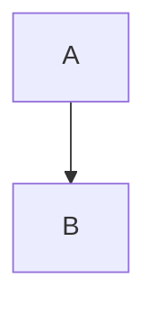

# Tokens

```ts file=libs/core/README.md region=class-token
```

```ts twoslash
const x = 1;
```

```ts no-run
server.listen(3000);
```

```sh
npm install @nexusdi/core
```


```mermaid caption="Startup"
graph TD; A-->B
```
